# 第 8 章 运动和力

1. 选择题（每题3分，共36分）

   1. 下列说法正确的是（　　）
      A. 物体的运动速度越大，惯性越大
      B. 同一物体匀速上升时，速度越快，所受拉力越大
      C. 运动的物体，如果不受力的作用就会慢慢停下来
      D. 两个相互不接触的物体，也可能会产生力的作用

   2. 如图所示，甲、乙两队正在进行拨河比赛，经过激烈比拼，甲队获胜，下列说法正确的是（　　）

      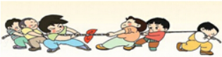

      A. 甲队对乙队的拉力大于乙队对甲队的拉力
      B. 甲队对乙队的拉力小于乙队对甲队的拉力
      C. 甲队受到地面的摩擦力小于乙队受到地面的摩擦力
      D. 甲队受到地面的摩擦力大于乙队受到地面的摩擦力

   3. 消防队员抓着竹竿从楼顶向地面匀速滑下，这过程中关于消防队员所受的摩擦力，说法正确的是（　　）
      A. 不受摩擦力
      B. 受摩擦力，方向向下
      C. 受摩擦力，方向向上
      D. 没有告诉队员质量，无法判断

   4. 行驶的车辆突然刹车时如图所示，人向前倾的原因是（　　）

      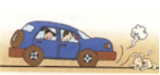

      A. 车辆对人施加一个向前的力
      B. 车辆具有惯性
      C. 人受到向前推的力
      D. 人具有惯性

   5. 人沿水平方向推装满沙子的车，如图，但没有推动，下列说法正确的是（　　）

      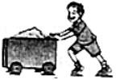

      A. 人对车的作用力小于车对人的作用力
      B. 人对车的推力小于地面对车的摩擦力
      C. 人对车的推力与地面对车的摩擦力是一对平衡力
      D. 沙子受到的重力与地面对车的支持力是一对平衡力

   6. 下列做法中，减小摩擦的是（　　）
      A. 短跑运动员穿上钉鞋
      B. 自行车刹车时，用力握手闸
      C. 车轮胎上有凹凸不平的花纹
      D. 行李箱底部安装滚轮

   7. 正在水平面上滚动的小球，如果它受到的外力同时消失，那么它将（　　）
      A. 立即停下来
      B. 慢慢停下来
      C. 做匀速直线运动
      D. 改变运动方向

   8. 下列有关牛顿第一定律的叙述正确的是（　　）
      A. 牛顿笫一定律是直接由实验得出的
      B. 牛顿第一定律是没有事实依据凭空想象的
      C. 牛顿第一定律是牛顿总结了伽利略等人的研究成果，槪括出来的一条重要规律
      D. 牛顿笫一定律认为物体没有惯性

   9. 汽车在平直的公路上做匀速直线运动，下列彼此平衡的两个力是（　　）
      A. 汽车所受的重力和汽车对地面的压力
      B. 汽车所受的摩擦力和地面对汽车的支持力
      C. 汽车所受的重力和汽车的牵引力
      D. 汽车所受的重力和地面对汽车的支持力

   10. 一个球沿斜面匀速滚下，图中关于该小球受力的示意图正确的是（　　）

       A. 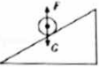	B. 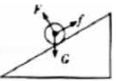	C. 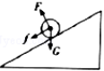	D. 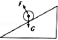

   11. 考试时，许多同学有一个不良习惯，将笔放在手指上不停地转圈，笔会经常掉到地面或桌面上发出噪声。下列说法正确的是（　　)
       A. 笔在下落过程中不受力的作用
       B. 笔停在静止的手指上时受到平衡力作用
       C. 笔在手指拨动时才会连续转圈，说明力是维持物体运动的原因
       D. 手指不拨动笔，笔也会在手指上继续转动一段时间，说明笔与手指间不存在摩擦力

   12. 一只氢气球下系一重为 $G$ 的物体 P，在空中做匀速直线运动，如果不计空气阻力和风力的影响，物体恰能沿 MN 方向（如图所示箭头指向）斜线上升，图中 $OO'$ 为竖直方向，则图中氢气球和物体 P 所处的情况正确的是（　　）

       A. 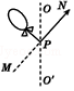		B. 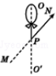		C. 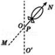		D. 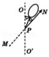

2. 填空题

   1. 在如图所示的一些与物理相关的生活现象中，甲图中国撑杆发生弯曲，说明了力能 $\underline{\qquad\qquad}$ ；乙图中乘客在汽车紧急刹车时向前倾倒是因为乘客 $\underline{\qquad\qquad}$ 。

      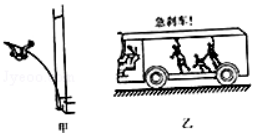

   2. 如图所示，在水平桌面上一本静止的书上竖直放置一块橡皮，当书突然向右运动时，橡皮将会 $\underline{\qquad\qquad}$ ；如果书表面绝对光滑，上述现象中橡皮将会 $\underline{\qquad\qquad}$ 。（以上两空选填「向右倾倒」、「向左倾倒」或「保持静止」）

      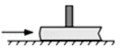

   3. 今年中国男足在陕西举行的世界杯亚洲区预选赛中，2 比 0 击败卡塔尔队，奇迹般地晋级 12 强。球员争顶后顶出的球在上升过程中受到 $\underline{\qquad\qquad}$ （选填「平衡力」或「非平衡力」)作用，足球最后会落回地面是因为受 $\underline{\qquad\qquad}$ 的作用。
   4. 小强行走时被石块绊了一下，身体向前倾倒，对此情景合理的解释是：小强原来相对于地面是 $\underline{\qquad\qquad}$ 的，当他的 $\underline{\qquad\qquad}$ （选填「脚」或「上身」）的运动状态突然改变时，他的 $\underline{\qquad\qquad}$ （选填「脚」或「上身」）由于惯性仍保持原来的运动状态。
   5. 用 $5\ N$ 的水平拉力拉着重 $10\ N$ 的长方体木块在水平桌面上做匀速直线运动，木块受到桌面的摩擦力是 $\underline{\qquad\qquad}$ ．将木块的三分之一切下后叠放在一起（不考虑质量损失），并拉着木块在同一桌面上做匀速直线运动，木块受到桌面的摩擦力 $\underline{\qquad\qquad}$ （选填「增大」、「减小」、「不变」）
   6. 张老师的质量大约为 $60$ $\underline{\qquad\qquad}$ ，他用 $1\ N$ 的力沿水平方向推一辆在水平桌面上的小车，小车以较慢的速度沿力的方向做匀速直线运动；当他推着小车以较快的速度在水平桌面上沿力的方向做匀速直线运动时，所用的推力应该 $\underline{\qquad\qquad}\ 1\ N$ （选填「大于」、「小于」或「等于」）。
   7. 自行车是我们熟悉的交通工具，从自行车的结构和使用来看，它涉及到不少有关摩擦的知识。例如：轮胎上刻有花纹，是通过 $\underline{\qquad\qquad}$ 来增大摩擦的：刹车时用力捏闸，是通过 $\underline{\qquad\qquad}$ 来增大摩擦的；滚动轴承的内外圈之间装有钢球或钢柱，是通过 $\underline{\qquad\qquad}$ 来减小摩擦的。
   8. 山体滑坡是一种强降雨天气极易发生的自然灾害，强降雨时，由于雨水浸入，有些本来不够稳固的山体的不同地质层（板块）之间摩擦力 $\underline{\qquad\qquad}$ ，部分山体在 $\underline{\qquad\qquad}$ 的作用下向下滑动而导致山体滑坡。

3. 作图题

   1. 如图所示，一瓶镇江香醋静止在水平桌面上，请画出它所受力的示意图。

      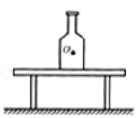

   2. 如图所示，小球被压缩的弹簧弹出，请画出小球在水平地面上滚动的过程中的受力示意图。

      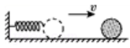

   3. 如图甲所示，在水平公路上匀速行驶的太阳能汽车受到两对平衡力的作用，请在图乙上画出汽车受力的示意图。

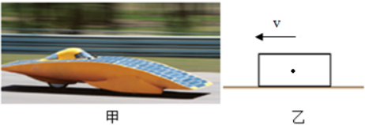

4. 实验与探究题（24题4分，25题8分，26题8分，共20分)

   1. 如图所示，在探究「阻力对物体运动的影响」的实验中，下列说法正确的是（　　）

      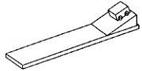

      A. 实验中不需要控制小车每次到达斜面底端时速度相同
      B. 小车最终会停下来说明力是维持物体运动状态的原因
      C. 如果小车到达水平面时所受外力全部消失，小车将做匀速直线运动
      D. 小车停止运动时惯性也随之消失

   2. 在「探究滑动摩擦力的大小与什么因素有关」的实验中，同学们提出了以下猜想：
      A．滑动摩擦力的大小与接触面受到的压力大小有关
      B．滑动摩擦力的大小与接触面的粗糙程度有关
      C．滑动摩擦力的大小与接触面面积的大小有关
      某小组根据猜想进行了以下实验，如图所示（图中的木块、长木板完全相同）。

      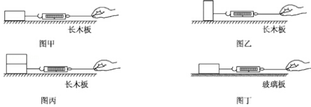

      1. 用弹簧测力计匀速拉动木块，使它沿水平方向滑动的目的是 $\underline{\qquad\qquad}\underline{\qquad\qquad}\underline{\qquad\qquad}$ ；
      2. 利用图 $\underline{\qquad\qquad}$ 和图 $\underline{\qquad\qquad}$ 可探究猜想 A；
      3. 利用图 $\underline{\qquad\qquad}$ 和图 $\underline{\qquad\qquad}$ 可探究猜想 B；
      4. 利用图 $\underline{\qquad\qquad}$ 和图 $\underline{\qquad\qquad}$ 可探究猜想 C。

   3. 图甲是小华「探究二力平衡条件」的实验

      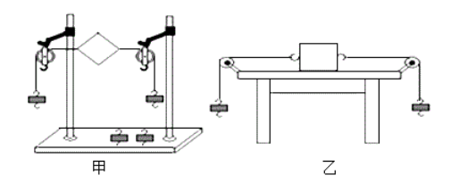

      1. 小华将系于小卡片（重力可忽略不计）两对角的线分别跨过左右支架的滑轮上，在线的两端挂上钩码，使作用在小卡片上的两个拉力方向 $\underline{\qquad\qquad}$ ，并通过改变 $\underline{\qquad\qquad}$ 来改变拉力的大小。
      2. 当小卡片平衡时，小华将小卡片旋转过一个角度，松手后小卡片 （选填「能」或「不能」）平衡。设计此实验步骤的目的是为了探究 $\underline{\qquad\qquad}$ 两个力能否平衡。
      3. 在探究同一间题时，小华还设计了如图乙所示的实验装置。在实验时，甲、乙装置相比，$\underline{\qquad\qquad}$（选填「甲」或「乙」） 更好些，其主要原因是 $\underline{\qquad\qquad}\underline{\qquad\qquad}\underline{\qquad\qquad}$ 。

5. 综合运用题

   1. 我国自主研发的长航程极地漫游机器人。机器人质量约 $500\ kg$，装有四条三角形履带，2013 年 2 月，首次在南极内陆冰盖完成了 $27\ km$ 的自主行走。求：
      1. 该机器人所受到的重力是多少？
      2. 本次自主行走共耗时 $0.5\ h$，则它的平均速度为多少？

   

   

   

   

   

   

   

   2. 如图甲所示，完全相同的两物块 A、B 叠放在水平面上，在 $20\ N$ 的水平力 $F_1$ 的作用下一起做匀速直线运动：
      1. 此时物块 A 所受的摩擦力为多少牛？
      2. 若将 A、B 物块按图乙所示紧靠放在水平面上，用水平力 $F_2$ 推 A，使它们一起做匀速直线运动，则推力 $F_2$ 为多少牛？

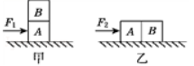

