# 9 压强

1. 用如图所示的实验装置来测量液体的密度，将一个带有阀门的三通U形管倒置在两个装有液体的容器中，用抽气机对 U 形管向外抽气，再关闭阀门 $K$，已知左边液体的密度为 $\rho_1$，左右两边液柱高度分别为 $h_1$，$h_2$，则下列说法正确的是（　　）

   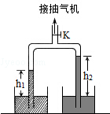

   A. 实验中必须将 U 形管内抽成真空
   B. 若将 U 形管倾斜，左右两边液柱高度差会增大

   C. 右边液体的密度 $\rho_2=\large\frac{\rho_1h_1}{h_2}$

   D. 右边液体的密度 $\rho_2=\large\frac{\rho_1h_2}{h_1}$

2. 如图是一种「吸盘式」挂衣钩。将它紧压在平整、光洁的竖直玻璃上，可挂衣帽等物品。它主要部件是一个「橡皮碗」，下面有关的说法错误的是（　　）

   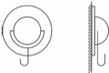

   

   A. 被玻璃「吸」住后，皮碗内的气压小于大气压
   B. 皮碗内挤出的空气越少，吸盘贴在玻璃上就越紧
   C. 皮碗与玻璃之间的摩擦阻止衣物向下的移动
   D. 不能紧贴在粗糙的水泥墙壁上，粗糙面与吸盘之间有缝隙、会漏气

3. 如图所示，是托里拆利实验的规范操作过程。关于托里拆利实验，下面说法错误的是（　　）

   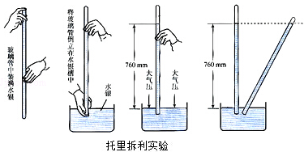

   A. 实验中玻璃管内水银面的上方有少量空气
   B. 是大气压支持玻璃管内这段水银柱不会落下
   C. 大气压的数值等于这段水银柱产生的压强
   D. 玻璃管倾斜不影响实验测量结果

4. 学过「压强」的知识后，某同学设计制作了如图所示装置来抽水，当活塞上升到管口 S 后再继续上升，将发生的现象是（　　）

   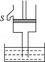

   A. 水从管口 S 不断流出
   B. 水面随活塞继续上升
   C. 水面将下降
   D. 上述三种情况都有可能

5. 如图所示，从倒置的漏斗口用力吸气或向下吹气，乒乓球都不会掉下来。下列说法正确的是（　　）

   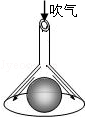

   A. 吸气或吹气都减小了乒乓球上方气体的压强
   B. 吸气或吹气都增大了乒乓球下方气体的压强
   C. 吸气减小了乒乓球上方气体的压强，吹气增大了乒乓球下方气体的压强
   D. 吸气增大了乒乓球下方气体的压强，吹气减小了乒乓球上方气体的压强

6. 下列关于压强的说法正确的是（　　）
   A. 飞机升力是由于机翼上下表面的空气流速不同造成压强差所引起的
   B. 拦河坝设计成下宽上窄，利用了液体压强大小随深度增加而减小
   C. 菜刀的刀刃薄，是通过减小受力面积来减小压强
   D. 马德堡半球实验首次测出大气压强值

7. 如图所示，在水平桌面上放有甲、乙、丙、丁四个底面积均为 $0.01\ m^2$ 的薄壁空杯，其中甲图为柱形空杯，四个空杯子对桌面的压强均为 $100\ Pa$．当在其中一个空杯中装入 $0.9\ kg$ 的水后，水对杯底产生的压强为 $900\ Pa$；则这个杯子的形状可能是图中的（取 $g=10\ N/kg$）（　　）

   A. 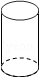	B. 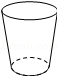	C. 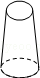	D. 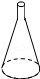

8. 甲、乙两个实心正方体放在细沙面上，沙面凹陷程度如图所示，则（　　）

   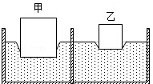

   A. 甲的质量一定比乙大
   B. 甲的质量一定比乙小
   C. 甲的密度一定比乙大
   D. 甲的密度一定比乙大

9. 三个质量相同，底面积相同，但形状不同的容器放在水平桌面上，其内分别装有甲、乙、丙三种液体，它们的液面在同一水平面上，如图所示，若容器对桌面的压强相等，则三种液体对容器底的压强（　　）

   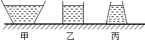

   A. 甲最大
   B. 乙最大
   C. 丙最大
   D. 一样大

10. 菜刀的刀刃很薄，刀柄宽厚。对此，以下说法中正确的是（　　）
    A. 刀刃很薄可增大压力
    B. 刀柄宽厚可减小压力
    C. 刀刃很薄可增大压强
    D. 刀柄宽厚可增大压强

11. 如果一个人在冰面上散步，当冰面快要破裂时，他采取的自救方法最恰当的是（　　）
    A. 马上站立不动
    B. 马上抬起一只脚不动
    C. 快速跑向安全区
    D. 趴下平躺爬向安全区

12. 如图，往浴缸中匀速注水直至注满，下列表示此过程中浴缸底部受到水的压强随时间变化的曲线，其中合理的是（　　）

    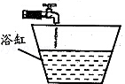

    A. 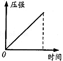B. 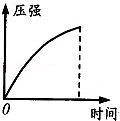C. 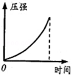D. 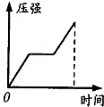

13. 如图所示的装置中不是利用连通器原理工作的是（　　）

    A. 茶壶
    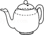

    B. 锅炉水位计

    C. 盆景的自动给水装置
    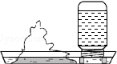

    D、乳牛自动喂水器
    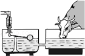

14. 小张为研究「吸管中的饮料是被吸上来的？还是被压上来的？」这一问题时，设计了如图所示的实验。当用力推注射器活塞时，广口瓶内的气压将 $\underline{\qquad\qquad}$ （选填「大于」「小于」或「等于」）直玻璃管内的气压，能观察到的现象是 $\underline{\qquad\qquad\qquad\qquad}$ 。此实验 $\underline{\qquad\qquad}$ （选填「能」或「不能」）验证「饮料是被气压压上来的」这一结论。

    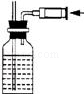

15. 打开自来水龙头，使自来水流过如图所示的玻璃管，在 A、B、C 三处，水的流速较大的是 $\underline{\qquad\qquad}$ 处，压强较小的是 $\underline{\qquad\qquad}$ 处（选填 A, B 或 C）。

    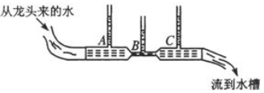

16. 如图所示，同种材料制成的实心圆柱体 A 和 B 放在水平地面上，高度之比 $h_A:h_B=2:1$，底面积之比 $S_A:S_B=1:2$，则它们对地面的压强之比 $p_A:p_b=\underline{\qquad\qquad}$。

    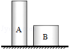

17. 如图所示，用压强计“探究影响液体内部压强大小的因素”。

    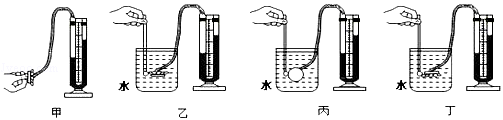

    1. 图甲所示压强计是通过 U 形管中水面 $\underline{\qquad\qquad}$ 来反映被测压强大小的。

    2. 若在使用压强计前，发现 U 形管内水面已有高度差，通过 $\underline{\qquad\qquad}$ （填写正确选项前字母）方法可以进行调节。

       A. 从U形管内向外倒出适量水；
       B. 拆除软管重新安装；
       C. 向U形管内添加适量水；

    3. 比较乙图、丙图和丁图，可以得到：在同一深度，液体内部向各个方向的压强 $\underline{\qquad\qquad}$ 。
    4. 在乙图中，若只将烧杯中的水换成同深度的盐水，其他条件不变，则可以观察到 U 形管两边液面的高度差将  $\underline{\qquad\qquad}$ 。（选填「变大」「变小」或「不变」）。
    5. 若在步骤（4）时，图乙中U形管左右两侧水面的高度差 $h=5\ cm$，则橡皮管内气体的压强与大气压之差约为 $\underline{\qquad\qquad}\ Pa$ 。（ $\rho_{盐水}=1.2\times10^3\ kg/m^3,\ \rho_水=1.0\times10^3\ kg/m^3,\ g=10\ N/Kg$）

18. 如图所示，为小丽在「研究影响压力作用效果的因素」实验中所选用的器材在水平桌面上进行的实验过程图示。

    1. 本实验的科学探究方法是： $\underline{\qquad\qquad}$ ；

    2. 小丽为了探究压力作用的效果跟压力大小的关系，应该通过图中的 $\underline{\qquad\qquad}$ 两次实验进行比较得出结论：为了探究压力作用的效果跟受力面积大小的关系，应该通过图中的 $\underline{\qquad\qquad}$ 两次实验进行比较得出结论；

    3. 通过实验小丽得出结论：压力作用的效果不仅跟压力的大小有关，而且跟受力面积有关。小丽的结论 $\underline{\qquad\qquad}$ （选填“正确”或“不正确”）

    4. 在生活中，书包的背带做得又宽又大，这是利用了： $\underline{\qquad\qquad}$ 来减少压力作用的效果；压路机的碾子很重，这是利用了： $\underline{\qquad\qquad}$ 来增加压力作用的效果。

       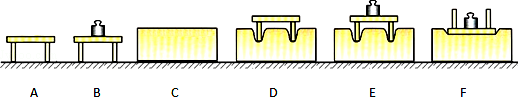

19. 如图，置于水平桌面上的容器装有某种液体。液体的体积为 $2.0\times10^{-3}\ m^3$，液体的深为 $0.5\ m$，若容器重为 $20\ N$、底面积为 $2.0\times10^{-3}\ m^2$，容器底受到液体的压强为 $5.0\times10^3\ Pa$．（$g$ 取 $10\ N/kg$）求：

    1. 液体的密度。

    2. 液体对容器底的压力。

    3. 这个装着液体的容器对桌面的压强。

       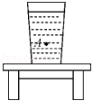

        

        

        

        

        

       

20. 如图所示，铁桶重为 $20\ N$，桶的底面积为 $100\ cm^2$，往桶里倒入 $8\ kg$ 的水，水的深度为 $15\ cm$，平放在面积为 $1\ m^2$ 的水平台面上（$g$ 取 $10\ N/kg$）。求：

    1. 水对桶底的压强；

    2. 桶底受到水的压力；

    3. 台面受到桶的压强。

       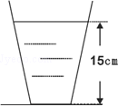

