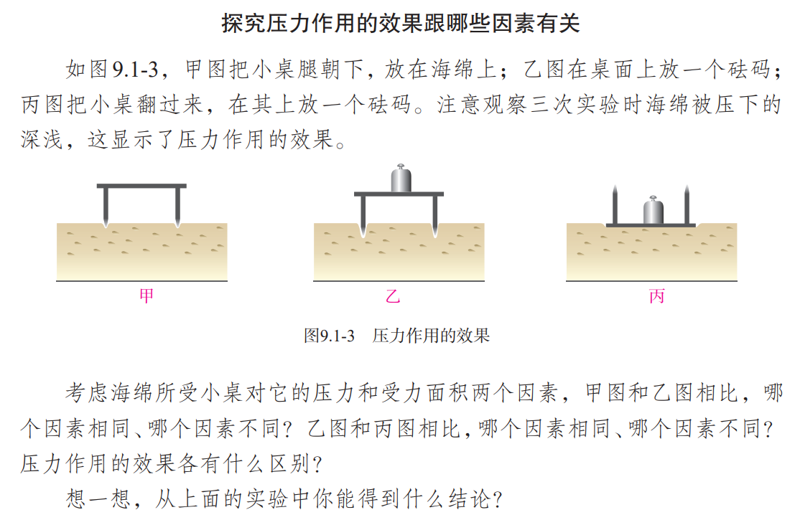
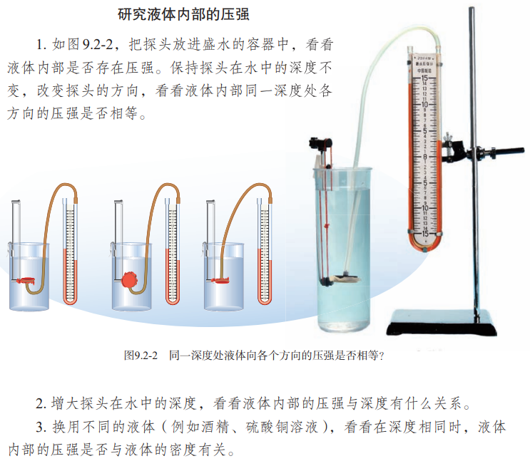
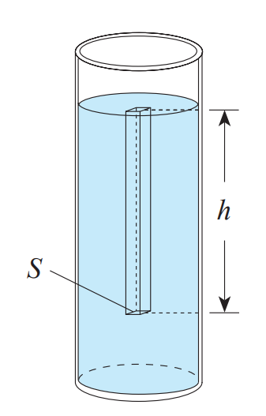
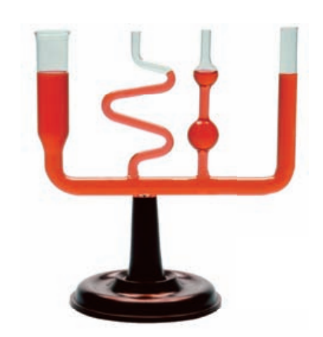
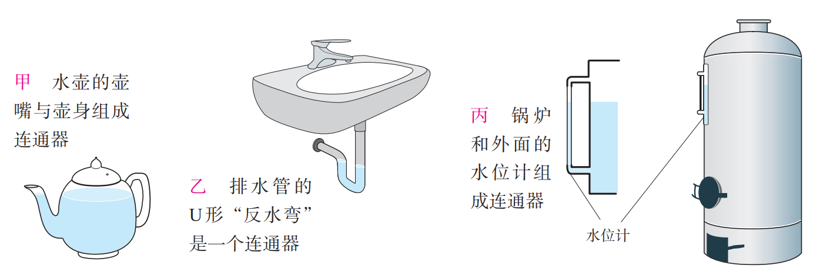
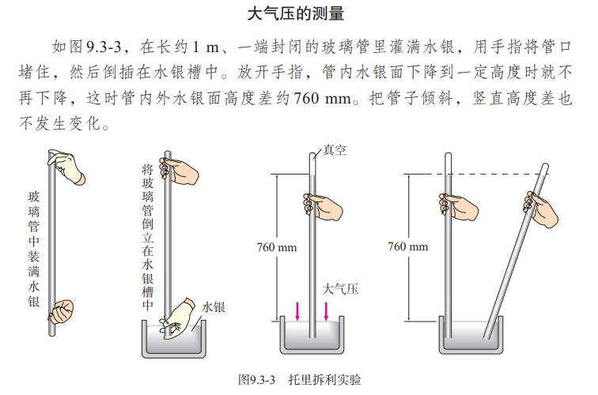
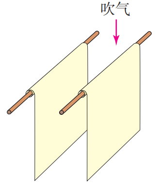
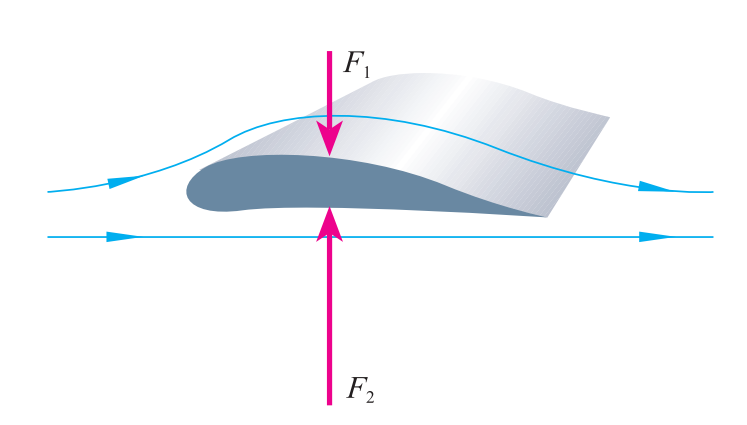

# 第 9 章 压强

[toc]

## 压强

### 压强

物体所受压力大小与受力面积之比叫做压强。如果用 $p$ 表示压强，$F$ 表示压力，$S$ 表示物体的受力面积：
$$
\huge P=\frac{F}{S}
$$
压强再数值上等于物体单位面积所受的压力。压强越大，压力产生的效果越明显。

压强的单位是牛每平方米，有一个专用名称叫做帕斯卡，简称帕，符号是 $\text{Pa}$。

### 怎样增大或减小压强

+ 增大压强
  + 增大压力
  + 减小受力面积
+ 减小压强
  + 减小压力
  + 增大受力面积

## 液体的压强

### 液体压强的特点

+ 液体内部压强大小特点
  + 在液体内部的同一深度，向各个方向的压强都相等。
  + 深度越深，压强越大。
  + 液体内部压强的大小与液体的密度有关。
    + 深度相同时，液体的密度越大，压强越大。

### 液体压强的大小

需要计算液面下某处的压强，可以假设在该处有一个「平面」，这个平面以上的液柱对平面的压力等于液柱所受的重力，假设液柱的高度为 $h$，平面的面积为 $S$。

$$
\begin{aligned}
F_压&=G\\
&=mg\\
&=\rho V\cdot g\\
&=\rho \cdot Sh\cdot g\\
\\
p&=\frac{F}{S}\\
&=\rho g h
\end{aligned}
$$
即深度为 $h$ 处液体的压强为：
$$
p=\rho gh
$$

### 连通器

上端开口，下端联通的容器叫做连通器。

连通器里的同种液体不流动时，各容器中的液面高度总是相同的

## 大气压强

### 大气压强的存在

大气压强简称为大气压（atmosphere）或气压。

### 大气压的测量

$$
\begin{aligned}
p_0&=\rho g h\\
&=1.36\times10^4\ kg\cdot m^{-3}\times 9.8\ N\cdot kg^{-1}\times 0.76\ m\\
&=1.013\times10^5\ Pa
\end{aligned}
$$
大气压能够支持多高的水柱？

---

测量大气压的仪器叫做气压计。

## 流体压强与流速的关系

### 流体压强与流速的关系

具有流动性的液体和气体统称流体。流体中，流速越大的位置，压强越小。

### 飞机的升力

