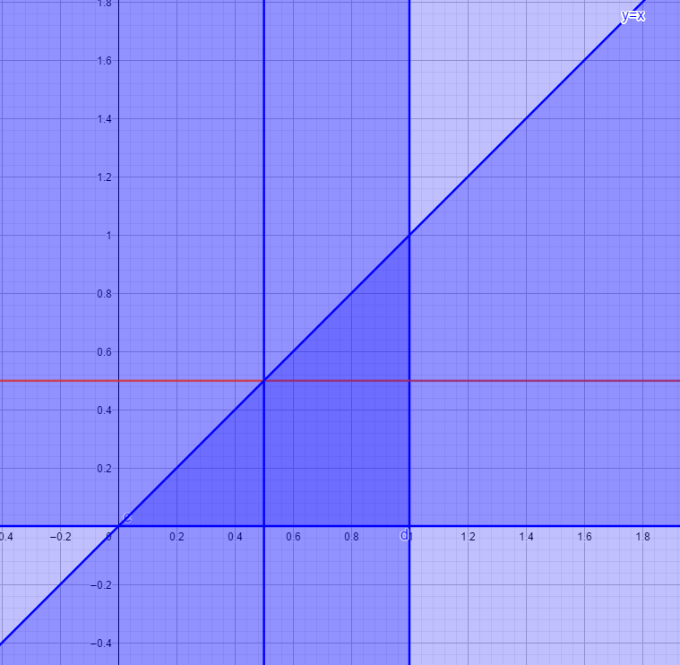

(1)
写为联合分布律:

| X\Y   | $0$            | $1$           | $3$            | $p_X$          |
| ----- | -------------- | ------------- | -------------- | -------------- |
| $0$   | $\frac{1}{6}$  | $0$           | 0              | $\frac{1}{6}$  |
| $-1$  | $0$            | $\frac{1}{3}$ | $\frac{1}{12}$ | $\frac{5}{12}$ |
| $2$   | $\frac{5}{12}$ | $0$           | 0              | $\frac{5}{12}$ |
| $p_Y$ | $\frac{7}{12}$ | $\frac{1}{3}$ | $\frac{1}{12}$ |                |

边缘分布律为:

| $X$   | $0$           | $-1$           | $2$            |
| ----- | ------------- | -------------- | -------------- |
| $p_X$ | $\frac{1}{6}$ | $\frac{5}{12}$ | $\frac{5}{12}$ |

| $Y$   | $0$            | $1$           | $3$            |
| ----- | -------------- | ------------- | -------------- |
| $p_Y$ | $\frac{7}{12}$ | $\frac{1}{3}$ | $\frac{1}{12}$ |

$$
\begin{aligned}
    \because P\{X=0,Y=0\}&=\frac{1}{6}\\
    &\neq\frac{1}{6}\times\frac{7}{12}\\
    即P\{X=0,Y=0\}&\neq P\{X=0\}P\{Y=0\}\\
    \therefore X与Y不相互独立
\end{aligned}
$$

(6)

<1>因为
$\begin{aligned} \int_{-\infty}^{+\infty} \int_{-\infty}^{+\infty} p(x, y) \mathrm{d} x \mathrm{~d} y &=\int_{0}^{1} \int_{0}^{x} c x y \mathrm{~d} y \mathrm{~d} x=\int_{0}^{1}\left(c x \frac{y^{2}}{2}\right)_{0}^{x} \mathrm{~d} x \\ &=\int_{0}^{1} \frac{c x^{3}}{2} \mathrm{~d} x=\left.\frac{c}{8} x^{4}\right|_{0} ^{1}=\frac{c}{8}=1 \end{aligned}$
所以 $c=8$

<2>因为
$p_{X}(x)=\int_{-\infty}^{+\infty} p(x, y) \mathrm{d} y=\left\{\begin{array}{l}\int_{0}^{x} 8 x y \mathrm{~d} y=4 x^{3}, 0<x<1 \\ 0, \text { 其他 } ;\end{array}\right.$
$p_{Y}(y)=\int_{-\infty}^{+\infty} p(x, y) \mathrm{d} x=\left\{\begin{array}{l}\int_{y}^{1} 8 x y \mathrm{~d} x=4 y-4 y^{3}, 0<y<1 \\ 0, \text { 其他 } ;\end{array}\right.$
$P(x, y) \neq p_{X}(x) \cdot p_{Y}(y)$, $\therefore$ $X$ 与 $Y$ 不相互独立;

$\begin{array}{l}
\text { <3> } P(A)=P\{0<X<0.5\}=\int_{0}^{0.5} 4 x^{3} \mathrm{~d} x=\left.x^{4}\right|_{0} ^{0.5}=\frac{1}{16} \text { ， }\\
P(B)=P\{0<Y<0.5\}=\int_{0}^{0.5}\left(4 y-4 y^{3}\right) \mathrm{d} y=\left(2 y^{2}-y^{4}\right)_{0}^{0.5}=\left(\frac{1}{2}-\frac{1}{16}\right)=\frac{7}{16}
\end{array}$

