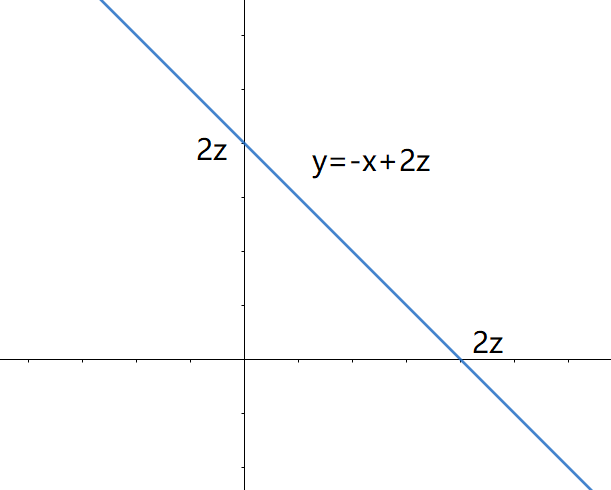

# 习题3.2

9.若$(X,Y)$的分布密度为
$$
p(x,y)=
\left \{
	\begin{array}{}
        &e^{-(x+y)},\quad&x>0,y>0\\
        &0,&其他

	\end{array}
\right .
$$
试求$Z=\frac{1}{2}(X+Y)$的分布密度

解:设$Z=\frac{1}{2}(X+Y)$的分布函数为$F_z(Z)=P(Z<z)$如上图
$$
\begin{aligned}
    P\left \{ \frac{1}{2}(X+Y)<z\right \}&=
    \left \{ 
        \begin{array}{}
            &\int_0^{2x}dx\int_0^{2z-x}e^{-x}\cdot e^{-y}dy,&z>0\\
            &0,&z\leq0
        \end{array}
    \right .\\
    &=       
    \left \{ 
        \begin{array}{}
            &\int_0^{2x}e^{-x}(1-e^{x-2z})dx,&z>0\\
            &0,&z\leq0
        \end{array}
    \right .\\
    \therefore p_{z}(z)&=\left\{\begin{array}{cl}
4 z \mathrm{e}^{-2 z}, & z>0 \\
0, & z \leqslant 0
\end{array}\right.
\end{aligned}
$$

11.若$X$与$Y$相互独立且都服从$U(0,1),$试求$min(X,Y)$与$max(X,Y)$的分布密度.

解 设 $Z_{1}=\min (X, Y)$, 分布函数为
$$
\boldsymbol{F}_{z_{1}}(z)=1-\left(1-F_{x}(z)\right)^{2}
$$
$\therefore$ $Z_{1}$ 的分布密度:
$$
p_{z_{1}}(z)=2\left(1-F_{X}(z)\right) p_{X}(z)\\
\begin{gathered}
\because F_{X}(z)=\left\{\begin{array}{ll}
0, & z \leqslant 0, \\
z, & 0<z \leqslant 1, \\
1, & z>1,
\end{array}\right. \\
\therefore p_{z_{1}}(z)=\left\{\begin{array}{cc}
2(1-z), & z \in(0,1) \\
0, & z \notin(0,1)
\end{array}\right.
\end{gathered}
$$
设 $Z_{2}=\max (X, Y)$, 分布函数为 $F_{z_{2}}(z)=F_{X}^{2}(z)$, 则 $Z_{2}$ 的分布密度
$$
p_{z_{2}}(z)=2 F_{X}(z) p_{X}(z)=\left\{\begin{array}{ll}
2 z, & z \in(0,1), \\
0, & z \notin(0,1)
\end{array}\right.
$$
