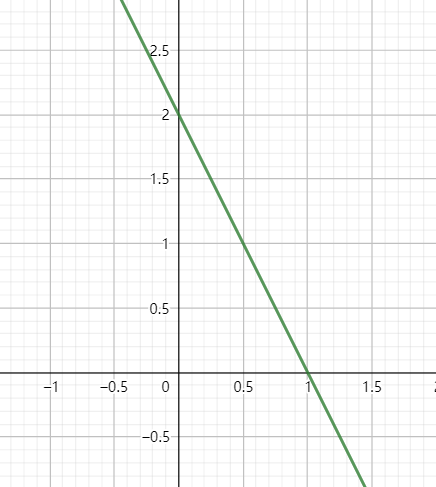

# 习题4.1

$$
\begin{aligned}
&\text { 1. } X \text { 的分布律如下，试求}(1) D E(X), D(X) ; \text { (2) } E(-2 X+1), D(-2 X+1) ; \text { (3) }\\
&E\left(X^{2}\right), D\left(X^{2}\right)\\
&\begin{array}{c|cccc}
\hline X & -1 & 0 & 1 & 2 \\
\hline P & \frac{1}{4} & \frac{3}{8} & \frac{1}{4} & \frac{1}{8} \\
\hline
\end{array}
\end{aligned}
$$

$$
\begin{aligned}解  (1) E(X)&=(-1) \times \frac{1}{4}+0 \times \frac{3}{8}+1 \times \frac{1}{4}+2 \times \frac{1}{8}\\
&=\frac{1}{4} ,\\
 D(X)&=E[X-E(X)]^{2}\\
 &=\left(-1-\frac{1}{4}\right)^{2} \times \frac{1}{4}+\left(0-\frac{1}{4}\right)^{2} \times \frac{3}{8}+\left(1-\frac{1}{4}\right)^{2} \times \frac{1}{4} 
 +\left(2-\frac{1}{4}\right)^{2} \times \frac{1}{8}\\
 &=\frac{15}{16} \\
(2)  \quad E(-2 X+1)&=-2 E(X)+1\\
&=-2 \times \frac{1}{4}+1\\
&=\frac{1}{2} ,\\
 D(-2 X+1)&=(-2)^{2} \\D(X)&=4 \times \frac{15}{16}\\
 &=\frac{15}{4} \\
(3)  E\left(X^{2}\right)&=(-1)^{2} \times \frac{1}{4}+0^{2} \times \frac{3}{8}+1^{2} \times \frac{1}{4}+2^{2} \times \frac{1}{8}\\
&=1 \\
 E\left(X^{4}\right)&=(-1)^{4} \times \frac{1}{4}+0^{4} \times \frac{3}{8}+1^{4} \times \frac{1}{4}+2^{4} \times \frac{1}{8}\\
 &=\frac{5}{2} \\
 D\left(X^{2}\right)&=E\left(X^{4}\right)-\left[E\left(X^{2}\right)\right]^{2}\\
 &=\frac{5}{2}-1^{2}\\
 &=\frac{3}{2} 
 \end{aligned}
$$

$$4.设  (X, Y)  服从区域  A  上的均匀分布,且  A  由  x  轴、  y  轴及直线  x+\frac{y}{2}=1  所围成, 试求: (1)  E(X), D(X) ;  (2)  E(Y), D(Y) ; (3)  E(X Y), D(X Y) $$

$$
解:如图 p(x, y)=\left\{\begin{array}{ll}1, & 0<x<1,0<y<2-2 x, \\ 0, & \text { 其他 },\end{array}\right. 
\\则
(1)  p_{X}(x)=\left\{\begin{array}{c}\int_{0}^{2-2 x} 1 \mathrm{~d} y=2-2 x, \quad 0<x<1, \\ 0, & \text { 其他. } \end{array}\right. \\
\\ E(X)=\int_{-\infty}^{+\infty} x p_{X}(x) \mathrm{d} x=\int_{0}^{1} x(2-2 x) \mathrm{d} x=\frac{1}{3} \\ E\left(X^{2}\right)=\int_{0}^{1} x^{2}(2-2 x) \mathrm{d} x=\frac{1}{6}, \\ D(X)=E\left(X^{2}\right)-[E(X)]^{2}=\frac{1}{6}-\frac{1}{9}=\frac{1}{18}
\\(2)  E(Y)=\int_{-\infty}^{+\infty} \int_{-\infty}^{+\infty} y p(x, y) \mathrm{d} x \mathrm{~d} y=\int_{0}^{2} \mathrm{~d} y \int_{0}^{1-\frac{1}{2}} y \mathrm{~d} x=\frac{2}{3} \\
D(Y)=\int_{-\infty}^{+\infty} \int_{-\infty}^{+\infty}(y-E(Y))^{2} p(x, y) \mathrm{d} x \mathrm{~d} y \\
=\int_{0}^{2} \mathrm{~d} y \int_{0}^{1-\frac{1}{2}}\left(y-\frac{2}{3}\right)^{2} \mathrm{~d} x=\frac{2}{9} \\
\begin{array}{l}

\text { (3) } E(X Y)=\int_{0}^{2} \mathrm{~d} y \int_{0}^{1-\frac{y}{2}} x y \mathrm{~d} x=\frac{1}{6}, \\E\left(X^{2} Y^{2}\right)=\int_{0}^{2} \mathrm{~d} y \int_{0}^{1-\frac{1}{2}} x^{2} y^{2} \mathrm{~d} x=\frac{2}{45} \\
D(X Y)=E\left(X^{2} Y^{2}\right)-[E(X Y)]^{2}=\frac{2}{45}-\left(\frac{1}{6}\right)^{2}=\frac{1}{60}
\end{array}
$$

$$
7.随机变量  X_{1}, X_{2}, X_{3}  相互独立,其中  X_{1}  在区间 [ 0,6 ]上服从均匀分布， \\ X_{2}  服从  N(0,4), X_{3}  服从参数为  \lambda=3  的泊松分布,记  Y=X_{1}-2 X_{2}+3 X_{3} , \\则  D(Y)= 46 \\

$$

$$
\text { 8. } X \text { 服从参数为 } 1 \text { 的指数分布,则数学期望 } E\left(X+\mathrm{e}^{-2 X}\right)= \frac{4}{3}
$$

# heading one