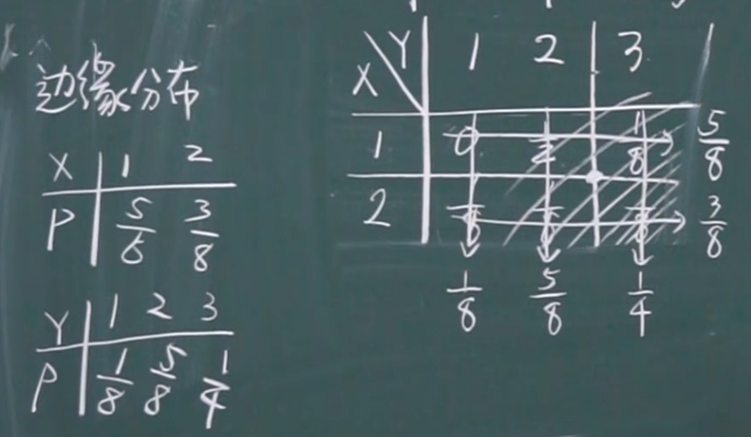
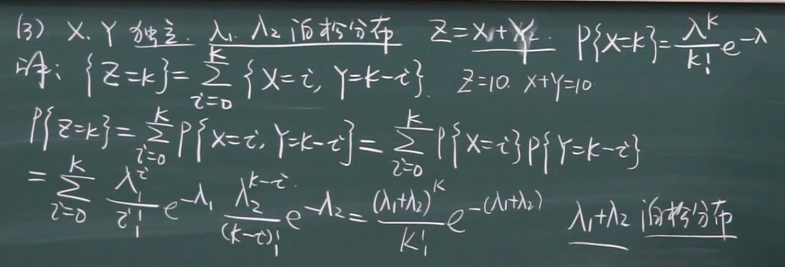

# 第一章 随机事件的概率

## 随机试验与随机事件

### 对立与互斥

对立是互斥的特殊情形，是更严格的互斥。

### 事件的复合

$$
\begin{aligned}
逻辑与:AB&=A\&B\\
逻辑或:A\cup B&=A|B=A+B\\
逻辑非:\overline{A}&=!A\\
\end{aligned}
$$

>   另:$A\overline{B}=A-B$

## 随机事件的概率

### 经验概率

基于经验的概率,这里经验指的是试验,当试验次数足够多时,某事件的经验概率等于该事件发生的频率

### 古典概率

如掷骰子

(1)样本空间中基本事件数有限;
(2)各基本事件出现的**可能性相等**,则称这样的随机事件的概率为古典概率.

常用到排列组合:
$$
A_n^m=\frac{n!}{(n-m)!}\qquad C_n^m=\frac{n!}{m!(n-m)!}
$$

### 几何概率

(1)样本空间中基本事件有无限个;
(2)各基本事件出现的可能性相同(将各基本事件看作某区域G中的一个点)

几何概率会出现概率为0但事件可能发生的情况

## 概率的计算公式

画 Venn 图

### 和

$P(A\cup B) =P(A) +P(B)-P(AB)$

### 差

画图

### 条件概率公式

$$
P(B \mid A)=\frac{P(A B)}{P(A)}
$$

画图

### 全概率公式

---

10台产品中,7台正品,3台次品,已售出2台,求售出第3台是正品的概率
$$
设B=\{第三次是正品\}\\
写出完备事件组A_0=\{已售2台都是次品\},A_1=\{已售2台1次1正\},A_2=\{已售2台都是正品\}\\
P(B)=P(A_0)P(B|A_0)+P(A_1)P(B|A_1)+P(A_2)P(B|A_2)
$$

### 贝叶斯公式

已经知道结果,求引起结果的原因的概率(多个原因)
$$
P\left(A_{j} \mid B\right)=\frac{P\left(B A_{j}\right)}{P(B)}=\frac{P\left(A_{j}\right) P\left(B \mid A_{j}\right)}{\sum_{i=1}^{n} P\left(A_{i}\right) P\left(B \mid A_{i}\right)}
$$

## 事件的相互独立

A事件发生的概率不受B事件发生与否的影响
$$
P(A|B)=P(A)
$$

>   B事件发生的条件下,A事件发生的概率仍是P(A)

>   独立事件一定相容
>
>   互不相容事件一定不独立,因为互不相容事件其一发生,另外的就一定不会发生
>   而独立事件之间发生与否没有影响

---

:star:如果A,B事件相互独立,有:
$$
P(AB)=P(A)P(B)
$$

>   空集$\Phi$,全集$\Omega$与任意事件独立
>
>   P(A)=0或P(A)=1,则A与任意事件独立
>   与上一条没有关系(分析几何概型)

---

已知$P(A+B)=0.9,P(A)=0.4$求$P(B)$

(1)A,B互不相容

>   不同时发生

$$
\begin{aligned}
\because A,B互不相容,A&=\Phi,P(AB)=0\\
P(A+B)&=P(A)+P(B)-P(AB)\\
0.9&=0.4+P(B)\\
P(B)&=0.5
\end{aligned}
$$
(2)A,B相互独立

>   发生与否互不影响

$$
\begin{aligned}
\because A,B独立,P(AB)&=P(A)P(B)\\
P(A+B)&=P(A)+P(B)-P(AB)\\
0.9&=0.4+P(B)+0.4P(B)\\
P(B)=\frac{5}{6}
\end{aligned}
$$

---

破译密码,每个人破译出密码的概率是0.6,要以0.99的概率破译,需要几个人?

破译不了的概率为$1-0.99=0.01$, 让$(1-0.6)^n=0.01$

---

已知$0<P(A)<1,0<P(B)<1,P(A|B)+P(A|\overline{B})=1,$证明:$A,B$相互独立
$$
在任何情况下,都有P(A|\overline{B})+P(\overline{A}|\overline{B})=1\\
则P(A|\overline{B})=P(A|B)\\
\frac{P(A\overline{B})}{P(\overline{B})}=\frac{P(AB)}{P(B)}\\
一般将A\overline{B}写作:A-B,再写作A-AB//这里可以画图理解\\
\frac{P(A-AB)}{1-P(B)}=\frac{P(AB)}{P(B)}\\
[P(A)-P(B)]P(B)=P(AB)[1-P(B)]\\
$$

### 伯努利模型(二项概率公式)

结果只有两种
$$
P_n(k)=C_n^kP^k(1-P)^{n-k}
$$

# 第二章 随机变量的分布

## 概率密度函数

用于描述连续性随机变量
$$
P(X)
$$

从负无穷到正无穷积分为1

## 分布函数

用于描述连续性随机变量和离散型随机变量

最小值为0,最大值为1,只增不减
$$
F(x)=P(X\leq x)
$$
离散型随机变量的分布函数**右连续**

连续型随机变量的分布函数**连续**

>   分布函数是对概率密度函数的积分

### 离散型

### 连续型

求概率密度函数$f(x)=\begin{cases}-\frac{1}{2}x+1&0\leq x \leq2\\0&other\end{cases}$的分布函数

$$
\begin{aligned}
&分三段对概率密度函数积分\\
&x<0时F(x)=\int_{-\infty}^{0}0\mathrm{d}t=0\\
0\leq&x<2时F(x)=\int_{-\infty}^{0}f(t)\mathrm dt=\int _{-\infty }^{0}f\left( t\right) \mathrm dt+\int _{0}^{x}\left( -\dfrac{1}{2}t+1\right) \mathrm dt=-\dfrac{1}{4}x^{2}+x\\
2\leq &x时F\left( x\right) =\int ^{x}_{-\infty }f\left( x\right) \mathrm dt=\int _{-\infty }^{0}0\mathrm dt+\int _{0}^{2}\left( -\dfrac{1}{2}t+1\right) \mathrm dt+\int _{2}^{x}0dt=1
\end{aligned}
$$

---

利用右连续的性质 计算正无穷负无穷和间断点处的极限值

## 常见随机变量分布

### 两点分布

只有两种结果 试验只做一次

### 几何分布

多次试验,第$k$次时**首次**发生,前$k-1$次没有发生

### 二项分布

>   类似破译密码

### 泊松分布

$$
P\{x=k\}=\frac{\lambda^{k}}{k !} e^{-\lambda} \quad k=0,1,2,3\cdots
$$

电话台呼叫次数,公共设施(等车,收银台...)使用次数

>   二项分布可以使用泊松分布近似
>
>   $\lambda = np$

### 超几何分布

---

N很大时, 不放回试验可以近似看作放回试验

---

>近似为泊松分布
>
>当二项分布$n\geq 100,np\leq 10,$用泊松分布近似计算$,\lambda = np$
>
>超几何分布N较大$,\frac{n}{N}$较小时,近似为二项分布,再近似为泊松分布

## 连续型的分布

### 均匀分布

$X\sim U(a,b)$
$$
f(x)=\left\{\begin{array}{cc}
\frac{1}{b-a} & a \leqslant x \leqslant b \\
0 & \text { Other }
\end{array}\right.
$$

>   区间上的积分为1

### 指数分布

$$
f(x)=\left\{\begin{array}{cc}
\lambda e^{-\lambda x} & x>0 \\
0  & x \leqslant 0
\end{array}\right.
$$

>   $\lambda>0  \quad X \sim \operatorname{Exp}(\lambda)$

>   无记忆性 寿命

### 正态分布

对称轴是 $x=\mu$, 最大值是$\frac{1}{\sqrt{2 \pi} \sigma}$

$X\sim N(\mu,\sigma^2)$
$$
\varphi(x)=\frac{1}{\sqrt{2 \pi} \sigma} e^{\Large-\frac{(x-\mu)^{2}}{2 \sigma^{2}}}\qquad -\infty<x<+\infty
$$

>   $\sigma$在根号外

$$
\begin{array}{l}
\frac{1}{\sqrt{2 \pi} \sigma} \int_{-\infty}^{+\infty} e^{-\frac{(x-\mu)^{2}}{2 \sigma^{2}}} \mathrm d x \\
=\frac{\sqrt{2} \sigma}{\sqrt{2 \pi} \sigma} \int_{-\infty}^{+\infty} e^{-\left(\frac{x-\mu}{\sqrt{2} \sigma}\right)^{2}}\mathrm d \frac{x-\mu}{\sqrt{2} \sigma} \\
=\frac{1}{\sqrt{\pi}} \cdot \sqrt{\pi} \\
=1
\end{array}
$$

分布函数:
$$
\Phi(x)=\frac{1}{\sqrt{2 \pi} \sigma} \int_{-\infty}^{x} e^{-\frac{(t-\mu)^{2}}{2 \sigma^{2}}} d t
$$

#### 标准正态分布

$\mu=0,\sigma=1$

概率密度函数:
$$
\varphi_{0}(x)=\frac{1}{\sqrt{2 \pi}} e^{-\frac{x^{2}}{2}}
$$
分布函数:
$$
\Phi_{0}(x)=\frac{1}{\sqrt{2 \pi}} \int_{-\infty}^{x} e^{-\frac{t^{2}}{2}} \mathrm d t
$$

#### :star:转换为标准正态分布

$$
\varphi(x)=\frac{1}{\sigma} \varphi_{0}\left(\frac{x-\mu}{\sigma}\right)
$$

$$
\Phi(x)=\Phi_{0}\left(\frac{x{-\mu}}{\sigma}\right)
$$

>   注意分布函数前面没有系数

## 随机变量函数的分布

将原来的随机变量构造成一个新的函数,描述这个新的函数的分布

### 离散型

---

### 连续型

先求分布函数,将对应的值代入

然后再对分布函数求导,得到概率密度函数

一般正态分布向标准正态分布的转化:

$$
\LARGE\begin{aligned}
X\sim N(\mu,\sigma^2),Y&=aX+b,a\neq0,aX\leq x-b\\
(1)when\ a>0,F_Y(x)&=P\{Y\leq x \}\\
&=P\{aX+b\leq x\}\\
&=P\left\{X\leq\frac{x-b}{a}\right\}\\
&=\Phi\left (\frac{x-b}{a}\right)\\
\quad\\
f_Y(x)&=\varphi\left ( \frac{x-b}{a}\right)\frac{1}{a}\\
&=\frac{1}{\sqrt{2\pi}\sigma}e^{-\frac{\left(\frac{x-b}{a}-\mu\right)^2}{2\sigma^2}}\frac{1}{a}\\
&=\frac{1}{\sqrt{2\pi}a\sigma}e^{-\frac{(x-(b+a\mu))^2}{2a\sigma^2}}\\

when\ a&<0, the\ same\\
f_Y(x)&=\frac{1}{\sqrt{2\pi}|a|\sigma}e^{-\frac{(x-(b+a\mu))^2}{2a\sigma^2}}
\end{aligned}
$$

>   $F(x)$分布函数
>
>   $P(x)$概率密度函数
>
>   $F_X(x)=P(X\leq x )$
>
>   $X:$随机变量

注意分正负讨论,确定上下边界的位置

---

注意下题的解题步骤

# 二维随机变量及其分布函数

## 连续型

## 离散型

联合分布表

边缘分布

类似偏导

+   联合分布可唯一确定边缘分布
+   边缘分布不能确定联合分布(独立时可以确定)

## 二维连续型的联合密度和边缘密度

均匀分布$\to$柱体

---

>   (3)是边缘分布的表达式

---

边缘密度函数

就是对边缘分布函数求导(对分布函数求偏导)

---

例题

---

## 随机变量的独立性

联合密度等于边缘密度相乘

联合分布等于边缘分布相乘

### 二维离散型

### 二维连续型

$f(x,y)=f_X(x)f_Y(y)$

---

 

+   随机变量的函数也独立

## 二维随机变量函数的分布

### 离散型

相同的需要合并

---

---

泊松分布的可加性

### 连续型

---

# 数学期望

 ## 离散型

 要求绝对收敛

$$
EX=\sum_{k=1}^{\infin}x_kP_k
$$
数学期望不一定存在

>   概率作为权重

## 连续型

# 方差

衡量偏离期望的程度
$$
DX=E(X-EX)^2
$$
标准差$\sigma=\sqrt{DX}$

## 离散型

$$
DX=\sum_k(x_k-EX)^2P_k
$$

## 连续型

$$
D X=\int_{-\infty}^{+\infty}(x-E X)^{2} f(x) d x
$$

$DX=E(X^2)-(EX)^2$

X平方的期望减期望的平方

看书P105**常用分布的方差与期望**

# 协方差

$$
\begin{aligned}
	Cov(X,Y)&=E[(X-EX)(Y-EY)]\\
	&=E(XY)-(EX)(EY)
\end{aligned}
$$

$XY$积的期望减期望的积

# (线性)相关系数

$$
\rho=\frac{Cov(X,Y)}{\sqrt{DX}\sqrt{DY}}=\frac{E(XY)-EXEY}{\sqrt{DX}\sqrt{DY}}
$$

$|\rho|\leq1$

$X$与$Y$相互独立时$,\rho=0$
但当$\rho=0$时$,X,Y$不一定独立

## 不相关与独立

$XY$不相关表示$XY$之间**没有线性关系**$,\rho=0$

$XY$独立表示$XY$之间**没有任何关系**(包括线性关系和非线性关系)

注意: 若$XY$独立,则$E(XY)=EXEY$,   不能通过$E(XY)=EXEY$推出$XY$独立

## 中心距与原点矩

原点矩:$EX^k$,以原点中心

计算公式

---

中心距:$E(X-EX)^k$,以期望$EX$为中心

计算公式

# 大数定律

大量重复试验的平均结果的稳定性

## 切比雪夫不等式

$EX$和$DX$都存在$,\forall \varepsilon>0$
$$
P(|X-E X| \geqslant \varepsilon) \leqslant \frac{D X}{\varepsilon^{2}}
$$

>   到期望的距离

