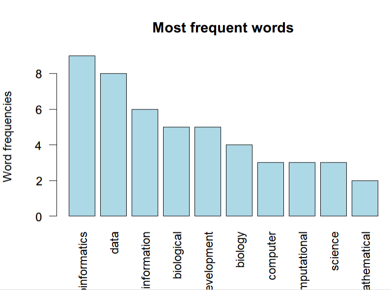

# 实验课二

> 生信 2001 张子栋 2020317210101
>
> GitHub 地址: [MarkdownNotes/R at main · Bluuur/MarkdownNotes (github.com)](https://github.com/Bluuur/MarkdownNotes/tree/main/R)

1. word cloud 练习

   1. 运行以下代码

      ```R
      > install.packages(c("tm", "SnowballC", "wordcloud", "RColorBrewer", "RCurl", "XML"))
      WARNING: Rtools is required to build R packages but is not currently installed. Please download and install the appropriate version of Rtools before proceeding:
      
      https://cran.rstudio.com/bin/windows/Rtools/
      还安装相依关系‘NLP’, ‘Rcpp’, ‘slam’, ‘xml2’, ‘BH’, ‘bitops’
      
      trying URL 'https://cran.rstudio.com/bin/windows/contrib/4.1/NLP_0.2-1.zip'
      Content type 'application/zip' length 391631 bytes (382 KB)
      downloaded 382 KB
      
      trying URL 'https://cran.rstudio.com/bin/windows/contrib/4.1/Rcpp_1.0.8.zip'
      Content type 'application/zip' length 3317905 bytes (3.2 MB)
      downloaded 3.2 MB
      
      trying URL 'https://cran.rstudio.com/bin/windows/contrib/4.1/slam_0.1-50.zip'
      Content type 'application/zip' length 211774 bytes (206 KB)
      downloaded 206 KB
      
      trying URL 'https://cran.rstudio.com/bin/windows/contrib/4.1/xml2_1.3.3.zip'
      Content type 'application/zip' length 2912554 bytes (2.8 MB)
      downloaded 2.8 MB
      
      trying URL 'https://cran.rstudio.com/bin/windows/contrib/4.1/BH_1.78.0-0.zip'
      Content type 'application/zip' length 20390200 bytes (19.4 MB)
      downloaded 19.4 MB
      
      trying URL 'https://cran.rstudio.com/bin/windows/contrib/4.1/bitops_1.0-7.zip'
      Content type 'application/zip' length 42557 bytes (41 KB)
      downloaded 41 KB
      
      trying URL 'https://cran.rstudio.com/bin/windows/contrib/4.1/tm_0.7-8.zip'
      Content type 'application/zip' length 1531874 bytes (1.5 MB)
      downloaded 1.5 MB
      
      trying URL 'https://cran.rstudio.com/bin/windows/contrib/4.1/SnowballC_0.7.0.zip'
      Content type 'application/zip' length 450226 bytes (439 KB)
      downloaded 439 KB
      
      trying URL 'https://cran.rstudio.com/bin/windows/contrib/4.1/wordcloud_2.6.zip'
      Content type 'application/zip' length 787093 bytes (768 KB)
      downloaded 768 KB
      
      trying URL 'https://cran.rstudio.com/bin/windows/contrib/4.1/RColorBrewer_1.1-2.zip'
      Content type 'application/zip' length 55707 bytes (54 KB)
      downloaded 54 KB
      
      trying URL 'https://cran.rstudio.com/bin/windows/contrib/4.1/RCurl_1.98-1.6.zip'
      Content type 'application/zip' length 3071450 bytes (2.9 MB)
      downloaded 2.9 MB
      
      trying URL 'https://cran.rstudio.com/bin/windows/contrib/4.1/XML_3.99-0.9.zip'
      Content type 'application/zip' length 4259657 bytes (4.1 MB)
      downloaded 4.1 MB
      
      package ‘NLP’ successfully unpacked and MD5 sums checked
      package ‘Rcpp’ successfully unpacked and MD5 sums checked
      package ‘slam’ successfully unpacked and MD5 sums checked
      package ‘xml2’ successfully unpacked and MD5 sums checked
      package ‘BH’ successfully unpacked and MD5 sums checked
      package ‘bitops’ successfully unpacked and MD5 sums checked
      package ‘tm’ successfully unpacked and MD5 sums checked
      package ‘SnowballC’ successfully unpacked and MD5 sums checked
      package ‘wordcloud’ successfully unpacked and MD5 sums checked
      package ‘RColorBrewer’ successfully unpacked and MD5 sums checked
      package ‘RCurl’ successfully unpacked and MD5 sums checked
      package ‘XML’ successfully unpacked and MD5 sums checked
      
      The downloaded binary packages are in
      	C:\Users\ZidongZh\AppData\Local\Temp\Rtmps5IDLQ\downloaded_packages
      > source('http://www.sthda.com/upload/rquery_wordcloud.r') 
      > filePath <- "bioinfo_definition.txt" 
      > res<-rquery.wordcloud(filePath, type ="file", lang = "english")
      载入需要的程辑包：NLP
      载入需要的程辑包：RColorBrewer
      > res<-rquery.wordcloud(filePath, type ="file", lang = "english")
      Warning messages:
      1: In readLines(x) :
        incomplete final line found on 'bioinfo_definition.txt'
      2: In tm_map.SimpleCorpus(docs, content_transformer(tolower)) :
        transformation drops documents
      3: In tm_map.SimpleCorpus(docs, removeNumbers) :
        transformation drops documents
      4: In tm_map.SimpleCorpus(docs, removeWords, stopwords(lang)) :
        transformation drops documents
      5: In tm_map.SimpleCorpus(docs, removePunctuation) :
        transformation drops documents
      6: In tm_map.SimpleCorpus(docs, stripWhitespace) :
        transformation drops documents
      7: In wordcloud(d$word, d$freq, min.freq = min.freq, max.words = max.words,  :
        bioinformatics could not be fit on page. It will not be plotted.
      ```

      

   2. 改变函数 `rquery.wordcloud` 的参数 `min.freq = 1` 并重新运行该命令。

      ```R
      > res<-rquery.wordcloud(filePath, type ="file", lang = "english",min.freq = 1)
      There were 50 or more warnings (use warnings() to see the first 50)
      ```

      

   3. 运行命令

      ```R
      > barplot(res$freqTable[1:10,]$freq, las = 2, names.arg = res$freqTable[1:10,]$word, col ="lightblue", main ="Most frequent words", ylab = "Word frequencies")
      ```

      

   4. 以上生物信息学定义的文本 word cloud 分析来看，出现频率最高的单词是哪几个，各出现几次？

      ```R
      > res$freqTable[1:10,]$freq
       [1] 9 8 6 5 5 4 3 3 3 2
      ```

      出现频率最高的单词是 bioinformatics 出现 9 次

2. 对矩阵 $A=\left(\begin{array}{cccc}
   1 & 2 & -1 & 0 \\
   2 & 4 & 1 & 2 \\
   -1 & 0 & 2 & 1 \\
   -3 & -4 & 2 & 3
   \end{array}\right)$

   1. 求 A 的转置

      ```R
      > A = matrix(c(1,2,-1,0,2,4,1,2,-1,0,2,1,-3,-4,2,3),ncol=4,byrow=TRUE)
      > t(A)
           [,1] [,2] [,3] [,4]
      [1,]    1    2   -1   -3
      [2,]    2    4    0   -4
      [3,]   -1    1    2    2
      [4,]    0    2    1    3
      ```

   2. 求 A 的行数, 列数, 维数

      ```R
      > ncol(A)
      [1] 4
      > nrow(A)
      [1] 4
      > dim(A)
      [1] 4 4
      ```

   3. 用两种方式对 A 按列求和

      ```R
      > apply(A,1,sum)
      [1]  2  9  2 -2
      > rowSums(A)
      [1]  2  9  2 -2
      ```

   4. 求 A 的逆

      ```R
      > solve(A)
           [,1] [,2]  [,3]  [,4]
      [1,] -1.4  0.6 -0.90 -0.10
      [2,]  0.8 -0.2  0.55 -0.05
      [3,] -0.8  0.2  0.20 -0.20
      [4,]  0.2  0.2 -0.30  0.30
      ```

   5. 在 `base` 包中寻找一个函数, 将 A 的对角线及以上部分都设为 0

      ```R
      > A[upper.tri(A,diag=TRUE)] <- 0
      > A
           [,1] [,2] [,3] [,4]
      [1,]    0    0    0    0
      [2,]    2    0    0    0
      [3,]   -1    0    0    0
      [4,]   -3   -4    2    0
      ```

      