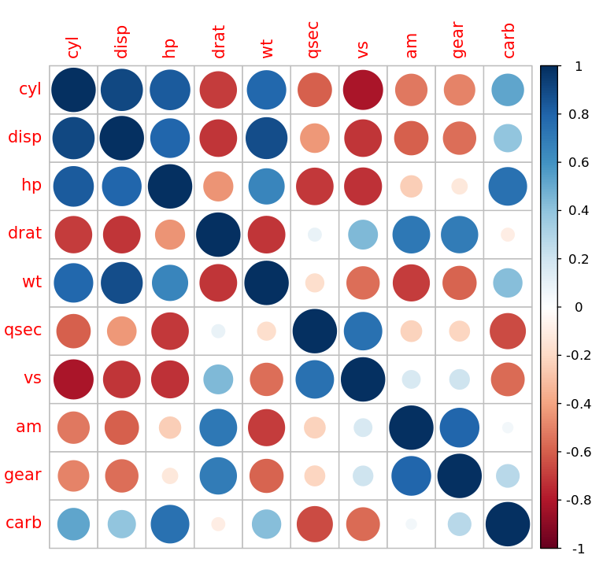

# 课后习题一

> 生信 2001 张子栋 2020317210101
>
> GitHub 地址: [MarkdownNotes/R at main · Bluuur/MarkdownNotes (github.com)](https://github.com/Bluuur/MarkdownNotes/tree/main/R)

1. **运行命令 `x <- rnorm(n = 50, mean = 2, sd = 1.5)`, 对 `x` 运行 `summary` 函数, 解释结果中每一个函数返回值是什么统计量.**

   运行结果:

   ```R
   > x <- rnorm(n = 50, mean = 2, sd = 1.5)
   > summary(x)
      Min. 1st Qu.  Median    Mean 3rd Qu.    Max. 
    -1.184   1.424   2.156   2.188   2.899   4.713 
   ```

   + `rnorm()` 函数的参数:

     + `n` 产生随机数的个数

     + `mean` 均值

     + `sd` 标准差

     + > `r` 代表随机, `norm` 代表正态分布

   + `summary()` 函数的返回值:

     + `Min.` 最小值
     + `1st Qu` 上四分位数
     + `Median` 中位数
     + `Mean` 均值
     + `3Rd Qu.` 下四分位数
     + `Max` 最大值

2. **对以下函数, 阅读帮助文档, 并各试运行其中的一个例子.**
   `setwd` , `getwd`

   + `setwd` 设置工作目录, 需要传入路径作为参数
   
   + `getwd` 获得当前工作目录的绝对路径
   
   + `wd` 指 "working directory"
   
   + ```R
     > getwd()
     [1] "/home/blur"
     > setwd("/home/blur/R")
     > getwd()
     [1] "/home/blur/R"
     ```
   
3. **安装程序包 `corrplot`, 运行以下命令, 对画图结果的意义进行解释, 并解释 `cor` 和 `corrplot` 函数的功能**

   ```R
   library(corrplot)
   corrplot(cor(mtcars[,-1]))
   ```

   + 运行结果:

     ```R
     > install.packages("corrplot")
     Installing package into ‘/home/blur/R/x86_64-pc-linux-gnu-library/4.1’
     (as ‘lib’ is unspecified)
     trying URL 'https://cloud.r-project.org/src/contrib/corrplot_0.92.tar.gz'
     Content type 'application/x-gzip' length 3765850 bytes (3.6 MB)
     ==================================================
     downloaded 3.6 MB
     
     * installing *source* package ‘corrplot’ ...
     ** package ‘corrplot’ successfully unpacked and MD5 sums checked
     ** using staged installation
     ** R
     ** inst
     ** byte-compile and prepare package for lazy loading
     ** help
     *** installing help indices
     ** building package indices
     ** installing vignettes
     ** testing if installed package can be loaded from temporary location
     ** testing if installed package can be loaded from final location
     ** testing if installed package keeps a record of temporary installation path
     * DONE (corrplot)
     
     The downloaded source packages are in
     	‘/tmp/Rtmpd3dmWy/downloaded_packages’
     > library(corrplot)
     corrplot 0.92 loaded
     > corrplot(cor(mtcars[,-1]))
     ```

     

   + 函数功能: 

     + `mtcars` 是 R 内置数据集, 是 $32$ 辆汽车在 $11$ 个指标上的数据, 是数据框
       `mtcars[,-1]` 表示数据框的全部数据 (所有行所有列)

     + `cor()` 用于求相关系数
       $$
       r=\frac{\sum\left( X-\overline{X} \right) \left( Y-\overline{Y} \right)}{\sqrt{\sum\left( X-\overline{X} \right)^2\sum \left( Y-\overline{Y} \right)^2}}
       $$
       `cor(mtcars[,-1])` 得到 $11$ 个指标之间的相关系数矩阵

     + `corrplot()` 绘制上述相关系数矩阵的热图

4. **在区间 $[0,3\pi]$ 绘制 $y=x^3+100\sin(x)\cos(x)$ 的函数图, 并加注图例 $X,Y,示意图$**

   + 代码:
   
     ```R
     > x1 <- 0:1000
     > x2 <- x1*3*pi/1000
     > y <- x2^3+100*sin(x2)*cos(x2)
     > plot(x2, y, main = "schema", type = "s", xlab = "X", ylab = "Y")
     ```
   
   + 绘图结果:
     
   
     > 输入中文「示意图」出现乱码所以用英文 schema 代替
   
     