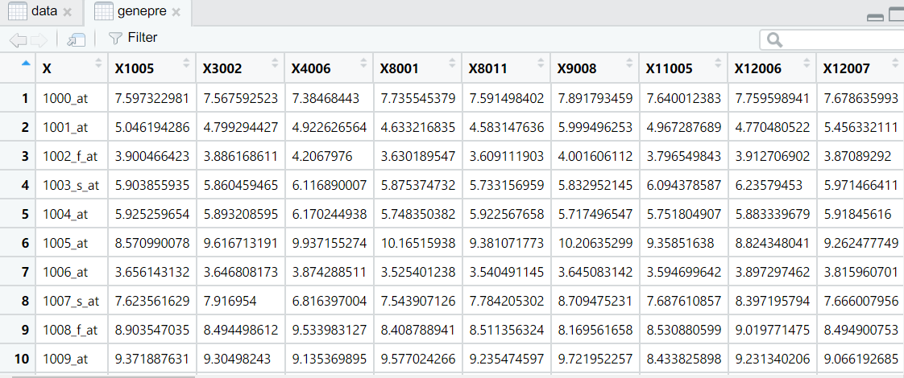
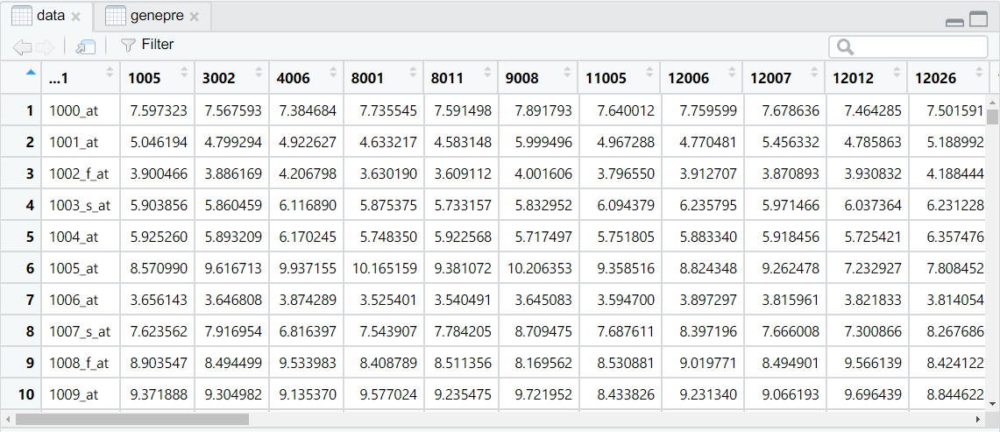

# 课后习题三

> 生信 2001 张子栋 2020317210101
>
> GitHub 地址: [MarkdownNotes/R at main · Bluuur/MarkdownNotes (github.com)](https://github.com/Bluuur/MarkdownNotes/tree/main/R)

1. 通过 R 内部自带的 iris 数据集，熟悉数据框的各种计算。

   1. 获取每一列变量的名称

      ```R
      > colnames(iris)
      [1] "Sepal.Length" "Sepal.Width"  "Petal.Length" "Petal.Width"  "Species" 
      ```

   2. 用 `str` 函数获取每一列变量的数据类型

      ```R
      > str(iris)
      'data.frame':	150 obs. of  5 variables:
       $ Sepal.Length: num  5.1 4.9 4.7 4.6 5 5.4 4.6 5 4.4 4.9 ...
       $ Sepal.Width : num  3.5 3 3.2 3.1 3.6 3.9 3.4 3.4 2.9 3.1 ...
       $ Petal.Length: num  1.4 1.4 1.3 1.5 1.4 1.7 1.4 1.5 1.4 1.5 ...
       $ Petal.Width : num  0.2 0.2 0.2 0.2 0.2 0.4 0.3 0.2 0.2 0.1 ...
       $ Species     : Factor w/ 3 levels "setosa","versicolor",..: 1 1 1 1 1 1 1 1 1 1 ...
      ```

   3. 用 `table` 函数统计各 `species` 的样本个数

      ```R
      > table(iris$Species)
      
          setosa versicolor  virginica 
              50         50         50
      ```

   4. 分别根据 `Species` 的种类计算 `Sepal.Length` 及 `Sepal.Width` 的平均值和标准差。

      ```R
      > setosa <- iris[which(iris$Species == 'setosa'),]
      > versicolor <- iris[which(iris$Species == 'versicolor'),]
      > virginica <- iris[which(iris$Species == 'virginica'),]
      > apply(setosa[,3:4], 2, mean)
      Petal.Length  Petal.Width 
             1.462        0.246 
      > apply(setosa[,3:4], 2, sd)
      Petal.Length  Petal.Width 
         0.1736640    0.1053856 
      > apply(versicolor[,3:4], 2, mean)
      Petal.Length  Petal.Width 
             4.260        1.326 
      > apply(versicolor[,3:4], 2, sd)
      Petal.Length  Petal.Width 
         0.4699110    0.1977527 
      > apply(virginica[,3:4], 2, mean)
      Petal.Length  Petal.Width 
             5.552        2.026 
      > apply(virginica[,3:4], 2, sd)
      Petal.Length  Petal.Width 
         0.5518947    0.2746501 
      ```

2. 数据读取练习(`genepre.xlsx`)

   1. 读取基因表达数据(用 2 种方法)

      1. 转为 csv 格式

      ```R
      > genepre<-read.csv("genepre.csv")
      ```

      

      2. 使用 `readxl::read_excel`

      ```R
      > data<-readxl::read_excel("genepre.xlsx",1)
      New names:
      * `` -> ...1
      * `` -> ...49
      There were 50 or more warnings (use warnings() to see the first 50)
      ```

      

   2. 利用 `apply` 函数计算各基因(各行)的平均值

      ```R
      > apply(genepre[,2:48],1,mean)
         [1]  7.504880  5.001064  3.863682  5.967604  5.792791  8.924696  3.662249  7.498836
         [9]  8.837011  9.277793  8.010046  5.220157  6.070231  3.665188  3.330396  7.457011
        [17]  5.630117  3.311803  4.796500  6.205266  6.643770  6.118478  7.490430  4.949104
        [25]  3.868892  5.715834  5.815580  4.524217  6.445942  5.409656  4.678486  3.603989
        [33]  3.512862  7.828615  4.913481  7.470389  5.500037  5.233118  5.754627  3.809778
        [41]  3.504900  6.533554  7.353945  5.697209  4.405653  4.643014  3.060026  3.162228
        [49]  5.013876  3.951940  4.241168  5.749213  4.386149  6.352497  4.309968  2.867940
        [57]  4.936368  4.973374  4.925345  4.179969  5.382938  3.905354  4.650976  3.219748
        [65]  3.497745  3.483588  6.011535  6.644879  6.506998  6.161039  4.796000  8.346443
        [73]  5.525130  4.576119  7.048770  3.905043  6.828561  6.564929  5.900705  6.434003
        [81]  8.919757  6.001702  3.556982  3.700371  4.722673  3.165783  5.233368  6.062925
        [89]  3.960358  8.333350  4.557697  6.140960  4.519908  7.517164  4.346230  5.097344
        [97]  3.058551  5.761385  7.008837  4.024907  7.690493  8.072284  3.166021  5.325635
       [105]  2.774938  9.600466  6.161180  3.221679  3.874609  6.588462  7.285280  4.947392
       [113]  7.886808  4.389740  6.183568  8.782300  7.505217  7.160952  5.220785  5.529595
       [121]  7.380256  5.515237  4.583856  5.215061  5.150565  5.041289  4.893706  7.144700
       [129]  5.150290  6.287871  6.133681  6.152587  4.843983  3.864968  7.950188  6.400543
       [137]  6.492441  5.023459  6.937542  8.119988  5.037892  5.047102  3.614343  7.209675
       [145]  7.711137  5.835263  3.678935  8.348469  6.258621  6.595429  3.823904  7.969160
       [153]  6.254918  4.052586  5.931368  5.411786  5.947064  3.405422  3.679332  5.174893
       [161]  5.269853  2.737774  4.014435  4.177702  5.010679  7.683055  9.441594  3.759022
       [169]  7.618159  6.112164  7.357915  4.727180  4.389080  7.893874  2.823840  5.293245
       [177]  7.665155  9.717995  5.325448  3.696540  4.626416  3.538199  8.255970  7.812481
       [185]  3.832805  5.403827  3.315067  5.421482  7.191294  5.211659  9.854441  4.339255
       [193]  4.475190  4.944951  4.843240  4.739938  9.009993  5.259979  9.871004  6.287599
       [201]  3.273185  5.022991  8.058055  7.319389  3.133262  6.816859  4.820916  5.326618
       [209]  4.782917  3.215864  6.702204  5.793894  5.502135  4.067361  4.022292  6.406093
       [217]  3.411541  2.976842  8.667419  4.374561  3.995897  5.502504  3.426365  4.242012
       [225]  3.716085  5.759580  6.361795  5.581983  4.993173  3.963160  6.080088  7.232139
       [233]  5.961580  4.530414  3.285513  5.593011  5.164401  5.403029  8.469207  5.347416
       [241]  5.213641  3.450490  5.551222  5.786212  5.899556  4.765962  3.987738  6.985379
       [249]  4.438405  4.264909  5.422344  4.536433  3.908586  7.766764  3.388965  9.977249
       [257]  6.130578  6.530226  6.843490  4.190021  3.587083  5.633956  9.476938  6.551210
       [265]  6.713312  5.620407  3.936962  7.189958  4.492472  6.640272  4.507115  5.387755
       [273]  5.676753  7.315956  4.912105  6.980103  4.024967  4.655869  6.146694  3.594790
       [281]  5.592470  3.146573  6.484575  3.342024  5.511880  3.173034  4.033605  5.271407
       [289]  6.941058  8.059072  4.807702  2.784759  7.538941  8.160182  4.919852  6.506549
       [297]  5.578171  3.215356  6.516389  5.648411  3.221018  5.396318  6.841721  5.039814
       [305]  3.582414  3.326417  6.006044  3.677101  3.029020  8.528822 12.646433  6.361994
       [313]  3.978392  6.913436  5.733989  6.847108  4.271223  8.249274  8.212194  6.881546
       [321]  4.376040  3.346967  3.250894  5.015920  3.431691  5.639818  3.554571  6.841674
       [329]  6.171138  4.638885  4.883123  7.940727  5.772907  8.437232  8.514173  8.187473
       [337]  6.865568  6.885768 11.283089  5.695243  4.693750  6.847122  3.654935  6.247057
       [345]  4.340543  5.335626  5.856009 11.659707  6.587578  6.341447  6.206322  5.226667
       [353]  3.012425  5.685940  6.462414  6.618326  6.847964  6.537734  7.345662  5.586971
       [361]  7.410539  4.009081  4.193478  6.355398  5.901100  4.579493  4.180356  3.242784
       [369]  3.065464  5.267197  4.626866  7.333906  7.470009  4.341593  3.293020  4.354400
       [377]  3.998685  5.959788  6.312572  5.510386  3.997341  4.114256  7.168675  6.594487
       [385]  6.681494  4.578949  4.924362  2.969935  5.312739  4.697413  3.794997  2.971522
       [393]  5.873506 11.279006 10.948655  3.346325  7.429778  6.972157  6.630833  6.191369
       [401]  4.727770  8.906947  8.006188  5.753812  7.115700  8.252923  8.269563  4.510320
       [409]  5.368943  3.207065  3.666378  4.691715  8.143442  3.719842  4.190214  6.487330
       [417]  5.079986  3.039700  9.783349  8.032075  5.094227  6.246046  8.745824  3.449346
       [425] 10.674049  7.479892  3.315916  5.794863  8.206529  8.849860  3.796731  5.230672
       [433]  3.536261  7.187762  7.841885  3.058696  6.233558  4.684818  5.672653  3.807856
       [441]  7.229439  8.312936  5.608682  5.441281  4.458553  3.076236  3.529909  8.078389
       [449]  3.354260  2.816659  6.351385  6.542354  5.749530 10.551950  2.806329  4.187236
       [457]  4.799473 10.457837  3.469120  7.138970  4.986641  3.919712  4.685387  4.334290
       [465]  4.116082  7.499721  7.608581  4.167499  3.820607  4.414797  3.599798  6.120854
       [473]  6.290320  4.119886  3.930832  2.861506  5.984515  5.409552  7.315816  4.592948
       [481]  7.173253  8.912109  7.158848  6.839681  5.475023  6.671988  3.197631  5.862094
       [489]  6.705700  6.108532  5.121947  7.338762  5.349444  5.965290  5.007923  4.852915
       [497]  5.441516 10.620284  7.188624  6.867424  6.277160  2.923398  3.106546  4.298009
       [505]  6.768672  8.857831  6.335158  7.428996  3.505838  6.487894  5.189162  6.361799
       [513]  7.348851  7.773211  6.773942  4.864273  4.273862  6.623796  5.217010  3.336456
       [521]  3.537693  7.133009  3.418750  2.808478  8.680233  6.496489  4.013783  6.029132
       [529]  5.246686  3.843516  3.343278  6.001969  5.113061  6.032094  3.440168  6.412219
       [537]  6.131573  7.706851  8.431608  7.645848  4.277883  3.631228  4.065685  4.102147
       [545]  6.840067  8.252006  3.592038  6.025460  4.216366  3.284161  5.136297  5.479886
       [553]  8.750098  7.101279  4.976479  6.437211  6.973581  6.555536  5.930253  9.102185
       [561] 10.516287  7.336085  6.438943  5.650818  6.330769  6.080857  4.279352  7.392822
       [569]  6.501961  4.805243  4.169694  5.893967  2.979846  4.779656  7.446741  4.244026
       [577]  3.042999  6.933150  3.393058  4.509456  3.051279  4.008233  5.307305  4.439071
       [585]  4.799077  5.783024  3.459062  5.347698  3.848693  3.384615  7.234482  6.111468
       [593]  4.799933  4.173382  6.239878  7.456200  4.969953  5.928114  5.114490  5.998215
       [601]  6.833452  4.370551  5.930637  4.120326  7.481398  5.191865  6.204855  5.392915
       [609]  7.854578  7.563305  6.369093  4.776506  5.729866  3.996951  5.917982  3.240958
       [617]  2.865537  4.294725  5.194578  6.997604  5.289872  4.549119  5.407967  5.303899
       [625]  3.542231  3.924669  3.390599  4.111275  5.607393  4.598425  7.259749  3.588539
       [633]  3.048690  4.433881  6.280473  4.115544  5.233745  4.411761  5.117965  4.812926
       [641]  5.463674  2.968859  6.525884  5.567188  3.242114  5.082835  7.691921  4.620828
       [649]  4.249319  7.053668  2.754576  5.447056  3.796646  5.774730  3.382016  5.403092
       [657]  5.802550  4.054244  8.418357  3.796458  3.778704  3.809935  6.601049  5.026012
       [665]  3.530377  5.092481  6.670808  5.731950  5.056735  3.394271  6.913640  5.629238
       [673]  3.566441  6.194894  4.016781  4.399009  5.227989  4.691158  5.345897  3.913303
       [681]  5.144049  4.517057  6.226218  5.178408  7.049617  2.919128  3.450375 11.648294
       [689]  4.007494  4.381989  5.199309  3.870733  6.204347  2.957873  4.470304  2.846609
       [697]  4.385468  3.557685  7.448198  3.183444  4.696292  2.897852  3.988372  7.376712
       [705]  3.996140  3.389034  9.322068  7.813391  5.578623  6.940181  7.109194  4.242079
       [713]  8.257342  9.556666  7.518637  4.996992  4.242202  5.638223  7.111212  8.010053
       [721]  7.243517  7.393860  7.692599  4.933974  3.371319  6.113843  3.153592  5.933667
       [729]  6.706009  8.031105  6.572918  6.544372 11.766255  5.508279  3.534513  5.274109
       [737]  3.130798  3.443050  7.080906  3.760491  6.876369  6.083089  9.315848  6.801701
       [745]  6.788408  6.727080  3.257046  7.470465  6.733012  3.545877  6.633221  5.712561
       [753]  6.642115  5.089485  6.109474  5.332589  6.942420 11.340900  5.558527  3.108806
       [761]  2.934814  7.480262  6.732560  6.242348  5.975922  7.380590  6.639932  4.413916
       [769]  5.649983  5.319422  4.878047  6.151194  2.871297  4.032832  3.824730  5.797141
       [777]  7.598683  4.930655  7.933470  5.365416  3.257630  4.597289  3.671708  4.284403
       [785]  7.623967  4.081224  4.112295  6.396312  6.646893  3.557333  8.101407  8.388102
       [793]  4.408234  3.316341  6.084120  4.462612  7.161119  4.202827  3.727801  4.821149
       [801]  3.945765  4.945500  4.294435  9.618426  4.231818  6.689649  3.588486  3.659218
       [809]  4.570566  4.588673  6.554430  6.648009  6.684024  3.165814  8.253030  6.400352
       [817]  8.998082  5.804405  4.051777  3.149350  4.517961  5.032660  7.379139  3.976411
       [825]  5.705629  5.677499  3.168825  4.037529  4.389519  5.190000  6.347483  3.042222
       [833]  5.972453  3.295386  6.539825  5.794951  6.428163  5.896967  8.412517  6.962638
       [841]  5.224831  5.450114  4.856823  5.443920  4.608179  3.757059  2.712598  2.624553
       [849]  4.254987  6.680171  6.465735  3.309005  4.499790  5.313466  4.850766  5.657369
       [857]  5.278380  5.043490  8.397417  5.626205  6.013265  3.201481  5.877679  5.475345
       [865]  5.151362  4.527445  5.494433  4.902135  7.336817  4.601094  8.021475  4.984874
       [873]  6.985905  5.922021  8.179540  4.085279  5.501298  6.893068  5.088898  3.960153
       [881]  4.098905  6.577222  5.426090  8.197722  3.223670  8.477948  4.542430  9.063741
       [889]  9.487070  8.841604  7.700007  4.575939  6.108226  8.371245  3.885940  6.760927
       [897]  4.964135  5.347326  7.587031  3.837553  2.682804  4.054569  4.717880  4.211494
       [905]  5.836064  6.541166  5.063773  4.117110  4.986206  7.563305  4.912834  4.116443
       [913]  9.134379  6.150135  5.098856  8.647520  5.942248  3.640199  3.885260  4.860374
       [921]  6.463813  7.508736  6.626948  8.341232  3.422723  5.786860  7.739040  4.072831
       [929]  4.392506  5.887547  4.897034 10.219772  4.159411  4.433270  8.676914  3.329841
       [937]  9.209856  3.808620  8.186959  5.716335  7.098921  5.562678  5.618131  5.822944
       [945]  6.461538  4.507969  4.921696  7.470421  4.066988  6.639100  5.415607  5.402405
       [953]  5.383360  5.613643  5.881753  4.537383  3.371755  5.222961  6.596241  5.165068
       [961]  4.044820  4.752737  2.993207  4.136543  7.298218  4.346679  5.714308  3.431701
       [969]  3.842062  3.018724  3.219089  7.320458  6.537216  5.169197  3.335765  4.445893
       [977]  8.329606  5.076162  7.271657  3.378310  4.140178  4.460621  4.278309  7.525273
       [985]  6.748032  5.730431  5.763415  3.776481  6.327702  5.651360  4.240205  5.806915
       [993]  4.607570  7.015616  5.033290  4.518269  4.150982  3.986030  3.884267  7.222387
       [ reached getOption("max.print") -- omitted 11626 entries ]
      ```
      
   3. 找出该平均值最大的行

      ```R
      > which(mean==max(mean,na.rm = T),arr.ind = T)
      [1] 1974
      ```

   4. 找出表格所有数中的最大值和其行, 列号

      ```R
      > which(genepre==max(genepre[,2:48],na.rm = T),arr.ind = T)
            row col
      [1,] 6191  42
      ```

   5. 表格第一列为探针编号, 找到探针`37567_at` `32737_at` 和 `143_s_at` 所在的行号, 并提取对应行的内容.

      ```R
      > genepre[which(genepre$...1%in%c("37567_at","32737_at","143_s_at")),]
      # A tibble: 3 x 49
        ...1  `1005` `3002` `4006` `8001` `8011` `9008` `11005` `12006` `12007` `12012` `12026`
        <chr>  <dbl>  <dbl>  <dbl>  <dbl>  <dbl>  <dbl>   <dbl>   <dbl>   <dbl>   <dbl>   <dbl>
      1 143_~   4.13   3.85   4.40   4.10   4.03   4.24    3.93    4.09    4.21    4.21    4.19
      2 3273~   5.07   6.09   6.92   5.62   5.37   7.75    5.12    5.08    5.37    5.29    5.11
      3 3756~   5.21   4.95   5.26   5.27   4.98   5.62    5.73    5.52    5.39    5.44    5.31
      # ... with 37 more variables: `14016` <dbl>, `15004` <dbl>, `15005` <dbl>,
      #   `16004` <dbl>, `19005` <dbl>, `20002` <dbl>, `22010` <dbl>, `22013` <dbl>,
      #   `24001` <dbl>, `24005` <dbl>, `24010` <dbl>, `24011` <dbl>, `24017` <dbl>,
      #   `24022` <dbl>, `26003` <dbl>, `26008` <dbl>, `27003` <dbl>, `27004` <dbl>,
      #   `28019` <dbl>, `28021` <dbl>, `28028` <dbl>, `28032` <dbl>, `28036` <dbl>,
      #   `30001` <dbl>, `31007` <dbl>, `31011` <dbl>, `37013` <dbl>, `43001` <dbl>,
      #   `49006` <dbl>, `62001` <dbl>, `62002` <dbl>, `62003` <dbl>, `63001` <dbl>, ...
      ```

3. 混合同余法: 利用如下递推公式
   $$
   x_n=(ax_{n-1}+c) \ \mathrm{mod}\  m
   $$
   用混合同余法产生 $x_n$ 编写一个函数, 并利用该函数计算
   $$
   如果 \ x_0=3\\
   x_n=(5x_{n-1}+7)\ \mathrm{mod} \ 200\\
   求 \ x_1,x_2,\cdots,x_{10}
   $$

```R
> myFunction <- function(x0,a,c,m){+
+ return((a*x0+c)%%m)
+ }
> cat("x1=",myFunction(3,5,-7,200))
x1= 8
> cat("x2=",myFunction(8,5,-7,200))
x2= 33
> cat("x3=",myFunction(33,5,-7,200))
x3= 158
> cat("x4=",myFunction(158,5,-7,200))
x4= 183
> cat("x5=",myFunction(183,5,-7,200))
x5= 108
> cat("x6=",myFunction(108,5,-7,200))
x6= 133
> cat("x7=",myFunction(133,5,-7,200))
x7= 58
> cat("x9=",myFunction(58,5,-7,200))
x9= 83
> cat("x10=",myFunction(83,5,-7,200))
x10= 8

```


