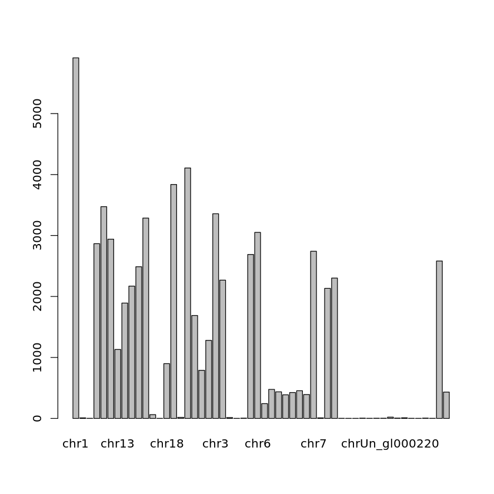
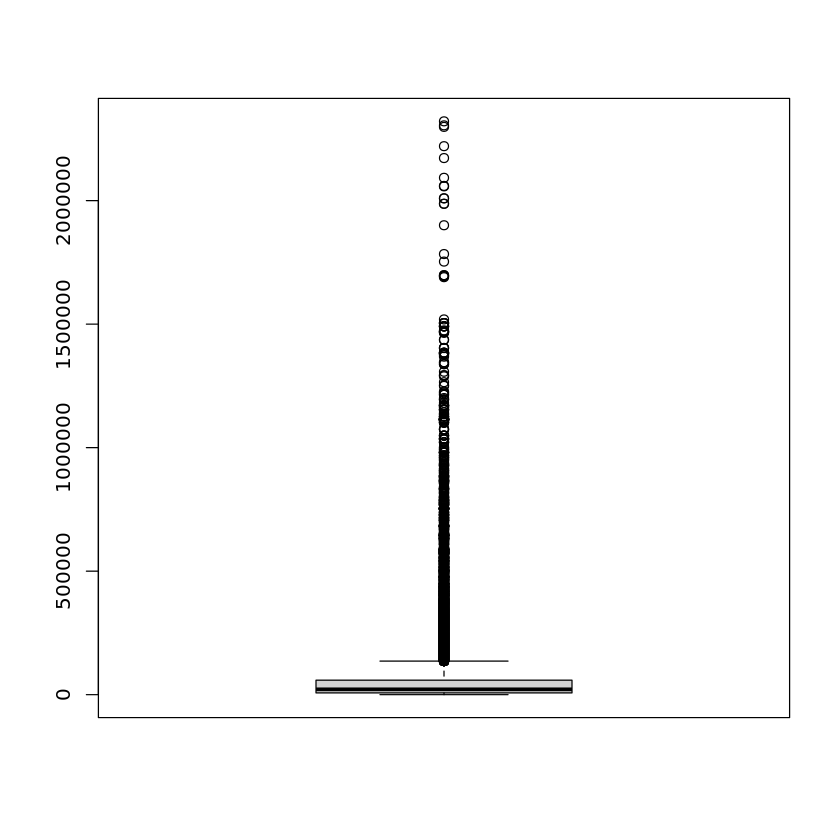

# 第四次上机实验

> 生信 2001 张子栋 2020317210101
>
> GitHub 地址: [MarkdownNotes/R at main · Bluuur/MarkdownNotes (github.com)](https://github.com/Bluuur/MarkdownNotes/tree/main/R)

+ 本次实验所需文件
    + `hg19_gene_table.txt`
    + `hg19.chrom.sizes.txt`
> 要求: 不用任何循环语句

1. 对人染色体长度数据 `hg19.chrom.sizes.txt`
    1.用 `read.table` 正确读入数据    


```R
data <- read.table('hg19.chrom.sizes.txt', header = F)
```

2.最长和最短的染色体分别是哪条? 各多长?


```R
data <- read.table('hg19.chrom.sizes.txt', header = F)
data[which(data$V2 == max(data$V2)),]
data[which(data$V2 == min(data$V2)),]
```


<table class="dataframe">
<caption>A data.frame: 1 × 2</caption>
<thead>
	<tr><th></th><th scope=col>V1</th><th scope=col>V2</th></tr>
	<tr><th></th><th scope=col>&lt;chr&gt;</th><th scope=col>&lt;int&gt;</th></tr>
</thead>
<tbody>
	<tr><th scope=row>1</th><td>chr1</td><td>249250621</td></tr>
</tbody>
</table>


<table class="dataframe">
<caption>A data.frame: 1 × 2</caption>
<thead>
	<tr><th></th><th scope=col>V1</th><th scope=col>V2</th></tr>
	<tr><th></th><th scope=col>&lt;chr&gt;</th><th scope=col>&lt;int&gt;</th></tr>
</thead>
<tbody>
	<tr><th scope=row>22</th><td>chr21</td><td>48129895</td></tr>
</tbody>
</table>


3.求所有染色体的总长度和平均长度


```R
data <- read.table('hg19.chrom.sizes.txt', header = F)
cat('Length in total', sum(data$V2), '\n')
cat('Average length', mean(data$V2))
```

    Length in total 3095677412 
    Average length 128986559

2.用 `read.table` 读入 `hg19.chrom.sizes.txt`

1.用函数 `table` 得到每条染色体上的基因个数, 并画 `barplot`


```R
data <- read.table("hg19_gene_table.txt", header = T)
table(data$chrom)
barplot(table(data$chrom))
```


​    
                     chr1  chr1_gl000191_random  chr1_gl000192_random 
                     5914                     9                     2 
                    chr10                 chr11                 chr12 
                     2866                  3473                  2940 
                    chr13                 chr14                 chr15 
                     1131                  1892                  2170 
                    chr16                 chr17       chr17_ctg5_hap1 
                     2488                  3286                    62 
    chr17_gl000205_random                 chr18                 chr19 
                        1                   898                  3837 
    chr19_gl000209_random                  chr2                 chr20 
                       18                  4108                  1688 
                    chr21                 chr22                  chr3 
                      789                  1280                  3357 
                     chr4        chr4_ctg9_hap1  chr4_gl000193_random 
                     2268                    14                     1 
     chr4_gl000194_random                  chr5                  chr6 
                        4                  2689                  3051 
            chr6_apd_hap1         chr6_cox_hap2         chr6_dbb_hap3 
                      242                   476                   436 
           chr6_mann_hap4         chr6_mcf_hap5         chr6_qbl_hap6 
                      387                   424                   454 
           chr6_ssto_hap7                  chr7  chr7_gl000195_random 
                      392                  2742                     9 
                     chr8                  chr9                  chrM 
                     2133                  2302                     2 
           chrUn_gl000211        chrUn_gl000212        chrUn_gl000213 
                        1                     1                     4 
           chrUn_gl000215        chrUn_gl000218        chrUn_gl000219 
                        2                     3                     3 
           chrUn_gl000220        chrUn_gl000222        chrUn_gl000223 
                       21                     5                    10 
           chrUn_gl000224        chrUn_gl000227        chrUn_gl000228 
                        2                     1                     5 
           chrUn_gl000241                  chrX                  chrY 
                        2                  2582                   432 



    


2.结合染色体长度计算每条染色体上的基因密度(每 Mbp 的基因个数)


```R
data <- read.table("hg19_gene_table.txt", header = T)
chromoLength <- read.table('hg19.chrom.sizes.txt', header = F)
geneNum <- table(data$chrom)
geneNum <- geneNum[as.vector(chromoLength$V1)]
geneNum / (chromoLength$V2 / 1000000)
```


​    
         chr1      chr2      chr3      chr4      chr5      chr6      chr7      chr8 
    23.727122 16.891491 16.952625 11.864762 14.863312 17.830107 17.230257 14.573254 
         chr9     chr10     chr11     chr12     chr13     chr14     chr15     chr16 
    16.301566 21.145869 25.724684 21.964575  9.820276 17.624668 21.164250 27.535906 
        chr17     chr18     chr19     chr20     chr22     chr21      chrX      chrY 
    40.470368 11.501430 64.892034 26.782802 24.949046 16.393138 16.629038  7.275965 


3.计算基因长度, 绘制基因长度的 `boxplot`


```R
data <- read.table("hg19_gene_table.txt", header = T)
geneLength <- data$txEnd - data$txStart + 1
boxplot(geneLength)
```


​    

​    


4.找出最长的基因


```R
data <- read.table("hg19_gene_table.txt", header = T)
gene <- cbind(data$geneName,data$txEnd - data$txStart + 1)
gene[which(gene[,2]==max(gene[,2])),]
```


<style>
.list-inline {list-style: none; margin:0; padding: 0}
.list-inline>li {display: inline-block}
.list-inline>li:not(:last-child)::after {content: "\00b7"; padding: 0 .5ex}
</style>
<ol class=list-inline><li>'ATL1'</li><li>'99986'</li></ol>


5.阅读 `cor` 函数的帮助文件, 计算基因长度和外显子个数的相关系数


```R
data <- read.table("hg19_gene_table.txt", header = T)
gene <- cbind(data$txEnd - data$txStart + 1, data$exonCount)
cor(gene[,1], gene[,2])
```


0.376018862127503


6.用 `prop.table` 分染色体计算 +/- strand 上基因的百分比


```R
data <- read.table("hg19_gene_table.txt", header = T)
gene <- table(data$strand)
prop.table(gene)
```

            -         + 
    0.4868818 0.5131182 

