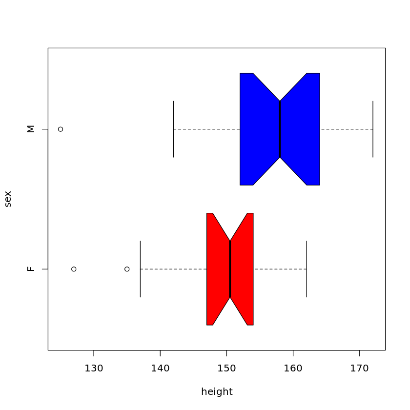
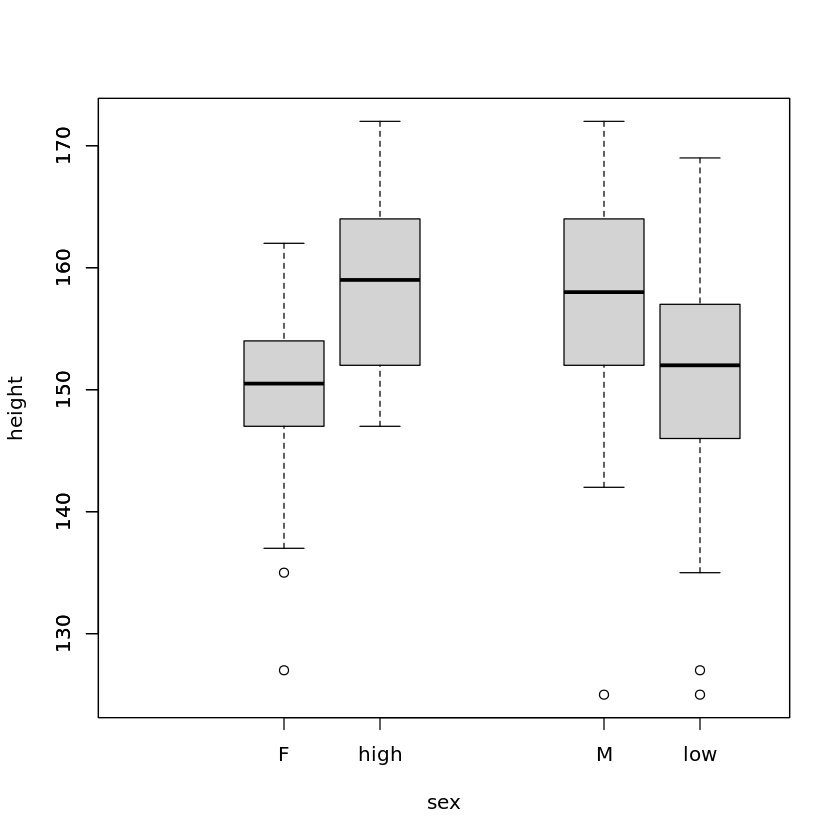
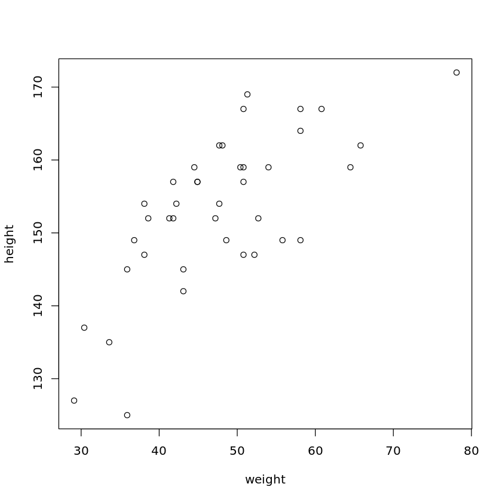
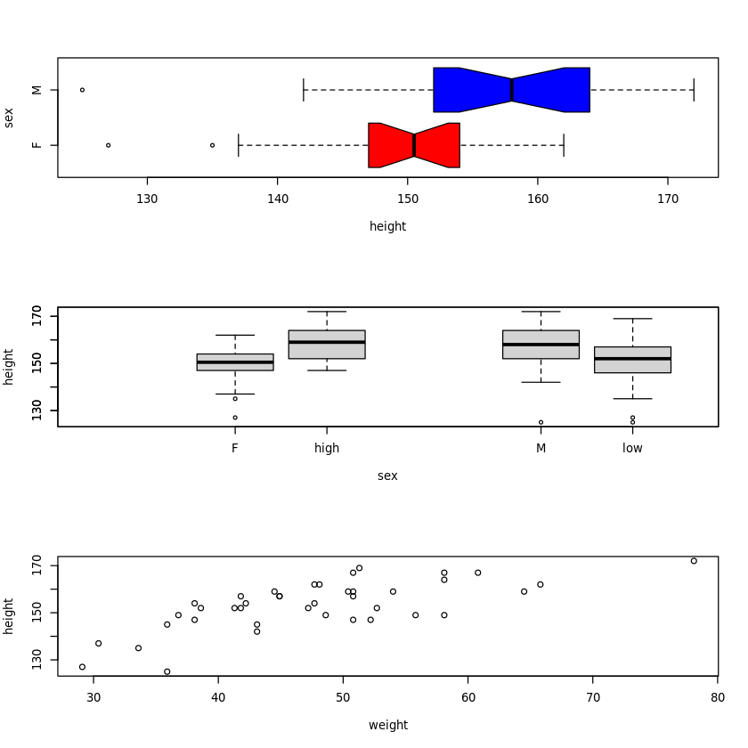
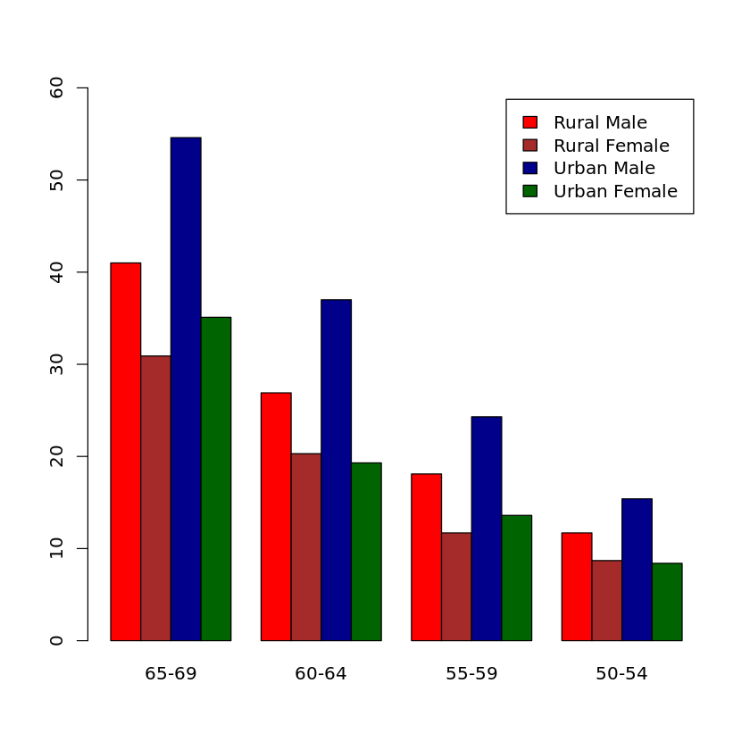
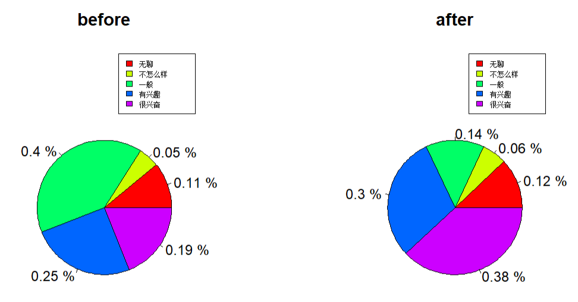
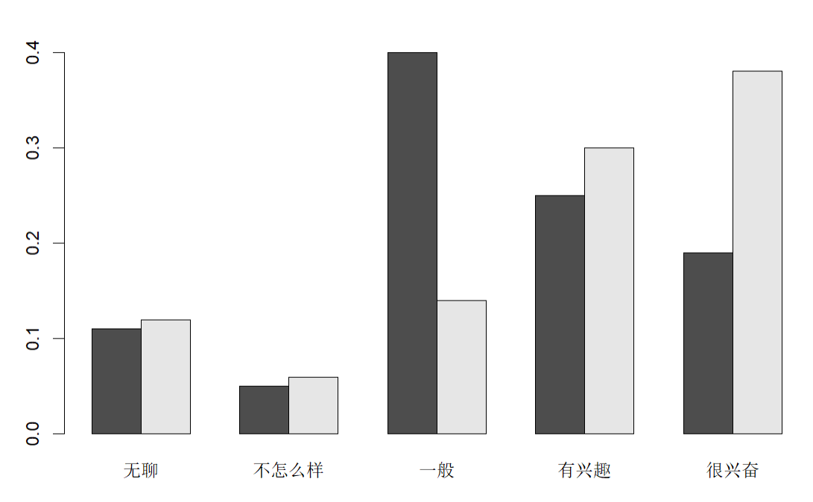

# 第五讲作业

>生信 2001 张子栋 2020317210101
>
>GitHub 地址: [MarkdownNotes/R at main · Bluuur/MarkdownNotes (github.com)](https://github.com/Bluuur/MarkdownNotes/tree/main/R)

1.有一个外部文件为 `class.txt`, 存储的是某个班级学生的姓名, 年龄, 身高, 体重和性别的信息

(1) 把此文件读入到 R 中并把他记录为数据框 class


```R
class <- read.table('/home/ubuntu/R_course/R_data/class.txt')
class
```


<table class="dataframe">
<caption>A data.frame: 40 × 5</caption>
<thead>
	<tr><th scope=col>V1</th><th scope=col>V2</th><th scope=col>V3</th><th scope=col>V4</th><th scope=col>V5</th></tr>
	<tr><th scope=col>&lt;chr&gt;</th><th scope=col>&lt;int&gt;</th><th scope=col>&lt;int&gt;</th><th scope=col>&lt;dbl&gt;</th><th scope=col>&lt;chr&gt;</th></tr>
</thead>
<tbody>
	<tr><td>Lawrence</td><td>17</td><td>172</td><td>78.1</td><td>M</td></tr>
	<tr><td>Jeffery </td><td>14</td><td>169</td><td>51.3</td><td>M</td></tr>
	<tr><td>Edward  </td><td>14</td><td>167</td><td>50.8</td><td>M</td></tr>
	<tr><td>Phillip </td><td>16</td><td>167</td><td>58.1</td><td>M</td></tr>
	<tr><td>Kirk    </td><td>17</td><td>167</td><td>60.8</td><td>M</td></tr>
	<tr><td>Robert  </td><td>15</td><td>164</td><td>58.1</td><td>M</td></tr>
	<tr><td>Jaclyn  </td><td>12</td><td>162</td><td>65.8</td><td>F</td></tr>
	<tr><td>Danny   </td><td>15</td><td>162</td><td>48.1</td><td>M</td></tr>
	<tr><td>Clay    </td><td>15</td><td>162</td><td>47.7</td><td>M</td></tr>
	<tr><td>Henry   </td><td>14</td><td>159</td><td>54.0</td><td>M</td></tr>
	<tr><td>Leslie  </td><td>14</td><td>159</td><td>64.5</td><td>F</td></tr>
	<tr><td>John    </td><td>13</td><td>159</td><td>44.5</td><td>M</td></tr>
	<tr><td>William </td><td>15</td><td>159</td><td>50.4</td><td>M</td></tr>
	<tr><td>Martha  </td><td>16</td><td>159</td><td>50.8</td><td>F</td></tr>
	<tr><td>Lewis   </td><td>14</td><td>157</td><td>41.8</td><td>M</td></tr>
	<tr><td>Amy     </td><td>15</td><td>157</td><td>50.8</td><td>F</td></tr>
	<tr><td>Alfred  </td><td>14</td><td>157</td><td>44.9</td><td>M</td></tr>
	<tr><td>Chris   </td><td>14</td><td>157</td><td>44.9</td><td>M</td></tr>
	<tr><td>Fredrick</td><td>14</td><td>154</td><td>42.2</td><td>M</td></tr>
	<tr><td>Carol   </td><td>14</td><td>154</td><td>38.1</td><td>F</td></tr>
	<tr><td>Joe     </td><td>13</td><td>154</td><td>47.7</td><td>M</td></tr>
	<tr><td>Mary    </td><td>15</td><td>152</td><td>41.8</td><td>F</td></tr>
	<tr><td>Linda   </td><td>17</td><td>152</td><td>52.7</td><td>F</td></tr>
	<tr><td>Mark    </td><td>15</td><td>152</td><td>47.2</td><td>M</td></tr>
	<tr><td>Patty   </td><td>14</td><td>152</td><td>38.6</td><td>F</td></tr>
	<tr><td>Elizabet</td><td>14</td><td>152</td><td>41.3</td><td>F</td></tr>
	<tr><td>Judy    </td><td>14</td><td>149</td><td>36.8</td><td>F</td></tr>
	<tr><td>Louis   </td><td>12</td><td>149</td><td>55.8</td><td>F</td></tr>
	<tr><td>Alice   </td><td>13</td><td>149</td><td>48.6</td><td>F</td></tr>
	<tr><td>James   </td><td>12</td><td>149</td><td>58.1</td><td>M</td></tr>
	<tr><td>Marian  </td><td>16</td><td>147</td><td>52.2</td><td>F</td></tr>
	<tr><td>Tim     </td><td>12</td><td>147</td><td>38.1</td><td>M</td></tr>
	<tr><td>Barbara </td><td>13</td><td>147</td><td>50.8</td><td>F</td></tr>
	<tr><td>David   </td><td>13</td><td>145</td><td>35.9</td><td>M</td></tr>
	<tr><td>Katie   </td><td>12</td><td>145</td><td>43.1</td><td>F</td></tr>
	<tr><td>Michael </td><td>13</td><td>142</td><td>43.1</td><td>M</td></tr>
	<tr><td>Susan   </td><td>13</td><td>137</td><td>30.4</td><td>F</td></tr>
	<tr><td>Jane    </td><td>12</td><td>135</td><td>33.6</td><td>F</td></tr>
	<tr><td>Lillie  </td><td>12</td><td>127</td><td>29.1</td><td>F</td></tr>
	<tr><td>Robert  </td><td>12</td><td>125</td><td>35.9</td><td>M</td></tr>
</tbody>
</table>


(2) 给数据框 class 的列命名为 name, age, height, weight, sex


```R
class <- read.table('/home/ubuntu/R_course/R_data/class.txt')
names(class)[1:5] <- c('name', 'age', 'height', 'weight', 'sex')
class
```


<table class="dataframe">
<caption>A data.frame: 40 × 5</caption>
<thead>
	<tr><th scope=col>name</th><th scope=col>age</th><th scope=col>height</th><th scope=col>weight</th><th scope=col>sex</th></tr>
	<tr><th scope=col>&lt;chr&gt;</th><th scope=col>&lt;int&gt;</th><th scope=col>&lt;int&gt;</th><th scope=col>&lt;dbl&gt;</th><th scope=col>&lt;chr&gt;</th></tr>
</thead>
<tbody>
	<tr><td>Lawrence</td><td>17</td><td>172</td><td>78.1</td><td>M</td></tr>
	<tr><td>Jeffery </td><td>14</td><td>169</td><td>51.3</td><td>M</td></tr>
	<tr><td>Edward  </td><td>14</td><td>167</td><td>50.8</td><td>M</td></tr>
	<tr><td>Phillip </td><td>16</td><td>167</td><td>58.1</td><td>M</td></tr>
	<tr><td>Kirk    </td><td>17</td><td>167</td><td>60.8</td><td>M</td></tr>
	<tr><td>Robert  </td><td>15</td><td>164</td><td>58.1</td><td>M</td></tr>
	<tr><td>Jaclyn  </td><td>12</td><td>162</td><td>65.8</td><td>F</td></tr>
	<tr><td>Danny   </td><td>15</td><td>162</td><td>48.1</td><td>M</td></tr>
	<tr><td>Clay    </td><td>15</td><td>162</td><td>47.7</td><td>M</td></tr>
	<tr><td>Henry   </td><td>14</td><td>159</td><td>54.0</td><td>M</td></tr>
	<tr><td>Leslie  </td><td>14</td><td>159</td><td>64.5</td><td>F</td></tr>
	<tr><td>John    </td><td>13</td><td>159</td><td>44.5</td><td>M</td></tr>
	<tr><td>William </td><td>15</td><td>159</td><td>50.4</td><td>M</td></tr>
	<tr><td>Martha  </td><td>16</td><td>159</td><td>50.8</td><td>F</td></tr>
	<tr><td>Lewis   </td><td>14</td><td>157</td><td>41.8</td><td>M</td></tr>
	<tr><td>Amy     </td><td>15</td><td>157</td><td>50.8</td><td>F</td></tr>
	<tr><td>Alfred  </td><td>14</td><td>157</td><td>44.9</td><td>M</td></tr>
	<tr><td>Chris   </td><td>14</td><td>157</td><td>44.9</td><td>M</td></tr>
	<tr><td>Fredrick</td><td>14</td><td>154</td><td>42.2</td><td>M</td></tr>
	<tr><td>Carol   </td><td>14</td><td>154</td><td>38.1</td><td>F</td></tr>
	<tr><td>Joe     </td><td>13</td><td>154</td><td>47.7</td><td>M</td></tr>
	<tr><td>Mary    </td><td>15</td><td>152</td><td>41.8</td><td>F</td></tr>
	<tr><td>Linda   </td><td>17</td><td>152</td><td>52.7</td><td>F</td></tr>
	<tr><td>Mark    </td><td>15</td><td>152</td><td>47.2</td><td>M</td></tr>
	<tr><td>Patty   </td><td>14</td><td>152</td><td>38.6</td><td>F</td></tr>
	<tr><td>Elizabet</td><td>14</td><td>152</td><td>41.3</td><td>F</td></tr>
	<tr><td>Judy    </td><td>14</td><td>149</td><td>36.8</td><td>F</td></tr>
	<tr><td>Louis   </td><td>12</td><td>149</td><td>55.8</td><td>F</td></tr>
	<tr><td>Alice   </td><td>13</td><td>149</td><td>48.6</td><td>F</td></tr>
	<tr><td>James   </td><td>12</td><td>149</td><td>58.1</td><td>M</td></tr>
	<tr><td>Marian  </td><td>16</td><td>147</td><td>52.2</td><td>F</td></tr>
	<tr><td>Tim     </td><td>12</td><td>147</td><td>38.1</td><td>M</td></tr>
	<tr><td>Barbara </td><td>13</td><td>147</td><td>50.8</td><td>F</td></tr>
	<tr><td>David   </td><td>13</td><td>145</td><td>35.9</td><td>M</td></tr>
	<tr><td>Katie   </td><td>12</td><td>145</td><td>43.1</td><td>F</td></tr>
	<tr><td>Michael </td><td>13</td><td>142</td><td>43.1</td><td>M</td></tr>
	<tr><td>Susan   </td><td>13</td><td>137</td><td>30.4</td><td>F</td></tr>
	<tr><td>Jane    </td><td>12</td><td>135</td><td>33.6</td><td>F</td></tr>
	<tr><td>Lillie  </td><td>12</td><td>127</td><td>29.1</td><td>F</td></tr>
	<tr><td>Robert  </td><td>12</td><td>125</td><td>35.9</td><td>M</td></tr>
</tbody>
</table>


(3) 添加一个根据年龄分组的变量 rank, 分成两组:

+ low ($\leq 14$ 岁)
+ high ($\geq 15$ 岁)


```R
class <- read.table('/home/ubuntu/R_course/R_data/class.txt')
names(class)[1:5] <- c('name', 'age', 'height', 'weight', 'sex')
class$rank <- ifelse(class$age > 14, 'high', 'low')
class
```


<table class="dataframe">
<caption>A data.frame: 40 × 6</caption>
<thead>
	<tr><th scope=col>name</th><th scope=col>age</th><th scope=col>height</th><th scope=col>weight</th><th scope=col>sex</th><th scope=col>rank</th></tr>
	<tr><th scope=col>&lt;chr&gt;</th><th scope=col>&lt;int&gt;</th><th scope=col>&lt;int&gt;</th><th scope=col>&lt;dbl&gt;</th><th scope=col>&lt;chr&gt;</th><th scope=col>&lt;chr&gt;</th></tr>
</thead>
<tbody>
	<tr><td>Lawrence</td><td>17</td><td>172</td><td>78.1</td><td>M</td><td>high</td></tr>
	<tr><td>Jeffery </td><td>14</td><td>169</td><td>51.3</td><td>M</td><td>low </td></tr>
	<tr><td>Edward  </td><td>14</td><td>167</td><td>50.8</td><td>M</td><td>low </td></tr>
	<tr><td>Phillip </td><td>16</td><td>167</td><td>58.1</td><td>M</td><td>high</td></tr>
	<tr><td>Kirk    </td><td>17</td><td>167</td><td>60.8</td><td>M</td><td>high</td></tr>
	<tr><td>Robert  </td><td>15</td><td>164</td><td>58.1</td><td>M</td><td>high</td></tr>
	<tr><td>Jaclyn  </td><td>12</td><td>162</td><td>65.8</td><td>F</td><td>low </td></tr>
	<tr><td>Danny   </td><td>15</td><td>162</td><td>48.1</td><td>M</td><td>high</td></tr>
	<tr><td>Clay    </td><td>15</td><td>162</td><td>47.7</td><td>M</td><td>high</td></tr>
	<tr><td>Henry   </td><td>14</td><td>159</td><td>54.0</td><td>M</td><td>low </td></tr>
	<tr><td>Leslie  </td><td>14</td><td>159</td><td>64.5</td><td>F</td><td>low </td></tr>
	<tr><td>John    </td><td>13</td><td>159</td><td>44.5</td><td>M</td><td>low </td></tr>
	<tr><td>William </td><td>15</td><td>159</td><td>50.4</td><td>M</td><td>high</td></tr>
	<tr><td>Martha  </td><td>16</td><td>159</td><td>50.8</td><td>F</td><td>high</td></tr>
	<tr><td>Lewis   </td><td>14</td><td>157</td><td>41.8</td><td>M</td><td>low </td></tr>
	<tr><td>Amy     </td><td>15</td><td>157</td><td>50.8</td><td>F</td><td>high</td></tr>
	<tr><td>Alfred  </td><td>14</td><td>157</td><td>44.9</td><td>M</td><td>low </td></tr>
	<tr><td>Chris   </td><td>14</td><td>157</td><td>44.9</td><td>M</td><td>low </td></tr>
	<tr><td>Fredrick</td><td>14</td><td>154</td><td>42.2</td><td>M</td><td>low </td></tr>
	<tr><td>Carol   </td><td>14</td><td>154</td><td>38.1</td><td>F</td><td>low </td></tr>
	<tr><td>Joe     </td><td>13</td><td>154</td><td>47.7</td><td>M</td><td>low </td></tr>
	<tr><td>Mary    </td><td>15</td><td>152</td><td>41.8</td><td>F</td><td>high</td></tr>
	<tr><td>Linda   </td><td>17</td><td>152</td><td>52.7</td><td>F</td><td>high</td></tr>
	<tr><td>Mark    </td><td>15</td><td>152</td><td>47.2</td><td>M</td><td>high</td></tr>
	<tr><td>Patty   </td><td>14</td><td>152</td><td>38.6</td><td>F</td><td>low </td></tr>
	<tr><td>Elizabet</td><td>14</td><td>152</td><td>41.3</td><td>F</td><td>low </td></tr>
	<tr><td>Judy    </td><td>14</td><td>149</td><td>36.8</td><td>F</td><td>low </td></tr>
	<tr><td>Louis   </td><td>12</td><td>149</td><td>55.8</td><td>F</td><td>low </td></tr>
	<tr><td>Alice   </td><td>13</td><td>149</td><td>48.6</td><td>F</td><td>low </td></tr>
	<tr><td>James   </td><td>12</td><td>149</td><td>58.1</td><td>M</td><td>low </td></tr>
	<tr><td>Marian  </td><td>16</td><td>147</td><td>52.2</td><td>F</td><td>high</td></tr>
	<tr><td>Tim     </td><td>12</td><td>147</td><td>38.1</td><td>M</td><td>low </td></tr>
	<tr><td>Barbara </td><td>13</td><td>147</td><td>50.8</td><td>F</td><td>low </td></tr>
	<tr><td>David   </td><td>13</td><td>145</td><td>35.9</td><td>M</td><td>low </td></tr>
	<tr><td>Katie   </td><td>12</td><td>145</td><td>43.1</td><td>F</td><td>low </td></tr>
	<tr><td>Michael </td><td>13</td><td>142</td><td>43.1</td><td>M</td><td>low </td></tr>
	<tr><td>Susan   </td><td>13</td><td>137</td><td>30.4</td><td>F</td><td>low </td></tr>
	<tr><td>Jane    </td><td>12</td><td>135</td><td>33.6</td><td>F</td><td>low </td></tr>
	<tr><td>Lillie  </td><td>12</td><td>127</td><td>29.1</td><td>F</td><td>low </td></tr>
	<tr><td>Robert  </td><td>12</td><td>125</td><td>35.9</td><td>M</td><td>low </td></tr>
</tbody>
</table>


(4) 按性别画出体重的箱型图(水平, 凹槽, 颜色控制等) (第 1 图)


```R
class <- read.table('/home/ubuntu/R_course/R_data/class.txt')
names(class)[1:5] <- c('name', 'age', 'height', 'weight', 'sex')
class$rank <- ifelse(class$age > 14, 'high', 'low')
with(class, boxplot(height ~ sex,
                    horizontal = T,
                    notch = T,
                    col = c('red', 'blue')))
```


​    

​    


(5) 根据性别及年龄分组画出箱型图 (第二图)


```R
class <- read.table('/home/ubuntu/R_course/R_data/class.txt')
names(class)[1:5] <- c('name', 'age', 'height', 'weight', 'sex')
class$rank <- ifelse(class$age > 14, 'high', 'low')
with(class, boxplot(height ~ sex, boxwex = 0.25, at = 1:2 - 0.1))
with(class, boxplot(height ~ rank, boxwex = 0.25, at = 1:2 + 0.2, add = T))
```


​    

​    


(6) 画出体重与身高关系的散点图


```R
class <- read.table('/home/ubuntu/R_course/R_data/class.txt')
names(class)[1:5] <- c('name', 'age', 'height', 'weight', 'sex')
plot(class$weight, class$height, xlab = 'weight', ylab = 'height')
```


​    

​    


(7) 通过设置参数 `mfrow` 将所有图放到同一页中并保存为一个 `png` 文件


```R
par(mfrow = c(3, 1))
class <- read.table('/home/ubuntu/R_course/R_data/class.txt')
names(class)[1:5] <- c('name', 'age', 'height', 'weight', 'sex')
class$rank <- ifelse(class$age > 14, 'high', 'low')
with(class, boxplot(height ~ sex,
                    horizontal = T,
                    notch = T,
                    col = c('red', 'blue')))
with(class, boxplot(height ~ sex, boxwex = 0.25, at = 1:2 - 0.1))
with(class, boxplot(height ~ rank, boxwex = 0.25, at = 1:2 + 0.2, add = T))
plot(class$weight, class$height, xlab = 'weight', ylab = 'height')
```


​    

​    


2.`VADeaths` 是 1940 年弗吉尼亚州分年龄组, 分地区和分性别死亡率数据. 画出按年龄进行分组的不同性别及地区的条形图.


```R
data <- VADeaths
data <- t(data)
data
barplot(data[, 4:1], beside = T, legend = T, col = c('red', 'brown', 'darkblue', 'darkgreen'), ylim = c(0, 60))
```


<table class="dataframe">
<caption>A matrix: 4 × 5 of type dbl</caption>
<thead>
	<tr><th></th><th scope=col>50-54</th><th scope=col>55-59</th><th scope=col>60-64</th><th scope=col>65-69</th><th scope=col>70-74</th></tr>
</thead>
<tbody>
	<tr><th scope=row>Rural Male</th><td>11.7</td><td>18.1</td><td>26.9</td><td>41.0</td><td>66.0</td></tr>
	<tr><th scope=row>Rural Female</th><td> 8.7</td><td>11.7</td><td>20.3</td><td>30.9</td><td>54.3</td></tr>
	<tr><th scope=row>Urban Male</th><td>15.4</td><td>24.3</td><td>37.0</td><td>54.6</td><td>71.1</td></tr>
	<tr><th scope=row>Urban Female</th><td> 8.4</td><td>13.6</td><td>19.3</td><td>35.1</td><td>50.0</td></tr>
</tbody>
</table>


    


3.下面左右两组图是同一套数据的不同呈现方式
(1) 左右两组图的类别名称各是什么?

左: 饼图
右: 条形图

(2) 用 R 复现这两组图形(不要求颜色和文字完全一致)


```R
data1 <- c(0.11, 0.05, 0.4, 0.25, 0.19)
data2 <- c(0.12, 0.06, 0.14, 0.30, 0.38)

percent1 <- paste(data1, '%')
percent2 <- paste(data2, '%')
atti <- c('无聊', '不怎么样', '一般', '有兴趣', '很兴奋')
inOne <- rbind(data1, data2)
colnames(inOne) <- atti
par(mfrow = c(1, 2))
pie(inOne[1,], labels = percent1, main = 'before', col = rainbow(length(data1)))
legend("topright", atti, cex = 0.5, fill = rainbow(length(data1)))
pie(inOne[2,], labels = percent2, main = 'after', col = rainbow(length(data1)))
legend("topright", atti, cex = 0.5, fill = rainbow(length(data1)))
par(mfrow = c(1, 1))
barplot(inOne, beside = T)
```





(3) 在这里, 从讲故事和传达信息的角度看, 那种图是更适合的呈现方式? 为什么?

+ 柱状图更适合
    + 这里关注项目前后对科学的态度变化
    + 前后相邻, 对比更明显

4.访问网站 重复动图


```R
library(gapminder)
library(ggplot2)
library(gganimate)

ggplot(gapminder, aes(gdpPercap, lifeExp, size = pop, color = continent)) +
  geom_point() +
  scale_x_log10() +
  theme_bw() +
  labs(title = 'Year: {frame_time}', x = 'GDP per capita', y = 'life expectancy') +
  transition_time(year) +
  ease_aes('linear')
anim_save("271-ggplot2-animated-gif-chart-with-gganimate1.gif")
```


