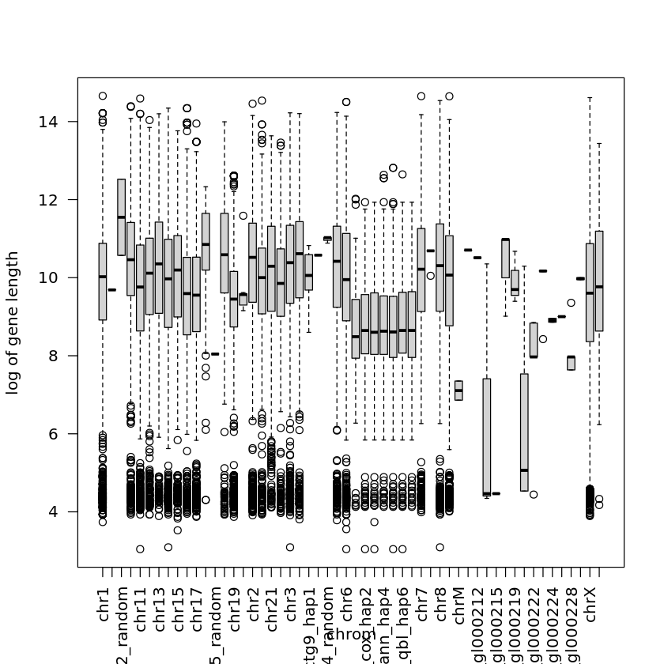
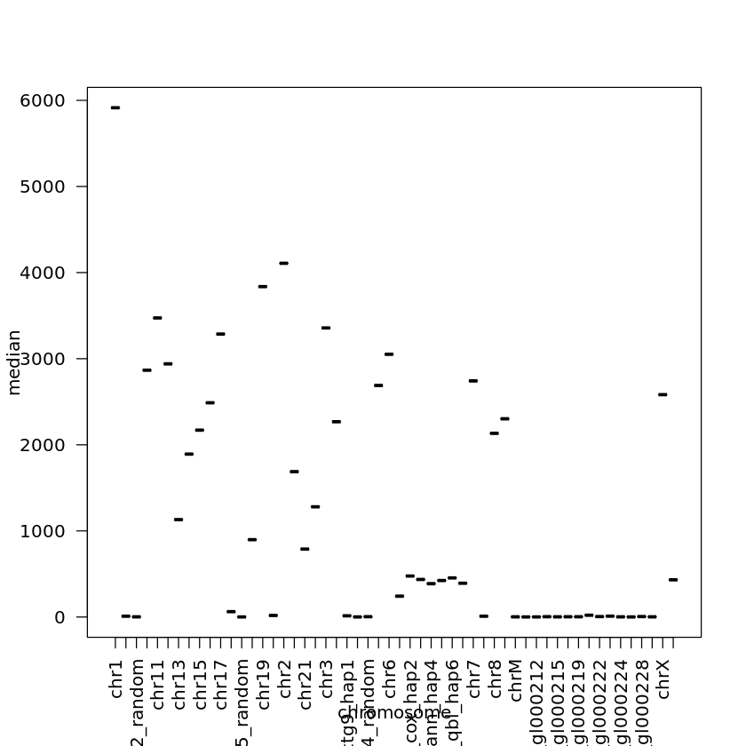
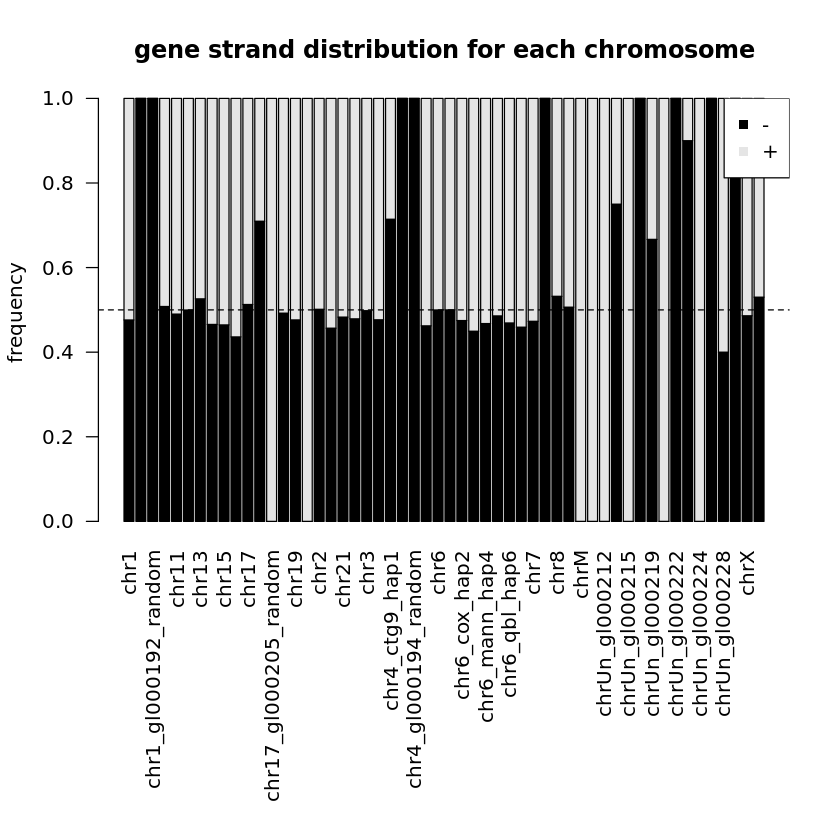
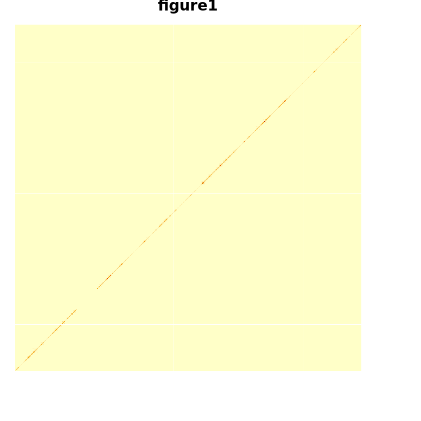
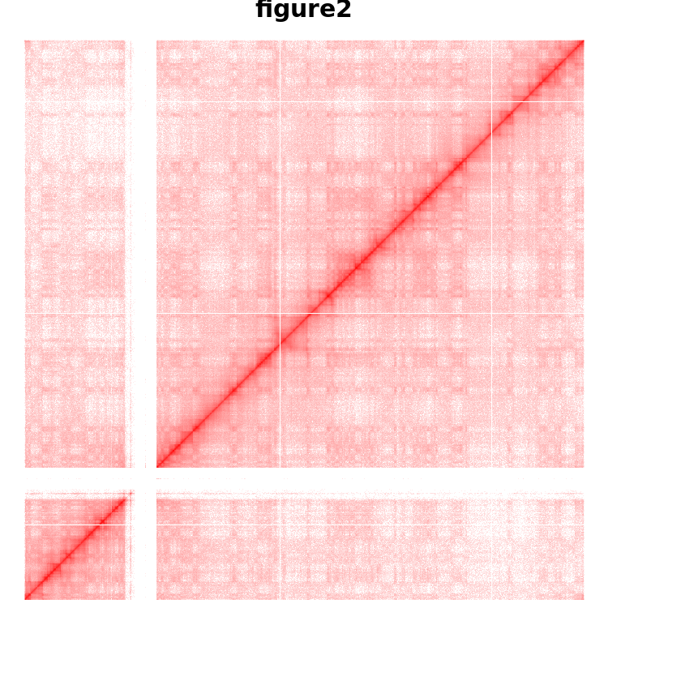
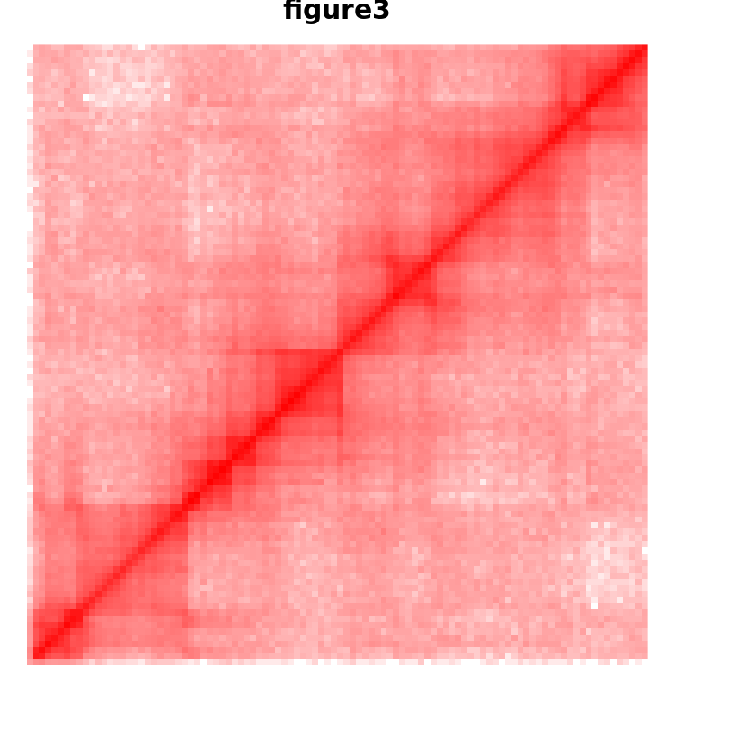
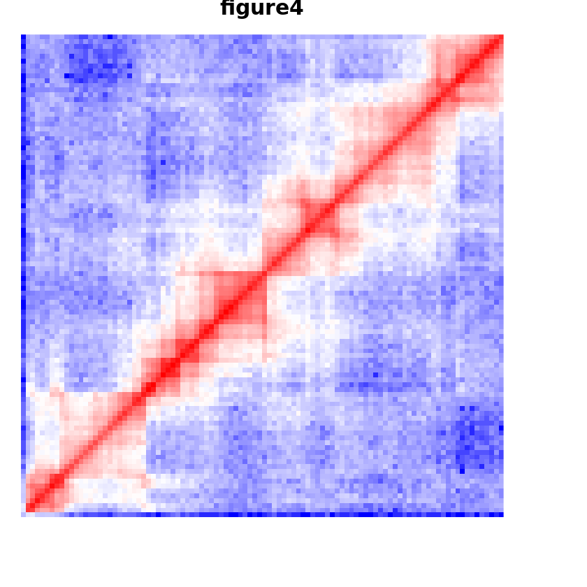

# 第五讲上机实验
1.用 `read.table` 读入 he19_gene_table.txt
(1) 分染色体画出基因长度取对数后的箱型图


```R
data <- read.table('/home/ubuntu/R_course/hg19_gene_table.txt', header = T)
with(data, boxplot(log(txEnd - txStart + 1) ~ chrom, ylab = 'log of gene length', las = 2))
```


    

    


(2) 对每条染色体计算基因数量和基因长度的中位数, 分别作为 x 和 y 画出散点图


```R
data <- read.table('/home/ubuntu/R_course/hg19_gene_table.txt', header = T)
gene <- as.data.frame(table(data$chrom))
data$geneLength <- data$txEnd - data$txStart + 1
lengthMedian <- tapply(data$geneLength, data$chrom, median)
plot(as.data.frame(table(data$chrom)), lengthMedian, xlab = 'chromosome', ylab = 'median', las = 2)
```


    

    


(3) 用函数 `prop.table` 分染色体计算 `+/- strand` 上基因的百分比
(a) 将上表数值用 `barplot` 画出来


```R
data <- read.table('/home/ubuntu/R_course/hg19_gene_table.txt', header = T)
simData <- as.data.frame(cbind(data$chrom, data$strand))
colnames(simData) <- c('chrom', 'strand')
# 染色体基因个数
table <- prop.table(table(simData$chrom, simData$strand),1)
par(oma=c(8,0,0,0))
barplot(t(table),las=2,col=c("black","grey90"),ylab="frequency",main="gene strand distribution for each chromosome")
legend("topright",legend=c("-","+"),col=c("black","grey90"),pch=15)
abline(h=0.5,lty=2)

```


    

    


```R
hm<-read.table('/home/ubuntu/R_course/R_data/gm12878_chr18.txt')
hm<-as.matrix(hm)
heatmap(hm,Rowv=NA,Colv=NA, labRow=NA,
        labCol=NA,scale="none",main="figure1")
ramp <- colorRamp(c("red", "white"))
cols<-rgb( ramp(seq(0, 1, length = 128)), max = 255)
heatmap(log(hm+1),col=rev(cols),
        Rowv=NA,Colv=NA, labRow=NA,
        labCol=NA,scale="none",main="figure2")
heatmap(log(hm[1:100,1:100]+1),col=rev(cols),
        Rowv=NA,Colv=NA, labRow=NA,
        labCol=NA,scale="none",main="figure3")
ramp <- colorRamp(c("red", "white", "blue"))
cols<-rgb( ramp(seq(0, 1, length = 128)), max = 255)
heatmap(log(hm[1:100,1:100]+1),col=rev(cols),
        Rowv=NA,Colv=NA, labRow=NA,
        labCol=NA,scale="none",main="figure4")
```


    

    


    

    


    

    


    

    


+ 取对数
+ 使用不同颜色增加图像对比度
