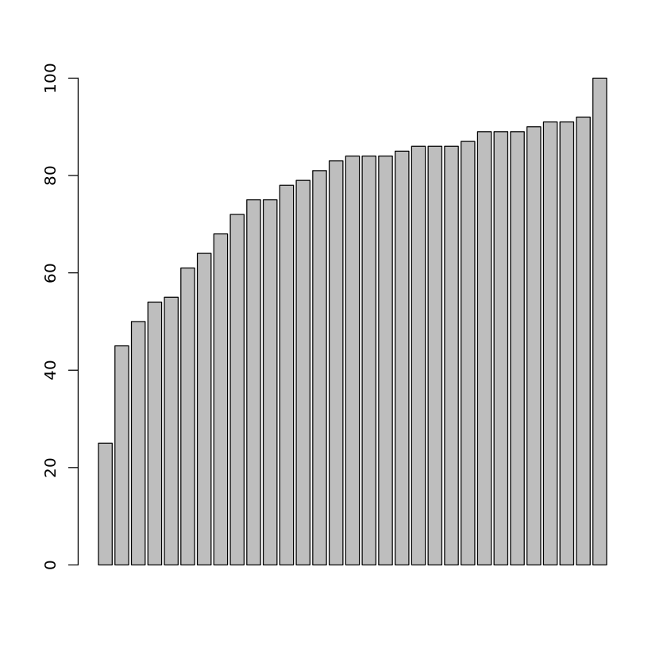
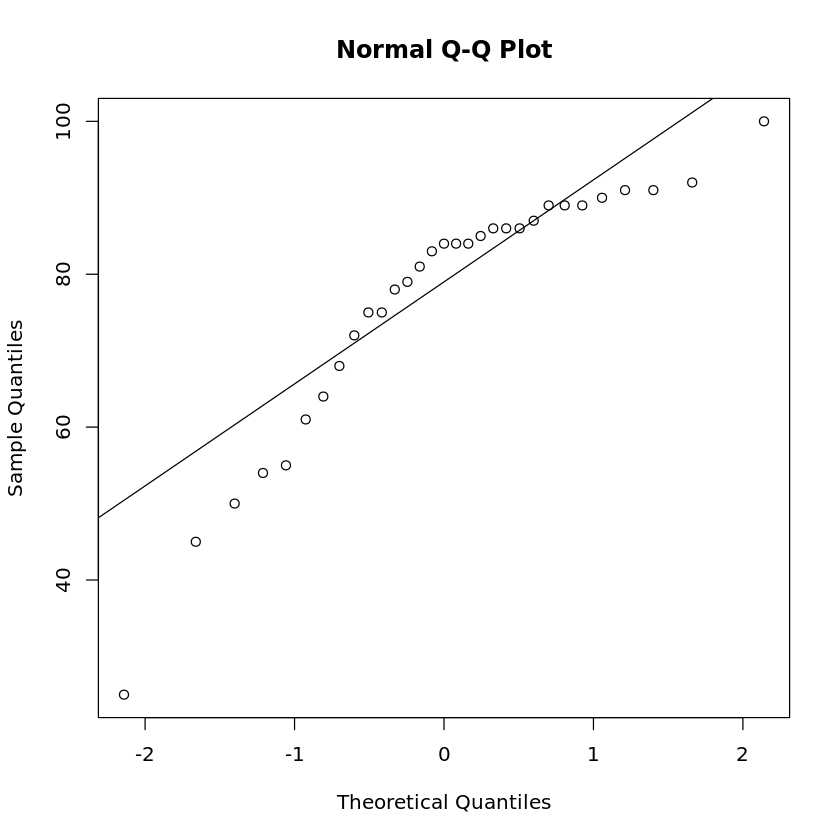

# 第六讲作业

> 生信 2001 张子栋 2020317210101
>
> GitHub 地址: [MarkdownNotes/R at main · Bluuur/MarkdownNotes (github.com)](https://github.com/Bluuur/MarkdownNotes/tree/main/R)

1.以下是某班的学生成绩
`25 45 50 54 55 61 64 68 72 75 75`
`78 79 81 83 84 84 84 85 86 86 86`
`87 89 89 89 90 91 91 92 100`
(1) 画出数据 `boxplot`，并获取 IQR 数值：


```R
data <- c(25, 45, 50, 54, 55, 61, 64, 68, 72, 75, 75,
          78, 79, 81, 83, 84, 84, 84, 85, 86, 86, 86,
          87, 89, 89, 89, 90, 91, 91, 92, 100)
barplot(data)
cat('IQR of grades is', IQR(data))
```

    IQR of grades is 18


​    

​    


(2) 利用各种方法进行检验是否服从正态分布？包括利用 QQ 图等进行可视化检验。


```R
data <- c(25, 45, 50, 54, 55, 61, 64, 68, 72, 75, 75,
          78, 79, 81, 83, 84, 84, 84, 85, 86, 86, 86,
          87, 89, 89, 89, 90, 91, 91, 92, 100)
# 正态性 W 检验方法
shapiro.test(data)

# ks 检验
ks.test(data, 'pnorm', mean(data), sd(data))

# Pearson 拟合优度卡方检验
chisq.test(data)

# QQ 图
qqnorm(data); qqline(data)
```


​    
    	Shapiro-Wilk normality test
    
    data:  data
    W = 0.86329, p-value = 0.0009853


    Warning message in ks.test(data, "pnorm", mean(data), sd(data)):
    “ties should not be present for the Kolmogorov-Smirnov test”


    	One-sample Kolmogorov-Smirnov test
    
    data:  data
    D = 0.1952, p-value = 0.1883
    alternative hypothesis: two-sided


​    
    	Chi-squared test for given probabilities
    
    data:  data
    X-squared = 109.04, df = 30, p-value = 6.594e-11


​    

​    


2.Mendel 用豌豆的两对相对形状进行杂交试验，黄色圆滑种子与绿色皱缩种子的豌豆杂交后，第二代根据自由组合规律，理论分离比为：`黄圆:黄皱:绿圆:绿皱=9:3:3:1`

实际实验值为：
黄圆 315 粒，黄皱 101 粒，绿圆 32 粒，绿皱 32 粒，共 556 粒，问次结果是否符合自由组合规律？


```R
chisq.test(c(315, 101, 32, 32), p = c(9, 3, 3, 1) / 16)
```


​    
    	Chi-squared test for given probabilities
    
    data:  c(315, 101, 32, 32)
    X-squared = 46.356, df = 3, p-value = 4.765e-10


`p > 2.2e-16` 所以不符合

3.读入 `cjb.txt` 文件中的学生成绩，对不同科目成绩计算相关系数，并做显著性检验，以及该检验的零假设和备择假设。


```R
library(ggm)
library(igraph)
library(psych)
student <- read.table('cjb.txt', header = T, encoding = 'UTF-8')
student <- as.matrix(student)
marks <- student[,3:4]
data(marks)
corr.test(marks, method = 'spearman')

Call:corr.test(x = marks, method = "spearman")
Correlation matrix 
           mechanics vectors algebra analysis statistics
mechanics       1.00    0.50    0.48     0.42       0.38
vectors         0.50    1.00    0.61     0.55       0.43
algebra         0.48    0.61    1.00     0.74       0.62
analysis        0.42    0.55    0.74     1.00       0.63
statistics      0.38    0.43    0.62     0.63       1.00
Sample Size 
[1] 88
Probability values (Entries above the diagonal are adjusted for multiple tests.) 
           mechanics vectors algebra analysis statistics
mechanics          0       0       0        0          0
vectors            0       0       0        0          0
algebra            0       0       0        0          0
analysis           0       0       0        0          0
statistics         0       0       0        0          0

 To see confidence intervals of the correlations, print with the short=FALSE option
```

4.课件中提到 `plot` 命令
`plot(x, ..., ylab='Fn(x)', vertical = FALSE, col.01line = 'gray70')`
其中有一个参数 
`col.01line = gray70`
请解释该参数对应图形中的什么元素？

图中虚线的颜色
