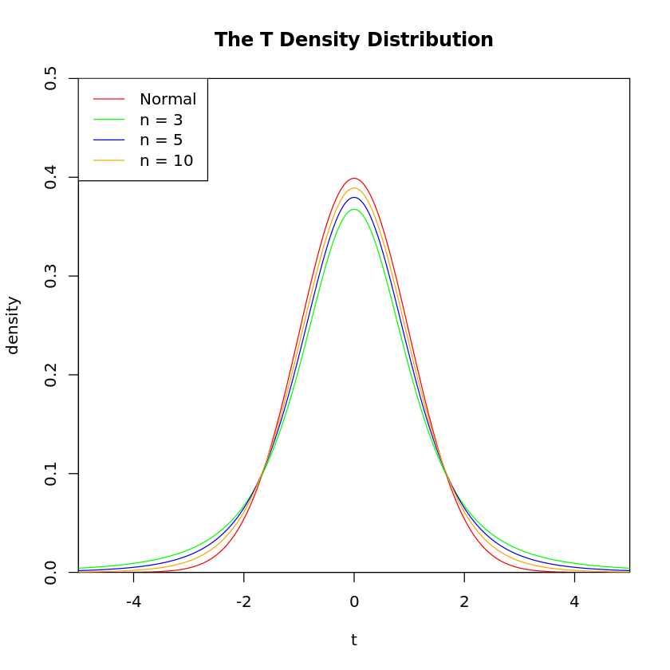

# 第七讲习题

> 生信 2001 张子栋 2020317210101
>
> GitHub 地址: [MarkdownNotes/R at main · Bluuur/MarkdownNotes (github.com)](https://github.com/Bluuur/MarkdownNotes/tree/main/R)

1.假设:
$H_0 :$ 元件的平均寿命为 $225$ 小时
$H_A :$ 元件的平均寿命不为 $225$ 小时


```R
data <- c(159, 280, 101, 212, 224, 379, 179, 264, 222, 362, 168, 250, 149, 260, 485, 170)
t.test(data, mu = 225)
```


​    
​    	One Sample t-test
​    
    data:  data
    t = 0.66852, df = 15, p-value = 0.514
    alternative hypothesis: true mean is not equal to 225
    95 percent confidence interval:
     188.8927 294.1073
    sample estimates:
    mean of x 
        241.5 


元件的平均寿命不是 $225$ 小时

2.假设
$H_0:$ 两个班选课比例相同
$H_A:$ 两个班选课比例不同


```R
x<- c(28, 22)
y <- c(31, 31)
prop.test(x, y)
```


​    
​    	2-sample test for equality of proportions with continuity correction
​    
    data:  x out of y
    X-squared = 2.5833, df = 1, p-value = 0.108
    alternative hypothesis: two.sided
    95 percent confidence interval:
     -0.02940064  0.41649741
    sample estimates:
       prop 1    prop 2 
    0.9032258 0.7096774 


两个班的选课比例不同

3.假设
$H_0:$ 调查结果支持该市老年人口比重为 $14.7\%$
$H_A:$ 调查结果不支持该市老年人口比重为 $14.7\%$


```R
binom.test(57, 400, 0.147)
prop.test(57, 400, 0.147, correct = F)
chisq.test(c(57, 343), p = c(0.147, 0.853))
```


​    
​    	Exact binomial test
​    
    data:  57 and 400
    number of successes = 57, number of trials = 400, p-value = 0.8876
    alternative hypothesis: true probability of success is not equal to 0.147
    95 percent confidence interval:
     0.1097477 0.1806511
    sample estimates:
    probability of success 
                    0.1425 


​    
​    	1-sample proportions test without continuity correction
​    
    data:  57 out of 400, null probability 0.147
    X-squared = 0.064598, df = 1, p-value = 0.7994
    alternative hypothesis: true p is not equal to 0.147
    95 percent confidence interval:
     0.1116383 0.1801630
    sample estimates:
         p 
    0.1425 


​    
​    	Chi-squared test for given probabilities
​    
    data:  c(57, 343)
    X-squared = 0.064598, df = 1, p-value = 0.7994


调查结果不支持该市老年人口比重为 $14.7\%$ 的看法

4


```R

x <- seq(-5, 5, length.out = 1000)
y <- dnorm(x)

plot(x, y, col = "red", xlim = c(-5, 5), ylim = c(0, 0.5), type = 'l',
     xaxs = "i", yaxs = "i", ylab = 'density', xlab = 't',
     main = "The T Density Distribution")

lines(x, dt(x, 3, 0), col = "green")
lines(x, dt(x, 5, 0), col = "blue")
lines(x, dt(x, 10, 0), col = "orange")

legend("topleft", legend = c("Normal", paste("n =", c(3, 5, 10))), lwd = 1, col = c("red", "green", "blue", "orange"))
```


​    

​    

