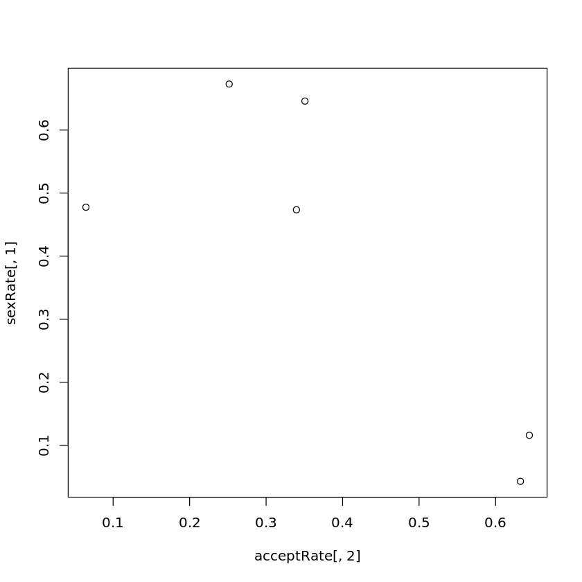

# 第七次上机

> 生信 2001 张子栋 2020317210101
>
> GitHub 地址: [MarkdownNotes/R at main · Bluuur/MarkdownNotes (github.com)](https://github.com/Bluuur/MarkdownNotes/tree/main/R)

1.(1)


```R
myData <- read.table('/home/ubuntu/R_course/hg19_gene_table.txt', header = T)
idx <- grep('_', myData$chrom)
myData <- myData[-idx,]
table <- table(myData$chrom, myData$strand)
table <- as.data.frame.matrix(table)
# (1) 对不同 strand 基因在各染色体上的比例是否相同做统计检验
# 相同, p-value < 0.05
chisq.test(table)

# (2)  对不同 strand 基因在 chr4, chr5 上的比例是否相同做统计检验
#  不相同 p-value > 0.05
chisq.test(table[17:18,])

# (3) 计算基因长度 glen
glen <- myData$txEnd - myData$txStart + 1
# (3) (a)
lgl <- log(glen)
# (3) (b)
lgl[lgl < 5] <- NA
pairwise.t.test(lgl, myData$chrom, p.adjust.method = 'fdr')
# (3) (c)
# 不是来自相同分布
wilcox.test(glen[17:18])
```

    Warning message in chisq.test(table):
    “Chi-squared approximation may be incorrect”


    	Pearson's Chi-squared test
    
    data:  table
    X-squared = 110.35, df = 24, p-value = 4.891e-13


​    
    	Pearson's Chi-squared test with Yates' continuity correction
    
    data:  table[17:18, ]
    X-squared = 0.96437, df = 1, p-value = 0.3261


​    
    	Pairwise comparisons using t tests with pooled SD 
    
    data:  lgl and myData$chrom 
    
          chr1    chr10   chr11   chr12   chr13   chr14   chr15   chr16   chr17  
    chr10 < 2e-16 -       -       -       -       -       -       -       -      
    chr11 7.6e-12 < 2e-16 -       -       -       -       -       -       -      
    chr12 4.8e-05 < 2e-16 < 2e-16 -       -       -       -       -       -      
    chr13 1.0e-15 0.00972 < 2e-16 1.8e-06 -       -       -       -       -      
    chr14 0.00583 < 2e-16 2.1e-14 0.57480 1.2e-06 -       -       -       -      
    chr15 < 2e-16 1.2e-06 < 2e-16 4.4e-05 0.19618 3.0e-05 -       -       -      
    chr16 < 2e-16 < 2e-16 0.01927 < 2e-16 < 2e-16 < 2e-16 < 2e-16 -       -      
    chr17 < 2e-16 < 2e-16 0.00022 < 2e-16 < 2e-16 < 2e-16 < 2e-16 0.29820 -      
    chr18 < 2e-16 0.00610 < 2e-16 < 2e-16 1.1e-05 < 2e-16 7.4e-10 < 2e-16 < 2e-16
    chr19 < 2e-16 < 2e-16 5.4e-12 < 2e-16 < 2e-16 < 2e-16 < 2e-16 0.00014 0.00318
    chr2  < 2e-16 0.12948 < 2e-16 < 2e-16 0.11045 < 2e-16 0.00015 < 2e-16 < 2e-16
    chr20 0.67794 < 2e-16 7.2e-06 0.00076 1.6e-12 0.01126 1.3e-11 5.4e-10 5.3e-14
    chr21 0.03828 9.7e-12 1.0e-08 0.75448 0.00011 0.92047 0.00193 1.7e-12 1.1e-15
    chr22 0.09513 < 2e-16 0.00480 1.8e-05 1.8e-14 0.00057 1.5e-13 7.1e-06 2.3e-08
    chr3  < 2e-16 0.00744 < 2e-16 2.9e-14 0.51260 8.2e-13 0.01090 < 2e-16 < 2e-16
    chr4  < 2e-16 0.43687 < 2e-16 < 2e-16 0.05984 4.8e-16 0.00012 < 2e-16 < 2e-16
    chr5  < 2e-16 0.00061 < 2e-16 3.8e-10 0.97958 1.4e-09 0.10736 < 2e-16 < 2e-16
    chr6  0.24959 < 2e-16 3.2e-12 0.01124 1.8e-11 0.10599 1.0e-10 < 2e-16 < 2e-16
    chr7  < 2e-16 2.1e-09 < 2e-16 0.00018 0.05984 0.00012 0.54074 < 2e-16 < 2e-16
    chr8  < 2e-16 0.00052 < 2e-16 2.3e-08 0.82241 3.7e-08 0.20102 < 2e-16 < 2e-16
    chr9  0.11632 < 2e-16 5.4e-12 0.06111 1.4e-09 0.26826 1.9e-08 < 2e-16 < 2e-16
    chrM  0.00533 0.00101 0.00982 0.00357 0.00160 0.00385 0.00201 0.01255 0.01407
    chrX  8.5e-08 < 2e-16 0.49193 3.9e-16 < 2e-16 4.5e-11 < 2e-16 0.00480 4.0e-05
    chrY  0.71991 2.9e-13 0.01180 0.03152 7.1e-07 0.08308 1.3e-05 0.00025 1.6e-05
          chr18   chr19   chr2    chr20   chr21   chr22   chr3    chr4    chr5   
    chr10 -       -       -       -       -       -       -       -       -      
    chr11 -       -       -       -       -       -       -       -       -      
    chr12 -       -       -       -       -       -       -       -       -      
    chr13 -       -       -       -       -       -       -       -       -      
    chr14 -       -       -       -       -       -       -       -       -      
    chr15 -       -       -       -       -       -       -       -       -      
    chr16 -       -       -       -       -       -       -       -       -      
    chr17 -       -       -       -       -       -       -       -       -      
    chr18 -       -       -       -       -       -       -       -       -      
    chr19 < 2e-16 -       -       -       -       -       -       -       -      
    chr2  0.00012 < 2e-16 -       -       -       -       -       -       -      
    chr20 < 2e-16 < 2e-16 < 2e-16 -       -       -       -       -       -      
    chr21 7.0e-15 < 2e-16 1.3e-09 0.03664 -       -       -       -       -      
    chr22 < 2e-16 2.4e-15 < 2e-16 0.28438 0.00407 -       -       -       -      
    chr3  3.8e-06 < 2e-16 0.18847 < 2e-16 2.6e-07 < 2e-16 -       -       -      
    chr4  0.00129 < 2e-16 0.57563 < 2e-16 1.3e-09 < 2e-16 0.09383 -       -      
    chr5  2.7e-07 < 2e-16 0.02720 < 2e-16 1.0e-05 < 2e-16 0.36114 0.01428 -      
    chr6  < 2e-16 < 2e-16 < 2e-16 0.21945 0.19241 0.01940 < 2e-16 < 2e-16 < 2e-16
    chr7  4.9e-12 < 2e-16 7.8e-07 4.1e-11 0.00567 4.5e-13 0.00047 1.4e-06 0.01500
    chr8  2.4e-07 < 2e-16 0.01957 6.3e-16 4.1e-05 < 2e-16 0.26282 0.01056 0.80017
    chr9  < 2e-16 < 2e-16 < 2e-16 0.11688 0.34373 0.00954 < 2e-16 < 2e-16 9.8e-15
    chrM  0.00058 0.01868 0.00121 0.00562 0.00382 0.00664 0.00142 0.00113 0.00160
    chrX  < 2e-16 2.0e-12 < 2e-16 0.00028 4.1e-07 0.03108 < 2e-16 < 2e-16 < 2e-16
    chrY  < 2e-16 6.6e-09 2.2e-11 0.90962 0.10572 0.54512 2.1e-09 1.6e-11 6.0e-08
          chr6    chr7    chr8    chr9    chrM    chrX   
    chr10 -       -       -       -       -       -      
    chr11 -       -       -       -       -       -      
    chr12 -       -       -       -       -       -      
    chr13 -       -       -       -       -       -      
    chr14 -       -       -       -       -       -      
    chr15 -       -       -       -       -       -      
    chr16 -       -       -       -       -       -      
    chr17 -       -       -       -       -       -      
    chr18 -       -       -       -       -       -      
    chr19 -       -       -       -       -       -      
    chr2  -       -       -       -       -       -      
    chr20 -       -       -       -       -       -      
    chr21 -       -       -       -       -       -      
    chr22 -       -       -       -       -       -      
    chr3  -       -       -       -       -       -      
    chr4  -       -       -       -       -       -      
    chr5  -       -       -       -       -       -      
    chr6  -       -       -       -       -       -      
    chr7  2.4e-10 -       -       -       -       -      
    chr8  1.2e-15 0.04376 -       -       -       -      
    chr9  0.64586 6.9e-08 1.9e-12 -       -       -      
    chrM  0.00478 0.00220 0.00165 0.00452 -       -      
    chrX  1.0e-08 < 2e-16 < 2e-16 7.7e-09 0.00918 -      
    chrY  0.39231 4.2e-05 2.4e-07 0.27649 0.00583 0.03541
    
    P value adjustment method: fdr 


    	Wilcoxon signed rank exact test
    
    data:  glen[17:18]
    V = 3, p-value = 0.5
    alternative hypothesis: true location is not equal to 0


2


```R
myData <- read.table('/home/ubuntu/R_course/UCB_admission.txt', header = T)
# (1)
table <- table(myData$sex, myData$accepted)
prop.test(table)
# p-value < 0.05 录取率相同

# (2)
acceptRate <- prop.table(table(myData$department, myData$accepted), 1)
acceptRate
sexRate <- prop.table(table(myData$department, myData$sex), 1)
sexRate
cor(acceptRate[, 2],sexRate[,1])
cor.test(acceptRate[, 2],sexRate[,1])


# (3)
plot(x = acceptRate[, 2], sexRate[, 1])
print('-----------')
print('分析性别录取率')
prop.table(table(myData$accepted, myData$sex, myData$department), c(2, 3))
b <- as.array(table(myData$accepted, myData$sex, myData$department))
print('-----------')
print('差异性检验')
apply(b, 3, chisq.test)

```


​    
    	2-sample test for equality of proportions with continuity correction
    
    data:  table
    X-squared = 91.61, df = 1, p-value < 2.2e-16
    alternative hypothesis: two.sided
    95 percent confidence interval:
     0.1129887 0.1703022
    sample estimates:
       prop 1    prop 2 
    0.6964578 0.5548123 

                 N          Y
      A 0.35584137 0.64415863
      B 0.36752137 0.63247863
      C 0.64923747 0.35076253
      D 0.66035354 0.33964646
      E 0.74828767 0.25171233
      F 0.93557423 0.06442577


            female       male
      A 0.11575563 0.88424437
      B 0.04273504 0.95726496
      C 0.64596950 0.35403050
      D 0.47348485 0.52651515
      E 0.67294521 0.32705479
      F 0.47759104 0.52240896

相关系数为 -0.785793618734187


    	Pearson's product-moment correlation
    
    data:  acceptRate[, 2] and sexRate[, 1]
    t = -2.541, df = 4, p-value = 0.06391
    alternative hypothesis: true correlation is not equal to 0
    95 percent confidence interval:
     -0.9753531  0.0711263
    sample estimates:
           cor 
    -0.7857936 


​       
```R
[1] "-----------"
[1] "分析性别录取率"

, ,  = A

        female       male
  N 0.17592593 0.37939394
  Y 0.82407407 0.62060606

, ,  = B
        female       male
  N 0.32000000 0.36964286
  Y 0.68000000 0.63035714

, ,  = C 
        female       male
  N 0.65935919 0.63076923
  Y 0.34064081 0.36923077

, ,  = D
        female       male
  N 0.65066667 0.66906475
  Y 0.34933333 0.33093525

, ,  = E       
        female       male
  N 0.76081425 0.72251309
  Y 0.23918575 0.27748691

, ,  = F       
        female       male
  N 0.92961877 0.94101877
  Y 0.07038123 0.05898123
```

    [1] "-----------"
    [1] "差异性检验"

```
$A

	Pearson's Chi-squared test with Yates' continuity correction

data:  array(newX[, i], d.call, dn.call)
X-squared = 16.372, df = 1, p-value = 5.205e-05
```

    $B
    
    	Pearson's Chi-squared test with Yates' continuity correction
    
    data:  array(newX[, i], d.call, dn.call)
    X-squared = 0.085098, df = 1, p-value = 0.7705

    $C
    
    	Pearson's Chi-squared test with Yates' continuity correction
    
    data:  array(newX[, i], d.call, dn.call)
    X-squared = 0.63322, df = 1, p-value = 0.4262

    $D
    
    	Pearson's Chi-squared test with Yates' continuity correction
    
    data:  array(newX[, i], d.call, dn.call)
    X-squared = 0.22159, df = 1, p-value = 0.6378

    $E
    
    	Pearson's Chi-squared test with Yates' continuity correction
    
    data:  array(newX[, i], d.call, dn.call)
    X-squared = 0.80805, df = 1, p-value = 0.3687

    $F
    
    	Pearson's Chi-squared test with Yates' continuity correction
    
    data:  array(newX[, i], d.call, dn.call)
    X-squared = 0.21824, df = 1, p-value = 0.6404



    


