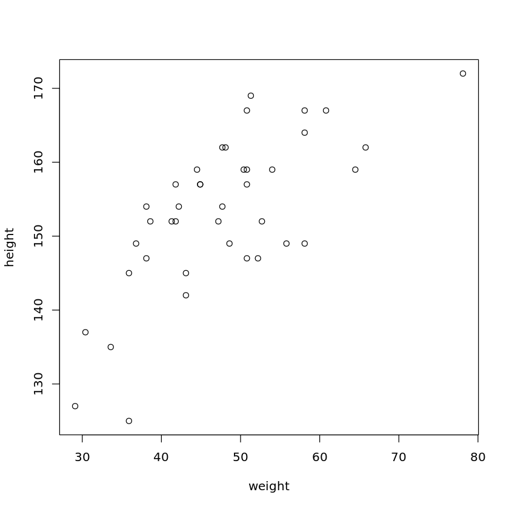

# 第八讲习题

> 生信 2001 张子栋 2020317210101
>
> GitHub 地址: [MarkdownNotes/R at main · Bluuur/MarkdownNotes (github.com)](https://github.com/Bluuur/MarkdownNotes/tree/main/R)

1.读入包含一组学生身高和体重数据的文件 `class.txt`
(1).检验不同性别学生身高是否显著不同
(2).构建线性回归模型, 用身高来预测体重
(3).在该线性模型中, 对你的身高, 预测体重及 $95\%$ 置信区间


```R
data <- read.table('/home/ubuntu/R_course/R_data/class.txt')

# (1) 检验不同性别学生身高是否显著不同
male <- data[data$V5 == 'M',]$V3
female <- data[data$V5 == 'F',]$V3
t.test(male, female)
# p < 0.05 不同性别学生身高显著不同

# (2) 构建线性回归模型, 用身高来预测体重
height <- data$V3
weight <- data$V4
lm.sol <- lm(weight ~ height)
plot(weight, height)
abline(lm.sol)
summary(lm.sol)

# (3) 在该线性模型中, 对你的身高, 预测体重及 95% 置信区间
myHeight <- data.frame(height = 174)
predict(lm.sol, myHeight, interval = 'prediction', level = 0.95)
```


​    
    	Welch Two Sample t-test
    
    data:  male and female
    t = 2.4377, df = 37.975, p-value = 0.01958
    alternative hypothesis: true difference in means is not equal to 0
    95 percent confidence interval:
      1.275635 13.774870
    sample estimates:
    mean of x mean of y 
     156.6364  149.1111 


​    
    Call:
    lm(formula = weight ~ height)
    
    Residuals:
         Min       1Q   Median       3Q      Max 
    -10.0735  -5.9364  -0.7291   3.7854  17.6629 
    
    Coefficients:
                Estimate Std. Error t value Pr(>|t|)    
    (Intercept) -56.7486    16.9124  -3.355  0.00181 ** 
    height        0.6813     0.1101   6.188 3.15e-07 ***
    ---
    Signif. codes:  0 ‘***’ 0.001 ‘**’ 0.01 ‘*’ 0.05 ‘.’ 0.1 ‘ ’ 1
    
    Residual standard error: 7.203 on 38 degrees of freedom
    Multiple R-squared:  0.5019,	Adjusted R-squared:  0.4888 
    F-statistic: 38.29 on 1 and 38 DF,  p-value: 3.147e-07


<table class="dataframe">
<caption>A matrix: 1 × 3 of type dbl</caption>
<thead>
	<tr><th></th><th scope=col>fit</th><th scope=col>lwr</th><th scope=col>upr</th></tr>
</thead>
<tbody>
	<tr><th scope=row>1</th><td>61.79973</td><td>46.32926</td><td>77.27019</td></tr>
</tbody>
</table>



    


```R

```
