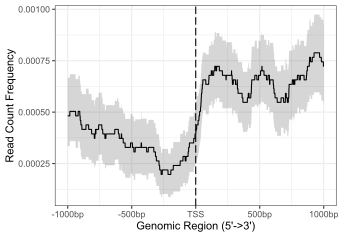
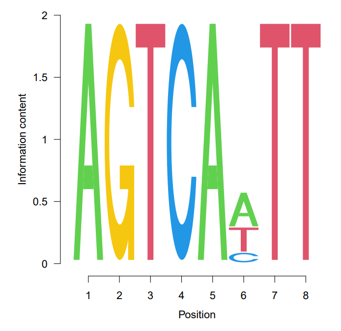

# R in NGS 实验 3

<center>生信 2001 张子栋 2020317210101</center>

## 实验步骤及结果

```R
> library(systemPipeR)
> library(systemPipeRdata)
> setwd(choose.dir())
> genWorkenvir(workflow = "chipseq")
> targetsPath <- system.file("extdata", "targets_chip.txt", package = "systemPipeR")
> targets <- read.delim(targetsPath, comment.char = "#")
> targets[1:4, -c(5, 6)]
                     FileName SampleName Factor SampleLong SampleReference
1 ./data/SRR446027_1.fastq.gz        M1A     M1  Mock.1h.A                
2 ./data/SRR446028_1.fastq.gz        M1B     M1  Mock.1h.B                
3 ./data/SRR446029_1.fastq.gz        A1A     A1   Avr.1h.A             M1A
4 ./data/SRR446030_1.fastq.gz        A1B     A1   Avr.1h.B             M1B
> dir_path <- system.file("extdata/cwl/preprocessReads/trim-se", package = "systemPipeR")
> trim <- loadWF(targets = targetsPath, wf_file = "trim-se.cwl", input_file = "trim-se.yml", dir_path = dir_path)
> trim <- renderWF(trim, inputvars = c(FileName = "_FASTQ_PATH1_", SampleName = "_SampleName_"))
> output(trim)[1:2]
$M1A
$M1A$`trim-se`
[1] "./results/M1A.fastq_trim.gz"


$M1B
$M1B$`trim-se`
[1] "./results/M1B.fastq_trim.gz"
> filterFct <- function(fq, cutoff = 20, Nexceptions = 0) {
+     qcount <- rowSums(as(quality(fq), "matrix") <= cutoff, na.rm = TRUE)
+     fq[qcount <= Nexceptions]
+     # Retains reads where Phred scores are >= cutoff with N
+     # exceptions
+ }
> preprocessReads(args = trim, Fct = "filterFct(fq, cutoff=20, Nexceptions=0)", 
+                 batchsize = 1e+05)
44022 processed reads written to file: ./results/M1A.fastq_trim.gz 
44927 processed reads written to file: ./results/M1B.fastq_trim.gz 
47793 processed reads written to file: ./results/A1A.fastq_trim.gz 
41201 processed reads written to file: ./results/A1B.fastq_trim.gz 
38549 processed reads written to file: ./results/V1A.fastq_trim.gz 
49362 processed reads written to file: ./results/V1B.fastq_trim.gz 
58018 processed reads written to file: ./results/M6A.fastq_trim.gz 
41708 processed reads written to file: ./results/M6B.fastq_trim.gz 
54241 processed reads written to file: ./results/A6A.fastq_trim.gz 
62722 processed reads written to file: ./results/A6B.fastq_trim.gz 
52165 processed reads written to file: ./results/V6A.fastq_trim.gz 
50684 processed reads written to file: ./results/V6B.fastq_trim.gz 
41583 processed reads written to file: ./results/M12A.fastq_trim.gz 
49316 processed reads written to file: ./results/M12B.fastq_trim.gz 
56692 processed reads written to file: ./results/A12A.fastq_trim.gz 
58547 processed reads written to file: ./results/A12B.fastq_trim.gz 
42475 processed reads written to file: ./results/V12A.fastq_trim.gz 
56732 processed reads written to file: ./results/V12B.fastq_trim.gz
> writeTargetsout(x = trim, file = "targets_chip_trim.txt", step = 1, 
+                 new_col = "FileName", new_col_output_index = 1, overwrite = TRUE)
	 Written content of 'targetsout(x)' to file: targets_chip_trim.txt 
> library(BiocParallel)
> library(batchtools)
> f <- function(x) {
+     targets <- system.file("extdata", "targets_chip.txt", package = "systemPipeR")
+     dir_path <- system.file("extdata/cwl/preprocessReads/trim-se", 
+                             package = "systemPipeR")
+     trim <- loadWorkflow(targets = targets, wf_file = "trim-se.cwl", 
+                          input_file = "trim-se.yml", dir_path = dir_path)
+     trim <- renderWF(trim, inputvars = c(FileName = "_FASTQ_PATH1_", 
+                                          SampleName = "_SampleName_"))
+     seeFastq(fastq = infile1(trim)[x], batchsize = 1e+05, klength = 8)
+ }
> resources <- list(walltime = 120, ntasks = 1, ncpus = 4, memory = 1024)
> fqlist <- lapply(seq(along = trim), f)
> pdf("./results/fastqReport.pdf", height = 18, width = 4 * length(fqlist))
```


> 矢量图，可放大。

```R
> seeFastqPlot(unlist(fqlist, recursive = FALSE))
> dev.off()
pdf 
  2 
> library(ChIPpeakAnno)
> library(GenomicFeatures)
> dir_path <- system.file("extdata/cwl/annotate_peaks", package = "systemPipeR")
> dir_path <- system.file("extdata/cwl/annotate_peaks", package = "systemPipeR")
> args <- loadWF(targets = "targets_macs.txt", wf_file = "annotate_peaks.cwl", 
+                input_file = "annotate_peaks.yml", dir_path = dir_path)
> args <- renderWF(args, inputvars = c(FileName = "_FASTQ_PATH1_", 
+                                      SampleName = "_SampleName_"))
> 
> txdb <- makeTxDbFromGFF(file = "data/tair10.gff", format = "gff", 
+                         dataSource = "TAIR", organism = "Arabidopsis thaliana")
> for (i in seq(along = args)) {
+     peaksGR <- as(read.delim(infile1(args)[i], comment = "#"), 
+                   "GRanges")
+     annotatedPeak <- annotatePeakInBatch(peaksGR, AnnotationData = genes(txdb))
+     df <- data.frame(as.data.frame(annotatedPeak), as.data.frame(values(ge[values(annotatedPeak)$feature, 
+     ])))
+     df$tx_type <- unlist(df$tx_type)
+     tx_name <- c()
+     for (j in df$tx_name){
+         tx_name <- rbind(tx_name, j[1])
+     }
+     df$tx_name <- tx_name
+     outpaths <- subsetWF(args, slot = "output", subset = 1, index = 1)
+     write.table(df, outpaths[i], quote = FALSE, row.names = FALSE,
+                 sep = "\t")
+ }
> writeTargetsout(x = args, file = "targets_peakanno.txt", step = 1, 
+                 new_col = "FileName", new_col_output_index = 1, overwrite = TRUE)
> library(ChIPseeker)
> for (i in seq(along = args)) {
+     peakAnno <- annotatePeak(infile1(args)[i], TxDb = txdb, verbose = FALSE)
+     df <- as.data.frame(peakAnno)
+     outpaths <- subsetWF(args, slot = "output", subset = 1, index = 1)
+     write.table(df, outpaths[i], quote = FALSE, row.names = FALSE, 
+                 sep = "\t")
+ }
> writeTargetsout(x = args, file = "targets_peakanno.txt", step = 1, 
+                 new_col = "FileName", new_col_output_index = 1, overwrite = TRUE)
> library(ChIPseeker)
> for (i in seq(along = args)) {
+     peakAnno <- annotatePeak(infile1(args)[i], TxDb = txdb, verbose = FALSE)
+     df <- as.data.frame(peakAnno)
+     outpaths <- subsetWF(args, slot = "output", subset = 1, index = 1)
+     write.table(df, outpaths[i], quote = FALSE, row.names = FALSE, 
+                 sep = "\t")
+ }
> writeTargetsout(x = args, file = "targets_peakanno.txt", step = 1, 
+                 new_col = "FileName", new_col_output_index = 1, overwrite = TRUE)
	 Written content of 'targetsout(x)' to file: targets_peakanno.txt 
> peak <- readPeakFile(infile1(args)[1])
> covplot(peak, weightCol = "X.log10.pvalue.")
> outpaths <- subsetWF(args, slot = "output", subset = 1, index = 1)
> peakHeatmap(outpaths[1], TxDb = txdb, upstream = 1000, downstream = 1000, 
+             palette = 'Reds')
> plotAvgProf2(outpaths[1], TxDb = txdb, upstream = 1000, downstream = 1000, conf=0.05,
+              xlab = "Genomic Region (5'->3')", ylab = "Read Count Frequency")
```




```R
> library(GenomicRanges)
> dir_path <- system.file("extdata/cwl/count_rangesets", package = "systemPipeR")
> args <- loadWF(targets = "targets_macs.txt", wf_file = "count_rangesets.cwl", 
+                input_file = "count_rangesets.yml", dir_path = dir_path)
> args <- renderWF(args, inputvars = c(FileName = "_FASTQ_PATH1_", 
+                                      SampleName = "_SampleName_"))
> targets <- system.file("extdata", "targets_chip.txt", package = "systemPipeR")
> dir_path <- system.file("extdata/cwl/bowtie2", package = "systemPipeR")
> args_bam <- loadWF(targets = targets, wf_file = "bowtie2-mapping-se.cwl", 
+                    input_file = "bowtie2-mapping-se.yml", dir_path = dir_path)
> args_bam <- renderWF(args_bam, inputvars = c(FileName = "_FASTQ_PATH1_", 
+                                              SampleName = "_SampleName_"))
> args_bam <- output_update(args_bam, dir = FALSE, replace = TRUE, 
+                           extension = c(".sam", ".bam"))
> outpaths <- subsetWF(args_bam, slot = "output", subset = 1, index = 1)
> bfl <- BamFileList(outpaths, yieldSize = 50000, index = character())
> # countDFnames <- countRangeset(bfl, args, mode = "Union", ignore.strand = TRUE) # skipped
> # writeTargetsout(x = args, file = "targets_countDF.txt", step = 1, new_col = "FileName", new_col_output_index = 1, overwrite = TRUE) # skipped
> library(GenomicRanges)
> dir_path <- system.file("extdata/cwl/count_rangesets", package = "systemPipeR")
> args <- loadWF(targets = "targets_macs.txt", wf_file = "count_rangesets.cwl", 
+                input_file = "count_rangesets.yml", dir_path = dir_path)
> args <- renderWF(args, inputvars = c(FileName = "_FASTQ_PATH1_", 
+                                      SampleName = "_SampleName_"))
> 
> ## Bam Files
> targets <- system.file("extdata", "targets_chip.txt", package = "systemPipeR")
> dir_path <- system.file("extdata/cwl/bowtie2", package = "systemPipeR")
> args_bam <- loadWF(targets = targets, wf_file = "bowtie2-mapping-se.cwl", 
+                    input_file = "bowtie2-mapping-se.yml", dir_path = dir_path)
> args_bam <- renderWF(args_bam, inputvars = c(FileName = "_FASTQ_PATH1_", 
+                                              SampleName = "_SampleName_"))
> args_bam <- output_update(args_bam, dir = FALSE, replace = TRUE, 
+                           extension = c(".sam", ".bam"))
> outpaths <- subsetWF(args_bam, slot = "output", subset = 1, index = 1)
> bfl <- BamFileList(outpaths, yieldSize = 50000, index = character())
> countDFnames <- countRangeset(bfl, args, mode = "Union", ignore.strand = TRUE)
> dir_path <- system.file("extdata/cwl/rundiff", package = "systemPipeR")
> args_diff <- loadWF(targets = "targets_countDF.txt", wf_file = "rundiff.cwl", 
+                     input_file = "rundiff.yml", dir_path = dir_path)
> args_diff <- renderWF(args_diff, inputvars = c(FileName = "_FASTQ_PATH1_", 
+                                                SampleName = "_SampleName_"))
> 
> cmp <- readComp(file = args_bam, format = "matrix")
> dbrlist <- runDiff(args = args_diff, diffFct = run_edgeR, targets = targets.as.df(targets(args_bam)), 
+                    cmp = cmp[[1]], independent = TRUE, dbrfilter = c(Fold = 2, 
+                                                                      FDR = 1))
Disp = 0.25073 , BCV = 0.5007 
Disp = 0.15223 , BCV = 0.3902 
Disp = 0.19792 , BCV = 0.4449 
Disp = 0.11692 , BCV = 0.3419 
Disp = 0.09286 , BCV = 0.3047 
Disp = 0.14312 , BCV = 0.3783 
Disp = 0.17049 , BCV = 0.4129 
Disp = 0.09671 , BCV = 0.311 
Disp = 0.14805 , BCV = 0.3848 
Wrote count result 1 to M1A_peaks.edgeR.xls 
Saved plot 1 to M1A_peaks.edgeR.xls.pdf 
Disp = 0.23843 , BCV = 0.4883 
Disp = 0.11547 , BCV = 0.3398 
Disp = 0.21655 , BCV = 0.4653 
Disp = 0.04269 , BCV = 0.2066 
Disp = 0.15216 , BCV = 0.3901 
Disp = 0.12235 , BCV = 0.3498 
Disp = 0.20886 , BCV = 0.457 
Disp = 0.12322 , BCV = 0.351 
Disp = 0.20853 , BCV = 0.4567 
Wrote count result 2 to A1A_peaks.edgeR.xls 
Saved plot 2 to A1A_peaks.edgeR.xls.pdf 
Disp = 0.10458 , BCV = 0.3234 
Disp = 0.13358 , BCV = 0.3655 
Disp = 0.09085 , BCV = 0.3014 
Disp = 0.06552 , BCV = 0.256 
Disp = 0.13023 , BCV = 0.3609 
Disp = 0.1174 , BCV = 0.3426 
Disp = 0.09355 , BCV = 0.3059 
Disp = 0.08648 , BCV = 0.2941 
Disp = 0.0827 , BCV = 0.2876 
Wrote count result 3 to V1A_peaks.edgeR.xls 
Saved plot 3 to V1A_peaks.edgeR.xls.pdf 
Disp = 0.19174 , BCV = 0.4379 
Disp = 0.12306 , BCV = 0.3508 
Disp = 0.15138 , BCV = 0.3891 
Disp = 0.13047 , BCV = 0.3612 
Disp = 0.09703 , BCV = 0.3115 
Disp = 0.16206 , BCV = 0.4026 
Disp = 0.17529 , BCV = 0.4187 
Disp = 0.1089 , BCV = 0.33 
Disp = 0.15879 , BCV = 0.3985 
Wrote count result 4 to M6A_peaks.edgeR.xls 
Saved plot 4 to M6A_peaks.edgeR.xls.pdf 
Disp = 0.10874 , BCV = 0.3298 
Disp = 0.17742 , BCV = 0.4212 
Disp = 0.12824 , BCV = 0.3581 
Disp = 0.24666 , BCV = 0.4967 
Disp = 0.10608 , BCV = 0.3257 
Disp = 0.20981 , BCV = 0.4581 
Disp = 0.23416 , BCV = 0.4839 
Disp = 0.10848 , BCV = 0.3294 
Disp = 0.21298 , BCV = 0.4615 
Wrote count result 5 to A6A_peaks.edgeR.xls 
Saved plot 5 to A6A_peaks.edgeR.xls.pdf 
Disp = 0.12458 , BCV = 0.353 
Disp = 0.12455 , BCV = 0.3529 
Disp = 0.1462 , BCV = 0.3824 
Disp = 0.0498 , BCV = 0.2232 
Disp = 0.05905 , BCV = 0.243 
Disp = 0.06298 , BCV = 0.251 
Disp = 0.10963 , BCV = 0.3311 
Disp = 0.09929 , BCV = 0.3151 
Disp = 0.10645 , BCV = 0.3263 
Wrote count result 6 to V6A_peaks.edgeR.xls 
Saved plot 6 to V6A_peaks.edgeR.xls.pdf 
Disp = 0.19246 , BCV = 0.4387 
Disp = 0.10992 , BCV = 0.3315 
Disp = 0.15488 , BCV = 0.3935 
Disp = 0.12168 , BCV = 0.3488 
Disp = 0.09003 , BCV = 0.3 
Disp = 0.14578 , BCV = 0.3818 
Disp = 0.16995 , BCV = 0.4122 
Disp = 0.09506 , BCV = 0.3083 
Disp = 0.15563 , BCV = 0.3945 
Wrote count result 7 to M12A_peaks.edgeR.xls 
Saved plot 7 to M12A_peaks.edgeR.xls.pdf 
Disp = 0.29779 , BCV = 0.5457 
Disp = 0.16126 , BCV = 0.4016 
Disp = 0.26423 , BCV = 0.514 
Disp = 0.28419 , BCV = 0.5331 
Disp = 0.11531 , BCV = 0.3396 
Disp = 0.28049 , BCV = 0.5296 
Disp = 0.27675 , BCV = 0.5261 
Disp = 0.13993 , BCV = 0.3741 
Disp = 0.25 , BCV = 0.5 
Wrote count result 8 to A12A_peaks.edgeR.xls 
Saved plot 8 to A12A_peaks.edgeR.xls.pdf 
Disp = 0.22277 , BCV = 0.472 
Disp = 0.19447 , BCV = 0.441 
Disp = 0.17158 , BCV = 0.4142 
Disp = 0.23746 , BCV = 0.4873 
Disp = 0.14669 , BCV = 0.383 
Disp = 0.24076 , BCV = 0.4907 
Disp = 0.20954 , BCV = 0.4578 
Disp = 0.11004 , BCV = 0.3317 
Disp = 0.21206 , BCV = 0.4605 
Wrote count result 9 to V12A_peaks.edgeR.xls 
Saved plot 9 to V12A_peaks.edgeR.xls.pdf 
> writeTargetsout(x = args_diff, file = "targets_rundiff.txt", 
+                 step = 1, new_col = "FileName", new_col_output_index = 1, 
+                 overwrite = TRUE)
	 Written content of 'targetsout(x)' to file: targets_rundiff.txt 
> writeTargetsout(x = args_diff, file = "targets_rundiff.txt", 
+                 step = 1, new_col = "FileName", new_col_output_index = 1, 
+                 overwrite = TRUE)
	 Written content of 'targetsout(x)' to file: targets_rundiff.txt 
> dir_path <- system.file("extdata/cwl/annotate_peaks", package = "systemPipeR")
> args <- loadWF(targets = "targets_bam_ref.txt", wf_file = "annotate_peaks.cwl", 
+                input_file = "annotate_peaks.yml", dir_path = dir_path)
> args <- renderWF(args, inputvars = c(FileName1 = "_FASTQ_PATH1_", 
+                                      SampleName = "_SampleName_"))
> 
> args_anno <- loadWF(targets = "targets_macs.txt", wf_file = "annotate_peaks.cwl", 
+                     input_file = "annotate_peaks.yml", dir_path = dir_path)
> args_anno <- renderWF(args_anno, inputvars = c(FileName = "_FASTQ_PATH1_", 
+                                                SampleName = "_SampleName_"))
> annofiles <- subsetWF(args_anno, slot = "output", subset = 1, 
+                       index = 1)
> gene_ids <- sapply(names(annofiles), function(x) unique(as.character(read.delim(annofiles[x])[, 
+                                                                                               "geneId"])), simplify = FALSE)
> load("data/GO/catdb.RData")
> BatchResult <- GOCluster_Report(catdb = catdb, setlist = gene_ids, 
+                                 method = "all", id_type = "gene", CLSZ = 2, cutoff = 0.9, 
+                                 gocats = c("MF", "BP", "CC"), recordSpecGO = NULL)
> library(Biostrings)
> library(seqLogo)
> library(BCRANK)
> dir_path <- system.file("extdata/cwl/annotate_peaks", package = "systemPipeR")
> args <- loadWF(targets = "targets_macs.txt", wf_file = "annotate_peaks.cwl", 
+                input_file = "annotate_peaks.yml", dir_path = dir_path)
> args <- renderWF(args, inputvars = c(FileName = "_FASTQ_PATH1_", 
+                                      SampleName = "_SampleName_"))
> 
> rangefiles <- infile1(args)
> for (i in seq(along = rangefiles)) {
+     df <- read.delim(rangefiles[i], comment = "#")
+     peaks <- as(df, "GRanges")
+     names(peaks) <- paste0(as.character(seqnames(peaks)), "_", 
+                            start(peaks), "-", end(peaks))
+     peaks <- peaks[order(values(peaks)$X.log10.pvalue., decreasing = TRUE)]
+     pseq <- getSeq(FaFile("./data/tair10.fasta"), peaks)
+     names(pseq) <- names(peaks)
+     writeXStringSet(pseq, paste0(rangefiles[i], ".fasta"))
+ }
> set.seed(0)
> BCRANKout <- bcrank(paste0(rangefiles[1], ".fasta"), restarts = 25, 
+                     use.P1 = TRUE, use.P2 = TRUE)
> toptable(BCRANKout)
     Consensus    Score
1     AGTCAHTT 87.08268
2     ATGTNAGA 78.86206
3   CACAHDBAAM 78.43056
4      MGGTATC 77.63990
5    AMRCABAAR 69.68058
6    AWAARBCAA 69.00625
7   DCCDDGAAAS 62.46803
8   RYNTGNCTCT 61.84035
9   DHGABWGGAA 61.19199
10  TGNSHTTCHT 60.77090
11  GHTGABNTTM 60.46803
12  GCHGHTVTVT 58.78979
13  CABKBTGBHA 58.76985
14  AAHTBHCTVC 57.98167
15  DDBCGBCCDT 57.18527
16 TTVGMNAGWTC 56.98050
17 GATTKGBNGAA 55.79763
18 DDHCNGHCTTG 52.71424
19  AKAGAHAAGC 52.56690
20  TBRTAKCTNC 52.18433
21  ACGAWNTBRK 51.60559
22 VWCGTVNDVTT 50.63590
23 CVDGDTCAVVC 50.49847
24  GAHNAMASAC 49.08524
25  CCBASGYNDG 46.22657
> topMotif <- toptable(BCRANKout, 1)
> weightMatrix <- pwm(topMotif, normalize = FALSE)
> weightMatrixNormalized <- pwm(topMotif, normalize = TRUE)
> pdf("results/seqlogo.pdf")
> seqLogo(weightMatrixNormalized)
> dev.off()
RStudioGD 
        2 
```


