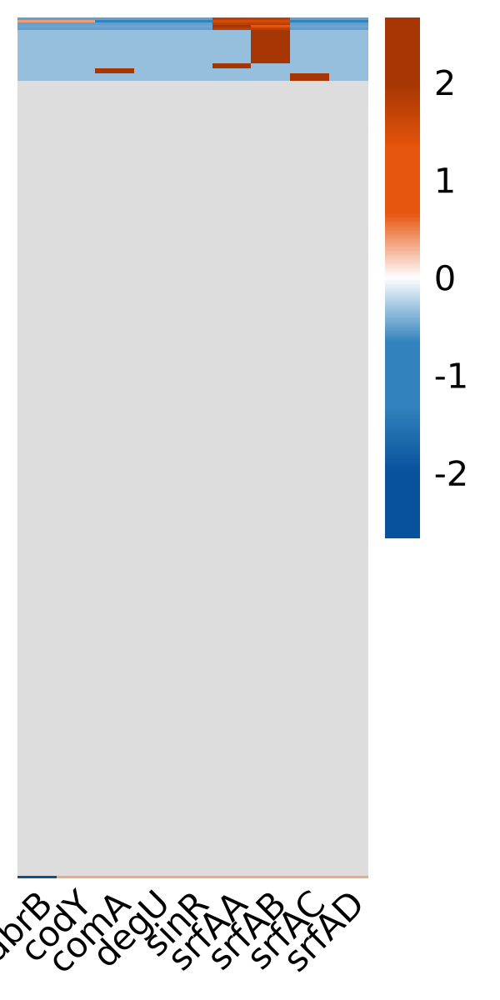

# 枯草芽孢杆菌群比较基因组分析

[toc]

<center><font face=微软雅黑>摘要</font></center>

为了深入理解枯草芽孢杆菌（*Bacillus subtilis*）适应性和生物技术潜力，以更好地利用枯草芽孢杆菌微生物资源，我们对从 NCBI 获取的 338 个枯草芽孢杆菌基因组进行了全面的比较基因组分析，以揭示该细菌群的遗传特性和进化历程，以及生物被膜形成与调控基因的分布情况。

本研究通过结构和功能注释、泛基因组分析和比较基因组分析，探究枯草芽孢杆菌的遗传多样性。我们还研究了枯草芽孢杆菌群生物被膜形成及调控相关基因簇的分布及其在不同菌株间的差异性。研究的基因有生物被膜形成中的重要成分表面素的操纵子基因 srfA 和生物被膜形成相关调控基因 abrB、codY、comA、degU 和 sinR。

综合分析的结果表明，本研究构建的泛基因组增强了我们对枯草芽孢杆菌遗传变异的理解，揭示了枯草芽孢杆菌核心基因和辅助基因功能的差异性。此外，筛选出的生物膜形成相关基因簇数量较多的菌株，为枯草芽孢杆菌在生物技术领域的潜在应用提供了新的前景，为开发具有物被膜形成方面高效生物合成能力的菌株提供了理论基础和遗传资源，进一步挖掘了枯草芽孢杆菌微生物资源的利用潜力。

<font face=微软雅黑>关键词：</font>枯草芽孢杆菌、生物被膜、表面素、*srfA* 操纵子、泛基因组、比较基因组、调控基因

<center><font face=微软雅黑>Abstract</font></center>

In order to gain a deeper understanding of the adaptability and biotechnological potential of *Bacillus subtilis*, and to better utilize the microbial resources of *Bacillus subtilis*, we conducted a comprehensive comparative genomic analysis of 338 *Bacillus subtilis* genomes obtained from NCBI. This analysis aimed to reveal the genetic characteristics and evolutionary history of this bacterial group, as well as the distribution of genes involved in biofilm formation and regulation.

This study explored the genetic diversity of *Bacillus subtilis* through structural and functional annotation, pan-genome analysis, and comparative genomic analysis. We also investigated the distribution of gene clusters related to biofilm formation and regulation within the *Bacillus subtilis* group, as well as the differences among various strains. The genes studied included the srfA operon gene, an important component in biofilm formation, and the regulatory genes abrB, codY, comA, degU, and sinR, which are associated with biofilm formation.

The results of the comprehensive analysis indicate that the pan-genome constructed in this study enhances our understanding of the genetic variation within *Bacillus subtilis*, revealing differences in the functions of core and accessory genes. Furthermore, the identification of strains with a higher number of gene clusters related to biofilm formation offers new prospects for the potential applications of *Bacillus subtilis* in the field of biotechnology. It provides a theoretical basis and genetic resources for the development of strains with high biofilm formation and efficient biosynthetic capabilities, further exploring the potential of *Bacillus subtilis* microbial resources.

<font face=Microsoft YaHei>Keywords:</font> *Bacillus subtilis*, biofilm, surfactin, *srfA* operon, pan-genome, comparative genomics, regulatory genes


## 前言

枯草芽孢杆菌（*Bacillus subtilis*）作为一类具有高度适应性和遗传多样性的细菌，在全球生态系统中起重要作用。它们不仅在土壤生态循环中发挥着关键作用，而且在工业生物技术领域，尤其是在酶的生产、生物修复和作为微生物肥料方面展现出广泛的应用潜力。枯草芽孢杆菌的这些特性使其成为微生物学和生物技术研究的热点。

枯草芽孢杆菌作为一种模式微生物，其基因组研究为理解细菌的生理、代谢和进化提供了丰富的信息。然而，传统的基因组分析侧重于单个或少数几个菌株 [1]，无法全面揭示物种内的遗传多样性。随着高通量测序技术的进步，我们得以对大量枯草芽孢杆菌基因组进行深入分析，以揭示其生物学特性和进化历史。 比较基因组分析通过整合多个菌株的基因组数据，提供了一个更为全面的视角，使我们能够探索物种内所有潜在的遗传变异。本研究通过对从 NCBI 下载的 338 个枯草芽孢杆菌基因组进行全面的结构和功能注释、泛基因组分析以及比较基因组分析，来探索这一细菌群的遗传多样性和功能复杂性。

```
1. 说明以前研究的基因组少 下文研究 8 个
	Kamada M, Hase S, Fujii K, et al. Whole-Genome Sequencing and Comparative Genome Analysis of Bacillus subtilis Strains Isolated from Non-Salted Fermented Soybean Foods[J]. D. Cantu. PLOS ONE, Public Library of Science (PLoS), 2015, 10(10): e0141369.
```

我们特别关注于枯草芽孢杆菌群生物被膜合成和调控基因簇的分布情况，生物被膜是微生物在固体表面生长过程中形成的一种高度结构化的细胞聚集体，由细胞、细胞外聚合物 (EPS) 以及水组成，生物被膜合成能力和次级代谢产物合成能力直接影响微生物竞争适应性 [1]。 通过查阅相关文献资料，我们发现表面素操纵子基因 srfA 和生物被膜形成相关的调控基因 abrB、codY、comA、degU 和 sinR 至关重要。

```
1. Stubbendieck R M, Straight P D. Linearmycins Activate a Two-Component Signaling System Involved in Bacterial Competition and Biofilm Morphology[J]. A.M. Stock. Journal of Bacteriology, American Society for Microbiology, 2017, 199(18).


gene cite 在文末
```

这些基因的是枯草芽孢杆菌生存和繁殖的关键，通过比对这些基因到基因组上，分析基因频率，可以帮助我们筛选出具有较高生物被膜合成潜力的菌株，以更好的贮藏、运输和利用微生物资源。

## 材料与方法

### 菌株序列

本研究中，为深入理解枯草芽孢杆菌的基因组多样性和进化特征。我们从国家生物技术信息中心（NCBI，https://www.ncbi.nlm.nih.gov/，访问于 2024 年 2 月 24 日）收集了 338 个组装水平均为完整基因组的枯草芽孢杆菌基因组数据。这些数据涵盖了广泛的菌株，以确保分析的代表性和全面性。

### 基因组结构与功能注释

利用 Prokka （https://github.com/tseemann/prokka） v1.14.5 软件，我们对收集到的基因组数据进行了基因注释，识别和预测了基因组中的编码基因、tRNA、rRNA成分。Prokka 是一款高效的原核生物基因组注释工具，能够提供详尽的基因产物功能分类和RNA基因信息。

通过本地化的 eggNOG-mapper[cite]（https://github.com/eggnogdb/eggnog-mapper）v2.1.12 软件对 Prokka 注释的基因组进行功能注释，以进一步了解基因组中的功能基因。功能注释得到的 COG ID、GO ID 以及 KEGG ID 用于后续的功能富集分析。

### 泛基因组分析

利用 Roary[cite]（https://github.com/sanger-pathogens/Roary）v3.13.0 软件识别基因家族，并构建基因组间的同源关系，得到核心基因、软核基因、壳层基因和云层基因。利用 clusterProfiler（）v 软件分别对核心基因和非核心基因（辅助基因）进行了 GO 富集分析。

### 表面素合成基因与调控的识别与比对

通过 DIAMOND[cite] （https://github.com/bbuchfink/diamond）v2.1.9 比对从 NCBI 下载的 *srfA* 操纵子的 srfAA、srfAB、srfAC 和 srfAD 基因参考序列以及 abrB、codY、comA、degU 和 sinR 这 5 个调控基因参考序列到枯草芽孢杆菌基因组，完成功能基因分析，以确定这些基因在枯草芽孢杆菌群中的分布情况。鉴于未从 NCBI 基因数据库搜集到枯草芽孢杆菌的 srfAC 基因序列，本研究中使用与枯草芽孢杆菌相似性较高[cite]的解淀粉芽孢杆菌（Bacillus amyloliquefaciens）srfAC 基因序列。我们利用 DIAMOND 软件分析得到的表面素操纵子基因和 5 种调控基因的分布数据，得到了基因频率分布矩阵，以了解不同基因在枯草芽孢杆菌群中的分布模式。

Table x 表面素操纵子基因和调控基因信息	

| Gene    | Specie                 | Discription                                                  |
| :------ | :--------------------- | :----------------------------------------------------------- |
| *srfAA* | *B. subtilis*          | surfactin synthetase                                         |
| *srfAB* | *B. subtilis*          | surfactin synthetase                                         |
| *srfAC* | *B. amyloliquefaciens* | surfactin non-ribosomal peptide synthetase srfAC             |
| *srfAD* | *B. subtilis*          | surfactin synthetase                                         |
| *abrB*  | *B. subtilis*          | transcriptional regulator for transition state genes (abrB-surF) |
| *codY*  | *B. subtilis*          | transcriptional regulator, GTP and BCAA-dependent            |
| *comA*  | *B. subtilis*          | two-component response quorum-sensing regulator              |
| *degU*  | *B. subtilis*          | two-component response regulator                             |
| *sinR*  | *B. subtilis*          | master regulator of biofilm formation                        |

## 结果与分析

### 基因组结构与功能注释结果

枯草芽孢杆菌群的基因组大小在 3.3 Mb ~ 4.5 Mb 之间，显示出一定的基因组大小多样性。预测得到的编码序列数量在 10 ~ 100 之间，表明枯草芽孢杆菌群具有一定数量的蛋白质编码基因。tRNA 基因的数量集中分布在 80 ~ 90 之间，为蛋白质合成过程中氨基酸的运输提供了充足的 tRNA 种类。rRNA 数量集中在 30，表明rRNA基因的拷贝数在这些物种中相对保守。


Fig. x: Gene features in all genomes

eggNOG-mapper 共注释到xxx 个 GO ID，xxx 个KEGG pathway。从 eggNOG-mapper 输出的结果文件中提取出的基因 Symbol 和 GO ID 用于后续的泛基因组功能富集分析。

```note
可视化脚本位置：
/public/pipeline/besalttools/latest/public/gokegg_heatmap_clusterprofile.sh
```

### 泛基因组分析

#### 泛基因组成分析

.svg)

Fig. x Pan-genome gerneral information. A: 随参与构建泛基因组的菌株基因组数量增加，基因组为泛基因组贡献的新基因的数量。B：基因组中保守基因的数量。C：随参与构建泛基因组的菌株基因组数量增加，泛基因组中基因的累计数量。D：随参与构建泛基因组的菌株基因组数量增加，独有基因的累计数量。E：blastp 比对中，在 95% ~ 100% 相似性下的 hits 数。F：随参与构建泛基因组的菌株基因组数量增加，泛基因组中基因累计数量（虚线）和每个基因组中贡献核心基因的数量（实线）。

blastp 比对中，在更高的相似性阈值下命中数有增加的趋势，说明参与分析的枯草芽孢杆菌基因组间具有高度的相似性，存在一定数量在进化过程中高度保守的基因。由于分析的基因组的组装水平为完整基因组，也是产生这一趋势的原因之一。

对本研究中枯草芽孢杆菌群的泛基因组分析表明，枯草芽孢杆菌群的泛基因组由  31 561 个基因构成，反映了枯草芽孢杆菌种群高度的遗传多样性。随参与构建泛基因组的菌株基因组数量增加，泛基因组中基因累计数量的增加趋势表明枯草芽孢杆菌群具有开放的泛基因组。这意味着随着更多基因组数据的积累，我们能够持续发现新的基因和变异，这表明枯草芽孢杆菌群的遗传复杂性远比我们目前所知的要丰富。这一发现对于理解该细菌群体的遗传多样性和进化动态具有重要意义。


.svg)

Fig. x: Bacillus subtilis pan-genome. 左侧为 338 个菌株的物种进化树，右侧为泛基因组矩阵，X 轴表示泛基因组中的基因，Y 轴表示基因组。矩阵最左侧为核心基因，为 99% 以上物种共有的基因，整个矩阵代表了参与分析的枯草芽孢杆菌泛基因组。

枯草芽孢杆菌泛基因组的核心基因、软核基因、壳层基因和云层基因的定义以及数量如表xx。

Table x: pan-genome content

| Gene Category   |           Strain Range (% of strains) | Number of Genes |
| :-------------- | ------------------------------------: | --------------: |
| Core genes      | $99\% \leq \text{strains} \leq 100\%$ |             303 |
| Soft core genes |     $95\% \leq \text{strains} < 99\%$ |           2 284 |
| Shell genes     |     $15\% \leq \text{strains} < 95\%$ |           2 390 |
| Cloud genes     |      $0\% \leq \text{strains} < 15\%$ |          26 584 |
| Total genes     |  $0\% \leq \text{strains} \leq 100\%$ |          31 561 |

#### 泛基因组功能分析

我们分别

在对 338 个枯草芽孢杆菌（*Bacillus subtilis*）基因组进行深入的泛基因组分析后，我们鉴定了不同基因集的组成和它们在种群中的分布。泛基因组是指一个物种所有成员的基因总和，它包括核心基因组（存在于所有菌株中）和可变基因组（存在于部分菌株中）。这种分析有助于我们理解物种的遗传多样性和适应性。 我们的研究结果揭示了枯草芽孢杆菌基因组的复杂性，其中核心基因对维持基本生物学功能至关重要；软核心基因数量较多，可能涉及一些特定的生物学过程或环境适应性；云层基因数量最多，这些基因可能与特定的生态位或菌株特异性功能相关。总体而言，我们鉴定了 31 561 个基因，这反映了枯草芽孢杆菌基因组的高度可变性和种群的遗传多样性。与先前的研究相比，我们观察到的核心基因数量较为保守，而云层基因的数量则显著增加，这可能与我们分析的菌株数量增加有关。这些发现不仅加深了我们对枯草芽孢杆菌基因组结构的理解，而且为进一步探索其生物学特性和生态功能提供了新的视角。


---

Fig. x 

```
图右下角表示交集
左下角表示每个菌株基因量
右上柱状图表示该交集的数量
```

```
泛基因组分析跑了 roary 和 OrthoFinder，两个软件的结果有重叠
考虑可视化的难度选择不同的结果分析 
```


考虑到枯草芽孢杆菌群泛基因组的开放性，核心基因和非核心基因的区分较为模糊，我们进一步对核心基因和软核基因进行了功能富集分析。


### 表面素合成基因 *srfA* 操纵子及调控基因分布分析

为了研究枯草芽孢杆菌表面素合成的关键基因 *srfA* 操纵子在不同菌株中的分布情况，使用 DIAMOND 软件，我们针对枯草芽孢杆菌群中的表面素合成关键基因 *srfA* 操纵子进行了同源性搜索。通过这种方法，我们能够确定 *srfA* 操纵子在枯草芽孢杆菌群中的分布模式。

……

通过对比对结果的分析，我们发现 *srfA* 操纵子在枯草芽孢杆菌群中的分布呈现出显著的多样性。一些菌株中 *srfA* 操纵子的存在表明它们可能具有合成表面素的潜力，这是一种重要的生物被膜形成因子，对细菌的粘附和生物被膜形成具有重要作用。

……

利用 DIAMOND 得到的比对数据，我们进一步分析了 *srfA* 操纵子基因的频率分布，并生成了基因频率分布热图。热图显示了不同基因组中 *srfA* 操纵子基因出现的频率，颜色的深浅代表了基因出现的频率高低。通过热图，我们可以直观地观察到 *srfA* 操纵子在枯草芽孢杆菌群中的分布情况，以及不同菌株间基因频率的差异。

……



Fig. DIAMOND 比对一致性 > 70% 基因频率分布热图（数据经 $\log2$ fold change 处理）。

```note
调整文字
```


## 讨论

本研究的比较基因组分析揭示了枯草芽孢杆菌群中表面素合成基因的多样性，为理解其生物学功能和生态角色提供了新的见解。这些结果对于未来的微生物基因组研究和应用开发具有重要的指导意义。

我们的研究结果表明，枯草芽孢杆菌群中 srfA 操纵子的分布具有高度的变异性，这可能与菌株的生态适应性和进化历史有关。基因组功能基因分析揭示了枯草芽孢杆菌在生物被膜形成和环境适应性方面的潜在机制。此外，基因频率分布热图为我们提供了一个直观的工具，用以比较和分析不同菌株间 srfA 操纵子的分布差异。

我们的分析结果与现有文献中关于枯草芽孢杆菌基因组多样性的研究相吻合。特别是，*srfA* 操纵子的变异与菌株的环境适应性之间的联系，已经在先前的研究中被提出。我们的研究通过大规模基因组分析，为这一领域提供了新的视角。

这些发现不仅增进了我们对枯草芽孢杆菌生物学特性的理解，而且为开发新的生物技术应用提供了可能性，如通过基因编辑技术改造枯草芽孢杆菌，以增强其在工业发酵或生物修复中的应用潜力。

……

## 附录

FigS x KEGG enrichment

```
在线分析
```

FigS x 辅助基因进化树

<center><font face=微软雅黑>参考文献</font></center>

## 参考文献

### 软件

#### Prokka v1.14.5

Seemann T. , Prokka: rapid prokaryotic genome annotation, *Bioinformatics* 2014 Jul 15;30(14):2068-9. [PMID:24642063](http://www.ncbi.nlm.nih.gov/pubmed/24642063)

#### Roary v3.11.2

Page, A. J., Cummins, C. A., Hunt, M., Wong, V. K., Reuter, S., Holden, M. T. G., Fookes, M., Falush, D., Keane, J. A., & Parkhill, J. (2015). Roary: rapid large-scale prokaryote pan genome analysis. In Bioinformatics (Vol. 31, Issue 22, pp. 3691–3693). Oxford University Press (OUP). https://doi.org/10.1093/bioinformatics/btv421

#### clusterProfiler v4.0.2

Wu, T., Hu, E., Xu, S., Chen, M., Guo, P., Dai, Z., Feng, T., Zhou, L., Tang, W., Zhan, L., Fu, X., Liu, S., Bo, X., & Yu, G. (2021). clusterProfiler 4.0: A universal enrichment tool for interpreting omics data. In The Innovation (Vol. 2, Issue 3, p. 100141). Elsevier BV. https://doi.org/10.1016/j.xinn.2021.100141

#### DIAMON v0.9.25

Buchfink B, Xie C, Huson DH, Fast and sensitive protein alignment using DIAMOND, *Nature Methods* **12**, 59-60 (2015). [doi:10.1038/nmeth.3176](https://doi.org/10.1038/nmeth.3176)


### 基因参考序列

#### srfA

D’Souza, C., Nakano, M. M., & Zuber, P. (1994). Identification of comS, a gene of the srfA operon that regulates the establishment of genetic competence in Bacillus subtilis. In Proceedings of the National Academy of Sciences (Vol. 91, Issue 20, pp. 9397–9401). Proceedings of the National Academy of Sciences. https://doi.org/10.1073/pnas.91.20.9397
Hoffmann M, Braig A, Fernandez Cano Luna D S, et al. Evaluation of an oxygen‐dependent self‐inducible surfactin synthesis in B. subtilis by substitution of native promoter PsrfA by anaerobically active PnarG and PnasD[J]. AMB Express, Springer Science and Business Media LLC, 2021, 11(1).

#### abrB

Strauch, M. A., Spiegelman, G. B., Perego, M., Johnson, W. C., Burbulys, D., & Hoch, J. A. (1989). The transition state transcription regulator abrB of Bacillus subtilis is a DNA binding protein. In The EMBO Journal (Vol. 8, Issue 5, pp. 1615–1621). Springer Science and Business Media LLC. https://doi.org/10.1002/j.1460-2075.1989.tb03546.x

#### degU

Miras M, Dubnau D. A DegU-P and DegQ-Dependent Regulatory Pathway for the K-state in Bacillus subtilis[J]. Frontiers in Microbiology, Frontiers Media SA, 2016, 7.


uG vs 1G，bs 转录组 生物被膜相关基因差异表达（上调）

Morrison, M. D., Fajardo-Cavazos, P., & Nicholson, W. L. (2019). Comparison of Bacillus subtilis transcriptome profiles from two separate missions to the International Space Station. In npj Microgravity (Vol. 5, Issue 1). Springer Science and Business Media LLC. https://doi.org/10.1038/s41526-018-0061-0


<center><font face=微软雅黑>附录</font></center>


<center><font face=微软雅黑>致谢</font></center>