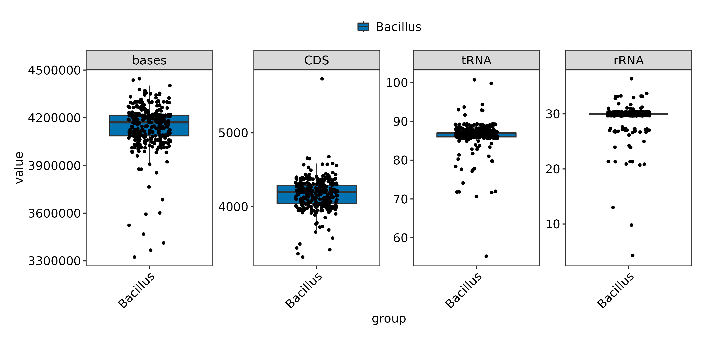

# 枯草芽孢杆菌群比较基因组分析

[toc]

<center><font face=微软雅黑>摘要</font></center>

枯草芽孢杆菌（*Bacillus subtilis*）是一类在农业和环境科学中具有广泛应用的细菌。为了深入理解其适应性和生物技术潜力，我们对从 NCBI（https://www.ncbi.nlm.nih.gov/，访问于 2024 年 2 月 24 日）获取的 338 个枯草芽孢杆菌基因组进行了全面的比较基因组分析。

本研究旨在通过结构和功能注释、泛基因组分析、比较基因组分析，探究枯草芽孢杆菌的遗传多样性，并特别关注表面素合成基因簇的分布情况。

利用高通量基因组测序数据，我们对选定的枯草芽孢杆菌群进行了基因组注释和比较分析。通过基因簇分析，我们鉴定了表面素合成相关的 *srfA* 操纵子基因以及 *abrB codY comA degU sinR* 这几个功能基因，并与参考序列进行了比对。

```
找以上几个基因的相关论文 cite

srfA : D’Souza, C., Nakano, M. M., & Zuber, P. (1994). Identification of comS, a gene of the srfA operon that regulates the establishment of genetic competence in Bacillus subtilis. In Proceedings of the National Academy of Sciences (Vol. 91, Issue 20, pp. 9397–9401). Proceedings of the National Academy of Sciences. https://doi.org/10.1073/pnas.91.20.9397
```


我们的分析揭示了枯草芽孢杆菌群中表面素合成基因簇的多样性和分布特征。发现不同菌株间 *srfA* 操纵子的序列变异可能影响表面素的合成效率。此外，泛基因组分析扩展了我们对枯草芽孢杆菌功能性基因内容的认识。

本研究为枯草芽孢杆菌的生物技术应用提供了新的遗传资源，特别是在表面素的生物合成方面。通过比较基因组分析，本文为理解枯草芽孢杆菌的生态适应性和工业应用潜力提供了分子层面的见解。

<font face=微软雅黑>关键词：</font>枯草芽孢杆菌、比较基因组、表面素、*srfA* 操纵子、功能基因、泛基因组

<center><font face=微软雅黑>Abstract</font></center>

```
重新翻译
```


## 前言

枯草芽孢杆菌（*Bacillus subtilis*）作为一类具有高度适应性和遗传多样性的细菌，在全球生态系统中扮演着重要角色。它们不仅在土壤生态循环中发挥着关键作用，而且在工业生物技术领域，尤其是在酶的生产、生物修复和作为生物控制剂方面展现出广泛的应用潜力。随着高通量测序技术的进步，我们现在能够对大量枯草芽孢杆菌基因组进行深入分析，以揭示其生物学特性和进化历史。 本研究旨在通过对从 NCBI 下载的 338 个枯草芽孢杆菌基因组进行全面的结构和功能注释、泛基因组分析以及比较基因组分析，来探索这一细菌群的遗传多样性和功能复杂性。我们特别关注于表面素（surfactin）合成基因簇的分布情况，表面素作为一种具有强大表面活性的脂肽，已被证明在生物降解、医学和增强石油回收等领域具有重要价值。 通过对参考序列与特定菌株的表面素合成 *srfA* 操纵子基因进行比对分析，我们期望揭示不同枯草芽孢杆菌株之间在表面素合成能力上的差异，并理解这些差异背后的分子机制。

## 材料与方法

### 数据收集

本研究中，为深入理解枯草芽孢杆菌（Bacillus subtilis）的基因组多样性和进化特征。我们从国家生物技术信息中心（[NCBI](https://www.ncbi.nlm.nih.gov/)）收集了 338 个组装水平均为完整基因组的枯草芽孢杆菌基因组数据，涵盖了广泛的菌株，以确保分析的代表性和全面性。

### 基因组注释

收集到的基因组数据首先使用 Prokka（v1.14.5）[cite] 软件进行基因注释。Prokka 是一款广泛使用的开源工具，能够预测基因组中的蛋白质编码基因，并提供基因的功能注释。

```
注释结果包括：faa，gff 等文件，做为下游分析的输入文件
```


### 功能基因注释

为了进一步了解基因组中的功能基因，我们使用了本地化的 eggNOG-mapper [cite] 对 Prokka 注释的基因组进行更深入的功能注释。eggNOG-mapper 通过将基因序列与 eggNOG 数据库进行比较，为每个基因分配一个功能类别。

### 泛基因组分析

泛基因组分析使用 Roary 软件[cite]完成，Roary 是一种基于图形的比较基因组分析工具，能够识别基因组间的共有基因和特异性基因，从而揭示物种的基因组多样性。

### 表面素合成基因与调控的识别与比对

通过 DIAMOND [cite] 比对从 NCBI 下载的 *srfA* 操纵子相关基因和调控基因序列，我们进行了功能基因分析，以确定这些基因在枯草芽孢杆菌群中的分布情况。

Table x Surfactin gene and regulate gene info

| Gene symbol | Specie                 | Discription                                                  |
| :---------- | :--------------------- | :----------------------------------------------------------- |
| *srfAA*     | *B. subtilis*          | surfactin synthetase                                         |
| *srfAB*     | *B. subtilis*          | surfactin synthetase                                         |
| *srfAC*     | *B. amyloliquefaciens* | surfactin non-ribosomal peptide synthetase SrfAC             |
| *srfAD*     | *B. subtilis*          | surfactin synthetase                                         |
| *abrB*      | *B. subtilis*          | transcriptional regulator for transition state genes (AbrB-SurF) |
| *codY*      | *B. subtilis*          | transcriptional regulator, GTP and BCAA-dependent            |
| *comA*      | *B. subtilis*          | two-component response quorum-sensing regulator              |
| *degU*      | *B. subtilis*          | two-component response regulator                             |
| *sinR*      | *B. subtilis*          | master regulator of biofilm formation                        |

```note
表格需要后续优化
```


我们利用 DIAMOND 软件分析得到的表面素合成基因和 5 种调控基因的分布数据，构建了基因频率分布热图。这一步骤帮助我们直观地展示了不同基因在枯草芽孢杆菌群中的分布模式。


## 结果与分析

### 基因组注释

我们从 NCBI 数据库中收集了 338 个枯草芽孢杆菌 (Bacillus subtilis) 的基因组数据，这些基因组的组装水平均达到了基因组级别。利用 Prokka 软件对这些基因组进行了详细的注释，包括基因的位置、功能、以及可能的代谢途径。注释结果包括了基因的预测、基因产物的功能分类以及基因组中的 RNA 基因。

枯草芽孢杆菌群的基因组大小在 3.3 Mb 至 4.5 Mb 之间，显示出一定的基因组大小多样性。预测得到的 CDS 数量在 10 至 100 之间，表明枯草芽孢杆菌群具有一定数量的蛋白质编码基因。tRNA 基因的数量集中分布在 80 ~ 90 之间，为蛋白质合成过程中氨基酸的运输提供了充足的 tRNA 种类。



Fig. x: Gene features in all genomes

```
图中文字需要修改
```


……

### 功能基因注释

通过 eggNOG-mapper，我们进一步对基因组中的蛋白质编码基因进行了功能注释。这一步骤帮助我们理解了枯草芽孢杆菌在不同生物学过程中的潜在角色。

Fig. x: Top 3 go enrich bar? dot? emap? cnet? tree? plot

```note
338 个菌株基因组已经完成 eggnogMapper 注释
准备使用 clusterProfiler 做 GO KEGG 富集
如何展示结果？
	top3 Heatmap?
		选取所有基因组功能前 3 作热图？
	top10 bar? dot? emap? cnet? tree？
		考虑到基因组相似性高，选取所有物种功能富集前 10 作图？
可视化脚本位置：
/public/pipeline/besalttools/latest/public/gokegg_heatmap_clusterprofile.sh
```

### 泛基因组结果分析

#### 泛基因组成分分析


Fig. x: Construction of pan-genome


.svg)

Fig. x: Pan-genome features. A：泛基因组组成饼图，其中核心基因（出现在 334 ~ 338 个菌株中的基因）303 个，软核基因（出现在 321 ~ 334 个菌株中的基因）2284 个，壳层基因（出现在 50 ~ 321 个菌株中的基因）2390 个，云层基因（出现在 50 个以下菌株中的基因）26584 个。B：X 轴表示基因组的编号，Y 轴表示该基因组中基因在泛基因组中出现的数量，X 轴左侧的基因组与泛基因组中基因有较大重合，右侧基因组核心基因较少，云层基因较多。C：338 个菌株的物种进化树，bootstrap value = 

```
--- 可能存在的问题---
C 表述是否正确
--- 图形修改 ---
1. 修改脚本，输出矢量图
2. AI 拼图，修改字号
	编号：10 pt bold
	文字：8 pt regular
	导出 
		pdf
		tif	300 dpi
		png	同上
3. Fig. x A core 范围显示不全，需要修改 
```

.svg)

Fig. x genome gerneral information. A: 新基因数量X 轴表示基因组的编号，Y 轴表示该基因组中基因在泛基因组中出现的数量，
B Number of conserved genes bar plot
C Number of genes in the pan-genome
D Number of unique genes
E Number of blastp hits with different percentage identity

```caption
Fig. x genome gerneral information
A Number of new genes bar plot
B Number of conserved genes bar plot
C Number of genes in the pan-genome
D Number of unique genes
E Number of blastp hits with different percentage identity
使用 BLASTP 搜索时，找到的与查询序列具有不同百分比相似性的命中数。BLASTP 是一种用于比较蛋白质序列的工具，它基于局部序列相似性来识别相似的蛋白质序列。具体来说，这个指标通常在 Roary 的输出中以一个表格形式出现，表格中会列出不同百分比的相似性阈值，以及在每个阈值下找到的命中数。例如，它可能会显示在 30%、50%、70% 和 90% 的相似性阈值下分别找到的命中数。这些信息对于理解不同基因组之间的相似性和差异性非常有用。较低的相似性阈值（如 30%）可能会产生更多的命中，但这些命中可能包含许多不相关的序列。而较高的相似性阈值（如 90%）则会产生较少的命中，但这些命中更可能是生物学上相关的序列。
```

```note
如果在更高的相似性阈值下找到的命中数更多，这可能由几个原因导致：

基因组之间的高度相似性：如果比较的基因组之间存在高度的相似性，那么在较高的相似性阈值下找到的命中数自然会增加。这可能是因为这些基因组来自相近的物种或者具有共同的进化历史。

基因组的保守性：某些基因或蛋白质在进化过程中高度保守，即使在远缘物种之间也保持了较高的序列相似性。因此，这些保守基因在较高的相似性阈值下仍然能够被 BLASTP 识别出来。

基因组的完整性：如果被比较的基因组较为完整，那么在进行 BLASTP 搜索时更容易找到匹配的序列，尤其是在较高的相似性阈值下。
```


---

Table x: pan-genome content

| Gene Category   |           Strain Range (% of strains) | Number of Genes |
| :-------------- | ------------------------------------: | --------------: |
| Core genes      | $99\% \leq \text{strains} \leq 100\%$ |             303 |
| Soft core genes |     $95\% \leq \text{strains} < 99\%$ |            2284 |
| Shell genes     |     $15\% \leq \text{strains} < 95\%$ |            2390 |
| Cloud genes     |      $0\% \leq \text{strains} < 15\%$ |           26584 |
| Total genes     |  $0\% \leq \text{strains} \leq 100\%$ |           31561 |

在对 338 个枯草芽孢杆菌（*Bacillus subtilis*）基因组进行深入的泛基因组分析后，我们鉴定了不同基因集的组成和它们在种群中的分布。泛基因组是指一个物种所有成员的基因总和，它包括核心基因组（存在于所有菌株中）和可变基因组（存在于部分菌株中）。这种分析有助于我们理解物种的遗传多样性和适应性。 我们的研究结果揭示了枯草芽孢杆菌基因组的复杂性，其中核心基因（存在于 99% 至 100% 的菌株中）共有 303 个，这些基因对维持基本生物学功能至关重要。软核心基因（存在于 95% 至 99% 的菌株中）数量较多，达到 2 284 个，它们可能涉及一些特定的生物学过程或环境适应性。壳层基因（存在于 15% 至 95% 的菌株中）有 2 390 个，而云层基因（存在于 0% 至 15% 的菌株中）数量最多，达到 26 584 个，这些基因可能与特定的生态位或菌株特异性功能相关。总体而言，我们鉴定了 31 561 个基因，这反映了枯草芽孢杆菌基因组的高度可变性和种群的遗传多样性。与先前的研究相比，我们观察到的核心基因数量较为保守，而云层基因的数量则显著增加，这可能与我们分析的菌株数量增加和使用的高通量测序技术有关。这些发现不仅加深了我们对枯草芽孢杆菌基因组结构的理解，而且为进一步探索其生物学特性和生态功能提供了新的视角。

```note
图、表和文字表述会出现内容重叠
考虑使用图还是表展示数据
```

---

Fig. x Gene presence absence upset plot

```
数据量较大，不使用花瓣图
图右下角表示交集
左下角表示每个菌株基因量
右上柱状图表示该交集的数量
```

```
泛基因组分析跑了 roary 和 OrthoFinder，两个软件的结果有重叠
考虑可视化的难度选择不同的结果分析 
```


……

### 表面素合成基因 *srfA* 操纵子及调控基因分布分析

为了研究枯草芽孢杆菌表面素合成的关键基因 *srfA* 操纵子在不同菌株中的分布情况，使用 DIAMOND 软件，我们针对枯草芽孢杆菌群中的表面素合成关键基因 *srfA* 操纵子进行了同源性搜索。通过这种方法，我们能够确定 *srfA* 操纵子在枯草芽孢杆菌群中的分布模式。

……

通过对比对结果的分析，我们发现 *srfA* 操纵子在枯草芽孢杆菌群中的分布呈现出显著的多样性。一些菌株中 *srfA* 操纵子的存在表明它们可能具有合成表面素的潜力，这是一种重要的生物膜形成因子，对细菌的粘附和生物膜形成具有重要作用。

……

利用 DIAMOND 得到的比对数据，我们进一步分析了 *srfA* 操纵子基因的频率分布，并生成了基因频率分布热图。热图显示了不同基因组中 *srfA* 操纵子基因出现的频率，颜色的深浅代表了基因出现的频率高低。通过热图，我们可以直观地观察到 *srfA* 操纵子在枯草芽孢杆菌群中的分布情况，以及不同菌株间基因频率的差异。

……

Fig. Gene frequency distribution heatmap 

```note
Y 轴聚类，X 轴不聚类
```


## 讨论

本研究的比较基因组分析揭示了枯草芽孢杆菌群中表面素合成基因的多样性，为理解其生物学功能和生态角色提供了新的见解。这些结果对于未来的微生物基因组研究和应用开发具有重要的指导意义。

我们的研究结果表明，枯草芽孢杆菌群中 srfA 操纵子的分布具有高度的变异性，这可能与菌株的生态适应性和进化历史有关。基因组功能基因分析揭示了枯草芽孢杆菌在生物膜形成和环境适应性方面的潜在机制。此外，基因频率分布热图为我们提供了一个直观的工具，用以比较和分析不同菌株间 srfA 操纵子的分布差异。

我们的分析结果与现有文献中关于枯草芽孢杆菌基因组多样性的研究相吻合。特别是，*srfA* 操纵子的变异与菌株的环境适应性之间的联系，已经在先前的研究中被提出。我们的研究通过大规模基因组分析，为这一领域提供了新的视角。

这些发现不仅增进了我们对枯草芽孢杆菌生物学特性的理解，而且为开发新的生物技术应用提供了可能性，如通过基因编辑技术改造枯草芽孢杆菌，以增强其在工业发酵或生物修复中的应用潜力。

……

<center><font face=微软雅黑>参考文献</font></center>

+ Prokka v1.14.5: 
  Seemann T. , Prokka: rapid prokaryotic genome annotation, *Bioinformatics* 2014 Jul 15;30(14):2068-9. [PMID:24642063](http://www.ncbi.nlm.nih.gov/pubmed/24642063)
+ DIAMOND v0.9.25: 
  Buchfink B, Xie C, Huson DH, Fast and sensitive protein alignment using DIAMOND, *Nature Methods* **12**, 59-60 (2015). [doi:10.1038/nmeth.3176](https://doi.org/10.1038/nmeth.3176)

1. srf A
   D’Souza, C., Nakano, M. M., & Zuber, P. (1994). Identification of comS, a gene of the srfA operon that regulates the establishment of genetic competence in Bacillus subtilis. In Proceedings of the National Academy of Sciences (Vol. 91, Issue 20, pp. 9397–9401). Proceedings of the National Academy of Sciences. https://doi.org/10.1073/pnas.91.20.9397
   Hoffmann M, Braig A, Fernandez Cano Luna D S, et al. Evaluation of an oxygen‐dependent self‐inducible surfactin synthesis in B. subtilis by substitution of native promoter PsrfA by anaerobically active PnarG and PnasD[J]. AMB Express, Springer Science and Business Media LLC, 2021, 11(1).

   ```bibtex
   @article{10.1073/pnas.91.20.9397,
       journal = {Proceedings of the National Academy of Sciences},
       shortjournal = {Proc. Natl. Acad. Sci. U.S.A.},
       issn = {0027-8424,1091-6490},
       number = {20},
       author = {D'Souza, C and Nakano, M M and Zuber, P},
       title = {Identification of comS, a gene of the srfA operon that regulates the establishment of genetic competence in Bacillus subtilis.},
       publisher = {Proceedings of the National Academy of Sciences},
       language = {en},
       year = {1994},
       month = {9},
       volume = {91},
       pages = {9397--9401},
       doi = {10.1073/pnas.91.20.9397},
       url = {https://pnas.org/doi/full/10.1073/pnas.91.20.9397},
       abstract = {Genetic competence (the ability to internalize exogenous DNA) in Bacillus subtilis is dependent on a regulatory pathway that activates the expression of a battery of competence-specific genes. The srfA operon, encoding the subunits of surfactin synthetase, which catalyzes the nonribosomal synthesis of the peptide antibiotic surfactin, also functions in the competence regulatory pathway. The DNA encoding only one of the seven amino acid-activating domains of surfactin synthetase, the valine-activating domain (srfAB1), is necessary for competence. Deletion analysis revealed that a 569-bp fragment of srfAB1, fused to the srfA promoter, complements a srfA deletion mutation (delta srfA) with respect to competence. This fragment contains an open reading frame consisting of 46 amino acids (orf46), which is out of frame with srfAB1. A frameshift mutation in srfAB upstream of orf46 has no effect on competence but a frameshift and nonsense mutation in orf46 resulted in failure to complement the delt srfA mutation. These results indicate that orf46 encodes the srfA-associated competence regulatory factor. Computer-aided analysis of the putative orf46 product (ComS) shows similarity to the homeodomain of the POU domain class of eukaryotic transcriptional regulators.},
       urldate = {2024-05-26}
   }
   ```

2. abrB
   Strauch M A, Spiegelman G B, Perego M, et al. The transition state transcription regulator abrB of Bacillus subtilis is a DNA binding protein.[J]. The EMBO Journal, Springer Science and Business Media LLC, 1989, 8(5): 1615–1621.

   ```bibtex
   @article{PMID:2504584,
       journal = {The EMBO Journal},
       shortjournal = {The EMBO Journal},
       issn = {0261-4189},
       number = {5},
       author = {M. Strauch and G. Spiegelman and Márta and Perego and W. C. Johnson and D. Burbulys and J. Hoch},
       title = {The transition state transcription regulator abrB of Bacillus subtilis is a DNA binding protein.},
       publisher = {Springer Science and Business Media LLC},
       language = {en},
       year = {1989},
       month = {05},
       volume = {8},
       pages = {1615--1621},
       doi = {10.1002/j.1460-2075.1989.tb03546.x},
       pmid = {2504584},
       pmcid = {PMC400994},
       url = {https://onlinelibrary.wiley.com/doi/10.1002/j.1460-2075.1989.tb03546.x},
       abstract = {The product of the abrB gene of Bacillus subtilis is an ambiactive repressor and activator of the transcription of genes expressed during the transition state between vegetative growth and the onset of stationary phase and sporulation. Purified AbrB protein binds specifically in a highly co‐operative fashion to fragments of DNA containing the promoters it affects. DNase I footprints of the binding regions in these promoters revealed large protected areas of 50‐120 nucleotides or more depending on the promoter. Methylation protection experiments gave protected guanine residues on only one face of the DNA helix. A consensus sequence could be deduced around these guanine residues that was not found around non‐protected guanine residues in the footprint region. The results suggested that stationary phase functions and sporulation are repressed during active growth by AbrB and other transition state regulators by binding to the affected promoters in a concentration‐dependent manner.},
       urldate = {2024-05-26}
   }
   ```

   

3. degU
   Miras M, Dubnau D. A DegU-P and DegQ-Dependent Regulatory Pathway for the K-state in Bacillus subtilis[J]. Frontiers in Microbiology, Frontiers Media SA, 2016, 7.

4. 


<center><font face=微软雅黑>附录</font></center>


<center><font face=微软雅黑>致谢</font></center>