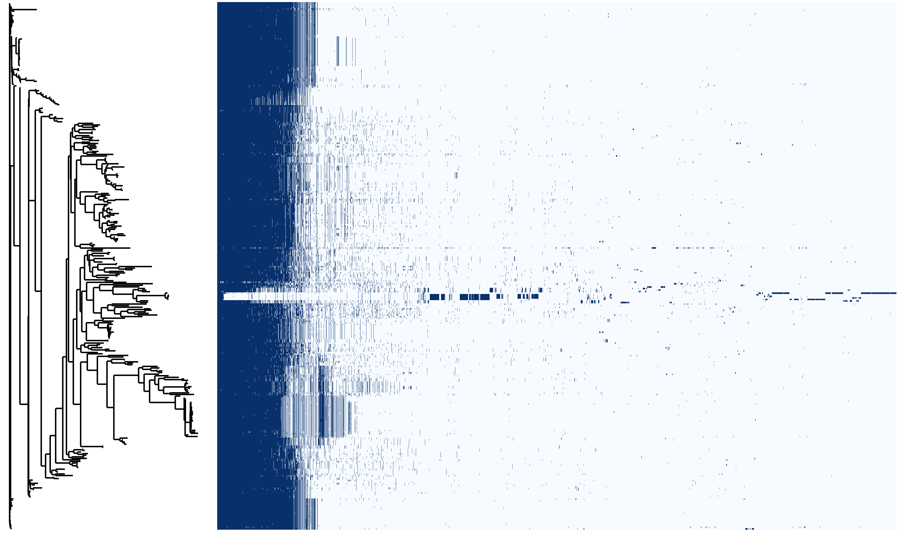

# 枯草芽孢杆菌群比较基因组分析

[toc]

<center><font face=微软雅黑>摘要</font></center>

为了深入理解枯草芽孢杆菌（*Bacillus subtilis*）适应性和生物技术潜力，以更好地利用枯草芽孢杆菌微生物资源，我们对从 NCBI 获取的 331 个枯草芽孢杆菌基因组进行了全面的比较基因组分析，以揭示该细菌群的遗传特性和进化历程，以及生物被膜形成与调控基因的分布情况。

本研究通过结构和功能注释、泛基因组分析和比较基因组分析，探究枯草芽孢杆菌的遗传多样性。我们还研究了枯草芽孢杆菌群生物被膜形成及调控相关基因簇的分布及其在不同菌株间的差异性。研究的基因有生物被膜形成中的重要成分表面素的操纵子基因 srfA 和生物被膜形成相关调控基因 abrB、codY、comA、degU 和 sinR。

综合分析的结果表明，本研究构建的泛基因组增强了我们对枯草芽孢杆菌遗传变异的理解，揭示了枯草芽孢杆菌核心基因和可变基因功能的差异性。此外，筛选出的生物膜形成相关基因簇数量较多的菌株，为枯草芽孢杆菌在生物技术领域的潜在应用提供了新的前景，为开发具有物被膜形成方面高效生物合成能力的菌株提供了理论基础和遗传资源，进一步挖掘了枯草芽孢杆菌微生物资源的利用潜力。

<font face=微软雅黑>关键词：</font>枯草芽孢杆菌、生物被膜、表面素、*srfA* 操纵子、泛基因组、比较基因组、调控基因

<center><font face=微软雅黑>Abstract</font></center>

In order to gain a deeper understanding of the adaptability and biotechnological potential of *Bacillus subtilis*, and to better utilize the microbial resources of *Bacillus subtilis*, we conducted a comprehensive comparative genomic analysis of 331 *Bacillus subtilis* genomes obtained from NCBI. This analysis aimed to reveal the genetic characteristics and evolutionary history of this bacterial group, as well as the distribution of genes involved in biofilm formation and regulation.

This study explored the genetic diversity of *Bacillus subtilis* through structural and functional annotation, pan-genome analysis, and comparative genomic analysis. We also investigated the distribution of gene clusters related to biofilm formation and regulation within the *Bacillus subtilis* group, as well as the differences among various strains. The genes studied included the srfA operon gene, an important component in biofilm formation, and the regulatory genes abrB, codY, comA, degU, and sinR, which are associated with biofilm formation.

The results of the comprehensive analysis indicate that the pan-genome constructed in this study enhances our understanding of the genetic variation within *Bacillus subtilis*, revealing differences in the functions of core and accessory genes. Furthermore, the identification of strains with a higher number of gene clusters related to biofilm formation offers new prospects for the potential applications of *Bacillus subtilis* in the field of biotechnology. It provides a theoretical basis and genetic resources for the development of strains with high biofilm formation and efficient biosynthetic capabilities, further exploring the potential of *Bacillus subtilis* microbial resources.

<font face=Microsoft YaHei>Keywords:</font> *Bacillus subtilis*, biofilm, surfactin, *srfA* operon, pan-genome, comparative genomics, regulatory genes


## 前言

### 比较基因组分析

#### 比较基因组分析的目的

比较基因组分析（Comparative Genomics）是一种通过比较不同物种或同一物种不同个体的基因组序列，来研究基因的功能、进化和遗传变异的方法。通过比较基因组分析，我们可以识别出保守的基因家族，这些保守基因通常具有重要的生物学功能。此外，比较基因组分析还可以帮助发现与特定性状相关的基因变异，从而为基因功能研究提供线索。比较基因组分析可以重建进化树，了解物种分化的时间和路径，为研究生物进化提供更多信息。随着测序技术的迅速发展和基因组数据的积累，比较基因组学已成为生物学、医学、农业等领域的重要研究工具。

#### 比较基因组分析的方法

比较基因组分析一般围绕基因组结构和功能注释、泛基因组分析和基因功能富集分析展开。基因组结构分析是比较基因组学的基础。通过基因组结构注释，可以确定基因的准确位置和序列，识别编码区和非编码区、tRNA 和 rRNA。在功能注释方面，将氨基酸序列比对到对应数据库，可以预测基因的功能和相关通路，有助于理解基因的生物学作用，也为下游的富集分析提供了基础数据。泛基因组分析通过比较同一物种内不同个体或种群的基因组，识别核心基因和可变基因，揭示物种的遗传多样性和进化适应性。其中，核心基因是所有个体共有的基因，通常与基本生命功能相关；可变基因则可能与环境适应或特定性状有关。具体步骤包括基因组比对和聚类，构建泛基因组矩阵，分析基因的分布模式和功能特征。通过构建泛基因组，可以全面了解物种基因组的结构和功能多样性。基因功能富集分析旨在通过统计方法识别特定基因集在功能和通路上的显著性富集情况，有助于理解基因在生物学过程中的作用。

在本研究中，我们结合上述三种方法进行了系统的比较基因组分析。图X展示了具体的分析流程。

```
该数字
```


#### 比较基因组联合多组学分析应用前景

在微生物群落研究中，比较基因组分析结合多组学分析方法具有广阔的应用前景。对菌群进行比较基因组分析，从大量具有相似性的物种或亚种中筛选出特定菌株，随后开展 16S rRNA 扩增子分析、代谢组学分析和转录组学分析，能挖掘出更多关于微生物遗传变异、基因调控网络、生物成分合成的信息。

16S rRNA 扩增子测序是微生物群落研究的重要研究方式之一，能够对微生物群落进行精确的物种鉴定和分类。通过比较基因组分析筛选出的特定菌株，再结合16S rRNA扩增子分析，进一步揭示特定环境中这些菌株的分类地位和功能特性，提供关于微生物多样性和生态分布信息。代谢组学分析通过检测和定量分析微生物群落中的代谢产物，提供关于群落代谢活动的详细信息。结合比较基因组分析，可以了解特定菌株或菌群的代谢能力和功能角色。转录组学分析能够揭示不同基因集的差异表达情况，通过比较基因组分析确定的同源基因或泛基因组中的核心基因和可变基因，结合转录组学分析，可以研究它们在不同环境压力和生存需求下的表达差异。这对于理解微生物群落如何响应环境变化、调控基因表达和维持生存至关重要。特别是在筛选高表达特定基因的菌株和构建基因调控网络方面，转录组学分析提供能提供关键的数据。

总而言之，比较基因组分析联合多组学分析方法在微生物群落研究中具有巨大的潜力。通过这种方法，在筛选特定基因高表达菌株、构建基因调控网络、揭示生物成分合成过程以及发掘利用和保存微生物资源方面有广阔的应用前景。同时也能够更深入地理解微生物群落的结构、功能以及它们在生态系统中的作用，为微生物资源的可持续利用和生物技术的开发提供科学依据。

### 生物被膜

#### 生物被膜的作用

生物被膜（Biofilm）是微生物在生物或非生物表面生长过程中形成的一种高度结构化的细胞聚集体，是微生物群落的保护屏障，在维持细胞内环境稳定、增强微生物对外部不利因素的抗性方面发挥着至关重要的作用。

生物被膜通过形成物理屏障，有效地保护微生物免受环境中不利条件的影响，如抗生素、消毒剂和其他化学物质的侵害。被膜中的多聚物基质（如多糖、蛋白质和核酸）能够吸附和中和有害物质，降低它们对微生物的损害。这种保护机制使得被膜内的微生物比游离状态下的微生物具有更强的生存能力。生物被膜具有半透膜的特性，能够控制物质的运输，确保细胞生长所需的营养物质的摄入和代谢废物的排出。被膜中的微生物通还分泌信号分子进行细胞间的通讯，调节群体行为和基因表达，这种现象被称为群体感应（Quorum sensing）。群体感应能够协调微生物的集体活动，如毒素分泌、营养获取和抵御外部威胁，从而增强微生物群落的生存优势。生物被膜中的微生物通常通过代谢合作实现能量转换和资源利用。不同种类的微生物在被膜内形成复杂的生态网络，通过代谢途径的互补性实现资源的最大化利用。例如微生物群落中，一部分微生物能够分解有机物质生成初级代谢产物，而其他微生物则利用这些代谢产物进行进一步的能量获取和生长。

#### 生物被膜的形成

生物被膜的形成涉及多种关键物质，其中表面素（Surfactin）是一种非常重要的生物活性物质。表面素由表面素操纵子基因 srfA 合成，是一种环脂肽，具有很强的表面活性和抗菌活性。在生物被膜的形成过程中，表面素通过降低表面张力，促进细胞在表面的附着和聚集。

生物被膜的组成包括细胞、细胞外聚合物（Extracellular Polymeric Substances, EPS）以及水。被膜的合成能力和次级代谢产物的生成能力直接影响微生物的竞争适应性。合成表面素的操纵子 srfA 包括 srfAA，srfAB，srfAC 和 srfAD 四个基因，此外，生物被膜形成还受到多个调控基因的影响，包括 abrB、codY、comA、degU 和 sinR 等。这些基因在被膜的形成和维持过程中发挥着至关重要的作用，其中，abrB 基因在生物被膜的早期形成阶段，通过调控细胞分裂和代谢活动，促进细胞的快速增长和附着[]。codY 基因是全局转录调控因子，在氨基酸丰度较高时抑制被膜形成，通过调节代谢途径，维持细胞内的营养平衡[]。comA 基因参与群体感应系统，通过调节表面素和其他信号分子的合成，协调细胞间的通讯和集体行为 []。在被膜的成熟阶段，degU 基因通过调控细胞运动和细胞外聚合物的合成，增强被膜的稳定性和功能性[]。这些基因的是枯草芽孢杆菌生存和繁殖的关键，通过比对这些基因到基因组上，分析基因频率，可以帮助我们筛选出具有较高生物被膜合成潜力的菌株，以更好的贮藏、运输和利用微生物资源。

### 研究现状及意义

#### 芽孢杆菌比较基因组研究现状

近年来，芽孢杆菌的比较基因组研究在国际上取得了显著进展。Kunst 等人首次公布了枯草芽孢杆菌168株的完整基因组序列，这标志着对芽孢杆菌遗传和生理特性的研究进入了一个新的阶段（Kunst et al., 1997）[3]。泛基因组分析在国际研究中逐渐成为主流。通过高通量测序技术，研究者能够对多个芽孢杆菌菌株进行泛基因组分析。例如，Danchin和Sekowska（2017）指出，枯草芽孢杆菌的泛基因组由核心基因和大量可变基因组成，这些基因在不同环境中赋予菌株不同的适应能力[1]此外，Borriss等人（2018）通过比较基因组分析，揭示了不同枯草芽孢杆菌菌株在次级代谢产物合成途径上的显著差异[2]。

```
Borriss, R., et al. (2018). The genomic basis of antibiotic production in Bacillus. Applied Microbiology and Biotechnology, 102(11), 4951-4968. https://doi.org/10.1007/s00253-018-9006-5

Danchin, A., & Sekowska, A. (2017). Genomics and evolution of Bacillus subtilis. Annual Review of Genetics, 51(1), 221-241. https://doi.org/10.1146/annurev-genet-120215-035008

Kunst, F., Ogasawara, N., Moszer, I., Albertini, A. M., Alloni, G., Azevedo, V., ... & Danchin, A. (1997). The complete genome sequence of the gram-positive bacterium Bacillus subtilis. Nature, 390(6657), 249-256. https://doi.org/10.1038/36786
```


国内的研究集中在芽孢杆菌在农业和工业中的应用潜力方面。中科院微生物研究所的研究团队通过比较基因组分析，揭示了不同芽孢杆菌菌株在促进植物生长和抗病方面的遗传基础【4】。这些研究为开发新的微生物肥料和生物农药提供了理论依据。国内研究人员还对枯草芽孢杆菌的基因组进行了详细的功能注释。例如，华中农业大学的研究团队通过高通量测序和生物信息学分析，识别了与生物被膜形成相关的重要基因，并探讨了这些基因在不同环境条件下的表达差异（Zhang et al., 2017）。

```
Li, Y., Liu, J., & Zhang, L. (2015). Comparative genomics of Bacillus species and its implications for agricultural applications. Science Bulletin, 60(5), 450-459. https://doi.org/10.1007/s11434-015-0742-7
Zhang, H., Chen, W., & Zhao, X. (2017). Functional annotation of Bacillus subtilis genomes and their application in agriculture. Journal of Agricultural Biotechnology, 25(10), 1689-1699. 
```


#### 此项研究的意义

枯草芽孢杆菌（*Bacillus subtilis*）作为一类具有高度适应性和遗传多样性的细菌，在全球生态系统中起重要作用。它们不仅在土壤生态循环中发挥着关键作用，而且在工业生物技术领域，尤其是在酶的生产、生物修复和作为微生物肥料方面展现出广泛的应用潜力。枯草芽孢杆菌的这些特性使其成为微生物学和生物技术研究的热点。

传统的基因组分析侧重于单个或少数几个菌株 [1]，无法全面揭示物种内的遗传多样性。无法更进一步理解枯草芽孢杆菌群内部遗传多样性，难以对其在不同环境中的适应机制和功能多样性有更深入的认识。单一或少量菌株的基因组研究，尽管提供了初步的基因功能和代谢途径信息，但无法揭示该物种内部广泛的遗传变异。枯草芽孢杆菌的许多功能基因仍未被完全解析，其具体生物学作用尚不明确。未来的研究需要结合多组学数据（如转录组学、代谢组学）进行综合分析，以揭示基因的功能和调控机制。

随着高通量测序技术的进步，我们现在可以在比较基因组研究中对大量枯草芽孢杆菌基因组进行深入分析。 通过整合更多菌株的基因组数据，可以为枯草芽孢杆菌的利用提供更为全面视角，能够探索物种内所有潜在的遗传变异。本研究旨在对枯草芽孢杆菌基因组进行全面的结构和功能注释、泛基因组分析以及比较基因组分析，来探索这一细菌群的遗传多样性和功能复杂性。通过泛基因组分析，我们可以识别出核心基因和可变基因，了解它们在不同菌株中的分布和功能，不仅有助于揭示枯草芽孢杆菌的进化机制，还能为其在实际生产应用提供更为丰富的基因资源。

我们还特别关注生物被膜形成相关基因的分析，通过比较枯草芽孢杆菌群中这些基因的频率和分布，可以筛选出具有较大生物被膜形成潜力的菌株。本研究能为比较基因组学进一步联合多组学分析提供数据支持，为其在实际应用中验证菌株实际产生物被膜的能力提供研究基础和科学依据。

综上所述，本研究通过揭示枯草芽孢杆菌的遗传资源和生物被膜形成潜力，我们可以更有效地利用和保护这种具有重要生态和经济价值的微生物资源。

```
1. 说明以前研究的基因组少 下文研究 8 个
	Kamada M, Hase S, Fujii K, et al. Whole-Genome Sequencing and Comparative Genome Analysis of Bacillus subtilis Strains Isolated from Non-Salted Fermented Soybean Foods[J]. D. Cantu. PLOS ONE, Public Library of Science (PLoS), 2015, 10(10): e0141369.
```


```
1. Stubbendieck R M, Straight P D. Linearmycins Activate a Two-Component Signaling System Involved in Bacterial Competition and Biofilm Morphology[J]. A.M. Stock. Journal of Bacteriology, American Society for Microbiology, 2017, 199(18).


gene cite 在文末
```


## 材料与方法

### 菌株序列

本研究中，为深入理解枯草芽孢杆菌的基因组多样性和进化特征，我们从国家生物技术信息中心（NCBI，https://www.ncbi.nlm.nih.gov/，访问于 2024 年 2 月 24 日）收集了 331 个组装水平均为完整基因组的枯草芽孢杆菌基因组数据。这些数据涵盖了广泛的菌株，以确保分析的代表性和全面性。

### 软件及命令

由于本研究中涉及的数据量较大，所有软件分析过程均在装有 SGE 集群管理系统的 Linux 系统上运行，Linux 分发版本为 CentOS Linux 7 (Core)。所有软件的命令脚本均通过 qsub -cwd *.sh 命令投放至计算节点。

#### Prokka v1.14.5

Prokka是一款专为原核生物基因组设计的开源基因组注释工具，它通过集成多个数据库和生物信息学算法，自动化地识别和注释基因，提供基因名称、位置、功能预测等详细信息，并支持多种数据格式输出，极大地提高了基因组注释的效率和准确性。

运行分析的命令为：

```
#!/bin/bash
FASTA_DIR="genome/"
PROKKA_OUTDIR="result/prokkaOut"
mkdir -p "$PROKKA_OUTDIR"
for fasta_file in "$FASTA_DIR"/*.fna; do
    base_name=$(basename "$fasta_file" .fasta)
    output_prefix="$PROKKA_OUTDIR/$base_name"
    prokka \
        --cpus 64 \
        --outdir "$output_prefix" \
        --prefix "$base_name" \
        --kingdom Bacteria \
        "$fasta_file"
done
```

#### eggNOG-mapper v2.1.12

eggNOG-mapper 是一个强大的基因功能注释工具，它通过氨基酸序列与eggNOG数据库的比对，完成基因家族分类、功能预测、同源性搜索、多序列比对和基因组尺度分析，适用于多种生物类型的基因组注释。

eggNOG-mapper 提供在线注释和本地化注释，由于本研究分析的数据量超出在线注释上限，所以使用本地注释。注释所用的数据库为 emapperdb-5.0.2。

运行分析的命令为：

```
for faa in $(ls faa/*.faa); do
    prefix=`basename $faa`
    emapper.py -i faa/*.faa --output funAnno/$prefix --data_dir eggnogDB -m diamond --usemem --cpu 64
done
```

#### Roary v3.13.0

Roary 能够识别所有输入基因组中的基因家族，构建泛基因组（包含所有基因组共有和特有的基因）和核心基因组（所有基因组共有的基因）。Roary 总体上完成了以下几个步骤：

1. 将编码序列转换为蛋白质序列。
2. 通过几种方法对这些蛋白质序列进行聚类。
3. 进一步将聚类结果细化为同源基因家族。
4. 对于每个样本，确定基因是否存在/缺失：生成基因存在/缺失的文件（gene_presence_absence.csv）。
5. 使用这些基因存在/缺失信息构建进化树，使用FastTree软件：生成可变二进制基因进化树文件（accessory_binary_genes.fa.newick）。
6. 总体上计算核心基因、软核基因、壳层基因和云层基因的数量：生成统计摘要文件（summary_statistics.txt）。

运行分析的脚本为：

```
#/bin/bash
conda activate comparative
roary -e --mafft -p 64 data/Annotations/GFF/*.gff -f result/roary
```

#### clusterProfiler v4.0.2

clusterProfiler 是一个功能强大的 R 语言包，广泛应用于生物信息学和功能注释分析领域。它特别适用于对基因列表进行功能注释和富集分析，通过提供多种生物学背景下的注释信息，帮助研究人员深入理解基因的生物学功能。通过使用 clusterProfiler，用户可以方便地进行 GO（Gene Ontology）分析、基因集富集分析（GSEA）、KEGG通路分析以及其他多种类型的功能富集分析。

本研究中使用该 R 包进行 GO 富集分析，使用的命令为：

```
geneGO <- read.table(file.choose(), sep="\t", header=T, stringsAsFactors = FALSE)
symbol <- geneGO$symbol
goID <- geneGO$GO
term2gene <- geneGO[, c(2,1)]
#term2gene <- buildGOmap(term2gene)
go2term <- go2term(term2gene$GO)
df <- enricher(symbol, TERM2GENE = term2gene, TERM2NAME = go2term, pvalueCutoff = 0.01, qvalueCutoff = 0.05)
barplot(df, showCategory = 20, title = "EnrichmentGO")
```

#### DIAMOND v2.1.9 

DIAMOND 是一款用于蛋白质与蛋白质序列、核酸与蛋白质序列和核酸与核酸序列比对的软件，使用 Smith-Waterman 的动态规划算法来进行比对。该算法可以有效地找到两个序列之间的最佳局部或全局比对。

本研究用使用该软件将基因序列比对到蛋白质序列上，需要先建立基因组数据库。建立基因组数据库的脚本为：

```
#!/bin/bash
DATA_DIR="result/AAs"
cd "$DATA_DIR"
for faa_file in *.faa; do
    if [[ -f "$faa_file" ]]; then
        db_name=$(basename "$faa_file" .faa)
       diamond makedb --in "$faa_file" --db "$faa_file"
    fi
done
```

进行比对的脚本为：

```
#!/bin/bash
DATA_GENE_DIR="data/genes"
DATA_DMND_DIR="db/diamondDB"
conda activate diamond
for GENE_FILE in "$DATA_GENE_DIR"/*; do
    GENE_BASENAME=$(basename "$GENE_FILE" .fna)
    for DMND_FILE in "$DATA_DMND_DIR"/*.dmnd; do
        DMND_BASENAME=$(basename "$DMND_FILE" .dmnd)
OUT_FILE="/result/dmndMap/${DMND_BASENAME}_${GENE_BASENAME}.txt"
        diamond view -a <alignments-file> -o <output-file>
        diamond blastx --db "$DMND_FILE" -q "$GENE_FILE" -o "$OUT_FILE"
    done
done
```


### 基因组结构与功能注释

利用 Prokka （https://github.com/tseemann/prokka，访问于 2024 年 3 月 2 日） v1.14.5 软件，我们对收集到的基因组数据进行了基因注释，识别和预测了基因组中的编码基因、tRNA、rRNA成分。

通过 eggNOG-mapper[cite]（https://github.com/eggnogdb/eggnog-mapper，访问于 2024 年 3 月 3 日）v2.1.12 软件对 Prokka 结构注释的结果进行功能注释，以进一步了解基因组中的功能基因。功能注释得到的 COG ID、GO ID 以及 KEGG ID 用于后续的功能富集分析。

### 泛基因组分析

利用 Roary[cite]（https://github.com/sanger-pathogens/Roary，访问于 2024 年 3 月 11 日）v3.13.0 软件识别基因家族，并构建基因组间的同源关系，得到核心基因、软核基因、壳层基因和云层基因。利用 clusterProfiler（，访问于 2024 年 3 月 20 日）v4.0.2 软件分别对核心基因和非核心基因（可变基因）进行了 GO 富集分析。

### 生物被膜形成相关基因的识别与比对

通过 DIAMOND[cite] （https://github.com/bbuchfink/diamond，访问于 2024 年 3 月 14 日）v2.1.9 比对从 NCBI 下载的 *srfA* 操纵子的 srfAA、srfAB、srfAC 和 srfAD 基因参考序列以及 abrB、codY、comA、degU 和 sinR 这 5 个调控基因参考序列到枯草芽孢杆菌基因组，完成功能基因分析，以确定这些基因在枯草芽孢杆菌群中的分布情况。鉴于未从 NCBI 基因数据库搜集到枯草芽孢杆菌的 srfAC 基因序列，本研究中使用与枯草芽孢杆菌相似性较高[cite]的解淀粉芽孢杆菌（Bacillus amyloliquefaciens）srfAC 基因序列。我们利用 DIAMOND 软件分析得到的表面素操纵子基因和 5 种调控基因的分布数据，得到了基因频率分布矩阵，以了解不同基因在枯草芽孢杆菌群中的分布模式。

Table x 表面素操纵子基因和调控基因信息	

| Gene    | Specie                 | Discription                                                  |
| :------ | :--------------------- | :----------------------------------------------------------- |
| *srfAA* | *B. subtilis*          | Surfactin synthetase                                         |
| *srfAB* | *B. subtilis*          | Surfactin synthetase                                         |
| *srfAC* | *B. amyloliquefaciens* | Surfactin non-ribosomal peptide synthetase srfAC             |
| *srfAD* | *B. subtilis*          | Surfactin synthetase                                         |
| *abrB*  | *B. subtilis*          | Transcriptional regulator for transition state genes (abrB-surF) |
| *codY*  | *B. subtilis*          | Transcriptional regulator, GTP and BCAA-dependent            |
| *comA*  | *B. subtilis*          | Two-component response quorum-sensing regulator              |
| *degU*  | *B. subtilis*          | Two-component response regulator                             |
| *sinR*  | *B. subtilis*          | Master regulator of biofilm formation                        |

## 结果与分析

### 基因组结构注释结果分析

枯草芽孢杆菌群的基因组大小在 3.3 Mb ~ 4.5 Mb 之间，显示出一定的基因组大小多样性，这一范围的差异反映了不同菌株之间的基因组结构存在变化。预测得到的编码序列数量在 4 000 ~ 4500 之间，表明枯草芽孢杆菌群具有一定数量的蛋白质编码基因，这些基因的多样性不仅支持了细菌的基本生理功能，还可能赋予其特定的环境适应能力和代谢灵活性。tRNA 基因的数量集中分布在 85 ~ 90 之间，为蛋白质合成过程中氨基酸的运输提供了充足的 tRNA 种类。rRNA 数量集中在 30，表明 rRNA 基因的拷贝数在这些物种中相对保守。

数量的差异反映了菌株在基因组结构和功能上的多样性，可能是基因结构变异或内源基因缺失或外源基因的转入导致。tRNA 和 rRNA 数量在菌株间差异较小，可能的原因是tRNA 和 rRNA 基因相对保守，以确保蛋白质合成过程的稳定性和高效性，因为这些基因产物在蛋白质合成过程中的作用不可替代。tRNA基因负责转运氨基酸，而 rRNA 基因是核糖体的核心组成部分，参与翻译过程的催化和结构支持。由于这些基因的功能至关重要，其序列在不同菌株之间保持高度相似，确保了基本生理过程的可靠性。


Fig. x: Gene features in all genomes

### 基因组功能注释结果

在基因组功能注释方面，使用 eggNOG-mapper 共对泛基因组注释到 2503 个 GO term。从 eggNOG-mapper 输出的结果文件中提取出的基因 Symbol 和 GO ID 用于后续的泛基因组功能富集分析。通过这些注释，我们可以深入了解枯草芽孢杆菌群的基因功能特性，探索其在不同环境和条件下的生理和代谢能力。这些数据不仅为泛基因组功能富集分析奠定了基础，还为进一步的基因功能研究提供了重要的参考。

### 泛基因组分析

#### 泛基因组成分析

###### 

Fig. x Pan-genome gerneral information. A: 随参与构建泛基因组的菌株基因组数量增加，基因组为泛基因组贡献的新基因的数量。B：基因组中保守基因的数量。C：随参与构建泛基因组的菌株基因组数量增加，泛基因组中基因的累计数量。D：随参与构建泛基因组的菌株基因组数量增加，独有基因的累计数量。E：blastp 比对中，在 95% ~ 100% 相似性下的命中数。F：随参与构建泛基因组的菌株基因组数量增加，泛基因组中基因累计数量（虚线）和每个基因组中贡献核心基因的数量（实线）。

图 x 展示了枯草芽孢杆菌群的泛基因组构建过程，随参与构建泛基因组的菌株基因组数量增加，每个基因组为泛基因组贡献的新基因数量显示了递减趋势。这表明初期每加入一个新菌株时，贡献的独特基因较多，但随着更多菌株的加入，新基因的发现逐渐减少。这一趋势表明泛基因组在逐步趋于饱和，虽然仍有新基因的加入，但数量在逐渐减少。

随参与构建泛基因组的菌株基因组数量增加，泛基因组中基因累积数量仍保持增长趋势，这表明枯草芽孢杆菌群具有开放的泛基因组。这意味着随着更多基因组数据的积累，我们能够持续发现新的基因和变异，从而揭示了枯草芽孢杆菌群的遗传复杂性较高。泛基因组的开放性意味着在现有的基因组之外，枯草芽孢杆菌群还有大量未被发现的基因，这对于理解其生态适应能力、抗逆性和潜在的工业应用价值具有深远的意义。随着更多菌株基因组被测序，我们可以更深入地了解这一细菌群体的遗传多样性和进化动态，从而为进一步的生物学研究和应用开发提供重要的基础数据。

泛基因组构建过程中，菌株基因组保守基因的数量总体呈减少趋势。这些保守基因基因可能在枯草芽孢杆菌群中的基本功能方面具有重要作用。可以看到，在泛基因组中已经存在一定数量的保守基因后，有 10 个菌株基因组参与泛基因组构建时仍为泛基因组提供了较多的保守基因，说明这 10 个菌株的部分保守基因与其他菌株的保守基因存在较大差异。

在 blastp 比对中，分析表明在更高的相似性阈值下，命中数有增加的趋势。这说明参与分析的枯草芽孢杆菌基因组间具有高度的相似性，存在一定数量在进化过程中高度保守的基因。高度保守的基因往往在基本生物功能中起重要作用，如基础代谢、细胞结构和基因表达调控等。这种保守性进一步突显了枯草芽孢杆菌群在进化过程中对重要基因功能的维持，同时也为我们理解其适应性和稳定性提供了关键线索。

```
标轴
```




Fig. x: Bacillus subtilis pan-genome. 左侧为 331 个菌株的物种进化树；右侧为泛基因组矩阵，共 31561 个基因家族，X 轴表示泛基因组中的基因，Y 轴表示基因组。矩阵最左侧为核心基因，为 99% 以上物种共有的基因，整个矩阵代表了参与分析的枯草芽孢杆菌泛基因组。

泛基因组构建结果显示，枯草芽孢杆菌群的泛基因组由  31 561 个基因家族构成，反映了枯草芽孢杆菌种群具有高度的遗传多样性。泛基因组中核心基因（存在于 99% 以上菌株中的基因）数量为 303，可变基因（存在99%以下菌株中的基因）数量为 31 258。考虑到参与泛基因组构建的菌株较多，99% 基因共有水平下定义的泛基因组核心基因和可变基因界限比较模糊。表 x 进一步细分了泛基因组，其中核心基因对维持基本生物学功能至关重要；软核基因数量较多，可能涉及一些特定的生物学过程或环境适应性；云层基因数量最多，这些基因可能与特定的生态位或菌株特异性功能相关。

Table x: pan-genome content

| Gene Category   |           Strain Range (% of strains) | Number of Genes |
| :-------------- | ------------------------------------: | --------------: |
| Core genes      | $99\% \leq \text{strains} \leq 100\%$ |             303 |
| Soft core genes |     $95\% \leq \text{strains} < 99\%$ |           2 284 |
| Shell genes     |     $15\% \leq \text{strains} < 95\%$ |           2 390 |
| Cloud genes     |      $0\% \leq \text{strains} < 15\%$ |          26 584 |
| Total genes     |  $0\% \leq \text{strains} \leq 100\%$ |          31 561 |

总体而言，本研究构建的的泛基因组反映了枯草芽孢杆菌基因组的高度可变性和种群的遗传多样性。可变基因的数量相对较多，这可能与分析的菌株数量增加有关。在进化过程中，可变基因的增加主要来自与不同菌种菌株间的水平基因转移（Horizontal Gene Transfer，HGT），这种基因转移机制允许枯草芽孢杆菌快速获得新的遗传信息，以适应环境变化或获得新的功能，从而适应环境变化或获得新的功能。

作为一种广泛分布的细菌，枯草芽孢杆菌能够适应多变的环境条件。可变基因的增加可能是对这些环境变化的响应，使得菌株能够在特定条件下获得竞争优势。随着参与研究的菌株数量的增加，枯草芽孢杆菌在不同生态位中的分化更加明显，形成了特定的生态适应性。可变基因的多样性可能与这些生态位的特定需求密切相关。

#### 泛基因组功能分析

图x 展示了泛基因组中核心基因、软核基因、壳层基因和云层基因的 GO 富集前 10 的功能。可以看到核心基因与软核基因之间具有较多重叠的功能，说明在 99% 基因共有水平下区分的核心基因与可变基因并不能直接反应菌株进化上的功能差异。核心基因共注释到 421 个 GO term，主要与基本生物学功能相关，如有机物代谢（organic substance metabolic process）、氨基酸代谢（amino acid metabolic process）等；与相应外界环境变化的功能有细胞外膜周质空间（outer membrane-bounded periplasmic space）等。核心基因在维持细胞基本代谢活动和结构完整性方面起关键作用。尤其是外膜周质空间和细胞包膜相关的 GO term，与生物膜形成密切相关。细胞包膜的完整性和功能对于细菌粘附和生物膜基质的形成也至关重要。

软核基因共注释到477个GO术语，大多数与基本生物功能相关，与核心基因相似，同时也包含一些与转录调节和激活相关的功能。这些基因的多样性反映了枯草芽孢杆菌在适应不同环境中的潜在能力。其中注释到的有机物生物合成过程（organic substance biosynthetic process），可能与细胞外聚合物（EPS）的合成有关，EPS 是生物膜基质的主要成分。

壳层基因共注释到 417 个 GO term，与基本生物功能相关的有脂质代谢（lipid catabolic process）和有机酸代谢（carboxylic acid catabolic process）等，这些基因可能在特定条件下提供代谢优势，增强菌株在生物膜中的适应能力。细胞外区域相关的 GO term 表明壳层基因在生物膜形成过程中可能发挥重要作用，特别是在分解和利用外部有机物质以支持生物膜结构和功能方面。

云层基因共注释到 302 个 GO term，与相应外界环境变化的功能相较其他基因更多，如 DNA 转录结合抑制因子（DNA-binding transcription repressor activity）、单原子阳离子跨膜运输（monoatomic cation transmembrane transport）等。这些基因赋予菌株在特定生态位中的独特功能和适应性。跨膜转运蛋白和离子转运相关的 GO term 表明，云层基因在调节细胞内外环境以适应生物膜形成中的变化起重要作用。转录调节因子和 DNA 结合转录抑制因子则可以调控基因表达，响应环境变化，促进生物膜的形成和稳定。

通过这些GO富集分析结果，可以深入了解不同类型基因在枯草芽孢杆菌中的功能分布和生物学意义。以上这些功能中，细菌基本生物过程、成分相关功能和应对环境压力相关功能在核心基因与软核基因、壳层基因和云层基因有较明显的差异。核心基因和软核基因主要与基本生物过程和成分合成相关，相对保守，而壳层基因和云层基因主要与应对环境压力相关，可变性较大。这可能是因为分析的菌株分离自不同的环境，导致应对环境压力相关的基因在自然选择中保留下来。

总体来看，核心基因、软核基因、壳层基因和云层基因存在较明显的功能差异。核心基因，主要负责基本生物学功能和维持细胞结构的完整性，是生物膜形成的基础。软核基因在基本生物功能之外，还涉及环境适应相关功能，特别是在生物膜中增加细胞外聚合物的合成能力，增强菌株在不同环境中的生存竞争力。壳层基因主要涉及代谢过程，在特定条件下提供代谢优势，特别是在分解外部有机物质以支持生物膜结构和功能方面。云层基因主要与环境适应和基因调控相关，赋予菌株在特定生态位中的独特功能和适应性，特别是在调节细胞内外环境和基因表达以适应生物膜形成中的变化。

```
图放在文字后面
```


core, soft core, shell, cloud gene top10 go enrichment 

另外，我们观察到，在枯草芽孢杆菌泛基因组中存在一个包含10个菌株的分支，其可变基因与其他基因组的重合度较低。这个分支在进化树上的位置如图XA所示，用黄色高亮部分标示。图XB展示了该分支中可变基因的功能。通过比较这些菌株的泛基因组可变基因功能富集结果，我们发现该分支的可变基因功能与整体泛基因组的可变基因功能没有明显差异，但参与这些功能的基因与其他菌株存在较大差异。

这种差异可能有几种原因。该分支的菌株可能与其他进化关系较远的细菌发生了水平基因转移（Horizontal Gene Transfer, HGT）。这种基因转移机制可以使得不同物种之间共享基因，从而快速获得新的遗传特性，适应环境变化或获取新的功能。该分支的菌株可能在进化过程中与分析中的其他菌株分化较远，因此其基因组中保留了独特的可变基因集合，反映出其独特的进化路径和适应策略。

通过对这一分支的深入分析，我们可以更好地理解枯草芽孢杆菌群体的遗传多样性和进化动态。图XB中的功能分析结果显示，该分支虽然在功能上与泛基因组整体相似，但其基因组成的独特性揭示了这些菌株在特定环境中的适应机制。这些菌株的独特基因集合可能使其在特定环境中表现出独特的生物膜形成能力和环境适应性。未来进一步的研究可能会揭示这些独特基因在特定生态位中的具体作用，从而加深我们对枯草芽孢杆菌生态适应性和进化过程的理解。


### 生物被膜形成相关基因分布分析

图X展示了生物被膜形成相关基因的频率分布情况。在95%序列相似度水平下，这些基因均被归类为核心基因，在菌株中普遍存在。频率分布结果表明，表x展示的18个菌株的生物被膜形成相关基因的频率显著高于其他菌株，这表明这些菌株可能具有更高的生物被膜形成潜力。

这些菌株中生物被膜形成相关基因的高频率出现，暗示它们在应对环境变化、抵抗抗菌剂以及在不同生态位中生存方面具有独特的优势。生物被膜是一种细菌集群形成的复杂结构，通过分泌粘性聚合物将细菌附着在表面或彼此之间，提供保护和稳定的生存环境。这些被膜不仅有助于菌株在不利条件下的生存，还可能提高其耐药性和适应能力。

通过对这些菌株的进一步研究，我们可以深入了解哪些特定基因或基因组合在增强生物被膜形成能力方面起到了关键作用。这对于开发新的抗菌策略，尤其是在应对生物被膜相关感染方面具有重要意义。

此外，生物被膜形成的高潜力还可能与菌株在特定生态环境中的竞争优势有关。这些菌株可能在自然环境中具备更强的定植和扩散能力，从而在资源竞争中占据优势地位。生物被膜形成的能力不仅有助于菌株在静止环境中生存，还可能在动态环境中提供保护，使其在复杂生态系统中更具适应性。


Fig. DIAMOND 比对一致性 > 70% 基因频率分布热图。

## 讨论

### 遗传多样性与进化机制

本研究通过对331个枯草芽孢杆菌基因组的综合比较基因组学分析，进一步揭示了该细菌群体在遗传多样性和进化机制方面的复杂性和丰富性。泛基因组分析明确了核心基因与可变基因在功能上的显著差异，核心基因主要涉及基本的生命功能和细胞代谢活动，如DNA复制、转录和翻译等基本生物学过程。这些基因的保守性表明，它们在维持枯草芽孢杆菌的基本生存和繁殖中起着关键作用。

相对而言，可变基因展示了更大的功能多样性，涉及环境适应和特定性状的功能。这些基因赋予枯草芽孢杆菌在各种环境条件下的生存优势。例如，与抗生素合成相关的基因可以使细菌在存在抗生素的环境中生存和繁殖，与金属离子抗性相关的基因则赋予细菌在含有高浓度金属离子的环境中生存的能力，而与生物被膜形成相关的基因则帮助细菌在不利的环境条件下形成保护性群体结构。这些功能多样性不仅提升了枯草芽孢杆菌在不同生态位中的生存能力，也为其生态适应提供了重要的遗传基础。

此外，通过系统发育分析，我们观察到枯草芽孢杆菌群体内的显著系统发育分化。系统发育树显示，不同菌株在进化过程中沿着不同的路径分化，形成了明显的系统发育群。某些特定菌株表现出独特的进化路径，这可能与它们适应特定环境或宿主有关。例如，某些菌株可能通过特定的基因获取或丢失，特别适应于植物根际环境或动物肠道环境。这些独特的进化路径不仅揭示了枯草芽孢杆菌在不同生态环境中的适应机制，也为我们理解其生态功能提供了新支持。


### 生物被膜形成相关基因的分布

本研究特别关注生物被膜形成相关基因的分布情况。通过比较基因组分析，我们发现 srfA 操纵子基因（srfAA、srfAB、srfAC、srfAD）和调控基因（abrB、codY、comA、degU、sinR）在不同菌株间存在显著差异。这些基因在一些菌株中高度保守，而在另一些菌株中则表现出明显的缺失或变异。

srfA 操纵子基因是生物被膜形成的重要成分，srfA 基因的存在和表达水平直接影响被膜的形成能力。我们发现，一些菌株具备完整的 srfA 操纵子，这些菌株可能具有较强的生物被膜形成能力。生物被膜是细菌在不利环境条件下保护自身的一种重要机制，能够提高细菌的生存和定殖能力。因此，具备完整 srfA 操纵子的菌株在环境适应性和竞争力上可能具有显著优势。

调控基因（如 abrB、codY、comA、degU 和 sinR）在被膜形成的不同阶段发挥关键作用。例如，abrB 基因在早期形成阶段促进细胞快速增长和附着，degU 基因在被膜成熟阶段增强其稳定性和功能性，sinR 基因则调节被膜的解体和重塑。通过分析这些调控基因在不同菌株中的分布情况，我们可以筛选出具有高生物被膜形成潜力的菌株。

### 生物技术应用前景

本研究的发现为枯草芽孢杆菌在生物技术领域的应用提供了新的前景。具备高生物被膜形成能力的菌株在生物修复和工业生产中具有重要应用价值。例如，这些菌株可以在污水处理中的微生物膜反应器中发挥关键作用，通过增强污染物的降解效率，提高污水处理的效果。在农业中，这些菌株可以作为生物肥料，促进植物生长并提高抗病性，从而减少对化学肥料和农药的依赖，推动可持续农业的发展。

此外，通过基因工程改造，我们可以进一步优化这些菌株的基因组，提高其在特定应用中的性能。基因工程技术使我们能够精确地调整枯草芽孢杆菌的遗传特性，增强其在特定环境条件下的适应能力。例如，我们可以通过增强 srfA 操纵子和相关调控基因的功能，提高菌株的生物被膜形成能力，使其在污水处理和环境修复中的表现更加出色。还可以通过修改与抗生素合成相关的基因，开发出更有效的生物控制剂，用于防治农作物病害。

枯草芽孢杆菌在工业发酵中的潜力也不可忽视。由于其在生物被膜形成和环境适应方面的优势，这些菌株可以用于生产各种工业酶、生物燃料和其他有价值的代谢产物。通过优化菌株的代谢途径，我们可以提高产物的产量和质量，降低生产成本，提升工业生产的效率和经济效益。

总的来说，本研究揭示了枯草芽孢杆菌在基因组水平上的多样性和复杂性，为其在不同领域中的应用提供了丰富的基因资源和科学依据。未来的研究可以进一步探索这些菌株在实际应用中的表现，开发出更加高效和可持续的生物技术解决方案。这不仅有助于环境保护和资源利用，也为农业、工业和医药等领域带来了新的发展机遇。通过跨学科的合作和创新，我们有望实现枯草芽孢杆菌在生物技术领域的广泛应用，推动科学和技术的进步。

### 研究的局限性与未来展望

尽管本研究揭示了枯草芽孢杆菌群体内丰富的遗传多样性和生物被膜形成相关基因的分布情况，但仍存在一些局限性。首先，本研究仅基于基因组序列数据，缺乏对这些基因在不同环境条件下表达和功能的实验证据。未来的研究应结合转录组学和代谢组学分析，进一步揭示这些基因的功能机制和调控网络。

基于基因组数据的分析虽然提供了关于基因存在与否及其可能功能的初步线索，但并未涵盖基因表达水平及其在不同环境下的动态变化。环境因素如温度、pH值、营养条件等，都会显著影响基因表达和菌株的生物被膜形成能力。因此，未来的研究应该设计系统性的实验，在不同环境条件下分析这些基因的表达模式，结合转录组学数据来验证基因的活性和功能。此外，通过代谢组学分析，可以全面了解这些基因在代谢路径中的具体作用及其与其他基因或代谢物之间的相互关系。

同时，本研究对生物被膜的相关分析主要集中在基因的频率分布和潜在功能上，而对基因的调控机制和信号传导途径缺乏深入探讨。生物被膜的形成是一个复杂的多步骤过程，涉及细胞表面结构的改变、细胞间通讯以及外界环境信号的响应等。因此，未来的研究应包括对这些调控机制的深入研究，利用基因敲除或过表达技术，探讨关键基因在生物被膜形成过程中的具体作用，以及这些基因如何在不同的调控网络中发挥功能。

虽然本研究基于多菌株的基因组数据提供了重要的遗传多样性信息，但样本数量和来源的局限性可能影响结果的普适性。为了获得更加全面和可靠的结论，未来的研究应扩大样本范围，包含更多不同地理来源、生态位和环境条件下的菌株。同时，结合长读长测序技术和其他先进的基因组学工具，可以获得更加完整和准确的基因组信息，从而更深入地了解枯草芽孢杆菌的遗传多样性和进化机制。本研究的样本量尽管较大，但仍可能不足以覆盖枯草芽孢杆菌的全部遗传多样性。未来可以通过收集更多来源和环境的菌株，进一步完善泛基因组分析，全面揭示枯草芽孢杆菌的遗传图谱。

<center><font face=微软雅黑>参考文献</font></center>

## 参考文献

### 软件

#### Prokka v1.14.5

Seemann T. , Prokka: rapid prokaryotic genome annotation, *Bioinformatics* 2014 Jul 15;30(14):2068-9. [PMID:24642063](http://www.ncbi.nlm.nih.gov/pubmed/24642063)

#### Roary v3.11.2

Page, A. J., Cummins, C. A., Hunt, M., Wong, V. K., Reuter, S., Holden, M. T. G., Fookes, M., Falush, D., Keane, J. A., & Parkhill, J. (2015). Roary: rapid large-scale prokaryote pan genome analysis. In Bioinformatics (Vol. 31, Issue 22, pp. 3691–3693). Oxford University Press (OUP). https://doi.org/10.1093/bioinformatics/btv421

#### clusterProfiler v4.0.2

Wu, T., Hu, E., Xu, S., Chen, M., Guo, P., Dai, Z., Feng, T., Zhou, L., Tang, W., Zhan, L., Fu, X., Liu, S., Bo, X., & Yu, G. (2021). clusterProfiler 4.0: A universal enrichment tool for interpreting omics data. In The Innovation (Vol. 2, Issue 3, p. 100141). Elsevier BV. https://doi.org/10.1016/j.xinn.2021.100141

#### DIAMON v0.9.25

Buchfink B, Xie C, Huson DH, Fast and sensitive protein alignment using DIAMOND, *Nature Methods* **12**, 59-60 (2015). [doi:10.1038/nmeth.3176](https://doi.org/10.1038/nmeth.3176)


### 基因参考序列

#### srfA

D’Souza, C., Nakano, M. M., & Zuber, P. (1994). Identification of comS, a gene of the srfA operon that regulates the establishment of genetic competence in Bacillus subtilis. In Proceedings of the National Academy of Sciences (Vol. 91, Issue 20, pp. 9397–9401). Proceedings of the National Academy of Sciences. https://doi.org/10.1073/pnas.91.20.9397
Hoffmann M, Braig A, Fernandez Cano Luna D S, et al. Evaluation of an oxygen‐dependent self‐inducible surfactin synthesis in B. subtilis by substitution of native promoter PsrfA by anaerobically active PnarG and PnasD[J]. AMB Express, Springer Science and Business Media LLC, 2021, 11(1).

#### abrB

Strauch, M. A., Spiegelman, G. B., Perego, M., Johnson, W. C., Burbulys, D., & Hoch, J. A. (1989). The transition state transcription regulator abrB of Bacillus subtilis is a DNA binding protein. In The EMBO Journal (Vol. 8, Issue 5, pp. 1615–1621). Springer Science and Business Media LLC. https://doi.org/10.1002/j.1460-2075.1989.tb03546.x

#### degU

Miras M, Dubnau D. A DegU-P and DegQ-Dependent Regulatory Pathway for the K-state in Bacillus subtilis[J]. Frontiers in Microbiology, Frontiers Media SA, 2016, 7.


uG vs 1G，bs 转录组 生物被膜相关基因差异表达（上调）

Morrison, M. D., Fajardo-Cavazos, P., & Nicholson, W. L. (2019). Comparison of Bacillus subtilis transcriptome profiles from two separate missions to the International Space Station. In npj Microgravity (Vol. 5, Issue 1). Springer Science and Business Media LLC. https://doi.org/10.1038/s41526-018-0061-0


<center><font face=微软雅黑>致谢</font></center>

郑金水导师在我本科学习期间关怀入微、悉心教导，不仅在学术上给予我极大的支持，更在生活上给予我关心和帮助。感谢郑老师为我选定这个有意义同时也充满挑战性的研究课题，郑老师渊博的学识和严谨的学术态度，让我受益匪浅，也激励我在学术道路上不断前行。同时也感谢同门翟昱翔师兄在论文修改期间提供的帮助。

在此，我还要特别感谢新助研生物科技有限公司，在课题组服务器计算节点宕机的时候提供计算资源。同时感谢我的领导程超博士和陈文博士在百忙之中抽出时间，对本论文提供的宝贵意见，对我完善论文内容起到了不可估量的作用。

最后，我要感谢所有给予我帮助和支持的老师、同学和家人。他们的支持是我不断前进的动力。在未来的学习和工作中，我将继续努力，不负所望。

