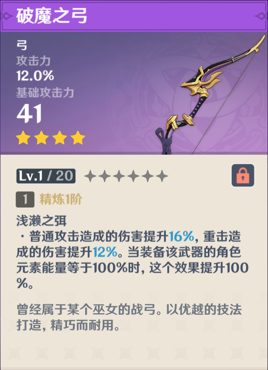
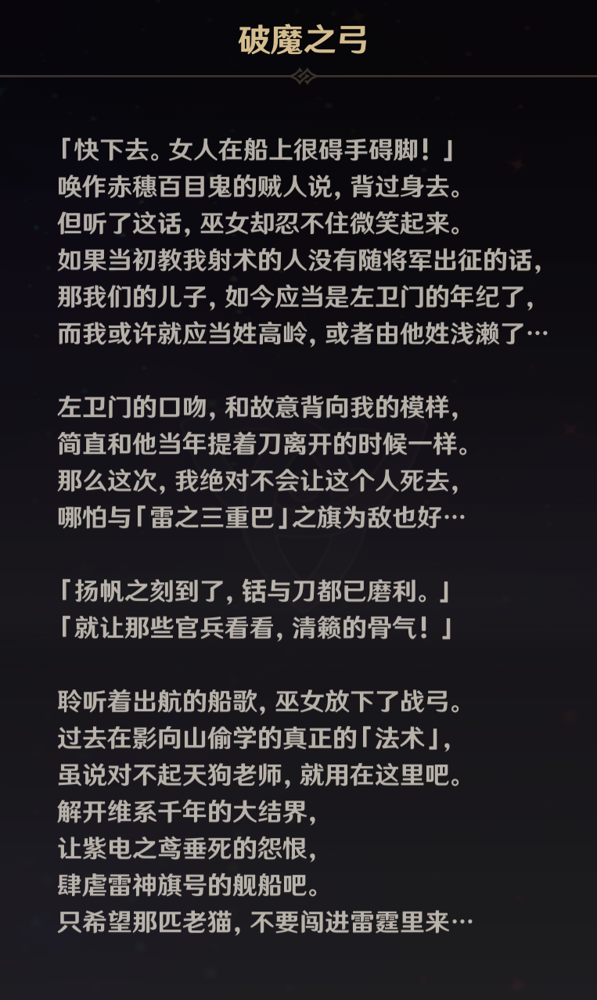
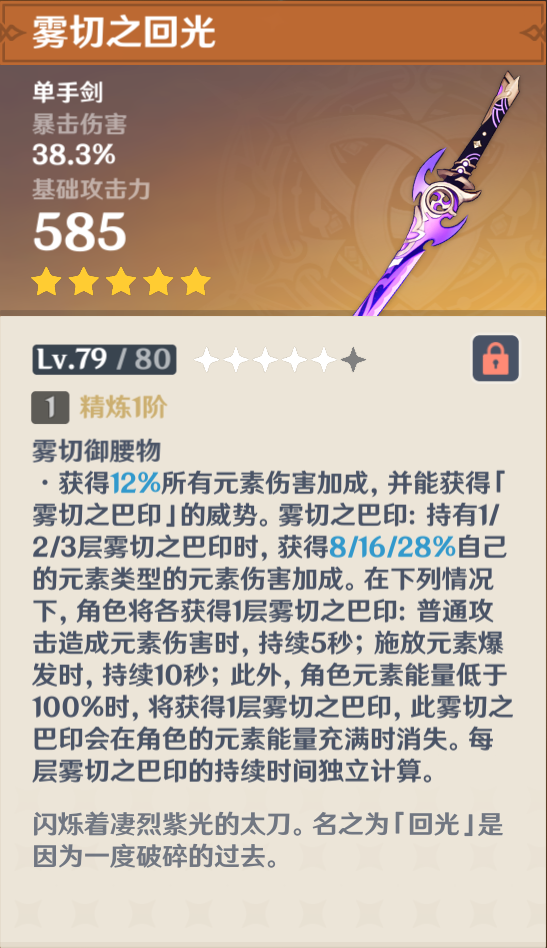
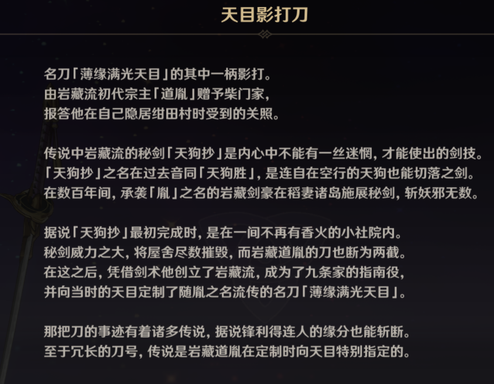
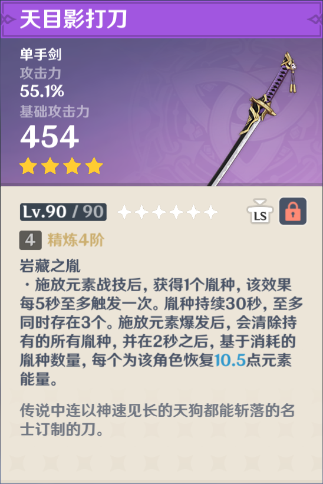
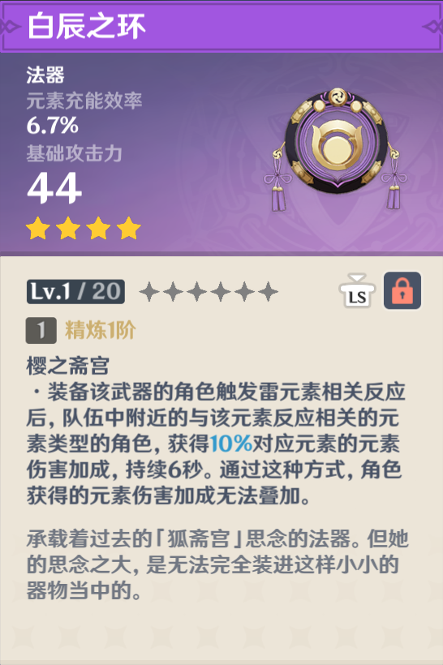

# 破魔之弓

+   曾经属于某个巫女的战弓。以优越的技法打造，精巧而耐用。

>   「快下去。女人在船上很碍手碍脚！」
>   唤作赤穗百目鬼的贼人说，背过身去。
>   但听了这话，巫女却忍不住微笑起来。
>   如果当初教我射术的人没有随将军出征的话，
>   那我们的儿子，如今应当是左卫门的年纪了，
>   而我或许就应当姓高岭，或者由他姓浅濑了…
>
>   左卫门的口吻，和故意背向我的模样，
>   简直和他当年提着刀离开的时候一样。
>   那么这次，我绝对不会让这个人死去，
>   哪怕与「雷之三重巴」之旗为敌也好…
>
>   「扬帆之刻到了，锯与刀都已磨利。」
>   「就让那些官兵看看，清籁的骨气！」
>
>   聆听着出航的船歌，巫女放下了战弓。
>   过去在影向山偷学的真正的「法术」，
>   虽说对不起天狗老师，就用在这里吧。
>   解开维系干年的大结界，
>   让紫电之茑垂死的怨恨，
>   肆虐雷神旗号的舰船吧。
>   只希望那匹老猫，不要闯进雷霆里来…

---

# 雾切之回光

+   闪烁着凄烈紫光的太刀。名之为「回光」是因为一度破碎的过去。

>将军御赐旗本的铭刀之一，据说其势能挟雷光之威斩开山岚夜雾。
>曾一度碎裂成上千片。重铸后，刀身上留下了如流云一般的纹痕。
>
>在歌谣之中，「大手门荒泷、胤之岩藏、长蛇喜多院、雾切高岭」
>尚武的孩童将历史上的名武者并列，其中的「雾切高岭」就是他。
>曾与被行的神人一同，以其秘剑「雾切」斩落无数的妖物与崇神。
>也曾从影向的天狗处学会操弓的心得，又将射术教给了中意之人。
>然而秘剑雾切再并无后人传承，仅仅存留在话本、绘图与童谣中。
>
>在其生涯的最末，他作为寄骑在将军的阵列中与漆黑的军势向对。
>
>如果没有将爱用的弓，作为赌注留在了她的身畔，或许情况也会不同吧。
>但真赌徒无论如何也不能后悔，绝不计较「如果」、绝不悔恨「假使」。
>敌人如同迷雾般涌来，那不断地使出连山岚夜雾也能斩断的妙剑就行了。
>斩切的速度足够快的话，那就能拨开欲深的漆黑迷雾，能瞥见光明吧—
>
>「浅漱，与你的约定…不，这场终结一切赌局的豪赌，我绝对不会输。」
>「我一定会回去。然后连同作为赌资的弓一起，取走我所赢得的未来！」
>
>如同连绵不绝的雷光，他与雾切一同斩落了无数妖物。
>但最终刀剑究竟仍是不如剑客的执着强韧，逐渐破碎。
>而漆黑的浓雾，也将他完全淹没了…
>在最后仅有刀的部分碎片被取回重铸，承担雾切之名。
>
>如同紧握垂入黑暗的蜘蛛丝般，紧握破碎刀柄的武者，
>在漆黑的浓雾中，仍然拗执地在内心中不断告诉自己：
>赌局的胜负尚且没有定论。我一定要回到浅液的身边…

---

# 天目影打刀

+   传说中连以神速见长的天狗都能斩落的名士订制的刀。

    

>   名刀「薄缘满光天目」的其中一柄影打。
>   由岩藏流初代宗主「道胤」赠予柴门家，
>   报答他在自己隐居绀田村时受到的关照。
>
>   传说中岩藏流的秘剑「天狗抄」是内心中不能有一丝迷惘，才能使出的剑技。
>   「天狗抄」之名在过去音同[天狗胜」，是连自在空行的天狗也能切落之剑。
>   在数百年间，承袭「胤」之名的岩藏剑豪在稻妻诸岛施展秘剑，斩妖邪无数。
>
>   据说「天狗抄」最初完成时，是在一间不再有香火的小社院内。
>   秘剑威力之大，将屋舍尽数摧毁，而岩藏道胤的刀也断为两截。
>   在这之后，凭借剑术他创立了岩藏流，成为了九条家的指南役，
>   并向当时的天目定制了随胤之名流传的名刀[薄缘满光天目」。
>
>   那把刀的事迹有着诸多传说，据说锋利得连人的缘分也能斩断。
>   至于冗长的刀号，传说是岩藏道胤在定制时向天目特别指定的。

---

# 白辰之环

+   承载着过去的「狐斋宫」思念的法器。但她的思念之大，是无法完全装进这样小小的器物当中的。

>「聚散太匆匆，夜宿朝别如一梦。」
>
>这浅薄平凡的一生，
>我自认过得很充实。
>
>我曾经以白辰狐之身，
>与机敏可爱的眷属们，
>奔走鸣神的草野山岳。
>
>希望，在一切都结束之后，
>它们能再度欢快地奔跑呢…
>
>我曾与面容如月的鬼族少女，
>一同在御前献艺倾奇与神乐，
>我也曾为她的剑舞不住叫好。
>希望她的美貌、勇武与仪态，
>能够为千年后的人久久传颂。
>
>一想到那名少女令人自愧弗如的美，
>就不禁希望以面具掩盖如今的模样…
>
>我曾与影向的天狗族长竞足，
>跑遍修验之灵山的表里参道，
>比拼我们双方的速度与力量。
>
>最终取胜的，竟是白辰一族的我。
>现在想来，她对我手下留情了吧。
>一念及此，就觉得有点不甘心呢…
>
>我曾设计执着于与我斗法的妖狸，
>使他心悦诚服地向将军大人投降。
>我同时不知耻地设计了那位大人，
>使她将僭越的大妖狸王纳入麾下。
>
>那夜御苑的月色透过树枝与花瓣，
>洒落在庭院里，美得像无数珍珠，
>如今依然在我浅薄的心中闪着光…
>
>希望她能够记住，在别离之前，我斗胆提出的冗长箴言。
>「不被蒙蔽、不受动摇，一直走在您所坚信的道路上。」
>并希望我的箴言，能为她多少抵挡几句谎言、几分恶念。
>也愿那顽皮却纯粹善良的狸子，不会记恨我最后的欺瞒…
>
>现在，在最为漆黑的地方，
>我也会牢牢抓住这些景象，
>让它们如同穿透云霭的月，
>照亮自己渺小脆弱的心灵。
>
>在这一生中，我也曾化为人的形姿，
>与这些短寿而美丽的小小生灵同行，
>以不同的身份，成为许多人的挚友。
>无论是为了故里的神社而前来鸣神修习的巫女，
>还是在夏祭中因为神鉾队伍与大人走散的孩子，
>抑或是最终前往璃月修习仙家之术的随和少年；
>无论是为了让城町繁荣而殚精竭虑的那位勘定，
>还是说那个醉心于打造无比锋利的刀剑的匠人，
>抑或是用巧技让人造的流星在深空绽放的一族，
>所有人，都是我不曾料想能够有幸结交的挚友。
>
>守护他们的结界，但愿不会被任何黑暗侵蚀…
>这一切，所有的所有，都是我如今所怀念的。
>
>「所以啊，撕咬我的漆黑意志，」
>「现在我已经失去了所有力量，」
>「我的白辰之血就任您挥洒吧。」
>「但是，尽管处于卑微的立场，」
>「我仍希望您能聆听我的请求…」
>
>「如果您能看见我所珍重之物，」
>「那么就请您饶恕那些生灵吧。」
>「如果您恩准我提出一个愿望，」
>「就请您将我永远明亮的记忆，」
>「归还给我热爱的这片土地吧。」
>「希望以此，在您的肆虐之后，」
>「仍然有美好的东西能留下来…」

---

# 神樱大祓

雷樱能够吸收大地中的污秽
污秽会积累,积累太多雷樱可能会枯萎

定期需要对雷樱进行一次小祓
污秽积累够多时进行大祓

几百年前 雷樱差一点枯萎 魔物横行

## 人物

### 狐斋宫*

+   白辰血脉的女儿,过去在一些地方贵为祭神的仙狐

+   在几百年前的一次神樱大祓的灾厄中被黑暗吞噬

+   因为狐斋宫在灾厄中融入了雷樱,所以现在的雷樱是狐狸的样子

### 花散里

+   **狐斋宫**的记忆与污秽

因为**狐斋宫**为守护鸣神岛的子民殁于神樱大祓
**花散里**没有关于那次神樱大祓的记忆

### 谜样的男性

+   名为「**惟神**」,是一名阴阳师

### 五百藏

+   被「谜样的男性」封印的狸猫
+   因**狐斋宫**的设计,被**雷神**安排管理镇守之森
+   捉迷藏
    +   因**狐斋宫**担心**五百藏**为<u>守护</u>镇守之森(几百年雷樱将要枯萎)而死,<u>骗**五百藏**玩捉迷藏</u>(见白辰之环故事「我曾设计执着于与我斗法的妖狸」)
    +   因为**狐斋宫**已殁,**五百藏**找不到狐斋宫,而偷走神樱大祓的镇物「梳子」
        +   **五百藏**以为梳子是狐斋宫的
    +   **惟神**封印了**五百藏**

>   我曾设计执着于与我斗法的妖狸，(五百藏被设计,去偷雷神的鸣草,被雷神发现)
>   使他心悦诚服地向将军大人投降。
>   我同时不知耻地设计了那位大人，
>   使她将僭越的大妖狸王纳入麾下。(指被安排管理镇守之森)

### 绀($g\grave{a}n$​)田传助

+   绀田村村长

+   绀田一族的职责
    +   绀田村下面有雷樱的根
        守护雷樱的结界是**狐斋宫**交给绀田一族的职责

+   绀田村后的井:

    +   >   「…将井口封锁后，将钥匙藏在村东水渠对面的屋舍残骸中…传说过去由**道胤**建造。如今却成了这般模样，还用来藏匿这种钥匙.」

#### 道胤

+   御與家的长子

+   岩藏流创始人

## 道具

### 留念镜

>神秘的「透镜」。透过它观测特殊的小狐狸雕像，可以找到原本不存在的东西。
>据说在很久以前，传说中的「**狐斋宫**大人」曾经将一件法器其作为退邪之物赠与彼时柊家家主弘嗣。**柊($zh\bar{o}ng$​​​​​)**以其为透镜部件的材料，后来从异国定做了特殊的「留影机」，并将其作为情谊的象征，回赠鸣神大社。

+   柊与勘定奉行有关
    +   **柊慎介**
        勘定奉行
    +   **柊千里**

