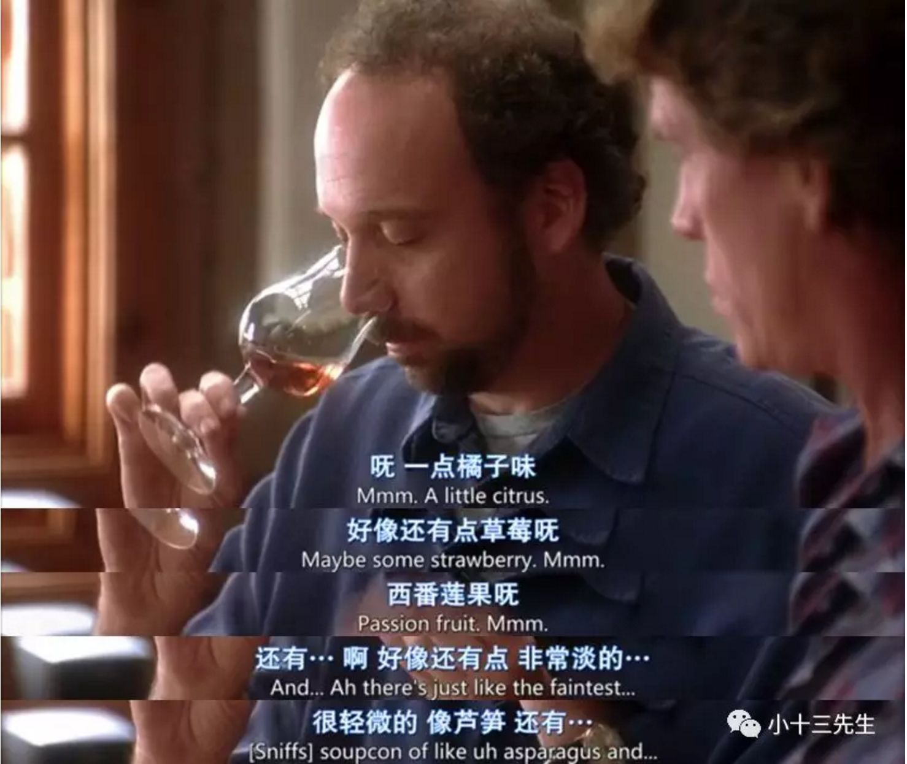
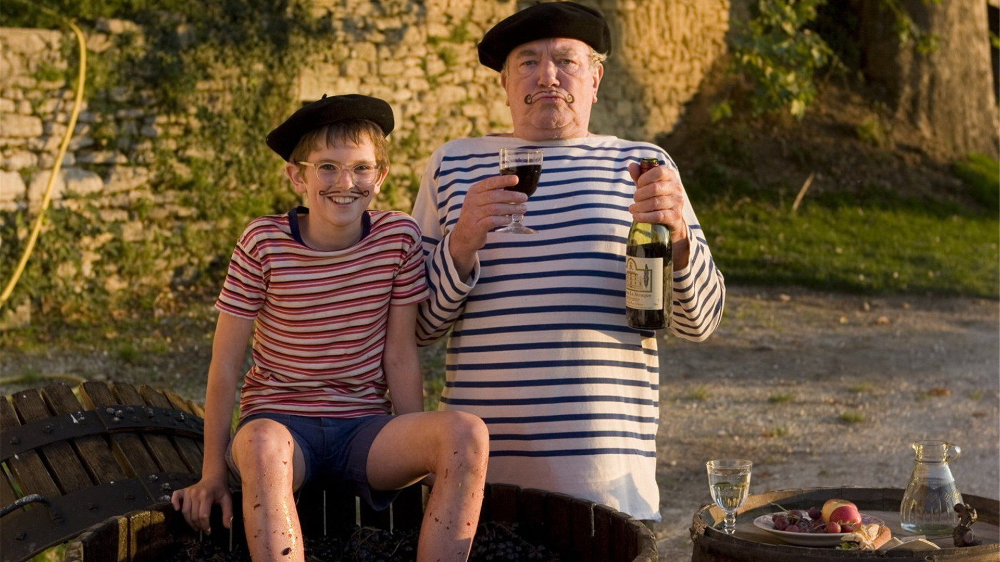

《杯酒人生》是一部以葡萄酒为主题的电影，讲述了两个中年人迈尔斯和杰克的故事。迈尔斯是一名失败的小说家，他的婚姻失败，作家梦遥不可及，干着无聊枯燥的工作。杰克即将结婚，却不甘于就此结婚。于是，他们踏上旅途，一个为了回忆过去，一个为了告别过去。在旅途中，他们品尝了各种葡萄酒，并且在品尝葡萄酒的过程中，他们发现了自己内心深处的情感。

------------------------------

在电影《美好的一年》中，麦斯·史金纳（Max Skinner）是一个在伦敦证券交易所工作的年轻人。他的叔叔亨利（Henry）在法国普罗旺斯的葡萄园里度过了一生，留下了一片葡萄园和一间房子。麦斯收到了叔叔去世的消息，来到普罗旺斯处理遗产。他原本打算快速卖掉葡萄园，但在那里度过了一个夏天后，他重新发现了自己，并决定留下来继承叔叔的遗产。在葡萄园里，麦斯遇到了法兰西斯·杜夫（Francis Duflot），他是葡萄园里的酿酒人。法兰西斯教会了麦斯如何品尝葡萄酒，并帮助他修复了葡萄园。最终，麦斯决定留下来继承叔叔的遗产，并与法兰西斯成为了朋友。

