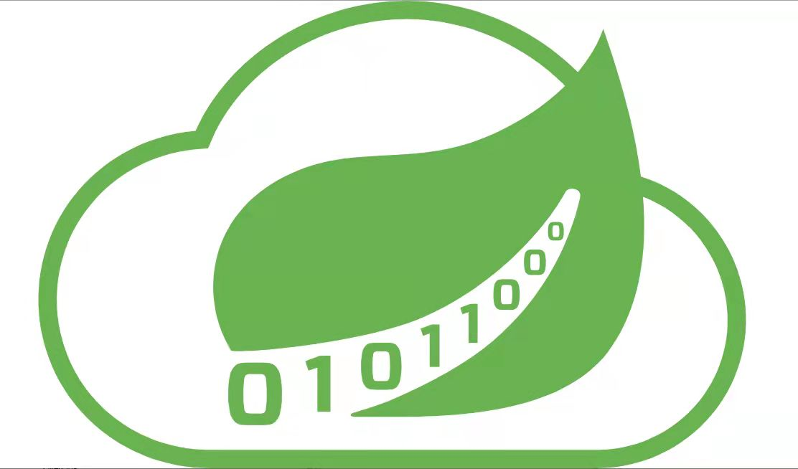

# 云服务器

 

+   团队名：Genisys 

 

+   团队所属领域：互联网云服务器

 

## 产品服务范围 (详细阐述)

临时会员使用/大型软件 ( $Adobe$ 全家桶) 等

 Thyme Cloud

# 团队Logo及设计说明

>   云端未来 Genisys LOGO设计理念
>
>   我们的 LOGO 主要由云朵、绿叶和数字1、0组成；主色调为绿色，象征着希望与未来，与我们的企业名“云端未来 Genisys ”遥相呼应。此外，绿色往往能让人联想到清晰、健康、安全沉稳，这也正是我们的产品云服务器的突出特点：较高的安全性和稳定性，能有效保护数据的安全和完整。LOGO中较大面积的留白也给人留下更多想象空间，对于未来云服务器的发展持有无限憧憬与希望。
>
>   LOGO 中的云朵象征着互联网和底层基础设施，代表着一种简单快速的网络云系统，这很好地呼应了我们的产品“云服务器”。作为云计算的一种，云服务器能高效、快捷地储存信息、上传数据，能实现数据的存取、运算，像云一样自由、快捷、简便。
>
>   LOGO 中的绿叶为百里香，正如百里飘香的绿叶一样，云服务器能远程传输、接受和共享信息，让不同地区不同种族的人共享资源和数据，打破距离壁垒，实现更加自由便捷的数据传播与共享。
>
>   数字1、0代表着计算机中的二进制，二进制与云服务器的运转过程息息相关，在展现我们产品的主要运作原理的同时也代表着我们对前辈伟大发明的致敬。
>
>   此外，由1、0组成的数字列朝向与绿叶叶尖的方向均向上，代表着我们企业积极向上的经营态度和坚定决心，也代表着对产品未来的发展充满无限希望与骐骥。

---

>   云服务器(Elastic Compute Service, ECS)是一种简单高效、安全可靠、处理能力可弹性伸缩的计算服务。其管理方式比物理服务器更简单高效。用户无需提前购买硬件，即可迅速创建或释放任意多台云服务器。

 

云服务器帮助您快速构建更稳定、安全的应用，降低开发运维的难度和整体IT成本，使您能够更专注于核心业务的创新。

云服务器服务包括核心产品：

+   面向中小企业用户与高端用户的云服务器租用服务；

云服务器平台的每个集群节点被部署在互联网的骨干数据中心，可独立提供计算、存储、在线备份、托管、带宽等互联网基础设施服务。

