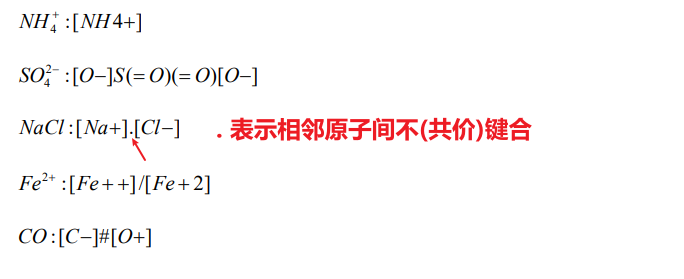

判断题、填空题、单选题、名词解释、简答题

# 第一章 绪论

+ **Chem(o)informatics：化学信息学，应用信息科学的方法来解决化学问题。**
  + 化学信息学的研究内容
    + 利用计算机技术和计算机网络技术对化学信息进行表示和管理
    + 利用计算机技术对复杂的化学信息进行解析，以快捷、方便的方式最大限度地提取和利用有用信息
    + 利用计算机对化学信息和化学体系进行模拟
    + 利用计算机和计算机网络技术收集、传播和共享化学信息

+ 最早的化学信息学家：门捷列夫
+ 2013 年诺奖多尺度模型：Martin Karplus， Michael Leyitt， Arieh Warshel
+ 1998 年量子化学：Walter Kohn，John A. Pople 
+ **生物信息学**：利用计算机技术研究生物系统之规律的学科
  + 新算法和统计学方法研究
  + 各类数据的分析和解释
  + 开发有效利用和管理数据的新工具
+ **生物信息学和化学信息学**
  + 从研究对象上，生物信息学偏重于序列分析，研究对象一般是生物大分子，而化学信息学偏重于结构分析，研究对象一般为小分子或小分子与大分子的相互作用。
  + 从研究方法上，生物信息学与化学信息学相似，主要为数理统计分析，但化学信息学更偏重于分子结构的模拟。
  + 研究小分子的化学信息学，同研究生物大分子的生物信息学相辅相成，在药物发现与设计，尤其 是药物分子与生物大分子相互作用等领域发挥重要作用。
+ 化学信息学贯穿于药物设计

# 分子结构的可视化与存储

ChemDraw

## 分子三维结构的可视化

+ Molecular Graphics： 分子图形学，是利用现代的计算机图形学技术将分子的二维平面、三维空间结构及分子表面和性质等信息进行可视化技术展示的一门新兴学科。
+ 分子可视化模型
  + 线状模型（line）
  + 棍状模型（stick）
  + 球棍模型（ball & stick）
  + 空间填充模型（space-filling, CPK: Corey-Pauling-Koltun）
+ 分子表面模型
  + 范德华表面
  + 溶剂排除表面（分子表面，Connolly 表面）

## 分子结构的存储

+ 化合物命名

  + 俗名
    + 根据物质的性质和外观为化合物取名
  + 经验式
    + 避免命名混乱
    + 不能唯一地表征化合物
  + IUPAC 系统命名法（国际纯粹和应用化学联合会）
    + 为唯一地表征化合物而产生

+ 数据库登录号

  + 美国化学文摘社 CAS
    + **CAS 登录号（CAS Registry Number）**
    + `aaaaabb-bb-b`
    + b 固定存在，a 部分为 0-5 位数字
    + 最多十位数字，由连字符分割为三个部分
    + 前两个部分为顺序码(ab-cd)，第三部分(e)为校验码
    + `ab-cd-e` `e=(d*1+c*2+b*3+a*4)%10`

+ 分子结构计算机表示

  + 线性编码（line notation, LN）

    + 具有一定语法规则的字符串，也 是一种形式语言。它把一些预先定义好的代表分 子结构碎片的符号和数字线性地排列起来。
    + 生信中的 核酸序列 `ATCGGGG`

  + WLN 编码

    + Wiswesser Line Notation
    + 按化合物结构中原子连接 的基本顺序排列，注重突出官能团
    + 用符号表示结构单元
    + 
    + 

  + ROSDAL 编码

    + 使用文字、数学符号对化学结构进行简单编码
      + 除氢原子外，每个原子需指定唯一的数字编号
      + 碳原子直接用数字表示，其他原子需标明原子符号
      + 化学键
        + `-` 单键
        + `=` 双键
        + `#` 叁键
        + `?` 任意连接
        + `,` 用于分割分支和取代基

  + **SMILES 编码**

    1. 原子用各自的原子符号表示
    2. 省略简单连接的 H 原子
    3. 相邻原子表示彼此相连
    4. 双键和叁键分别以 `=` 和 `#` 表示
    5. 分支用 `()` 表示
    6. 环通过成环的原子表示，首尾原子需标记相同的数字

    + 编码规则：
      + 原子
        + 原子用方括号括起来的元素符号表示
        + 有机物中的 $\mathrm{B,\ C,\ N,\ O,\ S,\ F,\ Cl,\ Br,\ I}$ 等原子可以省略方括号，其他元素必须包括在方括号之内
        + 氢原子通常被省略。对于省略了方括号的原子，用氢原子补足价数。
      + 化学键
        + 单键用 `-` 表示，通常省略
        + 双键用 `=` 表示
        + 叁键用 `#` 表示
        + 芳香键用 `:` 表示，通常省略
      + 支链
        + 用圆括号表示
        + $\mathrm{CH_3CH_2COOH}$ 可表示为 `CCC(=O)O`
        + $\mathrm{CHF_3}$ 可表示为 `FC(F)F` 或 `C(F)(F)F`
      + 环
        + 如果结构中有环，则要打开，断开处的两个原子用同一个数字标记，表示原子间有键相连
        + 例如环己烷可以表示为 `C1CCCCC1`
      + 多环
        + 如果有两个环，则依次编号 1，2
        + 如果环数大于 9，则用 `%` 标识数字，例如 `c%12`
      + 
      + 
      + 
      + 

  + 三维结构文件

    + 通常采用笛卡尔坐标系
    + 原子间的连接性可通过原子之间的距离隐含得到

# 化学数据库及文献检索

+ 化学数据库
  + 文献数据库
    + 书目、专利
  + 事实数据库
    + 主要包含直接描述化合物对象的混合数据
    + 数值数据库、化合物目录、研究项目数据库
    + Beilstein 数据库是世界上最大的关于有机化学事实的数据库
  + 结构数据库
    + PDB 蛋白质结构数据库
    + ICSD 无极晶体结构数据库
    + CSD 有机（金属）化合物结构数据库

+ 三大文献检索系统
  + SIC
    + 科学引文索引
  + EI
    + 工程索引
  + ISTP 
    + 科技会议录索引

# 分子描述符和分子相似性

+ Molecular Descriptor 分子描述符

  + 对分子在某一方面性质的度量。既可以是分子的物理化学性质也可以是对分子结构应用某种数学算法推导出来的数值指标。
  + 定量描述符
  + 定性描述符

+ 定量构效关系

  + QSAR (Quantitative Structure Activity Relationship)
  + 一种借助分子的理化性质参数或结构参数，以数学和统计学手段定量研究有机小分子与生物发分子相互作用、有机小分子在生物体内吸收、分布、代谢、代谢等生理相关性质的方法
  + 建立 2D QSAR 模型的基本流程
    1. 收集药理活性数据
    2. 收集该类药物有关药学（药理学、药代动力学）方面的知识
    3. 提取用于描述药物分子性质的参数
    4. 将收集到的化合物活性数据集和提取得到的分子性质参数汇集成表格。
    5. 选择适当的建模手段
    6. 建立模型，评价模型的质量
    7. 模型的验证

+ 分子相似性

  + 两个分子在结构或性质上相似的程度

  + 

  + 欧氏距离

    + $$
      D_{AB} = \sqrt{\sum_{i=1}^{n}\left ( a_i - b_i\right )^2}
      $$

    + 

    + 三维空间中的直线距离

  + 曼哈顿距离

    + $$
      D_{AB}=\sum_{i=1}^{n}\left|a_i-b_i\right|
      $$

    + 
      

  + 分子相似性的计算

    + 分子表征
      + 分子描述符
      + 特征选择
    + 对比计算
      + 相似性系数
        + 谷本系数
      + 距离
        + 欧氏距离（欧几里得）
        + 曼哈顿距离
      + 最大公共子结构
    + 总结
      + 分子相似性可以用相似性系数和分子间距离来表示。前者一般用于搜寻抑制活性物的类似物，而后者用于化合物数据库的多样性度量。他们是一个问题的两个方面。

# 分子模拟

+ 分子模拟
  + 应用已有的理论化学、力学定律（经典、量子），借助计算机定量地预测一些难以通过实验方法测定的结构信息、分子性质、化学反应等
  + 可以确定化合物的系统能量以及对应的稳定构象、静电势面、能垒以及分子复合物的某些热力学性质，包括熵、自由能、热容、平衡常数等。分子模拟现在已经称为化学研究领域的一种强有力的工具。
  + 分子模拟的理论基础
    + 量子力学 Quantum Mechanics
      + 求解薛定谔方程
        + 从头计算法
        + 半经验法
        + 密度范函方法
      + 应用
        + 计算单点能
        + 结构优化
        + 振动频率分析
        + 研究反应机理
    + 分子力学 Molecular Mechanics
      + 以经典的牛顿力学为基础，通过势能函数来描述分子中原子核之间的相互作用。
      + 适用于复杂分子以及生物大分子的构象分子，而量子力学计算适用于与电子运动相关的性质，如电子结构等
    + 分子动力学 Molecular Dynamics
  + 分子结构的优化
    + 求解分子最低能量构象
    + 能量最小化算法
      + 一阶优化算法
        + 最速下降法 (Steepest Descent) 
          + （梯度下降）
          + 特点：
            + 方向变化大
            + 收敛慢
            + 优化幅度大
        + 共轭梯度法 (Conjugate Gradients)
          + 考虑梯度和前一步的方向
          + 特点：
            + 收敛快
            + 易陷入局部势阱
            + 对初始结构偏离不大
      + 二阶优化算法
        + 牛顿-拉弗森法
          + 需要计算二阶微分
          + 特点：
            + 计算量大
            + 微商小时收敛快
+ 分子动力学
  + 采用分子力学的力场模型，利用牛顿定律求解作用于每个原子上的力，模拟分子中各原子的运动过程，得到原子的运动轨迹，从而达到构象搜索的目的。
  + 解析分子运动性质的有力工具
  + 常用分子动力学模拟软件
    + AMBER
    + CHARMM
    + NAMD
    + GROMACS
    + TINKER
    + Desmond
    + LAMMPS
  + 分子动力学模拟的局限性
    1. 模拟结果的准确性去接与分子力场的准确性
    2. 所能模拟的体系的空间和时间尺度有限
    3. 只能模拟已参数化的体系
    4. 不能模拟化学键的断裂，即不能模拟化学反应过程
+ 分子对接
  + 用于研究配体分子于受体分子之间的最佳结合模式
  + 分子对接原理
    + 锁钥模型
      + 刚性对接 Rigid Docking
    + 诱导契合模型
      + 半柔性对接 Semi-Flexible Docking
      + 柔性对接 Flexible Docking
  + 需要解决两个问题
    + 采样
      + 在考虑受体分子结合部位空间限制的情况下，对配体分成在可能采取的构象进行采样
    + 打分
      + 计算配体分子于受体分子的结合能
  + 采样方法
    + 系统搜索 Systematic Search
    + 随机搜索 Stochastic Search
    + 蒙特卡洛 Monte Carlo 算法
    + 模拟退火算法 Simulated Annealing
    + 遗传算法 Genetic Algorithm
  + 分子对接的应用
    + 预测受体与配体分子的结合模式
    + 从小分子化合物库中搜索能与特定靶蛋白相结合的化合物（虚拟筛选）
    + 从蛋白质数据哭中搜索能够结合特定小分子配体的靶标蛋白（反向对接）
  + 常用分子对接软件
    + DOCK
    + AutoDock
    + Glide
    + GOLD

> All Rights Reserve (C) 2022 Zidong Zh.
>
>  This work is licensed under a <a rel="license" href="http://creativecommons.org/licenses/by-nc/4.0/">Creative Commons Attribution-NonCommercial 4.0 International License</a>.
