# 机器学习

## 分工

+ 感知器模型
  + 生物神经元的数学抽象
  + 具体实现

+ 隐藏层
  + 分类异或问题
  + 隐藏层
  + 激活函数
  + 非线性变换
  + 升维
+ 线性代数 - 线性变换
  + 向量
  + 基向量
  + 矩阵
  + 并行计算
+ 微积分 - 梯度下降
  + 导数
  + 定义法求导
  + 链式法则
  + `----------`
  + 损失函数
  + 梯度下降
  + 学习率
+ 正向传播与反向传播
  + 变量迭代
+ 搭建神经网络
  + 过拟合
  + 梯度消失
  + 随机梯度下降
  + 泛化
  + 多分类
+ 识别图像与理解语言
  + 识别图像
    + 卷积
    + 卷积神经网络
    + 采样
    + 验证码
  + 理解语言
    + 遮蔽语言模型
    + 循环神经网络
    + 长短期记忆单元

查找的资料需要与机器学习相关，可以通过「机器学习 关键词」搜索资料，如搜索「机器学习 线性变换」。

将资料总结，只需要总结的文字或能帮助阐述原理的图片，可以将文字和图片贴到 Word 文档内，最好能在文档末尾附上查找到的资料的链接。

`识别图像与理解语言` 两个方面只需要简要介绍，可以不用讲明原理。

## 感知器模型

人工智能的源头和人类智能一样，都是二元分类。输入特征，识别特征，输出结果，判断对错，不断迭代，这就是机器分类数据的流程。

$$
\huge W_1X_1+W_2X_2-b=0
$$
$W_i$ 改变斜率，$b$ 改变截距

感知器模型来源以及生物神经元的数学抽象

大脑中大概有 850 亿个神经元

每个神经元可以被理解为一个开关, 接受一个或多个上游神经元的信号, 如果上游神经元发送的信号总和达到某个阈值 $W$, 那么这个神经元就会被激活, 并向下游神经元发送刺激信号或抑制信号

比如这个神经元有两个输入信号 $X_1,\ X_2$, 来自不同轴突的信号的重要程度也不同, 记为 $W_1,\ W_2$, 如果这两个信号强度的总和达到了阈值 $b$, 那么这个神经元就会被激活, 向下一个神经元发送信号 

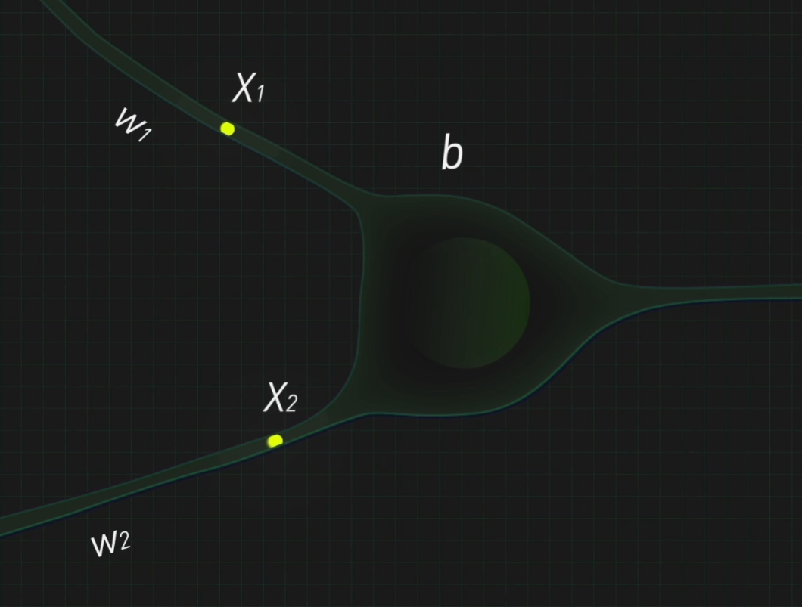

感知器公式
$$
\huge\sum_{i=1}^{n} W_i\cdot X_i + b = 0
$$
一个感知器模型包含四个方面:

+ 输入
+ 权重
+ 判断
+ 输出

神经网络就是通过这样一个个感知器模型搭建起来的

## 如何让机器学习

在学习过程中, 我们需要人为设定一个正确答案, 让机器知道自己错了, 并调整权重和阈值.

机器学习的核心就是让机器自动的调整参数 $W$ 和 $b$ 

如果机器判断结果错误, 比如大于阈值应该输出 $1$, 但机器输出 $0$, 说明机器的计算结果太大, 需要调整权重, 让计算结果小于阈值.

在调整权重的过程中, 会产生一个参数 $\huge\Delta W_i$ 也就是机器需要算出到底调整多少

$$
\huge\Delta W_i=(Y-y)\times X_i
$$
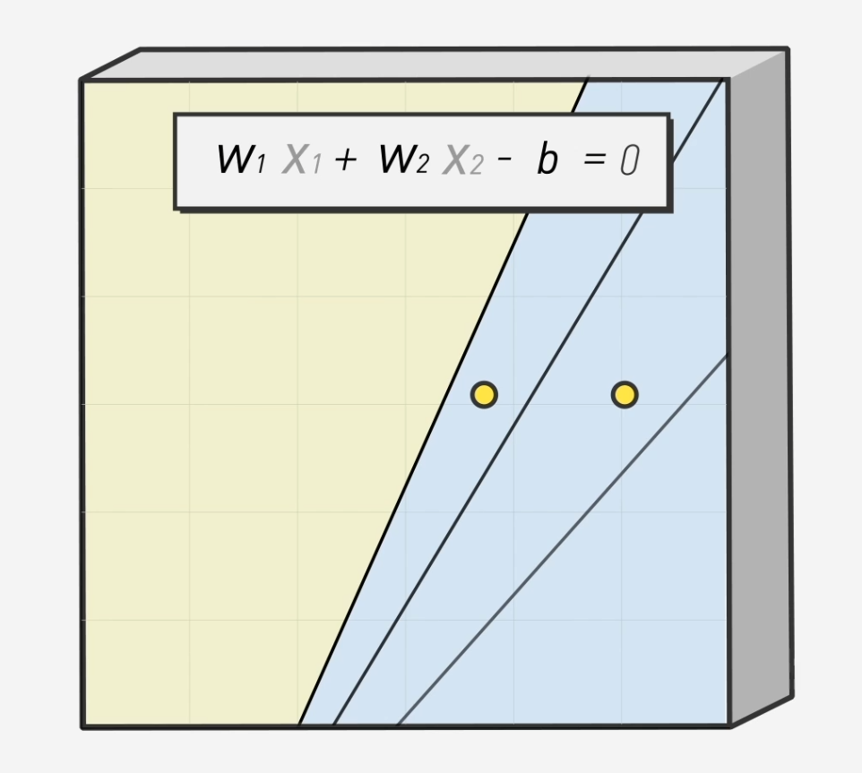

同样 $b$ 也会调整
$$
\huge\Delta b=Y-y
$$
通常还会再调整值后面再乘一个 $r$
$$
\huge\begin{aligned}
\Delta W_i&=\left [ (Y-y)\times X_i \right ]\times r\\
\Delta b&=(Y-y)\times r
\end{aligned}
$$
早在 1957 年 Frank Rosenblatt 就发明了这种感知器, 但是这种感知器有一个致命的缺点

## 线性变换与激活函数(非线性变换)

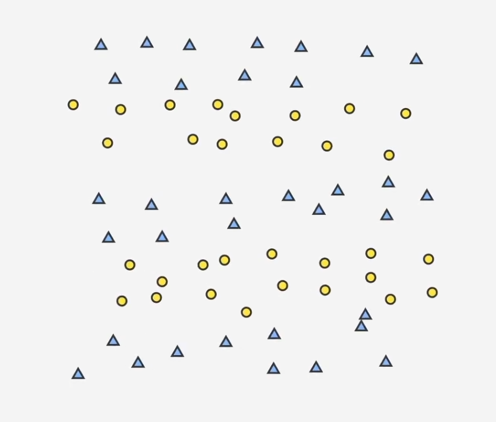

 

很多数据无法通过一条直线或一个平面/超平面进行划分

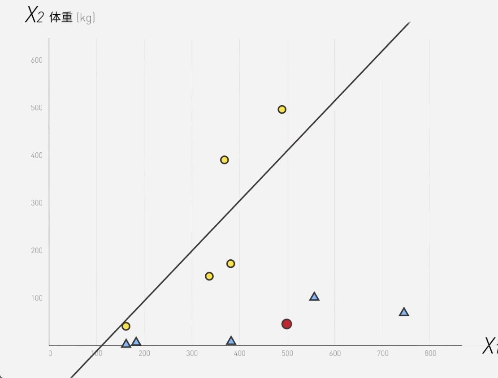

例如图中这四个点

无论这条直线怎么放, 都无法划分这四个点, 除非把这条直线弯一下

但是在感知器模型中并不能画出曲线
$$
\huge W_1X_1+W_2X_2-b=0
$$
以划分二维数据距离, 多维中就是平面或超平面

解决方法就是弯曲整个坐标系

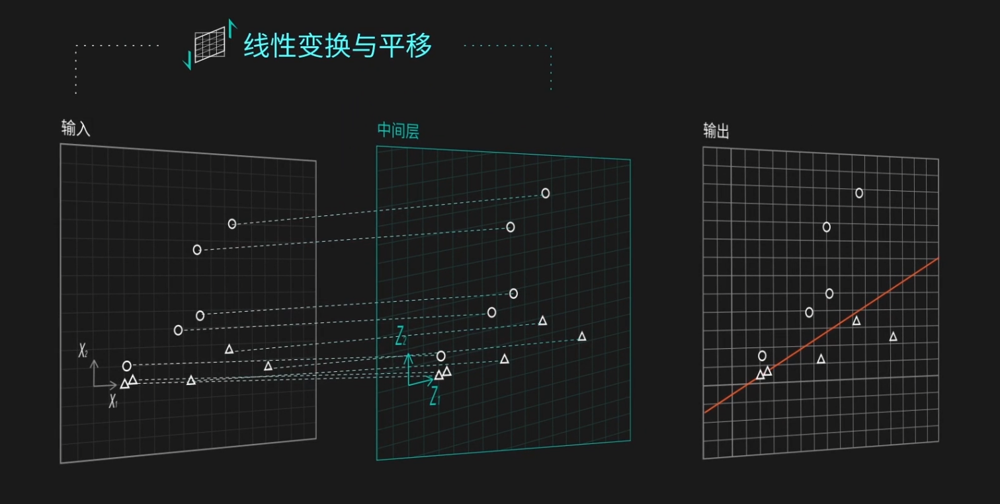

[线性代数的本质哔哩哔哩_bilibili](https://www.bilibili.com/video/BV1Ys411k7yQ/)

[【官方双语/合集】微积分的本质 - 系列合集哔哩哔哩bilibili](https://www.bilibili.com/video/BV1qW411N7FU/)

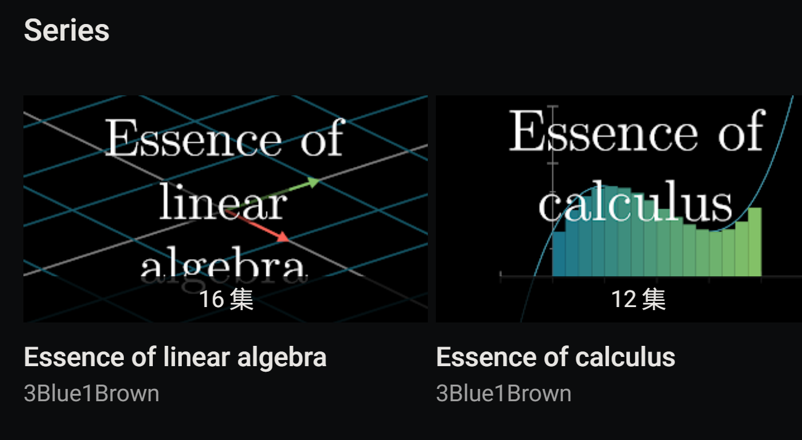

线性变换还是太直了, 变换前后直线依旧是直线, 原点不会移动

所以可以继续加一层激活函数

在前面的区分鳄鱼与蛇的过程中, 我们使用的是阶跃函数

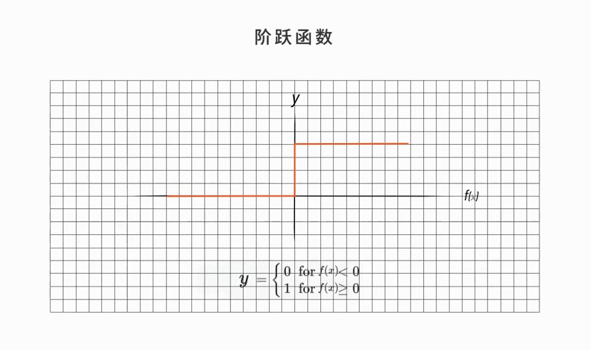

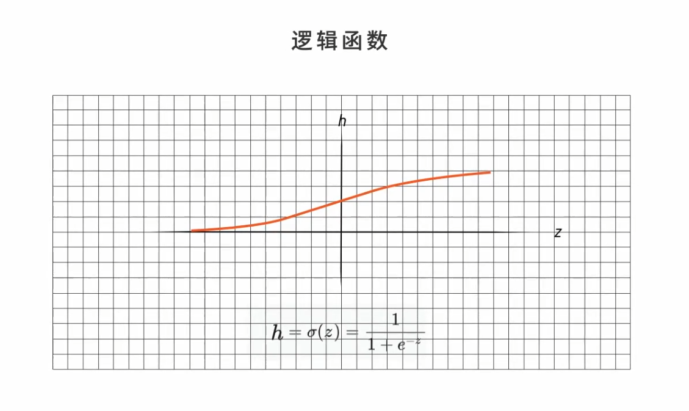

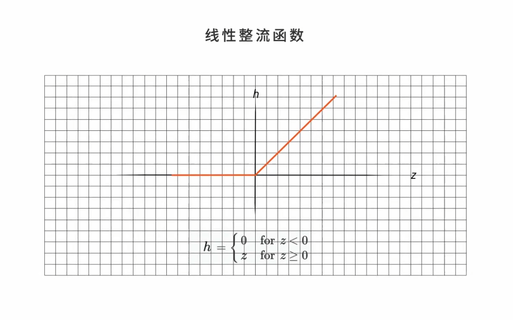

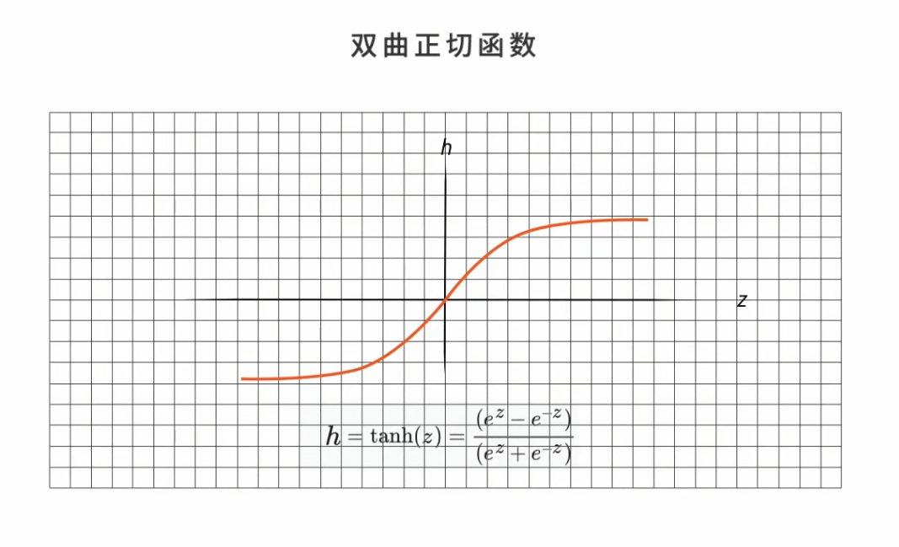

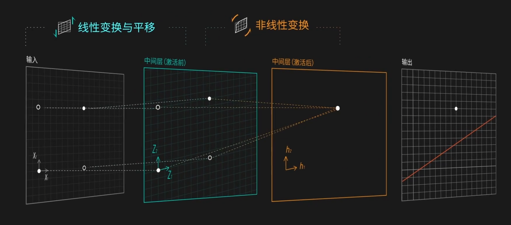

## 损失函数与梯度下降

在需要线性变换平移以及非线性变换完成划分的数据集中, 机器调整参数的过程会更复杂, 在训练过程中, 可以将误差用一个函数表示出来

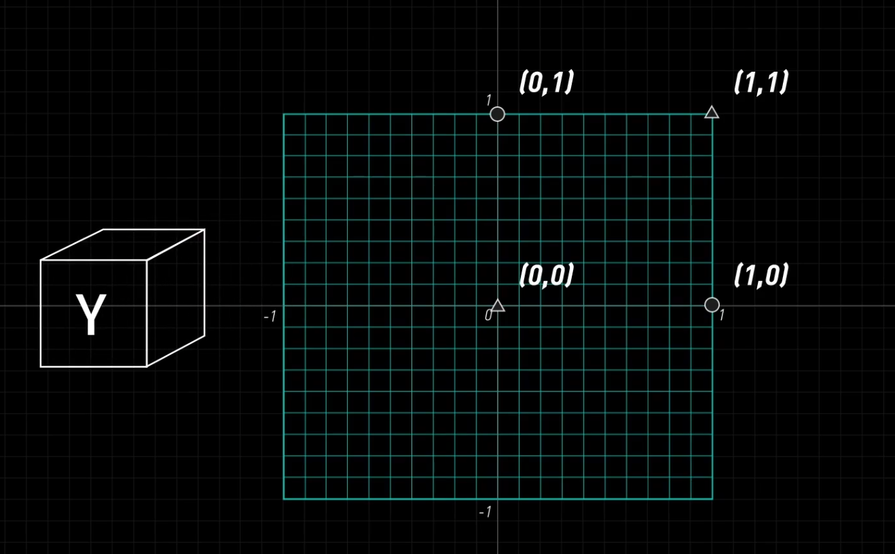

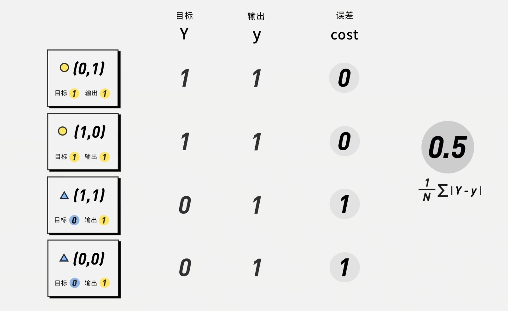
$$
\huge\text{Cost} = \frac{1}{2N}\sum|Y-y|^2=f(W_i,b_i)
$$
损失函数的值越小，模型的精确度就越高。

可以通过梯度下降方法找到损失函数的最小值

+ 方向 斜率反向
+ 距离
  + 斜率 $\times$ 步长 $r$
  + $r$ 也就是学习率 

走的距离太远会错过最低点, 所以需要选择合适的步长(学习率)

多维的数据可以通过求偏导确定下降方向

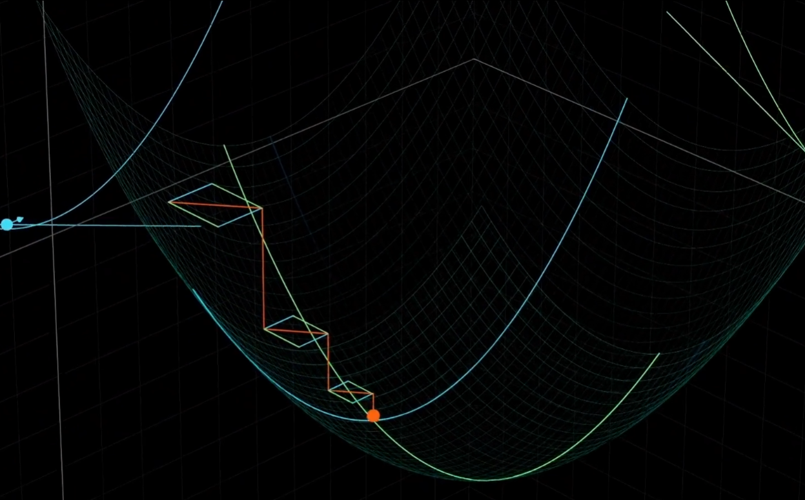

# 参考

[基本操作(jibencaozuo.com)](https://jibencaozuo.com/zh-Hans/)

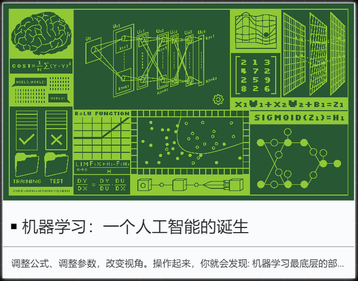