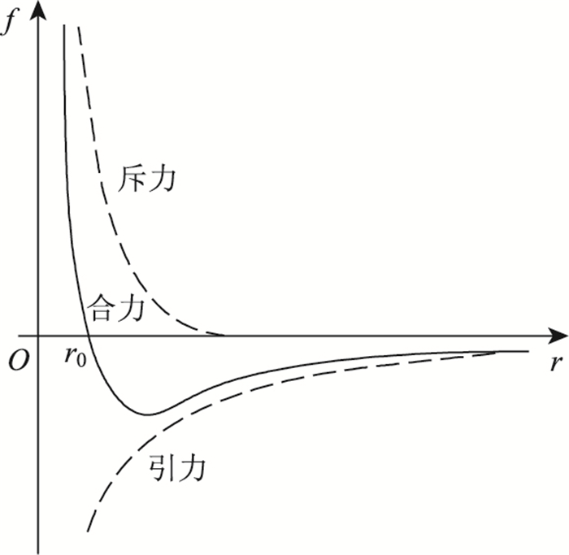
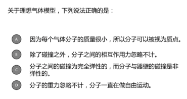
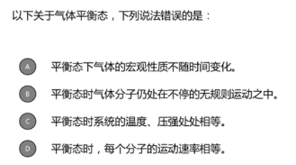
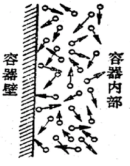
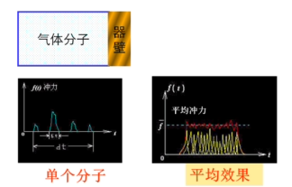
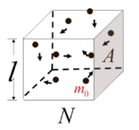
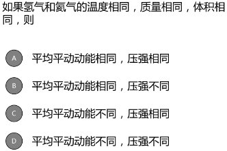
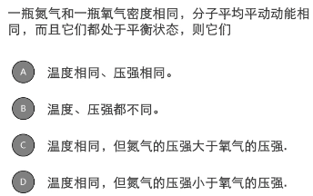
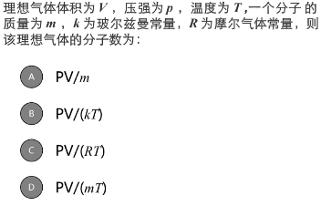
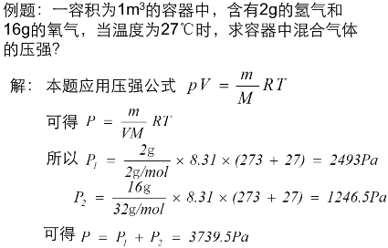

# 气体动理论

## 热力学概述

### 研究内容

自然界物质与冷热有光环的性质以及这些性质变化的规律
### 研究对象

常见的:气体、液体、固体，其他：热辐射，宇宙等
### 研究方法

气体动理论、热力学

# 气体动理论

## 主要内容：

### 	1.平衡状态下宏观两与微观量的关系

&emsp;速率平衡态、宏观量、微观量、分布函数 
&emsp;压强、温度公式 
&emsp;能量均分原理、理想气体的内能公式

### 	2.平衡态下物理量的分布

&emsp;麦克斯韦速率分布律

&emsp;&emsp;三个统计速率

# 经典的统计的基本概念

## 一、物质的微观描述
&emsp;一切宏观物体都由大量分子组成，分子间有空隙 
&emsp;&emsp;**实验根据：** 
&emsp;&emsp;&emsp;一切物体都可以被压缩 
 
&emsp;分子永不停息的作无规则的热运动 
&emsp;&emsp;分子的永远运动和频繁碰撞 
&emsp;&emsp;热运动的无序性和统计行 
&emsp;&emsp;**实验依据：** 
&emsp;&emsp;&emsp;扩散和布朗运动 
 
**&emsp;分子间有相互作用**

# 理想气体微观模型

* 气体间平均距离>>分子线度，视为质点 
* 除碰撞瞬间外，分子间相互作用力及重力可忽略，分子视为自由运动 
  理想气体是大量自由的、无规则运动的弹性粒子组成的多粒子体系 
 **实际气体在温度较高，压强较低时可视为理想气体**

## 如何描述理想气体的状态？

### 宏观量

&emsp;&emsp;体积、压强、温度 
&emsp;&emsp;质量、速度、动能 
&emsp;&emsp;状态方程:
$$
pV=\frac{m}{M}RT \qquad R = 8.314J \cdot mol^{-1} \cdot K^{-1}
$$
> 注意：理想气体的宏观量之间不是相互独立的

 

# 平衡态
**平衡态：在不受外界影响的条件下，物体的宏观性质不随时间变化的状态**
	①不受外界影响，是指外界对系统不做功、不传热
	②宏观性质不随时间变化，是指物体的宏观可观测性质确定不变
$$
处处等压 \to 力平衡\\
\, 处处均匀 \to 化学平衡\\
处处等温 \to 热平衡
$$
​	③微观粒子仍处于热运动 $\to$ 热动平衡

处于热平衡系统的状态参量互相不独立

## 重点提要
$$
理想气体模型\left\{
    \begin{matrix}
    质点\\
    自由运动\\
    完全弹性碰撞
    \end{matrix}
    \right.
$$

$$
平衡态(热动平衡)\left\{
    \begin{matrix}
        处处等压\\
        处处均匀\\
        处处等温\\
    \end{matrix}
    \right.
$$

## 练习一

>  选择B 
>  D项:"**除了碰撞以外**",分子一直在做自由运动

## 练习二

>  选择D

## 多粒子系统的研究方法

### 1.统计方法

​	对于大量分子组成的热力学系统从微观上加以研究时，必须用统计的方法

### 2.涨落现象

​	**宏观量的实际观察数值与统计平均值偏离的现象**

>  伽尔顿板实验

# 理想气体的压强和温度公式

## 1.压强的产生

​	气体的压强:大量分子不断碰撞的结果

 

>  单个分子碰撞器壁的作用力是不连续的、偶然的、不均匀的。从总的效果来看，是一个持续的平均作用力。

**理想气体平衡态的等概率假设**
	1.气体分子在容器中各处出现的概率是相等的.即气体分子数密度(n)处处相等
$$
\large n=\frac{dN}{dV}=\frac{N}{V}
$$
​	2.气体分子沿个方向运动的概率相等,即分子速度在个方向上分量的各种平均值相等
$$
\large\overline{V^{2}_{x}}=\overline{V^{2}_{y}}=\overline{V^{2}_{z}}
$$

## **二.理想气体压强公式的推导**

$$
\begin{aligned}
\large P&=\frac{\overline{F}}{S}\\
\large\overline{F}=\frac{I}{\Delta t}\quad\rightarrow\quad &=\frac{I}{S\Delta t}\\
\large I=\sum_{i=1}^{N} I_{i}\quad\rightarrow\quad I_{i}&=\Delta m_0v_i\quad 每个分子冲量和
\end{aligned}
$$

$$
\therefore P=\frac{\sum I_{i}}{S\cdot \Delta t}
$$

### $\Delta t$内 $I_i=\Delta m_0v_i\\$

### ①求i分子与器壁A碰撞一次时,施于A的冲量

$$
\large \quad I_i=2m_0v_{ix}
$$

>  完全弹性碰撞 取速度在$x$方向分量
>  撞击前速度$v_{ix}\rightarrow$撞击后速度$-v_{ix}\quad\rightarrow\quad\Delta v_i=2v_{ix}$

### ②求i分子在$\Delta t$时间内对A的碰撞次数

$$
\Large \quad t_0=\frac{2l}{v_{ix}}
$$

>  $t_0$ : 单个气体分子两次与器壁碰撞的间隔
>
>  

$$
\large\frac{\Delta t}{t_0}=\frac{v_ix}{2l}\Delta t
$$

>  碰撞次数

### ③求i分子在$\Delta t$时间内施于A的冲量

$$
\begin{aligned}
\large I_i&=\frac{v_{ix}}{2l}\Delta t(2m_0v_{ix})\\
\large &=\frac{m_0v_{ix}^2\Delta t}{l}\\
\end{aligned}
$$

### ④N个分子$\Delta t$时间内施于A的总冲量

$$
\begin{aligned}
\Large I &= \sum_{i=1}^{N}I_i\\
\Large   &=\sum_{i=1}^{N}\frac{m_0\Delta t}{l}v_{ix}^{2}\\
\Large   &=\frac{m_0\Delta t}{l}\sum_{i-1}^{N}v_{ix}^2\\
\end{aligned}
$$

### ⑤压强

$$
\begin{aligned}
\large \overline{F}&=\frac{I}{\Delta t}\\
\large &=\frac{m_o}{l}\sum_{i=1}^{N}v_{ix}^{2}\\
\\
\large P&=\frac{\overline{F}}{s}\\
\large &=\frac{m_0}{Sl}\sum_{i=1}^{N}v_{ix}^2\\
\large &=\frac{Nm_0\sum_{i=1}^{N}v_{ix}^2}{VN}\\
\large &=nm_0\overline{v_x^2}
\end{aligned}
$$

>  $n$:分子密度数 , $n=\frac{N}{V}$
>
>  $\overline{v_x^2}:X$方向速率的平均值 , $\large\overline{v_x^2}=\frac{\sum_{i=1}^{N}v_{ix}^2}{N}$

$$
\left.
\begin{matrix}
\large \overline{v_x^2}=\overline{v_y^2}=\overline{v_z^2}\\
\large \overline{v^2}=\overline{v_x^2}+\overline{v_y^2}+\overline{v_z^2}
\end{matrix}
\right \}\large\rightarrow\overline{v_x^2}=\frac{1}{3}\overline{v^2}\\
\quad \\
\large P=nm_0\overline{v_x^2}=\frac{2}{3}n(\frac{1}{2}m_0\overline{v^2})\\
\quad\\
\begin{aligned}
\LARGE P&=\frac{2}{3}n\overline\epsilon_\kappa\\
\end{aligned}
$$

>  $\overline{\varepsilon_\kappa}:$ 分子平均平动动能 , $\overline{\varepsilon_\kappa}=\frac{1}{2}m_0\overline{v^2}$

## 三、压强的物理意义

$$
\LARGE p=\frac{2}{3}n\overline{\varepsilon_\kappa}
$$

>  $P$ : 宏观可测量量
>
>  $n\overline{\varepsilon_\kappa}$ : 微观量的统计平均值

+  压强是大量分子对时间、对面积的统计平均结果
+  压强公式只适用于理想气体

## 四、温度的统计意义

​	1.宏观意义:冷热程度,是界定某一系统与零一系统处于热平衡的宏观标志
​		温标$\rightarrow$温度的数值表示法,量化冷热程度

>  摄氏温标(℃)规定$1atm$下,纯水的冰点为$0$℃,汽点为$100$度
>
>  华氏温标(℉):规定$1atm$下,水、冰和氯化铵混合物为0℉，水的汽点为$212$℉
>
>  $\large t_F=32+\frac{9}{5}t$
>
>  热力学温标(K):与测量物质无关$\quad T = 273.15+t$

​	2.微观统计意义
$$
\begin{aligned}
\large    PV&=\frac{m}{M}RT\rightarrow物态方程\\\\
\large    &=\frac{Nm_0}{N_Am_0}RT\\\\
\large    &=\frac{N}{N_A}RT\\\\\large
\large    \therefore P&=\frac{N}{V}\frac{R}{N_A}T\\\\
\large    &=nkT\\\\
\large    \therefore k&=\frac{R}{N_A}\\\\
\large    &=1.38\times10^{-23}J\cdot K^{-1}
\end{aligned}
$$

>$n$ : 分子数密度
>$k$ : 玻尔兹曼常数

$$
\left.
\begin{matrix}
    P=\frac{2}{3}n\overline{\epsilon_\kappa}\\
    P=nkT
\end{matrix}
\right\}\rightarrow\Large\overline{\epsilon_\kappa}=\frac{3}{2}kT\normalsize\rightarrow分子平均平动动能公式
$$

### 温度的物理意义 

&emsp;$\LARGE \overline{\varepsilon_\kappa}=\frac{1}{2}m\overline{v^2}=\frac{3}{2}kT$
 1.温度是分子平均平动动能的量度 $\overline{\omega}\propto T$ 反应热运动的剧烈程度 
2.温度是大量分子的集体表现,个别分子无意义 
3.在同一温度下,各种气体分子平均平动动能均相等 
**注意**:heavy_exclamation_mark:热运动与宏观运动的区别: 
&emsp;温度所反映的是分子的无规则运动,它和物体的整体运动无关,物体的整体运动是其中所有分子得到一种有规则运动的表现

## 理想气体平衡态特性

1.物态方程 : $\large pV=\frac{m}{M}RT$  
2.压强公式 : $P=\frac{2}{3}n\overline{\varepsilon_\kappa}p\qquad P=nkT$  
3.平均平动动能公式 : $\overline{\varepsilon_\kappa}= \frac{1}{2}m\overline{v^2}= \frac{3}{2}kT$

## 练习三

>  B
>  平均平动动能 : $\overline{\varepsilon_\kappa}= \frac{1}{2}m\overline{v^2}= \frac{3}{2}kT$
>  压强 : $pV=nRT$

## 练习四

>  C
>  平均平动动能 : $\overline{\epsilon_\kappa}= \frac{1}{2}m\overline{v^2}= \frac{3}{2}kT$
>  压强 : $P=\frac{m}{VM}RT=\frac{\rho}{M}RT$

## 练习五

>  B
>  $PV=nRT\qquad k=\frac{R}{N_A}\qquad PV=nkN_AT\qquad n=\frac{PV}{kTN_A}$

## 练习六

# 能均分定理 理想气体内能
## 分子模型

## 自由度
确定物体位置的独立坐标数，用$i$表示
+ 质点：3个平动自由度($t$)

### 刚体

+ 平动：质心位置
   +  $X,Y,Z$
+ 转动
   +  轴线方位$\alpha\quad\beta\quad\gamma$
      +  $\cos^2\alpha +\cos^2\beta+\cos^2\gamma=1$
   +  角度方位$\varphi$ 
      3个平动自由度$(t)$ 
      3个转动自由度$(r)$ 

### 分子自由度
|分子原子数|平动自由度$(t)$|转动自由度$(r)$|自由度$(i)$|
|-----|------|-----|------|
|单原子分子|3|0|3|
|双原子分子|3|2|5|
|多原子分子|3|3|6|
## 能量均分定理
质点模型
$$
\begin{aligned}
    \overline{\omega}&=\frac{1}{2}m\overline{v^2}\\
    &=\frac{3}{2}kT\\
    &=\frac{1}{2}m_0(\overline{v_x^2}+\overline{v_y^2}+\overline{v_z^2})\\
	\rightarrow\qquad\frac{1}{2}2m_0\overline{v_x^2}&=\frac{1}{2}2m_0\overline{v_y^2}=\frac{1}{2}m_0\overline{v_z^2}\\
    &=\frac{1}{2}kT
\end{aligned}
$$
>气体分子沿$X,Y,Z$三个方向运动的平均动能完全相等，可以认为分子的平均平动动能$\frac{3}{2}kT$均匀分在每个平动自由度上。
### 能量按自由度均分定理
在温度都为$T$的平衡态下分子的每个自由度分得相同的平均动能，其大小都等于$\frac{1}{2}kT$
|              | 单原子分子      | 双原子分子        |
| ------------ | --------------- | ----------------- |
| 自由度       | $3+0$           | $3+2$             |
| 平均平动动能 | $\frac{3}{2}kT$ | $\frac{3}{2}kT$   |
| 平均总动能   | $\frac{3}{2}kT$ | $\frac{3+2}{2}kT$ |
| 平均势能     | $0$             | $0$               |
| 平均总能量   | $\frac{3}{2}kT$ | $\frac{5}{2}kT$   |

## 理想气体的内能

+  气体的内能:所有的分子的($N$个分子)各种i形式的动能和势能的总和

   | 动能                               | 势能               |
   | ---------------------------------- | ------------------ |
   | 平动动能 | 分子间的势能       |
   | 转动动能 | 分子间原子间的势能 |
   | 振动动能                           | 重力势能           |

+  理想气体的内能:所有分子的(N个分子)平动动能和转动动能的总和
   一定质量理想气体的内能为
   $E=N(\frac{i}{2}kT)=\frac{N}{N_A}N_A\frac{i}{2}kT=\frac{m}{M}\frac{i}{2}RT$

   >  $i=t+r$
   >  $R=kN_A=8.31J\cdot mol^{-1}\cdot K^{-1}$

+  注意:

   +  自由度数的确定
      	单原子分子$i=3,$双原子分子$i=5$
   +  区别平均平动动能/平均总动能/平均总能量/内能
   +  内能只与状态有关,是状态函数

#### 例题1

>  答案:C
>  内能:$E=\frac{m}{M}\frac{i}{2}RT$
>  平均平动动能:$\overline{\varepsilon_\kappa}= \frac{1}{2}m\overline{v^2}= \frac{3}{2}kT$

#### 例题2

#### 例题3

# 麦克斯韦速率分布律

## 多粒子系统的研究方法

### 1.统计方法

​	对于由大量分子组成的热力学系统从微观上加以研究室,必须用统计的方法

### 2.涨落现象

宏观量的实际观察数值与统计平均值偏离的现象

## 速率分布函数

@

## 麦克斯韦速率分布规律

对于不同气体有不同的分布函数.

## 统计规律

## 速率分布函数

## 麦克斯韦速率分布规律

$$
\huge\begin{aligned}
    f(v)&=4\pi(\frac{m}{2\pi kT})^{\frac{3}{2}}v^2e^{-\frac{mv^2}{2kT}}
\end{aligned}
$$

### 三种速率

#### 最概然速率$v_p$

>  与速率分布函数$f(v) $的极大值对应的速率

极值条件 : 速率分布函数的一阶导数等于0
意义:分布带$v_p$所在区间内的分子数占总分子书的几率最大
$$
\large v_p=\sqrt{\frac{2kT}{m_0}}=\sqrt{\frac{2RT}{M}}\approx1.41\sqrt{\frac{RT}M{}}
$$

+  如果把整个速率范围分成许多相等的小区间,则分布在$v_p$所在的区间内的分子比率最大

#### 平均速率

>  大量分子速率的统计平均值

$$
假设:速度为v_1的分子有\Delta N_1个.\\\qquad速度为v_2的分子有\Delta N_2个
\\\vdots\\
则平均速率为:\\
\begin{aligned}v&=\frac{\Delta N_1v_1+\Delta N_2v_2+\cdots+\Delta N_nv_n}{N}&\sum_{i=1}^{n}\frac{\Delta N_1v_1}{N}\\
\Delta N\to 0\qquad \overline{v}&=\int_{0}^{N}\frac{vdN}{N}=\int_{0}^{\infin}vf(v)dv\\
\overline{v}&=\sqrt{\frac{8kT}{\pi m_0}}=\sqrt{\frac{8RT}{\pi M}}\approx1.60\sqrt{\frac{RT}{M}}
\end{aligned}
$$

+  算数平均速率是研究大量分子运动的平均效应,不考虑矢量性.反映了一定温度下粒子平均移动的快慢程度

#### 方均根速率

>  大量分子速率的平方平均值的平方根

$$
\begin{aligned}
\overline{v^2}=\int_{0}^{\infin}v^2f(v)dv\\
\sqrt{\overline{v^2}}=\sqrt{\frac{3RT}{M}}\approx1.73\sqrt{\frac{RT}{M}}
\end{aligned}
$$

+  方均根速率反应了气体分子平均平动动能的大小

### 三种速率的大小关系

$v_p>\overline{v}>\sqrt{\overline{v^2}}$

### 麦克斯韦分布曲线随温度变化

### 麦克斯韦分布曲线随质量变化

例题1:

## 分子碰撞和平均自由程

### 平均碰撞频率$\overline{Z}$

定义:单位时间内分子的平均碰撞次数

+  碰撞的简单模型
   +  假设气体分子都是直径为$d$的刚球(有效直径,分子之间的碰撞是完全弹性的
   +  假设某分子$a$以平均相对速率$\overline{u}$运动,$\overline{u}=\sqrt{2}\overline{v}$

### 平均碰撞频率$\overline{Z}$的计算

+  凡是能够与$a$发生碰撞的分子,其求新必须在半径为$d$的圆柱体内
+  主题中的分子数$N=nV=n\pi d^2\overline{u}t$
+  平均碰撞频率$\overline{Z}=\frac{N}{t}=n\pi d^2\overline{u}$
+  修正后的平均碰撞频率$\overline{Z}=\sqrt{2}n\pi d^2\overline{v}$

## 平均自由程$\overline{\lambda}$的计算

**定义** : 分子在来纳许两次碰撞锁通过i的自由路程的平均值

**计算** : 
$$
\overline{\lambda}=\frac{\overline{v}}{\overline{z}}=\frac{1}{\sqrt{2}\pi d^2n}
$$
**$\lambda$与$p,T$的关系**
$$
p=nkT\qquad\overline{\lambda}=\frac{kT}{\sqrt{2}\pi d^2p}
$$
例题:

>  答案:C

例题:

# 第二章气体动理论习题

5.

>  $f(v)$ : 速率分布函数 
>  $N$ : 总分子数
>  $n$ : 分子数密度

解:

$\large(1)f(v)dv$ : 表示速率在$v $ ~ $ v+dv$内的分子占总分子数的比率

$\large(2)\int_{v_1}^{v_2}Nf(v)dv$ : 表示速率在$v_1$ ~ $v_2$之间的分子数

$\large (3)\int_{0}^{v_p}f(v)dv$ : 表示速率小于$v_p$的分子占总分子数的比率

$\large(4)\int_{0}^{\infin}v^2f(v)dv$ : 表示所有气体分子的方均根速率

$\large(5)nf(v)dv$ : 表示速率在$v$~$v+dv$内分子的概率密度

-----------------------------------

6.

>理想气体内能:$E=N(\frac{i}{2}kT)=\frac{N}{N_A}N_A\frac{i}{2}kT=\frac{m}{M}\frac{i}{2}RT$
>氧气摩尔质量:$M_{O_2}=32g/mol$
>氧气是双原子分子,自由度$i=5$

解:
$\begin{aligned}\large \Delta E&=\frac{m}{M}\frac{i}{2}R\Delta T\\&=\frac{8}{32}\times\frac{5}{2}\times 8.314\times(20-30) J\\&=51.96J\end{aligned}$
即内能增加$51.96J $ 

