# 热力学第一定律

+  研究对象:热力学系统
   +  孤立系统:系统和外界没有任何物质和能量的交换
   +  封闭系统:系统和外界只有能量交换,没有物质交换
   +  开放系统:系统和外界既有能量交换,又有物质交换

+  研究方法:宏观理论

## 准静态过程

+  热力学过程
   +  一热力学系统从一平衡态到零一平衡态的转变过程
      +  非静态过程(非平衡过程)
      +  准静态过程(平衡过程):系统所经历的一系列中间态都可以近似地看作平衡态
   +  准静态过程的特点
      +  进行的时间远大于由非平衡态到平衡态的过度时间(弛豫时间),是一种理想过程
      +  系统每时每刻都有确定的状态参量
      +  平衡过程可以用状态图表示,图中人一条曲线都代表一个平衡过程

## 内能 功 热量

### 内能(状态量)

理想气体系统的内能,是组成该气体系统的全部分子的动能之,其值为$E=\frac{m}{M}\frac{i}{2}RT$

理想气体的内能是状态参量$T$的单值函数$E=E(T)\to$状态函数
$$
\Delta E=\frac{m}{M}\frac{i}{2}R\Delta T
$$
$\Delta E>0$,系统内能增加 ; $\Delta E<0$,系统内能减少

### 功

活塞移动位移dI，系统对外界所 作的元功为:
$$
d A=F d I=p S d l=p d V
$$
系统体积由 $V_{I}$ 变为 $V_{2}$, 系统对 外界作总功为：
$$
\boldsymbol{A}=\int d \boldsymbol{A}=\int_{V_{1}}^{V_{1}} p d V
$$
功的大小等于在P-V图 中曲线下的面积

+  功的正负
   +  $\mathrm{dV}>0, \mathrm{dW}>0$ 系统对外作正功 ;
      $\mathrm{dV}<0, \mathrm{dW}<0$ 系统对外作负功;
      $\mathrm{dV}=0, \mathrm{dW}=0$ 系统不作功。
+  净功
   +  循环过程作功：估环曲线在 $P$ 图上包围的面积

>  功是能量传递和转换的量度，它引起系统热运动状态的变化.

### 热量（过程量）

热量是系统与外界仅由于温度 不同而传递的能量。 
$\Delta Q>0$ ，系统从外界吸收热量
$\Delta Q<0 ，$ 系统向外界释放能量

#### (1)过程量：与过程有关

#### (2) 等效性：改变系统热运动状态作用相同:

$1 k=4.18 \mathrm{~J}, \quad 1 \mathrm{~J}=0.24 \mathrm{k}$

#### (3) 功与热量的物理本质不同

#### 热容量

系统在某一无限小过程中吸收热量$dQ$与温度变化$dT$的比值
$$
C=\frac{d Q}{d T}
$$
系统由溫度 $T_{1}$ 变到温度 $T_{2}$ 的 过程中所吸收的热量:
$$
Q=\int_{T_{1}}^{1} C d T=C\left(T_{2}-T_{1}\right)
$$

### 能量守恒定律

能量既不会凭空产生，也不会凭空消灭，它 只能从一种形式转化为其他形式，或者从一个物体
的总量不变
$$
\mathrm{Q}=\Delta \mathrm{E}+\mathrm{W}
$$
对于无限小过程, 有: $\mathrm{dQ}=\mathrm{dE}+\mathrm{dW} \longrightarrow$ 微分形式
热力学第一定律是包括热现象在内的能量守恒与 转化定律的一种表达形式。适用于任何热力学系统 的任何热力学过程.

|                | 性质   | 实质                                                         |
| -------------- | ------ | ------------------------------------------------------------ |
| 功$W$          | 过程量 | 是系统的宏观有序机械运动与系统内大量分子无规则热运动的相互转化过程 |
| 热量$Q$        | 过程量 | 是外界物质分子无规则热运与系统内大量分子无规则热运动的相互转化过程 |
| 内能$\Delta E$ | 状态量 | 是构成系统的全部分子的平均能量之和                           |

---------------

例题

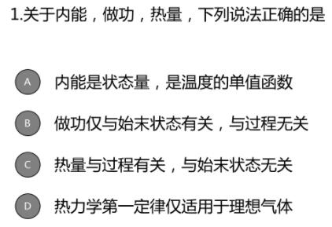

>  答案 : A

---------------

### 热力学第一定律的应用

$\mathrm{Q}=\Delta \mathrm{E}+\mathrm{W} \quad$ 解决实际过程中能量转换的问题
(1) 如果 $\Delta \mathrm{W}=0, \quad$ 则 $\mathrm{Q}=\Delta \mathrm{E}$
吸收的热量完全转换为内能，使内能增加

体积不变,做功$W$为$0$时

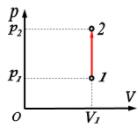

(2)如$\Delta E=0,$则$Q=W$
吸收的热量完全转化为对外做功

温度不变,内能增量为$0$时

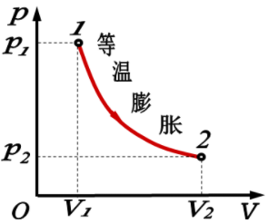

(3)如果$Q=0,$则$\Delta E=-W$
系统对外做功是以减少内能为代价的

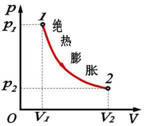

---------------

例题

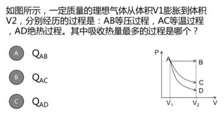

>  答案:A

---------------

例题

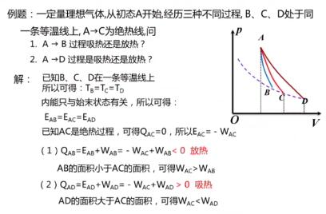

---------------

### 循环过程

热机 : 持续地将热量转变为功的机器

## 循环过程

### 循环

热力学系统经理一系列变化后有回到初始状态的整个过程

### 工质

循环工作的物质

>  循环所包含的每个过程叫做分过程
>  箭头表示过程进行的方向
>
>  如果该过程在$P-V$图中表示,则是准静态循环过程

## 循环过程的特点

### 内能$\Delta E$

系统经历一个循环之后,又回到最初的状态
$$
\Delta E = 0
$$

### 净功$W$

工质在整个循环过程中对外做的净功等于曲线所包围的面积

### 热量$Q$

由热力学第一定律
$$
Q=W
$$
净热量$Q=Q_1-|Q_2|=W$净功

>  总吸热 : $Q_1$
>  总放热 : $Q_2$
>  净热量 :$Q$

+  循环的方向

   +  正循环$\to$沿顺时针方向进行的循环(热机)
+  净功$W>0\quad$系统对外做正功
   +  逆循环$\to$沿逆时针方向进行的循环(致冷机)
      +  净功$W<0\quad$系统对外做正功

## 热机效率和致冷机的制冷系数

### 热机

## 致冷机

---------------

例题

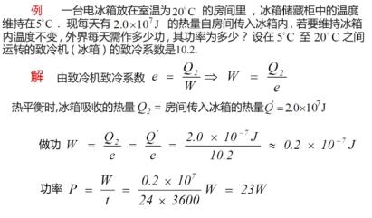

---------------

例题

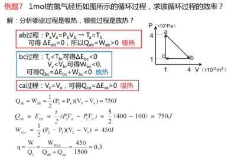

---------------

## 卡诺循环

# 热力学第二定律

## 热力学第二定律的两种表述

### 开尔文表述

---------------

例题

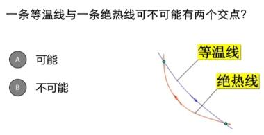

>  答案:B

---------------

### 克劳修斯表述

例题

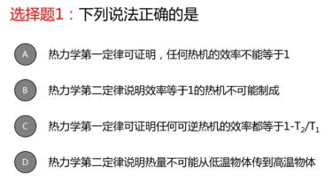

>  答案:B
>
>  +  C : ~~可逆热机~~ $\to$可逆卡诺热机

---------------

例题

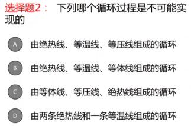

>  答案:D

## 自然过程的方向

### 可逆过程(理想过程)

反过程可以完全消除正过程所有的痕迹而不引起其他变化

### 不可逆过程(实际过程)

反过程不能消除正过程的所有痕迹而不引起其他变化

+  有且仅有准静态,无能量耗散的过程时可逆过程

例题

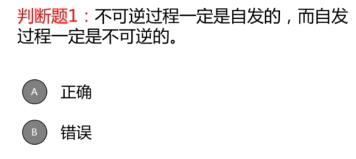

>  答案:B

-------------

例题

>  答案:B

## 热力学第二定律的实质与统计意义

孤立系统内部所发生的过程,总是由概率小(包含微观态数目少)的宏观太向概率大(包含微观态数目多)的宏观态方向进行的

自发进行的方向只和初末状态的概率有关

### 实质

自然界一切与热现象有关的实际宏观过程都是不可逆的

+  热功转换
+  热传导

### 统计意义

不可逆性是分子微观统计行为的表现

## 有序与无序

热力学第二定律从微观上解释自发过程的方向性

+  自然过程从热力学概率小向热力学概率大的方向进行
+  宏观上认为不可能出现的状态,在微观上认为是可能的,只不过是概率太小而已
+  热$II$定律是统计规律(与热$I$定律不同)

# 熵与熵增加原理

## 玻尔兹曼熵

$$
\Large S=k\ln \Omega
$$

>  $S$系统处于该宏观态时的熵
>  $k$玻尔兹曼常数
>  $\Omega$宏观态所含微观态的数目

+  熵的概念建立,使热力学第二定律得到统一的定量的表述
+  熵时鼓励系统的无序度的度量(平衡态熵最大)
   +  $\Omega越大,S越高,系统越无序$

## 克劳修斯熵(熵差)

### 熵的定义

热力学系统从初态 $A\left(S_{A}\right)$ 变化到末态 $B\left(S_{B}\right),$ 系统嫡的增量等于初态 $A$ 和末态 $B$ 之间任意一可逆过程热温比 $(\large\frac{dQ}{T})$ 的积分.

可逆过程: $\Large S_{B}-S_{A}=\int_{A}^{B} \frac{d Q}{T}$

无限小可逆过程: $\Large\mathrm{d} S=\frac{\mathrm{d} Q}{T}$

### 熵是状态函数

$$
\Large S_B-S_A=\int_{A}^{B}\frac{dQ}{T}
$$

>  $\large\int_{B}^{A}\frac{dQ}{T}$: 眼来凝结$A,B$两态的任意可逆过程的积分值与路径无关,仅由初末两态完全决定
>
>  熵是状态函数,是可逆过程中热温比的增量,与过程无关
>
>  与重力场类似 $\large\int _ {a} ^ {b} m g \mathrm{d} h= m g (h_a - h_b)$

+  熵的单位 $J/K$
+  熵是状态函数,系统处于一个平衡态,就对应有一个确定的熵值
+  两个确定的状态之间熵的变化是确定的,与经历的过程无关,只与两个状态有关
+  $S_B-S_A=\int_{A}^{B}\frac{dQ}{T}$只能适用于可逆过程
+  不可逆过程的熵变与热温比变量的关系

### 熵增加原理

#### 不可逆过程中的热温比

$\large\int_{\mathrm{ADB}} \frac{d Q}{T}>\int_{\mathrm{ACB}} \frac{d Q}{T}\\\quad可逆\qquad\quad不可逆$

$\large\left.\begin{array}{rl}
S_{B}-S_{A}= & \int_{A}^{B} \frac{d Q}{T} \\
& \text { 可逆 } \\
S_{B}-S_{A}> & \int_{A}^{B} \frac{d Q}{T}\\&\text{不可逆}
\end{array}\right\} S_{B}-S_{A} \geq \int_{A}^{B} \frac{d Q}{T}$

#### 熵增加原理

>  孤立系统中的熵永不减少

孤立系统或系统经历解热过程$dQ=0$

$\large S_B-S_A\ge \int_{A}^{B}\frac{dQ}{T}=0$

$\Delta S\ge 0\begin{aligned}\begin{cases}孤立系统不可逆过程\quad \Delta S&\ge 0\\孤立系统可逆过程\qquad\Delta S&=0\end{cases}\end{aligned}$

+  熵增加原理成立的条件 : 孤立系统或绝热过程

#### 热力学第二定律的熵表述

+  文字表述 : 在孤立系统内部发生的自然过程,都是朝着熵增加的方向进行
+  数学表述 : $\Delta S\ge 0$

>  熵表述断言:
>  自然过程发生的结果必然导致总熵增加,即自然过程具有单向性和不可逆性

---------------

例题

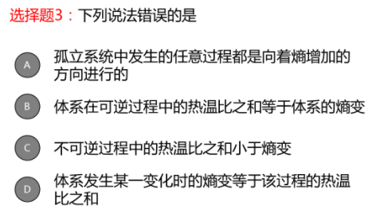

>  答案:A&D
>  A:孤立系统中的任意自发过程都是向着熵增加的方向进行的

---------------

例题

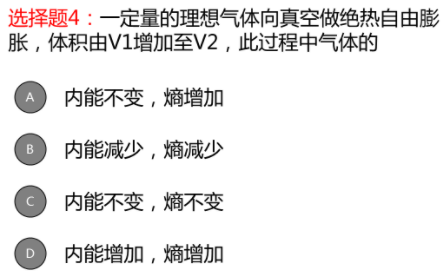

>  答案 : D
>  自发过程(实际过程)$\to\Delta S>0$
>  绝热过程$Q=\Delta E +W,\Delta Q=0,自由膨胀\to W=0\therefore W=0$

---------------

#### *熵与能量

熵增加=能量退化
能量贬值$\to$相同的能量可做的功减少

#### *负熵

麦克斯韦虚构了一个分为两部分的容器，由一个能 观察所有分子速度的小精灵（麦克斯韦妖）控制一个无摩擦的闸门。如果有高速分子由A飞向B或低速分子由B飞向A就打开闸门放行：反之闸门关闭。这样，A侧就越来越冷，而B侧越来越热，系统的熵降低了。

麦克斯韦妖的本质是，利用外界干预系统，这 相当于将负熵输入系统，这是系统的嫡减小的原因
负
$$
\left|-S=k \ln \frac{1}{\Omega}\right|
$$

>  $\frac{1}{\Omega}$ 有序度

信息论： 负嫡是信息量多寡的量度.

### 例题

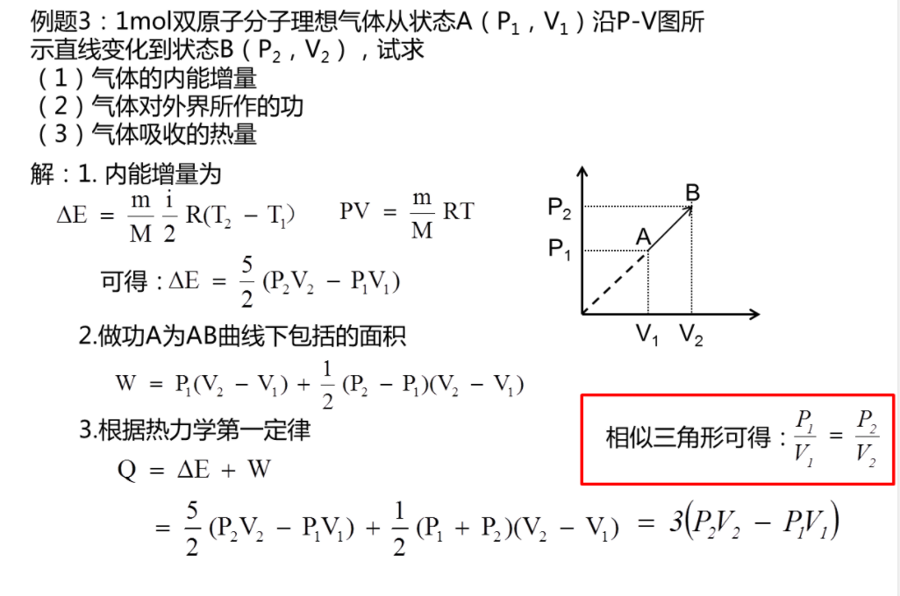

---------------

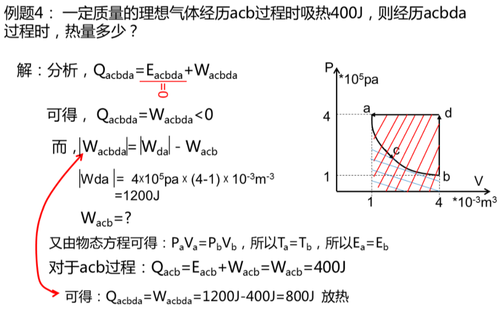

----------------

# 热力学基础习题

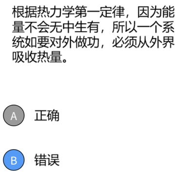

>  答案:B
>  一个系统对外做功,可能吸收外界热量,也可能是吸收东嗯那个,也可能是降低自己本身的能量

-----------------

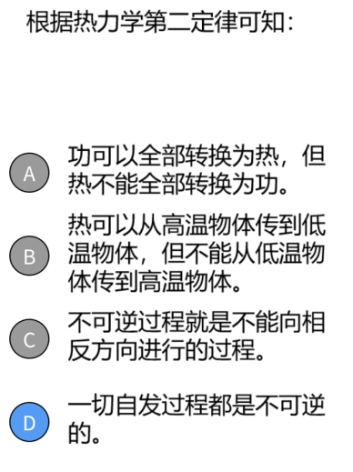

>  答案 : D
>  一切自发过程都是不可逆的是热力学的另一种表述

---------------------

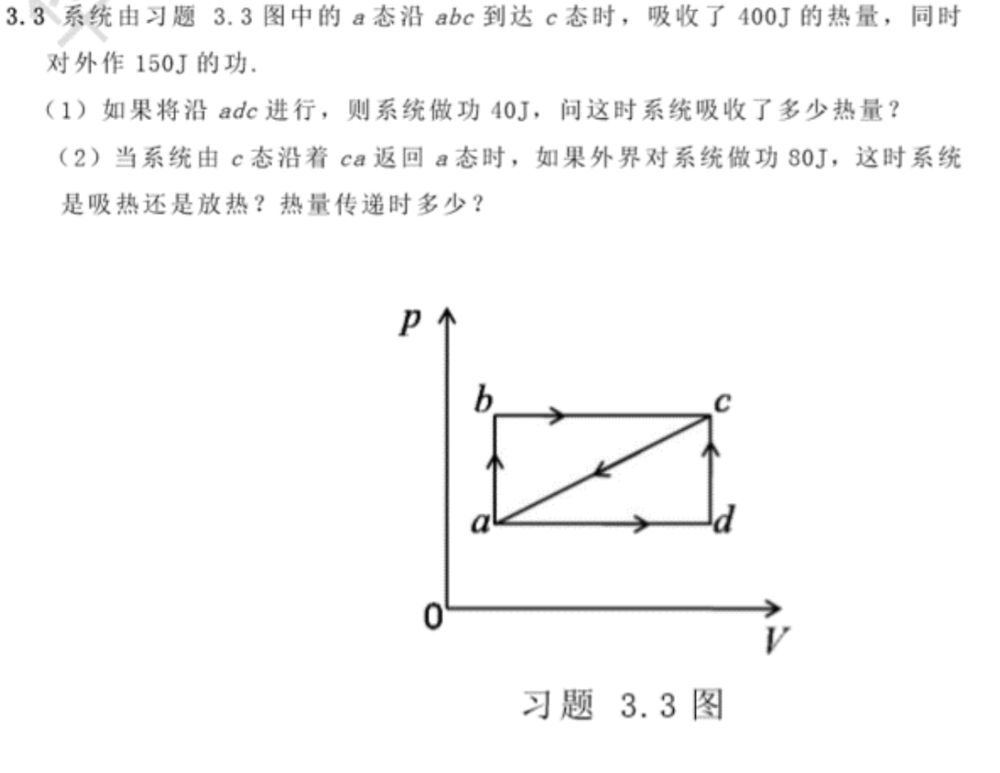

>  $\Delta E=\Delta PV+\Delta Q$

$$
\begin{aligned}
(1)\Delta E &= \Delta PV+\Delta Q\\
&=-150J+400J\\
&=250J\\
\Delta Q&=\Delta E-\Delta PV\\
&=250J-40J\\
&=210J\\
\therefore系统&吸收热量210J\\
(2)\Delta E' &= - \Delta E\\
&=-250J\\
\Delta Q'&=\Delta E' -\Delta PV'\\
&=-250J-80J\\
&=-330J\\
\therefore对外&放热330J
\end{aligned}
$$
--------------

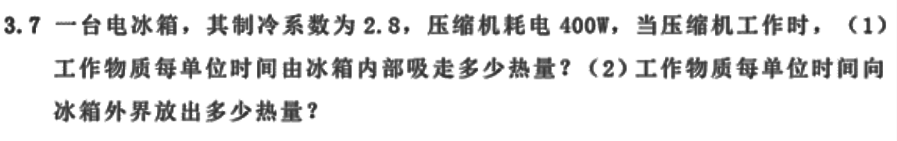

>  $e=\frac{Q_2}{|W|}=\frac{Q_2}{Q_1-Q_2}$
>  $Q_2$ : 吸收的热量
>  $W$ : 输入功

解 : 
$$
\begin{aligned}
(1)Q_2 &= e\times |W|\\
&=400W\times2.8\\
&=1120J\\
(2)e&=\frac{Q_2}{Q_1-Q_2}\\
\therefore Q_1&=\frac{Q_2}{e}+Q_2\\
&=\frac{1120J}{2.8}+1120J\\
&=1520J
\end{aligned}
$$

