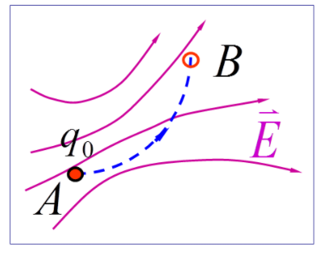

# 电磁场

>  矢量点乘
>  $\vec{A}\cdot\vec{B}=AB\cos{\theta}$

>  矢量叉乘
>  $\vec{A}=(A_1,A_2,A_3),\vec{B}=(B_1,B_2,B_3)\\\vec{A}\times\vec{B}=(A_2B_3+A_3B_2,A_3B_1+A_1B_3,A_1B_2+A_2B_1)$

## 静电场的产生

静电场 : 相对于观察者静止的电荷产生的电场

## 电荷

### 种类

自然界中子存在正,负两种电荷

### 性质

同种相斥,异种相吸

### 度量

电荷量(带电体所带电荷的多少)
符号:$Q,q$
单位

## 电荷的量子化

电荷量总是以一个基本单元的整数倍出现
$$
\large Q=ne(n=1,2,3,\dots)
e=(1.6021892\pm0.0000046)\times10^{-19}
$$

# 库仑定律

## 点电荷

+  带有一定电量的点
   +  当带电体的线度远远小于它与其他带电体之间的距离$d\ll r$带电体可以看作点电荷

## 库仑定律

$$
\Large\overline{F_{21}}=K\frac{q_1q_2}{r^2}\hat{r}_{21}\\
K=\frac{q}{4\pi\varepsilon_0}\quad\varepsilon_0=8.85\times10^{-12}c^2N^{-1}m^{-2}
$$

### 库伦定律与万有引力定律

$$
\begin{array}{l}
F=G \frac{M_{1} M_{2}}{R^{2}} \\
\left|\bar{F}_{21}\right|=K \frac{q_{1} q_{2}}{r^{2}} \\
F_{\text {引 }}=3.63 \times 10^{-47} \mathrm{~N} \\
F_{\text {电 }}=8.22 \times 10^{-8} \mathrm{~N}
\end{array}\\
\frac{\mathrm{F}_{\text {电 }}}{F_{\text {引 }}}=2.26 \times 10^{39}
$$

>  原子核内质子之间的静电排斥力通过强相互作用力平衡

## 静电力的叠加原理

当空间中有两个以上的点电荷时,作用在某一点电荷的总静电力,等于其他各点电荷单独存在时对该点电荷所施静待能力的矢量和

$$
\Large\vec{F}_{0}=\sum_{i}^{N} \frac{1}{4 \pi \varepsilon_{0}} \frac{q_{0} q_{i}}{r_{0 i}} \hat{r}_{0 i}
$$

# 电场

##　物质的种类

**粒子 :** 电子/质子/中子/光子

**场 :** 电场/磁场/引力场

相同处 : 具有动量/能量
不同处 : 场无具体形态,但可迭代

## 基本性质

+  力学性质 : 电场对处于其中过的电荷有力的作用
+  能量性质 : 电荷在电场中移动,电场力将对其做功

**电场** : 电荷周围空间具有特殊形态和物理性质的物质

# 电场强度

**实验证明 : **

+  置于电场中某点的试验电荷将受到**源电荷$q$**作用的**电场力**
+  **力的大小**与试验电荷的电量成**正比**，而该力与试验电荷电量的**比值**则**与试验电荷无关**，是一个**仅由源电荷产生的电场**决定的物理量
+  用这个物理量作为描写电场的场量，称为**电场强度**(简称**场强**)，其定义为：

$$
\vec{E}=\frac{\vec{F}}{q_0}\begin{cases}大小:E=\frac{F}{q_0}\\方向:正电荷在该点\vec{F}方向一致\end{cases}
$$

>  **注意:**
>
>  +  电场强度与试验电荷无关，只与该点处的电场性质有关
>  +  电场中某点的电场强度在大小和方向上都等于单位正电荷在此处所受到的电场力
>  +  电场强度的单位 :  $\quad \mathrm{N} \cdot \mathrm{C}^{-1} \quad \mathrm{~V} \cdot \mathrm{m}^{-1}$
>  +  电荷q在电场中受电场力 $\quad \vec{F}=q \vec{E}$

例题:

>  +  以$q$为球心的球面上场强大小相同
>  +  距离增大,场强减小(平方反比定律)
>  +  沿着半径方向,垂直于球面

例题 : 

>  答案:D 

# 场叠加原理

## 点电荷系电场中某点的场强

$$
\large\begin{aligned}
\vec{E} &=\frac{\vec{F}}{q_{0}}=\frac{\vec{F_{1}}+\vec{F_{2}}+\vec{F_{3}}}{q_{0}} \\
&=\vec{E_{1}}+\vec{E_{2}}+\vec{E_{3}} \quad \\\therefore\vec{E}_{i}&=\frac{1}{4 \pi \varepsilon_{0}} \frac{q_{i}}{r_{i}^{2}} \hat{r}_{i} \\
\vec{E} &=\frac{1}{4 \pi \varepsilon_{0}} \frac{q_{1}}{r_{1}^{2}} \hat{r}_{1}+\frac{1}{4 \pi \varepsilon_{0}} \frac{q_{2}}{r_{2}^{2}} \hat{r}_{2}+\cdots=\sum \frac{1}{4 \pi \varepsilon_{0}} \frac{q_{i}}{r_{i}^{2}} \hat{r}_{i}
\end{aligned}
$$
**场叠加原理** : 点电荷系电场中某点的场强等于各个点电荷单独存在时该点场强的矢量和

## 带电体

将带电体分成无限多个点电荷元,若任意一个电荷元的场强为$d\vec{E}$
$$
\Large d \vec{E}=\frac{d q}{4 \pi \varepsilon_{0} r^{2}} \hat{r} \qquad \vec{E}=\int d \vec{E}=\int \frac{d q}{4 \pi \varepsilon_{0} r^{2}} \hat{r}
$$

### 电荷连续均匀分布情况

例题 : 

# 电场线

+  曲线上每一点切线方向为该点电场方向
+  通过垂直于电场方向单位面积电场线数为该点电场强度的大小$\large E=\frac{\Delta N}{\Delta S}$

## 电场线特性

+  始于正电荷,止于负电荷(或来自无穷远,去向无穷远)
+  电场线不相交
+  静电场电场线不闭合

# 高斯定理

##　场的特性

### 场的分类

+  有源场
+  无源场

### 源激发场的能力

+  电通量

## 电通量

### 定义

通过电场中某一个**有向曲面**的电场线条数用$\Phi_E$表示

### 电通量计算公式

**①匀强电场**$\vec{S} \parallel \vec{E}$

$\vec{S}\begin{cases}大小为曲面的面积\\方向为曲面的法线方向\end{cases}$
$$
\large\Phi_E=ES
$$

**②匀强电场**$\vec{E}与\vec{S}$的夹角为$\theta$

$$
\large\Phi_E=ES\cos{\theta}=\vec{E}\cdot\vec{S}
$$
**③非匀强电场**

$$
\large\Phi_E=\int d\Phi_E=\int\vec{E}\cdot d\vec{S}=\int_s E\cos{\theta}dS
$$
**④闭合曲面**

$$
\theta_1< \frac{\pi}{2},d\Phi_{e1}>0\\
\theta_2>\frac{\pi}{2},d\Phi_{e2}<0\\
d\Phi_e=d\Phi_{e1}+d\Phi_{e2}=\vec{E}\cdot d\vec{S}\\
\Phi_{\mathrm{e}}=\oint_{S} \vec{E} \cdot \mathrm{d} \vec{S}=\oint_{S} E \cos \theta \mathrm{d} S
$$

--------

$$
\large\begin{aligned}
\quad \Phi_{\mathrm{e}}&=\Phi_{\text {e前 }}+\Phi_{\text {e后 }}+\Phi_{\mathrm{e} \text { 左 }}+\Phi_{\mathrm{e} \text { 右 }}+\Phi_{\mathrm{e}}\\
\Phi_{\text {e前 }} &=\Phi_{\text {e后 }}=\Phi_{\mathrm{e} 下}=\int_{S} \vec{E} \cdot \mathrm{d} \vec{S}=0\\
\Phi_{\mathrm{e} 左}&=\int_{S 左} \vec{E} \cdot \mathrm{d} \vec{S}=E S_{\text {左 }} \cos \pi=-E S_{\text {左 }}\\
\Phi_{\mathrm{e} 右}&=\int_{S_{右}} \vec{E} \cdot \mathrm{d} \vec{S}=E S_{\text {右 }} \cos \theta=E S_{\text {左 }}\\
\Phi_{\mathrm{e}}&=\Phi_{\mathrm{e}}+\Phi_{\mathrm{e} \text { 后 }}+\Phi_{\mathrm{e} 左}+\Phi_{\mathrm{e} \text { 右 }}+\Phi_{\mathrm{e} 下}=0
\end{aligned}
$$

------------

## 高斯定理

### 单个点电荷q的电通量

#### +q位于球面的中心

$$
\large\Phi_E=\oint_S\vec{E}\cdot \vec{S}=\frac{q}{\varepsilon_0}
$$

#### +q位于任意闭合曲面以内

$$
\large\Phi_E=\oint_S\vec{E}\cdot \vec{S}=\frac{q}{\varepsilon_0}
$$

>  穿出曲面  $S^{\prime}$  的电场线 一定穿出曲面 $ \boldsymbol{S}$ 

#### +q位于任意闭合曲面以外

$$
\large\Phi_{E}=\oint_{S} \vec{E} \cdot d \vec{S}=0
$$

>穿入曲面$S$的电场线 一定穿出$S$

### 多个点电荷q的电通量

$$
\large\begin{aligned}
\vec{E}&=\vec{E}_{1}+\vec{E}_{2}+\cdots\Phi_{\mathrm{e}}\\
&=\oint_{S} \vec{E} \cdot \mathrm{d} \vec{S}\\
&=\oint_{S} \sum_{i} \vec{E}_{i} \cdot \mathrm{d} \vec{S}\\
&=\sum_{i(\text { 内 })} \oint_{S} \vec{E}_{i} \cdot \mathrm{d} \vec{S}+\sum_{i(\text { 外 })} \oint_{S} \vec{E}_{i} \cdot \mathrm{d} \vec{S}\therefore \Phi_{\mathrm{e}}\\
&=\sum_{i \text { (内 })} \oint_{S} \vec{E}_{i} \cdot \mathrm{d} \vec{S}\\
&=\frac{1}{\varepsilon_{0}} \sum_{i(\text { 内 })} q_{i}
\end{aligned}
$$

## 高斯定理

$$
\Phi_{\mathrm{e}}=\oint_{S} \vec{E} \cdot \mathrm{d} \vec{S}=\frac{1}{\varepsilon_{0}} \sum_{i(S 内)} q_{i}
$$

**在真空的静电场内，通过任一闭合曲面电通量，等于该<u>闭合曲面</u>[^注]所包围的电荷代数和的$\Large\frac{1}{\varepsilon_{0}}$倍。**

若 $ \sum q_{i}>0\quad \Phi_{E}>0  $有净电场线从闭合面内发出
若$  \sum q_{i}<0 \quad\Phi_{E}<0  $有净电场线到闭合面内终止
**静电场是有源场(从正电荷发出，终止于负电荷)**

## 总结

+ 高斯面为封闭曲面。
+ 高斯面上的电场强度为所有内外电荷的总电场强度。
+ 通过高斯面的电通量只与闭合面内的电荷量有关。
+ 穿出高斯面的电场强度通量为正，穿进为负。
+ 当电场分布具有对称性时，可以用高斯定理求场强分布。

[^注]: 高斯面

### 例题

>  答案 : $A$
>
>  $\Large E=\frac{1}{4\pi\varepsilon}\frac{q}{r^2}$ ; $r$改变,$E$改变
>
>  高斯面是封闭曲面,$\large\Phi_{E}=\oint_{S} \vec{E} \cdot d \vec{S}=0$
>  移动q , $\Large\Phi_E$仍等于$0$(穿入曲面$S$的电场线 一定穿出$S$) ; 

-------------------

>  答案 : D [见总结](#sum)

------------

>  答案 : B [见总结](#sum)

>  答案 : D [高斯定理](#高斯定理)

## 均匀带电球壳的电场强度

###  1.$r<R$

$$
\large\begin{array}{l}
\begin{cases}\Phi_{E}=\oint_{S_{2}} \vec{E} \cdot \mathrm{d} \vec{S}=E \oint_{S} d S=E 4 \pi r^{2} \\
\sum_{S(内)} q_{i}=\frac{q}{\frac{4}{3} \pi R^{3}} \frac{4}{3} \pi r^{3} 
\end{cases}\\
\Rightarrow E 4 \pi r^{2}=\frac{1}{\varepsilon_{0}} \frac{q r^{3}}{R^{3}}
\end{array}\\
\\
\Large E=\frac{q r}{4 \pi \varepsilon_{0} R^{3}}
$$

### 2.$r>R$

$$
\large\begin{aligned}
&\left\{\begin{array}{l}
\Phi_{E}=\oint_{S_{2}} \vec{E} \cdot \mathrm{d} \vec{S}=E \oint_{S} d S=E 4 \pi r^{2} \\
\sum_{\mathrm{s}(A)} q_{i}=q \\
\end{array}\right.\\
&\Rightarrow E 4 \pi r^{2}=q / \varepsilon_{0}
\end{aligned}\\
\\
\Large E=\frac{q}{4 \pi \varepsilon_{0} r^{2}}
$$

### 均匀带电球壳的电场强度分布曲线

$$
\large\text { 场强E }\left\{\begin{array}{ll}
r<R & \frac{q r}{4 \pi \varepsilon_{0} R^{3}} \\
r>R & \frac{q}{4 \pi \varepsilon_{n} r^{2}}
\end{array}\right.
$$

## 无限长均匀带电直线的电场强度

无限长均匀带点直线,单位长度上的电荷,即电荷线密度为$\lambda$,求距直线$r$处的电场强度

$$
对称性分析:轴对称\\
选取闭合的柱形高斯面\\
\begin{aligned}
 \oint_{S} \vec{E}\cdot d\vec{S}&=
\int_{s(柱面)}\vec{E}\cdot d\vec{S}+\int_{s(下底)}\vec{E}\cdot d\vec{S}\\
&=\int_{s(柱面)}\vec{E}\cdot d\vec{S}\\
&\left\{\begin{array}{l}
\oint_{S} \vec{E} \cdot \mathrm{d} \vec{S}=\int_{s(柱面)} E \mathrm{~d} S \\
\frac{1}{\varepsilon_{0}} \sum_{S(\text {内})} q_{i}=\frac{\lambda h}{\varepsilon_{0}}
\end{array}\right.\\
&\Rightarrow 2 \pi r h E=\frac{\lambda h}{\varepsilon_{0}}\\
E&=\frac{\lambda}{2\pi\varepsilon_0r}
\end{aligned}
$$

## 无限大均匀带电平面的电场强度

无限大均匀带电平面单位面积上的电荷面密度为$\sigma$,求距平面$r$处的电场强度
$$
对称性分析:\vec{E}垂直平面\\
选取闭合的柱形高斯面\\
\begin{aligned}
\oint_s\vec{E}\cdot d\vec{S}\\
2S'E=\frac{\sigma S'}{\varepsilon_0}\\
E=\frac{\sigma}{2\varepsilon_0}
\end{aligned}
$$

## 总结

**解题步骤**

+  电荷和场强的对称性分析

+  选取合适的高斯面

   +  高斯面必须是闭合曲面

   +  高斯面必须通过所求的点

   +  高斯面的选取使通过该面的电通量易于计算

      >  电场强度相等,且方向与n平行或一部分满足上述条件,一部分的场强与n垂直

+  计算$\Phi=\oint\vec{E}\cdot\vec{S}=\frac{1}{\varepsilon_0}\sum_{S(内)q_i}$等式两边
+  运用高斯定理求电场强度分布

**典型的对称性**

+  球:点电荷/带点球体或球面/同心球面等
+  轴: 无限长带电线/圆柱面或圆柱/同轴圆柱面等
+  面:无限大带电平面或平板/若干平行平面等

# 静电场的环路定理

>  电场的基本性质
>  力学性质:电场对处于其中的电荷由有力的作用
>  能量性质:电荷在电场中移动,电场力将对其做功

## 静电场做功的特点

+  点电荷$q$的电场

$$
\large\begin{array}{l}
d A=\vec{F} \cdot d \vec{l}=q_{0} E \cos \theta d l \\
\quad=q_{0} E d r=q_{0} \frac{q}{4 \pi \varepsilon_{0} r^{2}} d r \\
A=\int_{A}^{B} q_{0} E d r=\int_{r_{A}}^{r_{B}} q_{0} \frac{q}{4 \pi \varepsilon_{0} r^{2}} d r \\
=\frac{q q_{0}}{4 \pi \varepsilon_{0}}\left(\frac{1}{r_{A}}-\frac{1}{r_{B}}\right) 
\end{array}
$$

+  任意电荷的电场(视为点电荷组)

$$
\large\begin{aligned}
A_{a b} &=\int_{a(L)}^{b} \vec{F} \cdot \mathrm{d} \vec{l}=\int_{a(L)}^{b} q_{0} \vec{E} \cdot \mathrm{d} \vec{l} \\
&=\int_{a(L)}^{b} q_{0}\left(\sum_{i=1}^{n} \vec{E}_{i}\right) \cdot \mathrm{d} \vec{l} \\
&=\sum_{i=1}^{n} \int_{a(L)}^{b} q_{0} \vec{E}_{i} \cdot \mathrm{d} \vec{l}
\end{aligned}
$$

>  结论:静电场力做功只与始末位置有关,静电场力为保守力,静电场为保守场

## 静电场的环路定理

在静电场中,沿闭合路径移动$q_0$,电场力做功

$$
\large\begin{aligned}
A &=\oint \vec{F} \cdot d \vec{l}=\oint q_{0} \vec{E} \cdot d \vec{l} \\
&=\int_{a\left(L_{1}\right)}^{b} q_{0} \vec{E} \cdot \mathrm{d} \vec{l}+\int_{b\left(L_{2}\right)}^{a} q_{0} \vec{E} \cdot \mathrm{d} \vec{l} \\
&=\int_{a\left(L_{1}\right)}^{b} q_{0} \vec{E} \cdot \mathrm{d} \vec{l}-\int_{a\left(L_{2}\right)}^{b} q_{0} \vec{E} \cdot \mathrm{d} \vec{l} \\
&=0\\
\quad\\
\oint \vec{E}\cdot d\vec{l}&=0\qquad\to保守场
\end{aligned}
$$
**静电场的环路定理:**
静电场电场强度沿任一闭合曲线的线积分等于零

# 电势

## 电势能

电荷在电场中具有的与位置有关的能

### 定义

$$
\large A_{a b}=q_{0} \int_{a}^{b} \vec{E} \cdot d \vec{l}=W_{a}-W_{b}=-\Delta W_{p}
$$

+  当静电场力做正功,电势能减少
   当静电场做负功,电势能增加

+  电势能只具有相对意义,通常取无穷远处为电势能的零点. 
   则电荷在电场中某点$a$的电势能为:
   $$
   W_a=W_a-W_{\infin}=A_{a\infin}=\int_{a}^{\infin}q_0\vec{E}\cdot d\vec{l}
   $$
   
+  电势能为电荷与电场所共有,是系统能量

   由$W_a=q_0\int_{a}^{\infin}\vec{E}\cdot d\vec{l}\quad$可知:
   $$
   \large\frac{W_0}{q_0}=\int_{a}^{\infin}\vec{E}\cdot d\vec{l}
   $$
   与$q_0$无关,只决定该点电场的性质

## 电势

$$
\large\begin{align}
\int_{A}^{B} q_{0} \vec{E} \cdot d \vec{l} & = W_{p A}-W_{p B} \\
\int_{A}^{B} \vec{E} \cdot d \vec{l} & = \frac{W_{p A}}{q_{0}}-\frac{W_{p B}}{q_{0}}\\
A点电势:U_A&=\frac{W_{pA}}{q_0}\qquad U_B=\frac{W_{pB}}{q_0}\\
U_A=\int_{A}^{B}\vec{E}\cdot d\vec{l}&+U_B(U_B为参考电势,任赋值)\\
令U_B=0\quad U_A&=\int_{A}^{B}\vec{E}\cdot d\vec{l}\\
U_{A}&=\int_{A}^{U=0 \text { 点 }} \vec{E} \cdot \mathrm{d} \vec{l}
\end{align}
$$

+  **电势零点选择方法:**有限带电体以无穷远为电势零点,实际问题中常选择地球为电势零点
   $$
   U_A=\int_{A}^{\infin}\vec{E}\cdot d\vec{l}
   $$

+  **物理意义:**把单位正实验电荷从$A$点移到无穷远处时,静电场所做的功

+  **电势差:**$U_{AB}=U_A-U_B=\int_{A}^{B}\vec{E}\cdot d\vec{l}$

   >  将单位正电荷从$A$移到$B$电场力做的功
   >
   >  **注意:**电势差是绝对的,与电势零点的选择有关
   >  		 电势大小是绝对的,与电势零点的选择有关

+  **静电场力的功:**$W_{A B}=q_{0} U_{A}-q_{0} U_{B}=q_{0} U_{A B}$

+  **电势单位:**$(V)$伏特   

   ​				 原子物理中能量单位$1eV=1.602\times10^{-19}J$

+  **电势是标量**,有正负之分,无方向.

-----

选择题1

>  答案:D

---

>  答案:A

---

>  答案:C

## 点电荷的电势

$$
\large\begin{aligned}
E&=\frac{q}{4 \pi \varepsilon_{0} r^{2}} \quad \text { 令 } V_{\infty}=0 \\
U&=\int_{r}^{\infty} \vec{E} \cdot \mathrm{d} \vec{l}=\int_{r}^{\infty} E d r \\
&=\int_{r}^{\infty} \frac{q \mathrm{~d} r}{4 \pi \varepsilon_{0} r^{2}}\\
\quad\\
\Large U&=\frac{q}{4\pi \varepsilon_0 r}\qquad\begin{cases}q>0,U>0\\q<0,U<0\end{cases}
\end{aligned}
$$

## 电势的叠加原理

+  点电荷系

$$
\begin{aligned}
\vec{E}&=\sum_{i} \vec{E}_{i} \\
U_{A}&=\int_{A}^{\infty} \vec{E} \cdot \mathrm{d} \vec{l}\\
&=\sum_{i} \int_{A}^{\infty} \vec{E}_{i} \cdot \mathrm{d} \vec{l}\\
U_{A}&=\sum_{i} U_{A i}=\sum_{i} \frac{q_{i}}{4 \pi \varepsilon_{0} r_{i}}
\end{aligned}
$$

+  电荷连续分布

$$
U_{A}=\int \frac{\mathrm{d} q}{4 \pi \varepsilon_{0} r}
$$

----

### 均匀带电球壳的电势

$$
\begin{aligned}
&真空中，有一带电为  Q , 半径为  R  的带电球壳. \\&试求 \\&(1) 球壳外两点间的电势差; \\&(2) 球壳内两点 间的电势差; \\&(3) 球壳外任意点的电势; \\&(4) 球壳 内任意点的电势.
\end{aligned}\\
\begin{aligned}
\left\{\begin{array}{l}
&r<R, \quad \bar{E}_{1}=0 \\
&r>R, \quad \vec{E}_{2}=\frac{q}{4 \pi \varepsilon_{0} r^{2}} \vec{e}_{r}
\end{array}\right.\\
\begin{aligned}(1)
U_{A}-U_{B}&=\int_{r_{A}}^{r_{B}} \vec{E}_{2} \cdot \mathrm{d} \vec{r} \\
&=\frac{Q}{4 \pi \varepsilon_{0}} \int_{r_{A}}^{r_{B}} \frac{\mathrm{d} r}{r^{2}}\\&=\frac{Q}{4 \pi \varepsilon_{0}}\left(\frac{1}{r_{A}}-\frac{1}{r_{B}}\right)\\
(2)  r&<R\\ 
 U_{A}-U_{B}&=\int_{r_{A}}^{r_{B}} \vec{E}_{1} \cdot \mathrm{d} \vec{r}=0 
\\(3)r&>R\\

\text { 令 } r_{B} &\rightarrow \infty, \quad U_{\infty}=0 \\
U_{\text {外 }}(r)&=\int_{r}^{\infty} \vec{E}_{2} \cdot \mathrm{d} \vec{r}\\&=\int_{r}^{\infty} \frac{Q}{4 \pi \varepsilon_{0} r^{2}} \mathrm{~d} r\\&=\frac{Q}{4 \pi \varepsilon_{0} r}
\\
\text { (4) }  r&<R \\
U_{\text {内 }}(r) &=\int_{r}^{\infty} \vec{E} \cdot \mathrm{d} \vec{r}\\&=\int_{r}^{R} \vec{E}_{1} \cdot \mathrm{d} \vec{r}+\int_{R}^{\infty} \vec{E}_{2} \cdot \mathrm{d} \vec{r} \\
&=\frac{Q}{4 \pi \varepsilon_{0} R}\\
&\begin{cases}
U_{\text {外 }}(r)=\frac{Q}{4 \pi \varepsilon_{0} r} \\
U_{\text {内 }}(r)=\frac{Q}{4 \pi \varepsilon_{0} R}
\end{cases}
\end{aligned}\\ 
\end{aligned}
$$

# 静电场中的导体

**导体:**内部有大量可自由移动的自由电子的物体

## 静电感应静电平衡条件

当把金属导体放入场强为$E  _{0}  $的静电场 中后，金属导体中的自由电子在外电 场的作用下作定向运动。由静电感应 现象所产生的电荷称为**感应电荷**。

### 静电平衡条件

+  导体内部任何一点处的电场强度为零
+  导体表面处的电场强度的方向,都与导体表面垂直
   +  导体内部电势相等  
      +  $U_{A B}=\int_{A B} \vec{E} \cdot \mathrm{d} \vec{l}=0 $
   +  导体表面电势相等 
      +   $\because \vec{E} \perp \mathrm{d} \vec{l} $
      +   $\therefore \Delta U=\vec{E} \cdot \mathrm{d} \vec{l}=0 $
   +  导体内外电势相等
      $ U_{A}=U_{B}=\int_{B}^{\infty} \vec{E} \cdot d \vec{l} $

+  导体表面电场强度与电荷面密度的关系

   +  $\begin{array}{l}
      \oint_{S} \vec{E} \cdot \mathrm{d} \vec{S}=\frac{\sigma \Delta S}{\varepsilon_{0}} \\
      E \Delta S=\frac{\sigma \Delta S}{\varepsilon_{0}}
      \end{array}\\E=\frac{\sigma}{\varepsilon_0}$

   +  >  $\sigma$为表面电荷面密度
      >
      >  表面电场强度与改表面电荷面密度称正比

   +  $E=\frac{\sigma}{\varepsilon_0}\longrightarrow\sigma\downarrow,E\downarrow;\sigma\uparrow,E\uparrow$

   +  **注意: **导体表面电荷密度与导体形状以及周围环境有关

# 静电屏蔽

## 屏蔽外电场

空腔导体可以屏蔽外电场,使空腔内物体不受外电场影响.这是,整个空腔导体和腔内的电势也必处处相等

## 屏蔽内电场

接地空腔导体将使外部空间不受空腔内的电场影响

接地导体电势为零

>  答案:D

# 静电场中的电介质

## 电介质对电场的影响

电介质(绝缘体):电阻率大,不易导电的物质

## 电介质的极化

电场中的电介质表面出现正负电荷的现象