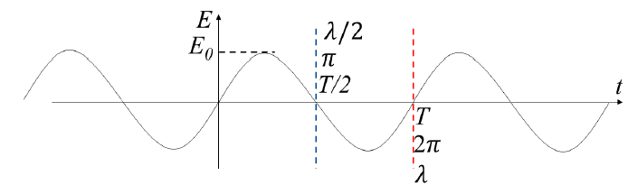
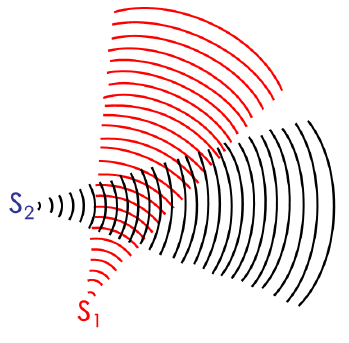
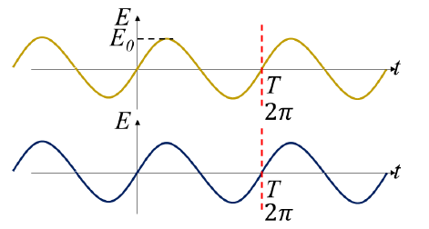
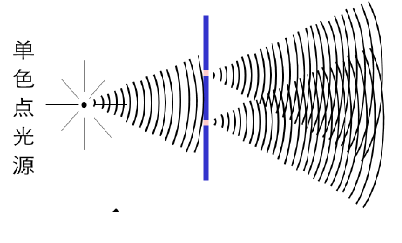
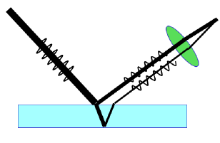
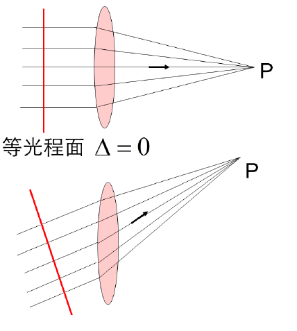

# 光的波动性

## 光的分类

### 几何光学

+  以光的直线传播为基础，研究光的成像问题。（反射、折射）

### 物理光学

+  波动光学：以光的波动性为基础，研究光的传播。（干涉、衍射、偏振）
+  量子光学：以光的粒子性为基础，研究光的发射以及物质相互作用。（波粒二象性）

### 现代光学

+  激光光学、全息光学、非线性光学、付里叶光学、光信息、光通讯等

# 主要内容

## 1.光的干涉

+  相干条件光程
+  分波阵面干涉
+  分振幅干涉：等倾干涉等厚干涉

## 2.光的衍射

+  夫琅禾费单缝衍射
+  光栅衍射
+  光学仪器分辨率一圆孔衍射

## 3.光的偏振

+  自然光和偏振光
+  起偏和检偏

# Sect1光的电磁理论

1.光波是电磁波

2.$\vec{E},\vec{H}$应都在各自的平面内振动

3.光效应是电矢量的作用，讨论光现象只考虑电矢量的变化情况，电矢量称为光矢量
$$
光矢量振动方程\qquad E=E_0cos{(\omega t+ \varphi_0)}
$$

>   $E_0:$振幅
>
>   $\omega:$角频率$\frac{22\pi}{T}$
>
>   $\varphi_0:$初始相位

## 光的独立传播原理

光在传播过程中，方向和性质不受其它光波影响，各束光的相互重叠并不影响各自的传播特性。

## 光的迭加原理
当几束光同时照射到某点，该点的光强度由各束光独立在该点光矢量$E$的矢量和所决定。
$$
\vec{E}=\vec{E_1}+\vec{E_2}
$$
条纹明暗通过振动加强还是减弱判断，即由两个振动的相位之差决定。
$$
\begin{aligned}
&E_{1}=E_{0} \cos \left(\omega t+\varphi_{1}\right) \\
&E_{2}=E_{0} \cos \left(\omega t+\varphi_{2}\right)
\end{aligned}
$$

$$
\Delta \varphi=\left\{\begin{array}{l}
0,2 \pi, 4 \pi, 6 \pi \ldots \pm 2 k \pi(k=0,1,2 \ldots) \quad \ \qquad\ \text { 加强 } \\
\pi, 3 \pi, 5 \pi \ldots  \quad\  \pm(2 k+1) \pi(k=0,1,2 \ldots) \quad\text { 减弱 }
\end{array}\right.
$$

# 光的干涉

干涉：两列或以上的光波在相遇区域出现稳定的明暗分布的现象。

## 相干条件

空间相干
时间相干

+   振动方向相同
+   频率相同
+   相位差恒定

$\small\Delta \varphi=\left\{\begin{array}{l}
0,2 \pi, 4 \pi, 6 \pi \ldots \pm 2 k \pi(k=0,1,2 \ldots) \quad \ \qquad\ \text { 加强 } \\
\pi, 3 \pi, 5 \pi \ldots  \quad\  \pm(2 k+1) \pi(k=0,1,2 \ldots) \quad\text { 减弱 }
\end{array}\right.$

满足相干条件的光称为**相干光**，光源称为**相干光源**

## 光程与光程差

$$
E_{\text {初 }}=E_{0} \cos \left(\omega t+\varphi_{0}\right)\\
\begin{aligned}
E_{1} &=E_{0} \cos \left(\omega t+\omega \frac{r_{1}}{v_{1}}+\phi_{0}\right) \\
E_{2} &=E_{0} \cos \left(\omega t+\omega \frac{r_{2}}{v_{2}}+\phi_{0}\right)
\end{aligned}
$$

相干光的相位差:
$$
\Delta \varphi=\omega\left(\frac{r_{1}}{v_{1}}-\frac{r_{2}}{v_{2}}\right)=\frac{\omega}{c}\left(n_{1} r_{1}-n_{2} r_{2}\right)=\frac{2 \pi}{\lambda}\left(n_{1} r_{1}-n_{2} r_{2}\right)
$$

>   $n_{1} r_{1}-n_{2} r_{2}$ : 光程差
>
>   $介质中光的速率 \large v=\frac{c}{n}
>   v_{1}=\frac{c}{n_{1}}, v_{2}=\frac{c}{n_{2}}
>   $

$$
\Delta \varphi=\frac{2 \pi}{\lambda}\left(n_{1} r_{1}-n_{2} r_{2}\right)
$$

光程： $\Large nr=\frac{c}{v} r=c \frac{r}{v}$

### 物理意义

光程表示在相同的时间内光在真空中通过的路程。即将光在介质中走过的路程，折算为光在真空中的路程。

光线经过多种介质 $\quad$ 光程 $=\sum_{i} n_i r_i$

光程差:两光光程之差，用 $\Delta$ 表示。 

相位差与光程差的关系： $\quad \Delta \varphi=\frac{2 \pi}{\lambda} \Delta$

>   $\lambda$:光在真空中的波长

## 条纹明暗条件

$$
\Delta=\left\{\begin{array}{ll}
\pm 2 k \frac{\lambda}{2} \qquad\qquad\ \ (k=0,1,2, \ldots)  \text { 加强 } \\
\pm(2 k+1) \frac{\lambda}{2} \qquad (k=0,1,2, \ldots)  \text { 减弱 }
\end{array}\right.
$$

## 相干光的获得方法

+   通常是把同一光源同一部分发出的光分成两束，然后再使它们相遇，就成为了相干光

### 分波阵面法

### 分振幅法

## 薄透镜的等光程性

>   注意：在计算薄透镜的光程差时，只需要计算等光程面之前的光程差

