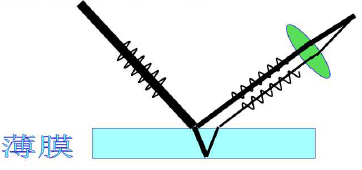
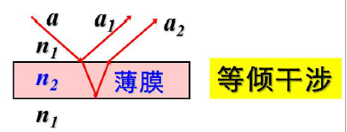
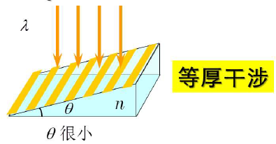
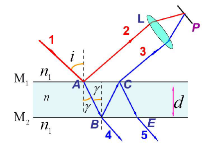
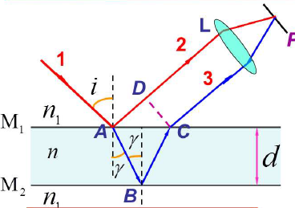

#  分振幅干涉

利用薄膜上下两个表面对入射光的反射和折射,可在反射方向(或透射方向)获得相干光束.

在实际中,根据薄膜均匀与否,比较简单而且应用较多的两种情况是:

+   厚度均匀薄膜,干涉条纹在无穷远处:
    +   

+   厚度不均匀薄膜,干涉条纹表面:
    +   

## 光路图

>   反射光2，3为两束相干光
>   透射光4，5为两束相干光

## 干涉明暗条件

光线2与光线3的光程差为
$$
\Delta=n(A B+B C)-n_{1} A D=+\frac{\lambda}{2}
$$

>   $\frac{\lambda}{2}$ : 半波损失

---

$$
\begin{aligned}
n_{1} \sin i&=n \sin \gamma \\
A B&=B C=d / \cos \gamma \\
A C&=2 d \tan \gamma \\
A D&=A C \sin i \\
&=2 d \tan \gamma \sin i
\end{aligned}\\
\begin{aligned}
\Delta&=n(A B+B C)-n_{1} A D+\frac{\lambda}{2}
\\&=2 n \frac{d}{\cos \gamma}-2 n_{1} d \sin i \tan \gamma+\frac{\lambda}{2} \\
&=2 n \frac{d}{\cos \gamma}-2 d n \sin \gamma \tan \gamma+\frac{\lambda}{2}\\&=2 d n\left(\frac{1}{\cos \gamma}-\frac{\sin ^{2} \gamma}{\cos \gamma}\right)+\frac{\lambda}{2} \\
&=  2 d n \cos \gamma+\frac{\lambda}{2} \quad=2 d \sqrt{n^{2}-n_{1}^{2} \cdot \sin ^{2} i}+\frac{\lambda}{2}
\end{aligned}
$$

#### 干涉条件

$$
\begin{aligned}
&\Delta=2 d \sqrt{n^{2}-n_{1}^{2} \sin i}+\frac{\lambda}{2} \\
&\Delta=\left\{\begin{array}{ll}
2 k \frac{\lambda}{2} \quad&(k=1,2, \ldots) & \text { 明 } \\
(2 k+1) \frac{\lambda}{2} & (k=0,1,2, \ldots) &\text { 暗 }
\end{array}\right.
\end{aligned}
$$

干涉明暗与级次:
同一入射角的光线$\to$同样的$\Delta\to$同一干涉级次$k\to$等倾干涉

#### 条纹特征:

+   明暗相间的同心圆环

+   $i$增大,条纹级次降低

