#  分振幅干涉

## 薄膜干涉

利用薄膜上下两个表面对入射光的反射和折射,可在反射方向(或透射方向)获得相干光束.

在实际中,根据薄膜均匀与否,比较简单而且应用较多的两种情况是:

+   厚度均匀薄膜,干涉条纹在无穷远处:
    +   

+   厚度不均匀薄膜,干涉条纹表面:
    +   

## 等倾干涉

### 光路图

>   反射光2，3为两束相干光
>   透射光4，5为两束相干光

### 干涉明暗条件

光线2与光线3的光程差为
$$
\Delta=n(A B+B C)-n_{1} A D=+\frac{\lambda}{2}
$$

>   $\frac{\lambda}{2}$ : 半波损失

---

$$
\begin{aligned}
n_{1} \sin i&=n \sin \gamma \\
A B&=B C=d / \cos \gamma \\
A C&=2 d \tan \gamma \\
A D&=A C \sin i \\
&=2 d \tan \gamma \sin i
\end{aligned}\\
\begin{aligned}
\Delta&=n(A B+B C)-n_{1} A D+\frac{\lambda}{2}
\\&=2 n \frac{d}{\cos \gamma}-2 n_{1} d \sin i \tan \gamma+\frac{\lambda}{2} \\
&=2 n \frac{d}{\cos \gamma}-2 d n \sin \gamma \tan \gamma+\frac{\lambda}{2}\\&=2 d n\left(\frac{1}{\cos \gamma}-\frac{\sin ^{2} \gamma}{\cos \gamma}\right)+\frac{\lambda}{2} \\
&=  2 d n \cos \gamma+\frac{\lambda}{2} \quad=2 d \sqrt{n^{2}-n_{1}^{2} \cdot \sin ^{2} i}+\frac{\lambda}{2}
\end{aligned}
$$

#### 干涉条件

$$
\begin{aligned}
&\Delta=2 d \sqrt{n^{2}-n_{1}^{2} \sin i}+\frac{\lambda}{2} \\
&\Delta=\left\{\begin{array}{ll}
2 k \frac{\lambda}{2} \quad&(k=1,2, \ldots) & \text { 明 } \\
(2 k+1) \frac{\lambda}{2} & (k=0,1,2, \ldots) &\text { 暗 }
\end{array}\right.
\end{aligned}
$$

干涉明暗与级次:
同一入射角的光线$\to$同样的$\Delta\to$同一干涉级次$k\to$等倾干涉

#### 条纹特征:

+   明暗相间的同心圆环
+   $i$增大,条纹级次降低

#### 讨论透射光4,5的干涉情况

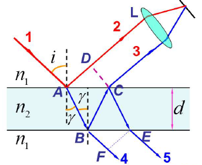
$$
\begin{aligned}
&\Delta_{2,3}=n_{2}(A B+B C)-n_{1} A D+\frac{\lambda}{2} \\
&\Delta_{4,5}=n_{2}(B C+C E)-n_{1} B F
\end{aligned}
$$

$$
同一入射角光线
\begin{cases}
	反射光干涉加强&明\\
	透射光干涉减弱&暗
\end{cases}
$$

透射光和反射光具有互补性,符合能量守恒定律

+   当光线垂直入射时,$i=0°$

$$
\Delta=2 d \sqrt{n^{2}-n_{1}^{2} \sin i}+\frac{\lambda}{2}
$$

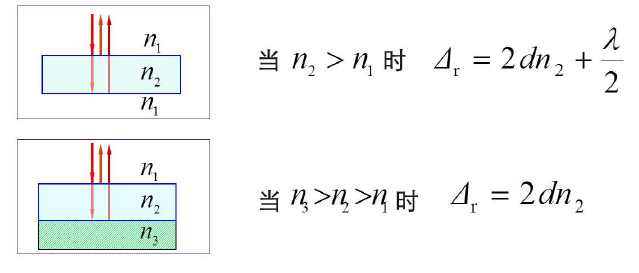

---

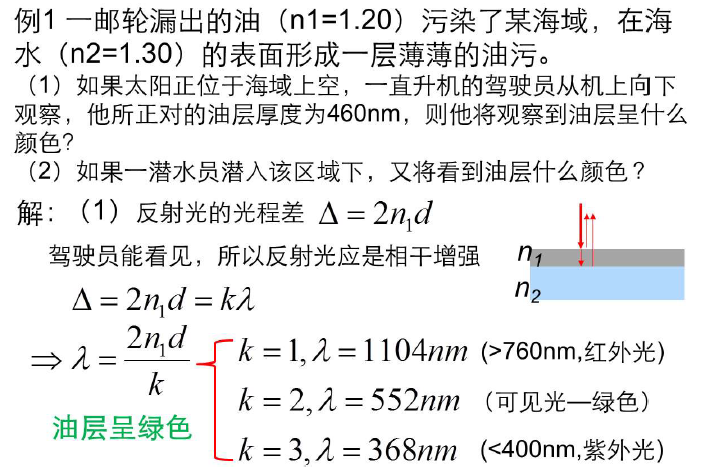

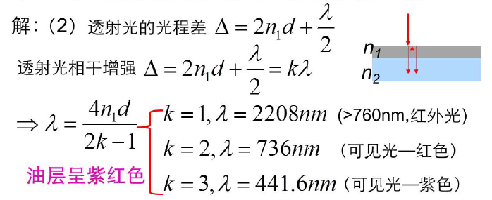

### 应用:增透膜和增反膜

+   增透膜
    +   利用薄膜上、下表面反射光的光程差符合相消干涉条件来减少反射,从而使透射增强.
+   增反膜
    +   利用薄膜上、下表面反射光的光程差满足相长干涉,因此反射光因干涉而加强.

#### 总结:

$$
\Delta=2 d \sqrt{n^{2}-n_{1}^{2} \sin i}+\frac{\lambda}{2}
$$

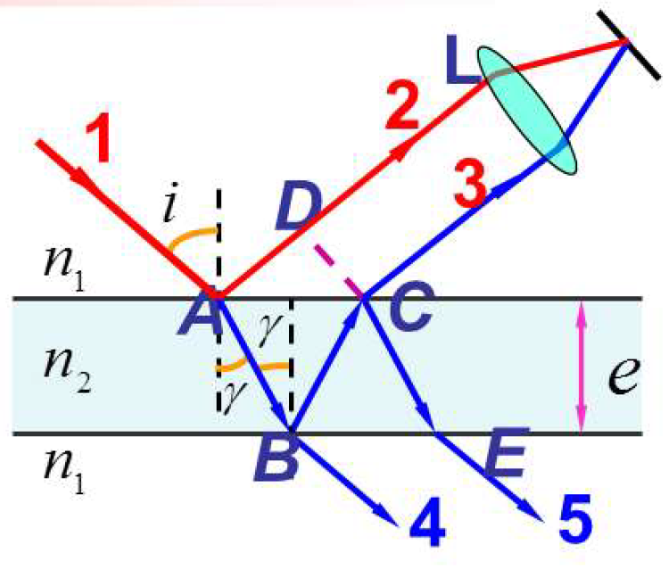

+   光程差是倾角的函数一个确定的倾角,对应确定级数的亮$\to$等倾干涉.

+   透射光无半波损失,干涉条纹的形状与反射光的互补
+   光线垂直入射时,反射光和透射光的光程差(要考虑半波损失)
+   增透膜和增发膜的应用

## 等厚干涉

### 光路图

夹角很小的两个平面所构成的薄膜

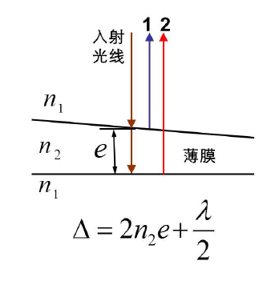

### 干涉明暗条件

$$
\Delta=2 n_{2} e+\frac{\lambda}{2}=\left\{\begin{array}{ll}
k \lambda & k=1,2,3 \cdots  &\text {明}\\
(2 k+1) \frac{\lambda}{ 2} & k=0,1,2 \cdots & 暗
\end{array} \quad\right.
$$

干涉形状与级次的决定:

同一厚度处$\to$同样的光程差$\Delta\to$同一干涉级次$k\to$等厚干涉

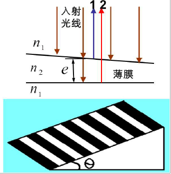

### 条纹特征

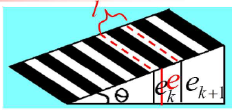

#### 1.明暗相间直条纹,棱边处$e=0,\Delta=\frac{\lambda}{2}$出现暗条纹

$$
\Large e=\left\{\begin{array}{ll}
\left(k-\frac{1}{2}\right) \frac{\lambda}{2 n_{2}} & k=1,2,3 \cdots & \text { 明纹 } \\
\frac{k \lambda}{2 n_{2}} & k=0,1,2 \cdots & \text { 暗纹 }
\end{array}\right.
$$
#### 2.条纹等间距

+   任意相邻明条纹对应的厚度差$\Large :e_{k+1}-e_{k}=\frac{\lambda}{2 n_{2}} \\$
+   任意相邻条纹之间的距离$\Large l:l+ \frac{e_{k+1}-e_{k}}{\sin \theta}=\frac{\lambda}{2 n_{2} \sin \theta}$

#### 3.干涉条纹的移动

$$
\large\Delta=2 n_{2} e+\frac{\lambda}{2}=\left\{\begin{array}{ll}
k \lambda & k=1,2,3 \cdots &\text { 明 }\\
\frac{(2 k+1) \lambda}{2 }& k=0,1,2 \cdots& 暗
\end{array} \quad\right.
$$

$$
l=\frac{e_{k+1}-e_{k}}{\sin \theta}=\frac{\lambda}{2 n \sin \theta}
$$

每一级条纹对应劈尖内的一个厚度,当此厚度位置改变时,对应的条纹随之移动.

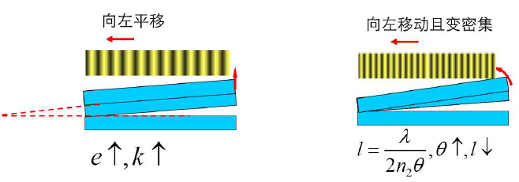

### 等厚干涉的应用

#### 测细丝的直径

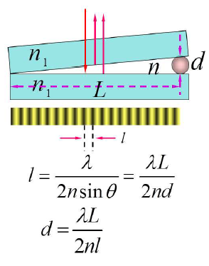

#### 测膜厚

#### 检验光学元件表面的平整度

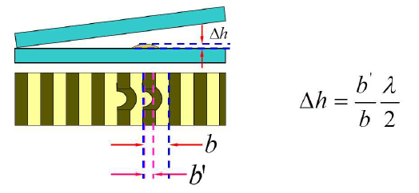

### 总结

$$
\Delta=2 n_{2} e+\frac{\lambda}{2}
$$

>    半波损失要按具体情况具体分析

+   干涉条纹为光程差相同的点的轨迹,即厚度相等的点的轨迹$\to$等厚干涉
+   厚度线性增长条纹等间距,厚度非线性增长条纹不等间距.
+   条纹的动态变化分析($d,\lambda,\theta$变化时)
    +   $\large l=\frac{e_{k+1}-e_{k}}{\sin \theta}=\frac{\lambda}{2 n \sin \theta}$

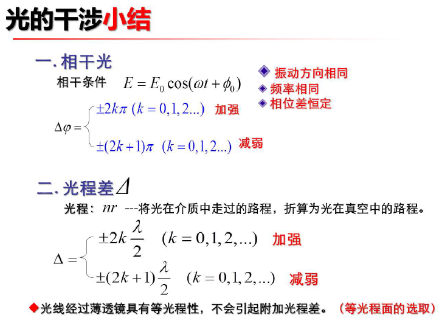

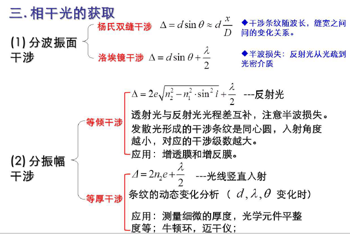

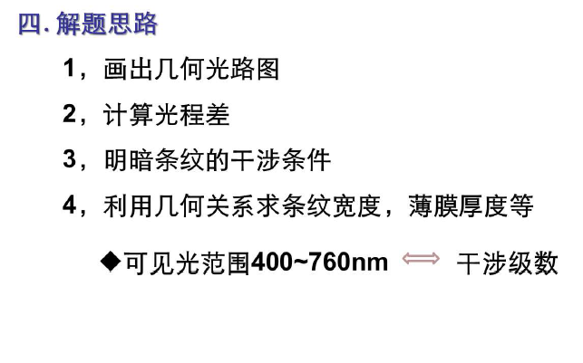
