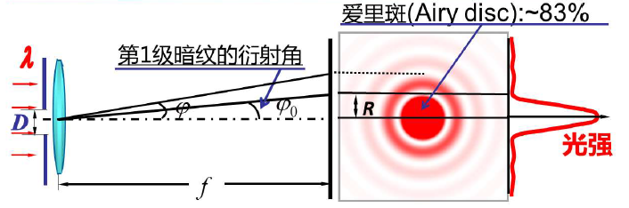

# 光学仪器的分辨率

## 圆孔衍射(Circular Hole Diffraction)

圆孔衍射:当光经过圆形的障碍物,如圆孔,透镜等所产生的衍射现象.

+   圆孔衍射的特点
    +   明暗相间的同心圆中心亮斑为光强最强.

$$
\begin{aligned}
&\text { 光强分布： }\\
&I(\varphi)=I_{0}\left[\frac{2 J_{1}(x)}{x}\right]^{2} \quad\left(J_{1}(x) \text { 是一阶贝塞尔函数, } x=\frac{\pi D}{\lambda} \sin \varphi\right)\\
&\begin{array}{|l|l|l|}
\hline \varphi=0 & \varphi=1.22 \lambda / D & \cdots \cdots \\
\hline I(\varphi)=I_{0} & I(\varphi)=0 & \cdots \cdots \\
\hline
\end{array}\\
&\text { 爱里斑半径 }: R=f \tan \varphi_{0} \approx f \varphi_{0}=1.22 f \lambda / D
\end{aligned}
$$

## 瑞利判据(Rayleigh Criterion)

+   条件
    +   两个不相干的、等光强的独立同时发光物点

"当一个爱里斑的中心与另外一个爱里斑的第一级暗纹处重合时,则两个爱里斑刚好可以分辨"

### 光的衍射总结

## 光学仪器的分辨率

### 最小分辨角

### 光学仪器的分辨率

$$
\frac{1}{\delta \varphi}=\frac{D}{1.22 \lambda}
$$

### 提高光学仪器的分辨率

+   增加孔径

+   增加介质折射率

**光的干涉和衍射说明光具有波动性**

