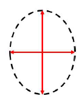

# 光的偏振

$$
\Large \text { 波 }\left\{\begin{array}{l}
\text { 横波: 质点的振动方向与波的传播方向垂直 } \\
\text { 纵波 : 质点的振动方向与波的传播方向平行 }
\end{array}\right.
$$

## 横波的偏振性

### 偏振

波的振动方向相对传播方向不具有轴对称性.

>    横波具有偏振性,纵波不具有偏振性.

>    光具有偏振性
>   说明光是横波

二向色性晶体:某些晶体能吸收某一方向的光振动,而只让与这个方向垂直的光振动通过.

+   偏振片
     +   含有二向色性材料的透明薄片
         偏振片允许通过的光振动的方向,用符号"$\updownarrow$"表示.

### 光的偏振态

光矢量在与光传播方向垂直的平面内的振动状态.

+   线偏振光
+   自然光
+   部分偏振光
+   圆偏振光
+   椭圆偏振光

## 线偏振光、自然光、部分偏振光

### 线偏振光

+   光矢量方向始终不变，只沿一个固定方向振动
+   线偏振光的表示法
    +   

### 自然光

>   间歇性和随机性

+   各个方向振动的光全有
+   各个振动方向的光强都相等

+   用两独立的、等振幅的垂直方向振动表示

    +   

    +   $$
        \boldsymbol{I}_{x}=\boldsymbol{I}_{y}=\frac{\mathbf{1}}{\mathbf{2}} \boldsymbol{I}
        $$

+   自然光的表示法

### 部分偏振光

+   某方向光振动振幅大，在其垂直方向上的光振动振幅小。
    +   

+   部分偏振光的表示法
    +   

## 起偏器、检偏器、马吕斯定律

偏振片既可作起偏器也可作检偏器

### 线偏振光的应用

+   旋光测试原理

### 马吕斯定律

$I_{2}=I_{1} \cos ^{2} \alpha$

>   $I_1:$偏振之后的光强
>
>   $I_2:$偏振之前的光强 
>
>   $\alpha:$偏振的夹角

### 反射光和折射光的偏振

#### 反射折射起偏现象

自然光反射和折射后产生部分偏振光

当特殊角度入射时反射光可以是线偏振光

#### 布儒斯特定律

当入射角满足$\tan i_0 =\frac{n_2}{n_1}=n_{21}$时,反射光只有垂直于入射平面的分振动。折射光仍旧是部分偏振光

>   $n_{21}:$相对折射率

### 光的偏振总结

+   1.偏振光

    +   偏振:波的振动方向相对传播方向的不对称性

    +   光的偏振证明光是一种横波

+   2.如何获得偏振光
    +   偏振片(起偏、检偏、马吕斯定律)
    +   光的反射和折射

+   3偏振光的应用
    +   摄影、电影、食品、汽车、生物.....

