# 第二章 气体动理论

# 第三章 热力学基础

## 热力学系统

+   孤立系统
    +   系统和外界没有任何物质和能量的交换
+   封闭系统 
    +   系统和外界只有能量的交换,而无物质交换
+   开放系统 
    +   系统和外界既有能量的交换,又有物质交换

## 功

P-V  曲线下面积

## P-V图

注意看总体,不要只分析每一步变化

---

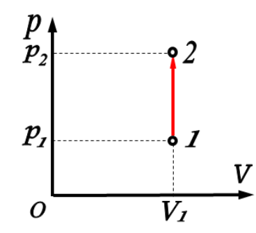

体积不变,压强增大

+   封闭空间升温,无做功

---

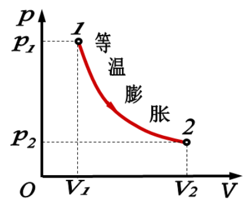

温度不变,压强变化

+   温度不变$\to$内能($U$)不变,$\Delta U=\Delta Q+W=0,Q=W$
+   吸收的热量完全用来对外做功

---

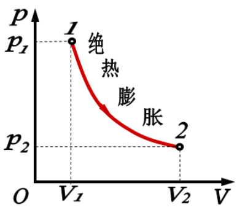

保温(不放热/吸热)($\Delta Q=0$)系统,体积增大

体积增大为例,此过程温度减小,也对外做功,内能减小

$\Delta U = \Delta Q+W\\\Delta U=W$

$T_1<T_2$

---

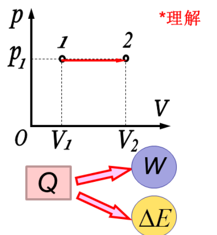

加热无摩擦的活塞缸(恒压)

此时吸收热量($\Delta Q$)$\to V$增大,温度(内能)升高

## 热力学第一定律

(能量守恒定律)

说明热机的效率$\eta_{max}=1$

## 热机效率

热机作用:对外作做功

输入:热量

故$\Large\eta=\frac{输出功}{吸收热量}$

## 制冷系数

致冷机作用:吸收热量

输入:输入功

故$\Large e=\frac{吸热}{输入功}$

---

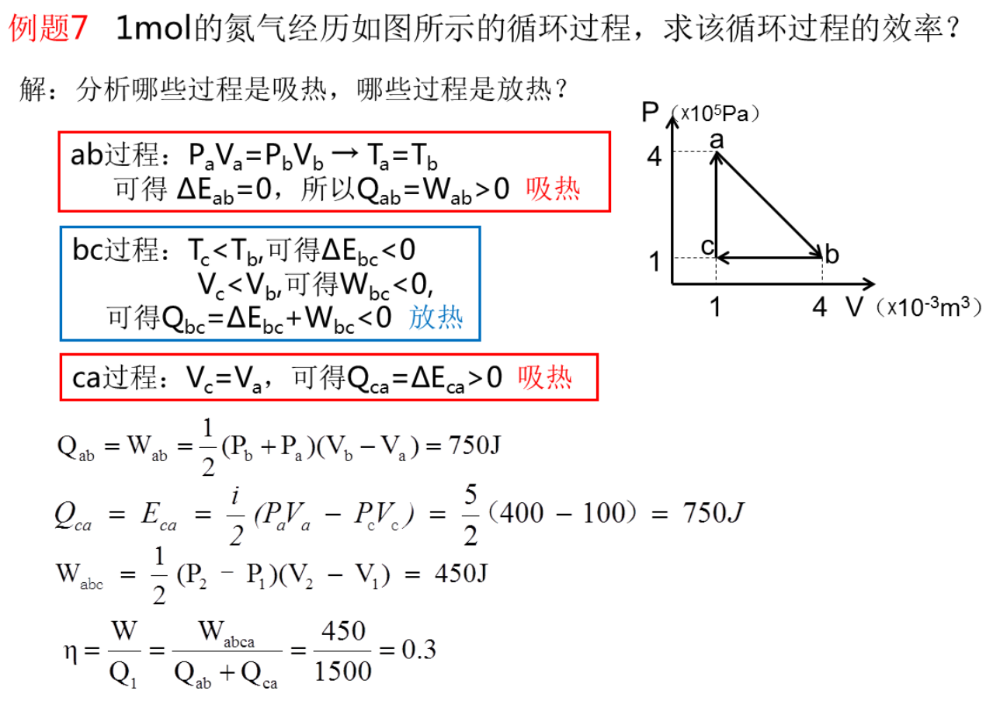

+   求效率:做功比吸热
+   形成封闭三角形的面积就是做功
+   然后分析吸热过程,计算吸热量

## 卡诺循环

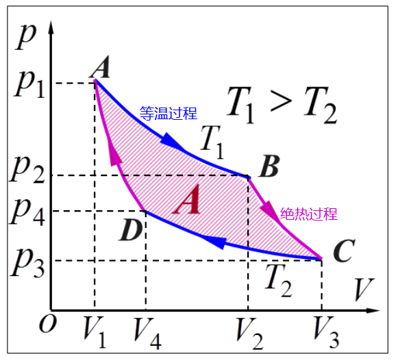

+   顺时针: 卡诺热机
    +   效率$:\Large\eta=1-\frac{T_2}{T_1}$
+   逆时针:卡诺致冷机

## 热力学第二定律

一循环不可能从单一热源吸热,并使之完全转变为功,而不产生其它影响.

不可能把热量从低温物体自动传到高温物体而不引起外界的变化。

### 不自发

说明热力学过程的方向性

+   热不能全部转换为功**而不引起其他变化**
    +   热可以全部转换为功
+   功可以全部转换为热
+   功转换为热可以自动发生
+   热转化为功不能自动发生

---

选择题1:下列说法正确的是
A)热力学第一定律可证明,任何热机的效率~~不能等于1~~
**B)热力学第二定律说明效率等于1的热机不可能制成**
C)热力学第一定律可证明~~任何可逆热机~~的效率都等于$1-\frac{T_2}{T_1}$
D)热力学第二定律说明热量不可能从低温物体传到高温物体(而...???)

>   +   热力学第一定律是能量守恒定律,说明热机的理想效率最高为1
>   +    
>   +   仅用于计算卡诺热机
>   +   热量从低温物体传到高温物体是可能的,但同时不引起其他变化是不可能的

## 熵

定量表示
$$
\Large S=l\ln\Omega
$$

+   孤立系统熵不减小

---

下列说法错误的是

A:孤立系统中发生的任意自发过程都是向着熵增加的方向进行的

B:体系在可逆过程中的热温比之和等于体系的熵变

C:不可逆过程中的热温比之和小于熵变

D:体系发生某一变化时的熵变等于该过程的热温比之和

>   A:孤立系统中的任意自发过程都是向着熵增加的方向进行的
>
>   D:只有可逆过程符合此描述

# 第四章 静电场

## 库伦定律

$$
\large\vec{F}_{21}=K \frac{q_{1} q_{2}}{r^{2}} \hat{r}_{21}\\
K=\frac{1}{4 \pi \varepsilon_{0}} \quad \varepsilon_{0}=8.85 \times 10^{-12} c^{2} N^{-1} m^{-2}
$$

>   $\hat{r}$是单位矢量

## 电场强度

### 计算式(定义式)

$$
E=\frac{F}{q_{0}}
$$

方向与实验电荷$q_0$受力方向一致

### 决定式

$$
\Large\vec{F}=\frac{q q_{0}}{4 \pi \varepsilon_{0} r^{2}} \hat{r}
$$

## 注

不存在E-q图,因为E与q无关

(q是实验电荷)

## 电荷连续均匀分布情况

## 电场线

$$
E=\frac{\Delta N}{\Delta S}
$$

>   $\Delta N:$电场线条数

## 高斯定理

### 电通量

通过有向曲面面积的条数

电场线与有向曲面平行时:
$$
\Large\Phi_{E}=E S
$$

### 高斯定理

在真空的静电场内,通过任一闭合曲面电通量,等于该闭合曲面所包围的电荷代数和的$\frac{1}{\varepsilon_0}$倍.
$$
\Large ES=\frac{Q}{\varepsilon_0}
$$

+   高斯面上
    +   场强: 与内外电荷都有关
    +   电通: 只与高斯面内的电荷有关

### 注:

高斯定理证明电场是有源场

## 电势能

$$
\Large W=\int_{r}^{\infin}q_0E\mathrm{d}l
$$

 

## 环路定理

静电场电场强度沿任一闭合曲线的线积分等于零.

### 注:

环路定理证明电场是无旋场(保守场)

## 电磁屏蔽

### 空腔导体屏蔽外电场

### 接地空腔导体屏蔽内电场

# 第五章 恒稳磁场

## 磁感应强度

$$
B=\frac{F_{max}}{qv}
$$

## 毕奥-萨伐尔定律

计算电流产生的磁场强度
$$
\Large\mathrm{d} \vec{B}=\frac{\mu_{0}}{4 \pi} \frac{I \mathrm{~d} \vec{l} \times \vec{r}_{0}}{r^{2}}
$$

>   $\mu_0:$真空磁导率
>
>   $\vec{r_0}:$单位矢量

---

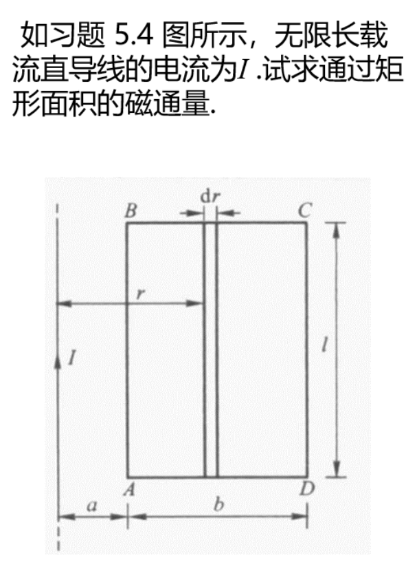

+   先求r处磁场强度

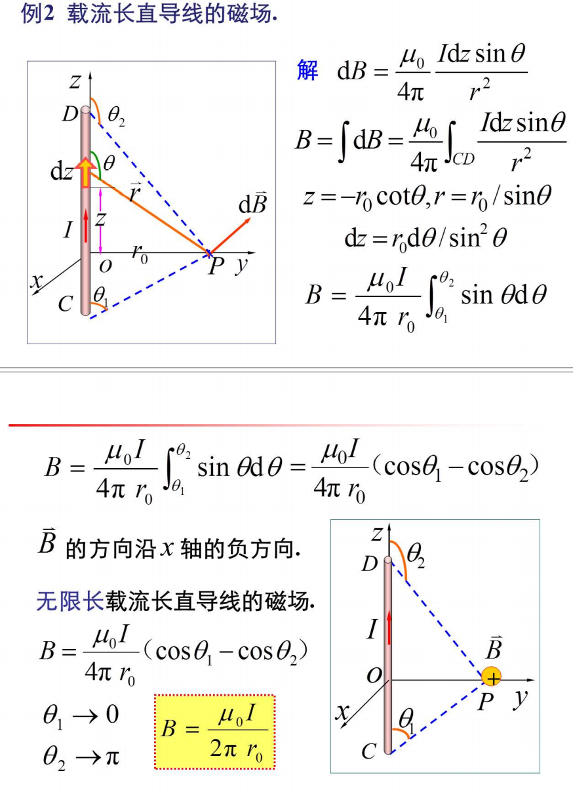

+   然后积分

$$
\Phi=\int\mathrm{d}\Phi=\int_{a}^{a+b}\frac{\mu_0I}{2\pi r_0}\times l \mathrm{d}r
$$

## 环路定理

$$
\oint_{l} \vec{B} \cdot \mathrm{d} \vec{l}=\mu_{0} I
$$

---

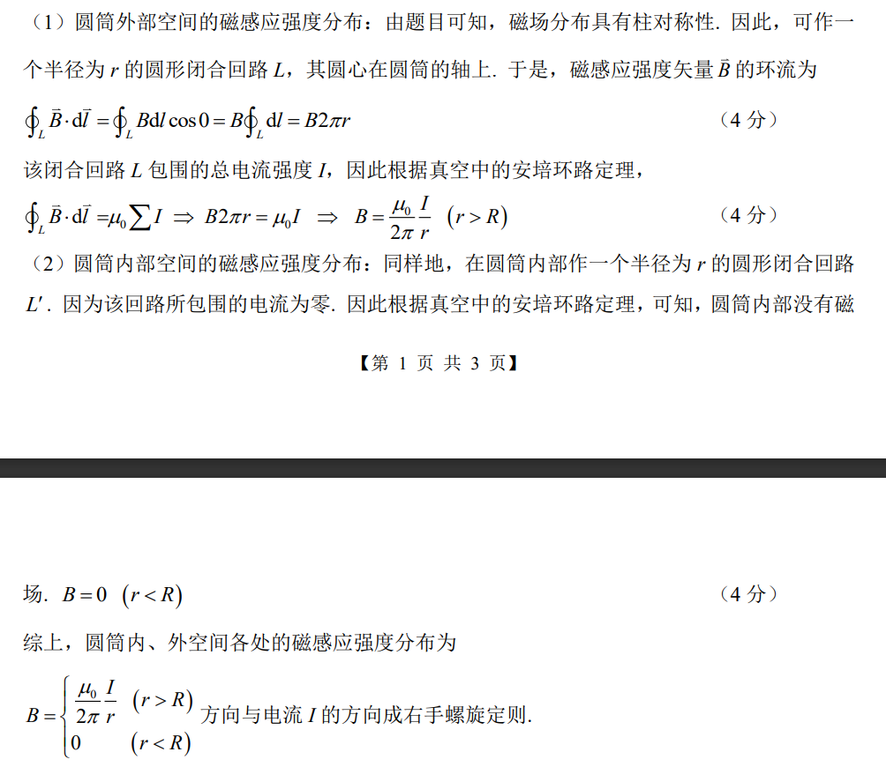

---

#　第六章　波动光学

## 光矢量振动方程

## 光的干涉

### 相干条件

+   振动方向相同
+   频率相同
+   相位差恒定

## 折射定律

$$
\frac{\sin \theta_1}{\sin \theta_2}=n_{21}
$$

光线通过两介质的界面折射时,确定入射光线与折射光线传播方向间关系的定律,几何光学基本定律之一。入射光线与通过入射点的界面法线所构成的平面称为入射面,入射光线和折射光线与法线的夹角分别称为入射角和折射角,以$\theta_1$和$\theta_2$表示。

式中$n_{21}$称为第二介质对第一介质的相对折射率。

## 光程与光程差

### 光程

光程为$nr$

>   折算为光在真空中通过的距离

$$
n r=\frac{c}{v} r=c \frac{r}{v}
$$

>   $c:$真空中光速
>   $v:$介质中光速
>   $r:$在介质中通过的距离
>   $n:$折射率
>
>   $\Large n=\frac{c}{v}$

### 光程差

光程差记为$\Delta$

光程差与相位差关系
$$
\Delta \varphi = \frac{2\pi}{\lambda}\Delta
$$

+   薄透镜等光程性
    +   在计算薄透镜的光程差时,只需要计算等光程面之前的光程差

## 相干光的获得方法

### 分波阵面法

### 分振幅法

## 双缝干涉

+   条纹特点
    +   明暗相间
    +   等间距
    +   等光强

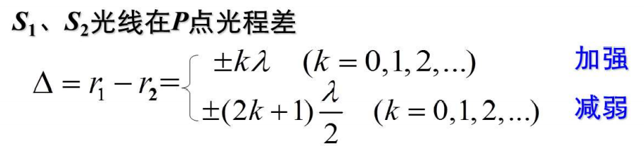

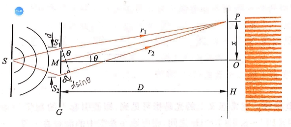
$$
p点处为一级明纹,距离中央明纹x\\
则p点两光的光程差为\lambda\\
\lambda\approx d\sin \theta\approx d\tan \theta\approx \frac{x}{D}
$$
由上可证明条纹之间等间距

---

选择题1用白光光源进行杨氏双缝干涉实验,若用一个纯红色的滤光片遮盖一条缝,用一个纯蓝色的滤光片遮盖另一条缝,则
A干涉条纹的宽度将发生改变.
B产生红光和蓝光的彩色干涉条纹.
C干涉条纹的亮度将发生改变.
**D不产生干涉条纹**

>   相干条件
>   	振动方向相同
>   	频率相同
>   	相位差恒定

---

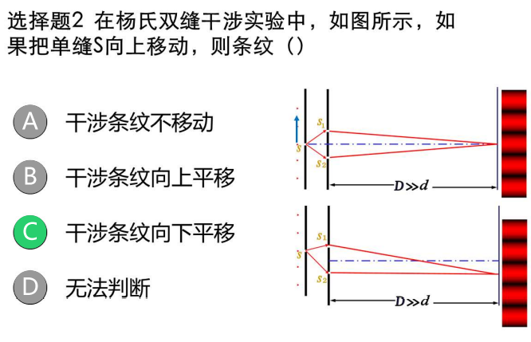

---

>   注意光程差变化值

## 半波损失

**半波损失:**光从**光疏**介质射向**光密**介质时,在掠入射或正入射情况下,反射光的相位较之入射光的相位跃变了$\pi$,相当于反射光与入射光之间**附加了半个波长的波程差**,称为半波损失.

半波损失是产生了半个波长的相位差,发生两次半波损失就会达到一个波长,抵消相位差

半波损失发生在反射的界面处

---

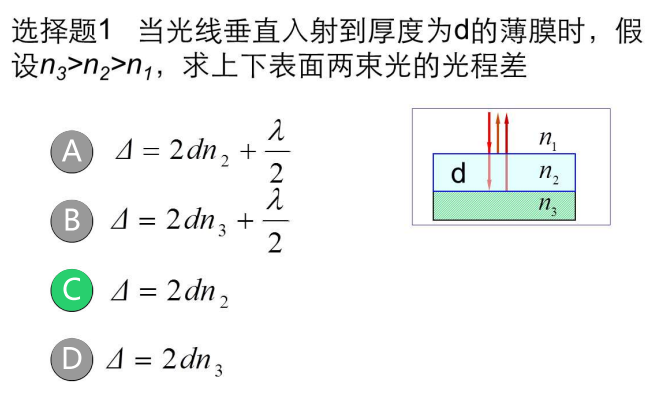

>   发生两次半波损失

## 薄膜干涉

### 等倾干涉

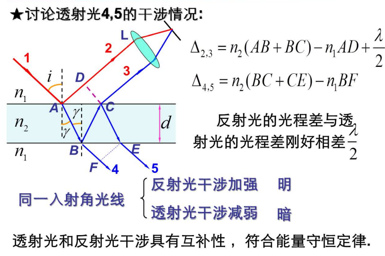

---

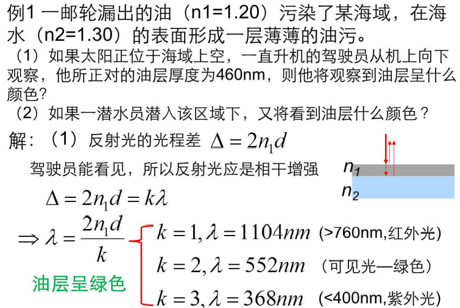

+   关于透射光

### 等厚干涉

+   条纹特点
    +   棱边处是暗纹
    +   条纹等间距

## 光的衍射

