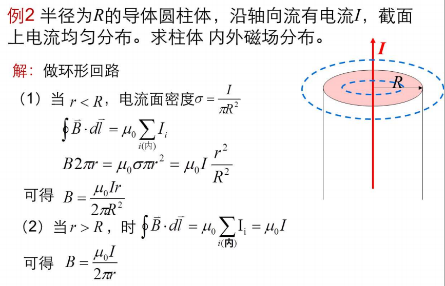

# 第二章 气体动理论

+   分子被视为质点的原因： 分子间平均距离>>分子线度
+   除碰撞瞬间外,分子间相互作用力及重力可忽略,分子视为自由运动
+   分子间,分子与器壁间为完全弹性碰撞

## 平衡态

平衡态:在不受外界影响的条件下,物体的宏观性质不随时间变化的状态.

①不受外界影响,是指外界对系统不作功、**不传热**.
②宏观性质不随时间变化,是指物体的宏观可观测性质确定不变.
③微观粒子仍处于热运动一热动平衡

## 压强

$$
P=\frac{2}{3}n\overline{\omega}=nkT
$$

>   $\overline{\omega}$: 分子平均动能
>
>   $n:$分子数密度

## 分子平均平动动能

$$
\overline{\omega}=\frac{1}{2}m\overline{v^2}=\frac{3}{2}kT
$$

>   $k:$玻尔兹曼常数

## 内能

$$
E=\frac{m}{M}\frac{i}{2}RT
$$

## *三种速率

### 最概然速率

$$
v_p\approx1.41\sqrt{\frac{RT}{M}}
$$

如果把整个速率范围分成许多相等的小区间，则分布在口所在的区间内的分子比率最大。

### 平均速率

$$
\overline{v}\approx1.60\sqrt{\frac{RT}{M}}
$$

算术平均速率是研究大量分子运动的平均效应，不考虑矢量性。反映了一定温度下粒子平均移动的快慢程度。

### 方均根速率

$$
\sqrt{\overline{v^2}}\approx1.73\sqrt{\frac{RT}{M}}
$$

方均根速率反映了气体分子平均平动动能的大小。

## 平均自由程

分子在连续两次碰撞所通过的自由路程的平均值-平均自由程

# 第三章 热力学基础

## 热力学系统

+   孤立系统
    +   系统和外界没有任何物质和能量的交换
+   封闭系统 
    +   系统和外界只有能量的交换,而无物质交换
+   开放系统 
    +   系统和外界既有能量的交换,又有物质交换

## 功

P-V  曲线下面积

## P-V图

注意看总体,不要只分析每一步变化

---

体积不变,压强增大

+   封闭空间升温,无做功

---

温度不变,压强变化

+   温度不变$\to$内能($U$)不变,$\Delta U=\Delta Q+W=0,Q=W$
+   吸收的热量完全用来对外做功

---

保温(不放热/吸热)($\Delta Q=0$)系统,体积增大

体积增大为例,此过程温度减小,也对外做功,内能减小

$\Delta U = \Delta Q+W\\\Delta U=W$

$T_1<T_2$

---

加热无摩擦的活塞缸(恒压)

此时吸收热量($\Delta Q$)$\to V$增大,温度(内能)升高

## 热力学第一定律

(能量守恒定律)

说明热机的效率$\eta_{max}=1$

## 热机效率

热机作用:对外作做功

输入:热量

故$\Large\eta=\frac{输出功}{吸收热量}$

## 制冷系数

致冷机作用:吸收热量

输入:输入功

故$\Large e=\frac{吸热}{输入功}$

---

+   求效率:做功比吸热
+   形成封闭三角形的面积就是做功
+   然后分析吸热过程,计算吸热量

## 卡诺循环

+   顺时针: 卡诺热机
    +   效率$:\Large\eta=1-\frac{T_2}{T_1}$
+   逆时针:卡诺致冷机

## 热力学第二定律

一循环不可能从单一热源吸热,并使之完全转变为功,而不产生其它影响.

不可能把热量从低温物体自动传到高温物体而不引起外界的变化。

### 不自发

说明热力学过程的方向性

+   热不能全部转换为功**而不引起其他变化**
    +   热可以全部转换为功
+   功可以全部转换为热
+   功转换为热可以自动发生
+   热转化为功不能自动发生

---

选择题1:下列说法正确的是
A)热力学第一定律可证明,任何热机的效率~~不能等于1~~
**B)热力学第二定律说明效率等于1的热机不可能制成**
C)热力学第一定律可证明~~任何可逆热机~~的效率都等于$1-\frac{T_2}{T_1}$
D)热力学第二定律说明热量不可能从低温物体传到高温物体(而...???)

>   +   热力学第一定律是能量守恒定律,说明热机的理想效率最高为1
>   +    
>   +   仅用于计算卡诺热机
>   +   热量从低温物体传到高温物体是可能的,但同时不引起其他变化是不可能的

## 熵

定量表示
$$
\Large S=l\ln\Omega
$$

+   孤立系统熵不减小

---

下列说法错误的是

A:孤立系统中发生的任意**自发**过程都是向着熵增加的方向进行的

B:体系在可逆过程中的热温比之和等于体系的熵变

C:不可逆过程中的热温比之和小于熵变

D:体系发生某一变化时的熵变等于该过程的热温比之和

>   D:只有可逆过程符合此描述

# 第四章 静电场

## 库伦定律

$$
\large\vec{F}_{21}=K \frac{q_{1} q_{2}}{r^{2}} \hat{r}_{21}\\
K=\frac{1}{4 \pi \varepsilon_{0}} \quad \varepsilon_{0}=8.85 \times 10^{-12} c^{2} N^{-1} m^{-2}
$$

>   $\hat{r}$是单位矢量

## 电场强度

### 计算式(定义式)

$$
E=\frac{F}{q_{0}}
$$

方向与实验电荷$q_0$受力方向一致

### 决定式

$$
\Large\vec{F}=\frac{q q_{0}}{4 \pi \varepsilon_{0} r^{2}} \hat{r}
$$

## 注

不存在E-q图,因为E与q无关

(q是实验电荷)

## 电荷连续均匀分布情况

## 电场线

$$
E=\frac{\Delta N}{\Delta S}
$$

>   $\Delta N:$电场线条数

## 高斯定理

### 电通量

通过有向曲面面积的条数

电场线与有向曲面平行时:
$$
\Large\Phi_{E}=E S
$$

### :star:高斯定理

在真空的静电场内,通过任一闭合曲面电通量,等于该闭合曲面所包围的电荷代数和的$\frac{1}{\varepsilon_0}$倍.
$$
\Large ES=\frac{Q}{\varepsilon_0}
$$

+   高斯面上
    +   场强: 与内外电荷都有关
    +   电通: 只与高斯面内的电荷有关

### 注:

高斯定理证明电场是有源场

## 电势能

$$
\Large W=\int_{r}^{\infin}q_0E\mathrm{d}l
$$

 

## 环路定理

静电场电场强度沿任一闭合曲线的线积分等于零.

### 注:

环路定理证明电场是无旋场(保守场)

## 电磁屏蔽

### 空腔导体屏蔽外电场

### 接地空腔导体屏蔽内电场

# 第五章 恒稳磁场

## 磁感应强度

$$
B=\frac{F_{max}}{qv}
$$

## 毕奥-萨伐尔定律

计算电流产生的磁场强度
$$
\Large\mathrm{d} \vec{B}=\frac{\mu_{0}}{4 \pi} \frac{I \mathrm{~d} \vec{l} \times \vec{r}_{0}}{r^{2}}
$$

>   $\mu_0:$真空磁导率
>
>   $\vec{r_0}:$单位矢量

---

+   先求r处磁场强度

+   然后积分

$$
\Phi=\int\mathrm{d}\Phi=\int_{a}^{a+b}\frac{\mu_0I}{2\pi r_0}\times l \mathrm{d}r
$$

## 环路定理

$$
\oint_{l} \vec{B} \cdot \mathrm{d} \vec{l}=\mu_{0} I
$$

---

---

#　第六章　波动光学

## 光矢量振动方程

## 光的干涉

### 相干条件

+   振动方向相同
+   频率相同
+   相位差恒定

## 折射定律

$$
\frac{\sin \theta_1}{\sin \theta_2}=\frac{n_2}{n_1}=n_{21}
$$

光线通过两介质的界面折射时,确定入射光线与折射光线传播方向间关系的定律,几何光学基本定律之一。入射光线与通过入射点的界面法线所构成的平面称为入射面,入射光线和折射光线与法线的夹角分别称为入射角和折射角,以$\theta_1$和$\theta_2$表示。

式中$n_{21}$称为第二介质对第一介质的相对折射率。

## 光程与光程差

### 光程

光程为$nr$

>   折算为光在真空中通过的距离

$$
n r=\frac{c}{v} r=c \frac{r}{v}
$$

>   $c:$真空中光速
>   $v:$介质中光速
>   $r:$在介质中通过的距离
>   $n:$折射率
>
>   $\Large n=\frac{c}{v}$

### 光程差

光程差记为$\Delta$

光程差与相位差关系
$$
\Delta \varphi = \frac{2\pi}{\lambda}\Delta
$$

+   薄透镜等光程性
    +   在计算薄透镜的光程差时,只需要计算等光程面之前的光程差

## 相干光的获得方法

### 分波阵面法

### 分振幅法

## 双缝干涉

+   条纹特点
    +   明暗相间
    +   等间距
    +   等光强

$$
p点处为一级明纹,距离中央明纹x\\
则p点两光的光程差为\lambda\\
\lambda\approx d\sin \theta\approx d\tan \theta\approx \frac{x}{D}
$$
由上可证明条纹之间等间距

---

选择题1用白光光源进行杨氏双缝干涉实验,若用一个纯红色的滤光片遮盖一条缝,用一个纯蓝色的滤光片遮盖另一条缝,则
A干涉条纹的宽度将发生改变.
B产生红光和蓝光的彩色干涉条纹.
C干涉条纹的亮度将发生改变.
**D不产生干涉条纹**

>   相干条件
>   	振动方向相同
>   	频率相同
>   	相位差恒定

---

---

>   注意光程差变化值

## 半波损失

**半波损失:**光从**光疏**介质射向**光密**介质时,在掠入射或正入射情况下,反射光的相位较之入射光的相位跃变了$\pi$,相当于反射光与入射光之间**附加了半个波长的波程差**,称为半波损失.

半波损失是产生了半个波长的相位差,发生两次半波损失就会达到一个波长,抵消相位差

半波损失发生在反射的界面处

---

>   发生两次半波损失

## 薄膜干涉

### 等倾干涉

---

+   关于透射光

### 等厚干涉

+   条纹特点
    +   棱边处是暗纹
    +   条纹等间距

## 光的衍射

一是**窄缝与屏幕的距离越大则中央亮纹越宽**。这是因为经过窄缝后绝大部分光子在引力作用下或多或少会发生微小的偏转，而这个偏转角度是一定的，所以窄缝与屏幕的距离越大则中央亮纹越宽。

二是**缝宽越小则中央亮纹越宽**。这是因为缝宽越小则绝大部分区域引力合力就越强，光子经过窄缝时与引力子作用的机会就越大因而其偏转角度也越大，从而在屏幕上形成更宽的条纹。

**其它亮纹的形成。**因为中央亮纹两侧的亮纹是对称分布的，所以我们只需要集中精力讨论任意一半就可以了，这里我们讨论中央亮纹以下各亮纹的形成。很显然，中央亮纹以下第一亮纹是由经过3465区域吸收了“最小吸收基数”个引力子的光子偏转投射在屏幕上形成的。假设经过窄缝的光子质量为100，而引力子的质量为0.0001，由于质量为100的光子只有同时吸收至少10000个引力子才可能形成新的、能够稳定存在的质量为101的新光子，并且由于新光子完全吸收了10000个引力子向下的冲量因而向下偏转的角度较大，这个新光子会投射在屏幕上中央亮纹以下第一条亮纹区域内。若干个经过3465区域并且吸收了10000个引力子光子偏转投射在屏幕上就形成第一条亮纹。

同样，质量为100的光子还可能吸收“最小吸收基数”整数倍的引力子，也就是同时吸收20000个、30000个……n＊10000个引力子。光子吸收了20000个引力子则会投射在屏幕上形成第二条亮纹、吸收了30000个引力子则会形成第三条亮纹……屏幕上的第n条亮纹也是这样形成的。一般有：中央亮纹处的光子质量＜第一亮纹处的光子质量＜第二亮纹处的光子质量……＜第n亮纹处的光子质量，同一亮纹处的光子质量相同、不同亮纹处的光子质量不同，光子在屏幕上的不同位置是由光子质量决定的而不是几率决定的。也就是说，光子经过单缝后会在缝的引力作用下改变质量（能量或者频率）。

>   以上是从光的粒子性对单缝衍射进行解释
>
>   光的波性质，本质就是引力作用下光在引力导致的扭曲空间中沿着最近路线传播的结果。
>
>   在想要观测光的粒子性时,光就会展现粒子性给观测者;
>   想要观测光的波动性时,光就会展现波动性给观测者

### 明暗条纹位置

### 明暗条纹宽度

中央明纹宽度：
$$
\Delta x_{0}=2 \frac{\lambda f}{a}
$$
非中央明条纹宽度：
$$
\Delta x=x_{k+1}-x_{k}=\frac{\lambda f}{a}
$$

>   中央明纹宽度是非中央明纹宽度的两倍,原因见上:单缝衍射的原理

## 光学仪器的分辨率

### 圆孔衍射

圆孔衍射与单缝衍射原理相同

### :star:瑞利判据

条件:两个不相干的、等光强的独立同时发光物点.

当一个爱里斑的**中心**与另外一个爱里斑的**第一级暗纹**处重合时,则两个爱里斑刚好可以分辨

>   艾里斑:圆孔衍射的中央明纹

$$
\begin{aligned}
&\text { 艾里斑一中心亮斑 } \quad \varphi_{0}=1.22 \frac{\lambda}{D} \quad R=1.22 \frac{\lambda}{D} f\\
&\text { 瑞利判据 } \delta \varphi_{\min }=1.22 \frac{\lambda}{D}\\
&\text { 光学仪器的分辨率 } \frac{1}{\delta \varphi_{\min }}=\frac{D}{1.22 \lambda}
\end{aligned}
$$

## 光的偏振

光具有偏振性说明光是横波

+   线偏振光
    +   光矢量方向始终不变，只沿一个固定方向振动
+   自然光
    +   各个方向振动的光全有
    +   各个振动方向的光强都相等
+   部分偏振光
    +   某方向光振动振幅大，在其垂直方向上的光振动振幅小

### 马吕斯定律

$$
I=I_0\cos ^2 \alpha
$$

