# 第一章 微生物细胞

# 原核生物细胞结构

## 细菌

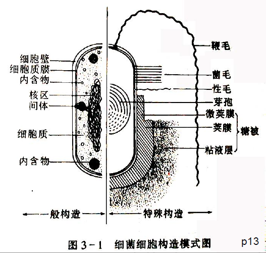

### 细菌细胞壁

定义：包围在细胞表面，内侧紧贴细胞膜的一层较为坚韧，略具弹性的结构，占细胞干重的$10\%-25\%$

**功能**：

- 固定细胞外形
- 为鞭毛运动提供支点
- 保护细胞免受外力的损伤
- 为正常细胞的分裂所必需
- 阻挡有害物质进入
- 与细菌的抗原性、致病性和对噬菌体的敏感性有关

$$分类\begin{cases}革兰氏阳性菌(G^+)\begin{cases}肽聚糖\\磷壁酸\end{cases}\\革兰氏阴性菌(G^-)\begin{cases}外壁层\to\begin{cases}脂多糖\\脂蛋白\\类脂\\蛋白质\end{cases}\\内壁层\to肽聚糖\end{cases}\end{cases}$$

### ⭐革兰氏染色法

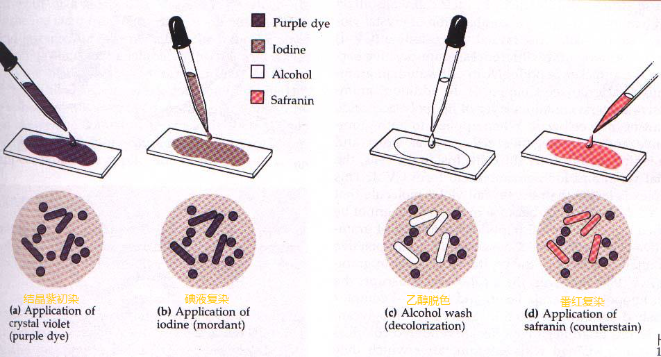

- 结晶紫初染
- 碘液媒染
- 乙醇脱色(关键步骤)
- 番红复染

> 菌体呈紫色为革兰氏阳性菌$G^+$
> 菌体呈红色为革兰氏阴性菌$G^-$

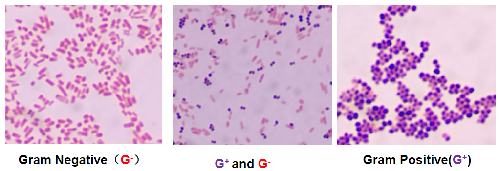

#### 革兰氏染色原理

+   两种细菌细胞壁成分和组成不同

    +   初染$\to$两种细胞一样着色
    +   媒染$\to$增强了细菌与染料的结合能力

    +   **脱色**$\to$两种细胞脱色能力不同(关键步骤)

+ 染色结果与菌龄有关

    革兰氏阳性菌可能出现阴性反应

+ 脱色时间过长

    - $G^+$红色

+ 脱色时间过短

    - $G^-$紫色

---

革兰氏阳性菌($G^+$)的细胞壁主要由肽聚糖形成的网状结构组成，壁厚、类脂质含量低，用乙醇脱色时细胞壁脱水，使得肽聚糖层的网状结构孔径缩小，通透性降低

**结晶紫-碘复合物**不易被洗脱而保留在细胞内

经脱色和复染后仍保留初染剂的蓝紫色

革兰氏阳性菌细胞壁的肽聚糖结构

---

革兰氏阴性菌($G^-$)的细胞壁中含有较多易被乙醇溶解的类脂质，而且肽聚糖层较薄，交联度低，故用乙醇脱色时溶解了类脂质，增加了细胞壁的通透性

初染的结晶紫-碘复合物易于渗出细菌就**被脱色**

再经番红复染后就呈现红色

革兰氏阴性菌细胞壁的肽聚糖结构

---

### 革兰氏阳性菌的细胞壁成分

**1.肽聚糖的分子结构**

肽聚糖是由组成肽聚糖的单体聚合而成的大分子网状化合物

**2.磷壁酸**

**磷壁酸**又称垣酸,是大多数革兰氏阳性菌($G^+$)所**特有的成分**,约占细胞壁成分的$10\%$

**磷壁酸的主要功能**

- 带负电荷,浓缩环境中$Mg^{2+}$,提高细胞膜上一些合成酶的活力
- 增强某些致病菌(如$A$族链球菌)对宿主细胞的粘连，避免被白细胞吞噬
- 赋予 $G^+$菌特异的表面抗原
- 作为噬菌体特异的吸附受体
- 调节细胞自溶素活力 防止细胞因自溶而死亡

### 革兰氏阴性菌的细胞壁成分

$G^-$细胞壁的组成和结构比$G^+$更复杂,分为外壁层和内壁层两部分

$$G^-细胞壁组成\begin{cases}外壁层\to\begin{cases}脂多糖\\脂蛋白\\类脂\\蛋白质\begin{cases}孔蛋白\\外壁蛋白\end{cases}\end{cases}\\内壁层\to肽聚糖\end{cases}$$

$G^-$的肽聚糖,仅占细胞壁干重的$5-10\%,$肽聚糖结构与$G^+$基本相同,但短肽尾的$3$号位上$L-Lys$被二氨基庚二酸取代,亚单位间通过肽键相连

### $G^+$菌$G^-$菌肽聚糖单体的异同

- 四肽上的第三个氨基酸不同$,G^+$菌为赖氨酸$,G^-$菌为内消旋二氨基庚二酸(DAP)
- 肽间桥不同$,G^+$菌为甘氨酸五肽$,G^-$菌为肽键

---

>    外壁层是$G^-$细菌细胞壁所特有的结构,它位于壁的最外层,外层壁由内到外由**脂蛋白**,**脂质双层**和**脂多糖**组成

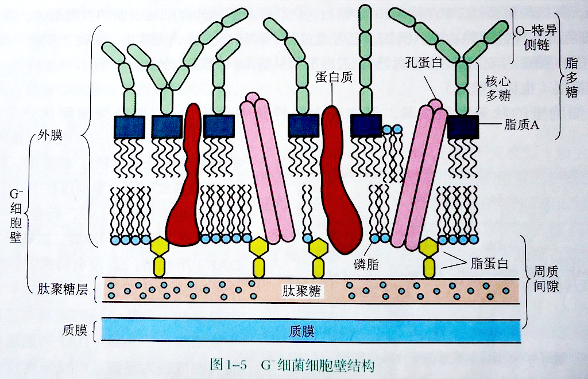

**脂多糖(LPS)分子结构**

$LPS\begin{cases}脂质A\\核心多糖\\O-特异侧链\end{cases}$

脂质$A$(或称类脂$A$)是$G^-$菌的毒性中心

---

脂多糖是**革兰氏阴性菌**细胞壁**外壁层**的主要成分,它由**脂质A**,**核心多糖**,**O-特异侧链**三部分构成

---

### 脂多糖的功能

- 脂质$A$是革兰氏阴性细菌致病物质-内毒素的物质基础
- 与磷壁酸相似,也有吸附$Mg^{2+}$ 和$Ca^{2+}$等阳离子以提高这些离子在细胞表面浓度的作用
- 由于$LPS$结构的变化,决定了革兰氏阴性细菌细胞表面抗原决定簇的多样性
- 是许多噬菌体在细胞表面的吸附受体
- 具有控制某些物质进出细胞的部分选择性屏障功能

> $LPS$结构须借$Ca^{2+}$维持,经$EDTA$去除$Ca^{2+}$后,就可使 $LPS$解体,从而暴露了内壁层的肽聚糖,这时$,G^-$菌就易被溶菌酶破坏

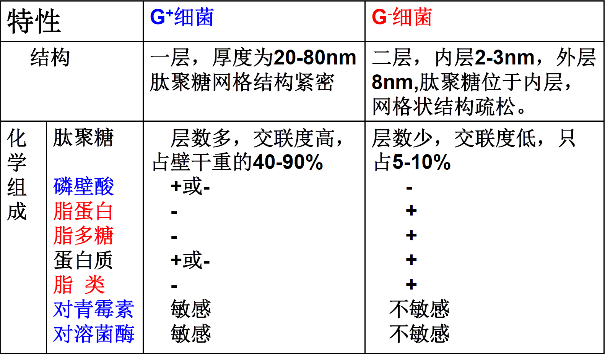

溶菌酶主要破坏$NAG$(N-乙酰氨基葡萄糖)和$NAM$(N-乙酰胞壁酸)之间的$\beta-1,4$糖苷键
(溶菌酶可以水解$\beta-1,4-$糖苷键,使肽聚糖解体)

## 细胞壁缺陷型菌

### 原生质体(Protoplast)

在革兰氏阳性菌培养物中加入溶菌酶或通过青霉素阻止其细胞壁的正常合成而获得的**完全缺壁细胞**即为原生质体

#### 特征

- 对环境条件很敏感,**特别脆弱**
- 保留**有鞭毛**,但**不运动**,不被相应的噬菌体感染   (细胞壁为鞭毛运动提供支点)
- 适宜条件下**可生长**,可形成芽孢,**可繁殖**,形成菌落及形成细胞壁,**生物活性不变**
- **更易导入外源遗传物质**,是研究遗传规律和进行原生质体育种的良好实验材料

### 原生质球(Spheroplast)

**细胞壁未全部去除**的细菌细胞,呈圆球形,可人为地通过溶菌酶或青霉素处理革兰氏阴性菌而获得

#### 特征

细胞壁肽聚糖已被除去,但外壁层中的脂多糖(LPS),脂蛋白仍保留对外界环境有一定抗性 

### L-型细菌

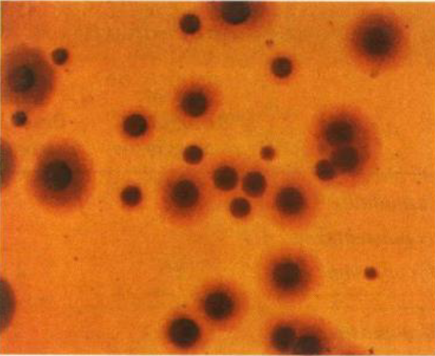

由李斯特研究所发现

细菌在某种环境条件下**因基因突变而产生的无壁类型**

**特征**

- 没有完整而坚韧地细胞壁,**细胞呈多形态**
- 有些**能通过细菌滤器**,故又称为"滤过型细菌"
- **对渗透敏感**,在固体培养基上形成"油煎蛋"似的小菌落(直径在$0.1mm$左右)

### 总结

- **原生质体**:用青霉素等抗生素或者溶菌酶处理 $G^+$菌而得到的**去壁完整的球形体**
- **原生质球**;用青霉素等抗生素或溶菌酶处理$G^-$细菌而得到的**去壁不完全的球形体**
- **L型细菌**:某些细菌在特定环境条件下因**基因突变而产生的无壁类型** 在一定条件下L型细菌能发生回复突变而恢复为有壁的正常细菌
- **支原体**:**进化过程中形成的无壁的原核生物**

---

肽聚糖单体的双糖单位分别是**N-乙酰葡萄糖胺(N-acetylglucosamine acid, NAG)**和**N-乙酰胞壁酸(N-acetylmuranmic acid, NAM)**

>   双糖之间通过$\beta-1,4-$糖苷键连接形成双糖单位
>
>   溶菌酶可以水解$\beta-1,4-$糖苷键,使肽聚糖解体

---

革兰氏阳性细菌细胞壁中的特有组分是**磷壁酸**

---

## 细胞质膜

细胞膜是外侧紧贴细胞壁而内侧包围原生质的一层柔软而富有弹性,**双层分子结构的单位膜**厚约$8nm,$占细胞干重的$10\%$左右。

化学组成

- 脂类:$20-30\%$
- 蛋白质:$50-70\%$
(边缘蛋白和整合蛋白)

## 细胞膜的化学组成与结构模型

### 磷脂

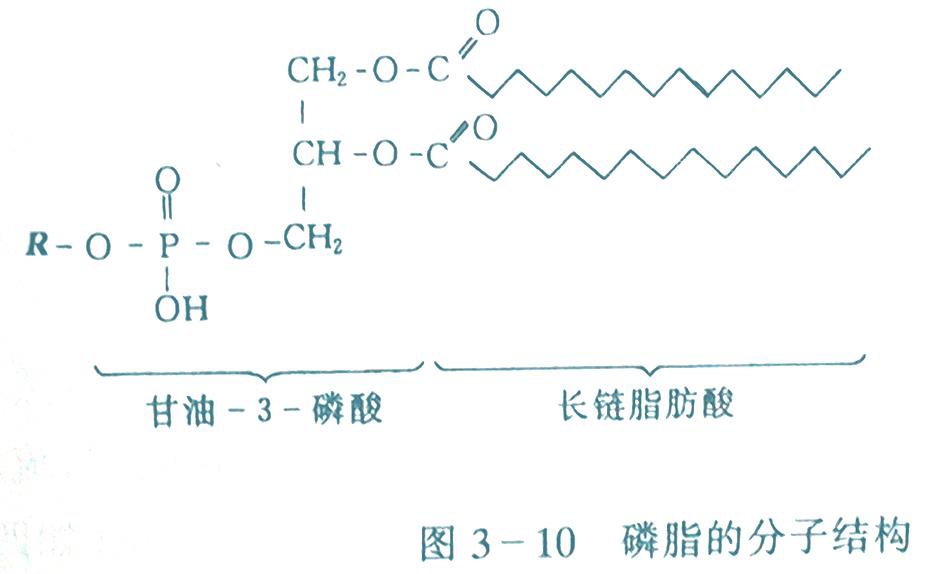

是由甘油磷酸和脂肪酸组成的甘油磷脂

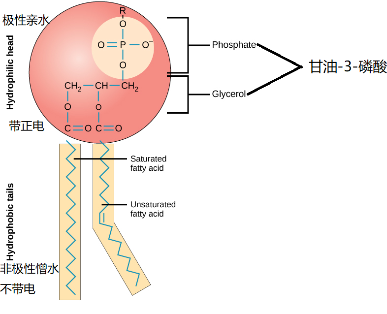

### 蛋白质

- 蛋白质镶嵌在双层磷脂中,并伸向膜内外两侧
- 周边蛋白"漂浮在"细胞膜表面
    整合蛋白嵌合在磷脂双分子层

### 甾醇类物质

由磷脂分子形成的双分子膜中加入甾醇类物质可以提高膜的稳定性

+   甾醇的一般结构
    +   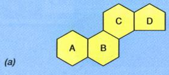

真核生物细胞膜中一般含有甾醇(如胆固醇)(下图(b))

原核生物与真核生物的最大区别就是其细胞膜中一般不含甾醇,而是含有藿烷类化合物(hopanoid)(下图(c))
但支原体是个例外

**不具细胞壁的支原体在质膜中含有胆固醇**

.jpg)

## 细胞质膜的功能

- 控制**营养物质的吸收**和**代谢产物的排放**(半透膜)
- **维持细胞内正常渗透压**
- 合成**细胞壁**和**外被多糖**的各种组分的场所
- 与**呼吸作用**和**磷酸化作用的能量平衡**有关
- **鞭毛着生点**,并为其运动提供能量
- 与细胞壁一道构成**蛋白质分泌系统**,与外界发生作用

# 周质空间

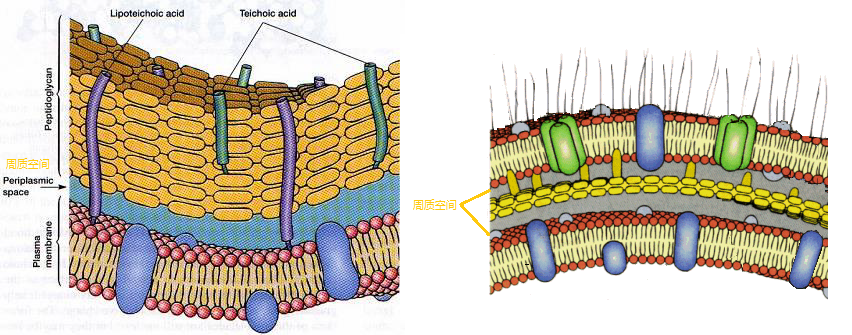

位于细胞壁和细胞膜之间的狭小空间,也称**壁膜空间**,内含水解酶,结合蛋白和化学受体

这些酶对细菌的营养吸收,核酸代谢,趋化性,抗药性有重要作用

## 内膜系统

原核生物**不具备真核生物所特有的单位细胞器**,但许多细菌内**含有内膜系统**

内膜系统一方面伸入细胞质,一方面与质膜相连

### 内膜系统分类

#### 光合作用内膜

如蓝细菌的**类囊体**,其膜上含有叶等光合色素,是**蓝细菌进行光合作用的场所**(相当于真核生物的叶绿体)

#### 非光合作用内膜

能够氧化无机物和一氧化碳的**需氧细菌**,其**呼吸酶类**位于复杂的内膜系统上(相当于真和生物的线粒体)

---

真核微生物的许多生理功能有专门的细胞器完成,原核生物则在膜结构上完成

---

## 核区

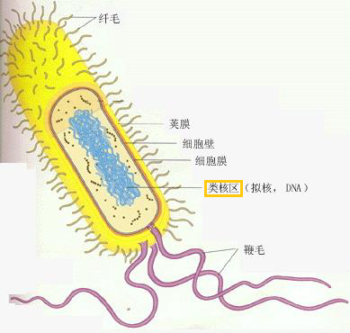

包括一条很长的环状双螺旋DNA链,又称细菌染色体,是遗传信息的载体

## 细胞质

**定义**:细胞膜内除核区以外的所有物质都为细胞质

$$组成\begin{cases}核糖体\\质粒\\内含物\end{cases}$$

### 核糖体

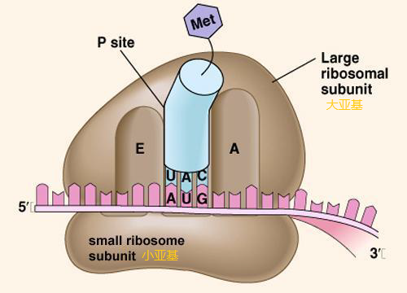

- 核糖核蛋白体的简称
- $\frac{2}{3}$为核糖核酸$(rRNA),\frac{1}{3}$为**蛋白质**
- 根据超速离心时的沉降速度,原核生物核糖体为$70S$,由$30S$和$50S$两个亚基组成
- $\mathrm{30S}$亚基由$\mathrm{16S rRNA}$和21种蛋白质组成
- $\mathrm{50S}$亚基由$\mathrm{5S rRNA},\mathrm{23SrRNA}$和$32$种蛋白质组成
- **蛋白质的合成场所**

### 质粒

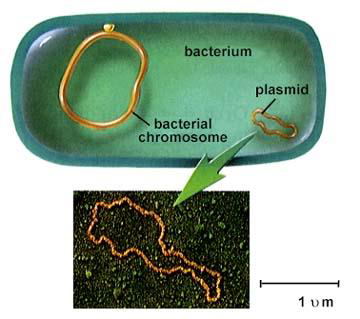

质粒是独立存在于染色体外或附加在染色体上的遗传物质

**基本结构**
质粒通常是闭合环状的， 能自我独立复制， 不含细胞的初级代谢信息，而含有细胞的次级代谢信息

**功能**
控制细菌的某一遗传性状,可作为基因的转移载体

**特点**

- 能自我复制,稳定的遗传
- 没有质粒的细菌可以获得质粒
- 质粒也可以消除
- 质粒可以携带供体细胞的DNA转移
- **不相容性**
含有相同复制原点的质粒不能存在同一细胞中

### 内含物

指细胞质内一些形状较大的颗粒状构造

**1.储藏物**
一类由不同化学成分积累而成的不溶性颗粒,主要功能是储存营养物

- 碳源及能源类

    - 糖原
        - 大肠杆菌
        - 芽孢杆菌
        - 蓝细菌

    +   聚$\beta-$羟丁酸($PHB$)
        +   固氮菌

    +   硫粒
        +   紫硫细菌
        +   丝硫细菌

- 氮源类

    +   藻青素
        +   蓝细菌

    +   藻青蛋白
        +   蓝细菌

- 磷源(异染体)

    +   结核分枝杆菌,迂回螺菌

**2.磁小体**

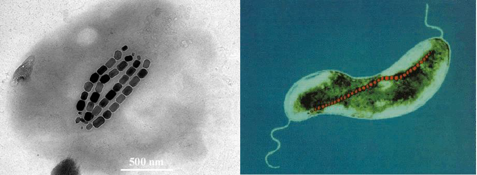

存在于少数$G^-$细菌如水生螺菌属和嗜胆球菌属,成分为$\mathrm{Fe_3O_4}$,外有一层磷脂,蛋白质或糖蛋白包裹,无毒

**形状**
平截八面体,平行六面体和六棱柱体

**磁小体功能**
导向作用,借助引导细菌游向最有利的泥-水界面微氧环境处生活

**应用**
磁性定向药物和抗体,制造生物传感器

**3.气泡**

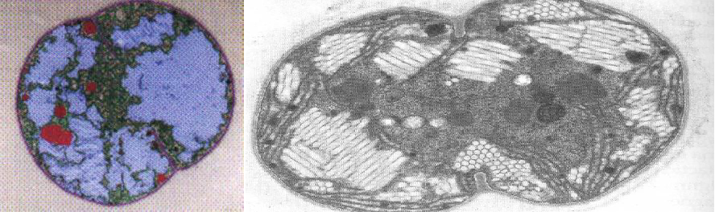

某些水生细菌如蓝细菌,不放氧光合细菌和盐细菌细胞内储存气体的特殊结构即为**气泡**,由**蛋白质膜**包裹

功能
调节细胞比重以使细胞漂浮在最适水层中获取光能,氧气和营养物质

****

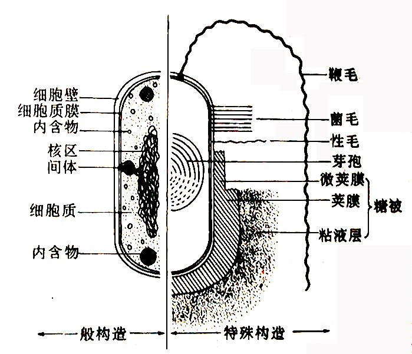

## 特殊构造

### 芽胞

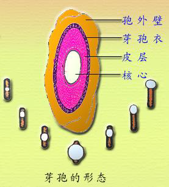

某些细菌在其生长发育后期，在细胞内形成一个圆形或椭圆形、厚壁、含水量极低、抗逆性极强的休眠体,称为芽胞(endospore或spore,也译作"内生胞子")

恶劣环境下,一个细菌产生一个芽孢,条件适宜时重新称为一个细菌,数量没有增加,因此芽胞不是细菌繁殖体,是休眠提,因此称作"芽胞"更合适

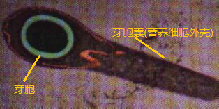

#### **芽胞结构**

##### 1.核芯

- 芽胞壁
- 芽胞质膜
- 芽胞质(DAP-Ca)
- 核区

##### 2.皮层

含芽胞肽聚糖和DAP-Ca,渗透压高,含水量大

##### 3.芽胞衣

含疏水性角蛋白,抗酶解和药物

##### 4.胞外壁

含脂蛋白,透性差

---

#### **特点**

整个生物界中抗逆性最强的生命体，是否能消灭芽胞是衡量各种消毒灭菌手段的最重要的指标。

例如：
$Clostridium\ botulinum$ 肉毒梭菌 的芽胞在沸水中要经 $5-9.5h$ 才被杀死。

芽胞是细菌的休眠体，在适宜的条件下可以重新转变成为营养态细胞
产芽胞细菌的保藏多用其芽胞。

常规条件下，一般可保持几年至几十年而不死亡，有的芽胞甚至可休眠数百至数千年。

产芽胞的细菌多为杆菌也有一些球菌 。 芽胞的有无 、 形态 、 大小和着生位置是细菌分类和鉴定中的重要指标 

产芽胞的细菌种类较少，主要属于$G^+$细菌的两个属 
好氧性的Bacillus 芽胞杆菌属 和 厌氧性的Clostridium 梭菌属

---

#### **芽胞的形成**

产芽胞的细菌当处于环境中**营养物缺乏**和**代谢产物浓度过高**时就引起细胞生长停止，进而形成芽胞。

以Bacillus subtilis (枯草芽孢杆菌)为例，芽胞形成过程约经 8h   其中约有 200 个基因参与。

---

#### **芽胞的萌发**

由休眠状态的芽胞变成营养状态细菌的过程，称为芽胞的萌发

芽胞的萌发过程

①活化：活化处理 生长条件合适

②出芽：芽胞衣开始降解 芽胞透性增加,皮层开始消失,核心膨胀开始合成细胞壁 。 耐热性和折光性降低DPA-Ca 等可溶性物质外流 抗性降低 。

③生长：芽胞核心开始合成新的 DNA 、 RNA 和蛋白质 肽聚糖分解 长出芽管 逐渐发育成新的营养细胞 。

---

#### **耐热机制**

渗透调节皮层膨胀学说

**芽胞衣**对多价阳离子和水分的透性很差

**皮层**的离子强度很高,产生极高的渗透压夺取芽胞核心的水分,结果造成皮层的充分膨胀

核心部分的细胞质却变得高度失水具有极强的耐热性

##### 芽胞具有耐热性的原因

1. 壁厚
2. 芽胞含水少
3. 含有吡啶二羧酸钙(DPA-Ca)的复合物,能稳定芽胞中的生物大分子
4. 含有高浓度的**小的酸溶性芽胞蛋白**(SASP),这些蛋白与DNA 结合，避免热、干燥、辐射等不良环境对 DNA 的损伤，也可以为芽胞萌发提供碳源和能源。

---

芽胞对热、干燥、辐射和毒素等异常环境有抗性,芽胞中的**钙离子和吡啶二羧酸(DPA-Ca)**与抗热性有关.

---

### 伴胞晶体

是芽胞杆菌属Bacillus的某些种如苏云金芽胞杆菌在形成芽胞时同时形成的一颗菱形或方形的碱性蛋白晶体 。

伴胞晶体对鳞翅目、双翅目和鞘翅目昆虫有毒性。

#### **特点**

不溶于水，对蛋白酶类不敏感；容易溶于碱性溶剂。

伴胞晶体杀虫机理:

>   1菌体  2芽胞  3伴胞晶体

伴胞晶体

$\qquad\downarrow$

害虫吞噬

$\qquad\downarrow$

伴胞晶体在肠道迅速溶解(中肠pH为9.0-10.5)

$\qquad\downarrow$

吸附于中肠上皮细胞,肠道穿孔,引起细胞膨胀,死亡

$\qquad\downarrow$

肠道中的碱性溶液进入血液,后者pH升高,昆虫患败血症而死亡

---

### 胞囊

某些细菌形成的休眠体构造 如固氮菌的胞囊 ( 在外界缺乏营养的条件下 由整个细胞壁加厚 、 细胞失水而形成的 **一种抗干旱但不抗热的圆形休眠体**

+   与芽胞比较
    +   一个营养体产生一个芽胞，一个芽胞也只产生一个营养体
    +   一个营养体产生一个胞囊，一个胞囊产生多个幼龄细胞

---

### 糖被

**定义**
包被于**某些**细菌细胞壁外的一层厚度不定的胶状物质

**分类**

- 荚膜
    - 具有较好结构而不易洗掉,粘性较大,附着在细胞壁外
- 粘液层
    - 薄而扩散且容易消失,松散地附着在细胞壁外
- 菌胶团
    - 有荚膜或粘液层的细菌相互连接成较大的群体

---

#### 荚膜

#### **S型菌落和R型菌落**

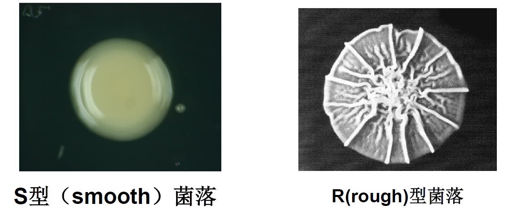

+   S型菌落为产荚膜的细菌菌落,因其通常光滑透明而称之为S型

+   R型菌落为不产荚膜的细菌菌落,因其表面较粗糙而称之为R型

荚膜主要成分为多糖,有的还含有多肽,蛋白质

---

>    胶质芽胞杆菌荚膜
>   白色的为荚膜，荚膜(白色)包裹的为菌体

---

>    肺炎球菌荚膜

---

#### **荚膜染色的原理**

荚膜的主要成分是**多糖**,由于荚膜与染料之间的亲和力弱,不易着色,通常采用负染色法(黑墨水法)染荚膜,即设法将**菌体和背景**着色而荚膜不着色,从而使**荚膜**在菌体周围呈一**透明**圈

---

- 观察细菌荚膜时,用**负染色法**进行染色.镜检时,菌体和背景呈黑色,荚膜呈**透明圈**.其中原因是**荚膜与染料的亲和力比较差，不容易被染色**

---

#### 荚膜功能

- 含水大,保护细菌免受干燥的影响（除水外，含量最多的是多糖）
- 能抵抗吞噬细胞的吞噬(增强致病菌的毒力)
吞噬细胞识别位点与细菌的细胞壁有关，荚膜掩盖了细胞壁(增强致病性)
抗噬菌体吸附
- **贮藏养料**(多糖),以备营养缺乏的时重新利用
- 作为透性屏障或离子交换系统,可保护细菌免受重金属离子的毒害
- **表面附着作用**(引起龋齿的唾液链球菌)
- **根瘤菌和豆科植物之间的信息识别作用**

---

+   **耐辐射**不是细菌荚膜的特性

---

#### 荚膜的益处与害处

##### 益处

- 荚膜作为代血浆的生产原料
肠膜状明串珠菌能用蔗糖合成大量的荚膜物质-葡聚糖，葡聚糖是生产右旋糖酐的原料，而右旋糖酐是制作代血浆的主要成分。
- 荚膜作为石油钻井添加剂
野油菜黄单胞菌的粘液层可提取胞外多糖-黄原胶
- 用于污水的生物处理
形成菌胶团的细菌有助于污水中有害物质的吸附和沉降。

##### 害处

- 有荚膜的细菌致病性强
- 污染食品,导致粘性面包,粘性牛奶产生
- 影响制糖生产,增加糖液粘度,影响过滤速度,对生产造成损失

---

### 晶状样细胞表面层 S-层

- 在细菌和古菌的胞壁外面普遍都有S-层,由同型蛋白或糖蛋白组成的晶格网状结构覆盖在细胞表层
- 在缺乏肽聚糖层的$\mathrm{G^-}$古菌中作为细胞壁存在
- 主要功能:作为保护性外被,帮助细胞间彼此吸附和相互识别,作为细胞的渗透屏障,允许小分子通过,但组织溶菌酶进入

---

### 鞭毛和菌毛

从细菌细胞质膜和细胞壁中伸出细胞外,由蛋白质组成的丝状结构,使细菌具有运动性

鞭毛纤细,长度可达15-20 μm 直径仅为15-20 nm,因此只有在电子显微镜下才能看到;而在光学显微镜下,只有通过特殊的鞭毛染色法使鞭毛加粗后才能看到 。

#### 鞭毛的亚显微构造

由**鞭毛丝**,**鞭毛钩**和**基体**组成

     革兰氏阴性菌鞭毛结构                                     革兰氏阳性菌鞭毛结构

#### 鞭毛的分类

根据鞭毛着生位置,鞭毛菌可分为以下五种类型

---

#### 观察和判断细菌鞭毛的方法

- 电子显微镜直接观察
鞭毛长度:$15-10\mu m$
直径:$0.01-0.02 \mu m$
- 光学显微镜下观察
鞭毛染色
- 显微镜下判断
细菌的运动性
- 培养特征判断
半固体刺穿,菌落(菌苔形态)

---

### 细菌的趋避运动

#### 化学趋避运动或趋化运动

细菌对某化学物质敏感,通拓运动聚集于该物质的高浓度区域或低浓度区域

## 菌毛

- 细菌菌毛又称纤毛,比鞭毛更细,短而硬的丝状体蛋白结构,数目常多于鞭毛
- 长约$0.5\sim 6\mu m,$个别可达$20\mu m,$直径约$3\sim 7 nm$
- 菌毛由菌毛蛋白组成
- 比鞭毛简单,无基体等构造,直接着生于细胞质膜上
- **不具运动性**,但可有助于细胞在固体物表面的黏附

---

### 菌毛分类

#### 普通菌毛

可征集细菌吸附于其他细胞和物体的能力

#### 性菌毛

构造和成分与菌毛相同,但比菌毛稍长,数量比菌毛少,只有一根或几根

性菌毛在接合过程中发挥作用

性菌毛是遗传物质的传递通道,有的性菌毛还是噬菌体的特异性吸附受体

---

+   细菌鞭毛由**鞭毛丝**，**鞭毛钩**，**基体**三部分组成,是细菌的运动器官. 
    **菌毛**比鞭毛细,短, 由僵硬蛋白组成,不具运动性. **性菌毛**与细菌质粒的接合转移有关

>   细胞壁为鞭毛提供支点,没有细胞壁鞭毛无法运动
>   细胞膜为鞭毛提供着生点和能量

---

# 真核细胞和原核细胞

+   **真核生物**是一大类细胞核具有核膜,核仁,能进行有丝分裂,细胞质中存在线粒体或同时存在叶绿体等多种细胞器的生物

+   **真核微生物**主要包括**真菌**,显微藻类和原生动物

+   真核细胞比原核细胞复杂,真核细胞除了它的**核为真核**外,另一个重要特征是**细胞的功能定位在不同的细胞器上**

## 真核细胞与原核细胞的比较

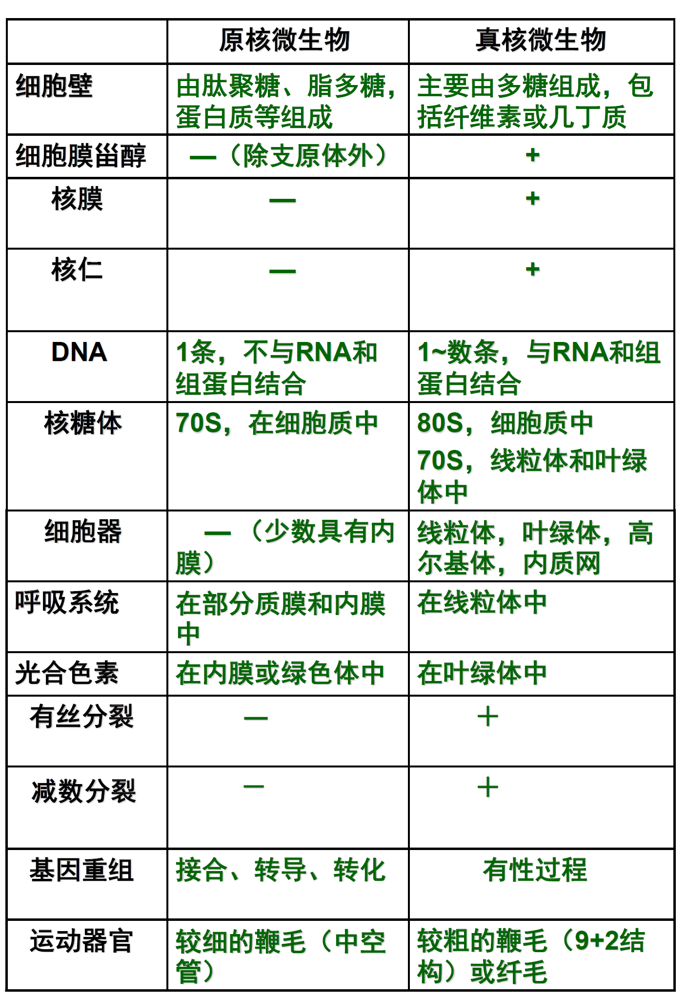

### 鞭毛

真核细胞的运动靠鞭毛或纤毛,鞭毛构造是9+2型

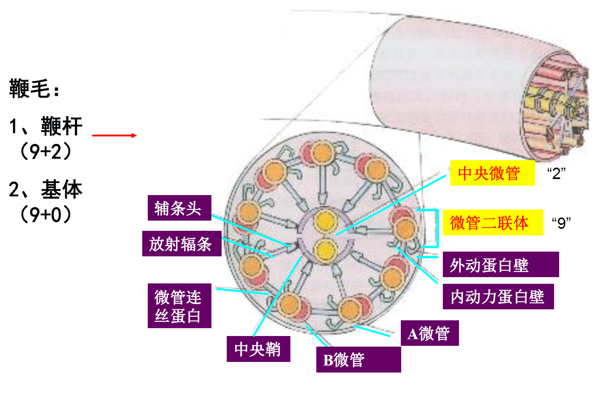

