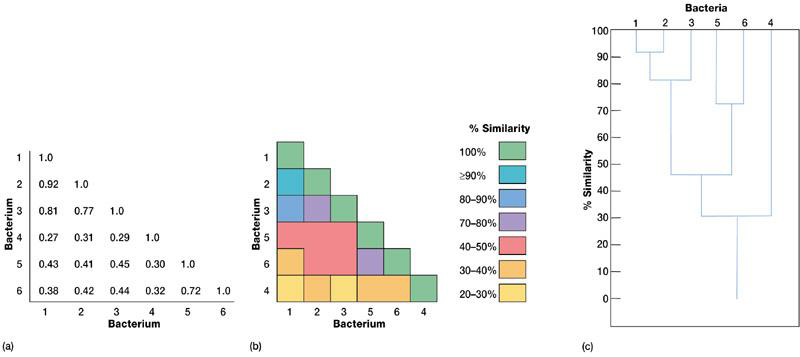
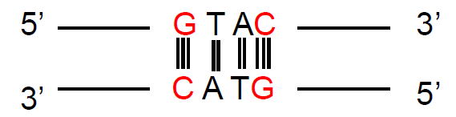
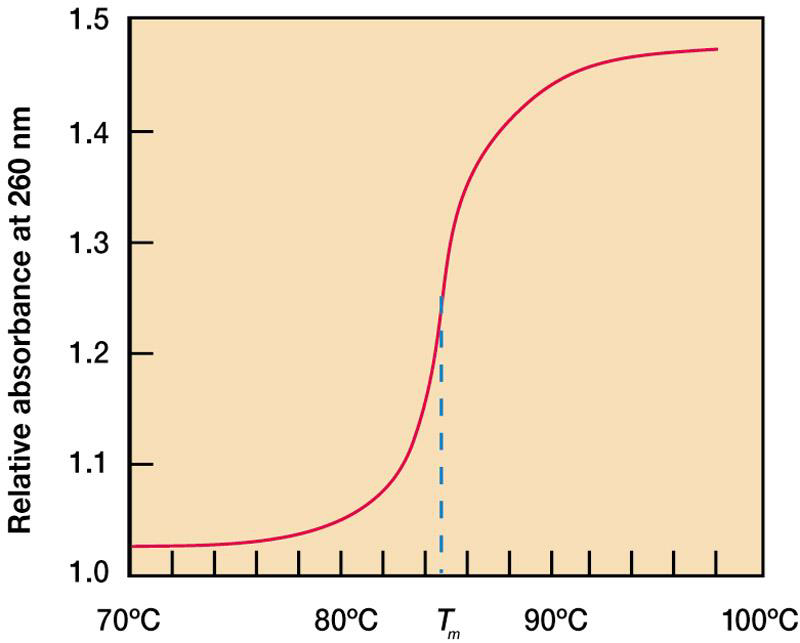
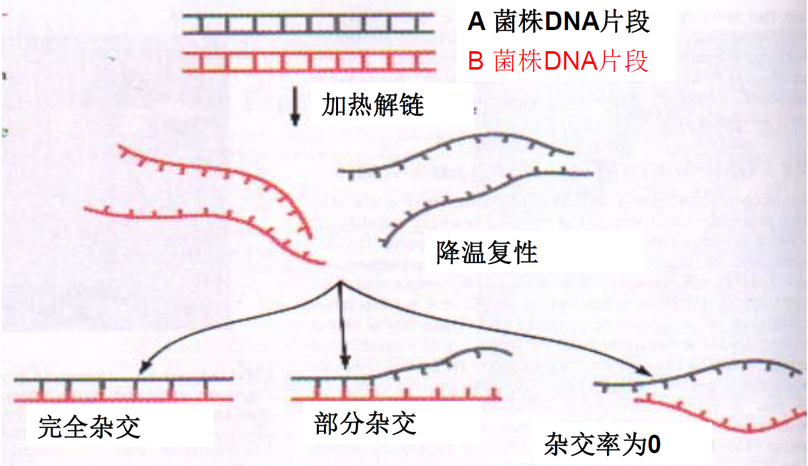
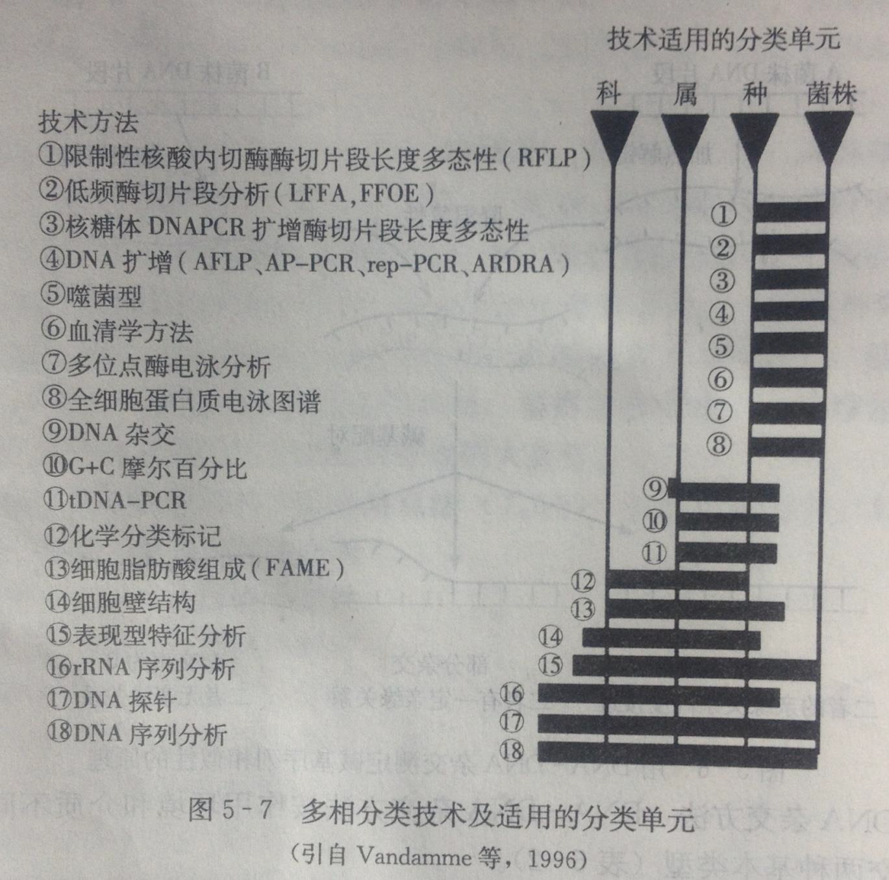

# 第一节 原核微生物的分类与鉴定

# 传统的分类体系

- 1753年：林奈

$$生物\begin{cases}动物\\植物\end{cases}$$

- 1969年：惠特克

$$五界系统\begin{cases}原核生物界\\原生生物界\\真菌界\\植物界\\动物界\end{cases}$$

>   **六界系统**:在五界系统的基础之上,增加了病毒界

## 生命三域

- 1977年：卡尔乌斯等，根据**16S rRNA和18S rRNA**序列的分析提出自然界的生命分为三域

$$生命三域\begin{cases}细菌\\古菌\\真核生物\end{cases}$$

# 16S rRNA作为进化计时器的原因

- rRNA分布于所有原核和真核生物细胞中
- **该分子在每种生物中的功能都是相同的**
- 序列变化缓慢，既有高度保守的序列区，又有可变区
- 该分子大小合适，既能提供足够的统计学信息，又便于测序工作
(5S rRNA,120bp; **16S rRNA,1542bp**; 23S rRNA,2900bp)

---

+   Carl Woese根据**16S rRNA和18S rRNA序列**的分析提出自然界的生命分为**细菌域、古菌域和真核生物域**。

---

# 微生物分类学

是一门借微生物类群的亲缘关系把它们安排成条例清楚的各种分类单元或分类群的科学

## 分类学的任务

- 分类
  +   根据微生物自建的相似性或亲缘关系，将一个微生物放在某一个分类单元中
- 鉴定
  - 是分类的操作过程
- 命名
  - 按照国际命名法规给予所鉴定的物种的一个科学的名称

# 微生物的分类单位

- 域(Domain)
- 门(Phylum or DIvision)
- 纲(Class)
- 目(Order)
- 科(Family)
- 属(Genus)
- 种(Species)

如：大肠杆菌

细菌域(Bacteria)

​	变形细菌门(Protobateria)

​		发酵细菌冈(Zymobacteria)

​			肠杆菌目(Enterobacteria) 

​				肠杆菌科(Enterobacteriales)

​					埃希氏菌属(Escherichia)

​						大肠杆菌(E.coli)

+   种是最基本的分类单位(简写sp.)
+   可在分类单元之间加入亚门、亚纲等次要分类单位.种以下又可分为亚种、变种、菌株等.

## 微生物种的概念

### 种

由一群具有高度表型相似的个体组成
DNA同源性$\geq70\%$
而且$\Delta T_m\leq5℃$
16S rRNA相似性$>97\%$的菌群为一个种

- 微生物的每种，都是有菌株(strain)构成的，**菌株**是由一个细胞或一个孢子在人工培养基上繁殖而来的群体，称为纯培养
- 在分类学上一种只能将该种内的一个典型菌株当做该种的具体代表，即该种的模式菌

+   如结核分支杆菌有毒株和无毒株
    +   Mycobacterium tuberculosis H37Rv(有致病性)
    +   Mycobacterium tuberculosis H37Ra(无致病性)

+   菌株的名称可以随意确定，一般可用字母加编号表示（字母多表示实验室，产地或特征等的名称，编号则表示序号等数字）
    +   例如
        +   Escherichia coli K12(最常用的E.coli菌株,1921年分离自美国加利福尼亚洲一白喉恢复病人的粪便)

### 亚种

在种内，有些菌株在**遗传学上关系密切**，但**表型上存在某些较小差异**，但由不足以区分为新种

**亚种**: 种的进一步细分单元,是正式分类单元中最低的分类级

在种内分成2个或2个以上的分类单位,即为亚种
如金黄色葡萄球菌的厌氧亚种
(Staphylococcus aureus subsp.anaerbius)

# 微生物的命名

- 微生物的命名按国际命名法，即**林奈**所创立的“**双名法**”
- 每一种微生物都用属与种命名，由两个拉丁词组成，属命和种命用**斜体表示**
- **属名在前，第一字母大写**。描述微生物的主要特征
- **种名在后，用小写字母**
例如：$Bacillus\quad subtili\quad \mathrm{Cohn \,1872}$
- 在一篇论文中，若同一学名多次出现，从第二次出现开始，属名可以用第一个字母表示，如$B.\,subtilis$

如果发现了一个原核生物，通过初步研究只知属于哪一个属，不知是何种时，可以用下列方式表示：
属名+sp.(单数)或spp.
	如$Nocardia\quad \mathrm{sp.}$

## 亚种(subspecies)的表示法

用三名组合表示

属名+种名+ subsp.+亚种名

$Bacillus\ cereus(subsp.)mycoides$

蜡状芽孢杆菌蕈状亚种.

>   如果命名对象是新种,需在种名后加nov.sp.(即nova species)

---

+   微生物菌种用**双名法**命名,第一个词为该菌种的**属名**,第二个词是**种名**

---

# 原核微生物的分类依据和方法

## 菌种鉴定的步骤

1. 获得该微生物的纯培养物
2. 测定一系列必要的鉴定指标
3. 查找权威性的菌种鉴定手册

**纯培养**：只有一种微生物生长的培养物，或者严格的说是从一个细胞经过培养繁殖而得到的后代

---

+   由单个微生物细胞繁殖而成的群体称为微生物的纯培养

---

## 分类方法

1. 以**表现型特征**为依据的**传统分类法**
①常规方法
②数值分类法
2. 以**遗传型特征**为依据的**分子分类法**
3. 综合**表现型和遗传型**信息的**多相分类法**

### 传统分类法

根据菌株的**形态特征**，**培养特征**及**生理生化特征**等表现性状为依据，对微生物的分类单元进行的描述分类

$$常用的表现型特征\begin{cases}形状：细胞形状，革兰氏染色，芽胞有无\\运动性：运动与否，运动方式（鞭毛，潜行，气泡），鞭毛排序\\营养和生理：产能基质（光能或化能），与氧气的关系，碳源和氮源的利用，温度，pH\\其他：色素，细胞内含物，表面层\end{cases}$$

#### 常规方法

工作量十分浩大,而且对技术熟练度的要求也很高.

+   从温血动物大肠中分离出来的细菌
    +   获得纯培养
    +   革兰氏染色
        +   $G^+$
        +   $G^-$
            +   非杆状
            +   杆状
                +   好氧
                +   兼性厌氧
                    +   不发酵乳糖
                    +   乳糖发酵产酸产气
                        +   生物学的一些测试
                            +   阳性:甲基红
                            +   阴性:柠檬酸
                                +   大肠杆菌

>   甲基红变色范围是
>   pH4.2(红色)-6.3(黄色)
>
>   酚红的变色范围为
>   pH6.3(黄)-8.0(红)
>
>   柠檬酸分解产生CO2,形成Na2CO3,使培养基碱性增强

### 数值分类法

用数理统计方法来处理细菌的各种特征，求出相似值，以其相似性的大小决定细菌在分类学中的关系，并把他们分为各个雷群

#### **两个概念**

- 表观群：指建立在表现型特征基础上的类群，一般是数值分类得到的类群
- 造作分类单位（OTU）：指分类研究的个体，一般指菌株

#### 数值分类的原则

- 采用较多的分类特征（50个以上）
- 根据等权原则，对各个分类特征不分主次，同等对待，避免了主管偏见

#### 数值分类的步骤

##### 选择菌株和待测性状

选择待测菌株应注意代表性，并包括相关已知种的模式菌株
传统分类所使用的特征均可作为数值分类的特征，单项特征树木不少于50个（如细胞的形态微一个性状，杆状为性状状态）

##### 性状编码

所测的性状状态记录转变为计算机能识别运算的符号，+特征记1，－特征记0

##### 相似性计算

将特征子良输入计算机计算相似性

##### 进行簇群分析

也叫聚类分析，按相似性系数的大小进行分群聚类，以提示各OTU间的关系

##### 输出聚类结果

#### 相似性计

在原核生物分类中,常用$S_{sm}$(匹配系数)和$S_j$,(相似系数)表示.
$$
S_{sm}=\frac{a+d}{a+b+c+d}\qquad S_j=\frac{a}{a+b+c}
$$

>   $a$为两菌株均呈正反应的性状数
>
>   $b$为菌株甲呈正反应而乙呈负反应的性状数
>
>   $c$为菌株甲呈负反应而乙呈正反应的性状数
>
>   $d$为两菌株均呈负反应的性状数.

#### 输出结果

将各运算单位(OTU)之间的匹配系数排列出矩阵图

有人提出相似值$\geq80\%$可以作为种的划分标准

#### 数值分类的应用

数值分类法是**对大量分类地位未知的菌株**进行初步分群的有效方法,测定的表现型性状多,但借助计算机软件进行处理十分方便.使用该方法对细菌菌株分群归类定种或定属时,还应测有关菌株的16S rDNA序列.

## 分子分类法

**分子分类法**是在分子水平上对生物个体的信息大分子DNA、RNA和蛋白质进行研究,将获得的遗传型信息用于对生物个体的分类鉴定.

### GC含量分析

$(G+C)\%$值是微生物(除少数以RNA为遗传物质的病毒)的一个基本遗传特征,即使个别基因突变,碱基组成也不会发生明显变化.常以DNA中鸟嘌呤(G)加胞嘧啶(C)的摩尔(mol)数的百分比来表示
$$
(G+C)\%=\frac{(G+C)(mol)}{(A+T)+(G+C)(mol)}\times 100\%
$$

+   原核微生物$DNA(G+C)mol\%$为$20-80$
    真核微生物$DNA(G+C)mol\%$为$30-60$
+   同种不同菌株$(G+C) mol\%$差异不超过$4\%$,为$2.5\%-4\%$
    同属不同种的$(G+C) mol\%$差异应小于$10\%
+   $(G+C)\%$相同或相近的微生物并非必然亲缘关系密切,也就是说,并非一定就是相同或相近的种属
    但$(G+C)\%$值有明显差异的微生物肯定不会属于同一个种

### G+C%的测定方法

#### 熔解温度(Tm)法

**原理**:当DNA样品被慢慢加热时,在260nm处吸收光谱明显增加,达到一定的温度后DNA全部解链,吸收光谱不再增加.

##### Tm值的测定

将$25℃$时DNA吸收光密度定为$A_{25}$,测定不同解链温度的光密度定为$A_t$,以$A_t/A_{25}$为纵坐标,加热温度为横坐标,作图,即可得出一条$S$形曲线,曲线的中点即为$T_m$值

DNA热变性曲线:

#### 核酸分子杂交法(DNA-DNA,DNA-rRNA,rRNA-rRNA)

测定核酸分子同源程度和不同物种间亲缘关系的有效手段

基本原理

#### 16S rDNA(18S rDNA)序列分析

1.从分离纯化的菌株培养物抽提纯化DNA,应用**通用引物**进行PCR扩增
$$
F: 5'-AGAGTTTGATCCTGGCTCAG-3'\\
R: 5'-AAGGAGGTGATCCAGCCGCA-3'
$$
95℃预变性5 min
94℃变性1 min
55℃退火1 min
72℃延伸2 min
25-30 cycles

2.电泳检测纯度与大小，PCR产物送专门的测序公司完成

3.BLAST比对获取相似片段,构建系统发育树.

## 多相分类法

采用现代分类的多种方法，综合表现型和遗传型信息对原核微生物进行分类鉴定嗯哼系统发育研究的过程。可用于所有水平上的分类单元的描述和定义

选择多相分类法应考考虑：

- 细胞全基因组背景而不仅仅考虑少数几个特征
- 对高度相似或差异很大的菌株都有效
- 快速，重复性好

### 多相分类法采用的技术方法

# 原核生物的分类系统

世界上比较权威的细菌分类系统有三个：

- 前苏联克拉西尼科夫系统
- 法国的普雷沃系统
- **美国的伯杰氏系统**

伯杰氏手册是目前进行细菌分类，鉴定的最重要的依据，特点是描述非常详细，包括对细菌各个属种的特征及进行鉴定所需做的实验的具体方法

## 《伯杰氏系统细菌学手册》第二版

伯杰氏系统细菌学手册第二版主要依据**16S rRNA序列相似性**（也<u>考虑形态和生化特征</u>）将原核微生物分为古细菌和细菌2个域下设27门，43纲，91目，253科，1306属，7029种，分为五卷本出版

第一卷,古生菌、深刻分支的和光能营养细菌

第二卷,变形杆菌

第三卷,低G+C含量的革兰氏阳性细菌

第四卷,高G+ C含量的革兰氏阳性细菌

第五卷,浮霉状菌、螺旋体、丝杆菌、拟杆菌和梭杆菌

