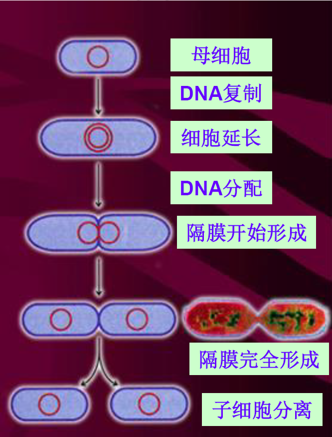

# 第二节 细菌

# 细菌的形态

是一类细胞细短，结构简单，胞壁坚韧，多以二分裂方式繁殖和水生性较强的原核生物

基本形态
	球状
	杆状
	螺旋状

# 球菌

细胞个体呈球形或椭圆形，不同的球菌在细胞分裂时会形成不同的通奸排列方式，常作为分类依据

## 单球菌 双球菌

## 链球菌

## 四联球菌

## 八叠球菌

## 葡萄球菌

# 杆菌

细胞呈杆状或圆柱形，一般其粗细（直径）比较稳定，而长度则常因培养时间、培养条件而由较大变化

杆菌是细菌中种类最多的,生产中所应用的细菌也大多是杆菌

# 螺旋状菌

## (a)弧菌

菌体只有一个弯曲，其程度不足一圈，形成C字或逗号

## (b)螺旋菌

菌体弯曲一圈以上，回转如螺旋

## (c)螺旋体菌

菌体柔软没有原生质柱状体、轴丝和外鞘组成，依靠缠绕原生质体的轴丝伸缩运动

# 特殊形状的细菌

柄细菌、肾形菌、臂徽菌、网格硫细菌、贝日阿托氏菌(丝状)、具有子实体的粘细菌等是特殊形态的细菌.

# 细菌的大小

细菌的大小测量单位是$\mu m$

- 杆菌和螺旋菌大小的表示通常用长$\times$宽来表示
- 细菌的大小受培养时间的影响，通常幼龄菌体比老龄菌体要大。同时也受测定方法的影响，测活菌的大小要比测染色体涂片的大小大$\frac{1}{3}\sim \frac{1}{4}$

# 细菌的繁殖

## 细菌的繁殖方式

细菌主要是通过**无性繁殖**产生后代

$$繁殖方式\begin{cases}裂殖(横分裂，主要)\begin{cases}同形分裂\\异形分裂\\多次分裂\end{cases}\\芽殖\end{cases}$$

### 裂殖

指一个细胞通过分裂形成两个子细胞的过程

细胞分裂过程：

1. 菌体伸长
2. 核质体分裂，横膈膜形成
3. 形成横隔壁
4. 子细胞分离

### 异型分裂

如柄细菌

游动细胞:分散(运动,无DNA复制,细胞不分裂)

带柄细胞:繁殖(不运动,DNA复制,细胞分裂)

### 多次分裂

如蛏弧菌

#### 芽殖

是指在母细胞表面先形成一个小突起，待其长大到与母细胞相仿后再相互分离并独立生活的一种繁殖方式。

如生丝微菌

# 细菌的群体形态

**菌落**(colony)是指单个微生物在适宜的**固体培养基表面或内部生长**、繁殖到一定程度形成**肉眼可见**的、有**一定形态结构**的子细胞生长群体.

当固体培养基表面众多菌落连成一片时,便成为**菌苔**(lawn).

## 菌落特征

各种细菌在一定条件下形成的菌落具有一定的稳定性和专一性特征.它是衡量菌种纯度、辨认和鉴定菌种的重要依据.

菌落特征包括大小,形状,隆起形状,边缘情况,表面状态,表面光泽,质地,颜色,透明度等.

## 平板菌落特征的描述

+   形状
    +   指菌落的外观形状
+   隆起度
    +   菌落切面形态
+   表面形态
    +   菌落表面形态,光滑,粗糙,粉状等
+   边缘
    +   菌落周边形状	
+   光泽
    +   表面有无光泽,有荚膜的菌落(称S型)表面有光泽.
    +   无荚膜的菌落(称R型)表面无光泽.
+   质地
    +   指粘性,脆性等
+   颜色
    +   正反面颜色即气生菌丝及基内菌丝颜色
+   透明度
    +   透明、半透明、不透明
+   表面菌落
    +   生长在固体培养基表面的菌落
+   深层菌落
    +   生长在固体培养基里面的菌落
+   底层菌落
    +   生长在固体培养基底部的菌落

## 细菌的液体培养

细菌在液体培养基中生长时,会因其细胞特征、相对密度、运动能力和对氧气等关系的不同,而形成几种不同的群体形态:

多数表现为浑浊,部分表现为沉淀,一些好氧性细菌则在液面上大量生长,形成有特征性的、厚薄有差异的、或环状、小片状不连续的菌膜.

## 细菌的半固体培养

1.根据明胶液化层中呈现的不同形状判断某细菌是否产蛋白酶

2.根据半固体直立柱表面和穿刺线上细菌群体的生长状态和有否扩散现象判断该菌的运动能力

# 代表菌属

## 变形细菌门

《伯杰氏系统细菌学手册》第2卷的全部内容,**是最大的一个门**,分为五个纲,记载有443属,共1500多种.

都是**革兰氏阴性**细菌,包括大多数已知的病原菌以及工农业重要的细菌.

### 根瘤菌

Rhizobium:根瘤菌属
Sinorhizobium:中华根瘤菌

根瘤菌指能与豆科植物共生，形成根瘤并固定空气中氮气供植物利用的土壤细菌

豆科植物的根的分泌物能刺激根瘤菌的生长，同时还为根瘤菌提供保护和稳定的生长条件。

+   分类
    +   快生型,中生型,慢生型
    +   分类标准
        +   酵母粉甘露醇琼脂培养基(YMA)

+   根瘤菌能利用**铵盐**和**硝酸盐**作为氮源
+   :star:在根瘤内分化为**类菌体**存在,常呈棒状、T形或Y形
    类菌体将**分子态氮**还原为**铵态氮**,转送到植物其他部位进行同化

#### 根瘤的形成机制

### 紫色光合细菌

#### 个体形态

形态多样,含菌绿素、类胡萝卜素等光合色素.呈紫、红、褐等颜色.

##### 生理

**多进行不产氧光合作用**,还有其他多种代谢类型

#### 紫色硫细菌

##### 代表属

着色菌属(红硫菌属 Chromatium)
硫螺旋菌属(Thiospirillum)

#### 紫色非硫细菌

代谢类型复杂多样，适应性强，能利用低浓度的硫化物

##### 在黑暗中

+   有机物(提供电子)→厌氧生长(化能异养)
+   无机物($H_2$提供电子)→厌氧生长(化能自养)

##### 有阳光时

+   可以进行**光能异养**
    有机物(提供碳源)+阳光(能量)→生命活动
+   也可进行光能自养
    +   
    +   代表菌属
        +   **红螺菌属(Rhodospirillum)**
        +   **固氢螺菌属(Azospirillum)**

### 化能无机营养菌

通过氧化无机物获得能量,营养上多为自养型,由无机物合成生长所需的有机物.广泛分布于自然界,对元素循环起重要作用.

+   无机物$\stackrel{氧化}{\longrightarrow}$能量
+   $CO_2+H_2O+能量\longrightarrow(CH_2O)_n$

+   代表属
    +   硫氧化菌
        +   $H_2S,S,S_2O_5^-\stackrel{氧化}{\longrightarrow}能量$
    +   硝化细菌
        +   亚硝酸菌
            +   $NH_3\longrightarrow NO_2^-+能量$
        +   硝酸菌
            +   $NO_2^-\longrightarrow NO_3^-+能量$
        +   氢细菌
            +   氧化氢气获得能量
        +   铁氧化细菌
            +   $Fe\longrightarrow Fe^{2+}+能量;Fe^{2+}\longrightarrow Fe^{3+}+能量$

### 假单胞菌

##### 特点

+   细胞直杆状或者稍微弯曲
+   端生鞭毛
+   不形成芽胞,$G^-$
+   需氧的有机营养型细菌
+   能利用广泛的有机物作为碳源和能源

##### 铜绿假单胞菌(Pseudomonas aeruginosa)'

+   铜绿假单胞菌在琼脂平板上能产生蓝绿色绿脓素,感染伤口时形成绿色脓液,常与人类泌尿器官和呼吸道感染有关

+   无荚膜,无芽孢,能运动的革兰氏阴性菌
+   形态不一,成对排列或短链状,为专性需氧菌,最适宜生长温度为37℃,致病性铜绿假单胞菌在42℃时仍能生长

### 肠道细菌

$G^-$小杆菌,周生鞭毛,不产芽孢.兼性厌氧,发酵糖类产酸,通常不产气.

#### 大肠杆菌(Escherichia coli)

+   一般不致病,但当它转移至非正常的部分时也可致病,如引起肾炎、膀胱炎和泌尿道感染
+   某些菌株能产生肠毒素,引起婴儿和幼畜严重腹泻,常作为检测饮水卫生学标准的指示菌
+   大肠杆菌是微生物学基础研究的重要材料.

### 固氮菌属

在无氮或氮贫乏的培养基上能够利用有机碳源(倾向于糖、醇或有机酸)作为能源固定大气氮

#### 特点

1、无芽胞，但有胞囊；$G^-$，具周生鞭毛

2、属化能有机营养型，能利用糖、酒精和有机酸盐生长

3、不能水解蛋白质，能以硝酸盐、铵盐、某些氨基酸、$N_2$作为氮源

---

>   褐球固氮菌的革兰氏染色形态图

## 蓝细菌门

### 概念

蓝细菌(Cyanobacteria)是细菌域的一个门;曾称蓝藻或蓝绿藻,是一类含有**叶绿素$a$**、能以水作为供氢体和电子供体、通过光合作用将光能转变成化学能、同化$CO_2$,为有机物质的光合细菌.

### 蓝细菌所含色素

1.含有叶绿素$a$,不含叶绿素$b$

2.含有$\beta-$胡萝卜素和藻胆蛋白,所以蓝细菌并非全为蓝绿色,也有黄色或褐色

### 形态结构

+   形态有**单细胞**和**丝状体**两大类
+   常有胶质外套,将多个菌体或细胞聚集在一起
+   无鞭毛,但能借助于黏液在固体表面滑行
+   细胞质中存在有气泡,利于菌体漂浮至有光处
+   在蓝细菌丝状体中间隔有比普通细胞稍大且透亮的厚壁细胞,称为异形胞(Heterocyst).

### 某些蓝细菌的异形胞

异型胞是极端分化的细胞,其主要的功能是在微氧的条件下进行**生物固氮**.

### 蓝细菌的特征

+   原核微生物,能进行光合作用
+   细胞壁与**革兰氏阴性菌**相似
+   主要进行**分裂繁殖**
    有的在母细胞内分裂形成许多球形小孢子
    也有在母细胞顶端以不对称的益缩分裂形成外生孢子
    也有以菌丝断裂释放出同源丝段
+   有些丝状蓝细菌可形成**静息孢子**作为休眠体

### 蓝细菌的生活特征

+   喜中温,但生存温度范围很宽
+   在水体富营养化的情况下
    淡水水域恶性繁殖时形成"**水华**"(Water bloom),影响自然景观,造成水体污染
    海洋里形成"**赤潮**"(Raltide),产生的藻类毒素可积累在贝类中,人们食用贝类时易发生中毒.

### 蓝细菌的代表菌属

1.**鱼腥蓝细菌属**(Anabaena)多细胞连成丝状,红辞鱼腥蓝细菌(Anabaena azollae)可固氮,可用作饲料和肥料.

2.**念珠蓝细菌属**(Nostoc):细胞球形,平行分裂形成链状丝,异形胞间生,雨后出现的地木耳就是其中一种.

3.**螺旋蓝细菌属**(Spirulina):也称螺旋藻,螺旋丝状体,含蛋白质丰富,目前己开发为保健品.

## 低GC含量革兰氏阳性细菌

归为**厚壁菌门**，包括**梭菌纲**，**芽孢杆菌纲**和**柔膜菌纲**

### 梭菌纲(Clostridium)

- 个体形态：芽胞比菌体宽度大，使菌体呈鼓槌状或梭状
- 生理：严格厌氧，部分菌产毒素，部分菌可用于生产丁酸
- 代表种：肉毒梭菌，破伤风梭菌

### 代表菌种

#### 肉毒梭菌

- 肉毒梭菌是一种生长在缺氧环境下的细菌，其产生的肉毒素是目前毒性最强的毒素之一
- 人们食入和吸收这种毒素后，神经系统将遭到破坏，出现头晕，呼吸困难和肌肉乏力等症状

>    瘦脸针瘦脸的原理
>
>   瘦脸针注射的药物就是肉毒素,它可以抑制神经未梢释放乙酰胆碱,导致神经递质的传递失效,使肌肉暂时失去控制,继而萎缩而达到瘦脸的效果.

#### 破伤风梭菌

- 破伤风梭菌(Clostridium tetani)是引起破伤风的病原菌，大量存在与人和动物的肠道中，由粪便污染土壤，经伤口感染引起疾病
- **专性厌氧菌**，潜伏期一般为7－14天
- 产生外毒素

### 芽孢杆菌纲(包括芽胞杆菌目和乳杆菌目)

#### 芽胞杆菌属(Bacillus)

- 个体形态
    - 不同菌种,其大小差别很大,$G^+$,有鞭毛
        芽孢不使得菌体膨大, 大小、形状、着生位置可作分类依据.
- 对氧需求
    - 严格好氧或微好氧
- 生活环境
    - 广泛分布于土壤、水体、植物等
- 代表种
    - 枯草芽孢杆菌,炭疽芽孢杆菌,苏云金芽孢杆菌,蜡状芽孢杆菌,嗜热脂肪芽孢杆菌

#### 乳酸杆菌属(Lactobacillus)

小杆菌,不运动,不产芽胞,$G^+$.兼性厌氧,许多种能进行同型乳酸发酵,故有时统称为乳酸菌.

#### 葡萄球菌(Staphylococcus)

+   共同特征
    +   $G^+$细胞壁、球形、无鞭毛,不运动,无芽胞,菌体之间多形成有规律的排列
    +   兼性厌氧

+   葡萄球菌属(Staphylococcus)
    +   聚集成葡萄状.有氧条件下发酵葡萄糖产乙酸,无氧下产乳酸

金黄色葡萄球菌(Staphylococcus aureus)是引起人类葡萄球菌病、肺炎、中毒性休克症等疾病的病原菌,还可引起局部化脓,近年来,已发现多株具有广泛耐药性的金黄色葡萄球菌.

### 柔膜菌纲

#### 支原体属(Mycoplasma)

##### 分类

厚壁菌门,柔膜菌纲.虽然**无细胞壁**,但16SrRNA分析表明与梭菌、芽孢杆菌有较近亲缘关系.

##### 形态

无细胞壁,细胞柔软、形态多变,能通过细菌滤器,寄生于动物体内,也能在人工培养基上生长,菌落呈典型煎鸡蛋形状.是能够人工培养的最小细菌.

##### 分布

支原体分布很广,动植物、土壤甚至堆肥中均可分离到;支原体常引起呼吸道和生殖道疾病,还引起畜禽的多种主要疾病.肺炎支原体已被确定是引起人类非典型性肺炎的主要病原菌.

---

芽胞杆菌属和梭菌属的主要区别在于

+   前者有鞭毛,后者无鞭毛

+   **前者芽胞形成后不使菌体膨大,后者膨大**

+   前者厌氧,后者好氧

+   前者形成芽胞,后者无芽胞

---

大肠杆菌、根瘤菌、固氮菌等属于**变形细菌门**,芽胞杆菌属于**厚壁细菌门**.

---

## 高GC含量革兰氏阳性细菌

指细胞的GC含量在$50\%$以上的细菌。由**放线菌门**组成，主要有链霉菌属，微球菌属，诺卡氏菌属，分支杆菌属，弗兰克氏菌属等

### 概念

典型的放线局能产生分枝状的丝状体或菌丝，是具**多核的单细胞原核生物**,$G^+$，形成无形孢子

> 虽然有菌丝，但是是细菌

### 形态与结构

- **单细胞**，大多由分枝发达的菌丝组成
- **菌丝直径与杆菌类似**，约$1\mu m$
- **基内菌丝**或称营养菌丝
    - 生于培养基内，吸收营养，有的产色素使培养基呈现颜色
- **气生菌丝**或称二级菌丝
    - 伸向空间,形态各异
- **孢子丝**
    - 形态和排列各异,有波曲,螺旋,轮生等,形成分生孢子
- **分生孢子**
    - 形状、表面纹饰、颜色各异.

---

链霉菌不同特征的孢子丝形态

### 基本特点

- 分支丝状体,具有**多核的单细胞原核微生物**
- 主要以形成**无性孢子**的形式繁殖,也可靠菌丝片段繁殖.
- 多数好氧,$G^+$
- 不运动
- 大部分腐生菌,少数寄生菌,也有致病菌

### 菌落形态

1.能产生大量分枝和气生菌丝的菌种(如链霉菌Streptomyces)

早期菌落类似细菌,后期由于气生菌丝和分生孢子的形成而变成表面干燥,粉粒状并常有辐射状皱褶.菌落质地较致密,与培养基结合紧密,小而不蔓延,不易挑起并常有各种不同的颜色.

2.不能产生大量菌丝体的菌种(如诺卡氏菌Nocardia)

菌落一般只有基质菌丝,结构松散,粘着力差,粉质,易于挑起,也有特征性的颜色.

### 分布特点及与人类的关系

- 放线菌常以孢子或菌丝状态及其广泛存在于自然界，土壤中最多，代谢产物(**土腥味素**)使土壤具有特殊的**泥腥味**
- 抗生素的主要生产菌(链霉素，红霉素，四环素等)
- 许多酶和微生物的生产菌
- 甾体转化，石油脱蜡，污水处理
- 某些与植物共生固氮
- 少出寄生型放线菌可引起人。动物，植物

### 印片法观察链霉菌气生菌丝和孢子丝

#### 代表类群

#### 诺卡氏菌属

在固体培养基上生长时,只有基质菌丝,没有气生菌丝或只有很薄一层气生菌丝,靠菌丝断裂进行繁殖.

#### 链霉菌属

在固体培养基上生长时，形成发达的基质菌丝和气生菌丝，气生菌丝生长到一定时候分化产生孢子丝

链霉菌的气生菌丝和基质菌丝有各种不同的颜色,有的菌丝还产生可溶性色素分泌到培养基中使培养基呈现各种颜色.

链霉菌的许多种类产生对人类有益的抗生素.如链霉素、红霉素,四环素等.

#### 小单孢菌属

菌丝体纤细,**只形成基质菌丝**,不形成气生菌丝,在基质菌丝上长出许多小分枝,**顶端着生一个孢子**,多产抗生素.

如庆大霉素就是由降红小单孢菌(M.purpurea)和棘孢小单孢菌(M.echinospora)产生的.

#### 分枝杆菌属

- 结核分支杆菌(),俗称结核杆菌，是引起结核病的病原菌，可侵犯全身各器官，但以肺结核最多
- 细长略带弯曲的杆菌，细胞壁脂质含量较高，约占干重的$60\%$影响营养物质的吸收，故生长缓慢。在一般培养基中**每分裂1代需时18-24h**,营养丰富时只需5h
- 专性需氧，最适温度为37℃

#### 棒杆菌属

细胞杆状,直杆或略弯曲,好氧或兼性好氧,动植物致病菌,如:白喉棒杆菌(Corynebacterium diphttheiae)是人类白喉病的病原菌.

#### :star:弗兰克氏菌属

有基内菌丝,无气生菌丝.**能和非豆科植物共生,形成根瘤,有固氮作用**

#### 双歧杆菌属

多种形态的杆菌,易分叉.厌氧生长,发酵葡萄糖产乳酸和乙酸.菌剂饮料具有保健功能.

---

+   放线菌一般为丝状，因此~~属于真核微生物~~

>   放线菌是细菌,属于原核微生物

---

## 其他细菌

### 螺旋体

- 分类

	螺旋体门
- 形态

	$G^-$菌体细长弯曲呈螺旋状
	细胞壁柔软，无鞭毛，靠轴丝伸缩运动
- 生活环境

	腐生型和寄生型两种。前者生活于污水中，后者引起人畜疾病，如梅毒，回归热，钩端螺旋体
- 代表属

	螺旋体属(Spirochaeta)

## 立克次氏体(Rickettsia)

- 分类

	变形细菌门，$\alpha$亚门
- 形态

	细胞壁 $G^-$
- 生活环境

	 动物活细胞专性寄生，不能通过细菌过滤器，引起斑疹伤寒

## 衣原体

- 分类

	衣原体门
- 形态

	细胞壁 $G^-$
- 生活环境

	动物活细胞专性寄生，能通过细菌过滤器，引起沙眼

## 拟杆菌门

$G^-$，在系统发育上与其他多数G^-菌相差胶原，严格厌氧

- 拟杆菌属

	严格厌氧，杆状，可分解糖，引起人和动物疾病
- 噬纤维菌属

	适于在70－75℃该问中生活，在分子生物学研究中，做PCR用的Taq DNA多聚酶即从此菌中获得
- 植热袍菌属，植热腔菌属

	在系统发育上独立鱼其他所有细菌，是真细菌中进化最慢的一个分支，极端嗜热，严格厌氧

