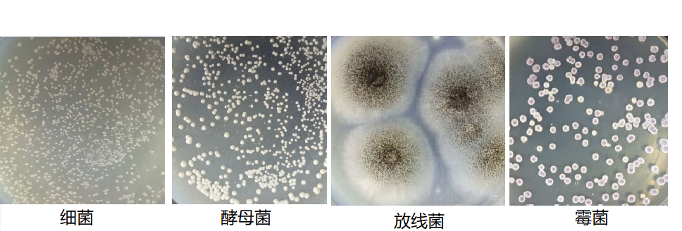

# 真核微生物

凡是细胞核具有核膜、核仁，能进行有丝分裂、细胞质中存在线粒体或同时存在叶绿体等细胞器的微小生物，都称为**真核微生物**

# 真菌的一般形态

## 菌丝和菌丝体

**菌丝(hypha)**是构成真菌营养体的基本单位,由细胞壁包被的一种管状细丝,大都无色透明,宽为3~10微米.

**菌丝体(Mycelium)**由分枝的菌丝在条件适宜时不断从顶端伸长、相互交叉而形成

+   菌丝体
    +   营养菌丝体
    +   气生菌丝体

+   菌丝结构
    +   无隔膜菌丝
        +   低等真菌,如毛霉,根霉等
    +   有隔膜菌丝
        +   高等真菌,如青霉菌,曲霉菌等

## 菌丝的特异化结构

菌丝体在长期进化过程中,因其自身的生理功能和对不同环境的高度适应,明显发展出各种特化的构造

+   菌丝的特异化
    +   菌核
    +   菌环和菌网
    +   子座
    +   子实体
    +   匍匐枝和假根
    +   吸器
    +   附着胞
    +   附着枝

### 匍匐菌丝

又称**匍匐枝**,真菌在固体基质上形成与表面平行、具有延伸功能的菌丝.

### 假根

Rhizopus(根霉属)等低等真菌匍匐枝与固体基质接触处分化出来的根状结构,具有固着和吸取养料等功能.

### 吸器

某些寄生性菌物从菌丝上生出的旁枝,可侵入寄主细胞内**吸收宿主细胞的养料**.

### 附着胞

寄生于植物的真菌菌根孢子萌发形成的芽管或老菌丝顶端的膨大部分,可以牢固地附着在宿主的表面.

### 附着枝

若干寄生真菌由**菌丝细胞生出1~2个细胞的短枝**，将菌丝附着于宿主体上

### 菌核

由菌丝团组成的一种**休眠体**,同时又是**糖类和脂类等营养物质的储藏体**,有较强的**抵抗不良环境**的作用,如药用的茯苓、麦角.

### 菌环和菌网

**捕虫类真菌**常由菌丝分枝组成环状或网状组织来**捕捉线虫类**原生动物,然后从环上或网上生出菌丝侵入线虫体内吸收养料.

### 子座

菌丝或菌丝与寄主组织构成的,具有垫状、柱状、棍棒状、头状等多种形状.有抗逆能力,但**主要是形成产孢子结构**.

### 子实体

由真菌的**营养菌丝和生殖菌丝**缠结而成的具有一定形状的产孢结构,**能产生有性孢**

结构复杂的子实体称为子囊果

#### 子座与子实体的区分

+   子座是某些高等真菌（如子囊菌）的**子实体下面或周围菌丝组成的紧密组织**
+   **子座是容纳子实体的褥座**（子座，名称stroma，希腊文，为褥垫、床之意），常从菌核上发生，是真菌从营养阶段到繁殖阶段的一种过渡形式
+   而**子实体是高等真菌产生孢子的结构**
    子囊果就是子囊菌的子实体

## 酵母状细胞

+   圆形或卵圆形单细胞，不形成菌丝
+   有时芽殖后子细胞不脱离母细胞而形成分枝状假菌丝

## 真菌的菌落

### 霉菌菌落特征

菌落大、疏松、不透明，多呈绒毛状、絮状或网状等，不同的霉菌孢子含有不同的色素，所以菌落呈红、黄、绿、青绿、青灰、黑、白、灰等多种颜色

### 酵母菌落特征

菌落较大且厚，表面湿润，粘稠并易于挑取，边缘呈整齐、缺刻或带丝状，多为乳白色，少数呈红色。

