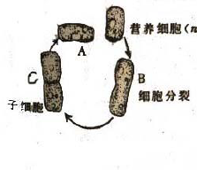
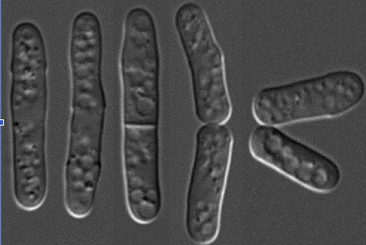
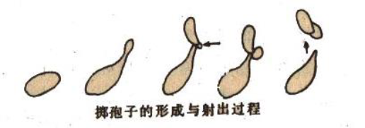
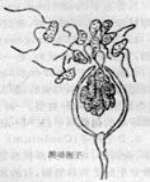
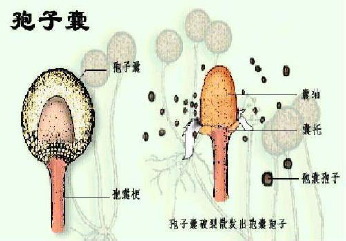
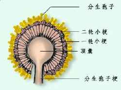
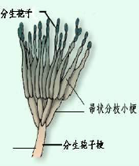

# 真菌的繁殖

# 无性繁殖

+   真菌的无性孢子
    +   游动孢子
    +   胞囊孢子
    +   分生孢子
    +   厚垣孢子
    +   节孢子

## 酵母菌的无性繁殖

### 芽殖

酵母菌进行无性繁殖的主要方式

### 裂殖

少数酵母(如裂殖酵母)具有与细菌相似的二分裂繁殖方式

### 产生掷孢子

掷孢酵母属

### 厚垣孢子

（假丝酵母）等无性孢子

### 丝状真菌的无性孢子

#### 游动孢子

产生于由菌丝膨大而形成的孢子囊内。（如卵菌门的水生真菌）

#### 胞囊孢子(静孢子)

着生在孢子囊内的孢子。气生菌丝或孢子囊梗顶端膨大，并在下方生出横隔与菌丝分开而形成孢子囊（如根霉）。

#### 分生孢子

子囊菌和半知菌类的无性孢子，生于细胞外的孢子，故又称外生孢子。 由特异化的菌丝顶端形成分生孢子梗。(曲霉、青霉)

#### 厚垣孢子

