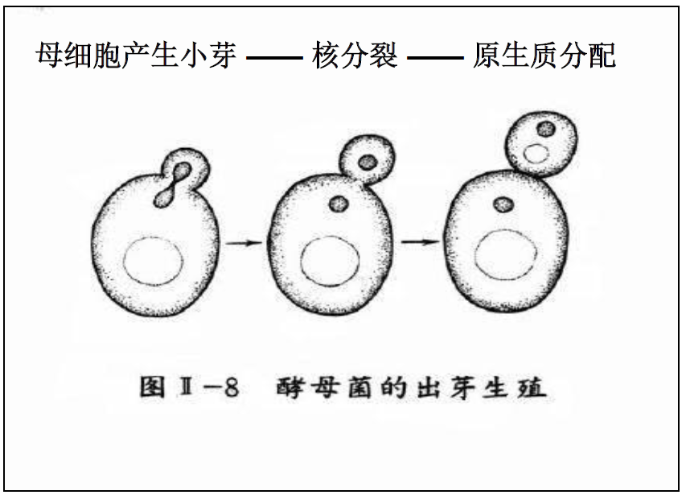

# 真菌的繁殖

# 无性繁殖

+   真菌的无性孢子
    +   游动孢子
    +   胞囊孢子
    +   分生孢子
    +   厚垣孢子
    +   节孢子

## 酵母菌的无性繁殖

### 芽殖

酵母菌进行无性繁殖的主要方式

### 裂殖

少数酵母(如裂殖酵母)具有与细菌相似的二分裂繁殖方式

### 产生掷孢子

掷孢酵母属

### 厚垣孢子

（假丝酵母）等无性孢子

### 丝状真菌的无性孢子

#### 游动孢子

产生于由菌丝膨大而形成的孢子囊内。（如卵菌门的水生真菌）

#### 胞囊孢子(静孢子)

着生在孢子囊内的孢子。气生菌丝或孢子囊梗顶端膨大，并在下方生出横隔与菌丝分开而形成孢子囊（如根霉）。

#### 分生孢子

子囊菌和半知菌类的无性孢子，生于细胞外的孢子，故又称外生孢子。 由特异化的菌丝顶端形成分生孢子梗。(曲霉、青霉)

#### 厚垣孢子

又称厚壁孢子,由菌丝中间(少数在顶端)的个别细胞膨大,原生质浓缩和细胞壁变厚形成的休眠孢子,寿命长.(总状毛霉Mucor racemosus)

#### 节孢子

又称粉孢子

菌丝上长出许多横隔,从分隔处断裂,有些真菌菌丝断裂后产生的较为整齐的孢子.(白地霉)

# 有性繁殖

通过不同性别的细胞或菌丝结合后产生不同类型的**有性孢子**.

+   有性繁殖三过程
    +   质配  N+N
    +   核配 2N
    +   减数分裂 N

**质配**:两个性细胞接触后进行结合作用,细胞质融合到一个细胞内

**核配**:质配后经过一段时间,两个细胞核也结合成为双倍体核

**减数分裂**:形成单倍体的有性孢子.

## 真菌的有性孢子

+   卵孢子
+   接合孢子
+   子囊孢子
+   担孢子

### 卵孢子

有性结构及其形态特征:由大小不同的配子囊结合后发育而成.

小配子囊称**雄器**
大配子囊称**藏卵器**.

**所属分类地位**:卵菌纲.

1、藏卵器中的原生质与雄器配合以前,收缩成一个或数个原生质团,称**卵球**.

2、当雄器与藏卵器配合时,**雄器中的细胞质与细胞核通过受精管而进入藏卵器与卵球配合**,卵球生出外壁即成为**卵孢子**.

### 接合孢子

**有性结构及其形态特征**:是由菌丝生出的结构大小相似、形态相同或略有不同两个配子囊接合后发育而成.

**所属分类地位**:接合菌纲

#### 分类

根据产生接合孢子的菌丝来源或亲和力不同,可分为

**同宗配合(Hemothallism)**:雌雄配子囊来自同一个菌丝体,当两根菌丝靠近时,便生出雌雄配子囊,经接触后形成接合孢子的过程.

**异宗配合(Heterothallism)**:不同菌系的菌丝相遇后才能形成接合孢子,这两种有亲和力的菌系在形态上并无区别,通常用"+"或"-"来表示.

#### 接合孢子的形成过程

1、两个菌丝相遇伸出侧枝,形成原配子囊

2、原配子囊接触后各自产生一个横隔,前端细胞为配子囊(如图箭头所示),基部为配子襄柄

3、配子囊在连接处破裂,两个细胞核与细胞质相互配合,同时外部形成厚壁,即为接合孢子

#### 根霉的接合孢子形态

### 子囊孢子

子囊孢子形成于子囊中,形成子囊孢子是子囊菌的主要特征.

1.在菌丝上分化出**雌性的产囊体**和**雄性的雄器**

2.两性细胞接触后,发生**质配**,产囊体上形成分枝的菌丝,即**产囊丝**

3.多对核进入产囊丝发生核配,形成**双倍体核**

4.经过**一次减数分裂和一次有丝分裂**,形成8个单倍体核

#### 子囊果

在子囊和子囊孢子发育过程中,原来的雄器和产囊体下面的细胞生出许多菌丝,它们有规律地将产囊丝包围,形成子囊果.

##### 子囊果的三种类型

+   闭囊壳
    +   完全封闭的圆球形
    +   

+   子囊壳
    +   孔口不完全封闭
    +   

+   子囊盘
    +   开口呈盘状
    +   

#### 各种类型的子囊孢子和子囊

子囊孢子成熟后即可释放出来，子囊孢子的形状、大小、颜色、纹饰等差别很大，多用来作为子囊菌的分类依据。

### 担孢子

担孢子是担子菌产生的有性孢子，因着生在担子上而得名。**两性器官多退化，以菌丝结合方式产生双核菌丝**。

+   担子菌双核菌丝的锁状联合
+   

1.担孢子萌发产生单倍体初生菌丝,**初生菌丝联合后产生双核菌丝**

2.在**两细胞核之间菌丝侧生一个钩状短枝**,一个核进入短枝内,另一个留在菌丝内

3.**两个核同时进行一次有丝分裂,形成4个核**

4.短枝中的**一个子核退回至菌丝尖端;一核趋向前端,产生横隔**

5.短枝与菌丝接触处细胞壁溶解,核回到菌丝

1.**核配**:担子菌生长到一定时期,双核菌丝顶端细胞膨大为担子,担子内两个不同性别的核配合,产生一个二倍体细胞核(2N)

2.**减数分裂**:形成4个单倍体核(N)

3.**担孢子梗**:在担子上部突出4个小梗

4.**担孢子**:一个核进入一个小梗,小梗顶端膨大长成担孢子,小梗与担孢子之间产生横隔

担孢子多为圆形、椭圆形、肾形和腊肠形.担子的形态因担子菌种类而异,是担子菌分类依据之一.

# 准性生殖

**准性生殖**是真菌在无性繁殖过程中的一种遗传性状重新组合的机制，即**不经过减数分裂就能导致基因重组的生殖过程。**

1.**质配**:异质菌丝接合或同质菌丝内核发生突变,形成**异核菌丝体**
2.**核配**:异质核融合,形成一个**异核二倍体核**
3.**有丝分裂交换与单倍体化**:有丝分裂交换形成二倍体分离子,染色体逐步减少,形成单倍体分离子.

准性生殖是丝状真菌,特别是不产生有性孢子的丝状真菌如半知菌类特有的遗传现象.

# 真菌生活史

真菌从一种孢子开始，经过一定的生长发育，最后又产生同一种孢子。这一过程包括**无性繁殖和有性繁殖**两个阶段。

## 无性繁殖阶段

真菌的菌丝体(营养体)在适宜条件下产生无性孢子,无性孢子萌发形成新的菌丝体,如此重复多次.

## 有性繁殖阶段

真菌生长发育后期,在一定条件下,开始发生**有性繁殖**,即从菌丝体上分化出特殊的性器官(细胞),经过质配、核配,形成双倍体细胞核,最后经减数分裂形成单倍体孢子,该类孢子萌发再形成新的菌丝体.

