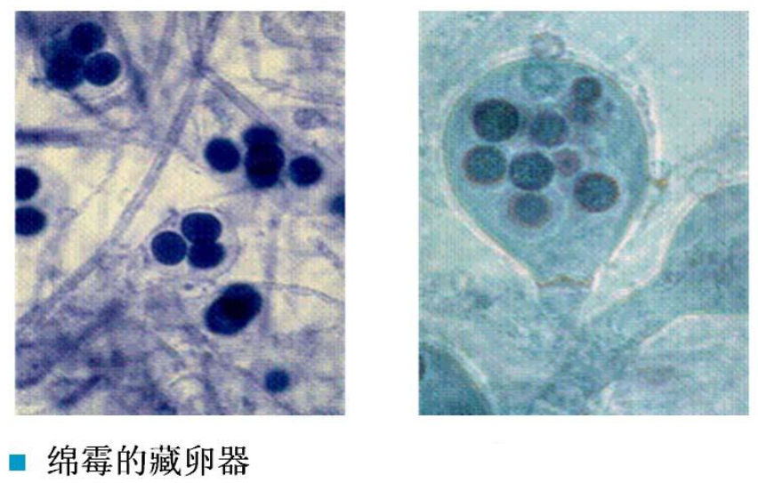
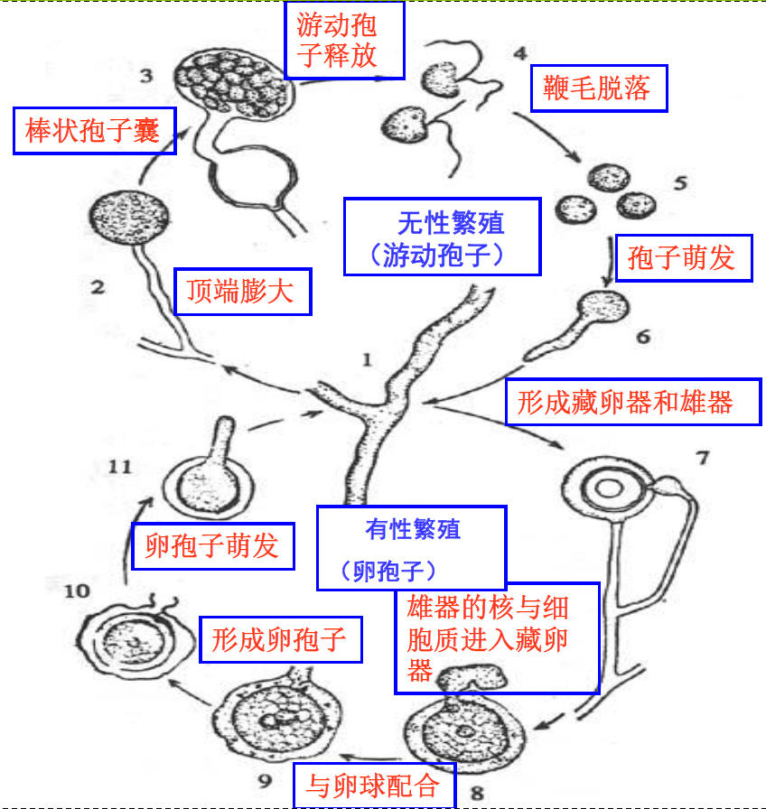
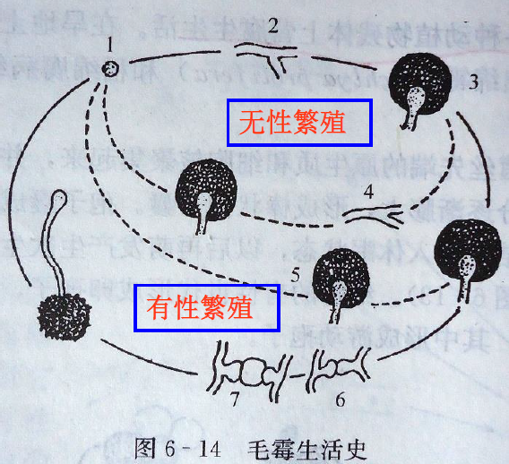
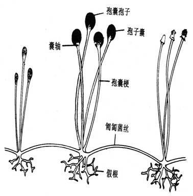
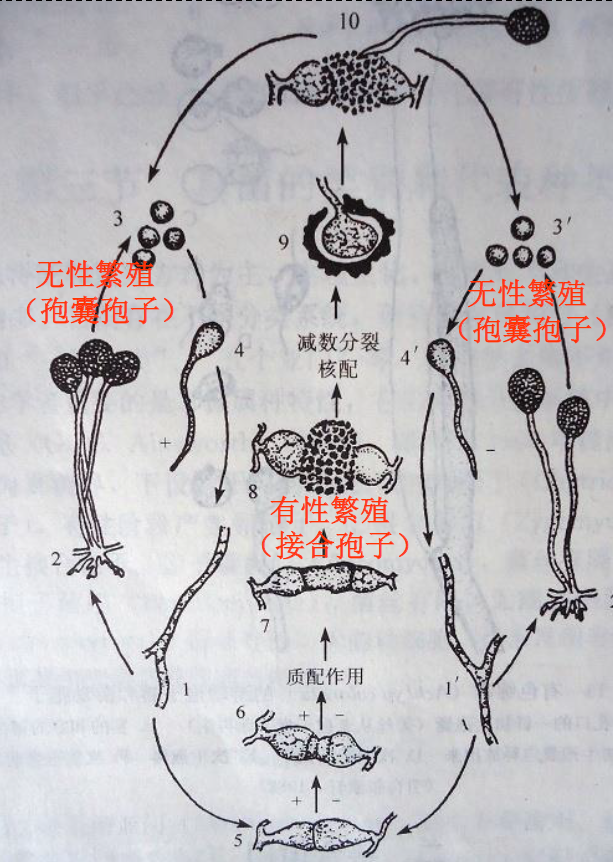

# 真菌的类别和代表种类

# 真菌的分类

1966年Ainsworth(安斯沃思)提出:**真菌独立为真菌界**(分类以**形态特征**和**繁殖方式**为主)

+   菌
    +   原生动物界
        +   肿根菌门
    +   藻界
        +   卵菌门
    +   真菌界
        +   壶菌门
        +   接合菌门
        +   子囊菌门
        +   担子菌门
        +   半知菌门

# 真菌的代表种类

## 根肿菌门

###　特征

**生活环境**:寄主细胞内专性寄生菌

**形态**:营养体为原生质团

**无性繁殖**:游动孢子

**有性繁殖**:休眠孢子囊

### 代表属

**根肿菌属(Plasmodiophora)**:是病原菌,多寄生于高等植物的根部和茎部细胞内,引起植物根部肿大,故称根肿菌,可引起十字花科植物根肿病.

## 卵菌门

### 特征

**生活环境**:大多为水生,营腐生或寄生,引起植物病害

**形态**:菌丝无隔膜

**无性繁殖**:游动孢子

**有性繁殖**:卵孢子.

### 代表属

**绵霉(Achlya)**:可水生、两栖、陆生,营腐生,某些种是危害水稻的绵腐病菌.营养体是单细胞个体.

**腐霉属(Pythium)**:寄生于藻类或显花植物上,有的可引起植物幼苗猝倒病.

**疫霉属(Phytophthora)**:是病原菌,主要危害植物根颈基部,引起芽腐、叶枯等症状.代表种为致病疫霉(P.infestans),其可引起马铃薯晚疫病,该病害曾引起爱尔兰大饥荒.

**霜霉属(Peronospora)**:是病原菌,可引起多种经济作物的霜霉病.常见的寄生霜霉可引起十字花科植物霜霉病.

### 卵菌门的生活史

---

+   **Achliya(绵霉)**产生的无性孢子可以在水中游动

---

## 壶菌门

### 特征

**形态**:营养体为单细胞,呈球形或近球形

**生活环境**:可以水生,腐生,少数为寄生

**无性生殖**:游动孢子

**有性生殖**:休眠孢子囊

### **代表属**

节壶菌属(Physoderma),玉蜀黍节壶菌(Pmaydis)是常见种,可侵染玉米,引起玉米褐斑病.

## 接合菌门

### 特征

**形态**:菌丝无隔

**生活环境**:**接合菌纲**营腐生或寄生,菌丝体发达,**毛菌纲**营寄生,菌丝体不发达

**无性繁殖**:不游动的孢囊孢子

**有性繁殖**:接合孢子;

### 代表属

#### 毛霉(Mucor)

毛霉具有分解蛋白质和淀粉的能力,是用于制造**腐乳、豆豉**等食品及酿造业的重要菌种.
也可引起蔬菜、水果发生腐败.

##### 形态

毛霉生长迅速,产生发达的菌丝.菌丝一般白色,不具隔膜,不产生假根,是单细胞真菌.

##### 无性繁殖

孢囊孢子,孢子囊黑色或褐色,表面光滑.

##### 有性繁殖

接合孢子

#### 根霉(Rhizopus)

与毛霉的主要区别——根霉有假根和匍匐菌丝

根霉经常出现在淀粉质食品上,引起馒头、面包等变质.分解淀粉能力强,在代谢过程中能产生淀粉酶和糖化酶,是**酿造业中著名的生产菌种**.

#### 角枝根霉(R.stolonifer)

##### 无性繁殖

孢囊孢子,孢子囊黑色或褐色,表面光滑.

##### 有性繁殖

接合孢子

---

+   根霉无性繁殖产生**胞囊孢子**,有性繁殖产生**接合孢子**.其与毛霉的主要区别在于**根霉具有匍甸枝**和**假根**两种特异化菌丝结构

+++

## 子囊菌门

### 特征:

无性繁殖主要是产生分生孢子，少数以芽殖、裂殖为主要繁殖方式。
有性繁殖产生子囊孢子。子囊孢子产生于子囊内，子囊一般被包被于子囊果中。

