# 病毒的基本属性

## 定义

病毒是一类由核酸和蛋白质等少数几种成分组成、必须在活细胞内寄生并以复制方式增殖的"非细胞型"的微生物,其本质是一类含DNA或RNA的特殊遗传因子.

## 特点

+   个体极小,一般用nm来衡量,必须借助电子显微镜才能看到
+   无细胞结构,主要成分是蛋白质和核酸,又称"分子生物"
+   只有DNA或RNA一种核酸
+   以核酸和蛋白质等"元件"的装配实现其大量繁殖,无个体的气长现象
+   既无产能酶系,也无蛋白质和核酸合成酶系
+   离体条件下以无生命的大分子状态存在,保留潜在的感染能力
+   对一般抗生素不敏感,对干扰素敏感

---

病毒在离体条件下,其潜在的感染能力很容易因变性而失活:
1.病毒对温度很敏感,在$55-60℃$时,其悬液几分钟内就变性
2.紫外线、$\gamma$射线、$X$射线的照射都能使病毒变性失活
3.工作中常用甲醛来消毒污染了病毒的器具和空气

>   病毒显著区别于其他生物的特征是独特的繁殖方式

## 病毒的形态和大小

### 病毒的形状

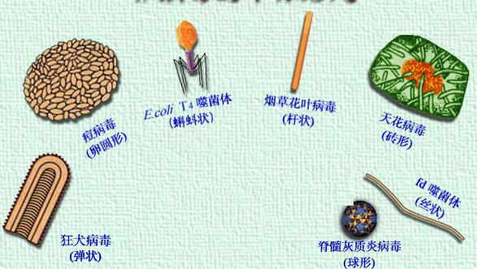

+   病毒一般呈球形或杆形,也有呈卵圆形、砖形、丝状和蝌蚪状.**但以近似球形的多面体和杆状为主**

+   动物病毒多呈球形、卵圆形或砖形
+   植物病毒多呈杆形或丝状,少数为球状
+   细菌病毒即噬菌体多为蝴蚪状,也有为球状和丝状

### 病毒的大小

非常微小,以$nm$表示,通常是$100nm$左右.较大的有潘多拉病毒,长度约为$14m$,较小的菜豆畸矮病毒颗粒直径为$9\sim 11nm$

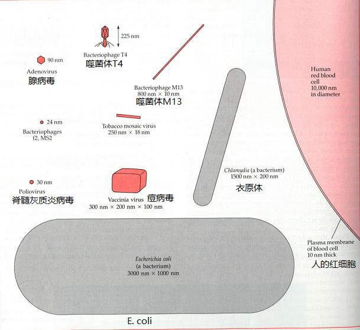

## 病毒的结构和化学成分

### 典型病毒粒子的构造

病毒主要由**壳体**(capsid)和**核酸**两部分组成.

壳体和核酸统称为核衣壳(nucleocapsid).有的病毒在核衣壳外还有**包膜**和刺突.

>   病毒粒子:成熟的或结构完整,有感染性的病毒个体.

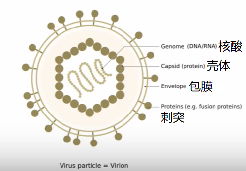

### 病毒粒的壳体结构

#### 螺旋对称

壳粒有规律地沿着中心轴(核酸-sSRNA)呈螺旋排列,核酸位于壳体的螺旋状结构中.

粒子形态为线状、直杆状和弯曲杆状.

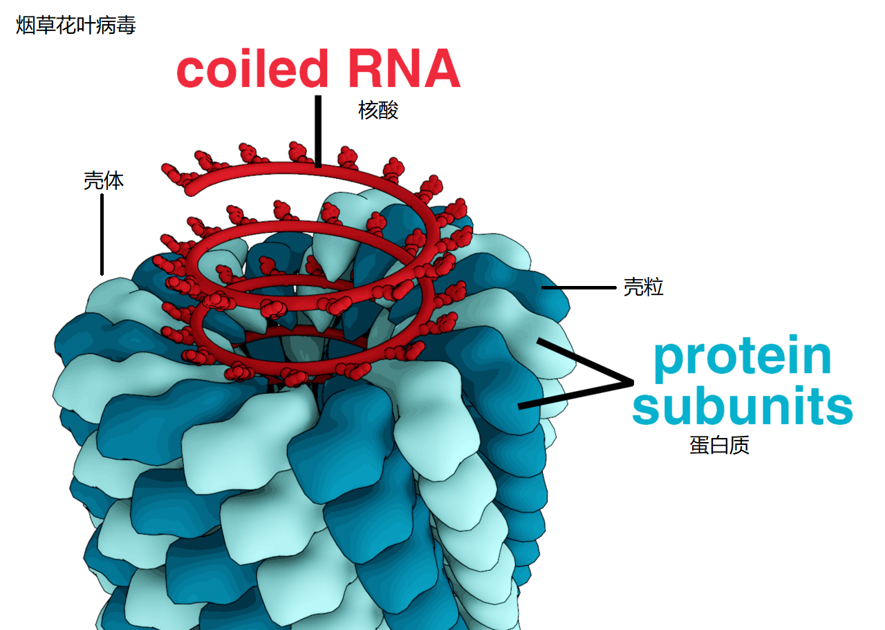

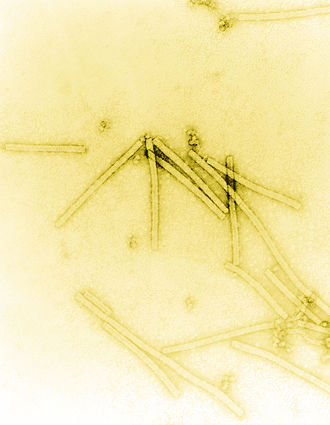

#### 二十面体对称

蛋白质亚基围绕具立体对称的正多面体的角或边排列,进而形成一个封闭的蛋白质的鞘.

壳体一般为二十面体.

>   腺病毒(dsDNA)

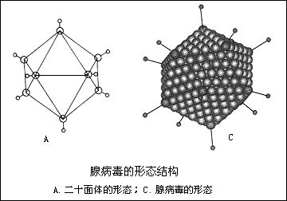

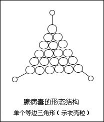

#### 符合对称

壳体既有螺旋对称，又有二十面体对称。

具有复合对称结构的典型例子是有尾噬菌体(tailed phage),其壳体由头部和尾部组成.包装有病毒核酸(dsDNA)的头部通常呈二十面体对称,尾部呈螺旋对称.

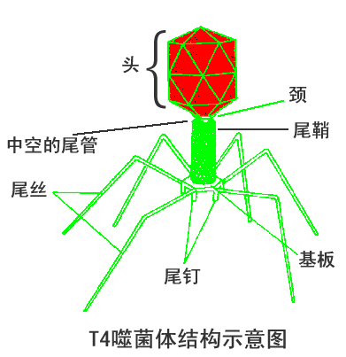

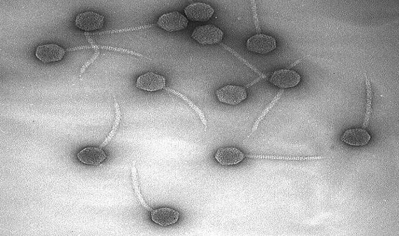

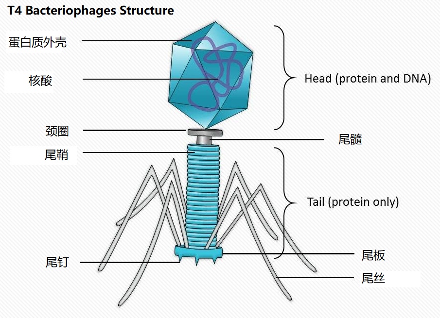

### 病毒的包膜结构

病毒包膜的基本结构与生物膜相似,含**蛋白质或类脂双层膜**.
包膜中的**类脂来自宿主的细胞膜**;

刺突($spike$):包膜或核衣壳上的突起.

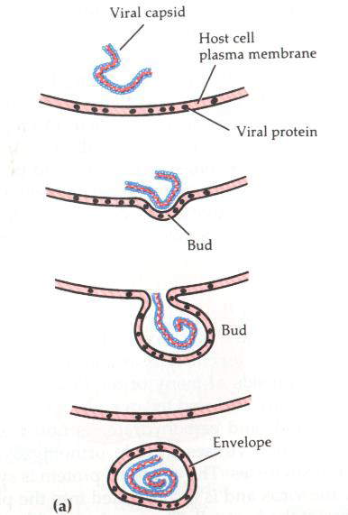

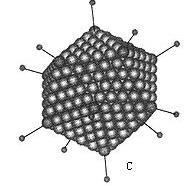

### 病毒的化学组成

#### 病毒蛋白

**功能**：主要在构成病毒结构、病毒的侵染与增殖过程中发挥作用.

+   **构成病毒粒子外壳**,保护病毒核酸免受核酸酶及其他理化因子的破坏;
+   决定病毒感染的特异性,与易感细胞表面存在的受体具特异性亲和力,促使病毒粒子的吸附;
+   **决定病毒的抗原性**,并能刺激机体产生相应的抗体;
+   **某些病毒蛋白质是一些具有特殊功能的酶**,如噬菌体中的溶菌酶,破坏宿主细胞壁与细胞膜.

#### 病毒核酸

核酸是病毒的遗传物质,控制着病毒的增殖及对宿主的感染性.

+   一种病毒只含有一种核酸(DNA或RNA)
    +   植物病毒
        绝大多数含RNA
        少数含DNA;
    +   动物病毒
        有的含DNA,如天花病毒;
        有的含RNA,如流感病毒.
    +   细菌病毒
        普遍含DNA,含RNA的极少
+   病毒的核酸类型极为多样化,DNA与RNA均有单链和双链:

$$
\begin{aligned}
	病毒核酸
	\begin{cases}
		单链DNA(ssDNA)\\
		\left .
            \begin{array}{}
               双链DNA(dsDNA)\\
               单链RNA(ssRNA)
            \end{array}
		\right \}占多数\\
		双链RNA(dsRNA)
	\end{cases}
\end{aligned}
$$

+   病毒DNA分子有线状和环状之分.

+   病毒核酸有正链(+)和负链(一)的区分
    +   规定:将碱基序列与mRNA一致的核酸单链定位正链,将碱基序列与mRNA互补的核酸单链定位负链.
    +   正链(+)核酸具有侵染性,可直接作为mRNA合成蛋白质;
    +   负链(-)没有侵染性,必须依靠病毒携带的转录酶转录成正链后才能作为mRNA合成蛋白质.

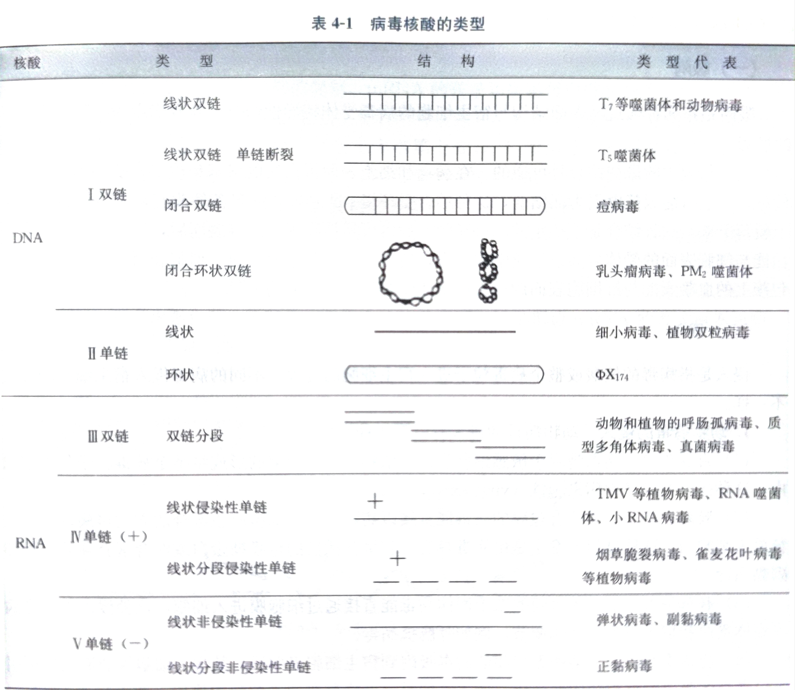

|   Property   |                          Parameters                          |
| :----------: | :----------------------------------------------------------: |
| Nucleic acid | DNA RNA Both DNA and RNA  (at different stages in the life cycle) |
|    Shape     |             Linear Circular Segmented              |
| Strandedness | Single-stranded (ss) Double-stranded (ds) Double-stranded with regions of single-strandedness |
|    Sense     | Positive sense (+) Negative sense (−) Ambisense (+/−) |

#### 脂类

主要以脂质双分子层的形式存在于病毒的包膜中,来自于宿主细胞膜.
$$
病毒脂类
\begin{cases}
	磷脂\\
	胆固醇\\
	中性脂肪
\end{cases}
$$

##### 功能

与病毒的吸附和侵入有关.一些有包膜的病毒去掉包膜后失去感染性.

#### 糖类

$$
病毒糖类
\begin{cases}
	葡萄糖\\
	龙胆二糖\\
	岩藻糖\\
	半乳糖
\end{cases}
$$

常以糖蛋白形式存在或者以糖苷键直接与碱基相连.

##### 功能

+   与DNA碱基结合的葡萄糖残基对核酸酶的降解有抵抗作用.
+   糖蛋白位于包膜病毒表面,与血清反应有关.

## 病毒群体形态

### 包含体

#### 概念

感染病毒的宿主细胞内,出现在光学显微镜下可见的大小、形态、数量不等的蛋白质结晶体,内含一到几个病毒粒子.

#### 形成部位

+   细胞核内一如疱疹病毒
+   细胞质内一如狂犬病毒等
+   核内和胞质都有一麻疹病毒

#### 分类

+   多角形包含体(含多个病毒粒子)
+   颗粒形包含体(含1个或2个病毒粒子)

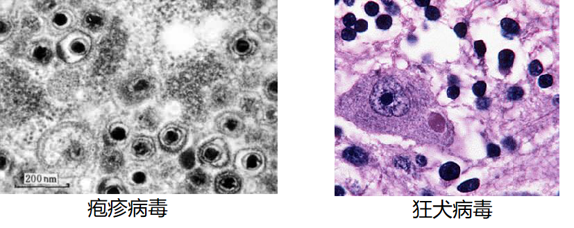

### 噬菌斑

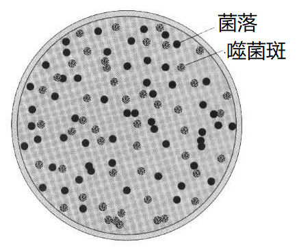

#### 概念

是噬菌体感染敏感宿主细菌以后在含受体菌的涂布平板上形成的肉眼可见的透明圈.

在涂布有敏感宿主细胞的固体培养基表面,若接种上相应噬菌体的稀释液,其中每一个噬菌体粒子由于先侵染和裂解一个细胞,然后以此为中心,再反复侵染和裂解周围大量的细胞,结果就会在菌苔上形成一个具有一定形状、大小、边缘和透明度的小圆斑.

#### 应用

+   噬菌体定量计数
+   噬菌体的鉴定

#### 病斑和空斑

人工培养的单层动物细胞感染病毒后,也会形成类似噬菌班的动物病毒群体,称为**空斑**.

单层动物细胞受到肿瘤病毒的感染后,会使动物细胞恶性增生,形成类似细菌菌落的病灶,称为病斑.

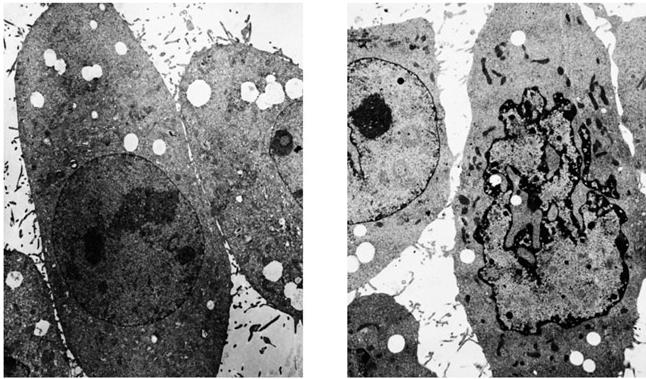

#### 枯斑

植物病毒在植物叶片上形成的一个个坏死的病灶称为枯斑.

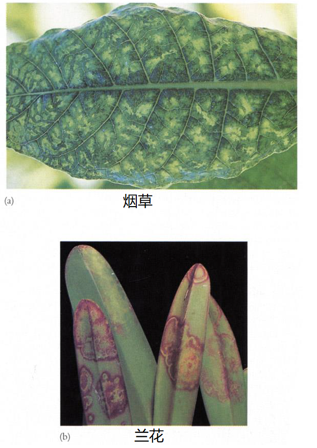

## 病毒的分类

1979年,国际病毒分类委员会(ICTV)提出以**病毒的核酸**作为主要的分类依据.

### 分类原则

1.核酸的类型、结构及相对分子质量

2.病毒的形状与大小

3.病毒的形态结构

4.血清学性质和抗原关系

5.病毒在细胞培养上的特性

6.病毒对化学和物理因子的敏感性

7.流行病学特点(宿主范围、传播方式、媒介种类、临床病理学特点)

