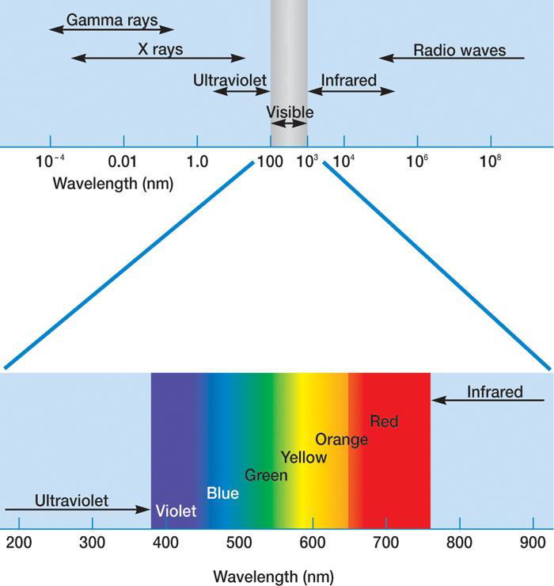
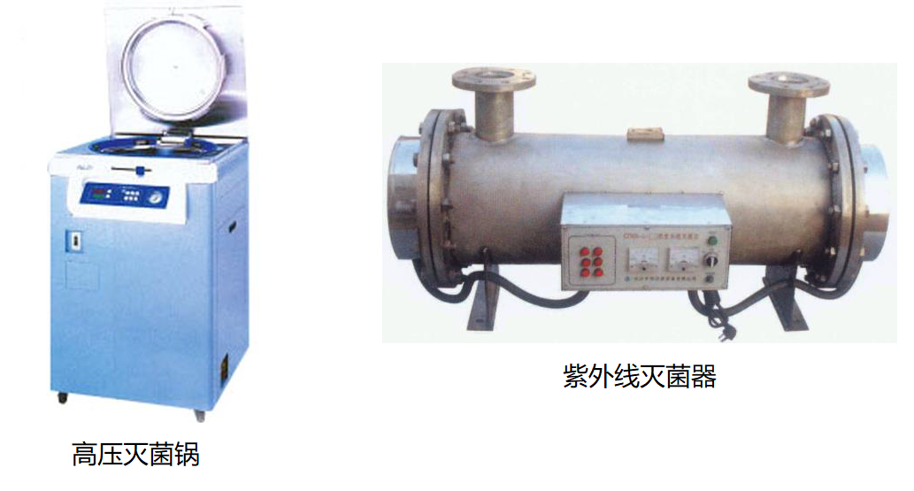
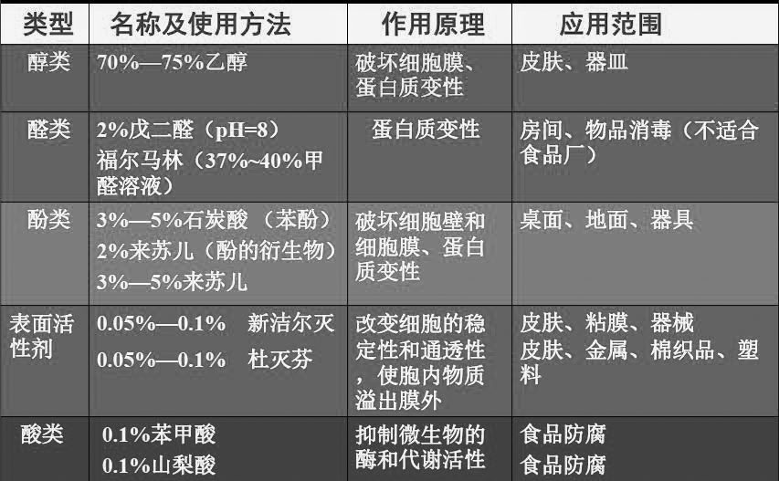

## 辐射

辐射是能量以电磁波形式通过空间传播或传递的一种物理现象.分为电离辐射和电磁辐射.

### 可见光

>   波长在400-760nm的电磁辐射

+   大部分微生物不需要光,只有光能营养型的微生物才需要光作为能源.有的微生物对光有趋光性,如闪光须霉.担子菌形成子实体也需要散射光的照射.
+   一般可见光对大多数化能微生物没有影响,但是,太强或连续长时间照射也会导致微生物死亡.因微生物细胞经照射后,在有氧情况下,产生光氧化反应,生成$H_2O_2$,能发生强烈氧化作用,引起细胞死亡.

### 紫外线(UV)

>   波长在$100-400nm$的电磁辐射.

紫外线杀菌或诱变原理

+   紫外线作用于$DNA,$使其产生胸腺嘧啶二聚体$(TT)$,引起$DNA$结构变形,阻碍正常的碱基配对,从而造成微生物变异或死亡.
+   紫外线会使空气中的分子氧变成臭氧,臭氧释放的原子氧有杀菌作用.

波长在$265-266nm$处的紫外线杀菌力最强,因为核酸$(DNA,RNA)$的吸收峰为$260nm$.

### 光复活现象

经紫外线照射的微生物,立即放在可见光下光可以激活DNA修复酶,该酶能修复DNA上的损伤,使微生物的突变率或死亡率下降.

### 电离辐射

包括$X,\alpha,\beta,\gamma$射线

#### 特点

波长短,能量高,穿透力强,非专一性,对所有生物均有杀伤作用.

#### 作用原理

使被照射物中的水分子发生电离,产生游离基,这些游离基使细胞中的敏感蛋白质分子失活,造成细胞损伤或死亡.

#### 应用

1.用于不耐热食品,药品或塑料制品的灭菌

2.菌种诱变.

## 化学杀菌剂和抑菌剂

根据化学物质对微生物的抑制或杀死的效应分为灭菌、消毒、防腐和化疗

| 杀菌方式 | 定义 |
| :--------: | :----: |
|灭菌| 彻底杀灭(一切微生物)杀菌|
|消毒| 部分杀灭(仅杀灭病原体)溶菌|
|防腐|抑制霉腐微生物|
|化疗|抑制宿主体内的病原菌|

###　灭菌(sterilization)

是指用物理或化学因子,杀灭物体中的所有活微生物,包括最耐热的细菌芽胞.

### 消毒(disinfection)

消毒是指杀死或消除所有的病原微生物,可以起到防止感染或传播的作用.
但不能杀死所有的芽胞.

### 防腐(antisepsis)

在某些化学物质或物理因子作用下,能防止或抑制微生物生长的一种措施,它能防止食品腐败或防止其它物质霉变.

>    防腐的方法:低温、缺氧、干燥、高渗、高酸度、高醇度、加防腐剂等

### 化疗(chemotherapy)

**化疗即化学治疗**,是指利用具有高度选择毒力而对其宿主基本无毒的化学物质来抑制宿主体内病原微生物的生长繁殖,借以达到治疗该宿主传染病的一种措施.

具有高度选择毒力、可用于化学治疗目的的化学物质,称为**化学治疗剂**,包括磺胺类等化学合成药物、抗生素、和若干中草药中有效成分等.

### 常用的消毒防腐剂及化学治疗剂

#### 有机化合物
酚类、醛类、醇类、酸类和表面活性剂;

#### 无机化合物

卤素、重金属及其化合物、氧化剂

#### 染色剂

结晶紫、吖啶黄、孔雀绿等

#### 化学治疗剂

抗代谢类药物

### 常用的消毒防腐剂及其应用

|类型|名称及使用方法|作用原理|作用范围|
|:---:|:---:|:---:|:---:|
|醇类|$70\%-75\%$乙醇|破坏细胞膜、 蛋白质变性|皮肤、器皿|
|醛类|$2\%$戊二醛$(pH=8)$ 福尔马林($37\%-40\%$甲醛溶液)|蛋白质变性|房间、物品消毒 (不适合食品厂)|
|酚类|$3\%-5\%$石炭酸(苯酚) $2\%$来苏儿(酚的衍生物) $3\%-5\%$来苏儿|破坏细胞壁和 细胞膜, 蛋白质变性|桌面、地面、器具|
|表面活性剂|$0.05\%-0.1\%$新洁尔灭 $0.05\%-0.1\%$杜灭芬|改变细胞的 稳定性和通透性 使胞内物质 溢出膜外|皮肤,粘膜,器械 金属,棉织品,塑料|
|酸类|$0.1\%$苯甲酸 $0.1\%$山梨酸|抑制微生物的 酶和代谢活性|食品防腐|
|重金属盐类|$0.05\%-0.1\%$升汞 $2\%$红汞 $0.1\%-1\%$硝酸银 $0.1\%-0.5\%$硫酸铜|蛋白质变性、酶失活变性、沉淀蛋白 蛋白质变性、酶失活|非金属器皿 皮肤、粘膜、伤口 皮肤、新生儿眼睛 防治植物病害|
|卤素及其化合物|$0.2-0.5mg/L$氯气 漂白粉 $5\%$碘酒|破坏细胞膜、蛋白质|饮水、游泳池水 地面和厕所消毒 皮肤消毒|
|氧化剂|$0.1\%$高锰酸钾 $3\%$过氧化氢 臭氧$(O_3)$|氧化蛋白质活性基团 酶失活|皮肤、实验室、水 果、蔬菜 口腔黏膜消毒 饮水消毒|
|染料|$2\%-4\%$结晶紫 $1\%-2\%$龙胆紫(紫药水)|与蛋白质的羧基结合 核酸上的磷酸基结合|皮肤、伤口|

