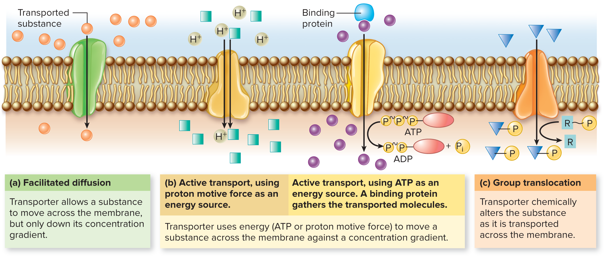

# 微生物摄取营养的方式

# 微生物摄取营养物质主要方式

## 胞吞作用

## 渗透吸收(主要方式)

各种营养物质直接通过细胞膜的渗透和选择性吸收进入细胞

### 简单扩散(simple diffusion)

+   主要依靠膜内外两侧营养物质的浓度差,由高浓度向低浓度运输,最后达到平衡.
+   运输过程不消耗能量,也不发生化学变化,且是非特异性的.
+   简单扩散不是微生物吸收营养物质的主要方式,以这种方式运输的物质主要是$H_2O、CO_2、O_2、$甘油$、$某些氨基酸分子,盐类等.

### 促进扩散(facilitated diffusion)

溶质运输过程中必须借助细胞膜上具有底物特异性的载体蛋白

+   需要载体蛋白的参与;
+   高度的立体专一性;
+   不需要能量;
+   载体蛋白能促进物质运输加快进行,但营养物质仍不能逆浓度梯度吸收;
+   通过促进扩散进入细胞的营养物质主要有$SO_4^{2-}、PO_4^{3-}、$糖等.

### 主动运输(active transport)

+   需要载体蛋白的参与;
+   高度的立体专一性;
+   需要消耗能量,并且可以逆浓度梯度运输.
+   是一种广泛存在于微生物中的主要物质运输方式.微生物在生长与繁殖过程中所需要的多数营养物质如氨基酸、乳糖$、Na^+、K^+、Ca^{2+}$等主要是通过主动运输的方式运输的.

#### Sodium-Potassium Pumps

钠钾泵实际上就是钠-钾-ATP酶,它在细胞质膜上以很高的效率向胞外排除$Na^+$,同时向胞内吸入$K^+$.

### 基团转移(group transport)

溶质在运输前后发生分子结构的变化

