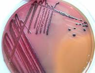

# 培养基

培养基是人工配制的,适合微生物生长繁殖或产生代谢产物的营养基质.

任何培养基都应该具备微生物生长所需要五大营养要素,且其比例必须合适.

>   五大营养物质: 碳源、氮源、矿质元素、生长因子、水

# 培养基配制应遵循的原则

+   目的明确
    +   根据不同微生物的营养需要配制不同的培养基
+   营养物浓度和比例协调
    +   控制不同营养物的合适配比(C/N比)
+   物理化学调件合适
    +   将培养基的水活度、pH和氧化还原电势控制在适宜的范围之内;(细菌的最适pH为6.5-7.5,放线菌为7.5-8.5,酵母菌为3.8-6.0,霉菌为4.0-5.8)
+   灭菌处理
    +   培养基应无菌.
+   经济节约
    +   所用原料应遵循经济节约、来源广泛的原则

## 按成分不同划分

### 复合培养基

含有化学成分还不清楚或化学成分不恒定的天然有机物

>   细菌(牛肉膏蛋白胨培养基):
>
>   +   牛肉膏$\quad3g$
>   +   蛋白胨$\quad10g$
>   +   $NaCl\quad 5g$
>   +   $H_2O \quad 1000ml$

### 半合成培养基

部分天然材料和部分纯化学试剂组成

>   马铃薯蔗糖培养基
>
>   +   马铃薯$\quad200g$
>   +   糖$\quad 20g $
>   +   $H_2O \quad1000 mL$

### 合成培养基

化学成分完全了解的物质配制而成的培养基

>   放线菌(高氏1号)
>
>   +   淀粉$\quad20 g $
>   +   $K_2HPO_4\quad 0.5 g $
>   +   $NaCI \quad0.5 g $
>   +   $MgSO4\cdot7H_2O \quad 0.5g $
>   +   $KNO_3\quad1g $
>   +   $FeSO_4\quad0.01 g $
>   +   $H_20 \quad 1000 mL$

## 按物理状态不同划分

### 固体培养基

在液体培养基中加入一定量凝固剂,使其成为固体状态,琼脂含量一般为$1.5\%-2.0\%$

固体培养基常用来进行微生物的分离、鉴定、活菌计数及菌种保藏

### 半固体培养基

琼脂含量一般为$0.2\%-0.5\%$

观察微生物的运动特征、分类鉴定及噬菌体效价滴定

### 液体培养基

不加任何凝固剂

大规模工业生产及在实验室进行微生物的基础理论和应用方面的研究

## 按用途不同划分

### 选择培养基

是根据某种微生物生长的特殊要求或对某些化学、物理因素的抗性而设计的培养基.

培养基中加入某种化学物质,这种化学物质没有营养作用,对所需分离的微生物无害,但可以抑制或杀死其他微生物.如结晶紫、抗生素等(**利用待分离对象对某抑菌物质的抗性**)

用缺乏氮源的选择培养基可以用来分离固氮微生物;利用以蛋白质为唯一氮源的选择培养基可以分离产胞外蛋白酶的微生物(利用待分离对象对某种营养物的"嗜好").

### 鉴别培养基

在成分中加有能与目的菌的无色代谢产物发生明显显色反应的指示剂,从而达到只需肉眼就能方便地从近似菌落中找出目的菌落的培养基.

>   伊红美蓝乳糖培养基(EMB培养基)
>
>   +   蛋白胨$\quad 10g$
>   +   乳糖$\quad 10g$
>   +   伊红$\gamma\quad 0.4g$ 
>   +   美蓝$\quad0.065g$
>   +   磷酸氢二钾($K_2HPO_4$)$\quad2.0g$
>   +   琼脂$\quad 15.0g$
>
>   最终pH为7.2

伊红和美蓝可抑制$G^+$细菌,在低酸度下,两者结合并形成沉淀,起着产酸指示剂的作用

+   固体培养基的琼脂含一般为$1.5\%$

+   一般细菌适宜的生长$pH$为$7.0-7.5$

---

:star:实验设计: 

根据所学知识设计合适培养基将土壤样品中的大肠杆菌、苏云金芽胞杆菌、霉菌和自生固氮菌分离,获得纯培养.

+   大肠杆菌
    +   伊红美蓝培养基
+   苏云金芽孢杆菌
    +   氨苄青霉素培养基
+   霉菌
    +   含链霉素的马丁氏培养基
+   自生固氮菌
    +   不含氮源的培养基
