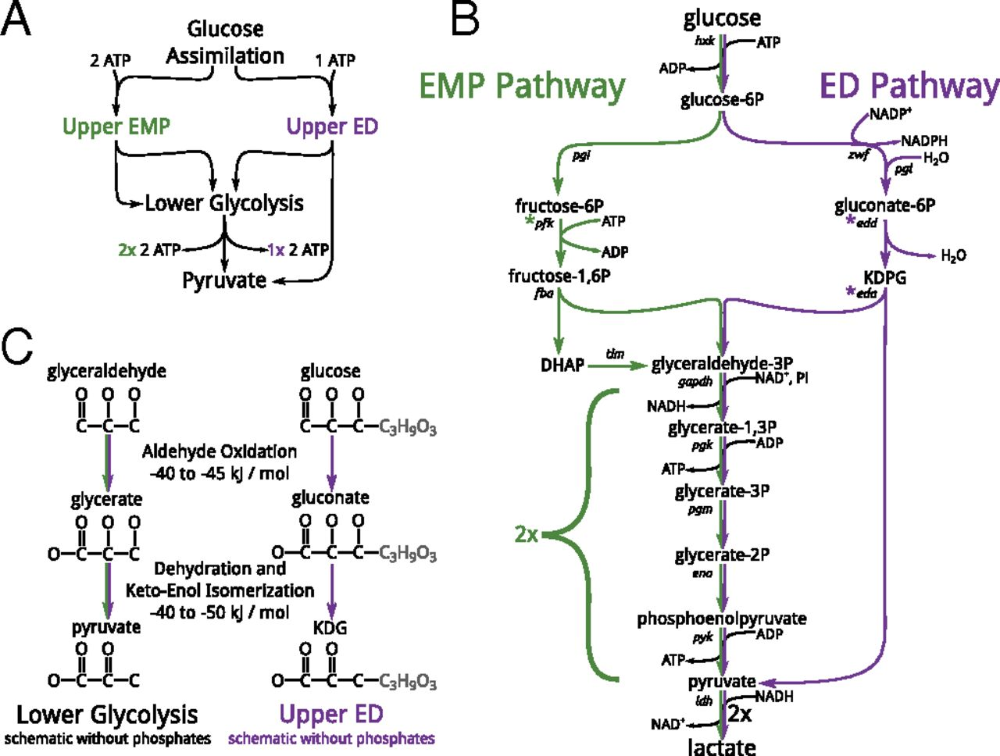
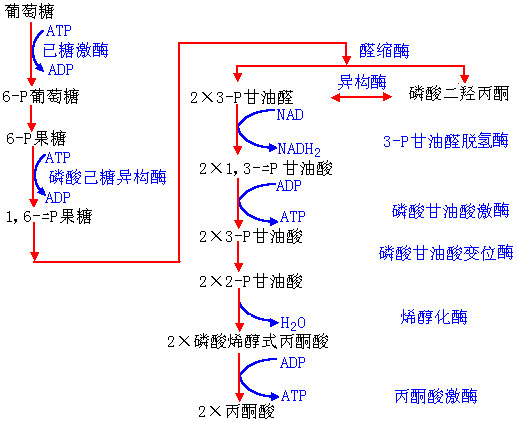
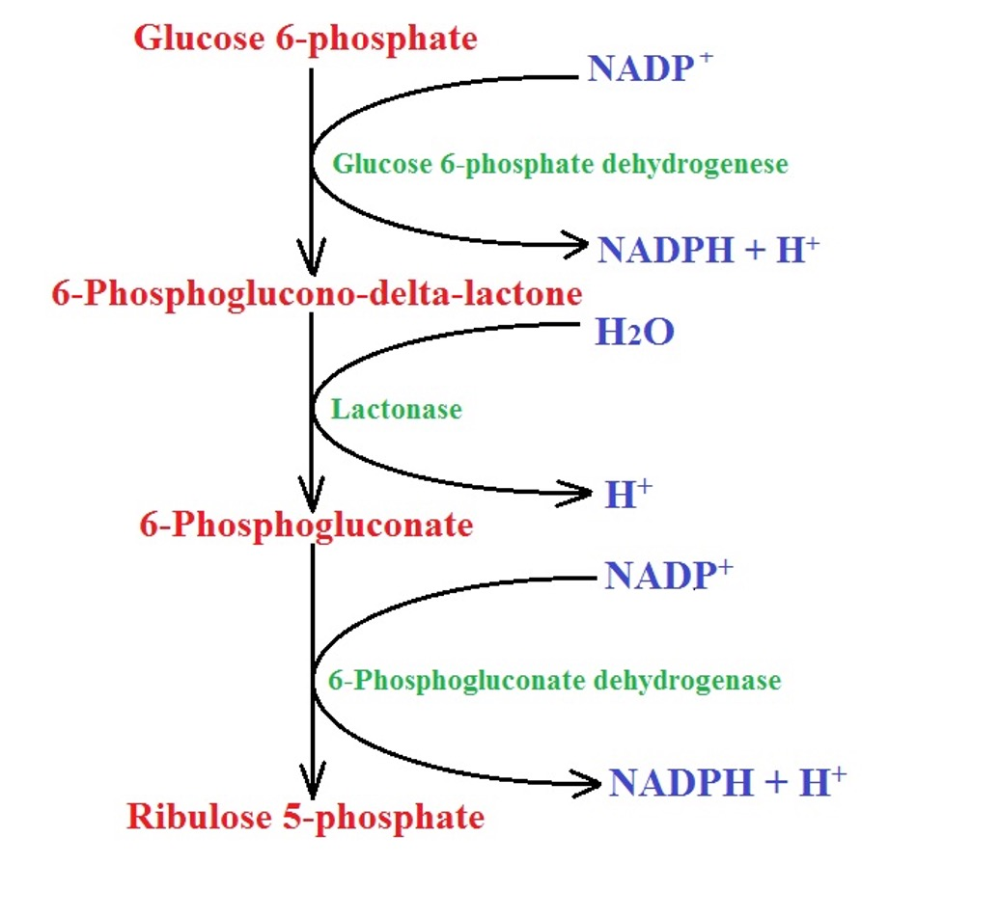
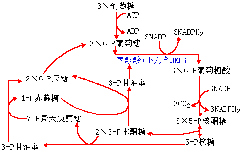

# 微生物的分解代谢

自然界中的微生物绝大多数是化能异养型的微生物,这些微生物从外界吸收营养物质以后,通过微生物细胞中的酶进行分解代谢产生能量ATP和小分子有机物.

+   ATP是合成代谢所必需的能量的主要源泉
+   微生物进行合成代谢的前体物

# 大分子有机物的分解

+   淀粉$\Large水解\over$糊精$\Large 水解\over$葡萄糖,麦芽糖
+   蛋白质$\Large水解\over$多肽$\Large水解\over$氨基酸
+   氨基酸$\Large脱氨作用\over$有机酸$+NH_3$
+   氨基酸$\Large脱羧作用\over$胺$(-NH_2)+CO_2$

+   脂肪$\Large水解\over$$\begin{cases}甘油\\脂肪酸 {\beta-氧化\over}乙酰辅酶A\end{cases}$

# :star:己糖的分解

## 糖酵解和三羧酸循环(TCA循环)

是葡萄糖在有氧条件下被彻底氧化成$CO_2$,产生能量的途径.

$糖酵解\left \{\begin{array} {}EMP途径(最常见)\\HMP途径\\ED途径\end{array}\right \}丙酮酸\begin{cases}{\large无氧\over}发酵\\{\large有氧\over TCA循环}CO_2+H_2O\end{cases}$

### EMP途径

又称糖酵解途径或磷酸已糖途径,  埃姆登**E**mbden-迈耶霍夫**M**eyerhof-帕纳斯**P**arnas

#### EMP途径特点

1、EMP途径为合成代谢提供了:

+   能量	
    +   2ATP(消耗2ATP,产生4ATP, net. 2ATP)
+   还原力
    +   2NADH
+   小分子c架
    +   6-P葡萄糖
    +   P-二羟丙酮
    +   3-P甘油酸
    +   P-烯醇式丙酮酸
    +   丙酮酸

2、需氧菌、兼性菌、厌氧菌中都有,有氧时与三羧酸循环连接,产生大量能量,无氧时产生种类繁多的发酵产物.

### HMP途径(hexose monophosphate pathway)

磷酸已糖途径,也称磷酸戊糖途径(pentose phosphate pathway)或PP途径,是葡萄糖不经过EMP途径和TCA循环而得到彻底氧化,并能产生大量NADPH2形式的还原力和多种代谢产物的糖酵解途径.存在于大多生物细胞内.

5-P核糖+5-P木酮糖→ 3-P甘油醛+7-P景天庚酮糖
3-P甘油醛+7-P景天庚酮糖→ 4-P赤藓糖+6-P果糖
5-P木酮糖+4-P赤藓糖→ 6-P果糖+3-P甘油醛

#### HMP特点

+   完全HMP途径提供
    +   还原力
        +   $2NADPH_2$
    +   简单小分子
        +   核酮糖-5-磷酸
        +   赤苏糖-4-磷酸

+   不完全HMP途径提供
    +   能量
        +   $2APT$
    +   还原力
        +   $1NADPH_2$
    +   简单小分子
        +   甘油醛-3-磷酸
        +   磷酸烯醇式丙酮酸
        +   丙酮酸

<svg version="1.1" xmlns="http://www.w3.org/2000/svg" xmlns:xlink="http://www.w3.org/1999/xlink" width="1141" height="696"><defs><clipPath id="ogMTXfdzomwt"><path fill="none" stroke="none" d=" M 0 0 L 1141 0 L 1141 696 L 0 696 L 0 0 Z"/></clipPath></defs><g transform="scale(1,1)" clip-path="url(#ogMTXfdzomwt)"><g><rect fill="rgb(255,255,255)" stroke="none" x="0" y="0" width="1141" height="696" fill-opacity="1"/><path fill="none" stroke="rgb(192,192,192)" paint-order="fill stroke markers" d=" M 20.5 0.5 L 20.5 696.5 M 20.5 0.5 L 20.5 696.5 M 70.5 0.5 L 70.5 696.5 M 120.5 0.5 L 120.5 696.5 M 170.5 0.5 L 170.5 696.5 M 220.5 0.5 L 220.5 696.5 M 270.5 0.5 L 270.5 696.5 M 320.5 0.5 L 320.5 696.5 M 370.5 0.5 L 370.5 696.5 M 420.5 0.5 L 420.5 696.5 M 470.5 0.5 L 470.5 696.5 M 520.5 0.5 L 520.5 696.5 M 620.5 0.5 L 620.5 696.5 M 670.5 0.5 L 670.5 696.5 M 720.5 0.5 L 720.5 696.5 M 770.5 0.5 L 770.5 696.5 M 820.5 0.5 L 820.5 696.5 M 870.5 0.5 L 870.5 696.5 M 920.5 0.5 L 920.5 696.5 M 970.5 0.5 L 970.5 696.5 M 1020.5 0.5 L 1020.5 696.5 M 1070.5 0.5 L 1070.5 696.5 M 1120.5 0.5 L 1120.5 696.5" stroke-opacity="1" stroke-linecap="round" stroke-linejoin="round" stroke-miterlimit="10"/><path fill="none" stroke="rgb(192,192,192)" paint-order="fill stroke markers" d=" M 0.5 0.5 L 0.5 696.5 M 10.5 0.5 L 10.5 696.5 M 30.5 0.5 L 30.5 696.5 M 40.5 0.5 L 40.5 696.5 M 50.5 0.5 L 50.5 696.5 M 60.5 0.5 L 60.5 696.5 M 80.5 0.5 L 80.5 696.5 M 90.5 0.5 L 90.5 696.5 M 100.5 0.5 L 100.5 696.5 M 110.5 0.5 L 110.5 696.5 M 130.5 0.5 L 130.5 696.5 M 140.5 0.5 L 140.5 696.5 M 150.5 0.5 L 150.5 696.5 M 160.5 0.5 L 160.5 696.5 M 180.5 0.5 L 180.5 696.5 M 190.5 0.5 L 190.5 696.5 M 200.5 0.5 L 200.5 696.5 M 210.5 0.5 L 210.5 696.5 M 230.5 0.5 L 230.5 696.5 M 240.5 0.5 L 240.5 696.5 M 250.5 0.5 L 250.5 696.5 M 260.5 0.5 L 260.5 696.5 M 280.5 0.5 L 280.5 696.5 M 290.5 0.5 L 290.5 696.5 M 300.5 0.5 L 300.5 696.5 M 310.5 0.5 L 310.5 696.5 M 330.5 0.5 L 330.5 696.5 M 340.5 0.5 L 340.5 696.5 M 350.5 0.5 L 350.5 696.5 M 360.5 0.5 L 360.5 696.5 M 380.5 0.5 L 380.5 696.5 M 390.5 0.5 L 390.5 696.5 M 400.5 0.5 L 400.5 696.5 M 410.5 0.5 L 410.5 696.5 M 430.5 0.5 L 430.5 696.5 M 440.5 0.5 L 440.5 696.5 M 450.5 0.5 L 450.5 696.5 M 460.5 0.5 L 460.5 696.5 M 480.5 0.5 L 480.5 696.5 M 490.5 0.5 L 490.5 696.5 M 500.5 0.5 L 500.5 696.5 M 510.5 0.5 L 510.5 696.5 M 530.5 0.5 L 530.5 696.5 M 540.5 0.5 L 540.5 696.5 M 550.5 0.5 L 550.5 696.5 M 560.5 0.5 L 560.5 696.5 M 580.5 0.5 L 580.5 696.5 M 590.5 0.5 L 590.5 696.5 M 600.5 0.5 L 600.5 696.5 M 610.5 0.5 L 610.5 696.5 M 630.5 0.5 L 630.5 696.5 M 640.5 0.5 L 640.5 696.5 M 650.5 0.5 L 650.5 696.5 M 660.5 0.5 L 660.5 696.5 M 680.5 0.5 L 680.5 696.5 M 690.5 0.5 L 690.5 696.5 M 700.5 0.5 L 700.5 696.5 M 710.5 0.5 L 710.5 696.5 M 730.5 0.5 L 730.5 696.5 M 740.5 0.5 L 740.5 696.5 M 750.5 0.5 L 750.5 696.5 M 760.5 0.5 L 760.5 696.5 M 780.5 0.5 L 780.5 696.5 M 790.5 0.5 L 790.5 696.5 M 800.5 0.5 L 800.5 696.5 M 810.5 0.5 L 810.5 696.5 M 830.5 0.5 L 830.5 696.5 M 840.5 0.5 L 840.5 696.5 M 850.5 0.5 L 850.5 696.5 M 860.5 0.5 L 860.5 696.5 M 880.5 0.5 L 880.5 696.5 M 890.5 0.5 L 890.5 696.5 M 900.5 0.5 L 900.5 696.5 M 910.5 0.5 L 910.5 696.5 M 930.5 0.5 L 930.5 696.5 M 940.5 0.5 L 940.5 696.5 M 950.5 0.5 L 950.5 696.5 M 960.5 0.5 L 960.5 696.5 M 980.5 0.5 L 980.5 696.5 M 990.5 0.5 L 990.5 696.5 M 1000.5 0.5 L 1000.5 696.5 M 1010.5 0.5 L 1010.5 696.5 M 1030.5 0.5 L 1030.5 696.5 M 1040.5 0.5 L 1040.5 696.5 M 1050.5 0.5 L 1050.5 696.5 M 1060.5 0.5 L 1060.5 696.5 M 1080.5 0.5 L 1080.5 696.5 M 1090.5 0.5 L 1090.5 696.5 M 1100.5 0.5 L 1100.5 696.5 M 1110.5 0.5 L 1110.5 696.5 M 1130.5 0.5 L 1130.5 696.5 M 1140.5 0.5 L 1140.5 696.5" stroke-opacity="0.23529411764705882" stroke-linecap="round" stroke-linejoin="round" stroke-miterlimit="10"/><path fill="none" stroke="rgb(192,192,192)" paint-order="fill stroke markers" d=" M 0.5 34.5 L 1141.5 34.5 M 0.5 34.5 L 1141.5 34.5 M 0.5 84.5 L 1141.5 84.5 M 0.5 134.5 L 1141.5 134.5 M 0.5 184.5 L 1141.5 184.5 M 0.5 284.5 L 1141.5 284.5 M 0.5 334.5 L 1141.5 334.5 M 0.5 384.5 L 1141.5 384.5 M 0.5 434.5 L 1141.5 434.5 M 0.5 484.5 L 1141.5 484.5 M 0.5 534.5 L 1141.5 534.5 M 0.5 584.5 L 1141.5 584.5 M 0.5 634.5 L 1141.5 634.5 M 0.5 684.5 L 1141.5 684.5" stroke-opacity="1" stroke-linecap="round" stroke-linejoin="round" stroke-miterlimit="10"/><path fill="none" stroke="rgb(192,192,192)" paint-order="fill stroke markers" d=" M 0.5 4.5 L 1141.5 4.5 M 0.5 4.5 L 1141.5 4.5 M 0.5 14.5 L 1141.5 14.5 M 0.5 24.5 L 1141.5 24.5 M 0.5 44.5 L 1141.5 44.5 M 0.5 54.5 L 1141.5 54.5 M 0.5 64.5 L 1141.5 64.5 M 0.5 74.5 L 1141.5 74.5 M 0.5 94.5 L 1141.5 94.5 M 0.5 104.5 L 1141.5 104.5 M 0.5 114.5 L 1141.5 114.5 M 0.5 124.5 L 1141.5 124.5 M 0.5 144.5 L 1141.5 144.5 M 0.5 154.5 L 1141.5 154.5 M 0.5 164.5 L 1141.5 164.5 M 0.5 174.5 L 1141.5 174.5 M 0.5 194.5 L 1141.5 194.5 M 0.5 204.5 L 1141.5 204.5 M 0.5 214.5 L 1141.5 214.5 M 0.5 224.5 L 1141.5 224.5 M 0.5 244.5 L 1141.5 244.5 M 0.5 254.5 L 1141.5 254.5 M 0.5 264.5 L 1141.5 264.5 M 0.5 274.5 L 1141.5 274.5 M 0.5 294.5 L 1141.5 294.5 M 0.5 304.5 L 1141.5 304.5 M 0.5 314.5 L 1141.5 314.5 M 0.5 324.5 L 1141.5 324.5 M 0.5 344.5 L 1141.5 344.5 M 0.5 354.5 L 1141.5 354.5 M 0.5 364.5 L 1141.5 364.5 M 0.5 374.5 L 1141.5 374.5 M 0.5 394.5 L 1141.5 394.5 M 0.5 404.5 L 1141.5 404.5 M 0.5 414.5 L 1141.5 414.5 M 0.5 424.5 L 1141.5 424.5 M 0.5 444.5 L 1141.5 444.5 M 0.5 454.5 L 1141.5 454.5 M 0.5 464.5 L 1141.5 464.5 M 0.5 474.5 L 1141.5 474.5 M 0.5 494.5 L 1141.5 494.5 M 0.5 504.5 L 1141.5 504.5 M 0.5 514.5 L 1141.5 514.5 M 0.5 524.5 L 1141.5 524.5 M 0.5 544.5 L 1141.5 544.5 M 0.5 554.5 L 1141.5 554.5 M 0.5 564.5 L 1141.5 564.5 M 0.5 574.5 L 1141.5 574.5 M 0.5 594.5 L 1141.5 594.5 M 0.5 604.5 L 1141.5 604.5 M 0.5 614.5 L 1141.5 614.5 M 0.5 624.5 L 1141.5 624.5 M 0.5 644.5 L 1141.5 644.5 M 0.5 654.5 L 1141.5 654.5 M 0.5 664.5 L 1141.5 664.5 M 0.5 674.5 L 1141.5 674.5 M 0.5 694.5 L 1141.5 694.5" stroke-opacity="0.23529411764705882" stroke-linecap="round" stroke-linejoin="round" stroke-miterlimit="10"/><path fill="none" stroke="rgb(0,0,0)" paint-order="fill stroke markers" d=" M 570.5 2.5 L 570.5 696.5" stroke-opacity="1" stroke-miterlimit="10"/><path fill="none" stroke="rgb(0,0,0)" paint-order="fill stroke markers" d=" M 570.5 1.5 L 566.5 5.5" stroke-opacity="1" stroke-miterlimit="10"/><path fill="none" stroke="rgb(0,0,0)" paint-order="fill stroke markers" d=" M 570.5 1.5 L 574.5 5.5" stroke-opacity="1" stroke-miterlimit="10"/><path fill="none" stroke="rgb(0,0,0)" paint-order="fill stroke markers" d=" M 0.5 234.5 L 1139.5 234.5" stroke-opacity="1" stroke-miterlimit="10"/><path fill="none" stroke="rgb(0,0,0)" paint-order="fill stroke markers" d=" M 1140.5 234.5 L 1136.5 230.5" stroke-opacity="1" stroke-miterlimit="10"/><path fill="none" stroke="rgb(0,0,0)" paint-order="fill stroke markers" d=" M 1140.5 234.5 L 1136.5 238.5" stroke-opacity="1" stroke-miterlimit="10"/><text fill="rgb(0,0,0)" stroke="none" font-family="geogebra-sans-serif, sans-serif" font-size="12px" font-style="normal" font-weight="normal" text-decoration="normal" x="12" y="250" text-anchor="start" dominant-baseline="alphabetic" fill-opacity="1">–11</text><text fill="none" stroke="rgb(255,255,255)" font-family="geogebra-sans-serif, sans-serif" font-size="12px" font-style="normal" font-weight="normal" text-decoration="normal" x="12" y="250" text-anchor="start" dominant-baseline="alphabetic" stroke-opacity="1" stroke-linejoin="bevel" stroke-miterlimit="10" stroke-width="3">–11</text><text fill="rgb(0,0,0)" stroke="none" font-family="geogebra-sans-serif, sans-serif" font-size="12px" font-style="normal" font-weight="normal" text-decoration="normal" x="12" y="250" text-anchor="start" dominant-baseline="alphabetic" fill-opacity="1">–11</text><text fill="rgb(0,0,0)" stroke="none" font-family="geogebra-sans-serif, sans-serif" font-size="12px" font-style="normal" font-weight="normal" text-decoration="normal" x="62" y="250" text-anchor="start" dominant-baseline="alphabetic" fill-opacity="1">–10</text><text fill="none" stroke="rgb(255,255,255)" font-family="geogebra-sans-serif, sans-serif" font-size="12px" font-style="normal" font-weight="normal" text-decoration="normal" x="62" y="250" text-anchor="start" dominant-baseline="alphabetic" stroke-opacity="1" stroke-linejoin="bevel" stroke-miterlimit="10" stroke-width="3">–10</text><text fill="rgb(0,0,0)" stroke="none" font-family="geogebra-sans-serif, sans-serif" font-size="12px" font-style="normal" font-weight="normal" text-decoration="normal" x="62" y="250" text-anchor="start" dominant-baseline="alphabetic" fill-opacity="1">–10</text><text fill="rgb(0,0,0)" stroke="none" font-family="geogebra-sans-serif, sans-serif" font-size="12px" font-style="normal" font-weight="normal" text-decoration="normal" x="115" y="250" text-anchor="start" dominant-baseline="alphabetic" fill-opacity="1">–9</text><text fill="none" stroke="rgb(255,255,255)" font-family="geogebra-sans-serif, sans-serif" font-size="12px" font-style="normal" font-weight="normal" text-decoration="normal" x="115" y="250" text-anchor="start" dominant-baseline="alphabetic" stroke-opacity="1" stroke-linejoin="bevel" stroke-miterlimit="10" stroke-width="3">–9</text><text fill="rgb(0,0,0)" stroke="none" font-family="geogebra-sans-serif, sans-serif" font-size="12px" font-style="normal" font-weight="normal" text-decoration="normal" x="115" y="250" text-anchor="start" dominant-baseline="alphabetic" fill-opacity="1">–9</text><text fill="rgb(0,0,0)" stroke="none" font-family="geogebra-sans-serif, sans-serif" font-size="12px" font-style="normal" font-weight="normal" text-decoration="normal" x="165" y="250" text-anchor="start" dominant-baseline="alphabetic" fill-opacity="1">–8</text><text fill="none" stroke="rgb(255,255,255)" font-family="geogebra-sans-serif, sans-serif" font-size="12px" font-style="normal" font-weight="normal" text-decoration="normal" x="165" y="250" text-anchor="start" dominant-baseline="alphabetic" stroke-opacity="1" stroke-linejoin="bevel" stroke-miterlimit="10" stroke-width="3">–8</text><text fill="rgb(0,0,0)" stroke="none" font-family="geogebra-sans-serif, sans-serif" font-size="12px" font-style="normal" font-weight="normal" text-decoration="normal" x="165" y="250" text-anchor="start" dominant-baseline="alphabetic" fill-opacity="1">–8</text><text fill="rgb(0,0,0)" stroke="none" font-family="geogebra-sans-serif, sans-serif" font-size="12px" font-style="normal" font-weight="normal" text-decoration="normal" x="215" y="250" text-anchor="start" dominant-baseline="alphabetic" fill-opacity="1">–7</text><text fill="none" stroke="rgb(255,255,255)" font-family="geogebra-sans-serif, sans-serif" font-size="12px" font-style="normal" font-weight="normal" text-decoration="normal" x="215" y="250" text-anchor="start" dominant-baseline="alphabetic" stroke-opacity="1" stroke-linejoin="bevel" stroke-miterlimit="10" stroke-width="3">–7</text><text fill="rgb(0,0,0)" stroke="none" font-family="geogebra-sans-serif, sans-serif" font-size="12px" font-style="normal" font-weight="normal" text-decoration="normal" x="215" y="250" text-anchor="start" dominant-baseline="alphabetic" fill-opacity="1">–7</text><text fill="rgb(0,0,0)" stroke="none" font-family="geogebra-sans-serif, sans-serif" font-size="12px" font-style="normal" font-weight="normal" text-decoration="normal" x="265" y="250" text-anchor="start" dominant-baseline="alphabetic" fill-opacity="1">–6</text><text fill="none" stroke="rgb(255,255,255)" font-family="geogebra-sans-serif, sans-serif" font-size="12px" font-style="normal" font-weight="normal" text-decoration="normal" x="265" y="250" text-anchor="start" dominant-baseline="alphabetic" stroke-opacity="1" stroke-linejoin="bevel" stroke-miterlimit="10" stroke-width="3">–6</text><text fill="rgb(0,0,0)" stroke="none" font-family="geogebra-sans-serif, sans-serif" font-size="12px" font-style="normal" font-weight="normal" text-decoration="normal" x="265" y="250" text-anchor="start" dominant-baseline="alphabetic" fill-opacity="1">–6</text><text fill="rgb(0,0,0)" stroke="none" font-family="geogebra-sans-serif, sans-serif" font-size="12px" font-style="normal" font-weight="normal" text-decoration="normal" x="315" y="250" text-anchor="start" dominant-baseline="alphabetic" fill-opacity="1">–5</text><text fill="none" stroke="rgb(255,255,255)" font-family="geogebra-sans-serif, sans-serif" font-size="12px" font-style="normal" font-weight="normal" text-decoration="normal" x="315" y="250" text-anchor="start" dominant-baseline="alphabetic" stroke-opacity="1" stroke-linejoin="bevel" stroke-miterlimit="10" stroke-width="3">–5</text><text fill="rgb(0,0,0)" stroke="none" font-family="geogebra-sans-serif, sans-serif" font-size="12px" font-style="normal" font-weight="normal" text-decoration="normal" x="315" y="250" text-anchor="start" dominant-baseline="alphabetic" fill-opacity="1">–5</text><text fill="rgb(0,0,0)" stroke="none" font-family="geogebra-sans-serif, sans-serif" font-size="12px" font-style="normal" font-weight="normal" text-decoration="normal" x="365" y="250" text-anchor="start" dominant-baseline="alphabetic" fill-opacity="1">–4</text><text fill="none" stroke="rgb(255,255,255)" font-family="geogebra-sans-serif, sans-serif" font-size="12px" font-style="normal" font-weight="normal" text-decoration="normal" x="365" y="250" text-anchor="start" dominant-baseline="alphabetic" stroke-opacity="1" stroke-linejoin="bevel" stroke-miterlimit="10" stroke-width="3">–4</text><text fill="rgb(0,0,0)" stroke="none" font-family="geogebra-sans-serif, sans-serif" font-size="12px" font-style="normal" font-weight="normal" text-decoration="normal" x="365" y="250" text-anchor="start" dominant-baseline="alphabetic" fill-opacity="1">–4</text><text fill="rgb(0,0,0)" stroke="none" font-family="geogebra-sans-serif, sans-serif" font-size="12px" font-style="normal" font-weight="normal" text-decoration="normal" x="415" y="250" text-anchor="start" dominant-baseline="alphabetic" fill-opacity="1">–3</text><text fill="none" stroke="rgb(255,255,255)" font-family="geogebra-sans-serif, sans-serif" font-size="12px" font-style="normal" font-weight="normal" text-decoration="normal" x="415" y="250" text-anchor="start" dominant-baseline="alphabetic" stroke-opacity="1" stroke-linejoin="bevel" stroke-miterlimit="10" stroke-width="3">–3</text><text fill="rgb(0,0,0)" stroke="none" font-family="geogebra-sans-serif, sans-serif" font-size="12px" font-style="normal" font-weight="normal" text-decoration="normal" x="415" y="250" text-anchor="start" dominant-baseline="alphabetic" fill-opacity="1">–3</text><text fill="rgb(0,0,0)" stroke="none" font-family="geogebra-sans-serif, sans-serif" font-size="12px" font-style="normal" font-weight="normal" text-decoration="normal" x="465" y="250" text-anchor="start" dominant-baseline="alphabetic" fill-opacity="1">–2</text><text fill="none" stroke="rgb(255,255,255)" font-family="geogebra-sans-serif, sans-serif" font-size="12px" font-style="normal" font-weight="normal" text-decoration="normal" x="465" y="250" text-anchor="start" dominant-baseline="alphabetic" stroke-opacity="1" stroke-linejoin="bevel" stroke-miterlimit="10" stroke-width="3">–2</text><text fill="rgb(0,0,0)" stroke="none" font-family="geogebra-sans-serif, sans-serif" font-size="12px" font-style="normal" font-weight="normal" text-decoration="normal" x="465" y="250" text-anchor="start" dominant-baseline="alphabetic" fill-opacity="1">–2</text><text fill="rgb(0,0,0)" stroke="none" font-family="geogebra-sans-serif, sans-serif" font-size="12px" font-style="normal" font-weight="normal" text-decoration="normal" x="515" y="250" text-anchor="start" dominant-baseline="alphabetic" fill-opacity="1">–1</text><text fill="none" stroke="rgb(255,255,255)" font-family="geogebra-sans-serif, sans-serif" font-size="12px" font-style="normal" font-weight="normal" text-decoration="normal" x="515" y="250" text-anchor="start" dominant-baseline="alphabetic" stroke-opacity="1" stroke-linejoin="bevel" stroke-miterlimit="10" stroke-width="3">–1</text><text fill="rgb(0,0,0)" stroke="none" font-family="geogebra-sans-serif, sans-serif" font-size="12px" font-style="normal" font-weight="normal" text-decoration="normal" x="515" y="250" text-anchor="start" dominant-baseline="alphabetic" fill-opacity="1">–1</text><text fill="rgb(0,0,0)" stroke="none" font-family="geogebra-sans-serif, sans-serif" font-size="12px" font-style="normal" font-weight="normal" text-decoration="normal" x="618" y="250" text-anchor="start" dominant-baseline="alphabetic" fill-opacity="1">1</text><text fill="none" stroke="rgb(255,255,255)" font-family="geogebra-sans-serif, sans-serif" font-size="12px" font-style="normal" font-weight="normal" text-decoration="normal" x="618" y="250" text-anchor="start" dominant-baseline="alphabetic" stroke-opacity="1" stroke-linejoin="bevel" stroke-miterlimit="10" stroke-width="3">1</text><text fill="rgb(0,0,0)" stroke="none" font-family="geogebra-sans-serif, sans-serif" font-size="12px" font-style="normal" font-weight="normal" text-decoration="normal" x="618" y="250" text-anchor="start" dominant-baseline="alphabetic" fill-opacity="1">1</text><text fill="rgb(0,0,0)" stroke="none" font-family="geogebra-sans-serif, sans-serif" font-size="12px" font-style="normal" font-weight="normal" text-decoration="normal" x="668" y="250" text-anchor="start" dominant-baseline="alphabetic" fill-opacity="1">2</text><text fill="none" stroke="rgb(255,255,255)" font-family="geogebra-sans-serif, sans-serif" font-size="12px" font-style="normal" font-weight="normal" text-decoration="normal" x="668" y="250" text-anchor="start" dominant-baseline="alphabetic" stroke-opacity="1" stroke-linejoin="bevel" stroke-miterlimit="10" stroke-width="3">2</text><text fill="rgb(0,0,0)" stroke="none" font-family="geogebra-sans-serif, sans-serif" font-size="12px" font-style="normal" font-weight="normal" text-decoration="normal" x="668" y="250" text-anchor="start" dominant-baseline="alphabetic" fill-opacity="1">2</text><text fill="rgb(0,0,0)" stroke="none" font-family="geogebra-sans-serif, sans-serif" font-size="12px" font-style="normal" font-weight="normal" text-decoration="normal" x="718" y="250" text-anchor="start" dominant-baseline="alphabetic" fill-opacity="1">3</text><text fill="none" stroke="rgb(255,255,255)" font-family="geogebra-sans-serif, sans-serif" font-size="12px" font-style="normal" font-weight="normal" text-decoration="normal" x="718" y="250" text-anchor="start" dominant-baseline="alphabetic" stroke-opacity="1" stroke-linejoin="bevel" stroke-miterlimit="10" stroke-width="3">3</text><text fill="rgb(0,0,0)" stroke="none" font-family="geogebra-sans-serif, sans-serif" font-size="12px" font-style="normal" font-weight="normal" text-decoration="normal" x="718" y="250" text-anchor="start" dominant-baseline="alphabetic" fill-opacity="1">3</text><text fill="rgb(0,0,0)" stroke="none" font-family="geogebra-sans-serif, sans-serif" font-size="12px" font-style="normal" font-weight="normal" text-decoration="normal" x="768" y="250" text-anchor="start" dominant-baseline="alphabetic" fill-opacity="1">4</text><text fill="none" stroke="rgb(255,255,255)" font-family="geogebra-sans-serif, sans-serif" font-size="12px" font-style="normal" font-weight="normal" text-decoration="normal" x="768" y="250" text-anchor="start" dominant-baseline="alphabetic" stroke-opacity="1" stroke-linejoin="bevel" stroke-miterlimit="10" stroke-width="3">4</text><text fill="rgb(0,0,0)" stroke="none" font-family="geogebra-sans-serif, sans-serif" font-size="12px" font-style="normal" font-weight="normal" text-decoration="normal" x="768" y="250" text-anchor="start" dominant-baseline="alphabetic" fill-opacity="1">4</text><text fill="rgb(0,0,0)" stroke="none" font-family="geogebra-sans-serif, sans-serif" font-size="12px" font-style="normal" font-weight="normal" text-decoration="normal" x="818" y="250" text-anchor="start" dominant-baseline="alphabetic" fill-opacity="1">5</text><text fill="none" stroke="rgb(255,255,255)" font-family="geogebra-sans-serif, sans-serif" font-size="12px" font-style="normal" font-weight="normal" text-decoration="normal" x="818" y="250" text-anchor="start" dominant-baseline="alphabetic" stroke-opacity="1" stroke-linejoin="bevel" stroke-miterlimit="10" stroke-width="3">5</text><text fill="rgb(0,0,0)" stroke="none" font-family="geogebra-sans-serif, sans-serif" font-size="12px" font-style="normal" font-weight="normal" text-decoration="normal" x="818" y="250" text-anchor="start" dominant-baseline="alphabetic" fill-opacity="1">5</text><text fill="rgb(0,0,0)" stroke="none" font-family="geogebra-sans-serif, sans-serif" font-size="12px" font-style="normal" font-weight="normal" text-decoration="normal" x="868" y="250" text-anchor="start" dominant-baseline="alphabetic" fill-opacity="1">6</text><text fill="none" stroke="rgb(255,255,255)" font-family="geogebra-sans-serif, sans-serif" font-size="12px" font-style="normal" font-weight="normal" text-decoration="normal" x="868" y="250" text-anchor="start" dominant-baseline="alphabetic" stroke-opacity="1" stroke-linejoin="bevel" stroke-miterlimit="10" stroke-width="3">6</text><text fill="rgb(0,0,0)" stroke="none" font-family="geogebra-sans-serif, sans-serif" font-size="12px" font-style="normal" font-weight="normal" text-decoration="normal" x="868" y="250" text-anchor="start" dominant-baseline="alphabetic" fill-opacity="1">6</text><text fill="rgb(0,0,0)" stroke="none" font-family="geogebra-sans-serif, sans-serif" font-size="12px" font-style="normal" font-weight="normal" text-decoration="normal" x="918" y="250" text-anchor="start" dominant-baseline="alphabetic" fill-opacity="1">7</text><text fill="none" stroke="rgb(255,255,255)" font-family="geogebra-sans-serif, sans-serif" font-size="12px" font-style="normal" font-weight="normal" text-decoration="normal" x="918" y="250" text-anchor="start" dominant-baseline="alphabetic" stroke-opacity="1" stroke-linejoin="bevel" stroke-miterlimit="10" stroke-width="3">7</text><text fill="rgb(0,0,0)" stroke="none" font-family="geogebra-sans-serif, sans-serif" font-size="12px" font-style="normal" font-weight="normal" text-decoration="normal" x="918" y="250" text-anchor="start" dominant-baseline="alphabetic" fill-opacity="1">7</text><text fill="rgb(0,0,0)" stroke="none" font-family="geogebra-sans-serif, sans-serif" font-size="12px" font-style="normal" font-weight="normal" text-decoration="normal" x="968" y="250" text-anchor="start" dominant-baseline="alphabetic" fill-opacity="1">8</text><text fill="none" stroke="rgb(255,255,255)" font-family="geogebra-sans-serif, sans-serif" font-size="12px" font-style="normal" font-weight="normal" text-decoration="normal" x="968" y="250" text-anchor="start" dominant-baseline="alphabetic" stroke-opacity="1" stroke-linejoin="bevel" stroke-miterlimit="10" stroke-width="3">8</text><text fill="rgb(0,0,0)" stroke="none" font-family="geogebra-sans-serif, sans-serif" font-size="12px" font-style="normal" font-weight="normal" text-decoration="normal" x="968" y="250" text-anchor="start" dominant-baseline="alphabetic" fill-opacity="1">8</text><text fill="rgb(0,0,0)" stroke="none" font-family="geogebra-sans-serif, sans-serif" font-size="12px" font-style="normal" font-weight="normal" text-decoration="normal" x="1018" y="250" text-anchor="start" dominant-baseline="alphabetic" fill-opacity="1">9</text><text fill="none" stroke="rgb(255,255,255)" font-family="geogebra-sans-serif, sans-serif" font-size="12px" font-style="normal" font-weight="normal" text-decoration="normal" x="1018" y="250" text-anchor="start" dominant-baseline="alphabetic" stroke-opacity="1" stroke-linejoin="bevel" stroke-miterlimit="10" stroke-width="3">9</text><text fill="rgb(0,0,0)" stroke="none" font-family="geogebra-sans-serif, sans-serif" font-size="12px" font-style="normal" font-weight="normal" text-decoration="normal" x="1018" y="250" text-anchor="start" dominant-baseline="alphabetic" fill-opacity="1">9</text><text fill="rgb(0,0,0)" stroke="none" font-family="geogebra-sans-serif, sans-serif" font-size="12px" font-style="normal" font-weight="normal" text-decoration="normal" x="1065" y="250" text-anchor="start" dominant-baseline="alphabetic" fill-opacity="1">10</text><text fill="none" stroke="rgb(255,255,255)" font-family="geogebra-sans-serif, sans-serif" font-size="12px" font-style="normal" font-weight="normal" text-decoration="normal" x="1065" y="250" text-anchor="start" dominant-baseline="alphabetic" stroke-opacity="1" stroke-linejoin="bevel" stroke-miterlimit="10" stroke-width="3">10</text><text fill="rgb(0,0,0)" stroke="none" font-family="geogebra-sans-serif, sans-serif" font-size="12px" font-style="normal" font-weight="normal" text-decoration="normal" x="1065" y="250" text-anchor="start" dominant-baseline="alphabetic" fill-opacity="1">10</text><text fill="rgb(0,0,0)" stroke="none" font-family="geogebra-sans-serif, sans-serif" font-size="12px" font-style="normal" font-weight="normal" text-decoration="normal" x="1115" y="250" text-anchor="start" dominant-baseline="alphabetic" fill-opacity="1">11</text><text fill="none" stroke="rgb(255,255,255)" font-family="geogebra-sans-serif, sans-serif" font-size="12px" font-style="normal" font-weight="normal" text-decoration="normal" x="1115" y="250" text-anchor="start" dominant-baseline="alphabetic" stroke-opacity="1" stroke-linejoin="bevel" stroke-miterlimit="10" stroke-width="3">11</text><text fill="rgb(0,0,0)" stroke="none" font-family="geogebra-sans-serif, sans-serif" font-size="12px" font-style="normal" font-weight="normal" text-decoration="normal" x="1115" y="250" text-anchor="start" dominant-baseline="alphabetic" fill-opacity="1">11</text><text fill="rgb(0,0,0)" stroke="none" font-family="geogebra-sans-serif, sans-serif" font-size="12px" font-style="normal" font-weight="normal" text-decoration="normal" x="549" y="689" text-anchor="start" dominant-baseline="alphabetic" fill-opacity="1">–9</text><text fill="none" stroke="rgb(255,255,255)" font-family="geogebra-sans-serif, sans-serif" font-size="12px" font-style="normal" font-weight="normal" text-decoration="normal" x="549" y="689" text-anchor="start" dominant-baseline="alphabetic" stroke-opacity="1" stroke-linejoin="bevel" stroke-miterlimit="10" stroke-width="3">–9</text><text fill="rgb(0,0,0)" stroke="none" font-family="geogebra-sans-serif, sans-serif" font-size="12px" font-style="normal" font-weight="normal" text-decoration="normal" x="549" y="689" text-anchor="start" dominant-baseline="alphabetic" fill-opacity="1">–9</text><text fill="rgb(0,0,0)" stroke="none" font-family="geogebra-sans-serif, sans-serif" font-size="12px" font-style="normal" font-weight="normal" text-decoration="normal" x="549" y="639" text-anchor="start" dominant-baseline="alphabetic" fill-opacity="1">–8</text><text fill="none" stroke="rgb(255,255,255)" font-family="geogebra-sans-serif, sans-serif" font-size="12px" font-style="normal" font-weight="normal" text-decoration="normal" x="549" y="639" text-anchor="start" dominant-baseline="alphabetic" stroke-opacity="1" stroke-linejoin="bevel" stroke-miterlimit="10" stroke-width="3">–8</text><text fill="rgb(0,0,0)" stroke="none" font-family="geogebra-sans-serif, sans-serif" font-size="12px" font-style="normal" font-weight="normal" text-decoration="normal" x="549" y="639" text-anchor="start" dominant-baseline="alphabetic" fill-opacity="1">–8</text><text fill="rgb(0,0,0)" stroke="none" font-family="geogebra-sans-serif, sans-serif" font-size="12px" font-style="normal" font-weight="normal" text-decoration="normal" x="549" y="589" text-anchor="start" dominant-baseline="alphabetic" fill-opacity="1">–7</text><text fill="none" stroke="rgb(255,255,255)" font-family="geogebra-sans-serif, sans-serif" font-size="12px" font-style="normal" font-weight="normal" text-decoration="normal" x="549" y="589" text-anchor="start" dominant-baseline="alphabetic" stroke-opacity="1" stroke-linejoin="bevel" stroke-miterlimit="10" stroke-width="3">–7</text><text fill="rgb(0,0,0)" stroke="none" font-family="geogebra-sans-serif, sans-serif" font-size="12px" font-style="normal" font-weight="normal" text-decoration="normal" x="549" y="589" text-anchor="start" dominant-baseline="alphabetic" fill-opacity="1">–7</text><text fill="rgb(0,0,0)" stroke="none" font-family="geogebra-sans-serif, sans-serif" font-size="12px" font-style="normal" font-weight="normal" text-decoration="normal" x="549" y="539" text-anchor="start" dominant-baseline="alphabetic" fill-opacity="1">–6</text><text fill="none" stroke="rgb(255,255,255)" font-family="geogebra-sans-serif, sans-serif" font-size="12px" font-style="normal" font-weight="normal" text-decoration="normal" x="549" y="539" text-anchor="start" dominant-baseline="alphabetic" stroke-opacity="1" stroke-linejoin="bevel" stroke-miterlimit="10" stroke-width="3">–6</text><text fill="rgb(0,0,0)" stroke="none" font-family="geogebra-sans-serif, sans-serif" font-size="12px" font-style="normal" font-weight="normal" text-decoration="normal" x="549" y="539" text-anchor="start" dominant-baseline="alphabetic" fill-opacity="1">–6</text><text fill="rgb(0,0,0)" stroke="none" font-family="geogebra-sans-serif, sans-serif" font-size="12px" font-style="normal" font-weight="normal" text-decoration="normal" x="549" y="489" text-anchor="start" dominant-baseline="alphabetic" fill-opacity="1">–5</text><text fill="none" stroke="rgb(255,255,255)" font-family="geogebra-sans-serif, sans-serif" font-size="12px" font-style="normal" font-weight="normal" text-decoration="normal" x="549" y="489" text-anchor="start" dominant-baseline="alphabetic" stroke-opacity="1" stroke-linejoin="bevel" stroke-miterlimit="10" stroke-width="3">–5</text><text fill="rgb(0,0,0)" stroke="none" font-family="geogebra-sans-serif, sans-serif" font-size="12px" font-style="normal" font-weight="normal" text-decoration="normal" x="549" y="489" text-anchor="start" dominant-baseline="alphabetic" fill-opacity="1">–5</text><text fill="rgb(0,0,0)" stroke="none" font-family="geogebra-sans-serif, sans-serif" font-size="12px" font-style="normal" font-weight="normal" text-decoration="normal" x="549" y="439" text-anchor="start" dominant-baseline="alphabetic" fill-opacity="1">–4</text><text fill="none" stroke="rgb(255,255,255)" font-family="geogebra-sans-serif, sans-serif" font-size="12px" font-style="normal" font-weight="normal" text-decoration="normal" x="549" y="439" text-anchor="start" dominant-baseline="alphabetic" stroke-opacity="1" stroke-linejoin="bevel" stroke-miterlimit="10" stroke-width="3">–4</text><text fill="rgb(0,0,0)" stroke="none" font-family="geogebra-sans-serif, sans-serif" font-size="12px" font-style="normal" font-weight="normal" text-decoration="normal" x="549" y="439" text-anchor="start" dominant-baseline="alphabetic" fill-opacity="1">–4</text><text fill="rgb(0,0,0)" stroke="none" font-family="geogebra-sans-serif, sans-serif" font-size="12px" font-style="normal" font-weight="normal" text-decoration="normal" x="549" y="389" text-anchor="start" dominant-baseline="alphabetic" fill-opacity="1">–3</text><text fill="none" stroke="rgb(255,255,255)" font-family="geogebra-sans-serif, sans-serif" font-size="12px" font-style="normal" font-weight="normal" text-decoration="normal" x="549" y="389" text-anchor="start" dominant-baseline="alphabetic" stroke-opacity="1" stroke-linejoin="bevel" stroke-miterlimit="10" stroke-width="3">–3</text><text fill="rgb(0,0,0)" stroke="none" font-family="geogebra-sans-serif, sans-serif" font-size="12px" font-style="normal" font-weight="normal" text-decoration="normal" x="549" y="389" text-anchor="start" dominant-baseline="alphabetic" fill-opacity="1">–3</text><text fill="rgb(0,0,0)" stroke="none" font-family="geogebra-sans-serif, sans-serif" font-size="12px" font-style="normal" font-weight="normal" text-decoration="normal" x="549" y="339" text-anchor="start" dominant-baseline="alphabetic" fill-opacity="1">–2</text><text fill="none" stroke="rgb(255,255,255)" font-family="geogebra-sans-serif, sans-serif" font-size="12px" font-style="normal" font-weight="normal" text-decoration="normal" x="549" y="339" text-anchor="start" dominant-baseline="alphabetic" stroke-opacity="1" stroke-linejoin="bevel" stroke-miterlimit="10" stroke-width="3">–2</text><text fill="rgb(0,0,0)" stroke="none" font-family="geogebra-sans-serif, sans-serif" font-size="12px" font-style="normal" font-weight="normal" text-decoration="normal" x="549" y="339" text-anchor="start" dominant-baseline="alphabetic" fill-opacity="1">–2</text><text fill="rgb(0,0,0)" stroke="none" font-family="geogebra-sans-serif, sans-serif" font-size="12px" font-style="normal" font-weight="normal" text-decoration="normal" x="549" y="289" text-anchor="start" dominant-baseline="alphabetic" fill-opacity="1">–1</text><text fill="none" stroke="rgb(255,255,255)" font-family="geogebra-sans-serif, sans-serif" font-size="12px" font-style="normal" font-weight="normal" text-decoration="normal" x="549" y="289" text-anchor="start" dominant-baseline="alphabetic" stroke-opacity="1" stroke-linejoin="bevel" stroke-miterlimit="10" stroke-width="3">–1</text><text fill="rgb(0,0,0)" stroke="none" font-family="geogebra-sans-serif, sans-serif" font-size="12px" font-style="normal" font-weight="normal" text-decoration="normal" x="549" y="289" text-anchor="start" dominant-baseline="alphabetic" fill-opacity="1">–1</text><text fill="rgb(0,0,0)" stroke="none" font-family="geogebra-sans-serif, sans-serif" font-size="12px" font-style="normal" font-weight="normal" text-decoration="normal" x="556" y="189" text-anchor="start" dominant-baseline="alphabetic" fill-opacity="1">1</text><text fill="none" stroke="rgb(255,255,255)" font-family="geogebra-sans-serif, sans-serif" font-size="12px" font-style="normal" font-weight="normal" text-decoration="normal" x="556" y="189" text-anchor="start" dominant-baseline="alphabetic" stroke-opacity="1" stroke-linejoin="bevel" stroke-miterlimit="10" stroke-width="3">1</text><text fill="rgb(0,0,0)" stroke="none" font-family="geogebra-sans-serif, sans-serif" font-size="12px" font-style="normal" font-weight="normal" text-decoration="normal" x="556" y="189" text-anchor="start" dominant-baseline="alphabetic" fill-opacity="1">1</text><text fill="rgb(0,0,0)" stroke="none" font-family="geogebra-sans-serif, sans-serif" font-size="12px" font-style="normal" font-weight="normal" text-decoration="normal" x="556" y="139" text-anchor="start" dominant-baseline="alphabetic" fill-opacity="1">2</text><text fill="none" stroke="rgb(255,255,255)" font-family="geogebra-sans-serif, sans-serif" font-size="12px" font-style="normal" font-weight="normal" text-decoration="normal" x="556" y="139" text-anchor="start" dominant-baseline="alphabetic" stroke-opacity="1" stroke-linejoin="bevel" stroke-miterlimit="10" stroke-width="3">2</text><text fill="rgb(0,0,0)" stroke="none" font-family="geogebra-sans-serif, sans-serif" font-size="12px" font-style="normal" font-weight="normal" text-decoration="normal" x="556" y="139" text-anchor="start" dominant-baseline="alphabetic" fill-opacity="1">2</text><text fill="rgb(0,0,0)" stroke="none" font-family="geogebra-sans-serif, sans-serif" font-size="12px" font-style="normal" font-weight="normal" text-decoration="normal" x="556" y="89" text-anchor="start" dominant-baseline="alphabetic" fill-opacity="1">3</text><text fill="none" stroke="rgb(255,255,255)" font-family="geogebra-sans-serif, sans-serif" font-size="12px" font-style="normal" font-weight="normal" text-decoration="normal" x="556" y="89" text-anchor="start" dominant-baseline="alphabetic" stroke-opacity="1" stroke-linejoin="bevel" stroke-miterlimit="10" stroke-width="3">3</text><text fill="rgb(0,0,0)" stroke="none" font-family="geogebra-sans-serif, sans-serif" font-size="12px" font-style="normal" font-weight="normal" text-decoration="normal" x="556" y="89" text-anchor="start" dominant-baseline="alphabetic" fill-opacity="1">3</text><text fill="rgb(0,0,0)" stroke="none" font-family="geogebra-sans-serif, sans-serif" font-size="12px" font-style="normal" font-weight="normal" text-decoration="normal" x="556" y="39" text-anchor="start" dominant-baseline="alphabetic" fill-opacity="1">4</text><text fill="none" stroke="rgb(255,255,255)" font-family="geogebra-sans-serif, sans-serif" font-size="12px" font-style="normal" font-weight="normal" text-decoration="normal" x="556" y="39" text-anchor="start" dominant-baseline="alphabetic" stroke-opacity="1" stroke-linejoin="bevel" stroke-miterlimit="10" stroke-width="3">4</text><text fill="rgb(0,0,0)" stroke="none" font-family="geogebra-sans-serif, sans-serif" font-size="12px" font-style="normal" font-weight="normal" text-decoration="normal" x="556" y="39" text-anchor="start" dominant-baseline="alphabetic" fill-opacity="1">4</text><text fill="rgb(0,0,0)" stroke="none" font-family="geogebra-sans-serif, sans-serif" font-size="12px" font-style="normal" font-weight="normal" text-decoration="normal" x="556" y="250" text-anchor="start" dominant-baseline="alphabetic" fill-opacity="1">0</text><text fill="none" stroke="rgb(255,255,255)" font-family="geogebra-sans-serif, sans-serif" font-size="12px" font-style="normal" font-weight="normal" text-decoration="normal" x="556" y="250" text-anchor="start" dominant-baseline="alphabetic" stroke-opacity="1" stroke-linejoin="bevel" stroke-miterlimit="10" stroke-width="3">0</text><text fill="rgb(0,0,0)" stroke="none" font-family="geogebra-sans-serif, sans-serif" font-size="12px" font-style="normal" font-weight="normal" text-decoration="normal" x="556" y="250" text-anchor="start" dominant-baseline="alphabetic" fill-opacity="1">0</text><path fill="none" stroke="rgb(46,125,50)" paint-order="fill stroke markers" d=" M 0 188.23261417302757 L 1 187.83912986482798 L 1 187.839129864828 L 2 187.46410928921242 L 2 187.46410928921244 L 2.9999999999998863 187.1077024494109 L 2.9999999999998863 187.1077024494109 L 3.9999999999998863 186.7700519034073 L 3.9999999999998863 186.77005190340734 L 4.999999999999886 186.45129270691814 L 4.999999999999886 186.45129270691814 L 5.999999999999886 186.15155235937186 L 5.999999999999886 186.15155235937186 L 6.999999999999886 185.87095075291106 L 6.999999999999886 185.87095075291106 L 7.999999999999773 185.60960012443698 L 7.999999999999773 185.60960012443698 L 8.999999999999773 185.36760501071637 L 8.999999999999773 185.3676050107164 L 9.999999999999773 185.14506220656824 L 9.999999999999773 185.14506220656824 L 10.999999999999773 184.94206072614696 L 10.999999999999773 184.94206072614696 L 11.999999999999773 184.7586817673381 L 11.999999999999773 184.7586817673381 L 12.999999999999773 184.59499867928014 L 12.999999999999773 184.59499867928014 L 13.999999999999659 184.4510769330259 L 13.999999999999659 184.45107693302592 L 14.999999999999659 184.32697409535496 L 14.999999999999659 184.32697409535496 L 15.999999999999659 184.22273980574766 L 15.999999999999659 184.22273980574766 L 16.99999999999966 184.13841575653015 L 16.99999999999966 184.13841575653015 L 17.99999999999966 184.07403567619775 L 17.99999999999966 184.07403567619775 L 18.999999999999545 184.02962531592422 L 18.999999999999545 184.02962531592422 L 19.999999999999545 184.00520243926155 L 19.999999999999545 184.00520243926155 L 20.999999999999545 184 L 20.999999999999545 184.00077681503473 L 21.999999999999545 184.01635021343452 L 21.999999999999545 184.01635021343452 L 22.999999999999545 184.05191640530913 L 22.999999999999545 184.05191640530913 L 23.99999999999943 184.10746116465606 L 23.99999999999943 184.10746116465606 L 24.99999999999943 184.18296227431216 L 24.99999999999943 184.18296227431213 L 25.99999999999943 184.2783895348402 L 25.99999999999943 184.2783895348402 L 26.99999999999943 184.39370477660833 L 26.99999999999943 184.3937047766083 L 27.99999999999943 184.52886187505737 L 27.99999999999943 184.52886187505734 L 28.999999999999318 184.68380676915 L 28.999999999999318 184.68380676914998 L 29.999999999999318 184.8584774829945 L 29.999999999999318 184.8584774829945 L 30.999999999999318 185.05280415063424 L 30.999999999999318 185.05280415063422 L 31.999999999999318 185.26670904399313 L 31.999999999999318 185.26670904399313 L 32.99999999999932 185.5001066039659 L 32.99999999999932 185.5001066039659 L 33.99999999999932 185.75290347464045 L 33.99999999999932 185.75290347464045 L 34.999999999999204 186.0249985406391 L 34.999999999999204 186.0249985406391 L 35.999999999999204 186.31628296756332 L 35.999999999999204 186.31628296756332 L 36.999999999999204 186.62664024552612 L 36.999999999999204 186.62664024552612 L 37.999999999999204 186.95594623575434 L 37.999999999999204 186.9559462357543 L 38.999999999999204 187.30406922024255 L 38.999999999999204 187.30406922024252 L 39.99999999999909 187.67086995443856 L 39.99999999999909 187.67086995443856 L 40.99999999999909 188.0562017229393 L 40.99999999999909 188.0562017229393 L 41.99999999999909 188.45991039817505 L 41.99999999999909 188.45991039817505 L 42.99999999999909 188.88183450205844 L 42.99999999999909 188.8818345020584 L 43.99999999999909 189.32180527057346 L 43.99999999999909 189.32180527057346 L 44.99999999999909 189.77964672127897 L 44.99999999999909 189.77964672127894 L 45.99999999999898 190.2551757236991 L 45.99999999999898 190.25517572369907 L 46.99999999999898 190.74820207257318 L 46.99999999999898 190.74820207257318 L 47.99999999999898 191.2585285639353 L 47.99999999999898 191.2585285639353 L 48.99999999999898 191.78595107399315 L 48.99999999999898 191.78595107399315 L 49.99999999999898 192.33025864077496 L 49.99999999999898 192.33025864077493 L 50.99999999999886 192.89123354851125 L 50.99999999999886 192.89123354851125 L 51.99999999999886 193.4686514147186 L 51.99999999999886 193.46865141471858 L 52.99999999999886 194.06228127994927 L 52.99999999999886 194.06228127994927 L 53.99999999999886 194.67188570017214 L 53.99999999999886 194.67188570017214 L 54.99999999999886 195.2972208417471 L 54.99999999999886 195.2972208417471 L 55.99999999999875 195.93803657895518 L 55.99999999999875 195.93803657895518 L 56.99999999999875 196.5940765940456 L 56.99999999999875 196.5940765940456 L 57.99999999999875 197.26507847975938 L 57.99999999999875 197.26507847975935 L 58.99999999999875 197.95077384428885 L 58.99999999999875 197.95077384428885 L 59.99999999999869 198.65088841863064 L 59.99999999999869 198.65088841863064 L 60.99999999999869 199.36514216628981 L 60.99999999999869 199.3651421662898 L 61.99999999999869 200.0932493952905 L 61.99999999999869 200.09324939529048 L 62.999999999998636 200.8349188724491 L 62.999999999998636 200.83491887244907 L 63.999999999998636 201.58985393986353 L 63.999999999998636 201.5898539398635 L 64.99999999999864 202.3577526335725 L 64.99999999999864 202.35775263357246 L 65.99999999999858 203.13830780433702 L 65.99999999999858 203.138307804337 L 66.99999999999858 203.93120724049606 L 66.99999999999858 203.93120724049604 L 67.99999999999852 204.73613379284703 L 67.99999999999852 204.736133792847 L 68.99999999999852 205.55276550150114 L 68.99999999999852 205.55276550150114 L 69.99999999999852 206.3807757246633 L 69.99999999999852 206.38077572466327 L 70.99999999999847 207.21983326928415 L 70.99999999999847 207.21983326928412 L 71.99999999999847 208.06960252353315 L 71.99999999999847 208.06960252353315 L 72.99999999999841 208.92974359103874 L 72.99999999999841 208.92974359103872 L 73.99999999999841 209.79991242684227 L 73.99999999999841 209.79991242684227 L 74.99999999999841 210.67976097501153 L 74.99999999999841 210.67976097501153 L 75.99999999999835 211.5689373078584 L 75.99999999999835 211.5689373078584 L 76.99999999999835 212.4670857667053 L 76.99999999999835 212.46708576670528 L 77.99999999999835 213.3738471041438 L 77.99999999999835 213.3738471041438 L 78.9999999999983 214.28885862772896 L 78.9999999999983 214.28885862772896 L 79.9999999999983 215.2117543450513 L 79.9999999999983 215.2117543450513 L 80.9999999999983 216.142165110129 L 80.9999999999983 216.142165110129 L 81.99999999999824 217.0797187710614 L 81.99999999999824 217.0797187710614 L 82.99999999999824 218.02404031888463 L 82.99999999999824 218.0240403188846 L 83.99999999999818 218.9747520375703 L 83.99999999999818 218.9747520375703 L 84.99999999999818 219.93147365510703 L 84.99999999999818 219.93147365510703 L 85.99999999999818 220.89382249560384 L 85.99999999999818 220.89382249560384 L 86.99999999999812 221.8614136323557 L 86.99999999999812 221.8614136323557 L 87.99999999999812 222.83386004180898 L 87.99999999999812 222.83386004180898 L 88.99999999999807 223.81077275836563 L 88.99999999999807 223.81077275836563 L 89.99999999999807 224.7917610299644 L 89.99999999999807 224.7917610299644 L 90.99999999999807 225.7764324743763 L 90.99999999999807 225.7764324743763 L 91.99999999999801 226.76439323615233 L 91.99999999999801 226.76439323615233 L 92.99999999999801 227.75524814416042 L 92.99999999999801 227.75524814416042 L 93.99999999999801 228.7486008696486 L 93.99999999999801 228.7486008696486 L 94.99999999999795 229.74405408477122 L 94.99999999999795 229.74405408477122 L 95.99999999999795 230.74120962151474 L 95.99999999999795 230.74120962151474 L 96.99999999999795 231.7396686309597 L 96.99999999999795 231.7396686309597 L 97.9999999999979 232.73903174281492 L 97.9999999999979 232.73903174281492 L 98.9999999999979 233.7388992251603 L 98.9999999999979 233.7388992251603 L 99.99999999999784 234.73887114433435 L 99.99999999999784 234.73887114433435 L 100.99999999999784 235.73854752490215 L 100.99999999999784 235.73854752490215 L 101.99999999999784 236.7375285096403 L 101.99999999999784 236.7375285096403 L 102.99999999999778 237.73541451947452 L 102.99999999999778 237.7354145194745 L 103.99999999999778 238.73180641330578 L 103.99999999999778 238.73180641330578 L 104.99999999999773 239.72630564766163 L 104.99999999999773 239.72630564766163 L 105.99999999999773 240.71851443610814 L 105.99999999999773 240.71851443610814 L 106.99999999999773 241.70803590835922 L 106.99999999999773 241.70803590835922 L 107.99999999999767 242.6944742690194 L 107.99999999999767 242.6944742690194 L 108.99999999999767 243.67743495589673 L 108.99999999999767 243.67743495589673 L 109.99999999999767 244.65652479782244 L 109.99999999999767 244.65652479782244 L 110.99999999999761 245.63135217191416 L 110.99999999999761 245.63135217191416 L 111.99999999999761 246.60152716021972 L 111.99999999999761 246.60152716021972 L 112.99999999999761 247.5666617056793 L 112.99999999999761 247.5666617056793 L 113.99999999999756 248.52636976734306 L 113.99999999999756 248.52636976734306 L 114.99999999999756 249.48026747478218 L 114.99999999999756 249.48026747478218 L 115.9999999999975 250.42797328163223 L 115.9999999999975 250.42797328163223 L 116.9999999999975 251.36910811820636 L 116.9999999999975 251.36910811820636 L 117.9999999999975 252.30329554311822 L 117.9999999999975 252.30329554311822 L 118.99999999999744 253.2301618938535 L 118.99999999999744 253.2301618938535 L 119.99999999999744 254.14933643623002 L 119.99999999999744 254.14933643623002 L 120.99999999999739 255.06045151268626 L 120.99999999999739 255.06045151268626 L 121.99999999999739 255.9631426893397 L 121.99999999999739 255.9631426893397 L 122.99999999999739 256.8570489017554 L 122.99999999999739 256.8570489017554 L 123.99999999999733 257.741812599367 L 123.99999999999733 257.741812599367 L 124.99999999999733 258.6170798884921 L 124.99999999999733 258.6170798884921 L 125.99999999999733 259.4825006738852 L 125.99999999999733 259.48250067388517 L 126.99999999999727 260.3377287987709 L 126.99999999999727 260.33772879877085 L 127.99999999999727 261.1824221833021 L 127.99999999999727 261.1824221833021 L 128.99999999999727 262.01624296138743 L 128.99999999999727 262.01624296138743 L 129.99999999999721 262.83885761583315 L 129.99999999999721 262.83885761583315 L 130.99999999999721 263.64993711174554 L 130.99999999999721 263.6499371117455 L 131.99999999999716 264.4491570281404 L 131.99999999999716 264.4491570281404 L 132.99999999999716 265.2361976877074 L 132.99999999999716 265.2361976877074 L 133.99999999999716 266.0107442846764 L 133.99999999999716 266.0107442846764 L 134.9999999999971 266.7724870107357 L 134.9999999999971 266.7724870107357 L 135.9999999999971 267.52112117895143 L 135.9999999999971 267.52112117895143 L 136.99999999999704 268.2563473456379 L 136.99999999999704 268.2563473456379 L 137.99999999999704 268.9778714301313 L 137.99999999999704 268.9778714301313 L 138.99999999999704 269.68540483241804 L 138.99999999999704 269.68540483241804 L 139.999999999997 270.3786645485709 L 139.999999999997 270.3786645485709 L 140.999999999997 271.05737328394673 L 140.999999999997 271.05737328394673 L 141.999999999997 271.7212595641007 L 141.999999999997 271.72125956410065 L 142.99999999999693 272.3700578433724 L 142.99999999999693 272.3700578433724 L 143.99999999999693 273.00350861110076 L 143.99999999999693 273.00350861110076 L 144.99999999999693 273.6213584954245 L 144.99999999999693 273.6213584954245 L 145.99999999999687 274.2233603646278 L 145.99999999999687 274.2233603646278 L 146.99999999999687 274.8092734259896 L 146.99999999999687 274.8092734259896 L 147.99999999999682 275.3788633220974 L 147.99999999999682 275.3788633220974 L 148.99999999999682 275.93190222458713 L 148.99999999999682 275.93190222458713 L 149.99999999999682 276.4681689252717 L 149.99999999999682 276.46816892527164 L 150.99999999999676 276.98744892462076 L 150.99999999999676 276.98744892462076 L 151.99999999999676 277.48953451755835 L 151.99999999999676 277.48953451755835 L 152.9999999999967 277.97422487654165 L 152.9999999999967 277.97422487654165 L 153.9999999999967 278.4413261318895 L 153.9999999999967 278.4413261318895 L 154.9999999999967 278.8906514493278 L 154.9999999999967 278.8906514493278 L 155.99999999999665 279.3220211047203 L 155.99999999999665 279.3220211047203 L 156.99999999999665 279.7352625559565 L 156.99999999999665 279.7352625559565 L 157.99999999999665 280.1302105119657 L 157.99999999999665 280.1302105119657 L 158.9999999999966 280.5067069988314 L 158.9999999999966 280.50670699883136 L 159.9999999999966 280.8646014229787 L 159.9999999999966 280.8646014229787 L 160.9999999999966 281.20375063140983 L 160.9999999999966 281.20375063140983 L 161.99999999999653 281.5240189689634 L 161.99999999999653 281.52401896896333 L 162.99999999999653 281.82527833257444 L 162.99999999999653 281.82527833257444 L 163.99999999999648 282.1074082225144 L 163.99999999999648 282.1074082225144 L 164.99999999999648 282.37029579058884 L 164.99999999999648 282.37029579058884 L 165.99999999999648 282.61383588527576 L 165.99999999999648 282.61383588527576 L 166.99999999999642 282.8379310937844 L 166.99999999999642 282.8379310937844 L 167.99999999999642 283.0424917810193 L 167.99999999999642 283.0424917810193 L 168.99999999999636 283.2274361254329 L 168.99999999999636 283.2274361254329 L 169.99999999999636 283.3926901517534 L 169.99999999999636 283.3926901517534 L 170.99999999999636 283.5381877605737 L 170.99999999999636 283.5381877605737 L 171.9999999999963 283.6638707547901 L 171.9999999999963 283.6638707547901 L 172.9999999999963 283.7696888628806 L 172.9999999999963 283.7696888628806 L 173.9999999999963 283.8555997590131 L 173.9999999999963 283.85559975901305 L 174.99999999999625 283.92156907997435 L 174.99999999999625 283.92156907997435 L 175.99999999999625 283.96757043891574 L 175.99999999999625 283.9675704389157 L 176.99999999999625 283.9935854359069 L 176.99999999999625 283.9935854359069 L 177.9999999999962 284 L 177.9999999999962 283.999603665296 L 178.9999999999962 283.9856227198714 L 178.9999999999962 283.9856227198714 L 179.99999999999613 283.951648191825 L 179.99999999999613 283.951648191825 L 180.99999999999613 283.8976936705149 L 180.99999999999613 283.8976936705149 L 181.99999999999613 283.82378073703035 L 181.99999999999613 283.82378073703035 L 182.99999999999608 283.7299389555592 L 182.99999999999608 283.7299389555592 L 183.99999999999608 283.61620586156283 L 183.99999999999608 283.6162058615629 L 184.99999999999602 283.4826269467625 L 184.99999999999602 283.4826269467625 L 185.99999999999602 283.32925564094296 L 185.99999999999602 283.32925564094296 L 186.99999999999602 283.15615329058164 L 186.99999999999602 283.1561532905817 L 187.99999999999596 282.96338913431083 L 187.99999999999596 282.96338913431083 L 188.99999999999596 282.7510402752227 L 188.99999999999596 282.75104027522275 L 189.99999999999596 282.5191916500297 L 189.99999999999596 282.5191916500297 L 190.9999999999959 282.2679359950906 L 190.9999999999959 282.2679359950907 L 191.9999999999959 281.9973738093174 L 191.9999999999959 281.9973738093175 L 192.9999999999959 281.707613313977 L 192.9999999999959 281.707613313977 L 193.99999999999585 281.39877040940394 L 193.99999999999585 281.39877040940394 L 194.99999999999585 281.07096862864233 L 194.99999999999585 281.07096862864233 L 195.9999999999958 280.7243390880338 L 195.9999999999958 280.7243390880338 L 196.9999999999958 280.3590204347729 L 196.9999999999958 280.35902043477296 L 197.9999999999958 279.9751587914502 L 197.9999999999958 279.9751587914502 L 198.99999999999574 279.5729076976048 L 198.99999999999574 279.5729076976048 L 199.99999999999574 279.1524280483111 L 199.99999999999574 279.1524280483111 L 200.99999999999568 278.71388802982233 L 200.99999999999568 278.71388802982233 L 201.99999999999568 278.25746305229893 L 201.99999999999568 278.25746305229893 L 202.99999999999568 277.7833356796462 L 202.99999999999568 277.7833356796462 L 203.99999999999562 277.2916955564917 L 203.99999999999562 277.2916955564917 L 204.99999999999562 276.78273933232947 L 204.99999999999562 276.78273933232947 L 205.99999999999562 276.2566705828632 L 205.99999999999562 276.25667058286325 L 206.99999999999557 275.7136997285786 L 206.99999999999557 275.7136997285786 L 207.99999999999557 275.1540439505778 L 207.99999999999557 275.15404395057783 L 208.99999999999557 274.57792710371007 L 208.99999999999557 274.57792710371007 L 209.9999999999955 273.9855796270326 L 209.9999999999955 273.9855796270326 L 210.9999999999955 273.37723845163833 L 210.9999999999955 273.37723845163833 L 211.99999999999545 272.75314690588624 L 211.99999999999545 272.75314690588624 L 212.99999999999545 272.1135546180735 L 212.99999999999545 272.1135546180735 L 213.99999999999545 271.4587174165875 L 213.99999999999545 271.45871741658755 L 214.9999999999954 270.78889722757776 L 214.9999999999954 270.78889722757776 L 215.9999999999954 270.10436197018913 L 215.9999999999954 270.10436197018913 L 216.99999999999534 269.40538544939744 L 216.99999999999534 269.4053854493975 L 217.99999999999534 268.69224724649155 L 217.99999999999534 268.69224724649155 L 218.99999999999534 267.96523260724416 L 218.99999999999534 267.96523260724416 L 219.99999999999528 267.22463232781763 L 219.99999999999528 267.22463232781763 L 220.99999999999528 266.47074263844917 L 220.99999999999528 266.47074263844917 L 221.99999999999528 265.70386508496273 L 221.99999999999528 265.7038650849628 L 222.99999999999523 264.92430640815496 L 222.99999999999523 264.92430640815496 L 223.99999999999523 264.13237842110243 L 223.99999999999523 264.13237842110243 L 224.99999999999523 263.3283978844412 L 224.99999999999523 263.32839788444124 L 225.99999999999517 262.51268637966626 L 225.99999999999517 262.5126863796663 L 226.99999999999517 261.6855701805036 L 226.99999999999517 261.6855701805036 L 227.9999999999951 260.8473801224047 L 227.9999999999951 260.8473801224047 L 228.9999999999951 259.9984514702171 L 228.9999999999951 259.9984514702171 L 229.9999999999951 259.13912378408287 L 229.9999999999951 259.13912378408287 L 230.99999999999505 258.26974078361883 L 230.99999999999505 258.26974078361883 L 231.99999999999505 257.3906502104336 L 231.99999999999505 257.3906502104336 L 232.999999999995 256.50220368903535 L 232.999999999995 256.50220368903535 L 233.999999999995 255.60475658618685 L 233.999999999995 255.60475658618685 L 234.999999999995 254.6986678687635 L 234.999999999995 254.6986678687635 L 235.99999999999494 253.78429996017115 L 235.99999999999494 253.78429996017115 L 236.99999999999494 252.86201859538193 L 236.99999999999494 252.86201859538193 L 237.99999999999494 251.93219267464477 L 237.99999999999494 251.93219267464477 L 238.99999999999488 250.99519411593045 L 238.99999999999488 250.99519411593045 L 239.99999999999488 250.05139770616933 L 239.99999999999488 250.05139770616935 L 240.99999999999488 249.10118095134155 L 240.99999999999488 249.10118095134155 L 241.99999999999483 248.1449239254796 L 241.99999999999483 248.14492392547962 L 242.99999999999483 247.18300911864395 L 242.99999999999483 247.18300911864395 L 243.99999999999477 246.21582128393194 L 243.99999999999477 246.21582128393194 L 244.99999999999477 245.2437472835818 L 244.99999999999477 245.2437472835818 L 245.99999999999477 244.26717593423288 L 245.99999999999477 244.26717593423288 L 246.9999999999947 243.2864978514041 L 246.9999999999947 243.2864978514041 L 247.9999999999947 242.30210529325308 L 247.9999999999947 242.30210529325308 L 248.99999999999466 241.31439200367802 L 248.99999999999466 241.31439200367802 L 249.99999999999466 240.32375305482543 L 249.99999999999466 240.32375305482543 L 250.99999999999466 239.33058468906648 L 250.99999999999466 239.33058468906648 L 251.9999999999946 238.33528416050544 L 251.9999999999946 238.33528416050544 L 252.9999999999946 237.3382495760832 L 252.9999999999946 237.3382495760832 L 253.9999999999946 236.33987973633992 L 253.9999999999946 236.33987973633992 L 254.99999999999454 235.3405739759001 L 254.99999999999454 235.3405739759001 L 255.99999999999454 234.340732003744 L 255.99999999999454 234.340732003744 L 256.99999999999454 233.3407537433294 L 256.99999999999454 233.3407537433294 L 257.9999999999945 232.3410391726277 L 257.9999999999945 232.3410391726277 L 258.9999999999945 231.34198816413772 L 258.9999999999945 231.34198816413772 L 259.99999999999443 230.34400032494239 L 259.99999999999443 230.34400032494239 L 260.99999999999443 229.3474748368711 L 260.99999999999443 229.3474748368711 L 261.99999999999443 228.35281029683222 L 261.99999999999443 228.35281029683222 L 262.9999999999944 227.36040455737972 L 262.9999999999944 227.36040455737972 L 263.9999999999944 226.37065456757753 L 263.9999999999944 226.37065456757753 L 264.9999999999943 225.38395621422507 L 264.9999999999943 225.38395621422507 L 265.9999999999943 224.40070416350784 L 265.9999999999943 224.40070416350784 L 266.9999999999943 223.42129170313632 L 266.9999999999943 223.42129170313632 L 267.99999999999426 222.44611058503597 L 267.99999999999426 222.44611058503597 L 268.99999999999426 221.47555086865182 L 268.99999999999426 221.47555086865182 L 269.99999999999426 220.51000076492977 L 269.99999999999426 220.51000076492977 L 270.9999999999942 219.5498464810375 L 270.9999999999942 219.5498464810375 L 271.9999999999942 218.59547206588664 L 271.9999999999942 218.59547206588664 L 272.9999999999942 217.64725925651848 L 272.9999999999942 217.64725925651848 L 273.99999999999415 216.70558732541406 L 273.99999999999415 216.7055873254141 L 274.99999999999415 215.7708329287904 L 274.99999999999415 215.7708329287904 L 275.9999999999941 214.8433699559429 L 275.9999999999941 214.8433699559429 L 276.9999999999941 213.9235693796947 L 276.9999999999941 213.9235693796947 L 277.9999999999941 213.01179910801244 L 277.9999999999941 213.01179910801244 L 278.99999999999403 212.108423836848 L 278.99999999999403 212.10842383684803 L 279.99999999999403 211.21380490426506 L 279.99999999999403 211.2138049042651 L 280.999999999994 210.32830014590854 L 280.999999999994 210.32830014590854 L 281.999999999994 209.4522637518752 L 281.999999999994 209.4522637518752 L 282.999999999994 208.5860461250423 L 282.999999999994 208.58604612504232 L 283.9999999999939 207.7299937409112 L 283.9999999999939 207.7299937409112 L 284.9999999999939 206.88444900902164 L 284.9999999999939 206.88444900902164 L 285.9999999999939 206.0497501359926 L 285.9999999999939 206.0497501359926 L 286.99999999999386 205.22623099024418 L 286.99999999999386 205.22623099024418 L 287.99999999999386 204.4142209684545 L 287.99999999999386 204.4142209684545 L 288.99999999999386 203.61404486380562 L 288.99999999999386 203.61404486380565 L 289.9999999999938 202.82602273607057 L 289.9999999999938 202.82602273607057 L 290.9999999999938 202.0504697835936 L 290.9999999999938 202.0504697835936 L 291.99999999999375 201.28769621721514 L 291.99999999999375 201.28769621721514 L 292.99999999999375 200.53800713619157 L 292.99999999999375 200.53800713619157 L 293.99999999999375 199.80170240615954 L 293.99999999999375 199.80170240615956 L 294.9999999999937 199.07907653919384 L 294.9999999999937 199.07907653919386 L 295.9999999999937 198.37041857600636 L 295.9999999999937 198.37041857600636 L 296.99999999999363 197.67601197033372 L 296.99999999999363 197.67601197033372 L 297.99999999999363 196.99613447555956 L 297.99999999999363 196.99613447555956 L 298.99999999999363 196.3310580336169 L 298.99999999999363 196.3310580336169 L 299.9999999999936 195.6810486662149 L 299.9999999999936 195.6810486662149 L 300.9999999999936 195.0463663684339 L 300.9999999999936 195.0463663684339 L 301.9999999999936 194.42726500473066 L 301.9999999999936 194.42726500473066 L 302.9999999999935 193.8239922073961 L 302.9999999999935 193.8239922073961 L 303.9999999999935 193.23678927750558 L 303.9999999999935 193.23678927750558 L 304.9999999999935 192.66589108840185 L 304.9999999999935 192.66589108840188 L 305.99999999999346 192.1115259917487 L 305.99999999999346 192.1115259917487 L 306.99999999999346 191.57391572619326 L 306.99999999999346 191.57391572619326 L 307.9999999999934 191.05327532867375 L 307.9999999999934 191.05327532867378 L 308.9999999999934 190.54981304840746 L 308.9999999999934 190.54981304840746 L 309.9999999999934 190.06373026359367 L 309.9999999999934 190.0637302635937 L 310.99999999999335 189.59522140086534 L 310.99999999999335 189.59522140086534 L 311.99999999999335 189.14447385752084 L 311.99999999999335 189.14447385752084 L 312.9999999999933 188.7116679265676 L 312.9999999999933 188.7116679265676 L 313.9999999999933 188.29697672460736 L 313.9999999999933 188.2969767246074 L 314.9999999999933 187.90056612259178 L 314.9999999999933 187.90056612259178 L 315.9999999999933 187.52259467947624 L 315.9999999999933 187.52259467947624 L 316.99999999999324 187.16321357879843 L 316.99999999999324 187.16321357879843 L 317.9999999999932 186.82256656820692 L 317.9999999999932 186.82256656820692 L 318.9999999999932 186.50078990196408 L 318.9999999999932 186.50078990196408 L 319.9999999999932 186.1980122864461 L 319.9999999999932 186.1980122864461 L 320.9999999999932 185.9143548286622 L 320.9999999999932 185.91435482866223 L 321.9999999999931 185.64993098781343 L 321.9999999999931 185.64993098781346 L 322.9999999999931 185.40484652991057 L 322.9999999999931 185.4048465299106 L 323.99999999999307 185.179199485469 L 323.99999999999307 185.179199485469 L 324.99999999999307 184.97308011029793 L 324.99999999999307 184.97308011029793 L 325.99999999999307 184.78657084939914 L 325.99999999999307 184.78657084939917 L 326.999999999993 184.61974630399033 L 326.999999999993 184.61974630399033 L 327.999999999993 184.4726732016653 L 327.999999999993 184.47267320166532 L 328.99999999999295 184.34541036970404 L 328.99999999999295 184.34541036970407 L 329.99999999999295 184.23800871154256 L 329.99999999999295 184.23800871154256 L 330.99999999999295 184.15051118641207 L 330.99999999999295 184.15051118641207 L 331.99999999999295 184.08295279215602 L 331.99999999999295 184.08295279215605 L 332.9999999999929 184.03536055123135 L 332.9999999999929 184.03536055123138 L 333.99999999999284 184.0077534998999 L 333.99999999999284 184.0077534998999 L 334.99999999999284 184 L 334.99999999999284 184.0001426806141 L 335.99999999999284 184.01253113760015 L 335.99999999999284 184.01253113760015 L 336.99999999999284 184.04491391564045 L 336.99999999999284 184.04491391564045 L 337.9999999999928 184.09727806205558 L 337.9999999999928 184.09727806205558 L 338.9999999999928 184.16960263188514 L 338.9999999999928 184.16960263188514 L 339.9999999999927 184.26185869626548 L 339.9999999999927 184.26185869626548 L 340.9999999999927 184.37400935400098 L 340.9999999999927 184.37400935400095 L 341.9999999999927 184.50600974632377 L 341.9999999999927 184.50600974632377 L 342.99999999999267 184.657807074837 L 342.99999999999267 184.65780707483697 L 343.99999999999267 184.82934062263314 L 343.99999999999267 184.82934062263314 L 344.9999999999926 185.0205417785802 L 344.9999999999926 185.02054177858017 L 345.9999999999926 185.23133406476506 L 345.9999999999926 185.23133406476504 L 346.9999999999926 185.46163316708382 L 346.9999999999926 185.4616331670838 L 347.9999999999926 185.71134696896615 L 347.9999999999926 185.71134696896613 L 348.99999999999255 185.98037558822077 L 348.99999999999255 185.98037558822074 L 349.9999999999925 186.26861141698697 L 349.9999999999925 186.26861141698694 L 350.9999999999925 186.57593916477634 L 350.9999999999925 186.57593916477634 L 351.9999999999925 186.90223590458743 L 351.9999999999925 186.90223590458743 L 352.9999999999925 187.24737112207487 L 352.9999999999925 187.24737112207487 L 353.99999999999244 187.6112067677534 L 353.99999999999244 187.6112067677534 L 354.99999999999244 187.99359731221585 L 354.99999999999244 187.99359731221583 L 355.9999999999924 188.39438980434286 L 355.9999999999924 188.39438980434286 L 356.9999999999924 188.81342393248147 L 356.9999999999924 188.81342393248144 L 357.9999999999924 189.2505320885674 L 357.9999999999924 189.2505320885674 L 358.9999999999923 189.70553943516632 L 358.9999999999923 189.70553943516632 L 359.9999999999923 190.17826397540622 L 359.9999999999923 190.17826397540622 L 360.99999999999227 190.66851662577395 L 360.99999999999227 190.66851662577395 L 361.99999999999227 191.17610129174597 L 361.99999999999227 191.17610129174594 L 362.99999999999227 191.70081494622355 L 362.99999999999227 191.70081494622355 L 363.99999999999227 192.24244771074106 L 363.99999999999227 192.24244771074103 L 364.9999999999922 192.80078293941432 L 364.9999999999922 192.8007829394143 L 365.99999999999216 193.37559730559624 L 365.99999999999216 193.37559730559622 L 366.99999999999216 193.96666089120444 L 366.99999999999216 193.9666608912044 L 367.99999999999216 194.57373727868543 L 367.99999999999216 194.5737372786854 L 368.99999999999216 195.19658364557841 L 368.99999999999216 195.19658364557841 L 369.9999999999921 195.83495086164123 L 369.9999999999921 195.8349508616412 L 370.9999999999921 196.48858358849884 L 370.9999999999921 196.4885835884988 L 371.9999999999921 197.15722038177552 L 371.9999999999921 197.1572203817755 L 372.9999999999921 197.84059379566895 L 372.9999999999921 197.84059379566895 L 373.9999999999921 198.53843048992513 L 373.9999999999921 198.53843048992513 L 374.9999999999921 199.25045133917072 L 374.9999999999921 199.2504513391707 L 375.9999999999921 199.97637154455953 L 375.9999999999921 199.97637154455953 L 376.9999999999921 200.71590074768818 L 376.9999999999921 200.71590074768815 L 377.9999999999921 201.46874314673565 L 377.9999999999921 201.46874314673562 L 378.99999999999216 202.2345976147801 L 378.99999999999216 202.2345976147801 L 379.99999999999216 203.01315782024565 L 379.99999999999216 203.01315782024565 L 380.99999999999216 203.8041123494307 L 380.99999999999216 203.80411234943068 L 381.99999999999216 204.6071448310695 L 381.99999999999216 204.60714483106946 L 382.99999999999216 205.42193406287632 L 382.99999999999216 205.42193406287632 L 383.99999999999216 206.24815414002225 L 383.99999999999216 206.24815414002225 L 384.99999999999216 207.0854745854925 L 384.99999999999216 207.08547458549248 L 385.99999999999216 207.93356048227295 L 385.99999999999216 207.93356048227292 L 386.99999999999216 208.7920726073126 L 386.99999999999216 208.79207260731258 L 387.99999999999216 209.66066756720815 L 387.99999999999216 209.66066756720812 L 388.99999999999216 210.5389979355567 L 388.99999999999216 210.5389979355567 L 389.99999999999216 211.4267123919218 L 389.99999999999216 211.4267123919218 L 390.99999999999216 212.32345586235698 L 390.99999999999216 212.32345586235698 L 391.99999999999216 213.22886966143054 L 391.99999999999216 213.22886966143054 L 392.99999999999216 214.1425916356948 L 392.99999999999216 214.14259163569477 L 393.99999999999216 215.0642563085428 L 393.99999999999216 215.0642563085428 L 394.99999999999216 215.9934950263942 L 394.99999999999216 215.9934950263942 L 395.99999999999216 216.92993610615156 L 395.99999999999216 216.92993610615156 L 396.99999999999216 217.87320498386862 L 396.99999999999216 217.87320498386862 L 397.99999999999216 218.82292436457104 L 397.99999999999216 218.82292436457104 L 398.99999999999216 219.77871437316932 L 398.99999999999216 219.7787143731693 L 399.99999999999216 220.74019270640375 L 399.99999999999216 220.74019270640375 L 400.99999999999216 221.70697478576054 L 400.99999999999216 221.70697478576054 L 401.99999999999216 222.67867391129818 L 401.99999999999216 222.67867391129818 L 402.99999999999216 223.6549014163223 L 402.99999999999216 223.65490141632228 L 403.99999999999216 224.63526682284711 L 403.99999999999216 224.63526682284711 L 404.99999999999216 225.61937799778136 L 404.99999999999216 225.61937799778136 L 405.99999999999216 226.60684130977629 L 405.99999999999216 226.60684130977629 L 406.99999999999216 227.5972617866732 L 406.99999999999216 227.5972617866732 L 407.99999999999216 228.59024327348675 L 407.99999999999216 228.59024327348675 L 408.99999999999216 229.5853885908618 L 408.99999999999216 229.5853885908618 L 409.99999999999216 230.58229969393977 L 409.99999999999216 230.58229969393975 L 410.99999999999216 231.58057783157142 L 410.99999999999216 231.58057783157142 L 411.99999999999216 232.57982370581195 L 411.99999999999216 232.57982370581195 L 412.99999999999216 233.5796376316347 L 412.99999999999216 233.5796376316347 L 413.99999999999216 234.57961969680005 L 413.99999999999216 234.57961969680005 L 414.99999999999216 235.57936992181482 L 414.99999999999216 235.57936992181482 L 415.99999999999216 236.57848841991887 L 415.99999999999216 236.57848841991887 L 416.99999999999216 237.57657555703435 L 416.99999999999216 237.57657555703435 L 417.99999999999216 238.57323211161403 L 417.99999999999216 238.57323211161403 L 418.99999999999216 239.56805943432465 L 418.99999999999216 239.56805943432465 L 419.99999999999216 240.5606596075014 L 419.99999999999216 240.5606596075014 L 420.99999999999216 241.55063560430946 L 420.99999999999216 241.55063560430946 L 421.99999999999216 242.53759144754954 L 421.99999999999216 242.53759144754954 L 422.99999999999216 243.52113236804362 L 422.99999999999216 243.52113236804362 L 423.99999999999216 244.5008649625373 L 423.99999999999216 244.5008649625373 L 424.99999999999216 245.4763973510556 L 424.99999999999216 245.4763973510556 L 425.99999999999216 246.44733933365004 L 425.99999999999216 246.44733933365004 L 426.99999999999216 247.41330254647332 L 426.99999999999216 247.41330254647332 L 427.99999999999216 248.37390061711972 L 427.99999999999216 248.3739006171197 L 428.99999999999216 249.3287493191687 L 428.99999999999216 249.3287493191687 L 429.99999999999216 250.2774667258706 L 429.99999999999216 250.27746672587057 L 430.99999999999216 251.21967336291212 L 430.99999999999216 251.21967336291212 L 431.99999999999216 252.1549923602011 L 431.99999999999216 252.1549923602011 L 432.99999999999216 253.08304960260935 L 432.99999999999216 253.08304960260935 L 433.99999999999216 254.00347387961378 L 433.99999999999216 254.00347387961378 L 434.99999999999216 254.9158970337758 L 434.99999999999216 254.9158970337758 L 435.99999999999216 255.81995410799925 L 435.99999999999216 255.81995410799925 L 436.99999999999216 256.71528349150833 L 436.99999999999216 256.71528349150833 L 437.99999999999216 257.60152706448724 L 437.99999999999216 257.6015270644872 L 438.99999999999216 258.4783303413231 L 438.99999999999216 258.4783303413231 L 439.99999999999216 259.34534261239594 L 439.99999999999216 259.3453426123959 L 440.99999999999216 260.20221708435713 L 440.99999999999216 260.20221708435713 L 441.99999999999216 261.04861101884285 L 441.99999999999216 261.04861101884285 L 442.99999999999216 261.8841858695643 L 442.99999999999216 261.8841858695643 L 443.99999999999216 262.7086074177222 L 443.99999999999216 262.7086074177222 L 444.99999999999216 263.5215459056893 L 444.99999999999216 263.5215459056893 L 445.99999999999216 264.32267616890954 L 445.99999999999216 264.3226761689095 L 446.99999999999216 265.1116777659591 L 446.99999999999216 265.1116777659591 L 447.99999999999216 265.88823510671915 L 447.99999999999216 265.88823510671915 L 448.99999999999216 266.65203757860735 L 448.99999999999216 266.6520375786073 L 449.99999999999216 267.40277967081875 L 449.99999999999216 267.40277967081875 L 450.99999999999216 268.1401610965263 L 450.99999999999216 268.14016109652624 L 451.99999999999216 268.8638869129913 L 451.99999999999216 268.8638869129913 L 452.99999999999216 269.5736676395367 L 452.99999999999216 269.5736676395367 L 453.99999999999216 270.2692193733356 L 453.99999999999216 270.2692193733356 L 454.99999999999216 270.9502639029683 L 454.99999999999216 270.9502639029683 L 455.99999999999216 271.6165288197034 L 455.99999999999216 271.6165288197034 L 456.99999999999216 272.26774762645766 L 456.99999999999216 272.26774762645766 L 457.99999999999216 272.90365984439114 L 457.99999999999216 272.90365984439114 L 458.99999999999216 273.5240111170955 L 458.99999999999216 273.5240111170954 L 459.99999999999216 274.1285533123327 L 459.99999999999216 274.12855331233266 L 460.99999999999216 274.71704462128525 L 460.99999999999216 274.71704462128525 L 461.99999999999216 275.28924965527597 L 461.99999999999216 275.28924965527597 L 462.99999999999216 275.84493953992063 L 462.99999999999216 275.8449395399206 L 463.99999999999216 276.38389200667433 L 463.99999999999216 276.38389200667433 L 464.99999999999216 276.90589148173643 L 464.99999999999216 276.90589148173643 L 465.99999999999216 277.4107291722768 L 465.99999999999216 277.4107291722767 L 466.9999999999922 277.8982031499502 L 466.9999999999922 277.8982031499502 L 467.9999999999922 278.36811843166515 L 467.9999999999922 278.36811843166515 L 468.9999999999922 278.82028705757455 L 468.9999999999922 278.82028705757455 L 469.9999999999922 279.2545281662567 L 469.9999999999922 279.2545281662567 L 470.9999999999922 279.6706680670581 L 470.9999999999922 279.67066806705805 L 471.9999999999922 280.06854030956674 L 471.9999999999922 280.06854030956674 L 472.9999999999922 280.4479857501906 L 472.9999999999922 280.4479857501906 L 473.9999999999922 280.80885261581255 L 473.9999999999922 280.80885261581255 L 474.9999999999922 281.1509965644979 L 474.9999999999922 281.1509965644979 L 475.9999999999922 281.4742807432291 L 475.9999999999922 281.4742807432291 L 476.9999999999922 281.7785758426449 L 476.9999999999922 281.7785758426449 L 477.9999999999922 282.06376014876287 L 477.9999999999922 282.06376014876287 L 478.9999999999922 282.32971959166287 L 478.9999999999922 282.32971959166287 L 479.9999999999922 282.5763477911139 L 479.9999999999922 282.5763477911139 L 480.9999999999922 282.8035460991245 L 480.9999999999922 282.8035460991245 L 481.9999999999922 283.0112236394007 L 481.9999999999922 283.0112236394007 L 482.9999999999922 283.19929734369543 L 482.9999999999922 283.19929734369543 L 483.9999999999922 283.3676919850346 L 483.9999999999922 283.3676919850346 L 484.9999999999922 283.5163402078068 L 484.9999999999922 283.5163402078068 L 485.9999999999922 283.645182554705 L 485.9999999999922 283.645182554705 L 486.9999999999922 283.7541674905082 L 486.9999999999922 283.7541674905082 L 487.9999999999922 283.84325142269535 L 487.9999999999922 283.84325142269535 L 488.9999999999922 283.91239871888115 L 488.9999999999922 283.91239871888115 L 489.9999999999922 283.96158172106925 L 489.9999999999922 283.9615817210692 L 490.9999999999922 283.9907807567144 L 490.9999999999922 283.9907807567144 L 491.9999999999922 284 L 491.9999999999922 283.9999841465917 L 492.9999999999922 283.989188209468 L 492.9999999999922 283.989188209468 L 493.9999999999922 283.9583972635741 L 493.9999999999922 283.9583972635741 L 494.9999999999922 283.9076236248779 L 494.9999999999922 283.9076236248779 L 495.9999999999922 283.8368876021578 L 495.9999999999922 283.8368876021578 L 496.9999999999922 283.74621748887984 L 496.9999999999922 283.74621748887984 L 497.9999999999922 283.63564955188036 L 497.9999999999922 283.63564955188036 L 498.9999999999922 283.50522801686 L 498.9999999999922 283.50522801686 L 499.9999999999922 283.35500505069376 L 499.9999999999922 283.35500505069376 L 500.9999999999922 283.1850407405652 L 500.9999999999922 283.1850407405652 L 501.9999999999922 282.99540306993225 L 501.9999999999922 282.99540306993225 L 502.9999999999922 282.7861678913347 L 502.9999999999922 282.7861678913347 L 503.9999999999922 282.55741889605406 L 503.9999999999922 282.55741889605406 L 504.9999999999922 282.3092475806387 L 504.9999999999922 282.3092475806387 L 505.9999999999922 282.0417532103058 L 505.9999999999922 282.0417532103058 L 506.9999999999922 281.75504277923693 L 506.9999999999922 281.75504277923693 L 507.9999999999922 281.4492309677818 L 507.9999999999922 281.4492309677818 L 508.9999999999922 281.1244400965875 L 508.9999999999922 281.1244400965875 L 509.9999999999922 280.78080007767204 L 509.9999999999922 280.78080007767204 L 510.9999999999922 280.4184483624612 L 510.9999999999922 280.4184483624612 L 511.9999999999922 280.0375298868098 L 511.9999999999922 280.0375298868098 L 512.9999999999923 279.63819701302924 L 512.9999999999923 279.63819701302924 L 513.9999999999923 279.2206094689446 L 513.9999999999923 279.22060946894464 L 514.9999999999923 278.78493428400583 L 514.9999999999923 278.78493428400583 L 515.9999999999923 278.331345722478 L 515.9999999999923 278.331345722478 L 516.9999999999923 277.8600252137378 L 516.9999999999923 277.8600252137378 L 517.9999999999923 277.3711612797047 L 517.9999999999923 277.3711612797047 L 518.9999999999923 276.8649494594342 L 518.9999999999923 276.8649494594342 L 519.9999999999923 276.3415922309049 L 519.9999999999923 276.3415922309049 L 520.9999999999923 275.80129893003027 L 520.9999999999923 275.80129893003027 L 521.9999999999923 275.2442856669269 L 521.9999999999923 275.2442856669269 L 522.9999999999923 274.6707752394732 L 522.9999999999923 274.6707752394732 L 523.9999999999923 274.0809970441935 L 523.9999999999923 274.0809970441935 L 524.9999999999923 273.4751869845023 L 524.9999999999923 273.4751869845023 L 525.9999999999923 272.85358737634607 L 525.9999999999923 272.85358737634607 L 526.9999999999923 272.21644685128024 L 526.9999999999923 272.21644685128024 L 527.9999999999923 271.56402025701976 L 527.9999999999923 271.56402025701976 L 528.9999999999923 270.89656855550334 L 528.9999999999923 270.8965685555034 L 529.9999999999923 270.21435871851247 L 529.9999999999923 270.21435871851247 L 530.9999999999923 269.51766362088586 L 530.9999999999923 269.51766362088586 L 531.9999999999923 268.8067619313734 L 531.9999999999923 268.8067619313734 L 532.9999999999923 268.0819380011724 L 532.9999999999923 268.0819380011724 L 533.9999999999923 267.3434817501907 L 533.9999999999923 267.3434817501907 L 534.9999999999923 266.5916885510827 L 534.9999999999923 266.5916885510827 L 535.9999999999923 265.82685911110434 L 535.9999999999923 265.8268591111044 L 536.9999999999923 265.04929935183407 L 536.9999999999923 265.04929935183407 L 537.9999999999923 264.25932028680813 L 537.9999999999923 264.25932028680813 L 538.9999999999923 263.45723789711974 L 538.9999999999923 263.45723789711974 L 539.9999999999923 262.6433730050304 L 539.9999999999923 262.6433730050304 L 540.9999999999923 261.8180511456456 L 540.9999999999923 261.8180511456456 L 541.9999999999923 260.981602436705 L 541.9999999999923 260.981602436705 L 542.9999999999923 260.1343614465396 L 542.9999999999923 260.1343614465396 L 543.9999999999923 259.276667060249 L 543.9999999999923 259.27666706024905 L 544.9999999999923 258.4088623441521 L 544.9999999999923 258.4088623441521 L 545.9999999999923 257.53129440856475 L 545.9999999999923 257.53129440856475 L 546.9999999999923 256.64431426896033 L 546.9999999999923 256.64431426896033 L 547.9999999999923 255.7482767055685 L 547.9999999999923 255.7482767055685 L 548.9999999999923 254.84354012146756 L 548.9999999999923 254.84354012146756 L 549.9999999999923 253.93046639922824 L 549.9999999999923 253.93046639922824 L 550.9999999999923 253.00942075616524 L 550.9999999999923 253.00942075616524 L 551.9999999999923 252.0807715982553 L 551.9999999999923 252.08077159825532 L 552.9999999999923 251.1448903727798 L 552.9999999999923 251.1448903727798 L 553.9999999999923 250.20215141975072 L 553.9999999999923 250.20215141975075 L 554.9999999999923 249.25293182217956 L 554.9999999999923 249.25293182217956 L 555.9999999999923 248.2976112552492 L 555.9999999999923 248.2976112552492 L 556.9999999999923 247.336571834449 L 556.9999999999923 247.336571834449 L 557.9999999999923 246.37019796273364 L 557.9999999999923 246.37019796273364 L 558.9999999999923 245.39887617676698 L 558.9999999999923 245.39887617676698 L 559.9999999999923 244.42299499231254 L 559.9999999999923 244.42299499231254 L 560.9999999999923 243.4429447488326 L 560.9999999999923 243.4429447488326 L 561.9999999999923 242.4591174533574 L 561.9999999999923 242.4591174533574 L 562.9999999999923 241.47190662368763 L 562.9999999999923 241.47190662368763 L 563.9999999999923 240.4817071309924 L 563.9999999999923 240.4817071309924 L 564.9999999999923 239.48891504186645 L 564.9999999999923 239.48891504186645 L 565.9999999999923 238.49392745990824 L 565.9999999999923 238.49392745990824 L 566.9999999999923 237.49714236688436 L 566.9999999999923 237.49714236688436 L 567.9999999999923 236.49895846354164 L 567.9999999999923 236.49895846354164 L 568.9999999999923 235.4997750101325 L 568.9999999999923 235.4997750101325 L 569.9999999999923 234.49999166671606 L 569.9999999999923 234.49999166671606 L 570.9999999999923 233.5000083332994 L 570.9999999999923 233.5000083332994 L 571.9999999999923 232.50022498988292 L 571.9999999999923 232.50022498988292 L 572.9999999999923 231.50104153647382 L 572.9999999999923 231.50104153647382 L 573.9999999999923 230.50285763313107 L 573.9999999999923 230.50285763313107 L 574.9999999999923 229.50607254010714 L 574.9999999999923 229.50607254010714 L 575.9999999999923 228.51108495814896 L 575.9999999999923 228.51108495814898 L 576.9999999999923 227.51829286902293 L 576.9999999999923 227.51829286902293 L 577.9999999999923 226.52809337632766 L 577.9999999999923 226.52809337632766 L 578.9999999999923 225.54088254665783 L 578.9999999999923 225.54088254665783 L 579.9999999999923 224.5570552511826 L 579.9999999999923 224.5570552511826 L 580.9999999999923 223.57700500770258 L 580.9999999999923 223.57700500770258 L 581.9999999999923 222.6011238232481 L 581.9999999999923 222.6011238232481 L 582.9999999999923 221.62980203728134 L 582.9999999999923 221.62980203728134 L 583.9999999999923 220.6634281655659 L 583.9999999999923 220.6634281655659 L 584.9999999999923 219.7023887447656 L 584.9999999999923 219.70238874476564 L 585.9999999999923 218.74706817783516 L 585.9999999999923 218.74706817783516 L 586.9999999999923 217.7978485802639 L 586.9999999999923 217.7978485802639 L 587.9999999999923 216.8551096272347 L 587.9999999999923 216.85510962723473 L 588.9999999999923 215.91922840175909 L 588.9999999999923 215.9192284017591 L 589.9999999999923 214.99057924384906 L 589.9999999999923 214.99057924384906 L 590.9999999999923 214.06953360078595 L 590.9999999999923 214.06953360078595 L 591.9999999999923 213.1564598785465 L 591.9999999999923 213.1564598785465 L 592.9999999999923 212.25172329444544 L 592.9999999999923 212.25172329444544 L 593.9999999999923 211.35568573105346 L 593.9999999999923 211.35568573105346 L 594.9999999999923 210.4687055914489 L 594.9999999999923 210.46870559144892 L 595.9999999999923 209.5911376558614 L 595.9999999999923 209.5911376558614 L 596.9999999999923 208.7233329397643 L 596.9999999999923 208.7233329397643 L 597.9999999999923 207.8656385534736 L 597.9999999999923 207.86563855347362 L 598.9999999999923 207.01839756330804 L 598.9999999999923 207.01839756330804 L 599.9999999999923 206.18194885436725 L 599.9999999999923 206.18194885436725 L 600.9999999999923 205.35662699498226 L 600.9999999999923 205.35662699498226 L 601.9999999999923 204.54276210289277 L 601.9999999999923 204.54276210289277 L 602.9999999999923 203.74067971320414 L 602.9999999999923 203.74067971320417 L 603.9999999999923 202.95070064817807 L 603.9999999999923 202.95070064817807 L 604.9999999999923 202.17314088890754 L 604.9999999999923 202.17314088890757 L 605.9999999999923 201.40831144892903 L 605.9999999999923 201.40831144892903 L 606.9999999999923 200.65651824982086 L 606.9999999999923 200.65651824982086 L 607.9999999999923 199.91806199883894 L 607.9999999999923 199.91806199883897 L 608.9999999999923 199.1932380686377 L 608.9999999999923 199.1932380686377 L 609.9999999999923 198.48233637912506 L 609.9999999999923 198.48233637912506 L 610.9999999999923 197.7856412814982 L 610.9999999999923 197.7856412814982 L 611.9999999999923 197.10343144450707 L 611.9999999999923 197.1034314445071 L 612.9999999999923 196.43597974299044 L 612.9999999999923 196.43597974299047 L 613.9999999999923 195.7835531487297 L 613.9999999999923 195.78355314872974 L 614.9999999999923 195.14641262366365 L 614.9999999999923 195.14641262366365 L 615.9999999999923 194.52481301550722 L 615.9999999999923 194.52481301550722 L 616.9999999999923 193.91900295581576 L 616.9999999999923 193.91900295581576 L 617.9999999999923 193.3292247605358 L 617.9999999999923 193.3292247605358 L 618.9999999999923 192.75571433308184 L 618.9999999999923 192.75571433308187 L 619.9999999999923 192.1987010699782 L 619.9999999999923 192.1987010699782 L 620.9999999999923 191.65840776910332 L 620.9999999999923 191.65840776910335 L 621.9999999999923 191.1350505405738 L 621.9999999999923 191.13505054057381 L 622.9999999999923 190.62883872030298 L 622.9999999999923 190.62883872030298 L 623.9999999999923 190.13997478626962 L 623.9999999999923 190.13997478626965 L 624.9999999999923 189.66865427752919 L 624.9999999999923 189.66865427752919 L 625.9999999999923 189.21506571600105 L 625.9999999999923 189.21506571600105 L 626.9999999999923 188.77939053106198 L 626.9999999999923 188.779390531062 L 627.9999999999923 188.3618029869771 L 627.9999999999923 188.3618029869771 L 628.9999999999923 187.96247011319622 L 628.9999999999923 187.96247011319622 L 629.9999999999923 187.58155163754452 L 629.9999999999923 187.58155163754452 L 630.9999999999923 187.21919992233342 L 630.9999999999923 187.21919992233342 L 631.9999999999923 186.8755599034177 L 631.9999999999923 186.8755599034177 L 632.9999999999923 186.55076903222312 L 632.9999999999923 186.55076903222312 L 633.9999999999923 186.24495722076767 L 633.9999999999923 186.24495722076767 L 634.9999999999923 185.95824678969848 L 634.9999999999923 185.9582467896985 L 635.9999999999923 185.69075241936528 L 635.9999999999923 185.6907524193653 L 636.9999999999923 185.4425811039496 L 636.9999999999923 185.4425811039496 L 637.9999999999923 185.21383210866873 L 637.9999999999923 185.21383210866873 L 638.9999999999923 185.00459693007082 L 638.9999999999923 185.00459693007082 L 639.9999999999923 184.81495925943756 L 639.9999999999923 184.81495925943756 L 640.9999999999923 184.6449949493087 L 640.9999999999923 184.6449949493087 L 641.9999999999923 184.4947719831422 L 641.9999999999923 184.4947719831422 L 642.9999999999923 184.36435044812148 L 642.9999999999923 184.3643504481215 L 643.9999999999923 184.25378251112173 L 643.9999999999923 184.25378251112173 L 644.9999999999923 184.16311239784346 L 644.9999999999923 184.16311239784346 L 645.9999999999923 184.09237637512305 L 645.9999999999923 184.09237637512308 L 646.9999999999923 184.0416027364265 L 646.9999999999923 184.0416027364265 L 647.9999999999923 184.0108117905323 L 647.9999999999923 184.01081179053233 L 648.9999999999923 184.00001585340829 L 648.9999999999923 184.00921924328532 L 649.9999999999923 184 L 649.9999999999923 184.00921924328532 L 650.9999999999923 184.03841827893018 L 650.9999999999923 184.03841827893018 L 651.9999999999923 184.08760128111794 L 651.9999999999923 184.0876012811179 L 652.9999999999923 184.15674857730346 L 652.9999999999923 184.15674857730346 L 653.9999999999923 184.24583250949024 L 653.9999999999923 184.2458325094902 L 654.9999999999923 184.35481744529318 L 654.9999999999923 184.35481744529315 L 655.9999999999923 184.48365979219105 L 655.9999999999923 184.48365979219102 L 656.9999999999923 184.63230801496297 L 656.9999999999923 184.63230801496297 L 657.9999999999923 184.80070265630178 L 657.9999999999923 184.80070265630178 L 658.9999999999923 184.9887763605962 L 658.9999999999923 184.9887763605962 L 659.9999999999923 185.19645390087214 L 659.9999999999923 185.19645390087211 L 660.9999999999923 185.42365220888243 L 660.9999999999923 185.4236522088824 L 661.9999999999923 185.67028040833316 L 661.9999999999923 185.67028040833316 L 662.9999999999923 185.9362398512329 L 662.9999999999923 185.93623985123287 L 663.9999999999924 186.22142415735055 L 663.9999999999924 186.22142415735055 L 664.9999999999924 186.52571925676608 L 664.9999999999924 186.52571925676608 L 665.9999999999924 186.8490034354969 L 665.9999999999924 186.8490034354969 L 666.9999999999924 187.19114738418202 L 666.9999999999924 187.191147384182 L 667.9999999999924 187.5520142498037 L 667.9999999999924 187.55201424980368 L 668.9999999999924 187.93145969042726 L 668.9999999999924 187.93145969042723 L 669.9999999999924 188.32933193293562 L 669.9999999999924 188.32933193293562 L 670.9999999999923 188.7454718337367 L 670.9999999999923 188.7454718337367 L 671.9999999999923 189.1797129424186 L 671.9999999999923 189.1797129424186 L 672.9999999999923 189.63188156832769 L 672.9999999999923 189.63188156832769 L 673.9999999999923 190.10179685004243 L 673.9999999999923 190.10179685004243 L 674.9999999999923 190.58927082771558 L 674.9999999999923 190.58927082771555 L 675.9999999999923 191.0941085182556 L 675.9999999999923 191.0941085182556 L 676.9999999999924 191.61610799331746 L 676.9999999999924 191.61610799331743 L 677.9999999999924 192.15506046007093 L 677.9999999999924 192.1550604600709 L 678.9999999999924 192.71075034471528 L 678.9999999999924 192.71075034471528 L 679.9999999999924 193.28295537870576 L 679.9999999999924 193.28295537870576 L 680.9999999999924 193.87144668765808 L 680.9999999999924 193.87144668765808 L 681.9999999999924 194.47598888289508 L 681.9999999999924 194.47598888289508 L 682.9999999999924 195.09634015559914 L 682.9999999999924 195.09634015559914 L 683.9999999999924 195.7322523735324 L 683.9999999999924 195.7322523735324 L 684.9999999999924 196.38347118028642 L 684.9999999999924 196.38347118028642 L 685.9999999999924 197.0497360970213 L 685.9999999999924 197.0497360970213 L 686.9999999999924 197.73078062665377 L 686.9999999999924 197.73078062665374 L 687.9999999999924 198.42633236045242 L 687.9999999999924 198.4263323604524 L 688.9999999999924 199.13611308699763 L 688.9999999999924 199.13611308699763 L 689.9999999999924 199.85983890346242 L 689.9999999999924 199.85983890346242 L 690.9999999999924 200.59722032916977 L 690.9999999999924 200.59722032916974 L 691.9999999999924 201.34796242138097 L 691.9999999999924 201.34796242138094 L 692.9999999999924 202.1117648932689 L 692.9999999999924 202.1117648932689 L 693.9999999999924 202.88832223402878 L 693.9999999999924 202.88832223402878 L 694.9999999999924 203.67732383107818 L 694.9999999999924 203.67732383107818 L 695.9999999999924 204.4784540942982 L 695.9999999999924 204.47845409429817 L 696.9999999999924 205.29139258226513 L 696.9999999999924 205.2913925822651 L 697.9999999999924 206.11581413042282 L 697.9999999999924 206.1158141304228 L 698.9999999999924 206.95138898114416 L 698.9999999999924 206.95138898114413 L 699.9999999999924 207.79778291562968 L 699.9999999999924 207.79778291562968 L 700.9999999999924 208.65465738759076 L 700.9999999999924 208.65465738759073 L 701.9999999999924 209.52166965866337 L 701.9999999999924 209.52166965866337 L 702.9999999999924 210.39847293549914 L 702.9999999999924 210.39847293549914 L 703.9999999999924 211.28471650847789 L 703.9999999999924 211.28471650847786 L 704.9999999999924 212.18004589198682 L 704.9999999999924 212.18004589198682 L 705.9999999999924 213.0841029662101 L 705.9999999999924 213.0841029662101 L 706.9999999999924 213.99652612037204 L 706.9999999999924 213.99652612037204 L 707.9999999999924 214.91695039737635 L 707.9999999999924 214.91695039737635 L 708.9999999999924 215.84500763978448 L 708.9999999999924 215.84500763978446 L 709.9999999999924 216.78032663707333 L 709.9999999999924 216.78032663707333 L 710.9999999999924 217.72253327411477 L 710.9999999999924 217.72253327411477 L 711.9999999999924 218.6712506808166 L 711.9999999999924 218.67125068081657 L 712.9999999999924 219.62609938286548 L 712.9999999999924 219.62609938286548 L 713.9999999999924 220.58669745351176 L 713.9999999999924 220.58669745351176 L 714.9999999999924 221.552660666335 L 714.9999999999924 221.552660666335 L 715.9999999999924 222.52360264892937 L 715.9999999999924 222.52360264892937 L 716.9999999999924 223.4991350374476 L 716.9999999999924 223.4991350374476 L 717.9999999999924 224.47886763194114 L 717.9999999999924 224.47886763194114 L 718.9999999999924 225.46240855243522 L 718.9999999999924 225.46240855243522 L 719.9999999999924 226.44936439567527 L 719.9999999999924 226.44936439567525 L 720.9999999999924 227.43934039248325 L 720.9999999999924 227.43934039248325 L 721.9999999999924 228.43194056565994 L 721.9999999999924 228.43194056565994 L 722.9999999999924 229.42676788837056 L 722.9999999999924 229.42676788837056 L 723.9999999999924 230.42342444295022 L 723.9999999999924 230.42342444295022 L 724.9999999999924 231.42151158006567 L 724.9999999999924 231.42151158006567 L 725.9999999999924 232.4206300781697 L 725.9999999999924 232.4206300781697 L 726.9999999999924 233.4203803031845 L 726.9999999999924 233.4203803031845 L 727.9999999999924 234.42036236834983 L 727.9999999999924 234.42036236834983 L 728.9999999999924 235.4201762941726 L 728.9999999999924 235.4201762941726 L 729.9999999999924 236.4194221684131 L 729.9999999999924 236.4194221684131 L 730.9999999999924 237.4177003060448 L 730.9999999999924 237.4177003060448 L 731.9999999999924 238.41461140912278 L 731.9999999999924 238.41461140912278 L 732.9999999999924 239.40975672649785 L 732.9999999999924 239.40975672649785 L 733.9999999999924 240.40273821331144 L 733.9999999999924 240.40273821331144 L 734.9999999999924 241.3931586902084 L 734.9999999999924 241.3931586902084 L 735.9999999999924 242.3806220022034 L 735.9999999999924 242.3806220022034 L 736.9999999999924 243.36473317713768 L 736.9999999999924 243.36473317713768 L 737.9999999999924 244.34509858366255 L 737.9999999999924 244.34509858366255 L 738.9999999999924 245.32132608868673 L 738.9999999999924 245.32132608868673 L 739.9999999999924 246.29302521422449 L 739.9999999999924 246.29302521422449 L 740.9999999999924 247.25980729358133 L 740.9999999999924 247.25980729358133 L 741.9999999999924 248.22128562681584 L 741.9999999999924 248.2212856268158 L 742.9999999999924 249.1770756354142 L 742.9999999999924 249.1770756354142 L 743.9999999999924 250.12679501611674 L 743.9999999999924 250.12679501611674 L 744.9999999999924 251.0700638938339 L 744.9999999999924 251.0700638938339 L 745.9999999999924 252.00650497359132 L 745.9999999999924 252.00650497359132 L 746.9999999999924 252.93574369144287 L 746.9999999999924 252.93574369144284 L 747.9999999999924 253.85740836429102 L 747.9999999999924 253.85740836429102 L 748.9999999999924 254.7711303385554 L 748.9999999999924 254.7711303385554 L 749.9999999999924 255.67654413762904 L 749.9999999999924 255.67654413762904 L 750.9999999999924 256.5732876080644 L 750.9999999999924 256.5732876080644 L 751.9999999999924 257.46100206442964 L 751.9999999999924 257.46100206442964 L 752.9999999999924 258.33933243277835 L 752.9999999999924 258.33933243277835 L 753.9999999999924 259.20792739267404 L 753.9999999999924 259.20792739267404 L 754.9999999999924 260.06643951771383 L 754.9999999999924 260.06643951771383 L 755.9999999999924 260.9145254144945 L 755.9999999999924 260.9145254144945 L 756.9999999999924 261.7518458599649 L 756.9999999999924 261.7518458599649 L 757.9999999999924 262.578065937111 L 757.9999999999924 262.578065937111 L 758.9999999999924 263.392855168918 L 758.9999999999924 263.392855168918 L 759.9999999999924 264.195887650557 L 759.9999999999924 264.195887650557 L 760.9999999999924 264.9868421797422 L 760.9999999999924 264.9868421797422 L 761.9999999999924 265.76540238520795 L 761.9999999999924 265.7654023852079 L 762.9999999999924 266.5312568532526 L 762.9999999999924 266.5312568532526 L 763.9999999999924 267.2840992523003 L 763.9999999999924 267.2840992523003 L 764.9999999999924 268.02362845542916 L 764.9999999999924 268.02362845542916 L 765.9999999999924 268.74954866081816 L 765.9999999999924 268.74954866081816 L 766.9999999999924 269.46156951006395 L 766.9999999999924 269.46156951006395 L 767.9999999999924 270.15940620432036 L 767.9999999999924 270.15940620432036 L 768.9999999999924 270.842779618214 L 768.9999999999924 270.842779618214 L 769.9999999999924 271.5114164114909 L 769.9999999999924 271.5114164114909 L 770.9999999999924 272.16504913834876 L 770.9999999999924 272.16504913834876 L 771.9999999999924 272.8034163544118 L 771.9999999999924 272.8034163544118 L 772.9999999999924 273.4262627213051 L 772.9999999999924 273.4262627213051 L 773.9999999999923 274.03333910878627 L 773.9999999999923 274.03333910878627 L 774.9999999999923 274.62440269439475 L 774.9999999999923 274.62440269439475 L 775.9999999999923 275.1992170605769 L 775.9999999999923 275.1992170605769 L 776.9999999999923 275.75755228925044 L 776.9999999999923 275.75755228925044 L 777.9999999999923 276.2991850537682 L 777.9999999999923 276.29918505376816 L 778.9999999999923 276.823898708246 L 778.9999999999923 276.823898708246 L 779.9999999999923 277.33148337421835 L 779.9999999999923 277.3314833742183 L 780.9999999999922 277.8217360245863 L 780.9999999999922 277.8217360245863 L 781.9999999999922 278.2944605648265 L 781.9999999999922 278.29446056482647 L 782.9999999999922 278.74946791142565 L 782.9999999999922 278.74946791142565 L 783.9999999999922 279.1865760675119 L 783.9999999999922 279.1865760675119 L 784.999999999992 279.6056101956508 L 784.999999999992 279.6056101956508 L 785.999999999992 280.00640268777806 L 785.999999999992 280.00640268777806 L 786.999999999992 280.3887932322408 L 786.999999999992 280.3887932322408 L 787.999999999992 280.7526288779196 L 787.999999999992 280.7526288779196 L 788.999999999992 281.09776409540734 L 788.999999999992 281.09776409540734 L 789.999999999992 281.42406083521877 L 789.999999999992 281.42406083521877 L 790.9999999999919 281.7313885830084 L 790.9999999999919 281.7313885830084 L 791.9999999999919 282.01962441177494 L 791.9999999999919 282.01962441177494 L 792.9999999999919 282.28865303102987 L 792.9999999999919 282.28865303102987 L 793.9999999999919 282.53836683291246 L 793.9999999999919 282.53836683291246 L 794.9999999999918 282.7686659352315 L 794.9999999999918 282.7686659352315 L 795.9999999999918 282.97945822141673 L 795.9999999999918 282.97945822141673 L 796.9999999999918 283.1706593773641 L 796.9999999999918 283.1706593773641 L 797.9999999999918 283.34219292516053 L 797.9999999999918 283.3421929251605 L 798.9999999999918 283.49399025367404 L 798.9999999999918 283.49399025367404 L 799.9999999999918 283.62599064599715 L 799.9999999999918 283.62599064599715 L 800.9999999999918 283.73814130373296 L 800.9999999999918 283.73814130373296 L 801.9999999999917 283.8303973681136 L 801.9999999999917 283.8303973681136 L 802.9999999999917 283.90272193794345 L 802.9999999999917 283.90272193794345 L 803.9999999999917 283.95508608435887 L 803.9999999999917 283.95508608435887 L 804.9999999999917 283.9874688623995 L 804.9999999999917 283.9874688623995 L 805.9999999999916 283.9998573193859 L 805.9999999999916 283.99224650010035 L 806.9999999999916 284 L 806.9999999999916 283.99224650010035 L 807.9999999999916 283.9646394487692 L 807.9999999999916 283.9646394487692 L 808.9999999999916 283.91704720784486 L 808.9999999999916 283.91704720784486 L 809.9999999999916 283.8494888135891 L 809.9999999999916 283.8494888135891 L 810.9999999999916 283.76199128845894 L 810.9999999999916 283.76199128845894 L 811.9999999999916 283.6545896302978 L 811.9999999999916 283.6545896302978 L 812.9999999999915 283.52732679833684 L 812.9999999999915 283.52732679833684 L 813.9999999999915 283.3802536960121 L 813.9999999999915 283.3802536960121 L 814.9999999999915 283.2134291506036 L 814.9999999999915 283.2134291506036 L 815.9999999999915 283.02691988970514 L 815.9999999999915 283.02691988970514 L 816.9999999999914 282.8208005145343 L 816.9999999999914 282.8208005145343 L 817.9999999999914 282.59515347009307 L 817.9999999999914 282.59515347009307 L 818.9999999999914 282.3500690121905 L 818.9999999999914 282.3500690121905 L 819.9999999999914 282.08564517134204 L 819.9999999999914 282.08564517134204 L 820.9999999999914 281.80198771355845 L 820.9999999999914 281.80198771355845 L 821.9999999999914 281.49921009804075 L 821.9999999999914 281.49921009804075 L 822.9999999999912 281.1774334317982 L 822.9999999999912 281.1774334317982 L 823.9999999999912 280.836786421207 L 823.9999999999912 280.836786421207 L 824.9999999999912 280.4774053205295 L 824.9999999999912 280.4774053205295 L 825.9999999999912 280.0994338774142 L 825.9999999999912 280.09943387741424 L 826.9999999999911 279.7030232753989 L 826.9999999999911 279.7030232753989 L 827.9999999999911 279.28833207343894 L 827.9999999999911 279.288332073439 L 828.9999999999911 278.85552614248604 L 828.9999999999911 278.85552614248604 L 829.9999999999911 278.40477859914176 L 829.9999999999911 278.4047785991418 L 830.9999999999911 277.93626973641375 L 830.9999999999911 277.93626973641375 L 831.9999999999911 277.4501869516002 L 831.9999999999911 277.45018695160024 L 832.9999999999911 276.94672467133415 L 832.9999999999911 276.94672467133415 L 833.9999999999911 276.4260842738149 L 833.9999999999911 276.4260842738149 L 834.999999999991 275.8884740082598 L 834.999999999991 275.8884740082598 L 835.999999999991 275.33410891160685 L 835.999999999991 275.33410891160685 L 836.9999999999909 274.7632107225034 L 836.9999999999909 274.7632107225034 L 837.9999999999909 274.1760077926131 L 837.9999999999909 274.1760077926132 L 838.9999999999909 273.57273499527884 L 838.9999999999909 273.57273499527884 L 839.9999999999909 272.9536336315758 L 839.9999999999909 272.9536336315758 L 840.9999999999909 272.31895133379504 L 840.9999999999909 272.31895133379504 L 841.9999999999909 271.6689419663933 L 841.9999999999909 271.66894196639333 L 842.9999999999909 271.0038655244509 L 842.9999999999909 271.0038655244509 L 843.9999999999909 270.3239880296769 L 843.9999999999909 270.3239880296769 L 844.9999999999908 269.6295814240045 L 844.9999999999908 269.6295814240045 L 845.9999999999908 268.9209234608172 L 845.9999999999908 268.9209234608173 L 846.9999999999908 268.19829759385175 L 846.9999999999908 268.19829759385175 L 847.9999999999907 267.46199286381994 L 847.9999999999907 267.46199286381994 L 848.9999999999907 266.7123037827966 L 848.9999999999907 266.7123037827966 L 849.9999999999907 265.94953021641834 L 849.9999999999907 265.94953021641834 L 850.9999999999907 265.17397726394154 L 850.9999999999907 265.17397726394154 L 851.9999999999907 264.3859551362067 L 851.9999999999907 264.3859551362067 L 852.9999999999907 263.585779031558 L 852.9999999999907 263.585779031558 L 853.9999999999907 262.7737690097685 L 853.9999999999907 262.7737690097685 L 854.9999999999907 261.95024986402024 L 854.9999999999907 261.95024986402024 L 855.9999999999906 261.1155509909914 L 855.9999999999906 261.1155509909914 L 856.9999999999906 260.270006259102 L 856.9999999999906 260.270006259102 L 857.9999999999906 259.41395387497107 L 857.9999999999906 259.41395387497107 L 858.9999999999905 258.54773624813834 L 858.9999999999905 258.54773624813834 L 859.9999999999905 257.6716998541051 L 859.9999999999905 257.6716998541051 L 860.9999999999905 256.7861950957487 L 860.9999999999905 256.7861950957487 L 861.9999999999905 255.89157616316592 L 861.9999999999905 255.89157616316592 L 862.9999999999905 254.98820089200163 L 862.9999999999905 254.98820089200166 L 863.9999999999905 254.0764306203195 L 863.9999999999905 254.0764306203195 L 864.9999999999905 253.15663004407142 L 864.9999999999905 253.15663004407142 L 865.9999999999905 252.22916707122403 L 865.9999999999905 252.22916707122403 L 866.9999999999903 251.29441267460047 L 866.9999999999903 251.2944126746005 L 867.9999999999903 250.35274074349616 L 867.9999999999903 250.35274074349618 L 868.9999999999902 249.4045279341281 L 868.9999999999902 249.4045279341281 L 869.9999999999902 248.45015351897734 L 869.9999999999902 248.45015351897737 L 870.9999999999902 247.48999923508515 L 870.9999999999902 247.48999923508518 L 871.9999999999902 246.52444913136318 L 871.9999999999902 246.52444913136318 L 872.9999999999902 245.5538894149791 L 872.9999999999902 245.5538894149791 L 873.9999999999902 244.57870829687883 L 873.9999999999902 244.57870829687883 L 874.9999999999902 243.59929583650737 L 874.9999999999902 243.59929583650737 L 875.9999999999902 242.61604378579023 L 875.9999999999902 242.61604378579023 L 876.9999999999901 241.6293454324378 L 876.9999999999901 241.6293454324378 L 877.9999999999901 240.63959544263565 L 877.9999999999901 240.63959544263565 L 878.9999999999901 239.6471897031832 L 878.9999999999901 239.6471897031832 L 879.99999999999 238.65252516314433 L 879.99999999999 238.65252516314433 L 880.99999999999 237.65599967507308 L 880.99999999999 237.65599967507308 L 881.99999999999 236.65801183587777 L 881.99999999999 236.65801183587777 L 882.99999999999 235.65896082738783 L 882.99999999999 235.65896082738783 L 883.99999999999 234.6592462566861 L 883.99999999999 234.6592462566861 L 884.99999999999 233.65926799627152 L 884.99999999999 233.65926799627152 L 885.99999999999 232.65942602411542 L 885.99999999999 232.65942602411542 L 886.99999999999 231.66012026367557 L 886.99999999999 231.66012026367557 L 887.9999999999899 230.66175042393226 L 887.9999999999899 230.6617504239323 L 888.9999999999899 229.66471583951002 L 888.9999999999899 229.66471583951002 L 889.9999999999899 228.66941531094892 L 889.9999999999899 228.66941531094892 L 890.9999999999898 227.67624694518994 L 890.9999999999898 227.67624694518994 L 891.9999999999898 226.6856079963373 L 891.9999999999898 226.6856079963373 L 892.9999999999898 225.6978947067622 L 892.9999999999898 225.6978947067622 L 893.9999999999898 224.71350214861113 L 893.9999999999898 224.71350214861113 L 894.9999999999898 223.7328240657823 L 894.9999999999898 223.7328240657823 L 895.9999999999898 222.7562527164333 L 895.9999999999898 222.7562527164333 L 896.9999999999898 221.7841787160831 L 896.9999999999898 221.7841787160831 L 897.9999999999898 220.816990881371 L 897.9999999999898 220.81699088137103 L 898.9999999999897 219.85507607453528 L 898.9999999999897 219.85507607453528 L 899.9999999999897 218.89881904867323 L 899.9999999999897 218.89881904867323 L 900.9999999999895 217.94860229384534 L 900.9999999999895 217.94860229384534 L 901.9999999999895 217.00480588408413 L 901.9999999999895 217.00480588408413 L 902.9999999999895 216.0678073253697 L 902.9999999999895 216.06780732536973 L 903.9999999999895 215.13798140463243 L 903.9999999999895 215.13798140463243 L 904.9999999999895 214.21570003984309 L 904.9999999999895 214.21570003984309 L 905.9999999999895 213.30133213125063 L 905.9999999999895 213.30133213125063 L 906.9999999999895 212.39524341382713 L 906.9999999999895 212.39524341382713 L 907.9999999999895 211.49779631097852 L 907.9999999999895 211.49779631097852 L 908.9999999999894 210.6093497895801 L 908.9999999999894 210.6093497895801 L 909.9999999999894 209.73025921639473 L 909.9999999999894 209.73025921639473 L 910.9999999999894 208.86087621593052 L 910.9999999999894 208.86087621593055 L 911.9999999999893 208.0015485297961 L 911.9999999999893 208.00154852979614 L 912.9999999999893 207.1526198776084 L 912.9999999999893 207.1526198776084 L 913.9999999999893 206.31442981950931 L 913.9999999999893 206.31442981950934 L 914.9999999999893 205.48731362034644 L 914.9999999999893 205.48731362034647 L 915.9999999999893 204.67160211557135 L 915.9999999999893 204.67160211557135 L 916.9999999999893 203.8676215789099 L 916.9999999999893 203.86762157890993 L 917.9999999999893 203.07569359185723 L 917.9999999999893 203.07569359185726 L 918.9999999999893 202.29613491504924 L 918.9999999999893 202.29613491504924 L 919.9999999999892 201.52925736156263 L 919.9999999999892 201.52925736156266 L 920.9999999999892 200.77536767219394 L 920.9999999999892 200.77536767219397 L 921.9999999999892 200.0347673927672 L 921.9999999999892 200.0347673927672 L 922.9999999999891 199.3077527535196 L 922.9999999999891 199.30775275351962 L 923.9999999999891 198.59461455061347 L 923.9999999999891 198.5946145506135 L 924.9999999999891 197.8956380298216 L 924.9999999999891 197.8956380298216 L 925.9999999999891 197.2111027724327 L 925.9999999999891 197.21110277243272 L 926.9999999999891 196.54128258342274 L 926.9999999999891 196.54128258342277 L 927.9999999999891 195.88644538193654 L 927.9999999999891 195.88644538193654 L 928.9999999999891 195.24685309412357 L 928.9999999999891 195.2468530941236 L 929.9999999999891 194.62276154837122 L 929.9999999999891 194.62276154837124 L 930.999999999989 194.0144203729767 L 930.999999999989 194.0144203729767 L 931.999999999989 193.42207289629903 L 931.999999999989 193.42207289629903 L 932.9999999999889 192.84595604943098 L 932.9999999999889 192.845956049431 L 933.9999999999889 192.28630027142992 L 933.9999999999889 192.28630027142995 L 934.9999999999889 191.74332941714505 L 934.9999999999889 191.74332941714508 L 935.9999999999889 191.21726066767854 L 935.9999999999889 191.21726066767857 L 936.9999999999889 190.70830444351606 L 936.9999999999889 190.70830444351608 L 937.9999999999889 190.21666432036125 L 937.9999999999889 190.21666432036128 L 938.9999999999889 189.7425369477083 L 938.9999999999889 189.7425369477083 L 939.9999999999889 189.28611197018458 L 939.9999999999889 189.28611197018458 L 940.9999999999887 188.84757195169558 L 940.9999999999887 188.84757195169558 L 941.9999999999887 188.42709230240155 L 941.9999999999887 188.42709230240155 L 942.9999999999887 188.0248412085559 L 942.9999999999887 188.0248412085559 L 943.9999999999886 187.64097956523287 L 943.9999999999886 187.64097956523287 L 944.9999999999886 187.27566091197173 L 944.9999999999886 187.27566091197173 L 945.9999999999886 186.9290313713629 L 945.9999999999886 186.9290313713629 L 946.9999999999886 186.60122959060098 L 946.9999999999886 186.601229590601 L 947.9999999999886 186.29238668602767 L 947.9999999999886 186.29238668602767 L 948.9999999999886 186.0026261906869 L 948.9999999999886 186.0026261906869 L 949.9999999999886 185.73206400491338 L 949.9999999999886 185.73206400491338 L 950.9999999999886 185.480808349974 L 950.9999999999886 185.480808349974 L 951.9999999999885 185.24895972478072 L 951.9999999999885 185.24895972478072 L 952.9999999999885 185.03661086569232 L 952.9999999999885 185.03661086569232 L 953.9999999999885 184.84384670942114 L 953.9999999999885 184.84384670942117 L 954.9999999999884 184.6707443590596 L 954.9999999999884 184.6707443590596 L 955.9999999999884 184.51737305323974 L 955.9999999999884 184.51737305323977 L 956.9999999999884 184.38379413843904 L 956.9999999999884 184.38379413843907 L 957.9999999999884 184.2700610444424 L 957.9999999999884 184.2700610444424 L 958.9999999999884 184.17621926297093 L 958.9999999999884 184.17621926297096 L 959.9999999999884 184.10230632948608 L 959.9999999999884 184.10230632948608 L 960.9999999999884 184.0483518081757 L 960.9999999999884 184.0483518081757 L 961.9999999999884 184.01437728012897 L 961.9999999999884 184.014377280129 L 962.9999999999883 184.0003963347041 L 962.9999999999883 184.00641456409286 L 963.9999999999883 184 L 963.9999999999883 184.00641456409286 L 964.9999999999882 184.03242956108375 L 964.9999999999882 184.03242956108372 L 965.9999999999882 184.07843092002477 L 965.9999999999882 184.07843092002477 L 966.9999999999882 184.14440024098576 L 966.9999999999882 184.14440024098576 L 967.9999999999882 184.2303111371179 L 967.9999999999882 184.23031113711787 L 968.9999999999882 184.33612924520816 L 968.9999999999882 184.33612924520813 L 969.9999999999882 184.46181223942423 L 969.9999999999882 184.4618122394242 L 970.9999999999882 184.60730984824417 L 970.9999999999882 184.60730984824414 L 971.9999999999882 184.77256387456438 L 971.9999999999882 184.77256387456436 L 972.9999999999882 184.95750821897772 L 972.9999999999882 184.9575082189777 L 973.9999999999882 185.16206890621228 L 973.9999999999882 185.16206890621226 L 974.9999999999881 185.38616411472063 L 974.9999999999881 185.3861641147206 L 975.9999999999881 185.62970420940727 L 975.9999999999881 185.62970420940724 L 976.9999999999881 185.89259177748144 L 976.9999999999881 185.8925917774814 L 977.999999999988 186.17472166742107 L 977.999999999988 186.17472166742104 L 978.999999999988 186.47598103103186 L 978.999999999988 186.4759810310318 L 979.999999999988 186.7962493685851 L 979.999999999988 186.79624936858505 L 980.999999999988 187.13539857701593 L 980.999999999988 187.1353985770159 L 981.999999999988 187.49329300116295 L 981.999999999988 187.49329300116293 L 982.999999999988 187.86978948802835 L 982.999999999988 187.86978948802832 L 983.999999999988 188.26473744403728 L 983.999999999988 188.26473744403722 L 984.999999999988 188.67797889527318 L 984.999999999988 188.67797889527316 L 985.9999999999878 189.10934855066546 L 985.9999999999878 189.1093485506654 L 986.9999999999878 189.5586738681034 L 986.9999999999878 189.55867386810337 L 987.9999999999878 190.025775123451 L 987.9999999999878 190.02577512345096 L 988.9999999999877 190.51046548243403 L 988.9999999999877 190.51046548243397 L 989.9999999999877 191.01255107537136 L 989.9999999999877 191.0125510753713 L 990.9999999999877 191.5318310747202 L 990.9999999999877 191.53183107472015 L 991.9999999999877 192.06809777540445 L 991.9999999999877 192.0680977754044 L 992.9999999999877 192.62113667789396 L 992.9999999999877 192.6211366778939 L 993.9999999999877 193.19072657400147 L 993.9999999999877 193.19072657400142 L 994.9999999999877 193.77663963536304 L 994.9999999999877 193.77663963536295 L 995.9999999999877 194.3786415045661 L 995.9999999999877 194.37864150456602 L 996.9999999999876 194.9964913888896 L 996.9999999999876 194.99649138888952 L 997.9999999999876 195.62994215661772 L 997.9999999999876 195.62994215661763 L 998.9999999999876 196.2787404358892 L 998.9999999999876 196.27874043588915 L 999.9999999999875 196.94262671604295 L 999.9999999999875 196.94262671604287 L 1000.9999999999875 197.62133545141853 L 1000.9999999999875 197.62133545141845 L 1001.9999999999875 198.31459516757116 L 1001.9999999999875 198.3145951675711 L 1002.9999999999875 199.0221285698577 L 1002.9999999999875 199.0221285698576 L 1003.9999999999875 199.7436526543509 L 1003.9999999999875 199.74365265435083 L 1004.9999999999875 200.47887882103714 L 1004.9999999999875 200.47887882103709 L 1005.9999999999875 201.22751298925266 L 1005.9999999999875 201.22751298925257 L 1006.9999999999874 201.9892557153118 L 1006.9999999999874 201.9892557153117 L 1007.9999999999874 202.76380231228057 L 1007.9999999999874 202.76380231228052 L 1008.9999999999874 203.55084297184737 L 1008.9999999999874 203.5508429718473 L 1009.9999999999873 204.35006288824206 L 1009.9999999999873 204.350062888242 L 1010.9999999999873 205.16114238415426 L 1010.9999999999873 205.16114238415418 L 1011.9999999999873 205.9837570385998 L 1011.9999999999873 205.98375703859972 L 1012.9999999999873 206.81757781668497 L 1012.9999999999873 206.8175778166849 L 1013.9999999999873 207.66227120121602 L 1013.9999999999873 207.66227120121593 L 1014.9999999999873 208.51749932610153 L 1014.9999999999873 208.51749932610144 L 1015.9999999999873 209.38292011149446 L 1015.9999999999873 209.38292011149437 L 1016.9999999999873 210.25818740061945 L 1016.9999999999873 210.25818740061936 L 1017.9999999999872 211.1429510982309 L 1017.9999999999872 211.1429510982308 L 1018.9999999999872 212.03685731064647 L 1018.9999999999872 212.03685731064638 L 1019.9999999999872 212.93954848729976 L 1019.9999999999872 212.93954848729967 L 1020.999999999987 213.8506635637559 L 1020.999999999987 213.8506635637558 L 1021.999999999987 214.76983810613226 L 1021.999999999987 214.76983810613217 L 1022.999999999987 215.69670445686745 L 1022.999999999987 215.69670445686734 L 1023.999999999987 216.63089188177918 L 1023.999999999987 216.6308918817791 L 1024.999999999987 217.57202671835321 L 1024.999999999987 217.5720267183531 L 1025.999999999987 218.51973252520315 L 1025.999999999987 218.51973252520307 L 1026.999999999987 219.47363023264222 L 1026.999999999987 219.4736302326421 L 1027.999999999987 220.43333829430586 L 1027.999999999987 220.43333829430577 L 1028.9999999999868 221.39847283976536 L 1028.9999999999868 221.39847283976528 L 1029.9999999999868 222.36864782807086 L 1029.9999999999868 222.36864782807078 L 1030.9999999999868 223.3434752021625 L 1030.9999999999868 223.3434752021624 L 1031.9999999999868 224.32256504408815 L 1031.9999999999868 224.32256504408807 L 1032.9999999999868 225.30552573096543 L 1032.9999999999868 225.30552573096534 L 1033.9999999999868 226.29196409162554 L 1033.9999999999868 226.29196409162546 L 1034.9999999999868 227.28148556387657 L 1034.9999999999868 227.2814855638765 L 1035.9999999999868 228.27369435232305 L 1035.9999999999868 228.27369435232296 L 1036.9999999999868 229.26819358667888 L 1036.9999999999868 229.2681935866788 L 1037.9999999999868 230.26458548051014 L 1037.9999999999868 230.26458548051002 L 1038.9999999999868 231.2624714903443 L 1038.9999999999868 231.2624714903442 L 1039.9999999999868 232.26145247508245 L 1039.9999999999868 232.26145247508236 L 1040.9999999999868 233.2611288556502 L 1040.9999999999868 233.26112885565013 L 1041.9999999999866 234.26110077482426 L 1041.9999999999866 234.26110077482417 L 1042.9999999999866 235.26096825716968 L 1042.9999999999866 235.2609682571696 L 1043.9999999999866 236.2603313690249 L 1043.9999999999866 236.2603313690248 L 1044.9999999999866 237.25879037846988 L 1044.9999999999866 237.25879037846977 L 1045.9999999999866 238.2559459152134 L 1045.9999999999866 238.25594591521332 L 1046.9999999999866 239.25139913033604 L 1046.9999999999866 239.25139913033595 L 1047.9999999999866 240.2447518558243 L 1047.9999999999866 240.2447518558242 L 1048.9999999999866 241.23560676383244 L 1048.9999999999866 241.23560676383235 L 1049.9999999999864 242.2235675256085 L 1049.9999999999864 242.22356752560842 L 1050.9999999999864 243.20823897002046 L 1050.9999999999864 243.20823897002037 L 1051.9999999999864 244.18922724161928 L 1051.9999999999864 244.1892272416192 L 1052.9999999999864 245.16613995817602 L 1052.9999999999864 245.1661399581759 L 1053.9999999999864 246.13858636762933 L 1053.9999999999864 246.13858636762924 L 1054.9999999999864 247.1061775043813 L 1054.9999999999864 247.1061775043812 L 1055.9999999999864 248.0685263448782 L 1055.9999999999864 248.0685263448781 L 1056.9999999999864 249.025247962415 L 1056.9999999999864 249.02524796241488 L 1057.9999999999864 249.9759596811008 L 1057.9999999999864 249.97595968110068 L 1058.9999999999864 250.9202812289241 L 1058.9999999999864 250.920281228924 L 1059.9999999999864 251.85783488985658 L 1059.9999999999864 251.8578348898565 L 1060.9999999999864 252.78824565493443 L 1060.9999999999864 252.78824565493431 L 1061.9999999999864 253.71114137225686 L 1061.9999999999864 253.7111413722568 L 1062.9999999999864 254.62615289584215 L 1062.9999999999864 254.62615289584207 L 1063.9999999999861 255.5329142332808 L 1063.9999999999861 255.5329142332807 L 1064.9999999999861 256.4310626921278 L 1064.9999999999861 256.43106269212774 L 1065.9999999999861 257.32023902497485 L 1065.9999999999861 257.32023902497474 L 1066.9999999999861 258.20008757314423 L 1066.9999999999861 258.2000875731442 L 1067.9999999999861 259.07025640894796 L 1067.9999999999861 259.07025640894784 L 1068.9999999999861 259.93039747645366 L 1068.9999999999861 259.9303974764536 L 1069.9999999999861 260.78016673070283 L 1069.9999999999861 260.7801667307028 L 1070.999999999986 261.61922427532386 L 1070.999999999986 261.6192242753238 L 1071.999999999986 262.4472344984862 L 1071.999999999986 262.44723449848607 L 1072.999999999986 263.2638662071405 L 1072.999999999986 263.2638662071404 L 1073.999999999986 264.06879275949166 L 1073.999999999986 264.06879275949154 L 1074.999999999986 264.8616921956509 L 1074.999999999986 264.8616921956508 L 1075.999999999986 265.6422473664156 L 1075.999999999986 265.6422473664155 L 1076.999999999986 266.41014606012476 L 1076.999999999986 266.4101460601247 L 1077.999999999986 267.1650811275394 L 1077.999999999986 267.1650811275393 L 1078.999999999986 267.9067506046982 L 1078.999999999986 267.9067506046981 L 1079.999999999986 268.6348578336991 L 1079.999999999986 268.634857833699 L 1080.999999999986 269.34911158135844 L 1080.999999999986 269.3491115813584 L 1081.999999999986 270.04922615570047 L 1081.999999999986 270.0492261557004 L 1082.999999999986 270.73492152023016 L 1082.999999999986 270.7349215202301 L 1083.999999999986 271.4059234059442 L 1083.999999999986 271.4059234059441 L 1084.999999999986 272.0619634210348 L 1084.999999999986 272.06196342103476 L 1085.9999999999857 272.7027791582432 L 1085.9999999999857 272.70277915824306 L 1086.9999999999857 273.3281142998183 L 1086.9999999999857 273.32811429981825 L 1087.9999999999857 273.93771872004146 L 1087.9999999999857 273.9377187200414 L 1088.9999999999857 274.5313485852724 L 1088.9999999999857 274.5313485852723 L 1089.9999999999857 275.10876645148 L 1089.9999999999857 275.10876645147994 L 1090.9999999999857 275.6697413592166 L 1090.9999999999857 275.6697413592165 L 1091.9999999999854 276.2140489259986 L 1091.9999999999854 276.21404892599855 L 1092.9999999999854 276.7414714360567 L 1092.9999999999854 276.74147143605666 L 1093.9999999999854 277.2517979274191 L 1093.9999999999854 277.25179792741903 L 1094.9999999999854 277.74482427629346 L 1094.9999999999854 277.7448242762934 L 1095.9999999999854 278.22035327871384 L 1095.9999999999854 278.2203532787138 L 1096.9999999999854 278.6781947294196 L 1096.9999999999854 278.67819472941954 L 1097.9999999999854 279.1181654979349 L 1097.9999999999854 279.1181654979349 L 1098.9999999999854 279.5400896018186 L 1098.9999999999854 279.5400896018185 L 1099.9999999999854 279.9437982770546 L 1099.9999999999854 279.9437982770546 L 1100.9999999999854 280.32913004555564 L 1100.9999999999854 280.3291300455556 L 1101.9999999999854 280.69593077975196 L 1101.9999999999854 280.6959307797519 L 1102.9999999999854 281.04405376424046 L 1102.9999999999854 281.0440537642404 L 1103.9999999999854 281.37335975446894 L 1103.9999999999854 281.37335975446894 L 1104.9999999999854 281.683717032432 L 1104.9999999999854 281.683717032432 L 1105.9999999999854 281.9750014593566 L 1105.9999999999854 281.9750014593565 L 1106.9999999999852 282.2470965253555 L 1106.9999999999852 282.24709652535546 L 1107.9999999999852 282.49989339603036 L 1107.9999999999852 282.4998933960303 L 1108.9999999999852 282.73329095600343 L 1108.9999999999852 282.7332909560034 L 1109.9999999999852 282.94719584936263 L 1109.9999999999852 282.94719584936263 L 1110.9999999999852 283.14152251700267 L 1110.9999999999852 283.1415225170026 L 1111.9999999999852 283.3161932308475 L 1111.9999999999852 283.31619323084743 L 1112.999999999985 283.4711381249404 L 1112.999999999985 283.4711381249404 L 1113.999999999985 283.6062952233898 L 1113.999999999985 283.60629522338974 L 1114.999999999985 283.7216104651582 L 1114.999999999985 283.72161046515816 L 1115.999999999985 283.81703772568653 L 1115.999999999985 283.81703772568653 L 1116.999999999985 283.8925388353429 L 1116.999999999985 283.8925388353429 L 1117.999999999985 283.94808359469016 L 1117.999999999985 283.94808359469016 L 1118.999999999985 283.9836497865651 L 1118.999999999985 283.9836497865651 L 1119.999999999985 283.99922318496516 L 1119.999999999985 283.9947975607387 L 1120.999999999985 284 L 1120.999999999985 283.9947975607387 L 1121.999999999985 283.9703746840763 L 1121.999999999985 283.9703746840763 L 1122.999999999985 283.9259643238031 L 1122.999999999985 283.9259643238031 L 1123.999999999985 283.861584243471 L 1123.999999999985 283.861584243471 L 1124.999999999985 283.77726019425376 L 1124.999999999985 283.7772601942538 L 1125.999999999985 283.6730259046468 L 1125.999999999985 283.6730259046468 L 1126.999999999985 283.54892306697616 L 1126.999999999985 283.54892306697616 L 1127.999999999985 283.40500132072225 L 1127.999999999985 283.40500132072225 L 1128.9999999999848 283.2413182326646 L 1128.9999999999848 283.2413182326646 L 1129.9999999999848 283.057939273856 L 1129.9999999999848 283.05793927385605 L 1130.9999999999848 282.85493779343506 L 1130.9999999999848 282.85493779343506 L 1131.9999999999848 282.63239498928715 L 1131.9999999999848 282.6323949892872 L 1132.9999999999848 282.3903998755669 L 1132.9999999999848 282.3903998755669 L 1133.9999999999845 282.1290492470931 L 1133.9999999999845 282.1290492470931 L 1134.9999999999845 281.84844764063257 L 1134.9999999999845 281.8484476406326 L 1135.9999999999845 281.54870729308664 L 1135.9999999999845 281.54870729308664 L 1136.9999999999845 281.2299480965977 L 1136.9999999999845 281.22994809659775 L 1137.9999999999845 280.89229755059444 L 1137.9999999999845 280.8922975505945 L 1138.9999999999845 280.5358907107932 L 1138.9999999999845 280.53589071079324 L 1139.9999999999845 280.1608701351779 L 1139.9999999999845 280.16087013517796 L 1140.9999999999845 279.7673858269786 L 1140.9999999999845 279.7673858269787 L 1141.9999999999845 279.35559517467226" stroke-opacity="0.2" stroke-linecap="round" stroke-linejoin="round" stroke-miterlimit="10" stroke-width="7"/><path fill="none" stroke="rgb(46,125,50)" paint-order="fill stroke markers" d=" M 0 188.23261417302757 L 1 187.83912986482798 L 1 187.839129864828 L 2 187.46410928921242 L 2 187.46410928921244 L 2.9999999999998863 187.1077024494109 L 2.9999999999998863 187.1077024494109 L 3.9999999999998863 186.7700519034073 L 3.9999999999998863 186.77005190340734 L 4.999999999999886 186.45129270691814 L 4.999999999999886 186.45129270691814 L 5.999999999999886 186.15155235937186 L 5.999999999999886 186.15155235937186 L 6.999999999999886 185.87095075291106 L 6.999999999999886 185.87095075291106 L 7.999999999999773 185.60960012443698 L 7.999999999999773 185.60960012443698 L 8.999999999999773 185.36760501071637 L 8.999999999999773 185.3676050107164 L 9.999999999999773 185.14506220656824 L 9.999999999999773 185.14506220656824 L 10.999999999999773 184.94206072614696 L 10.999999999999773 184.94206072614696 L 11.999999999999773 184.7586817673381 L 11.999999999999773 184.7586817673381 L 12.999999999999773 184.59499867928014 L 12.999999999999773 184.59499867928014 L 13.999999999999659 184.4510769330259 L 13.999999999999659 184.45107693302592 L 14.999999999999659 184.32697409535496 L 14.999999999999659 184.32697409535496 L 15.999999999999659 184.22273980574766 L 15.999999999999659 184.22273980574766 L 16.99999999999966 184.13841575653015 L 16.99999999999966 184.13841575653015 L 17.99999999999966 184.07403567619775 L 17.99999999999966 184.07403567619775 L 18.999999999999545 184.02962531592422 L 18.999999999999545 184.02962531592422 L 19.999999999999545 184.00520243926155 L 19.999999999999545 184.00520243926155 L 20.999999999999545 184 L 20.999999999999545 184.00077681503473 L 21.999999999999545 184.01635021343452 L 21.999999999999545 184.01635021343452 L 22.999999999999545 184.05191640530913 L 22.999999999999545 184.05191640530913 L 23.99999999999943 184.10746116465606 L 23.99999999999943 184.10746116465606 L 24.99999999999943 184.18296227431216 L 24.99999999999943 184.18296227431213 L 25.99999999999943 184.2783895348402 L 25.99999999999943 184.2783895348402 L 26.99999999999943 184.39370477660833 L 26.99999999999943 184.3937047766083 L 27.99999999999943 184.52886187505737 L 27.99999999999943 184.52886187505734 L 28.999999999999318 184.68380676915 L 28.999999999999318 184.68380676914998 L 29.999999999999318 184.8584774829945 L 29.999999999999318 184.8584774829945 L 30.999999999999318 185.05280415063424 L 30.999999999999318 185.05280415063422 L 31.999999999999318 185.26670904399313 L 31.999999999999318 185.26670904399313 L 32.99999999999932 185.5001066039659 L 32.99999999999932 185.5001066039659 L 33.99999999999932 185.75290347464045 L 33.99999999999932 185.75290347464045 L 34.999999999999204 186.0249985406391 L 34.999999999999204 186.0249985406391 L 35.999999999999204 186.31628296756332 L 35.999999999999204 186.31628296756332 L 36.999999999999204 186.62664024552612 L 36.999999999999204 186.62664024552612 L 37.999999999999204 186.95594623575434 L 37.999999999999204 186.9559462357543 L 38.999999999999204 187.30406922024255 L 38.999999999999204 187.30406922024252 L 39.99999999999909 187.67086995443856 L 39.99999999999909 187.67086995443856 L 40.99999999999909 188.0562017229393 L 40.99999999999909 188.0562017229393 L 41.99999999999909 188.45991039817505 L 41.99999999999909 188.45991039817505 L 42.99999999999909 188.88183450205844 L 42.99999999999909 188.8818345020584 L 43.99999999999909 189.32180527057346 L 43.99999999999909 189.32180527057346 L 44.99999999999909 189.77964672127897 L 44.99999999999909 189.77964672127894 L 45.99999999999898 190.2551757236991 L 45.99999999999898 190.25517572369907 L 46.99999999999898 190.74820207257318 L 46.99999999999898 190.74820207257318 L 47.99999999999898 191.2585285639353 L 47.99999999999898 191.2585285639353 L 48.99999999999898 191.78595107399315 L 48.99999999999898 191.78595107399315 L 49.99999999999898 192.33025864077496 L 49.99999999999898 192.33025864077493 L 50.99999999999886 192.89123354851125 L 50.99999999999886 192.89123354851125 L 51.99999999999886 193.4686514147186 L 51.99999999999886 193.46865141471858 L 52.99999999999886 194.06228127994927 L 52.99999999999886 194.06228127994927 L 53.99999999999886 194.67188570017214 L 53.99999999999886 194.67188570017214 L 54.99999999999886 195.2972208417471 L 54.99999999999886 195.2972208417471 L 55.99999999999875 195.93803657895518 L 55.99999999999875 195.93803657895518 L 56.99999999999875 196.5940765940456 L 56.99999999999875 196.5940765940456 L 57.99999999999875 197.26507847975938 L 57.99999999999875 197.26507847975935 L 58.99999999999875 197.95077384428885 L 58.99999999999875 197.95077384428885 L 59.99999999999869 198.65088841863064 L 59.99999999999869 198.65088841863064 L 60.99999999999869 199.36514216628981 L 60.99999999999869 199.3651421662898 L 61.99999999999869 200.0932493952905 L 61.99999999999869 200.09324939529048 L 62.999999999998636 200.8349188724491 L 62.999999999998636 200.83491887244907 L 63.999999999998636 201.58985393986353 L 63.999999999998636 201.5898539398635 L 64.99999999999864 202.3577526335725 L 64.99999999999864 202.35775263357246 L 65.99999999999858 203.13830780433702 L 65.99999999999858 203.138307804337 L 66.99999999999858 203.93120724049606 L 66.99999999999858 203.93120724049604 L 67.99999999999852 204.73613379284703 L 67.99999999999852 204.736133792847 L 68.99999999999852 205.55276550150114 L 68.99999999999852 205.55276550150114 L 69.99999999999852 206.3807757246633 L 69.99999999999852 206.38077572466327 L 70.99999999999847 207.21983326928415 L 70.99999999999847 207.21983326928412 L 71.99999999999847 208.06960252353315 L 71.99999999999847 208.06960252353315 L 72.99999999999841 208.92974359103874 L 72.99999999999841 208.92974359103872 L 73.99999999999841 209.79991242684227 L 73.99999999999841 209.79991242684227 L 74.99999999999841 210.67976097501153 L 74.99999999999841 210.67976097501153 L 75.99999999999835 211.5689373078584 L 75.99999999999835 211.5689373078584 L 76.99999999999835 212.4670857667053 L 76.99999999999835 212.46708576670528 L 77.99999999999835 213.3738471041438 L 77.99999999999835 213.3738471041438 L 78.9999999999983 214.28885862772896 L 78.9999999999983 214.28885862772896 L 79.9999999999983 215.2117543450513 L 79.9999999999983 215.2117543450513 L 80.9999999999983 216.142165110129 L 80.9999999999983 216.142165110129 L 81.99999999999824 217.0797187710614 L 81.99999999999824 217.0797187710614 L 82.99999999999824 218.02404031888463 L 82.99999999999824 218.0240403188846 L 83.99999999999818 218.9747520375703 L 83.99999999999818 218.9747520375703 L 84.99999999999818 219.93147365510703 L 84.99999999999818 219.93147365510703 L 85.99999999999818 220.89382249560384 L 85.99999999999818 220.89382249560384 L 86.99999999999812 221.8614136323557 L 86.99999999999812 221.8614136323557 L 87.99999999999812 222.83386004180898 L 87.99999999999812 222.83386004180898 L 88.99999999999807 223.81077275836563 L 88.99999999999807 223.81077275836563 L 89.99999999999807 224.7917610299644 L 89.99999999999807 224.7917610299644 L 90.99999999999807 225.7764324743763 L 90.99999999999807 225.7764324743763 L 91.99999999999801 226.76439323615233 L 91.99999999999801 226.76439323615233 L 92.99999999999801 227.75524814416042 L 92.99999999999801 227.75524814416042 L 93.99999999999801 228.7486008696486 L 93.99999999999801 228.7486008696486 L 94.99999999999795 229.74405408477122 L 94.99999999999795 229.74405408477122 L 95.99999999999795 230.74120962151474 L 95.99999999999795 230.74120962151474 L 96.99999999999795 231.7396686309597 L 96.99999999999795 231.7396686309597 L 97.9999999999979 232.73903174281492 L 97.9999999999979 232.73903174281492 L 98.9999999999979 233.7388992251603 L 98.9999999999979 233.7388992251603 L 99.99999999999784 234.73887114433435 L 99.99999999999784 234.73887114433435 L 100.99999999999784 235.73854752490215 L 100.99999999999784 235.73854752490215 L 101.99999999999784 236.7375285096403 L 101.99999999999784 236.7375285096403 L 102.99999999999778 237.73541451947452 L 102.99999999999778 237.7354145194745 L 103.99999999999778 238.73180641330578 L 103.99999999999778 238.73180641330578 L 104.99999999999773 239.72630564766163 L 104.99999999999773 239.72630564766163 L 105.99999999999773 240.71851443610814 L 105.99999999999773 240.71851443610814 L 106.99999999999773 241.70803590835922 L 106.99999999999773 241.70803590835922 L 107.99999999999767 242.6944742690194 L 107.99999999999767 242.6944742690194 L 108.99999999999767 243.67743495589673 L 108.99999999999767 243.67743495589673 L 109.99999999999767 244.65652479782244 L 109.99999999999767 244.65652479782244 L 110.99999999999761 245.63135217191416 L 110.99999999999761 245.63135217191416 L 111.99999999999761 246.60152716021972 L 111.99999999999761 246.60152716021972 L 112.99999999999761 247.5666617056793 L 112.99999999999761 247.5666617056793 L 113.99999999999756 248.52636976734306 L 113.99999999999756 248.52636976734306 L 114.99999999999756 249.48026747478218 L 114.99999999999756 249.48026747478218 L 115.9999999999975 250.42797328163223 L 115.9999999999975 250.42797328163223 L 116.9999999999975 251.36910811820636 L 116.9999999999975 251.36910811820636 L 117.9999999999975 252.30329554311822 L 117.9999999999975 252.30329554311822 L 118.99999999999744 253.2301618938535 L 118.99999999999744 253.2301618938535 L 119.99999999999744 254.14933643623002 L 119.99999999999744 254.14933643623002 L 120.99999999999739 255.06045151268626 L 120.99999999999739 255.06045151268626 L 121.99999999999739 255.9631426893397 L 121.99999999999739 255.9631426893397 L 122.99999999999739 256.8570489017554 L 122.99999999999739 256.8570489017554 L 123.99999999999733 257.741812599367 L 123.99999999999733 257.741812599367 L 124.99999999999733 258.6170798884921 L 124.99999999999733 258.6170798884921 L 125.99999999999733 259.4825006738852 L 125.99999999999733 259.48250067388517 L 126.99999999999727 260.3377287987709 L 126.99999999999727 260.33772879877085 L 127.99999999999727 261.1824221833021 L 127.99999999999727 261.1824221833021 L 128.99999999999727 262.01624296138743 L 128.99999999999727 262.01624296138743 L 129.99999999999721 262.83885761583315 L 129.99999999999721 262.83885761583315 L 130.99999999999721 263.64993711174554 L 130.99999999999721 263.6499371117455 L 131.99999999999716 264.4491570281404 L 131.99999999999716 264.4491570281404 L 132.99999999999716 265.2361976877074 L 132.99999999999716 265.2361976877074 L 133.99999999999716 266.0107442846764 L 133.99999999999716 266.0107442846764 L 134.9999999999971 266.7724870107357 L 134.9999999999971 266.7724870107357 L 135.9999999999971 267.52112117895143 L 135.9999999999971 267.52112117895143 L 136.99999999999704 268.2563473456379 L 136.99999999999704 268.2563473456379 L 137.99999999999704 268.9778714301313 L 137.99999999999704 268.9778714301313 L 138.99999999999704 269.68540483241804 L 138.99999999999704 269.68540483241804 L 139.999999999997 270.3786645485709 L 139.999999999997 270.3786645485709 L 140.999999999997 271.05737328394673 L 140.999999999997 271.05737328394673 L 141.999999999997 271.7212595641007 L 141.999999999997 271.72125956410065 L 142.99999999999693 272.3700578433724 L 142.99999999999693 272.3700578433724 L 143.99999999999693 273.00350861110076 L 143.99999999999693 273.00350861110076 L 144.99999999999693 273.6213584954245 L 144.99999999999693 273.6213584954245 L 145.99999999999687 274.2233603646278 L 145.99999999999687 274.2233603646278 L 146.99999999999687 274.8092734259896 L 146.99999999999687 274.8092734259896 L 147.99999999999682 275.3788633220974 L 147.99999999999682 275.3788633220974 L 148.99999999999682 275.93190222458713 L 148.99999999999682 275.93190222458713 L 149.99999999999682 276.4681689252717 L 149.99999999999682 276.46816892527164 L 150.99999999999676 276.98744892462076 L 150.99999999999676 276.98744892462076 L 151.99999999999676 277.48953451755835 L 151.99999999999676 277.48953451755835 L 152.9999999999967 277.97422487654165 L 152.9999999999967 277.97422487654165 L 153.9999999999967 278.4413261318895 L 153.9999999999967 278.4413261318895 L 154.9999999999967 278.8906514493278 L 154.9999999999967 278.8906514493278 L 155.99999999999665 279.3220211047203 L 155.99999999999665 279.3220211047203 L 156.99999999999665 279.7352625559565 L 156.99999999999665 279.7352625559565 L 157.99999999999665 280.1302105119657 L 157.99999999999665 280.1302105119657 L 158.9999999999966 280.5067069988314 L 158.9999999999966 280.50670699883136 L 159.9999999999966 280.8646014229787 L 159.9999999999966 280.8646014229787 L 160.9999999999966 281.20375063140983 L 160.9999999999966 281.20375063140983 L 161.99999999999653 281.5240189689634 L 161.99999999999653 281.52401896896333 L 162.99999999999653 281.82527833257444 L 162.99999999999653 281.82527833257444 L 163.99999999999648 282.1074082225144 L 163.99999999999648 282.1074082225144 L 164.99999999999648 282.37029579058884 L 164.99999999999648 282.37029579058884 L 165.99999999999648 282.61383588527576 L 165.99999999999648 282.61383588527576 L 166.99999999999642 282.8379310937844 L 166.99999999999642 282.8379310937844 L 167.99999999999642 283.0424917810193 L 167.99999999999642 283.0424917810193 L 168.99999999999636 283.2274361254329 L 168.99999999999636 283.2274361254329 L 169.99999999999636 283.3926901517534 L 169.99999999999636 283.3926901517534 L 170.99999999999636 283.5381877605737 L 170.99999999999636 283.5381877605737 L 171.9999999999963 283.6638707547901 L 171.9999999999963 283.6638707547901 L 172.9999999999963 283.7696888628806 L 172.9999999999963 283.7696888628806 L 173.9999999999963 283.8555997590131 L 173.9999999999963 283.85559975901305 L 174.99999999999625 283.92156907997435 L 174.99999999999625 283.92156907997435 L 175.99999999999625 283.96757043891574 L 175.99999999999625 283.9675704389157 L 176.99999999999625 283.9935854359069 L 176.99999999999625 283.9935854359069 L 177.9999999999962 284 L 177.9999999999962 283.999603665296 L 178.9999999999962 283.9856227198714 L 178.9999999999962 283.9856227198714 L 179.99999999999613 283.951648191825 L 179.99999999999613 283.951648191825 L 180.99999999999613 283.8976936705149 L 180.99999999999613 283.8976936705149 L 181.99999999999613 283.82378073703035 L 181.99999999999613 283.82378073703035 L 182.99999999999608 283.7299389555592 L 182.99999999999608 283.7299389555592 L 183.99999999999608 283.61620586156283 L 183.99999999999608 283.6162058615629 L 184.99999999999602 283.4826269467625 L 184.99999999999602 283.4826269467625 L 185.99999999999602 283.32925564094296 L 185.99999999999602 283.32925564094296 L 186.99999999999602 283.15615329058164 L 186.99999999999602 283.1561532905817 L 187.99999999999596 282.96338913431083 L 187.99999999999596 282.96338913431083 L 188.99999999999596 282.7510402752227 L 188.99999999999596 282.75104027522275 L 189.99999999999596 282.5191916500297 L 189.99999999999596 282.5191916500297 L 190.9999999999959 282.2679359950906 L 190.9999999999959 282.2679359950907 L 191.9999999999959 281.9973738093174 L 191.9999999999959 281.9973738093175 L 192.9999999999959 281.707613313977 L 192.9999999999959 281.707613313977 L 193.99999999999585 281.39877040940394 L 193.99999999999585 281.39877040940394 L 194.99999999999585 281.07096862864233 L 194.99999999999585 281.07096862864233 L 195.9999999999958 280.7243390880338 L 195.9999999999958 280.7243390880338 L 196.9999999999958 280.3590204347729 L 196.9999999999958 280.35902043477296 L 197.9999999999958 279.9751587914502 L 197.9999999999958 279.9751587914502 L 198.99999999999574 279.5729076976048 L 198.99999999999574 279.5729076976048 L 199.99999999999574 279.1524280483111 L 199.99999999999574 279.1524280483111 L 200.99999999999568 278.71388802982233 L 200.99999999999568 278.71388802982233 L 201.99999999999568 278.25746305229893 L 201.99999999999568 278.25746305229893 L 202.99999999999568 277.7833356796462 L 202.99999999999568 277.7833356796462 L 203.99999999999562 277.2916955564917 L 203.99999999999562 277.2916955564917 L 204.99999999999562 276.78273933232947 L 204.99999999999562 276.78273933232947 L 205.99999999999562 276.2566705828632 L 205.99999999999562 276.25667058286325 L 206.99999999999557 275.7136997285786 L 206.99999999999557 275.7136997285786 L 207.99999999999557 275.1540439505778 L 207.99999999999557 275.15404395057783 L 208.99999999999557 274.57792710371007 L 208.99999999999557 274.57792710371007 L 209.9999999999955 273.9855796270326 L 209.9999999999955 273.9855796270326 L 210.9999999999955 273.37723845163833 L 210.9999999999955 273.37723845163833 L 211.99999999999545 272.75314690588624 L 211.99999999999545 272.75314690588624 L 212.99999999999545 272.1135546180735 L 212.99999999999545 272.1135546180735 L 213.99999999999545 271.4587174165875 L 213.99999999999545 271.45871741658755 L 214.9999999999954 270.78889722757776 L 214.9999999999954 270.78889722757776 L 215.9999999999954 270.10436197018913 L 215.9999999999954 270.10436197018913 L 216.99999999999534 269.40538544939744 L 216.99999999999534 269.4053854493975 L 217.99999999999534 268.69224724649155 L 217.99999999999534 268.69224724649155 L 218.99999999999534 267.96523260724416 L 218.99999999999534 267.96523260724416 L 219.99999999999528 267.22463232781763 L 219.99999999999528 267.22463232781763 L 220.99999999999528 266.47074263844917 L 220.99999999999528 266.47074263844917 L 221.99999999999528 265.70386508496273 L 221.99999999999528 265.7038650849628 L 222.99999999999523 264.92430640815496 L 222.99999999999523 264.92430640815496 L 223.99999999999523 264.13237842110243 L 223.99999999999523 264.13237842110243 L 224.99999999999523 263.3283978844412 L 224.99999999999523 263.32839788444124 L 225.99999999999517 262.51268637966626 L 225.99999999999517 262.5126863796663 L 226.99999999999517 261.6855701805036 L 226.99999999999517 261.6855701805036 L 227.9999999999951 260.8473801224047 L 227.9999999999951 260.8473801224047 L 228.9999999999951 259.9984514702171 L 228.9999999999951 259.9984514702171 L 229.9999999999951 259.13912378408287 L 229.9999999999951 259.13912378408287 L 230.99999999999505 258.26974078361883 L 230.99999999999505 258.26974078361883 L 231.99999999999505 257.3906502104336 L 231.99999999999505 257.3906502104336 L 232.999999999995 256.50220368903535 L 232.999999999995 256.50220368903535 L 233.999999999995 255.60475658618685 L 233.999999999995 255.60475658618685 L 234.999999999995 254.6986678687635 L 234.999999999995 254.6986678687635 L 235.99999999999494 253.78429996017115 L 235.99999999999494 253.78429996017115 L 236.99999999999494 252.86201859538193 L 236.99999999999494 252.86201859538193 L 237.99999999999494 251.93219267464477 L 237.99999999999494 251.93219267464477 L 238.99999999999488 250.99519411593045 L 238.99999999999488 250.99519411593045 L 239.99999999999488 250.05139770616933 L 239.99999999999488 250.05139770616935 L 240.99999999999488 249.10118095134155 L 240.99999999999488 249.10118095134155 L 241.99999999999483 248.1449239254796 L 241.99999999999483 248.14492392547962 L 242.99999999999483 247.18300911864395 L 242.99999999999483 247.18300911864395 L 243.99999999999477 246.21582128393194 L 243.99999999999477 246.21582128393194 L 244.99999999999477 245.2437472835818 L 244.99999999999477 245.2437472835818 L 245.99999999999477 244.26717593423288 L 245.99999999999477 244.26717593423288 L 246.9999999999947 243.2864978514041 L 246.9999999999947 243.2864978514041 L 247.9999999999947 242.30210529325308 L 247.9999999999947 242.30210529325308 L 248.99999999999466 241.31439200367802 L 248.99999999999466 241.31439200367802 L 249.99999999999466 240.32375305482543 L 249.99999999999466 240.32375305482543 L 250.99999999999466 239.33058468906648 L 250.99999999999466 239.33058468906648 L 251.9999999999946 238.33528416050544 L 251.9999999999946 238.33528416050544 L 252.9999999999946 237.3382495760832 L 252.9999999999946 237.3382495760832 L 253.9999999999946 236.33987973633992 L 253.9999999999946 236.33987973633992 L 254.99999999999454 235.3405739759001 L 254.99999999999454 235.3405739759001 L 255.99999999999454 234.340732003744 L 255.99999999999454 234.340732003744 L 256.99999999999454 233.3407537433294 L 256.99999999999454 233.3407537433294 L 257.9999999999945 232.3410391726277 L 257.9999999999945 232.3410391726277 L 258.9999999999945 231.34198816413772 L 258.9999999999945 231.34198816413772 L 259.99999999999443 230.34400032494239 L 259.99999999999443 230.34400032494239 L 260.99999999999443 229.3474748368711 L 260.99999999999443 229.3474748368711 L 261.99999999999443 228.35281029683222 L 261.99999999999443 228.35281029683222 L 262.9999999999944 227.36040455737972 L 262.9999999999944 227.36040455737972 L 263.9999999999944 226.37065456757753 L 263.9999999999944 226.37065456757753 L 264.9999999999943 225.38395621422507 L 264.9999999999943 225.38395621422507 L 265.9999999999943 224.40070416350784 L 265.9999999999943 224.40070416350784 L 266.9999999999943 223.42129170313632 L 266.9999999999943 223.42129170313632 L 267.99999999999426 222.44611058503597 L 267.99999999999426 222.44611058503597 L 268.99999999999426 221.47555086865182 L 268.99999999999426 221.47555086865182 L 269.99999999999426 220.51000076492977 L 269.99999999999426 220.51000076492977 L 270.9999999999942 219.5498464810375 L 270.9999999999942 219.5498464810375 L 271.9999999999942 218.59547206588664 L 271.9999999999942 218.59547206588664 L 272.9999999999942 217.64725925651848 L 272.9999999999942 217.64725925651848 L 273.99999999999415 216.70558732541406 L 273.99999999999415 216.7055873254141 L 274.99999999999415 215.7708329287904 L 274.99999999999415 215.7708329287904 L 275.9999999999941 214.8433699559429 L 275.9999999999941 214.8433699559429 L 276.9999999999941 213.9235693796947 L 276.9999999999941 213.9235693796947 L 277.9999999999941 213.01179910801244 L 277.9999999999941 213.01179910801244 L 278.99999999999403 212.108423836848 L 278.99999999999403 212.10842383684803 L 279.99999999999403 211.21380490426506 L 279.99999999999403 211.2138049042651 L 280.999999999994 210.32830014590854 L 280.999999999994 210.32830014590854 L 281.999999999994 209.4522637518752 L 281.999999999994 209.4522637518752 L 282.999999999994 208.5860461250423 L 282.999999999994 208.58604612504232 L 283.9999999999939 207.7299937409112 L 283.9999999999939 207.7299937409112 L 284.9999999999939 206.88444900902164 L 284.9999999999939 206.88444900902164 L 285.9999999999939 206.0497501359926 L 285.9999999999939 206.0497501359926 L 286.99999999999386 205.22623099024418 L 286.99999999999386 205.22623099024418 L 287.99999999999386 204.4142209684545 L 287.99999999999386 204.4142209684545 L 288.99999999999386 203.61404486380562 L 288.99999999999386 203.61404486380565 L 289.9999999999938 202.82602273607057 L 289.9999999999938 202.82602273607057 L 290.9999999999938 202.0504697835936 L 290.9999999999938 202.0504697835936 L 291.99999999999375 201.28769621721514 L 291.99999999999375 201.28769621721514 L 292.99999999999375 200.53800713619157 L 292.99999999999375 200.53800713619157 L 293.99999999999375 199.80170240615954 L 293.99999999999375 199.80170240615956 L 294.9999999999937 199.07907653919384 L 294.9999999999937 199.07907653919386 L 295.9999999999937 198.37041857600636 L 295.9999999999937 198.37041857600636 L 296.99999999999363 197.67601197033372 L 296.99999999999363 197.67601197033372 L 297.99999999999363 196.99613447555956 L 297.99999999999363 196.99613447555956 L 298.99999999999363 196.3310580336169 L 298.99999999999363 196.3310580336169 L 299.9999999999936 195.6810486662149 L 299.9999999999936 195.6810486662149 L 300.9999999999936 195.0463663684339 L 300.9999999999936 195.0463663684339 L 301.9999999999936 194.42726500473066 L 301.9999999999936 194.42726500473066 L 302.9999999999935 193.8239922073961 L 302.9999999999935 193.8239922073961 L 303.9999999999935 193.23678927750558 L 303.9999999999935 193.23678927750558 L 304.9999999999935 192.66589108840185 L 304.9999999999935 192.66589108840188 L 305.99999999999346 192.1115259917487 L 305.99999999999346 192.1115259917487 L 306.99999999999346 191.57391572619326 L 306.99999999999346 191.57391572619326 L 307.9999999999934 191.05327532867375 L 307.9999999999934 191.05327532867378 L 308.9999999999934 190.54981304840746 L 308.9999999999934 190.54981304840746 L 309.9999999999934 190.06373026359367 L 309.9999999999934 190.0637302635937 L 310.99999999999335 189.59522140086534 L 310.99999999999335 189.59522140086534 L 311.99999999999335 189.14447385752084 L 311.99999999999335 189.14447385752084 L 312.9999999999933 188.7116679265676 L 312.9999999999933 188.7116679265676 L 313.9999999999933 188.29697672460736 L 313.9999999999933 188.2969767246074 L 314.9999999999933 187.90056612259178 L 314.9999999999933 187.90056612259178 L 315.9999999999933 187.52259467947624 L 315.9999999999933 187.52259467947624 L 316.99999999999324 187.16321357879843 L 316.99999999999324 187.16321357879843 L 317.9999999999932 186.82256656820692 L 317.9999999999932 186.82256656820692 L 318.9999999999932 186.50078990196408 L 318.9999999999932 186.50078990196408 L 319.9999999999932 186.1980122864461 L 319.9999999999932 186.1980122864461 L 320.9999999999932 185.9143548286622 L 320.9999999999932 185.91435482866223 L 321.9999999999931 185.64993098781343 L 321.9999999999931 185.64993098781346 L 322.9999999999931 185.40484652991057 L 322.9999999999931 185.4048465299106 L 323.99999999999307 185.179199485469 L 323.99999999999307 185.179199485469 L 324.99999999999307 184.97308011029793 L 324.99999999999307 184.97308011029793 L 325.99999999999307 184.78657084939914 L 325.99999999999307 184.78657084939917 L 326.999999999993 184.61974630399033 L 326.999999999993 184.61974630399033 L 327.999999999993 184.4726732016653 L 327.999999999993 184.47267320166532 L 328.99999999999295 184.34541036970404 L 328.99999999999295 184.34541036970407 L 329.99999999999295 184.23800871154256 L 329.99999999999295 184.23800871154256 L 330.99999999999295 184.15051118641207 L 330.99999999999295 184.15051118641207 L 331.99999999999295 184.08295279215602 L 331.99999999999295 184.08295279215605 L 332.9999999999929 184.03536055123135 L 332.9999999999929 184.03536055123138 L 333.99999999999284 184.0077534998999 L 333.99999999999284 184.0077534998999 L 334.99999999999284 184 L 334.99999999999284 184.0001426806141 L 335.99999999999284 184.01253113760015 L 335.99999999999284 184.01253113760015 L 336.99999999999284 184.04491391564045 L 336.99999999999284 184.04491391564045 L 337.9999999999928 184.09727806205558 L 337.9999999999928 184.09727806205558 L 338.9999999999928 184.16960263188514 L 338.9999999999928 184.16960263188514 L 339.9999999999927 184.26185869626548 L 339.9999999999927 184.26185869626548 L 340.9999999999927 184.37400935400098 L 340.9999999999927 184.37400935400095 L 341.9999999999927 184.50600974632377 L 341.9999999999927 184.50600974632377 L 342.99999999999267 184.657807074837 L 342.99999999999267 184.65780707483697 L 343.99999999999267 184.82934062263314 L 343.99999999999267 184.82934062263314 L 344.9999999999926 185.0205417785802 L 344.9999999999926 185.02054177858017 L 345.9999999999926 185.23133406476506 L 345.9999999999926 185.23133406476504 L 346.9999999999926 185.46163316708382 L 346.9999999999926 185.4616331670838 L 347.9999999999926 185.71134696896615 L 347.9999999999926 185.71134696896613 L 348.99999999999255 185.98037558822077 L 348.99999999999255 185.98037558822074 L 349.9999999999925 186.26861141698697 L 349.9999999999925 186.26861141698694 L 350.9999999999925 186.57593916477634 L 350.9999999999925 186.57593916477634 L 351.9999999999925 186.90223590458743 L 351.9999999999925 186.90223590458743 L 352.9999999999925 187.24737112207487 L 352.9999999999925 187.24737112207487 L 353.99999999999244 187.6112067677534 L 353.99999999999244 187.6112067677534 L 354.99999999999244 187.99359731221585 L 354.99999999999244 187.99359731221583 L 355.9999999999924 188.39438980434286 L 355.9999999999924 188.39438980434286 L 356.9999999999924 188.81342393248147 L 356.9999999999924 188.81342393248144 L 357.9999999999924 189.2505320885674 L 357.9999999999924 189.2505320885674 L 358.9999999999923 189.70553943516632 L 358.9999999999923 189.70553943516632 L 359.9999999999923 190.17826397540622 L 359.9999999999923 190.17826397540622 L 360.99999999999227 190.66851662577395 L 360.99999999999227 190.66851662577395 L 361.99999999999227 191.17610129174597 L 361.99999999999227 191.17610129174594 L 362.99999999999227 191.70081494622355 L 362.99999999999227 191.70081494622355 L 363.99999999999227 192.24244771074106 L 363.99999999999227 192.24244771074103 L 364.9999999999922 192.80078293941432 L 364.9999999999922 192.8007829394143 L 365.99999999999216 193.37559730559624 L 365.99999999999216 193.37559730559622 L 366.99999999999216 193.96666089120444 L 366.99999999999216 193.9666608912044 L 367.99999999999216 194.57373727868543 L 367.99999999999216 194.5737372786854 L 368.99999999999216 195.19658364557841 L 368.99999999999216 195.19658364557841 L 369.9999999999921 195.83495086164123 L 369.9999999999921 195.8349508616412 L 370.9999999999921 196.48858358849884 L 370.9999999999921 196.4885835884988 L 371.9999999999921 197.15722038177552 L 371.9999999999921 197.1572203817755 L 372.9999999999921 197.84059379566895 L 372.9999999999921 197.84059379566895 L 373.9999999999921 198.53843048992513 L 373.9999999999921 198.53843048992513 L 374.9999999999921 199.25045133917072 L 374.9999999999921 199.2504513391707 L 375.9999999999921 199.97637154455953 L 375.9999999999921 199.97637154455953 L 376.9999999999921 200.71590074768818 L 376.9999999999921 200.71590074768815 L 377.9999999999921 201.46874314673565 L 377.9999999999921 201.46874314673562 L 378.99999999999216 202.2345976147801 L 378.99999999999216 202.2345976147801 L 379.99999999999216 203.01315782024565 L 379.99999999999216 203.01315782024565 L 380.99999999999216 203.8041123494307 L 380.99999999999216 203.80411234943068 L 381.99999999999216 204.6071448310695 L 381.99999999999216 204.60714483106946 L 382.99999999999216 205.42193406287632 L 382.99999999999216 205.42193406287632 L 383.99999999999216 206.24815414002225 L 383.99999999999216 206.24815414002225 L 384.99999999999216 207.0854745854925 L 384.99999999999216 207.08547458549248 L 385.99999999999216 207.93356048227295 L 385.99999999999216 207.93356048227292 L 386.99999999999216 208.7920726073126 L 386.99999999999216 208.79207260731258 L 387.99999999999216 209.66066756720815 L 387.99999999999216 209.66066756720812 L 388.99999999999216 210.5389979355567 L 388.99999999999216 210.5389979355567 L 389.99999999999216 211.4267123919218 L 389.99999999999216 211.4267123919218 L 390.99999999999216 212.32345586235698 L 390.99999999999216 212.32345586235698 L 391.99999999999216 213.22886966143054 L 391.99999999999216 213.22886966143054 L 392.99999999999216 214.1425916356948 L 392.99999999999216 214.14259163569477 L 393.99999999999216 215.0642563085428 L 393.99999999999216 215.0642563085428 L 394.99999999999216 215.9934950263942 L 394.99999999999216 215.9934950263942 L 395.99999999999216 216.92993610615156 L 395.99999999999216 216.92993610615156 L 396.99999999999216 217.87320498386862 L 396.99999999999216 217.87320498386862 L 397.99999999999216 218.82292436457104 L 397.99999999999216 218.82292436457104 L 398.99999999999216 219.77871437316932 L 398.99999999999216 219.7787143731693 L 399.99999999999216 220.74019270640375 L 399.99999999999216 220.74019270640375 L 400.99999999999216 221.70697478576054 L 400.99999999999216 221.70697478576054 L 401.99999999999216 222.67867391129818 L 401.99999999999216 222.67867391129818 L 402.99999999999216 223.6549014163223 L 402.99999999999216 223.65490141632228 L 403.99999999999216 224.63526682284711 L 403.99999999999216 224.63526682284711 L 404.99999999999216 225.61937799778136 L 404.99999999999216 225.61937799778136 L 405.99999999999216 226.60684130977629 L 405.99999999999216 226.60684130977629 L 406.99999999999216 227.5972617866732 L 406.99999999999216 227.5972617866732 L 407.99999999999216 228.59024327348675 L 407.99999999999216 228.59024327348675 L 408.99999999999216 229.5853885908618 L 408.99999999999216 229.5853885908618 L 409.99999999999216 230.58229969393977 L 409.99999999999216 230.58229969393975 L 410.99999999999216 231.58057783157142 L 410.99999999999216 231.58057783157142 L 411.99999999999216 232.57982370581195 L 411.99999999999216 232.57982370581195 L 412.99999999999216 233.5796376316347 L 412.99999999999216 233.5796376316347 L 413.99999999999216 234.57961969680005 L 413.99999999999216 234.57961969680005 L 414.99999999999216 235.57936992181482 L 414.99999999999216 235.57936992181482 L 415.99999999999216 236.57848841991887 L 415.99999999999216 236.57848841991887 L 416.99999999999216 237.57657555703435 L 416.99999999999216 237.57657555703435 L 417.99999999999216 238.57323211161403 L 417.99999999999216 238.57323211161403 L 418.99999999999216 239.56805943432465 L 418.99999999999216 239.56805943432465 L 419.99999999999216 240.5606596075014 L 419.99999999999216 240.5606596075014 L 420.99999999999216 241.55063560430946 L 420.99999999999216 241.55063560430946 L 421.99999999999216 242.53759144754954 L 421.99999999999216 242.53759144754954 L 422.99999999999216 243.52113236804362 L 422.99999999999216 243.52113236804362 L 423.99999999999216 244.5008649625373 L 423.99999999999216 244.5008649625373 L 424.99999999999216 245.4763973510556 L 424.99999999999216 245.4763973510556 L 425.99999999999216 246.44733933365004 L 425.99999999999216 246.44733933365004 L 426.99999999999216 247.41330254647332 L 426.99999999999216 247.41330254647332 L 427.99999999999216 248.37390061711972 L 427.99999999999216 248.3739006171197 L 428.99999999999216 249.3287493191687 L 428.99999999999216 249.3287493191687 L 429.99999999999216 250.2774667258706 L 429.99999999999216 250.27746672587057 L 430.99999999999216 251.21967336291212 L 430.99999999999216 251.21967336291212 L 431.99999999999216 252.1549923602011 L 431.99999999999216 252.1549923602011 L 432.99999999999216 253.08304960260935 L 432.99999999999216 253.08304960260935 L 433.99999999999216 254.00347387961378 L 433.99999999999216 254.00347387961378 L 434.99999999999216 254.9158970337758 L 434.99999999999216 254.9158970337758 L 435.99999999999216 255.81995410799925 L 435.99999999999216 255.81995410799925 L 436.99999999999216 256.71528349150833 L 436.99999999999216 256.71528349150833 L 437.99999999999216 257.60152706448724 L 437.99999999999216 257.6015270644872 L 438.99999999999216 258.4783303413231 L 438.99999999999216 258.4783303413231 L 439.99999999999216 259.34534261239594 L 439.99999999999216 259.3453426123959 L 440.99999999999216 260.20221708435713 L 440.99999999999216 260.20221708435713 L 441.99999999999216 261.04861101884285 L 441.99999999999216 261.04861101884285 L 442.99999999999216 261.8841858695643 L 442.99999999999216 261.8841858695643 L 443.99999999999216 262.7086074177222 L 443.99999999999216 262.7086074177222 L 444.99999999999216 263.5215459056893 L 444.99999999999216 263.5215459056893 L 445.99999999999216 264.32267616890954 L 445.99999999999216 264.3226761689095 L 446.99999999999216 265.1116777659591 L 446.99999999999216 265.1116777659591 L 447.99999999999216 265.88823510671915 L 447.99999999999216 265.88823510671915 L 448.99999999999216 266.65203757860735 L 448.99999999999216 266.6520375786073 L 449.99999999999216 267.40277967081875 L 449.99999999999216 267.40277967081875 L 450.99999999999216 268.1401610965263 L 450.99999999999216 268.14016109652624 L 451.99999999999216 268.8638869129913 L 451.99999999999216 268.8638869129913 L 452.99999999999216 269.5736676395367 L 452.99999999999216 269.5736676395367 L 453.99999999999216 270.2692193733356 L 453.99999999999216 270.2692193733356 L 454.99999999999216 270.9502639029683 L 454.99999999999216 270.9502639029683 L 455.99999999999216 271.6165288197034 L 455.99999999999216 271.6165288197034 L 456.99999999999216 272.26774762645766 L 456.99999999999216 272.26774762645766 L 457.99999999999216 272.90365984439114 L 457.99999999999216 272.90365984439114 L 458.99999999999216 273.5240111170955 L 458.99999999999216 273.5240111170954 L 459.99999999999216 274.1285533123327 L 459.99999999999216 274.12855331233266 L 460.99999999999216 274.71704462128525 L 460.99999999999216 274.71704462128525 L 461.99999999999216 275.28924965527597 L 461.99999999999216 275.28924965527597 L 462.99999999999216 275.84493953992063 L 462.99999999999216 275.8449395399206 L 463.99999999999216 276.38389200667433 L 463.99999999999216 276.38389200667433 L 464.99999999999216 276.90589148173643 L 464.99999999999216 276.90589148173643 L 465.99999999999216 277.4107291722768 L 465.99999999999216 277.4107291722767 L 466.9999999999922 277.8982031499502 L 466.9999999999922 277.8982031499502 L 467.9999999999922 278.36811843166515 L 467.9999999999922 278.36811843166515 L 468.9999999999922 278.82028705757455 L 468.9999999999922 278.82028705757455 L 469.9999999999922 279.2545281662567 L 469.9999999999922 279.2545281662567 L 470.9999999999922 279.6706680670581 L 470.9999999999922 279.67066806705805 L 471.9999999999922 280.06854030956674 L 471.9999999999922 280.06854030956674 L 472.9999999999922 280.4479857501906 L 472.9999999999922 280.4479857501906 L 473.9999999999922 280.80885261581255 L 473.9999999999922 280.80885261581255 L 474.9999999999922 281.1509965644979 L 474.9999999999922 281.1509965644979 L 475.9999999999922 281.4742807432291 L 475.9999999999922 281.4742807432291 L 476.9999999999922 281.7785758426449 L 476.9999999999922 281.7785758426449 L 477.9999999999922 282.06376014876287 L 477.9999999999922 282.06376014876287 L 478.9999999999922 282.32971959166287 L 478.9999999999922 282.32971959166287 L 479.9999999999922 282.5763477911139 L 479.9999999999922 282.5763477911139 L 480.9999999999922 282.8035460991245 L 480.9999999999922 282.8035460991245 L 481.9999999999922 283.0112236394007 L 481.9999999999922 283.0112236394007 L 482.9999999999922 283.19929734369543 L 482.9999999999922 283.19929734369543 L 483.9999999999922 283.3676919850346 L 483.9999999999922 283.3676919850346 L 484.9999999999922 283.5163402078068 L 484.9999999999922 283.5163402078068 L 485.9999999999922 283.645182554705 L 485.9999999999922 283.645182554705 L 486.9999999999922 283.7541674905082 L 486.9999999999922 283.7541674905082 L 487.9999999999922 283.84325142269535 L 487.9999999999922 283.84325142269535 L 488.9999999999922 283.91239871888115 L 488.9999999999922 283.91239871888115 L 489.9999999999922 283.96158172106925 L 489.9999999999922 283.9615817210692 L 490.9999999999922 283.9907807567144 L 490.9999999999922 283.9907807567144 L 491.9999999999922 284 L 491.9999999999922 283.9999841465917 L 492.9999999999922 283.989188209468 L 492.9999999999922 283.989188209468 L 493.9999999999922 283.9583972635741 L 493.9999999999922 283.9583972635741 L 494.9999999999922 283.9076236248779 L 494.9999999999922 283.9076236248779 L 495.9999999999922 283.8368876021578 L 495.9999999999922 283.8368876021578 L 496.9999999999922 283.74621748887984 L 496.9999999999922 283.74621748887984 L 497.9999999999922 283.63564955188036 L 497.9999999999922 283.63564955188036 L 498.9999999999922 283.50522801686 L 498.9999999999922 283.50522801686 L 499.9999999999922 283.35500505069376 L 499.9999999999922 283.35500505069376 L 500.9999999999922 283.1850407405652 L 500.9999999999922 283.1850407405652 L 501.9999999999922 282.99540306993225 L 501.9999999999922 282.99540306993225 L 502.9999999999922 282.7861678913347 L 502.9999999999922 282.7861678913347 L 503.9999999999922 282.55741889605406 L 503.9999999999922 282.55741889605406 L 504.9999999999922 282.3092475806387 L 504.9999999999922 282.3092475806387 L 505.9999999999922 282.0417532103058 L 505.9999999999922 282.0417532103058 L 506.9999999999922 281.75504277923693 L 506.9999999999922 281.75504277923693 L 507.9999999999922 281.4492309677818 L 507.9999999999922 281.4492309677818 L 508.9999999999922 281.1244400965875 L 508.9999999999922 281.1244400965875 L 509.9999999999922 280.78080007767204 L 509.9999999999922 280.78080007767204 L 510.9999999999922 280.4184483624612 L 510.9999999999922 280.4184483624612 L 511.9999999999922 280.0375298868098 L 511.9999999999922 280.0375298868098 L 512.9999999999923 279.63819701302924 L 512.9999999999923 279.63819701302924 L 513.9999999999923 279.2206094689446 L 513.9999999999923 279.22060946894464 L 514.9999999999923 278.78493428400583 L 514.9999999999923 278.78493428400583 L 515.9999999999923 278.331345722478 L 515.9999999999923 278.331345722478 L 516.9999999999923 277.8600252137378 L 516.9999999999923 277.8600252137378 L 517.9999999999923 277.3711612797047 L 517.9999999999923 277.3711612797047 L 518.9999999999923 276.8649494594342 L 518.9999999999923 276.8649494594342 L 519.9999999999923 276.3415922309049 L 519.9999999999923 276.3415922309049 L 520.9999999999923 275.80129893003027 L 520.9999999999923 275.80129893003027 L 521.9999999999923 275.2442856669269 L 521.9999999999923 275.2442856669269 L 522.9999999999923 274.6707752394732 L 522.9999999999923 274.6707752394732 L 523.9999999999923 274.0809970441935 L 523.9999999999923 274.0809970441935 L 524.9999999999923 273.4751869845023 L 524.9999999999923 273.4751869845023 L 525.9999999999923 272.85358737634607 L 525.9999999999923 272.85358737634607 L 526.9999999999923 272.21644685128024 L 526.9999999999923 272.21644685128024 L 527.9999999999923 271.56402025701976 L 527.9999999999923 271.56402025701976 L 528.9999999999923 270.89656855550334 L 528.9999999999923 270.8965685555034 L 529.9999999999923 270.21435871851247 L 529.9999999999923 270.21435871851247 L 530.9999999999923 269.51766362088586 L 530.9999999999923 269.51766362088586 L 531.9999999999923 268.8067619313734 L 531.9999999999923 268.8067619313734 L 532.9999999999923 268.0819380011724 L 532.9999999999923 268.0819380011724 L 533.9999999999923 267.3434817501907 L 533.9999999999923 267.3434817501907 L 534.9999999999923 266.5916885510827 L 534.9999999999923 266.5916885510827 L 535.9999999999923 265.82685911110434 L 535.9999999999923 265.8268591111044 L 536.9999999999923 265.04929935183407 L 536.9999999999923 265.04929935183407 L 537.9999999999923 264.25932028680813 L 537.9999999999923 264.25932028680813 L 538.9999999999923 263.45723789711974 L 538.9999999999923 263.45723789711974 L 539.9999999999923 262.6433730050304 L 539.9999999999923 262.6433730050304 L 540.9999999999923 261.8180511456456 L 540.9999999999923 261.8180511456456 L 541.9999999999923 260.981602436705 L 541.9999999999923 260.981602436705 L 542.9999999999923 260.1343614465396 L 542.9999999999923 260.1343614465396 L 543.9999999999923 259.276667060249 L 543.9999999999923 259.27666706024905 L 544.9999999999923 258.4088623441521 L 544.9999999999923 258.4088623441521 L 545.9999999999923 257.53129440856475 L 545.9999999999923 257.53129440856475 L 546.9999999999923 256.64431426896033 L 546.9999999999923 256.64431426896033 L 547.9999999999923 255.7482767055685 L 547.9999999999923 255.7482767055685 L 548.9999999999923 254.84354012146756 L 548.9999999999923 254.84354012146756 L 549.9999999999923 253.93046639922824 L 549.9999999999923 253.93046639922824 L 550.9999999999923 253.00942075616524 L 550.9999999999923 253.00942075616524 L 551.9999999999923 252.0807715982553 L 551.9999999999923 252.08077159825532 L 552.9999999999923 251.1448903727798 L 552.9999999999923 251.1448903727798 L 553.9999999999923 250.20215141975072 L 553.9999999999923 250.20215141975075 L 554.9999999999923 249.25293182217956 L 554.9999999999923 249.25293182217956 L 555.9999999999923 248.2976112552492 L 555.9999999999923 248.2976112552492 L 556.9999999999923 247.336571834449 L 556.9999999999923 247.336571834449 L 557.9999999999923 246.37019796273364 L 557.9999999999923 246.37019796273364 L 558.9999999999923 245.39887617676698 L 558.9999999999923 245.39887617676698 L 559.9999999999923 244.42299499231254 L 559.9999999999923 244.42299499231254 L 560.9999999999923 243.4429447488326 L 560.9999999999923 243.4429447488326 L 561.9999999999923 242.4591174533574 L 561.9999999999923 242.4591174533574 L 562.9999999999923 241.47190662368763 L 562.9999999999923 241.47190662368763 L 563.9999999999923 240.4817071309924 L 563.9999999999923 240.4817071309924 L 564.9999999999923 239.48891504186645 L 564.9999999999923 239.48891504186645 L 565.9999999999923 238.49392745990824 L 565.9999999999923 238.49392745990824 L 566.9999999999923 237.49714236688436 L 566.9999999999923 237.49714236688436 L 567.9999999999923 236.49895846354164 L 567.9999999999923 236.49895846354164 L 568.9999999999923 235.4997750101325 L 568.9999999999923 235.4997750101325 L 569.9999999999923 234.49999166671606 L 569.9999999999923 234.49999166671606 L 570.9999999999923 233.5000083332994 L 570.9999999999923 233.5000083332994 L 571.9999999999923 232.50022498988292 L 571.9999999999923 232.50022498988292 L 572.9999999999923 231.50104153647382 L 572.9999999999923 231.50104153647382 L 573.9999999999923 230.50285763313107 L 573.9999999999923 230.50285763313107 L 574.9999999999923 229.50607254010714 L 574.9999999999923 229.50607254010714 L 575.9999999999923 228.51108495814896 L 575.9999999999923 228.51108495814898 L 576.9999999999923 227.51829286902293 L 576.9999999999923 227.51829286902293 L 577.9999999999923 226.52809337632766 L 577.9999999999923 226.52809337632766 L 578.9999999999923 225.54088254665783 L 578.9999999999923 225.54088254665783 L 579.9999999999923 224.5570552511826 L 579.9999999999923 224.5570552511826 L 580.9999999999923 223.57700500770258 L 580.9999999999923 223.57700500770258 L 581.9999999999923 222.6011238232481 L 581.9999999999923 222.6011238232481 L 582.9999999999923 221.62980203728134 L 582.9999999999923 221.62980203728134 L 583.9999999999923 220.6634281655659 L 583.9999999999923 220.6634281655659 L 584.9999999999923 219.7023887447656 L 584.9999999999923 219.70238874476564 L 585.9999999999923 218.74706817783516 L 585.9999999999923 218.74706817783516 L 586.9999999999923 217.7978485802639 L 586.9999999999923 217.7978485802639 L 587.9999999999923 216.8551096272347 L 587.9999999999923 216.85510962723473 L 588.9999999999923 215.91922840175909 L 588.9999999999923 215.9192284017591 L 589.9999999999923 214.99057924384906 L 589.9999999999923 214.99057924384906 L 590.9999999999923 214.06953360078595 L 590.9999999999923 214.06953360078595 L 591.9999999999923 213.1564598785465 L 591.9999999999923 213.1564598785465 L 592.9999999999923 212.25172329444544 L 592.9999999999923 212.25172329444544 L 593.9999999999923 211.35568573105346 L 593.9999999999923 211.35568573105346 L 594.9999999999923 210.4687055914489 L 594.9999999999923 210.46870559144892 L 595.9999999999923 209.5911376558614 L 595.9999999999923 209.5911376558614 L 596.9999999999923 208.7233329397643 L 596.9999999999923 208.7233329397643 L 597.9999999999923 207.8656385534736 L 597.9999999999923 207.86563855347362 L 598.9999999999923 207.01839756330804 L 598.9999999999923 207.01839756330804 L 599.9999999999923 206.18194885436725 L 599.9999999999923 206.18194885436725 L 600.9999999999923 205.35662699498226 L 600.9999999999923 205.35662699498226 L 601.9999999999923 204.54276210289277 L 601.9999999999923 204.54276210289277 L 602.9999999999923 203.74067971320414 L 602.9999999999923 203.74067971320417 L 603.9999999999923 202.95070064817807 L 603.9999999999923 202.95070064817807 L 604.9999999999923 202.17314088890754 L 604.9999999999923 202.17314088890757 L 605.9999999999923 201.40831144892903 L 605.9999999999923 201.40831144892903 L 606.9999999999923 200.65651824982086 L 606.9999999999923 200.65651824982086 L 607.9999999999923 199.91806199883894 L 607.9999999999923 199.91806199883897 L 608.9999999999923 199.1932380686377 L 608.9999999999923 199.1932380686377 L 609.9999999999923 198.48233637912506 L 609.9999999999923 198.48233637912506 L 610.9999999999923 197.7856412814982 L 610.9999999999923 197.7856412814982 L 611.9999999999923 197.10343144450707 L 611.9999999999923 197.1034314445071 L 612.9999999999923 196.43597974299044 L 612.9999999999923 196.43597974299047 L 613.9999999999923 195.7835531487297 L 613.9999999999923 195.78355314872974 L 614.9999999999923 195.14641262366365 L 614.9999999999923 195.14641262366365 L 615.9999999999923 194.52481301550722 L 615.9999999999923 194.52481301550722 L 616.9999999999923 193.91900295581576 L 616.9999999999923 193.91900295581576 L 617.9999999999923 193.3292247605358 L 617.9999999999923 193.3292247605358 L 618.9999999999923 192.75571433308184 L 618.9999999999923 192.75571433308187 L 619.9999999999923 192.1987010699782 L 619.9999999999923 192.1987010699782 L 620.9999999999923 191.65840776910332 L 620.9999999999923 191.65840776910335 L 621.9999999999923 191.1350505405738 L 621.9999999999923 191.13505054057381 L 622.9999999999923 190.62883872030298 L 622.9999999999923 190.62883872030298 L 623.9999999999923 190.13997478626962 L 623.9999999999923 190.13997478626965 L 624.9999999999923 189.66865427752919 L 624.9999999999923 189.66865427752919 L 625.9999999999923 189.21506571600105 L 625.9999999999923 189.21506571600105 L 626.9999999999923 188.77939053106198 L 626.9999999999923 188.779390531062 L 627.9999999999923 188.3618029869771 L 627.9999999999923 188.3618029869771 L 628.9999999999923 187.96247011319622 L 628.9999999999923 187.96247011319622 L 629.9999999999923 187.58155163754452 L 629.9999999999923 187.58155163754452 L 630.9999999999923 187.21919992233342 L 630.9999999999923 187.21919992233342 L 631.9999999999923 186.8755599034177 L 631.9999999999923 186.8755599034177 L 632.9999999999923 186.55076903222312 L 632.9999999999923 186.55076903222312 L 633.9999999999923 186.24495722076767 L 633.9999999999923 186.24495722076767 L 634.9999999999923 185.95824678969848 L 634.9999999999923 185.9582467896985 L 635.9999999999923 185.69075241936528 L 635.9999999999923 185.6907524193653 L 636.9999999999923 185.4425811039496 L 636.9999999999923 185.4425811039496 L 637.9999999999923 185.21383210866873 L 637.9999999999923 185.21383210866873 L 638.9999999999923 185.00459693007082 L 638.9999999999923 185.00459693007082 L 639.9999999999923 184.81495925943756 L 639.9999999999923 184.81495925943756 L 640.9999999999923 184.6449949493087 L 640.9999999999923 184.6449949493087 L 641.9999999999923 184.4947719831422 L 641.9999999999923 184.4947719831422 L 642.9999999999923 184.36435044812148 L 642.9999999999923 184.3643504481215 L 643.9999999999923 184.25378251112173 L 643.9999999999923 184.25378251112173 L 644.9999999999923 184.16311239784346 L 644.9999999999923 184.16311239784346 L 645.9999999999923 184.09237637512305 L 645.9999999999923 184.09237637512308 L 646.9999999999923 184.0416027364265 L 646.9999999999923 184.0416027364265 L 647.9999999999923 184.0108117905323 L 647.9999999999923 184.01081179053233 L 648.9999999999923 184.00001585340829 L 648.9999999999923 184.00921924328532 L 649.9999999999923 184 L 649.9999999999923 184.00921924328532 L 650.9999999999923 184.03841827893018 L 650.9999999999923 184.03841827893018 L 651.9999999999923 184.08760128111794 L 651.9999999999923 184.0876012811179 L 652.9999999999923 184.15674857730346 L 652.9999999999923 184.15674857730346 L 653.9999999999923 184.24583250949024 L 653.9999999999923 184.2458325094902 L 654.9999999999923 184.35481744529318 L 654.9999999999923 184.35481744529315 L 655.9999999999923 184.48365979219105 L 655.9999999999923 184.48365979219102 L 656.9999999999923 184.63230801496297 L 656.9999999999923 184.63230801496297 L 657.9999999999923 184.80070265630178 L 657.9999999999923 184.80070265630178 L 658.9999999999923 184.9887763605962 L 658.9999999999923 184.9887763605962 L 659.9999999999923 185.19645390087214 L 659.9999999999923 185.19645390087211 L 660.9999999999923 185.42365220888243 L 660.9999999999923 185.4236522088824 L 661.9999999999923 185.67028040833316 L 661.9999999999923 185.67028040833316 L 662.9999999999923 185.9362398512329 L 662.9999999999923 185.93623985123287 L 663.9999999999924 186.22142415735055 L 663.9999999999924 186.22142415735055 L 664.9999999999924 186.52571925676608 L 664.9999999999924 186.52571925676608 L 665.9999999999924 186.8490034354969 L 665.9999999999924 186.8490034354969 L 666.9999999999924 187.19114738418202 L 666.9999999999924 187.191147384182 L 667.9999999999924 187.5520142498037 L 667.9999999999924 187.55201424980368 L 668.9999999999924 187.93145969042726 L 668.9999999999924 187.93145969042723 L 669.9999999999924 188.32933193293562 L 669.9999999999924 188.32933193293562 L 670.9999999999923 188.7454718337367 L 670.9999999999923 188.7454718337367 L 671.9999999999923 189.1797129424186 L 671.9999999999923 189.1797129424186 L 672.9999999999923 189.63188156832769 L 672.9999999999923 189.63188156832769 L 673.9999999999923 190.10179685004243 L 673.9999999999923 190.10179685004243 L 674.9999999999923 190.58927082771558 L 674.9999999999923 190.58927082771555 L 675.9999999999923 191.0941085182556 L 675.9999999999923 191.0941085182556 L 676.9999999999924 191.61610799331746 L 676.9999999999924 191.61610799331743 L 677.9999999999924 192.15506046007093 L 677.9999999999924 192.1550604600709 L 678.9999999999924 192.71075034471528 L 678.9999999999924 192.71075034471528 L 679.9999999999924 193.28295537870576 L 679.9999999999924 193.28295537870576 L 680.9999999999924 193.87144668765808 L 680.9999999999924 193.87144668765808 L 681.9999999999924 194.47598888289508 L 681.9999999999924 194.47598888289508 L 682.9999999999924 195.09634015559914 L 682.9999999999924 195.09634015559914 L 683.9999999999924 195.7322523735324 L 683.9999999999924 195.7322523735324 L 684.9999999999924 196.38347118028642 L 684.9999999999924 196.38347118028642 L 685.9999999999924 197.0497360970213 L 685.9999999999924 197.0497360970213 L 686.9999999999924 197.73078062665377 L 686.9999999999924 197.73078062665374 L 687.9999999999924 198.42633236045242 L 687.9999999999924 198.4263323604524 L 688.9999999999924 199.13611308699763 L 688.9999999999924 199.13611308699763 L 689.9999999999924 199.85983890346242 L 689.9999999999924 199.85983890346242 L 690.9999999999924 200.59722032916977 L 690.9999999999924 200.59722032916974 L 691.9999999999924 201.34796242138097 L 691.9999999999924 201.34796242138094 L 692.9999999999924 202.1117648932689 L 692.9999999999924 202.1117648932689 L 693.9999999999924 202.88832223402878 L 693.9999999999924 202.88832223402878 L 694.9999999999924 203.67732383107818 L 694.9999999999924 203.67732383107818 L 695.9999999999924 204.4784540942982 L 695.9999999999924 204.47845409429817 L 696.9999999999924 205.29139258226513 L 696.9999999999924 205.2913925822651 L 697.9999999999924 206.11581413042282 L 697.9999999999924 206.1158141304228 L 698.9999999999924 206.95138898114416 L 698.9999999999924 206.95138898114413 L 699.9999999999924 207.79778291562968 L 699.9999999999924 207.79778291562968 L 700.9999999999924 208.65465738759076 L 700.9999999999924 208.65465738759073 L 701.9999999999924 209.52166965866337 L 701.9999999999924 209.52166965866337 L 702.9999999999924 210.39847293549914 L 702.9999999999924 210.39847293549914 L 703.9999999999924 211.28471650847789 L 703.9999999999924 211.28471650847786 L 704.9999999999924 212.18004589198682 L 704.9999999999924 212.18004589198682 L 705.9999999999924 213.0841029662101 L 705.9999999999924 213.0841029662101 L 706.9999999999924 213.99652612037204 L 706.9999999999924 213.99652612037204 L 707.9999999999924 214.91695039737635 L 707.9999999999924 214.91695039737635 L 708.9999999999924 215.84500763978448 L 708.9999999999924 215.84500763978446 L 709.9999999999924 216.78032663707333 L 709.9999999999924 216.78032663707333 L 710.9999999999924 217.72253327411477 L 710.9999999999924 217.72253327411477 L 711.9999999999924 218.6712506808166 L 711.9999999999924 218.67125068081657 L 712.9999999999924 219.62609938286548 L 712.9999999999924 219.62609938286548 L 713.9999999999924 220.58669745351176 L 713.9999999999924 220.58669745351176 L 714.9999999999924 221.552660666335 L 714.9999999999924 221.552660666335 L 715.9999999999924 222.52360264892937 L 715.9999999999924 222.52360264892937 L 716.9999999999924 223.4991350374476 L 716.9999999999924 223.4991350374476 L 717.9999999999924 224.47886763194114 L 717.9999999999924 224.47886763194114 L 718.9999999999924 225.46240855243522 L 718.9999999999924 225.46240855243522 L 719.9999999999924 226.44936439567527 L 719.9999999999924 226.44936439567525 L 720.9999999999924 227.43934039248325 L 720.9999999999924 227.43934039248325 L 721.9999999999924 228.43194056565994 L 721.9999999999924 228.43194056565994 L 722.9999999999924 229.42676788837056 L 722.9999999999924 229.42676788837056 L 723.9999999999924 230.42342444295022 L 723.9999999999924 230.42342444295022 L 724.9999999999924 231.42151158006567 L 724.9999999999924 231.42151158006567 L 725.9999999999924 232.4206300781697 L 725.9999999999924 232.4206300781697 L 726.9999999999924 233.4203803031845 L 726.9999999999924 233.4203803031845 L 727.9999999999924 234.42036236834983 L 727.9999999999924 234.42036236834983 L 728.9999999999924 235.4201762941726 L 728.9999999999924 235.4201762941726 L 729.9999999999924 236.4194221684131 L 729.9999999999924 236.4194221684131 L 730.9999999999924 237.4177003060448 L 730.9999999999924 237.4177003060448 L 731.9999999999924 238.41461140912278 L 731.9999999999924 238.41461140912278 L 732.9999999999924 239.40975672649785 L 732.9999999999924 239.40975672649785 L 733.9999999999924 240.40273821331144 L 733.9999999999924 240.40273821331144 L 734.9999999999924 241.3931586902084 L 734.9999999999924 241.3931586902084 L 735.9999999999924 242.3806220022034 L 735.9999999999924 242.3806220022034 L 736.9999999999924 243.36473317713768 L 736.9999999999924 243.36473317713768 L 737.9999999999924 244.34509858366255 L 737.9999999999924 244.34509858366255 L 738.9999999999924 245.32132608868673 L 738.9999999999924 245.32132608868673 L 739.9999999999924 246.29302521422449 L 739.9999999999924 246.29302521422449 L 740.9999999999924 247.25980729358133 L 740.9999999999924 247.25980729358133 L 741.9999999999924 248.22128562681584 L 741.9999999999924 248.2212856268158 L 742.9999999999924 249.1770756354142 L 742.9999999999924 249.1770756354142 L 743.9999999999924 250.12679501611674 L 743.9999999999924 250.12679501611674 L 744.9999999999924 251.0700638938339 L 744.9999999999924 251.0700638938339 L 745.9999999999924 252.00650497359132 L 745.9999999999924 252.00650497359132 L 746.9999999999924 252.93574369144287 L 746.9999999999924 252.93574369144284 L 747.9999999999924 253.85740836429102 L 747.9999999999924 253.85740836429102 L 748.9999999999924 254.7711303385554 L 748.9999999999924 254.7711303385554 L 749.9999999999924 255.67654413762904 L 749.9999999999924 255.67654413762904 L 750.9999999999924 256.5732876080644 L 750.9999999999924 256.5732876080644 L 751.9999999999924 257.46100206442964 L 751.9999999999924 257.46100206442964 L 752.9999999999924 258.33933243277835 L 752.9999999999924 258.33933243277835 L 753.9999999999924 259.20792739267404 L 753.9999999999924 259.20792739267404 L 754.9999999999924 260.06643951771383 L 754.9999999999924 260.06643951771383 L 755.9999999999924 260.9145254144945 L 755.9999999999924 260.9145254144945 L 756.9999999999924 261.7518458599649 L 756.9999999999924 261.7518458599649 L 757.9999999999924 262.578065937111 L 757.9999999999924 262.578065937111 L 758.9999999999924 263.392855168918 L 758.9999999999924 263.392855168918 L 759.9999999999924 264.195887650557 L 759.9999999999924 264.195887650557 L 760.9999999999924 264.9868421797422 L 760.9999999999924 264.9868421797422 L 761.9999999999924 265.76540238520795 L 761.9999999999924 265.7654023852079 L 762.9999999999924 266.5312568532526 L 762.9999999999924 266.5312568532526 L 763.9999999999924 267.2840992523003 L 763.9999999999924 267.2840992523003 L 764.9999999999924 268.02362845542916 L 764.9999999999924 268.02362845542916 L 765.9999999999924 268.74954866081816 L 765.9999999999924 268.74954866081816 L 766.9999999999924 269.46156951006395 L 766.9999999999924 269.46156951006395 L 767.9999999999924 270.15940620432036 L 767.9999999999924 270.15940620432036 L 768.9999999999924 270.842779618214 L 768.9999999999924 270.842779618214 L 769.9999999999924 271.5114164114909 L 769.9999999999924 271.5114164114909 L 770.9999999999924 272.16504913834876 L 770.9999999999924 272.16504913834876 L 771.9999999999924 272.8034163544118 L 771.9999999999924 272.8034163544118 L 772.9999999999924 273.4262627213051 L 772.9999999999924 273.4262627213051 L 773.9999999999923 274.03333910878627 L 773.9999999999923 274.03333910878627 L 774.9999999999923 274.62440269439475 L 774.9999999999923 274.62440269439475 L 775.9999999999923 275.1992170605769 L 775.9999999999923 275.1992170605769 L 776.9999999999923 275.75755228925044 L 776.9999999999923 275.75755228925044 L 777.9999999999923 276.2991850537682 L 777.9999999999923 276.29918505376816 L 778.9999999999923 276.823898708246 L 778.9999999999923 276.823898708246 L 779.9999999999923 277.33148337421835 L 779.9999999999923 277.3314833742183 L 780.9999999999922 277.8217360245863 L 780.9999999999922 277.8217360245863 L 781.9999999999922 278.2944605648265 L 781.9999999999922 278.29446056482647 L 782.9999999999922 278.74946791142565 L 782.9999999999922 278.74946791142565 L 783.9999999999922 279.1865760675119 L 783.9999999999922 279.1865760675119 L 784.999999999992 279.6056101956508 L 784.999999999992 279.6056101956508 L 785.999999999992 280.00640268777806 L 785.999999999992 280.00640268777806 L 786.999999999992 280.3887932322408 L 786.999999999992 280.3887932322408 L 787.999999999992 280.7526288779196 L 787.999999999992 280.7526288779196 L 788.999999999992 281.09776409540734 L 788.999999999992 281.09776409540734 L 789.999999999992 281.42406083521877 L 789.999999999992 281.42406083521877 L 790.9999999999919 281.7313885830084 L 790.9999999999919 281.7313885830084 L 791.9999999999919 282.01962441177494 L 791.9999999999919 282.01962441177494 L 792.9999999999919 282.28865303102987 L 792.9999999999919 282.28865303102987 L 793.9999999999919 282.53836683291246 L 793.9999999999919 282.53836683291246 L 794.9999999999918 282.7686659352315 L 794.9999999999918 282.7686659352315 L 795.9999999999918 282.97945822141673 L 795.9999999999918 282.97945822141673 L 796.9999999999918 283.1706593773641 L 796.9999999999918 283.1706593773641 L 797.9999999999918 283.34219292516053 L 797.9999999999918 283.3421929251605 L 798.9999999999918 283.49399025367404 L 798.9999999999918 283.49399025367404 L 799.9999999999918 283.62599064599715 L 799.9999999999918 283.62599064599715 L 800.9999999999918 283.73814130373296 L 800.9999999999918 283.73814130373296 L 801.9999999999917 283.8303973681136 L 801.9999999999917 283.8303973681136 L 802.9999999999917 283.90272193794345 L 802.9999999999917 283.90272193794345 L 803.9999999999917 283.95508608435887 L 803.9999999999917 283.95508608435887 L 804.9999999999917 283.9874688623995 L 804.9999999999917 283.9874688623995 L 805.9999999999916 283.9998573193859 L 805.9999999999916 283.99224650010035 L 806.9999999999916 284 L 806.9999999999916 283.99224650010035 L 807.9999999999916 283.9646394487692 L 807.9999999999916 283.9646394487692 L 808.9999999999916 283.91704720784486 L 808.9999999999916 283.91704720784486 L 809.9999999999916 283.8494888135891 L 809.9999999999916 283.8494888135891 L 810.9999999999916 283.76199128845894 L 810.9999999999916 283.76199128845894 L 811.9999999999916 283.6545896302978 L 811.9999999999916 283.6545896302978 L 812.9999999999915 283.52732679833684 L 812.9999999999915 283.52732679833684 L 813.9999999999915 283.3802536960121 L 813.9999999999915 283.3802536960121 L 814.9999999999915 283.2134291506036 L 814.9999999999915 283.2134291506036 L 815.9999999999915 283.02691988970514 L 815.9999999999915 283.02691988970514 L 816.9999999999914 282.8208005145343 L 816.9999999999914 282.8208005145343 L 817.9999999999914 282.59515347009307 L 817.9999999999914 282.59515347009307 L 818.9999999999914 282.3500690121905 L 818.9999999999914 282.3500690121905 L 819.9999999999914 282.08564517134204 L 819.9999999999914 282.08564517134204 L 820.9999999999914 281.80198771355845 L 820.9999999999914 281.80198771355845 L 821.9999999999914 281.49921009804075 L 821.9999999999914 281.49921009804075 L 822.9999999999912 281.1774334317982 L 822.9999999999912 281.1774334317982 L 823.9999999999912 280.836786421207 L 823.9999999999912 280.836786421207 L 824.9999999999912 280.4774053205295 L 824.9999999999912 280.4774053205295 L 825.9999999999912 280.0994338774142 L 825.9999999999912 280.09943387741424 L 826.9999999999911 279.7030232753989 L 826.9999999999911 279.7030232753989 L 827.9999999999911 279.28833207343894 L 827.9999999999911 279.288332073439 L 828.9999999999911 278.85552614248604 L 828.9999999999911 278.85552614248604 L 829.9999999999911 278.40477859914176 L 829.9999999999911 278.4047785991418 L 830.9999999999911 277.93626973641375 L 830.9999999999911 277.93626973641375 L 831.9999999999911 277.4501869516002 L 831.9999999999911 277.45018695160024 L 832.9999999999911 276.94672467133415 L 832.9999999999911 276.94672467133415 L 833.9999999999911 276.4260842738149 L 833.9999999999911 276.4260842738149 L 834.999999999991 275.8884740082598 L 834.999999999991 275.8884740082598 L 835.999999999991 275.33410891160685 L 835.999999999991 275.33410891160685 L 836.9999999999909 274.7632107225034 L 836.9999999999909 274.7632107225034 L 837.9999999999909 274.1760077926131 L 837.9999999999909 274.1760077926132 L 838.9999999999909 273.57273499527884 L 838.9999999999909 273.57273499527884 L 839.9999999999909 272.9536336315758 L 839.9999999999909 272.9536336315758 L 840.9999999999909 272.31895133379504 L 840.9999999999909 272.31895133379504 L 841.9999999999909 271.6689419663933 L 841.9999999999909 271.66894196639333 L 842.9999999999909 271.0038655244509 L 842.9999999999909 271.0038655244509 L 843.9999999999909 270.3239880296769 L 843.9999999999909 270.3239880296769 L 844.9999999999908 269.6295814240045 L 844.9999999999908 269.6295814240045 L 845.9999999999908 268.9209234608172 L 845.9999999999908 268.9209234608173 L 846.9999999999908 268.19829759385175 L 846.9999999999908 268.19829759385175 L 847.9999999999907 267.46199286381994 L 847.9999999999907 267.46199286381994 L 848.9999999999907 266.7123037827966 L 848.9999999999907 266.7123037827966 L 849.9999999999907 265.94953021641834 L 849.9999999999907 265.94953021641834 L 850.9999999999907 265.17397726394154 L 850.9999999999907 265.17397726394154 L 851.9999999999907 264.3859551362067 L 851.9999999999907 264.3859551362067 L 852.9999999999907 263.585779031558 L 852.9999999999907 263.585779031558 L 853.9999999999907 262.7737690097685 L 853.9999999999907 262.7737690097685 L 854.9999999999907 261.95024986402024 L 854.9999999999907 261.95024986402024 L 855.9999999999906 261.1155509909914 L 855.9999999999906 261.1155509909914 L 856.9999999999906 260.270006259102 L 856.9999999999906 260.270006259102 L 857.9999999999906 259.41395387497107 L 857.9999999999906 259.41395387497107 L 858.9999999999905 258.54773624813834 L 858.9999999999905 258.54773624813834 L 859.9999999999905 257.6716998541051 L 859.9999999999905 257.6716998541051 L 860.9999999999905 256.7861950957487 L 860.9999999999905 256.7861950957487 L 861.9999999999905 255.89157616316592 L 861.9999999999905 255.89157616316592 L 862.9999999999905 254.98820089200163 L 862.9999999999905 254.98820089200166 L 863.9999999999905 254.0764306203195 L 863.9999999999905 254.0764306203195 L 864.9999999999905 253.15663004407142 L 864.9999999999905 253.15663004407142 L 865.9999999999905 252.22916707122403 L 865.9999999999905 252.22916707122403 L 866.9999999999903 251.29441267460047 L 866.9999999999903 251.2944126746005 L 867.9999999999903 250.35274074349616 L 867.9999999999903 250.35274074349618 L 868.9999999999902 249.4045279341281 L 868.9999999999902 249.4045279341281 L 869.9999999999902 248.45015351897734 L 869.9999999999902 248.45015351897737 L 870.9999999999902 247.48999923508515 L 870.9999999999902 247.48999923508518 L 871.9999999999902 246.52444913136318 L 871.9999999999902 246.52444913136318 L 872.9999999999902 245.5538894149791 L 872.9999999999902 245.5538894149791 L 873.9999999999902 244.57870829687883 L 873.9999999999902 244.57870829687883 L 874.9999999999902 243.59929583650737 L 874.9999999999902 243.59929583650737 L 875.9999999999902 242.61604378579023 L 875.9999999999902 242.61604378579023 L 876.9999999999901 241.6293454324378 L 876.9999999999901 241.6293454324378 L 877.9999999999901 240.63959544263565 L 877.9999999999901 240.63959544263565 L 878.9999999999901 239.6471897031832 L 878.9999999999901 239.6471897031832 L 879.99999999999 238.65252516314433 L 879.99999999999 238.65252516314433 L 880.99999999999 237.65599967507308 L 880.99999999999 237.65599967507308 L 881.99999999999 236.65801183587777 L 881.99999999999 236.65801183587777 L 882.99999999999 235.65896082738783 L 882.99999999999 235.65896082738783 L 883.99999999999 234.6592462566861 L 883.99999999999 234.6592462566861 L 884.99999999999 233.65926799627152 L 884.99999999999 233.65926799627152 L 885.99999999999 232.65942602411542 L 885.99999999999 232.65942602411542 L 886.99999999999 231.66012026367557 L 886.99999999999 231.66012026367557 L 887.9999999999899 230.66175042393226 L 887.9999999999899 230.6617504239323 L 888.9999999999899 229.66471583951002 L 888.9999999999899 229.66471583951002 L 889.9999999999899 228.66941531094892 L 889.9999999999899 228.66941531094892 L 890.9999999999898 227.67624694518994 L 890.9999999999898 227.67624694518994 L 891.9999999999898 226.6856079963373 L 891.9999999999898 226.6856079963373 L 892.9999999999898 225.6978947067622 L 892.9999999999898 225.6978947067622 L 893.9999999999898 224.71350214861113 L 893.9999999999898 224.71350214861113 L 894.9999999999898 223.7328240657823 L 894.9999999999898 223.7328240657823 L 895.9999999999898 222.7562527164333 L 895.9999999999898 222.7562527164333 L 896.9999999999898 221.7841787160831 L 896.9999999999898 221.7841787160831 L 897.9999999999898 220.816990881371 L 897.9999999999898 220.81699088137103 L 898.9999999999897 219.85507607453528 L 898.9999999999897 219.85507607453528 L 899.9999999999897 218.89881904867323 L 899.9999999999897 218.89881904867323 L 900.9999999999895 217.94860229384534 L 900.9999999999895 217.94860229384534 L 901.9999999999895 217.00480588408413 L 901.9999999999895 217.00480588408413 L 902.9999999999895 216.0678073253697 L 902.9999999999895 216.06780732536973 L 903.9999999999895 215.13798140463243 L 903.9999999999895 215.13798140463243 L 904.9999999999895 214.21570003984309 L 904.9999999999895 214.21570003984309 L 905.9999999999895 213.30133213125063 L 905.9999999999895 213.30133213125063 L 906.9999999999895 212.39524341382713 L 906.9999999999895 212.39524341382713 L 907.9999999999895 211.49779631097852 L 907.9999999999895 211.49779631097852 L 908.9999999999894 210.6093497895801 L 908.9999999999894 210.6093497895801 L 909.9999999999894 209.73025921639473 L 909.9999999999894 209.73025921639473 L 910.9999999999894 208.86087621593052 L 910.9999999999894 208.86087621593055 L 911.9999999999893 208.0015485297961 L 911.9999999999893 208.00154852979614 L 912.9999999999893 207.1526198776084 L 912.9999999999893 207.1526198776084 L 913.9999999999893 206.31442981950931 L 913.9999999999893 206.31442981950934 L 914.9999999999893 205.48731362034644 L 914.9999999999893 205.48731362034647 L 915.9999999999893 204.67160211557135 L 915.9999999999893 204.67160211557135 L 916.9999999999893 203.8676215789099 L 916.9999999999893 203.86762157890993 L 917.9999999999893 203.07569359185723 L 917.9999999999893 203.07569359185726 L 918.9999999999893 202.29613491504924 L 918.9999999999893 202.29613491504924 L 919.9999999999892 201.52925736156263 L 919.9999999999892 201.52925736156266 L 920.9999999999892 200.77536767219394 L 920.9999999999892 200.77536767219397 L 921.9999999999892 200.0347673927672 L 921.9999999999892 200.0347673927672 L 922.9999999999891 199.3077527535196 L 922.9999999999891 199.30775275351962 L 923.9999999999891 198.59461455061347 L 923.9999999999891 198.5946145506135 L 924.9999999999891 197.8956380298216 L 924.9999999999891 197.8956380298216 L 925.9999999999891 197.2111027724327 L 925.9999999999891 197.21110277243272 L 926.9999999999891 196.54128258342274 L 926.9999999999891 196.54128258342277 L 927.9999999999891 195.88644538193654 L 927.9999999999891 195.88644538193654 L 928.9999999999891 195.24685309412357 L 928.9999999999891 195.2468530941236 L 929.9999999999891 194.62276154837122 L 929.9999999999891 194.62276154837124 L 930.999999999989 194.0144203729767 L 930.999999999989 194.0144203729767 L 931.999999999989 193.42207289629903 L 931.999999999989 193.42207289629903 L 932.9999999999889 192.84595604943098 L 932.9999999999889 192.845956049431 L 933.9999999999889 192.28630027142992 L 933.9999999999889 192.28630027142995 L 934.9999999999889 191.74332941714505 L 934.9999999999889 191.74332941714508 L 935.9999999999889 191.21726066767854 L 935.9999999999889 191.21726066767857 L 936.9999999999889 190.70830444351606 L 936.9999999999889 190.70830444351608 L 937.9999999999889 190.21666432036125 L 937.9999999999889 190.21666432036128 L 938.9999999999889 189.7425369477083 L 938.9999999999889 189.7425369477083 L 939.9999999999889 189.28611197018458 L 939.9999999999889 189.28611197018458 L 940.9999999999887 188.84757195169558 L 940.9999999999887 188.84757195169558 L 941.9999999999887 188.42709230240155 L 941.9999999999887 188.42709230240155 L 942.9999999999887 188.0248412085559 L 942.9999999999887 188.0248412085559 L 943.9999999999886 187.64097956523287 L 943.9999999999886 187.64097956523287 L 944.9999999999886 187.27566091197173 L 944.9999999999886 187.27566091197173 L 945.9999999999886 186.9290313713629 L 945.9999999999886 186.9290313713629 L 946.9999999999886 186.60122959060098 L 946.9999999999886 186.601229590601 L 947.9999999999886 186.29238668602767 L 947.9999999999886 186.29238668602767 L 948.9999999999886 186.0026261906869 L 948.9999999999886 186.0026261906869 L 949.9999999999886 185.73206400491338 L 949.9999999999886 185.73206400491338 L 950.9999999999886 185.480808349974 L 950.9999999999886 185.480808349974 L 951.9999999999885 185.24895972478072 L 951.9999999999885 185.24895972478072 L 952.9999999999885 185.03661086569232 L 952.9999999999885 185.03661086569232 L 953.9999999999885 184.84384670942114 L 953.9999999999885 184.84384670942117 L 954.9999999999884 184.6707443590596 L 954.9999999999884 184.6707443590596 L 955.9999999999884 184.51737305323974 L 955.9999999999884 184.51737305323977 L 956.9999999999884 184.38379413843904 L 956.9999999999884 184.38379413843907 L 957.9999999999884 184.2700610444424 L 957.9999999999884 184.2700610444424 L 958.9999999999884 184.17621926297093 L 958.9999999999884 184.17621926297096 L 959.9999999999884 184.10230632948608 L 959.9999999999884 184.10230632948608 L 960.9999999999884 184.0483518081757 L 960.9999999999884 184.0483518081757 L 961.9999999999884 184.01437728012897 L 961.9999999999884 184.014377280129 L 962.9999999999883 184.0003963347041 L 962.9999999999883 184.00641456409286 L 963.9999999999883 184 L 963.9999999999883 184.00641456409286 L 964.9999999999882 184.03242956108375 L 964.9999999999882 184.03242956108372 L 965.9999999999882 184.07843092002477 L 965.9999999999882 184.07843092002477 L 966.9999999999882 184.14440024098576 L 966.9999999999882 184.14440024098576 L 967.9999999999882 184.2303111371179 L 967.9999999999882 184.23031113711787 L 968.9999999999882 184.33612924520816 L 968.9999999999882 184.33612924520813 L 969.9999999999882 184.46181223942423 L 969.9999999999882 184.4618122394242 L 970.9999999999882 184.60730984824417 L 970.9999999999882 184.60730984824414 L 971.9999999999882 184.77256387456438 L 971.9999999999882 184.77256387456436 L 972.9999999999882 184.95750821897772 L 972.9999999999882 184.9575082189777 L 973.9999999999882 185.16206890621228 L 973.9999999999882 185.16206890621226 L 974.9999999999881 185.38616411472063 L 974.9999999999881 185.3861641147206 L 975.9999999999881 185.62970420940727 L 975.9999999999881 185.62970420940724 L 976.9999999999881 185.89259177748144 L 976.9999999999881 185.8925917774814 L 977.999999999988 186.17472166742107 L 977.999999999988 186.17472166742104 L 978.999999999988 186.47598103103186 L 978.999999999988 186.4759810310318 L 979.999999999988 186.7962493685851 L 979.999999999988 186.79624936858505 L 980.999999999988 187.13539857701593 L 980.999999999988 187.1353985770159 L 981.999999999988 187.49329300116295 L 981.999999999988 187.49329300116293 L 982.999999999988 187.86978948802835 L 982.999999999988 187.86978948802832 L 983.999999999988 188.26473744403728 L 983.999999999988 188.26473744403722 L 984.999999999988 188.67797889527318 L 984.999999999988 188.67797889527316 L 985.9999999999878 189.10934855066546 L 985.9999999999878 189.1093485506654 L 986.9999999999878 189.5586738681034 L 986.9999999999878 189.55867386810337 L 987.9999999999878 190.025775123451 L 987.9999999999878 190.02577512345096 L 988.9999999999877 190.51046548243403 L 988.9999999999877 190.51046548243397 L 989.9999999999877 191.01255107537136 L 989.9999999999877 191.0125510753713 L 990.9999999999877 191.5318310747202 L 990.9999999999877 191.53183107472015 L 991.9999999999877 192.06809777540445 L 991.9999999999877 192.0680977754044 L 992.9999999999877 192.62113667789396 L 992.9999999999877 192.6211366778939 L 993.9999999999877 193.19072657400147 L 993.9999999999877 193.19072657400142 L 994.9999999999877 193.77663963536304 L 994.9999999999877 193.77663963536295 L 995.9999999999877 194.3786415045661 L 995.9999999999877 194.37864150456602 L 996.9999999999876 194.9964913888896 L 996.9999999999876 194.99649138888952 L 997.9999999999876 195.62994215661772 L 997.9999999999876 195.62994215661763 L 998.9999999999876 196.2787404358892 L 998.9999999999876 196.27874043588915 L 999.9999999999875 196.94262671604295 L 999.9999999999875 196.94262671604287 L 1000.9999999999875 197.62133545141853 L 1000.9999999999875 197.62133545141845 L 1001.9999999999875 198.31459516757116 L 1001.9999999999875 198.3145951675711 L 1002.9999999999875 199.0221285698577 L 1002.9999999999875 199.0221285698576 L 1003.9999999999875 199.7436526543509 L 1003.9999999999875 199.74365265435083 L 1004.9999999999875 200.47887882103714 L 1004.9999999999875 200.47887882103709 L 1005.9999999999875 201.22751298925266 L 1005.9999999999875 201.22751298925257 L 1006.9999999999874 201.9892557153118 L 1006.9999999999874 201.9892557153117 L 1007.9999999999874 202.76380231228057 L 1007.9999999999874 202.76380231228052 L 1008.9999999999874 203.55084297184737 L 1008.9999999999874 203.5508429718473 L 1009.9999999999873 204.35006288824206 L 1009.9999999999873 204.350062888242 L 1010.9999999999873 205.16114238415426 L 1010.9999999999873 205.16114238415418 L 1011.9999999999873 205.9837570385998 L 1011.9999999999873 205.98375703859972 L 1012.9999999999873 206.81757781668497 L 1012.9999999999873 206.8175778166849 L 1013.9999999999873 207.66227120121602 L 1013.9999999999873 207.66227120121593 L 1014.9999999999873 208.51749932610153 L 1014.9999999999873 208.51749932610144 L 1015.9999999999873 209.38292011149446 L 1015.9999999999873 209.38292011149437 L 1016.9999999999873 210.25818740061945 L 1016.9999999999873 210.25818740061936 L 1017.9999999999872 211.1429510982309 L 1017.9999999999872 211.1429510982308 L 1018.9999999999872 212.03685731064647 L 1018.9999999999872 212.03685731064638 L 1019.9999999999872 212.93954848729976 L 1019.9999999999872 212.93954848729967 L 1020.999999999987 213.8506635637559 L 1020.999999999987 213.8506635637558 L 1021.999999999987 214.76983810613226 L 1021.999999999987 214.76983810613217 L 1022.999999999987 215.69670445686745 L 1022.999999999987 215.69670445686734 L 1023.999999999987 216.63089188177918 L 1023.999999999987 216.6308918817791 L 1024.999999999987 217.57202671835321 L 1024.999999999987 217.5720267183531 L 1025.999999999987 218.51973252520315 L 1025.999999999987 218.51973252520307 L 1026.999999999987 219.47363023264222 L 1026.999999999987 219.4736302326421 L 1027.999999999987 220.43333829430586 L 1027.999999999987 220.43333829430577 L 1028.9999999999868 221.39847283976536 L 1028.9999999999868 221.39847283976528 L 1029.9999999999868 222.36864782807086 L 1029.9999999999868 222.36864782807078 L 1030.9999999999868 223.3434752021625 L 1030.9999999999868 223.3434752021624 L 1031.9999999999868 224.32256504408815 L 1031.9999999999868 224.32256504408807 L 1032.9999999999868 225.30552573096543 L 1032.9999999999868 225.30552573096534 L 1033.9999999999868 226.29196409162554 L 1033.9999999999868 226.29196409162546 L 1034.9999999999868 227.28148556387657 L 1034.9999999999868 227.2814855638765 L 1035.9999999999868 228.27369435232305 L 1035.9999999999868 228.27369435232296 L 1036.9999999999868 229.26819358667888 L 1036.9999999999868 229.2681935866788 L 1037.9999999999868 230.26458548051014 L 1037.9999999999868 230.26458548051002 L 1038.9999999999868 231.2624714903443 L 1038.9999999999868 231.2624714903442 L 1039.9999999999868 232.26145247508245 L 1039.9999999999868 232.26145247508236 L 1040.9999999999868 233.2611288556502 L 1040.9999999999868 233.26112885565013 L 1041.9999999999866 234.26110077482426 L 1041.9999999999866 234.26110077482417 L 1042.9999999999866 235.26096825716968 L 1042.9999999999866 235.2609682571696 L 1043.9999999999866 236.2603313690249 L 1043.9999999999866 236.2603313690248 L 1044.9999999999866 237.25879037846988 L 1044.9999999999866 237.25879037846977 L 1045.9999999999866 238.2559459152134 L 1045.9999999999866 238.25594591521332 L 1046.9999999999866 239.25139913033604 L 1046.9999999999866 239.25139913033595 L 1047.9999999999866 240.2447518558243 L 1047.9999999999866 240.2447518558242 L 1048.9999999999866 241.23560676383244 L 1048.9999999999866 241.23560676383235 L 1049.9999999999864 242.2235675256085 L 1049.9999999999864 242.22356752560842 L 1050.9999999999864 243.20823897002046 L 1050.9999999999864 243.20823897002037 L 1051.9999999999864 244.18922724161928 L 1051.9999999999864 244.1892272416192 L 1052.9999999999864 245.16613995817602 L 1052.9999999999864 245.1661399581759 L 1053.9999999999864 246.13858636762933 L 1053.9999999999864 246.13858636762924 L 1054.9999999999864 247.1061775043813 L 1054.9999999999864 247.1061775043812 L 1055.9999999999864 248.0685263448782 L 1055.9999999999864 248.0685263448781 L 1056.9999999999864 249.025247962415 L 1056.9999999999864 249.02524796241488 L 1057.9999999999864 249.9759596811008 L 1057.9999999999864 249.97595968110068 L 1058.9999999999864 250.9202812289241 L 1058.9999999999864 250.920281228924 L 1059.9999999999864 251.85783488985658 L 1059.9999999999864 251.8578348898565 L 1060.9999999999864 252.78824565493443 L 1060.9999999999864 252.78824565493431 L 1061.9999999999864 253.71114137225686 L 1061.9999999999864 253.7111413722568 L 1062.9999999999864 254.62615289584215 L 1062.9999999999864 254.62615289584207 L 1063.9999999999861 255.5329142332808 L 1063.9999999999861 255.5329142332807 L 1064.9999999999861 256.4310626921278 L 1064.9999999999861 256.43106269212774 L 1065.9999999999861 257.32023902497485 L 1065.9999999999861 257.32023902497474 L 1066.9999999999861 258.20008757314423 L 1066.9999999999861 258.2000875731442 L 1067.9999999999861 259.07025640894796 L 1067.9999999999861 259.07025640894784 L 1068.9999999999861 259.93039747645366 L 1068.9999999999861 259.9303974764536 L 1069.9999999999861 260.78016673070283 L 1069.9999999999861 260.7801667307028 L 1070.999999999986 261.61922427532386 L 1070.999999999986 261.6192242753238 L 1071.999999999986 262.4472344984862 L 1071.999999999986 262.44723449848607 L 1072.999999999986 263.2638662071405 L 1072.999999999986 263.2638662071404 L 1073.999999999986 264.06879275949166 L 1073.999999999986 264.06879275949154 L 1074.999999999986 264.8616921956509 L 1074.999999999986 264.8616921956508 L 1075.999999999986 265.6422473664156 L 1075.999999999986 265.6422473664155 L 1076.999999999986 266.41014606012476 L 1076.999999999986 266.4101460601247 L 1077.999999999986 267.1650811275394 L 1077.999999999986 267.1650811275393 L 1078.999999999986 267.9067506046982 L 1078.999999999986 267.9067506046981 L 1079.999999999986 268.6348578336991 L 1079.999999999986 268.634857833699 L 1080.999999999986 269.34911158135844 L 1080.999999999986 269.3491115813584 L 1081.999999999986 270.04922615570047 L 1081.999999999986 270.0492261557004 L 1082.999999999986 270.73492152023016 L 1082.999999999986 270.7349215202301 L 1083.999999999986 271.4059234059442 L 1083.999999999986 271.4059234059441 L 1084.999999999986 272.0619634210348 L 1084.999999999986 272.06196342103476 L 1085.9999999999857 272.7027791582432 L 1085.9999999999857 272.70277915824306 L 1086.9999999999857 273.3281142998183 L 1086.9999999999857 273.32811429981825 L 1087.9999999999857 273.93771872004146 L 1087.9999999999857 273.9377187200414 L 1088.9999999999857 274.5313485852724 L 1088.9999999999857 274.5313485852723 L 1089.9999999999857 275.10876645148 L 1089.9999999999857 275.10876645147994 L 1090.9999999999857 275.6697413592166 L 1090.9999999999857 275.6697413592165 L 1091.9999999999854 276.2140489259986 L 1091.9999999999854 276.21404892599855 L 1092.9999999999854 276.7414714360567 L 1092.9999999999854 276.74147143605666 L 1093.9999999999854 277.2517979274191 L 1093.9999999999854 277.25179792741903 L 1094.9999999999854 277.74482427629346 L 1094.9999999999854 277.7448242762934 L 1095.9999999999854 278.22035327871384 L 1095.9999999999854 278.2203532787138 L 1096.9999999999854 278.6781947294196 L 1096.9999999999854 278.67819472941954 L 1097.9999999999854 279.1181654979349 L 1097.9999999999854 279.1181654979349 L 1098.9999999999854 279.5400896018186 L 1098.9999999999854 279.5400896018185 L 1099.9999999999854 279.9437982770546 L 1099.9999999999854 279.9437982770546 L 1100.9999999999854 280.32913004555564 L 1100.9999999999854 280.3291300455556 L 1101.9999999999854 280.69593077975196 L 1101.9999999999854 280.6959307797519 L 1102.9999999999854 281.04405376424046 L 1102.9999999999854 281.0440537642404 L 1103.9999999999854 281.37335975446894 L 1103.9999999999854 281.37335975446894 L 1104.9999999999854 281.683717032432 L 1104.9999999999854 281.683717032432 L 1105.9999999999854 281.9750014593566 L 1105.9999999999854 281.9750014593565 L 1106.9999999999852 282.2470965253555 L 1106.9999999999852 282.24709652535546 L 1107.9999999999852 282.49989339603036 L 1107.9999999999852 282.4998933960303 L 1108.9999999999852 282.73329095600343 L 1108.9999999999852 282.7332909560034 L 1109.9999999999852 282.94719584936263 L 1109.9999999999852 282.94719584936263 L 1110.9999999999852 283.14152251700267 L 1110.9999999999852 283.1415225170026 L 1111.9999999999852 283.3161932308475 L 1111.9999999999852 283.31619323084743 L 1112.999999999985 283.4711381249404 L 1112.999999999985 283.4711381249404 L 1113.999999999985 283.6062952233898 L 1113.999999999985 283.60629522338974 L 1114.999999999985 283.7216104651582 L 1114.999999999985 283.72161046515816 L 1115.999999999985 283.81703772568653 L 1115.999999999985 283.81703772568653 L 1116.999999999985 283.8925388353429 L 1116.999999999985 283.8925388353429 L 1117.999999999985 283.94808359469016 L 1117.999999999985 283.94808359469016 L 1118.999999999985 283.9836497865651 L 1118.999999999985 283.9836497865651 L 1119.999999999985 283.99922318496516 L 1119.999999999985 283.9947975607387 L 1120.999999999985 284 L 1120.999999999985 283.9947975607387 L 1121.999999999985 283.9703746840763 L 1121.999999999985 283.9703746840763 L 1122.999999999985 283.9259643238031 L 1122.999999999985 283.9259643238031 L 1123.999999999985 283.861584243471 L 1123.999999999985 283.861584243471 L 1124.999999999985 283.77726019425376 L 1124.999999999985 283.7772601942538 L 1125.999999999985 283.6730259046468 L 1125.999999999985 283.6730259046468 L 1126.999999999985 283.54892306697616 L 1126.999999999985 283.54892306697616 L 1127.999999999985 283.40500132072225 L 1127.999999999985 283.40500132072225 L 1128.9999999999848 283.2413182326646 L 1128.9999999999848 283.2413182326646 L 1129.9999999999848 283.057939273856 L 1129.9999999999848 283.05793927385605 L 1130.9999999999848 282.85493779343506 L 1130.9999999999848 282.85493779343506 L 1131.9999999999848 282.63239498928715 L 1131.9999999999848 282.6323949892872 L 1132.9999999999848 282.3903998755669 L 1132.9999999999848 282.3903998755669 L 1133.9999999999845 282.1290492470931 L 1133.9999999999845 282.1290492470931 L 1134.9999999999845 281.84844764063257 L 1134.9999999999845 281.8484476406326 L 1135.9999999999845 281.54870729308664 L 1135.9999999999845 281.54870729308664 L 1136.9999999999845 281.2299480965977 L 1136.9999999999845 281.22994809659775 L 1137.9999999999845 280.89229755059444 L 1137.9999999999845 280.8922975505945 L 1138.9999999999845 280.5358907107932 L 1138.9999999999845 280.53589071079324 L 1139.9999999999845 280.1608701351779 L 1139.9999999999845 280.16087013517796 L 1140.9999999999845 279.7673858269786 L 1140.9999999999845 279.7673858269787 L 1141.9999999999845 279.35559517467226" stroke-opacity="0.8" stroke-linecap="round" stroke-linejoin="round" stroke-miterlimit="10" stroke-width="2.5"/><text fill="rgb(46,125,50)" stroke="none" font-family="geogebra-sans-serif, sans-serif" font-size="16px" font-style="normal" font-weight="normal" text-decoration="normal" x="5" y="202" text-anchor="start" dominant-baseline="alphabetic" fill-opacity="1">f</text><text fill="none" stroke="rgb(255,255,255)" font-family="geogebra-sans-serif, sans-serif" font-size="16px" font-style="normal" font-weight="normal" text-decoration="normal" x="5" y="202" text-anchor="start" dominant-baseline="alphabetic" stroke-opacity="1" stroke-linejoin="bevel" stroke-miterlimit="10" stroke-width="3">f</text><text fill="rgb(46,125,50)" stroke="none" font-family="geogebra-sans-serif, sans-serif" font-size="16px" font-style="normal" font-weight="normal" text-decoration="normal" x="5" y="202" text-anchor="start" dominant-baseline="alphabetic" fill-opacity="1">f</text><path fill="rgb(97,97,97)" stroke="none" paint-order="stroke fill markers" d=" M 104.26110196510194 234 C 104.26110196510194 236.76142374915398 102.0225257142559 239 99.26110196510194 239 C 96.49967821594798 239 94.26110196510194 236.76142374915398 94.26110196510194 234 C 94.26110196510194 231.23857625084602 96.49967821594798 229 99.26110196510194 229 C 102.0225257142559 229 104.26110196510194 231.23857625084602 104.26110196510194 234 Z" fill-opacity="1"/><path fill="rgb(97,97,97)" stroke="none" paint-order="stroke fill markers" d=" M 261.340712296381 234 C 261.340712296381 236.76142374915398 259.10213604553496 239 256.340712296381 239 C 253.57928854722704 239 251.340712296381 236.76142374915398 251.340712296381 234 C 251.340712296381 231.23857625084602 253.57928854722704 229 256.340712296381 229 C 259.10213604553496 229 261.340712296381 231.23857625084602 261.340712296381 234 Z" fill-opacity="1"/><path fill="rgb(97,97,97)" stroke="none" paint-order="stroke fill markers" d=" M 418.42036731842563 234 C 418.42036731842563 236.76142374915398 416.1817910675796 239 413.42036731842563 239 C 410.6589435692717 239 408.42036731842563 236.76142374915398 408.42036731842563 234 C 408.42036731842563 231.23857625084602 410.6589435692717 229 413.42036731842563 229 C 416.1817910675796 229 418.42036731842563 231.23857625084602 418.42036731842563 234 Z" fill-opacity="1"/><path fill="rgb(97,97,97)" stroke="none" paint-order="stroke fill markers" d=" M 575.5 234 C 575.5 236.76142374915398 573.261423749154 239 570.5 239 C 567.738576250846 239 565.5 236.76142374915398 565.5 234 C 565.5 231.23857625084602 567.738576250846 229 570.5 229 C 573.261423749154 229 575.5 231.23857625084602 575.5 234 Z" fill-opacity="1"/><path fill="rgb(97,97,97)" stroke="none" paint-order="stroke fill markers" d=" M 732.5796326815744 234 C 732.5796326815744 236.76142374915398 730.3410564307284 239 727.5796326815744 239 C 724.8182089324204 239 722.5796326815744 236.76142374915398 722.5796326815744 234 C 722.5796326815744 231.23857625084602 724.8182089324204 229 727.5796326815744 229 C 730.3410564307284 229 732.5796326815744 231.23857625084602 732.5796326815744 234 Z" fill-opacity="1"/><path fill="rgb(97,97,97)" stroke="none" paint-order="stroke fill markers" d=" M 889.6592877036189 234 C 889.6592877036189 236.76142374915398 887.4207114527729 239 884.6592877036189 239 C 881.8978639544649 239 879.6592877036189 236.76142374915398 879.6592877036189 234 C 879.6592877036189 231.23857625084602 881.8978639544649 229 884.6592877036189 229 C 887.4207114527729 229 889.6592877036189 231.23857625084602 889.6592877036189 234 Z" fill-opacity="1"/><path fill="rgb(97,97,97)" stroke="none" paint-order="stroke fill markers" d=" M 1046.738898034898 234 C 1046.738898034898 236.76142374915398 1044.500321784052 239 1041.738898034898 239 C 1038.9774742857442 239 1036.738898034898 236.76142374915398 1036.738898034898 234 C 1036.738898034898 231.23857625084602 1038.9774742857442 229 1041.738898034898 229 C 1044.500321784052 229 1046.738898034898 231.23857625084602 1046.738898034898 234 Z" fill-opacity="1"/><path fill="rgb(97,97,97)" stroke="none" paint-order="stroke fill markers" d=" M 25.721288612387525 184.00000000000009 C 25.721288612387525 186.76142374915406 23.48271236154149 189.00000000000009 20.721288612387525 189.00000000000009 C 17.95986486323356 189.00000000000009 15.721288612387525 186.76142374915406 15.721288612387525 184.00000000000009 C 15.721288612387525 181.2385762508461 17.95986486323356 179.00000000000009 20.721288612387525 179.00000000000009 C 23.48271236154149 179.00000000000009 25.721288612387525 181.2385762508461 25.721288612387525 184.00000000000009 Z" fill-opacity="1"/><path fill="rgb(97,97,97)" stroke="none" paint-order="stroke fill markers" d=" M 182.8009183005899 284 C 182.8009183005899 286.76142374915395 180.56234204974388 289 177.8009183005899 289 C 175.03949455143592 289 172.8009183005899 286.76142374915395 172.8009183005899 284 C 172.8009183005899 281.23857625084605 175.03949455143592 279 177.8009183005899 279 C 180.56234204974388 279 182.8009183005899 281.23857625084605 182.8009183005899 284 Z" fill-opacity="1"/><path fill="rgb(97,97,97)" stroke="none" paint-order="stroke fill markers" d=" M 339.8805509825808 184 C 339.8805509825808 186.76142374915398 337.64197473173476 189 334.8805509825808 189 C 332.11912723342687 189 329.8805509825808 186.76142374915398 329.8805509825808 184 C 329.8805509825808 181.23857625084602 332.11912723342687 179 334.8805509825808 179 C 337.64197473173476 179 339.8805509825808 181.23857625084602 339.8805509825808 184 Z" fill-opacity="1"/><path fill="rgb(97,97,97)" stroke="none" paint-order="stroke fill markers" d=" M 496.9601836604575 284 C 496.9601836604575 286.76142374915395 494.72160740961147 289 491.9601836604575 289 C 489.19875991130357 289 486.9601836604575 286.76142374915395 486.9601836604575 284 C 486.9601836604575 281.23857625084605 489.19875991130357 279 491.9601836604575 279 C 494.72160740961147 279 496.9601836604575 281.23857625084605 496.9601836604575 284 Z" fill-opacity="1"/><path fill="rgb(97,97,97)" stroke="none" paint-order="stroke fill markers" d=" M 654.0398163395425 184 C 654.0398163395425 186.76142374915398 651.8012400886965 189 649.0398163395425 189 C 646.2783925903885 189 644.0398163395425 186.76142374915398 644.0398163395425 184 C 644.0398163395425 181.23857625084602 646.2783925903885 179 649.0398163395425 179 C 651.8012400886965 179 654.0398163395425 181.23857625084602 654.0398163395425 184 Z" fill-opacity="1"/><path fill="rgb(97,97,97)" stroke="none" paint-order="stroke fill markers" d=" M 811.1194490174191 284 C 811.1194490174191 286.76142374915395 808.8808727665731 289 806.1194490174191 289 C 803.3580252682651 289 801.1194490174191 286.76142374915395 801.1194490174191 284 C 801.1194490174191 281.23857625084605 803.3580252682651 279 806.1194490174191 279 C 808.8808727665731 279 811.1194490174191 281.23857625084605 811.1194490174191 284 Z" fill-opacity="1"/><path fill="rgb(97,97,97)" stroke="none" paint-order="stroke fill markers" d=" M 968.1990816994099 184 C 968.1990816994099 186.76142374915398 965.9605054485639 189 963.1990816994099 189 C 960.4376579502559 189 958.1990816994099 186.76142374915398 958.1990816994099 184 C 958.1990816994099 181.23857625084602 960.4376579502559 179 963.1990816994099 179 C 965.9605054485639 179 968.1990816994099 181.23857625084602 968.1990816994099 184 Z" fill-opacity="1"/><path fill="rgb(97,97,97)" stroke="none" paint-order="stroke fill markers" d=" M 1125.2787113876125 283.9999999999999 C 1125.2787113876125 286.76142374915383 1123.0401351367664 288.9999999999999 1120.2787113876125 288.9999999999999 C 1117.5172876384586 288.9999999999999 1115.2787113876125 286.76142374915383 1115.2787113876125 283.9999999999999 C 1115.2787113876125 281.23857625084594 1117.5172876384586 278.9999999999999 1120.2787113876125 278.9999999999999 C 1123.0401351367664 278.9999999999999 1125.2787113876125 281.23857625084594 1125.2787113876125 283.9999999999999 Z" fill-opacity="1"/><path fill="rgb(97,97,97)" stroke="none" paint-order="stroke fill markers" d=" M 575.5 234 C 575.5 236.76142374915398 573.261423749154 239 570.5 239 C 567.738576250846 239 565.5 236.76142374915398 565.5 234 C 565.5 231.23857625084602 567.738576250846 229 570.5 229 C 573.261423749154 229 575.5 231.23857625084602 575.5 234 Z" fill-opacity="1"/></g></g></svg>

