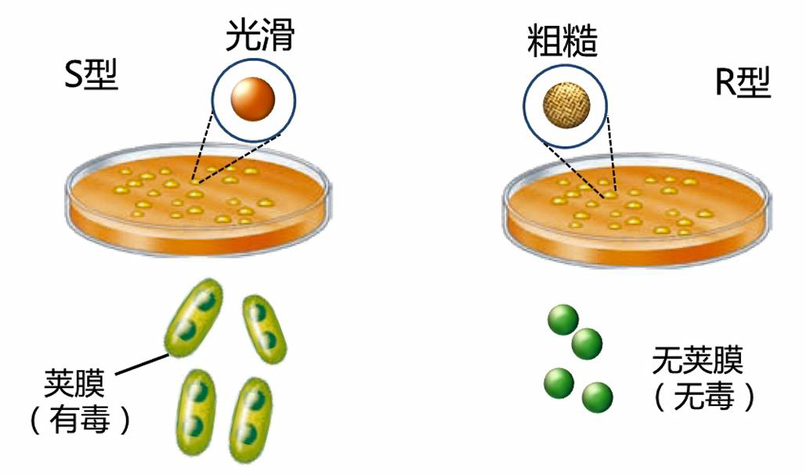
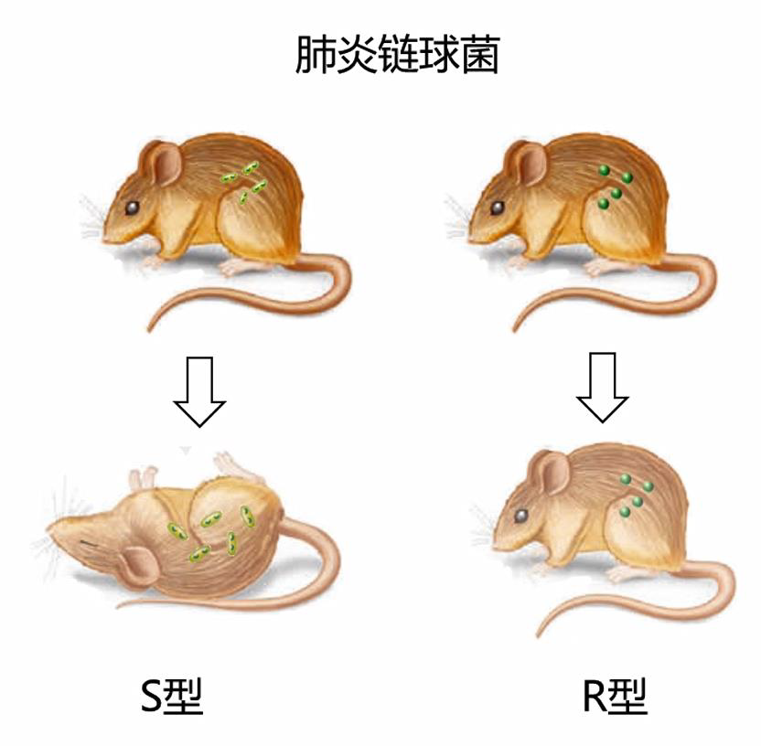
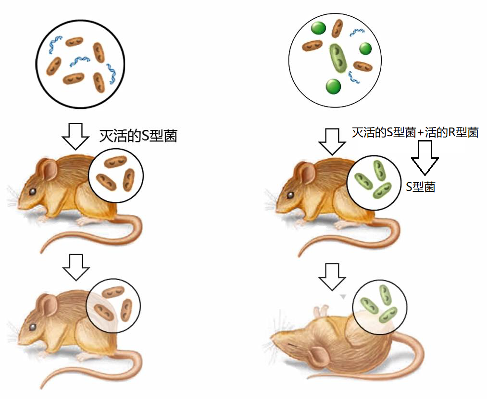
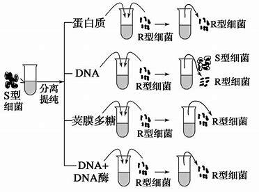
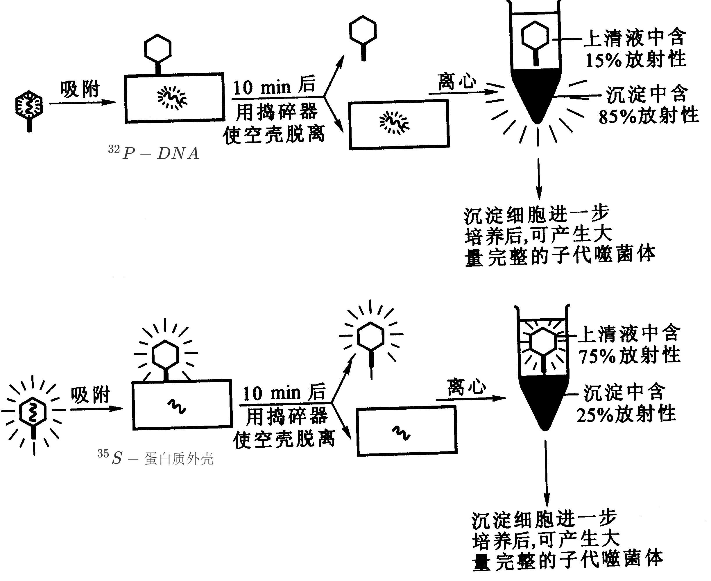
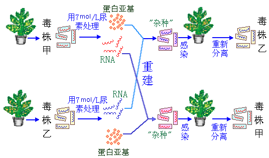

# 遗传变异的物质基础

## 遗传物质的含义

+   遗传物质
    +   即遗传信息的载体.
+   特点
    +   高度的稳定性
        +   高度稳定性又称遗传保守性,可以使物种在长期传代过程中保持其基本属性
    +   多样性
        +   多样性是指遗传物质具有编码复杂多样生物性状的能力
    +   自我复制
        +   自我复制是指能够通过精准的自我复制传给下一代

## 核酸(DNA/RNA)是遗传物质

生命活动所必须的全部信息都储存在每一种生物**核酸**上

生物大分子:蛋白质、核酸、多糖、脂类

### 证明核酸是遗传物质的经典实验

+   1928年,F.Griffith1944年0.T.Avery肺炎链球菌(英国细菌学家格里菲斯Streptococcus pneumoniae)转化试验
+   1952年,美国生物学家艾弗德.D.赫尔希A.D.Hershy,M.Chase的噬菌体感染实验.
+   3 1956年,美国生化学家弗伦克尔海因茨康尔特H.Fraenkel-Conrat的烟草花叶病毒的拆开和重建实验.

#### 1928年F.Griffth的细菌转化实验

+   肺炎链球菌
    +   S型(菌体具荚膜,菌落表面光滑,有致病能力)
    +   R型(菌体无英膜,菌落表面粗糙,无致病能力)

---

美国细菌学家艾弗里等将加热杀死的有毒菌株抽提物分别纯化

+   结论:DNA是肺炎链球菌遗传物

#### 噬菌体感染实验-1952年,A.D.Hershy,M.Chase

+   结论:该实验表明蛋白质外壳根本未进入宿主细胞,进入宿主细胞的只有DNA,但却有自身的繁殖、装配能力.

#### 植物TMV重组实验-证明RNA是TMV的遗传物质

+   结论:毒株的表型由RNA决定,与蛋白质无关.

