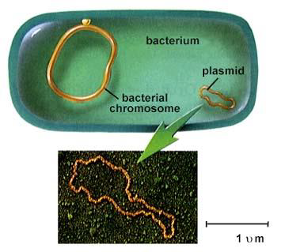

[TOC]

# 微生物基因组

## 微生物基因的概念

### 基因(gene)

是遗传的最小功能单位,它是一段特定的DNA序列.绝大多数基因的功能是编码合成多肽或蛋白质.

基因:包括开放读码框ORF(open reading frame)及其转录调控元件(启动子和终止序列)

绝大多数编码蛋白质的ORF都有完全相同的结构式,即始于DNA特殊的三联体密码子(ATG)和终止于几个特殊的终止密码子.

#### 操纵子(operon)结构

定义:

两个或两个以上功能相关的结构基因联接在一起,共同转录一个较长的mRNA分子.受同一个调节基因、操纵基因(operator)和启动区(promoter)的调控.

结构基因之间的间隔可长可短,多数情况下两基因是首尾相连的,$5'-ATGA-3'$

#### 乳糖操纵子调控模型

### 基因组(genome)

一种生物的全部的核苷酸序列称为基因组,它同时包含了**基因编码序列**和**不编码任何基因**的**DNA序列**.

## 微生物基因组结构特点

### 原核生物的基因组

+   染色体为**双链环状**的DNA
+   遗传信息具有**连续性**
+   具**操纵子结构**
+   结构基因**单拷贝**
+   **重复序列少而短**

### 真核微生物(啤酒酵母)的基因組

+   典型的真核染色体结构分布在16条染色体中
+   没有明显的操纵子结构
+   有间隔区(即非编码区)或内含子序列
+   重复序列多

### 古生菌(詹氏甲烷球菌)的基因组

+   只有$40\%$的基因与其他两界的生物有同源性
+   古生菌的基因组在结构上类似于细菌
+   负责信息传递功能的基因类似于真核生物

### 几个物种的基因组大小和所含基因的数量

$$
\Large \begin{array}{|l|l|l|l|l|l|}
\hline \text { 物 } \quad \text { 种 } & \begin{array}{c}
\text { 基因组 } \\
(\mathbf{M b})
\end{array} & \text { 基因数 } & \text { 物 } \quad \text { 种 } & \begin{array}{c}
\text { 基因组 } \\
(\mathbf{M b})
\end{array} & \text { 基因数 } \\
\hline \text { 生殖器支原体 } & \mathbf{0 . 5 8} & \mathbf{4 7 0} & \text { 酿酒酵母 } & \mathbf{1 3 . 5} & \mathbf{6 0 3 4} \\
\hline \text { 沙眼立克次体 } & \mathbf{1 . 1 1} & \mathbf{8 4 3} & \text { 裂殖酵母 } & \mathbf{1 2 . 5} & \mathbf{4 9 2 9} \\
\hline \text { 流感嗜血杆菌 } & \mathbf{1 . 8 3} & \mathbf{1 7 4 3} & \text { 拟南节 } & \mathbf{1 1 9} & \mathbf{2 5 4 9 8} \\
\hline \text { 甲烷球菌 } & \mathbf{1 . 6 6} & \mathbf{1 7 3 8} & \text { 水稻 } & \mathbf{4 6 6} & \mathbf{3 0 0 0 0} \\
\hline \text { 枯草芽抱杆菌 } & \mathbf{4 . 2} & \mathbf{4 1 0 0} & \text { 黑腹果虹 } & \mathbf{1 6 5} & \mathbf{1 3 6 0 1} \\
\hline \text { 大肠杆菌 } & \mathbf{4 . 6} & \mathbf{4 2 8 8} & \text { 秀丽线虫 } & \mathbf{9 7} & \mathbf{1 8 4 2 4} \\
\hline \text { 结核分枝杆菌 } & 4.41 & 3924 & \text { 人类 } & \mathbf{3 3 0 0} & \mathbf{3 0 0 0 0} \\
\hline
\end{array}
$$

## 基因组存在的主要形式

### 染色体

DNA主要的存在形式

### 染色体以外的遗传成分

质粒DNA、转座元件和真核微生物的细胞器(线粒体和叶绿体)DNA

#### 质粒(Plasmid)

是染色体外能自主复制的遗传成分,大多以环状双螺旋DNA分子存在.

>    含有关于**次级代谢的遗传信息**

+   按功能分,质粒的类型有
    +   致育因子(fertility factor,F因子)
        +   又称F质粒,与大肠杆菌的接合作用有关
    +   抗性因子(resistance factor,R因子)
        +   抗药性和抗重金属,简称R质粒
    +   细菌素质粒
        +   比如：Col质粒含有编码大肠菌素的基因
    +   降解质粒
        +   携带有能降解某些物质的酶的基因
    +   共生质粒
        +   携带有与固氮有关的基因
    +   毒性质粒
        +   具有编码毒素的基因

#### 转座因子

具有在染色体上不同部位间移动能力的遗传成分.它可以在同一细胞内DNA复制子间转移,也可以在一个复制子内部转移.

芭芭拉·麦克林托克在进行玉米的遗传学研究时首先发现的。1983年度诺贝尔奖

##### 原核生物的转座因子

(一)**插入序列($IS$)**也称跳跃基因,可以在染色体和质粒的许多位点插入并改换位点.

(二)**转座子($Tn$)**是能够插入到染色体和或质粒不同位点的一段DNA序列,既能移动到不同位点上去,本身也可以复制,转座后在原来的位置仍可保留一份拷贝.

(三)**转座噬菌体**不但控制自身的复制,而且能在微生物细胞之间进行转移.

